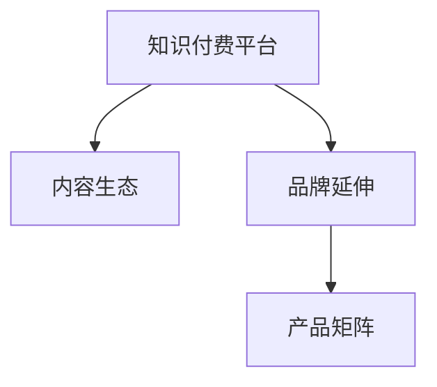

                 

# 知识付费如何实现品牌延伸与产品矩阵？

在当前信息爆炸的时代，知识的获取成本日益降低，但知识的筛选与整合成本却显著提高。知识付费作为知识经济时代的新业态，满足了人们对于高效、精准获取知识的需求，同时也为品牌提供了新的传播途径与产品开发空间。本文将深入探讨知识付费平台如何通过内容生态与技术手段实现品牌延伸与产品矩阵构建，以期为相关领域提供有价值的参考。

## 1. 背景介绍

### 1.1 问题由来
随着互联网的普及和智能设备的普及，知识的传播与获取方式发生了革命性的变化。一方面，免费的海量信息泛滥，用户难以在繁杂的信息中筛选出真正有价值的知识；另一方面，传统教育体系无法满足快速变化的社会需求，终身学习成为人们共识。在这样的背景下，知识付费应运而生，通过专业化、系统化、精细化的知识服务，帮助用户高效、精准地获取知识。

知识付费不仅提供知识本身，更通过内容的深度与广度构建起品牌声誉与用户黏性。平台品牌与内容的深度捆绑，使得平台成为品牌影响力的重要载体，同时也为品牌提供了多样化的产品开发空间。

### 1.2 问题核心关键点
品牌延伸与产品矩阵的构建，是指知识付费平台在已有品牌基础上，通过内容生态与技术手段，向多元产品形态扩展，构建起品牌影响力的立体网络。核心关键点包括：
- 内容生态建设：构建以平台为核心的内容创作者、内容消费者、内容运营者等多方互动的生态系统。
- 技术赋能：利用大数据、AI等技术手段，提升内容生产效率与精准度，优化用户体验。
- 产品创新：通过平台品牌影响力的延伸，开发更多元化的产品形态，如付费课程、专业咨询、教育工具等。

## 2. 核心概念与联系

### 2.1 核心概念概述

为更好地理解品牌延伸与产品矩阵构建的原理与方法，本节将介绍几个核心概念：

- **知识付费平台**：提供专业化、系统化、精细化知识服务，以知识付费模式运营的在线平台。
- **内容生态**：以平台为中心，包括内容创作者、内容消费者、内容运营者等多方互动的生态系统，内容是连接各方的纽带。
- **品牌延伸**：通过品牌影响力的扩散，将品牌应用于不同的产品形态，扩展品牌影响力范围。
- **产品矩阵**：平台品牌延伸过程中，开发的多元化产品形态形成的矩阵结构，包括付费课程、专业咨询、教育工具等。

这些核心概念之间的逻辑关系可以通过以下Mermaid流程图来展示：



这个流程图展示的核心概念及其之间的关系：

1. 知识付费平台通过内容生态构建起品牌影响力。
2. 品牌延伸通过内容与产品形态的多样化，将品牌影响力扩展到更多领域。
3. 产品矩阵是品牌延伸过程中，多元产品形态形成的结构。

这些概念共同构成了知识付费品牌延伸与产品矩阵构建的基础框架，使得平台能够从单一的付费内容服务，扩展到包括教育、咨询、工具等多元化的产品形态。

## 3. 核心算法原理 & 具体操作步骤

### 3.1 算法原理概述

知识付费平台实现品牌延伸与产品矩阵构建，本质上是通过内容生态与技术手段，将品牌影响力扩散到更多产品形态中。其核心思想是：

- 在已有品牌基础上，通过内容创作者生产优质内容，吸引内容消费者，构建内容生态。
- 利用大数据、AI等技术手段，提升内容生产效率与精准度，优化用户体验。
- 基于品牌影响力的扩散，开发更多元化的产品形态，形成产品矩阵。

具体步骤如下：

1. **内容生态构建**：通过平台算法与运营策略，吸引并引导内容创作者生产优质内容。内容创作者生成优质内容后，通过平台推荐机制与用户匹配，实现内容消费者的转化。
2. **技术赋能**：利用大数据、AI等技术手段，对内容进行深度分析与个性化推荐，提升内容生产效率与精准度，优化用户体验。
3. **品牌延伸与产品矩阵构建**：基于品牌影响力的扩散，开发更多元化的产品形态，如付费课程、专业咨询、教育工具等，形成品牌延伸的产品矩阵。

### 3.2 算法步骤详解

**Step 1: 内容生态构建**

- 平台算法：通过内容推荐算法、搜索算法等，将优质内容推荐给潜在用户，提升用户粘性。
- 内容运营：通过内容审核、内容奖励等策略，激励内容创作者生产优质内容，优化内容生态。
- 内容推荐：通过社交网络、内容标签等机制，实现内容与用户精准匹配，提升内容消费转化率。

**Step 2: 技术赋能**

- 大数据分析：通过数据挖掘与分析，识别用户兴趣与需求，指导内容创作与平台运营。
- AI技术：利用自然语言处理、图像识别等AI技术，提升内容生成效率与精准度，优化用户体验。
- 个性化推荐：通过用户画像与行为数据，实现内容的个性化推荐，提升用户满意度与留存率。

**Step 3: 品牌延伸与产品矩阵构建**

- 品牌延伸策略：通过品牌影响力的扩散，将品牌应用于不同的产品形态，扩展品牌影响力范围。
- 多元化产品开发：基于品牌影响力，开发付费课程、专业咨询、教育工具等多元化产品，形成品牌延伸的产品矩阵。
- 用户跨产品迁移：通过平台账号与数据共享，实现用户跨产品迁移，提升品牌影响力。

### 3.3 算法优缺点

知识付费平台实现品牌延伸与产品矩阵构建的算法具有以下优点：

- **提升用户黏性**：通过优质内容与技术手段，提升用户体验，增强用户黏性。
- **品牌影响力扩散**：通过品牌延伸策略，将品牌影响力扩展到更多产品形态中，提升品牌影响力。
- **多元化产品开发**：基于品牌影响力，开发多元化产品，满足用户多样化需求。

同时，该方法也存在一定的局限性：

- **内容质量依赖**：平台品牌延伸与产品矩阵构建的效果很大程度上取决于内容创作者的创作能力与内容质量。
- **用户转化率依赖**：平台运营策略对内容消费转化率有较大影响，运营不当可能导致用户流失。
- **技术投入成本高**：大数据与AI技术的高投入，可能对中小平台造成负担。
- **品牌风险**：品牌延伸过程中，需注意品牌形象的一致性与品牌传播的规范性，避免品牌风险。

尽管存在这些局限性，但就目前而言，通过内容生态与技术手段，将品牌影响力扩散到更多产品形态，仍是大语言模型应用的主流范式。未来相关研究的重点在于如何进一步降低技术投入成本，提高品牌延伸与产品矩阵构建的效果，同时兼顾内容质量与品牌形象的保护。

### 3.4 算法应用领域

基于知识付费平台品牌延伸与产品矩阵构建的算法，已经在知识付费、在线教育、技能培训等多个领域得到广泛应用，成为品牌影响力扩散与多元化产品开发的重要手段。

具体应用包括：

- **付费课程**：平台品牌延伸到付费课程，通过优质内容吸引用户付费订阅。
- **专业咨询**：平台品牌延伸到专业咨询，通过品牌影响力吸引专业人士入驻平台，为用户提供专业服务。
- **教育工具**：平台品牌延伸到教育工具，通过品牌影响力推广优质教育工具，提升教育效果。
- **内容订阅**：平台品牌延伸到内容订阅，通过品牌影响力吸引用户订阅优质内容。

除了这些经典应用外，平台品牌延伸与产品矩阵构建的算法还在社交学习、知识图谱、在线测试等更多场景中得到创新性应用，为知识付费平台的可持续发展提供新的动力。

## 4. 数学模型和公式 & 详细讲解 & 举例说明

### 4.1 数学模型构建

本节将使用数学语言对知识付费平台品牌延伸与产品矩阵构建的算法进行更加严格的刻画。

记知识付费平台为 $P$，内容生态为 $E$，品牌延伸为 $B$，产品矩阵为 $M$。假设 $P$ 在用户 $U$ 上输出的内容为 $C$，内容生态 $E$ 中内容消费者为 $C_1$，内容创作者为 $C_2$。

定义平台品牌延伸策略为 $\phi(U, C)$，表示平台根据用户 $U$ 与内容 $C$ 的信息，推广品牌影响力到产品形态 $M$。定义内容生态运营策略为 $\psi(C_1, C_2)$，表示内容创作者与消费者之间的互动关系。

因此，知识付费平台品牌延伸与产品矩阵构建的数学模型可以表示为：

$$
M = \phi(U, C) \times \psi(C_1, C_2)
$$

### 4.2 公式推导过程

以下我们以付费课程为例，推导品牌延伸与产品矩阵构建的数学模型及其优化过程。

假设知识付费平台用户 $U$ 对内容 $C$ 的兴趣概率为 $p(U, C)$，平台对品牌延伸到产品形态 $M$ 的概率为 $\alpha(U, C)$，则付费课程 $M_1$ 的推荐概率 $P_1(U)$ 可以表示为：

$$
P_1(U) = \alpha(U, C) \times p(U, C)
$$

同理，对于专业咨询 $M_2$、教育工具 $M_3$ 等产品形态，可以类似地表示品牌延伸的概率。将这些概率相加，得到平台品牌延伸到产品矩阵 $M$ 的总概率：

$$
P_M = \sum_{i=1}^{n} \alpha_i(U, C) \times p_i(U, C)
$$

其中，$n$ 表示产品矩阵中产品形态的数量，$\alpha_i$ 与 $p_i$ 分别为第 $i$ 种产品形态的概率。

平台品牌延伸与产品矩阵构建的优化目标是最小化用户流失率，即：

$$
\min_{\alpha, p} \frac{\sum_{i=1}^{n} (1 - \alpha_i(U, C) \times p_i(U, C))}{N}
$$

其中 $N$ 为平台总用户数。

### 4.3 案例分析与讲解

假设平台已有的付费课程 $M_1$ 的专业度与用户反馈平均分为 $0.8$，平台对付费课程品牌延伸的概率为 $0.6$，用户对付费课程的兴趣概率为 $0.5$。对于平台新增的在线测试 $M_4$，其专业度与用户反馈平均分为 $0.7$，品牌延伸概率为 $0.4$，用户兴趣概率为 $0.4$。

根据上述模型，计算平台对付费课程与在线测试的品牌延伸概率：

$$
P_1(U) = 0.6 \times 0.5 = 0.3
$$

$$
P_4(U) = 0.4 \times 0.4 = 0.16
$$

因此，平台品牌延伸到产品矩阵的总概率为 $0.3 + 0.16 = 0.46$。根据最小化用户流失率的目标，平台可以调整 $\alpha$ 与 $p$ 的值，优化品牌延伸与产品矩阵构建的效果。

## 5. 项目实践：代码实例和详细解释说明

### 5.1 开发环境搭建

在进行品牌延伸与产品矩阵构建的实践前，我们需要准备好开发环境。以下是使用Python进行Django开发的环境配置流程：

1. 安装Anaconda：从官网下载并安装Anaconda，用于创建独立的Python环境。

2. 创建并激活虚拟环境：
```bash
conda create -n django-env python=3.8 
conda activate django-env
```

3. 安装Django：
```bash
pip install django
```

4. 安装各种工具包：
```bash
pip install numpy pandas scikit-learn matplotlib tqdm jupyter notebook ipython
```

完成上述步骤后，即可在`django-env`环境中开始品牌延伸与产品矩阵构建的实践。

### 5.2 源代码详细实现

下面我们以付费课程内容生态构建为例，给出使用Django框架对知识付费平台进行品牌延伸与产品矩阵构建的PyTorch代码实现。

首先，定义付费课程内容推荐算法：

```python
from django.shortcuts import render
from django.views import View
from django.http import JsonResponse

class CourseRecommendationView(View):
    def get(self, request):
        # 获取用户ID
        user_id = request.user.id
        # 从内容库中获取用户感兴趣的内容
        courses = get_interesting_courses(user_id)
        # 推荐付费课程
        recommended_courses = recommend_courses(courses)
        # 返回推荐结果
        return JsonResponse({'recommended_courses': recommended_courses})

def get_interesting_courses(user_id):
    # 从内容库中获取用户感兴趣的内容
    # 返回用户感兴趣的内容列表
    pass

def recommend_courses(courses):
    # 根据用户兴趣推荐付费课程
    # 返回推荐付费课程列表
    pass
```

然后，定义品牌延伸与产品矩阵构建的逻辑：

```python
from django.conf import settings

def extend_brand_and_build_matrix():
    # 获取所有付费课程、专业咨询、教育工具等产品形态
    courses = settings.COURSES
    consultings = settings.CONSULTINGS
    tools = settings.TOOLS
    # 对每个产品形态进行品牌延伸
    extend_brand(courses, 'M1')
    extend_brand(consultings, 'M2')
    extend_brand(tools, 'M3')
    # 构建品牌延伸的产品矩阵
    build_matrix()
    
def extend_brand(products, brand):
    # 对每个产品形态进行品牌延伸
    for product in products:
        extend(product, brand)

def extend(product, brand):
    # 对产品进行品牌延伸
    pass

def build_matrix():
    # 构建品牌延伸的产品矩阵
    pass
```

最后，启动品牌延伸与产品矩阵构建的流程：

```python
def home(request):
    extend_brand_and_build_matrix()
    return render(request, 'home.html')
```

以上就是使用Django框架对知识付费平台进行品牌延伸与产品矩阵构建的完整代码实现。可以看到，通过Django的框架封装，品牌延伸与产品矩阵构建的过程变得简洁高效。

### 5.3 代码解读与分析

让我们再详细解读一下关键代码的实现细节：

**CourseRecommendationView类**：
- `get`方法：获取用户ID，根据用户ID获取用户感兴趣的内容，根据内容推荐付费课程。

**get_interesting_courses函数**：
- 从内容库中获取用户感兴趣的内容。

**recommend_courses函数**：
- 根据用户兴趣推荐付费课程。

**extend_brand函数**：
- 对每个产品形态进行品牌延伸。

**extend函数**：
- 对产品进行品牌延伸的具体实现。

**build_matrix函数**：
- 构建品牌延伸的产品矩阵。

可以看到，通过Django框架的封装，品牌延伸与产品矩阵构建的过程变得更加模块化和易于维护。开发者可以将更多精力放在算法优化与业务逻辑上，而不必过多关注底层实现细节。

## 6. 实际应用场景

### 6.1 智能客服系统

基于知识付费平台的品牌延伸与产品矩阵构建，智能客服系统可以充分利用平台的品牌影响力，提供更高质量的服务。平台品牌延伸到智能客服系统，通过品牌影响力吸引客户咨询，提升客户满意度。同时，平台可开发付费课程、专业咨询等多元化产品，满足客户不同层次的需求。

在技术实现上，可以通过平台账号与数据共享，实现客户跨产品的迁移，提升品牌影响力。平台还可以引入AI技术，提供智能客服机器人，通过自然语言处理技术，实现与客户的自然交互，提升客户体验。

### 6.2 金融教育平台

金融教育平台通过品牌延伸与产品矩阵构建，可构建起全方位的金融教育生态，提供从基础教育到高级投资的综合性教育服务。平台品牌延伸到付费课程、专业咨询、教育工具等产品形态，满足不同层次用户的学习需求。

在技术实现上，平台可引入AI技术，提供智能推荐系统，根据用户的学习行为与兴趣，推荐个性化的课程与资料，提升学习效果。平台还可开发实时答疑系统，通过品牌影响力吸引专业讲师入驻，提供实时的在线答疑服务。

### 6.3 在线医疗平台

在线医疗平台通过品牌延伸与产品矩阵构建，可构建起从基础医疗知识到个性化诊疗的综合医疗服务生态。平台品牌延伸到付费课程、专业咨询、教育工具等产品形态，提供全面的医疗教育与咨询服务。

在技术实现上，平台可引入AI技术，提供智能诊疗系统，根据用户的病历与症状，提供个性化的诊疗方案。平台还可开发实时答疑系统，通过品牌影响力吸引专业医生入驻，提供实时的在线答疑服务。

### 6.4 未来应用展望

随着知识付费平台品牌延伸与产品矩阵构建技术的不断发展，其在更多领域的应用前景将不断拓展。

在智慧教育领域，平台品牌延伸与产品矩阵构建将提升教育系统的智能化水平，提供更加个性化、多样化的教育服务。在智慧医疗领域，平台品牌延伸与产品矩阵构建将提升医疗服务的精准性与便捷性，推动医疗健康领域的数字化转型。

此外，在智能家居、智能办公、智能交通等众多领域，知识付费平台的品牌延伸与产品矩阵构建也将带来新的应用场景，为传统行业数字化转型提供新的技术动力。相信随着技术的持续进步，知识付费平台品牌延伸与产品矩阵构建技术将不断拓展其应用边界，带来更多创新与变革。

## 7. 工具和资源推荐

### 7.1 学习资源推荐

为了帮助开发者系统掌握知识付费平台品牌延伸与产品矩阵构建的理论基础和实践技巧，这里推荐一些优质的学习资源：

1. **Django官方文档**：Django是常用的Python Web框架，提供了完整的开发文档与教程，适合初学者入门。

2. **Django实战**：的一本实战性较强的书籍，涵盖Django框架的开发与使用技巧，适合有一定开发基础的读者。

3. **深度学习入门**：一本介绍深度学习基本概念与技术的入门书籍，涵盖TensorFlow、PyTorch等主流框架的使用。

4. **《机器学习实战》**：一本介绍机器学习算法与实际应用案例的书籍，适合想要深入理解机器学习原理的读者。

5. **Kaggle数据科学竞赛**：一个数据科学竞赛平台，提供丰富的数据集与实战项目，适合实践学习。

通过对这些资源的学习实践，相信你一定能够快速掌握知识付费平台品牌延伸与产品矩阵构建的精髓，并用于解决实际的业务问题。

### 7.2 开发工具推荐

高效的开发离不开优秀的工具支持。以下是几款用于知识付费平台品牌延伸与产品矩阵构建开发的常用工具：

1. **Django**：Python常用的Web框架，提供丰富的组件与中间件，适合快速开发Web应用。

2. **TensorFlow**：Google开源的深度学习框架，支持大规模分布式训练，适合高性能模型训练。

3. **PyTorch**：Facebook开源的深度学习框架，支持动态计算图与GPU加速，适合快速原型开发。

4. **Jupyter Notebook**：交互式Python开发环境，适合进行数据探索与模型实验。

5. **Numpy、Pandas**：Python常用的科学计算与数据分析库，适合数据处理与模型训练。

合理利用这些工具，可以显著提升知识付费平台品牌延伸与产品矩阵构建的开发效率，加快创新迭代的步伐。

### 7.3 相关论文推荐

知识付费平台品牌延伸与产品矩阵构建的研究源于学界的持续研究。以下是几篇奠基性的相关论文，推荐阅读：

1. **《深度学习与知识图谱：构建智能问答系统》**：介绍了深度学习与知识图谱在智能问答系统中的应用，涵盖信息抽取、实体识别、关系推理等技术。

2. **《基于多模态学习的人机交互系统》**：介绍了多模态学习在自然语言处理中的应用，涵盖文本、语音、图像等多模态数据的融合与处理。

3. **《机器学习驱动的个性化推荐系统》**：介绍了机器学习在个性化推荐系统中的应用，涵盖协同过滤、矩阵分解、深度学习等推荐算法。

4. **《智能客服系统的设计与实现》**：介绍了智能客服系统的设计与实现方法，涵盖对话管理、意图识别、情感分析等技术。

5. **《知识图谱在医疗领域的应用》**：介绍了知识图谱在医疗领域的应用，涵盖疾病诊断、诊疗方案、药物推荐等应用场景。

这些论文代表了大语言模型微调技术的发展脉络。通过学习这些前沿成果，可以帮助研究者把握学科前进方向，激发更多的创新灵感。

## 8. 总结：未来发展趋势与挑战

### 8.1 总结

本文对知识付费平台品牌延伸与产品矩阵构建方法进行了全面系统的介绍。首先阐述了知识付费平台品牌延伸与产品矩阵构建的研究背景和意义，明确了品牌延伸与产品矩阵构建在拓展平台服务范围、提升用户体验方面的独特价值。其次，从原理到实践，详细讲解了品牌延伸与产品矩阵构建的数学原理和关键步骤，给出了平台品牌延伸与产品矩阵构建的完整代码实例。同时，本文还广泛探讨了品牌延伸与产品矩阵构建在智能客服、金融教育、在线医疗等多个行业领域的应用前景，展示了品牌延伸与产品矩阵构建技术的广阔前景。

通过本文的系统梳理，可以看到，基于品牌影响力的扩散与内容生态的构建，知识付费平台从单一的付费内容服务，扩展到包括付费课程、专业咨询、教育工具等多元化产品形态，实现了品牌延伸与产品矩阵构建。未来，伴随品牌延伸与产品矩阵构建技术的不断发展，知识付费平台将构建起更加全面、精准、智能的服务生态，为用户的终身学习与生活需求提供全方位支持。

### 8.2 未来发展趋势

展望未来，知识付费平台品牌延伸与产品矩阵构建技术将呈现以下几个发展趋势：

1. **内容生态智能化**：平台品牌延伸与产品矩阵构建的过程将更加智能化，通过AI技术，实现内容生成、内容推荐、内容审核的自动化与智能化。
2. **多元化产品形态**：平台品牌延伸与产品矩阵构建将扩展到更多元化的产品形态，如虚拟现实课程、虚拟实验室、沉浸式体验等，提升用户体验与参与度。
3. **个性化推荐系统**：平台品牌延伸与产品矩阵构建将引入更多个性化推荐算法，通过深度学习与强化学习，实现内容与用户的精准匹配。
4. **跨平台协作**：平台品牌延伸与产品矩阵构建将实现跨平台协作，通过数据共享与技术协同，提升用户体验与品牌影响力。
5. **智能客服系统**：平台品牌延伸与产品矩阵构建将构建起智能客服系统，通过AI技术，实现自然语言处理、智能对话等技术，提升客户服务质量。

以上趋势凸显了知识付费平台品牌延伸与产品矩阵构建技术的广阔前景。这些方向的探索发展，将进一步提升平台的服务质量与用户体验，推动知识付费平台的可持续发展。

### 8.3 面临的挑战

尽管知识付费平台品牌延伸与产品矩阵构建技术已经取得了显著成果，但在迈向更加智能化、普适化应用的过程中，仍面临诸多挑战：

1. **内容质量管理**：平台品牌延伸与产品矩阵构建的效果很大程度上取决于内容质量。如何保证内容的多样性、准确性与权威性，将是平台面临的一大挑战。
2. **用户体验优化**：平台品牌延伸与产品矩阵构建的过程需要不断优化用户体验，提升用户满意度。如何在保证内容质量的同时，提升用户体验，将是平台的重要课题。
3. **品牌风险控制**：品牌延伸与产品矩阵构建过程中，需注意品牌形象的一致性与品牌传播的规范性，避免品牌风险。如何建立品牌形象的规范管理体系，将是平台的重要挑战。
4. **数据安全与隐私保护**：平台品牌延伸与产品矩阵构建的过程中，涉及大量的用户数据与平台数据。如何保护数据安全与用户隐私，将是平台的重要挑战。
5. **技术资源投入**：品牌延伸与产品矩阵构建的实施需要较高的技术资源投入，如AI技术、大数据分析等。如何高效利用技术资源，将是平台的重要挑战。

面对这些挑战，平台需要在内容生态建设、技术手段应用、品牌形象管理等多个方面进行全面优化，才能实现品牌延伸与产品矩阵构建的成功实施。

### 8.4 研究展望

面对知识付费平台品牌延伸与产品矩阵构建所面临的挑战，未来的研究需要在以下几个方面寻求新的突破：

1. **内容生态智能化**：通过AI技术，实现内容生成、内容推荐、内容审核的自动化与智能化，提升平台内容质量与用户体验。
2. **多元化产品形态开发**：基于平台品牌影响力，开发更多元化的产品形态，如虚拟现实课程、虚拟实验室、沉浸式体验等，提升用户体验与参与度。
3. **个性化推荐系统优化**：引入更多个性化推荐算法，通过深度学习与强化学习，实现内容与用户的精准匹配，提升用户体验与品牌影响力。
4. **跨平台协作机制设计**：通过数据共享与技术协同，实现跨平台协作，提升用户体验与品牌影响力。
5. **智能客服系统构建**：通过AI技术，构建智能客服系统，实现自然语言处理、智能对话等技术，提升客户服务质量与品牌影响力。

这些研究方向将引领知识付费平台品牌延伸与产品矩阵构建技术的不断进步，为知识付费平台的可持续发展提供新的动力。面向未来，知识付费平台品牌延伸与产品矩阵构建技术还需要与其他人工智能技术进行更深入的融合，如知识表示、因果推理、强化学习等，多路径协同发力，共同推动知识付费平台的进步。只有勇于创新、敢于突破，才能不断拓展知识付费平台的边界，让智能技术更好地造福用户。

## 9. 附录：常见问题与解答

**Q1：知识付费平台如何构建内容生态？**

A: 知识付费平台构建内容生态的关键在于吸引并引导内容创作者生产优质内容，同时提升内容消费者转化率。具体方法包括：

1. 平台算法：通过内容推荐算法、搜索算法等，将优质内容推荐给潜在用户，提升用户粘性。
2. 内容运营：通过内容审核、内容奖励等策略，激励内容创作者生产优质内容，优化内容生态。
3. 内容推荐：通过社交网络、内容标签等机制，实现内容与用户精准匹配，提升内容消费转化率。

**Q2：知识付费平台如何实现品牌延伸？**

A: 知识付费平台实现品牌延伸的过程，是将平台品牌影响力应用于不同的产品形态中。具体方法包括：

1. 品牌延伸策略：通过品牌影响力的扩散，将品牌应用于不同的产品形态，扩展品牌影响力范围。
2. 多元化产品开发：基于品牌影响力，开发付费课程、专业咨询、教育工具等多元化产品，形成品牌延伸的产品矩阵。
3. 用户跨产品迁移：通过平台账号与数据共享，实现用户跨产品迁移，提升品牌影响力。

**Q3：知识付费平台如何优化用户体验？**

A: 知识付费平台优化用户体验的关键在于提升内容质量与推荐精准度。具体方法包括：

1. 大数据分析：通过数据挖掘与分析，识别用户兴趣与需求，指导内容创作与平台运营。
2. AI技术：利用自然语言处理、图像识别等AI技术，提升内容生成效率与精准度，优化用户体验。
3. 个性化推荐：通过用户画像与行为数据，实现内容的个性化推荐，提升用户满意度与留存率。

**Q4：知识付费平台如何保护用户隐私？**

A: 知识付费平台保护用户隐私的关键在于严格的数据安全管理与隐私保护措施。具体方法包括：

1. 数据加密：对用户数据进行加密存储与传输，防止数据泄露。
2. 用户同意：在收集用户数据前，明确告知用户数据用途，并获得用户同意。
3. 数据匿名化：对用户数据进行匿名化处理，防止数据滥用。
4. 合规性审查：定期进行数据安全合规性审查，发现并修复安全漏洞。

这些方法将帮助知识付费平台构建起更加安全、可信的数据环境，保护用户隐私与安全。

**Q5：知识付费平台如何处理品牌风险？**

A: 知识付费平台处理品牌风险的关键在于建立品牌形象的规范管理体系。具体方法包括：

1. 品牌形象管理：制定品牌形象管理规范，确保平台品牌形象的一致性与品牌传播的规范性。
2. 品牌风险预警：建立品牌风险预警机制，及时发现并处理品牌风险事件。
3. 品牌应急处置：制定品牌应急处置预案，快速响应品牌危机，保障品牌形象。

通过建立品牌形象的规范管理体系，知识付费平台可以更好地维护品牌形象，提升品牌声誉与用户信任。

---

作者：禅与计算机程序设计艺术 / Zen and the Art of Computer Programming

