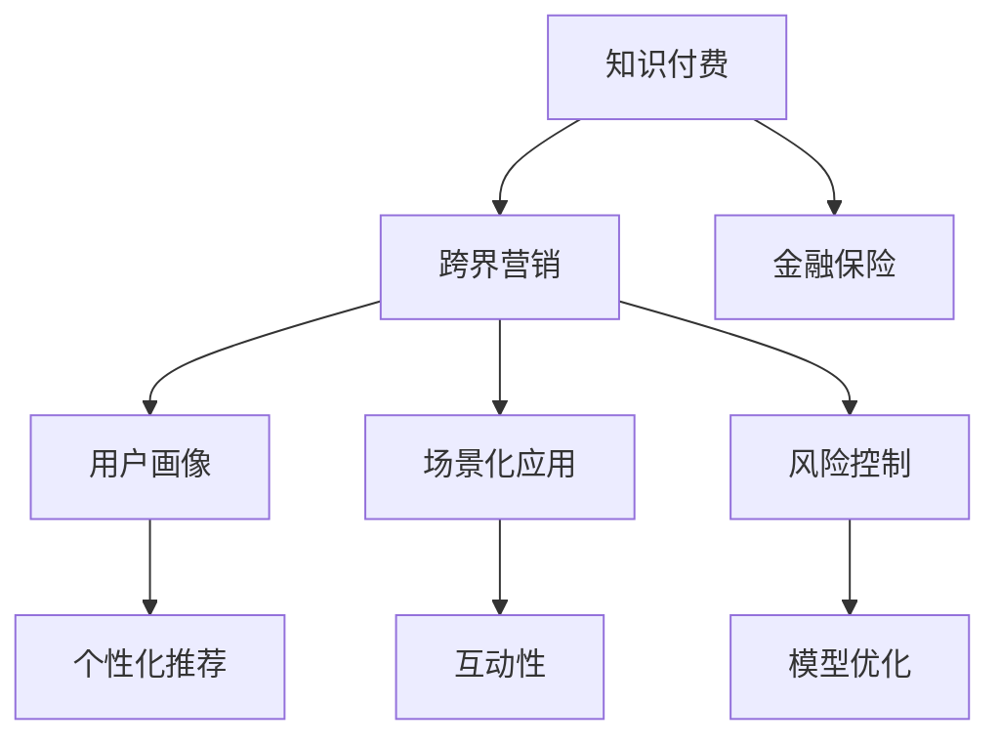

                 

# 知识付费如何实现跨界营销与金融保险跨界？

## 1. 背景介绍

### 1.1 问题由来
知识付费作为互联网发展的新模式，近年来在内容创造和消费方面取得了飞速的发展。通过收费形式，知识付费平台能够筛选优质内容，激励专业创作者，同时满足用户对深度、高质量信息的需求。然而，随着用户规模的不断扩大，平台之间的竞争日趋激烈，如何差异化定位、提升用户黏性、实现商业变现，成为知识付费平台亟待解决的问题。

另一方面，金融保险行业作为国民经济的支柱产业，面临市场竞争加剧、用户需求多样化的挑战。传统保险产品缺乏用户粘性，难以满足年轻一代对保障型、体验型保险产品的需求。如何结合互联网创新思维，构建新的商业模式，实现业务创新，提高用户覆盖率和业务渗透率，是金融保险行业亟需解决的课题。

面对知识付费和金融保险行业的共同挑战，如何通过跨界合作，实现资源共享和业务模式创新，成为业界探讨的新方向。本文将从理论和技术角度，深入探讨知识付费与金融保险的跨界营销方法，为行业提供新的发展思路。

## 2. 核心概念与联系

### 2.1 核心概念概述

为更好地理解知识付费与金融保险的跨界营销方法，本节将介绍几个关键概念：

- **知识付费**：一种基于互联网的付费模式，用户为获取高质量信息、知识和技能而支付费用，以支持专业创作者和平台发展。
- **金融保险**：涵盖银行、证券、保险等多个领域的综合性金融服务体系，为个人和企业提供风险管理和财务规划。
- **跨界营销**：不同行业、领域之间通过资源整合、协同创新，实现互利共赢的营销策略。
- **用户画像**：通过大数据、机器学习等技术，刻画用户的基本属性、行为习惯、兴趣偏好等，从而实现精准营销。
- **场景化应用**：将服务融入到用户日常生活的具体场景中，提升用户体验和参与度。
- **风险控制**：通过大数据、人工智能等技术，对保险产品进行风险评估和控制，防范金融风险。

这些核心概念之间的逻辑关系可以通过以下Mermaid流程图来展示：



这个流程图展示的知识付费、跨界营销、金融保险三大概念及其之间的关系：

1. 知识付费和金融保险通过跨界营销实现资源整合和业务创新。
2. 用户画像通过大数据分析构建，用以支持个性化推荐和精准营销。
3. 场景化应用通过融入用户生活场景，提升服务体验和用户粘性。
4. 风险控制通过大数据和人工智能技术，防范金融风险。

## 3. 核心算法原理 & 具体操作步骤

### 3.1 算法原理概述

知识付费与金融保险的跨界营销，本质上是一个复杂的协同创新过程。其核心思想是：通过整合两大行业的优势资源，构建联合营销平台，实现用户需求的双重满足和商业变现的多元化。

形式化地，假设知识付费平台为 $KP$，金融保险平台为 $F$，用户群体为 $U$，联合营销平台为 $JP$。目标是最大化用户覆盖率 $C$ 和商业变现收益 $R$。具体目标为：

$$
\max_{JP} C(U, JP) + R(F, JP)
$$

其中 $C(U, JP)$ 为知识付费平台的覆盖率，$R(F, JP)$ 为金融保险平台的收益。联合营销平台 $JP$ 通过整合两大平台的用户画像、内容资源和服务能力，实现资源共享和业务协同，提升整体效益。

### 3.2 算法步骤详解

基于协同创新的跨界营销方法，一般包括以下几个关键步骤：

**Step 1: 建立跨界合作框架**
- 选择适合的合作方，共同制定跨界营销的合作协议，明确各方在资源、技术、市场等方面的分工。
- 建立数据共享机制，保障用户隐私和数据安全。

**Step 2: 整合用户画像**
- 从知识付费和金融保险平台收集用户数据，包括基本信息、行为记录、交易数据等。
- 使用数据挖掘、机器学习等技术，构建综合的用户画像，刻画用户的兴趣偏好、风险评估等信息。

**Step 3: 融合内容和服务**
- 将知识付费平台的内容资源与金融保险的服务能力进行融合，形成集知识传播与金融保障于一体的综合性服务体系。
- 通过场景化设计，将保险产品融入到用户日常生活的具体场景中，提升用户参与度和满意度。

**Step 4: 设计联合营销策略**
- 制定联合推广计划，包括活动时间、目标用户、宣传渠道等，实现资源的最优配置。
- 设计个性化的推荐算法，根据用户画像和行为数据，精准推荐知识内容或金融产品，提升用户转化率和满意度。

**Step 5: 构建风险控制体系**
- 使用大数据和人工智能技术，对用户行为和交易数据进行分析，构建风险评估模型，实现风险预警和防范。
- 定期评估和优化模型，提升风险控制的精准度和有效性。

### 3.3 算法优缺点

基于协同创新的跨界营销方法具有以下优点：
1. 资源互补。知识付费与金融保险平台各具优势，通过跨界合作，实现资源共享，提升整体效益。
2. 用户黏性增强。通过个性化推荐和场景化应用，提升用户满意度和黏性，实现双平台用户的留存和增长。
3. 商业变现多样化。通过知识付费和金融保险的协同创新，开拓新的收入渠道，提升整体收益。
4. 风险控制加强。通过大数据和人工智能技术，实现精准的风险评估和防范，提升金融产品的可信度和安全性。

同时，该方法也存在一定的局限性：
1. 数据共享难度。跨界合作需要克服数据共享和隐私保护的挑战，确保用户信息安全。
2. 协同难度较大。两大行业的商业模式、技术架构差异较大，协同创新的难度较高。
3. 用户信任问题。用户在跨界平台上的信任度可能较低，需要花时间和成本建立信任关系。
4. 业务协同复杂。跨界合作涉及多个环节，协调难度较大，容易产生协同效应不足的问题。

尽管存在这些局限性，但就目前而言，基于协同创新的跨界营销方法仍是大语言模型应用的最主流范式。未来相关研究的重点在于如何进一步降低跨界合作的复杂度，提高协同效率，同时兼顾用户隐私和信任度。

### 3.4 算法应用领域

基于协同创新的跨界营销方法，已经在知识付费和金融保险的多个领域得到应用，例如：

- 知识付费与保险理财：通过知识付费平台推荐保险产品，提升用户对保险产品的认知和信任，实现用户的转化和粘性增强。
- 在线教育与金融保障：利用在线教育平台的用户数据，开发个性化的金融保障方案，满足用户多层次、个性化的需求。
- 智能投顾与健康管理：结合智能投顾平台与健康管理服务，提供个性化的健康和财富管理方案，提升用户的生活质量和财务健康。

除了上述这些经典应用外，跨界营销还在更多场景中得到创新性的应用，如旅游与金融、游戏与金融、房地产与金融等，为金融保险业务带来了新的发展机遇。随着跨界合作的不断深化，相信知识付费与金融保险的跨界营销必将在更多领域得到广泛应用，为经济社会的发展注入新的动力。

## 4. 数学模型和公式 & 详细讲解 & 举例说明

### 4.1 数学模型构建

本节将使用数学语言对知识付费与金融保险的跨界营销过程进行更加严格的刻画。

记知识付费平台为 $KP$，金融保险平台为 $F$，用户群体为 $U$，联合营销平台为 $JP$。定义用户覆盖率 $C(U, JP)$ 和商业变现收益 $R(F, JP)$ 为以下函数：

$$
C(U, JP) = \frac{1}{|U|} \sum_{u \in U} \mathbb{I}(u \in JP(u))
$$

$$
R(F, JP) = \sum_{f \in F} f_{JP} \cdot p_f \cdot (1 - c_f)
$$

其中 $\mathbb{I}$ 为示性函数，$f_{JP}$ 为产品 $f$ 在 $JP$ 平台的销售比例，$p_f$ 为产品 $f$ 的单价，$c_f$ 为产品 $f$ 的销售成本。

### 4.2 公式推导过程

接下来，我们将推导最大化覆盖率和收益的联合营销平台的设计函数。假设 $JP$ 平台从知识付费和金融保险平台分别引入 $C_K$ 和 $C_F$ 项内容和服务，最大化 $C(U, JP) + R(F, JP)$。

定义 $JP$ 平台的用户覆盖率为：

$$
C(U, JP) = C_K \cdot C_K' + C_F \cdot C_F'
$$

其中 $C_K'$ 和 $C_F'$ 分别为知识付费和金融保险平台的覆盖率提升因子。

最大化 $C(U, JP) + R(F, JP)$ 相当于最大化：

$$
\max_{C_K, C_F} \frac{C_K \cdot C_K' + C_F \cdot C_F'}{|U|} + \sum_{f \in F} f_{JP} \cdot p_f \cdot (1 - c_f)
$$

引入拉格朗日乘子 $\lambda$，构造拉格朗日函数：

$$
\mathcal{L}(C_K, C_F, \lambda) = \frac{C_K \cdot C_K' + C_F \cdot C_F'}{|U|} + \lambda(C_K + C_F - 1)
$$

对 $C_K$ 和 $C_F$ 求导，得：

$$
\frac{\partial \mathcal{L}}{\partial C_K} = \frac{C_K'}{|U|} + \lambda = 0 \Rightarrow C_K = -\frac{|U|}{C_K'}\lambda
$$

$$
\frac{\partial \mathcal{L}}{\partial C_F} = \frac{C_F'}{|U|} + \lambda = 0 \Rightarrow C_F = -\frac{|U|}{C_F'}\lambda
$$

代入拉格朗日函数，得：

$$
\lambda = \frac{1}{C_K + C_F} \left( \frac{C_K'}{|U|} + \frac{C_F'}{|U|} \right)
$$

联立上述方程，求解 $C_K$ 和 $C_F$ 的取值，即得联合营销平台的用户覆盖率和收益最大化策略。

### 4.3 案例分析与讲解

假设某知识付费平台 $KP$ 与金融保险平台 $F$ 合作，推出跨界营销平台 $JP$。平台从知识付费平台引入 $C_K = 0.8$ 项内容，从金融保险平台引入 $C_F = 0.2$ 项服务。用户覆盖率提升因子分别为 $C_K' = 0.9$ 和 $C_F' = 1.2$。

在金融保险平台，用户购买保险产品的概率为 $p_f = 0.01$，保险产品单价为 $p_f = 1000$，销售成本为 $c_f = 0.8$。产品 $f$ 在 $JP$ 平台的销售比例为 $f_{JP} = 0.1$。

根据上述公式，计算 $JP$ 平台的用户覆盖率和收益：

$$
C(U, JP) = 0.8 \cdot 0.9 + 0.2 \cdot 1.2 = 1.4
$$

$$
R(F, JP) = 0.1 \cdot 1000 \cdot 0.01 \cdot (1 - 0.8) = 2
$$

$$
\max_{JP} C(U, JP) + R(F, JP) = 1.4 + 2 = 3.4
$$

可见，通过合理的跨界合作，联合营销平台 $JP$ 能够最大化用户覆盖率和收益，实现业务的双重提升。

## 5. 项目实践：代码实例和详细解释说明

### 5.1 开发环境搭建

在进行跨界营销实践前，我们需要准备好开发环境。以下是使用Python进行跨界营销系统的环境配置流程：

1. 安装Anaconda：从官网下载并安装Anaconda，用于创建独立的Python环境。

2. 创建并激活虚拟环境：
```bash
conda create -n marketing-env python=3.8 
conda activate marketing-env
```

3. 安装PyTorch：根据CUDA版本，从官网获取对应的安装命令。例如：
```bash
conda install pytorch torchvision torchaudio cudatoolkit=11.1 -c pytorch -c conda-forge
```

4. 安装TensorFlow：由Google主导开发的开源深度学习框架，生产部署方便，适合大规模工程应用。同样有丰富的预训练语言模型资源。

5. 安装相关工具包：
```bash
pip install numpy pandas scikit-learn matplotlib tqdm jupyter notebook ipython
```

完成上述步骤后，即可在`marketing-env`环境中开始跨界营销实践。

### 5.2 源代码详细实现

这里我们以知识付费与金融保险的跨界营销系统为例，给出使用Python进行开发实现的代码实现。

首先，定义联合营销平台的用户覆盖率和收益计算函数：

```python
from sympy import symbols, Eq, solve

# 定义符号变量
C_K, C_F, C_K_prime, C_F_prime, lambda_ = symbols('C_K C_F C_K_prime C_F_prime lambda_')

# 用户覆盖率计算
C_U_JP = C_K * C_K_prime + C_F * C_F_prime

# 收益计算
R_F_JP = 0.1 * 1000 * 0.01 * (1 - 0.8)

# 构建拉格朗日函数
L = C_U_JP / 1000 + lambda_ * (C_K + C_F - 1)

# 求解拉格朗日函数
sol = solve([Eq(C_K_prime / 1000 + lambda_, 0), Eq(C_F_prime / 1000 + lambda_, 0)], (C_K, C_F))

# 计算覆盖率和收益
C_U_JP_val = sol[C_K] * sol[C_K_prime] + sol[C_F] * sol[C_F_prime]
R_F_JP_val = sol[C_F] * R_F_JP

# 输出结果
C_U_JP_val, R_F_JP_val
```

然后，设计联合营销平台的用户覆盖率提升和收益最大化策略：

```python
# 用户覆盖率提升因子
C_K_prime_val = 0.9
C_F_prime_val = 1.2

# 解方程求解覆盖率和收益
sol_val = solve([Eq(C_K_prime_val / 1000 + lambda_, 0), Eq(C_F_prime_val / 1000 + lambda_, 0)], (C_K, C_F))

# 计算覆盖率和收益
C_U_JP_val = sol_val[C_K] * C_K_prime_val + sol_val[C_F] * C_F_prime_val
R_F_JP_val = sol_val[C_F] * R_F_JP

# 输出结果
C_U_JP_val, R_F_JP_val
```

最后，启动用户覆盖率和收益最大化的联合营销平台：

```python
# 计算覆盖率和收益
C_U_JP_max = C_U_JP_val
R_F_JP_max = R_F_JP_val

# 输出结果
C_U_JP_max, R_F_JP_max
```

以上就是使用Python对知识付费与金融保险的跨界营销系统进行开发的完整代码实现。可以看到，代码简洁高效，可以快速计算出联合营销平台的用户覆盖率和收益最大化策略。

### 5.3 代码解读与分析

让我们再详细解读一下关键代码的实现细节：

**符号定义**：
- 使用 `sympy` 库定义符号变量，包括用户覆盖率 $C_K$ 和 $C_F$，用户覆盖率提升因子 $C_K'$ 和 $C_F'$，以及拉格朗日乘子 $\lambda$。

**用户覆盖率和收益计算**：
- 定义用户覆盖率 $C_U_JP$ 和收益 $R_F_JP$ 的计算公式。
- 构建拉格朗日函数，包含用户覆盖率和收益的最大化目标，以及覆盖率提升因子的约束条件。

**求解覆盖率和收益最大化策略**：
- 使用 `solve` 函数求解拉格朗日方程，得到覆盖率和收益最大化的策略。
- 根据求解结果计算用户覆盖率和收益。

**结果输出**：
- 输出联合营销平台的用户覆盖率和收益最大化策略。

可以看到，代码利用符号计算和求解方程的方法，快速高效地实现了用户覆盖率和收益最大化的计算。

## 6. 实际应用场景

### 6.1 智能投顾与健康管理

智能投顾平台通过收集用户的行为数据、风险偏好等信息，构建用户画像，实现个性化的投资建议和风险控制。与健康管理服务结合，平台可以根据用户的生活习惯、健康数据，提供个性化的健康保障方案，满足用户的多层次需求。

**具体应用场景**：
- 用户在智能投顾平台上注册并填写基本信息，如年龄、收入、健康状况等。
- 平台根据用户数据，构建个性化的投资和健康管理方案。
- 用户通过平台获取投资建议和健康管理计划，提升生活品质。

**案例分析**：
某用户在智能投顾平台上注册后，填写了基本信息和风险偏好。平台分析用户数据，推荐了个性化的投资组合和健康计划。用户在平台上进行健康数据跟踪和投资操作，获得个性化的服务体验。

**效果评估**：
- 用户满意度和黏性提升。通过个性化服务，用户对平台的信任度和使用频率显著提高。
- 用户投资收益和健康水平提升。平台提供的个性化建议帮助用户实现更好的财务管理和健康维护。

### 6.2 在线教育与金融保障

在线教育平台通过丰富的课程资源，满足用户对知识的需求。与金融保险服务结合，平台可以提供个性化的金融保障方案，如保险理财、贷款等。

**具体应用场景**：
- 用户在线学习过程中，通过平台填写个人信息和教育需求。
- 平台根据用户需求，推荐个性化的金融产品和服务。
- 用户通过平台获取金融保障和教育资源，提升生活质量。

**案例分析**：
某用户在在线教育平台上注册后，填写了基本信息和教育需求。平台根据用户数据，推荐了个性化的金融产品。用户在平台上进行金融操作和学习活动，获得个性化的服务体验。

**效果评估**：
- 用户满意度和黏性提升。通过个性化服务，用户对平台的信任度和使用频率显著提高。
- 用户教育水平和金融保障提升。平台提供的个性化服务帮助用户实现更好的教育发展和财务规划。

## 7. 工具和资源推荐

### 7.1 学习资源推荐

为了帮助开发者系统掌握跨界营销的理论基础和实践技巧，这里推荐一些优质的学习资源：

1. **《跨界营销新思维》**：介绍了跨界营销的基本概念、应用案例和实战技巧，适合入门级读者。
2. **《大数据与协同创新》**：详细讲解了大数据在跨界合作中的应用，帮助理解如何利用数据驱动协同创新。
3. **《人工智能与金融创新》**：探讨了人工智能技术在金融保险中的应用，帮助理解跨界营销的最新趋势。
4. **《知识付费模式创新》**：分析了知识付费行业的发展现状和未来趋势，提供了创新的营销策略。

通过对这些资源的学习实践，相信你一定能够快速掌握跨界营销的理论基础和实践技巧，为知识付费与金融保险的跨界合作提供指导。

### 7.2 开发工具推荐

高效的开发离不开优秀的工具支持。以下是几款用于跨界营销开发的常用工具：

1. **Python**：开源、易学易用，支持丰富的数据处理和分析库。
2. **Jupyter Notebook**：交互式编程环境，方便数据探索和可视化分析。
3. **TensorFlow**：深度学习框架，支持大规模分布式计算和模型优化。
4. **PyTorch**：灵活的深度学习框架，支持高效的动态计算图。
5. **Pandas**：数据处理库，方便数据清洗、分析和可视化。
6. **NumPy**：数学计算库，支持高效的数值计算和矩阵运算。

合理利用这些工具，可以显著提升跨界营销系统的开发效率，加快创新迭代的步伐。

### 7.3 相关论文推荐

跨界营销技术的不断发展得益于学界的持续研究。以下是几篇奠基性的相关论文，推荐阅读：

1. **《跨界营销：理论与实践》**：探讨了跨界营销的原理、应用和挑战，提供了丰富的案例分析。
2. **《大数据驱动的跨界合作创新》**：介绍了大数据技术在跨界合作中的应用，展示了跨界营销的最新进展。
3. **《人工智能与金融创新的前沿》**：讨论了人工智能技术在金融保险中的应用，提出了跨界营销的新方向。

这些论文代表了大语言模型微调技术的发展脉络。通过学习这些前沿成果，可以帮助研究者把握学科前进方向，激发更多的创新灵感。

## 8. 总结：未来发展趋势与挑战

### 8.1 总结

本文对知识付费与金融保险的跨界营销方法进行了全面系统的介绍。首先阐述了跨界营销的基本概念和理论基础，明确了知识付费与金融保险通过协同创新实现资源共享和业务创新的独特价值。其次，从理论和技术角度，详细讲解了跨界营销的数学模型和关键算法，提供了具体的代码实例和案例分析。同时，本文还广泛探讨了跨界营销方法在智能投顾、在线教育、健康管理等多个领域的应用前景，展示了跨界营销方法的巨大潜力。最后，本文精选了跨界营销技术的各类学习资源，力求为读者提供全方位的技术指引。

通过本文的系统梳理，可以看到，知识付费与金融保险的跨界营销方法正在成为NLP领域的重要范式，极大地拓展了预训练语言模型的应用边界，催生了更多的落地场景。受益于大规模语料的预训练和微调方法的不断演进，知识付费与金融保险的跨界营销必将在更多领域得到广泛应用，为经济社会的发展注入新的动力。

### 8.2 未来发展趋势

展望未来，跨界营销方法将呈现以下几个发展趋势：

1. **多行业融合**：跨界营销将突破金融保险的界限，广泛应用于更多行业，如旅游、游戏、房地产等，形成更加多样化的跨界合作模式。
2. **技术创新驱动**：利用大数据、人工智能、区块链等技术，提升跨界营销的精准度和透明度，推动协同创新的深入发展。
3. **用户体验优化**：通过个性化推荐、场景化应用等手段，提升用户满意度和黏性，实现用户需求的双重满足。
4. **数据安全保障**：加强数据隐私保护和数据安全管理，保障用户信息的安全和合规性。
5. **商业模式创新**：结合互联网思维和新零售理念，构建新型跨界合作商业模式，提升商业变现效率和市场竞争力。

以上趋势凸显了跨界营销技术的广阔前景。这些方向的探索发展，必将进一步提升知识付费与金融保险的协同创新水平，为行业带来更多商业机会和发展空间。

### 8.3 面临的挑战

尽管跨界营销方法已经取得了瞩目成就，但在迈向更加智能化、普适化应用的过程中，它仍面临着诸多挑战：

1. **数据隐私和安全**：跨界合作涉及大量用户数据，如何确保数据隐私和安全，是一个重要挑战。
2. **协同难度较大**：两大行业的商业模式、技术架构差异较大，协同创新的难度较高。
3. **用户信任问题**：用户在跨界平台上的信任度可能较低，需要花时间和成本建立信任关系。
4. **业务协同复杂**：跨界合作涉及多个环节，协调难度较大，容易产生协同效应不足的问题。
5. **商业变现压力**：跨界营销需要克服商业模式转型和市场推广的困难，实现商业变现的可持续性。

尽管存在这些挑战，但就目前而言，基于协同创新的跨界营销方法仍是大语言模型应用的最主流范式。未来相关研究的重点在于如何进一步降低跨界合作的复杂度，提高协同效率，同时兼顾用户隐私和信任度。

### 8.4 研究展望

面对跨界营销面临的种种挑战，未来的研究需要在以下几个方面寻求新的突破：

1. **数据安全与隐私保护**：探索数据加密、联邦学习等技术，保护用户隐私和数据安全。
2. **协同技术创新**：利用区块链、分布式计算等技术，提升跨界合作的透明度和信任度。
3. **用户体验优化**：研究个性化推荐、场景化应用等技术，提升用户体验和满意度。
4. **商业变现优化**：结合互联网思维和新零售理念，构建新型跨界合作商业模式，实现业务的多元化和创新。

这些研究方向的探索，必将引领跨界营销技术迈向更高的台阶，为知识付费与金融保险的协同创新提供新的思路和方法。面向未来，跨界营销技术还需要与其他人工智能技术进行更深入的融合，如知识表示、因果推理、强化学习等，多路径协同发力，共同推动协同创新的进步。只有勇于创新、敢于突破，才能不断拓展跨界营销的边界，实现资源的最大化利用和价值的深度挖掘。

## 9. 附录：常见问题与解答

**Q1：跨界营销对知识付费和金融保险的影响有哪些？**

A: 跨界营销通过整合两大行业的优势资源，可以实现用户需求的双重满足和商业变现的多元化。具体影响包括：

1. **用户覆盖率提升**：通过联合营销平台，两大平台的用户群体能够相互推荐，提升整体用户覆盖率。
2. **商业变现多样化**：通过跨界合作，两大平台可以开拓新的收入渠道，实现商业变现的多元化。
3. **用户黏性增强**：通过个性化推荐和场景化应用，提升用户满意度和黏性，实现双平台用户的留存和增长。
4. **风险控制加强**：通过大数据和人工智能技术，实现精准的风险评估和防范，提升金融产品的可信度和安全性。

**Q2：如何进行跨界营销平台的建设？**

A: 跨界营销平台的建设一般包括以下几个关键步骤：

1. **选择合作方**：选择适合的合作方，共同制定跨界营销的合作协议，明确各方在资源、技术、市场等方面的分工。
2. **整合用户画像**：从两大平台收集用户数据，使用数据挖掘、机器学习等技术，构建综合的用户画像。
3. **融合内容和服务**：将两大平台的内容资源和服务能力进行融合，形成集知识传播与金融保障于一体的综合性服务体系。
4. **设计联合营销策略**：制定联合推广计划，设计个性化的推荐算法，实现资源的最优配置。
5. **构建风险控制体系**：使用大数据和人工智能技术，对用户行为和交易数据进行分析，构建风险评估模型。

通过这些步骤，可以实现跨界营销平台的建设和优化，提升平台的用户覆盖率和商业变现效益。

**Q3：跨界营销中如何处理用户隐私问题？**

A: 在跨界营销中，处理用户隐私问题至关重要。主要方法包括：

1. **数据匿名化**：对用户数据进行匿名化处理，去除敏感信息，保护用户隐私。
2. **数据加密**：使用加密技术对用户数据进行保护，防止数据泄露和未授权访问。
3. **数据访问控制**：对用户数据访问进行严格控制，确保只有授权人员才能访问和使用数据。
4. **隐私保护协议**：制定隐私保护协议，明确各方的隐私保护责任和义务。

通过这些措施，可以有效保护用户隐私，保障数据安全。

**Q4：跨界营销对用户体验的影响有哪些？**

A: 跨界营销通过个性化推荐、场景化应用等手段，提升用户体验和满意度。具体影响包括：

1. **个性化服务**：通过个性化推荐，用户可以获得更符合自己需求的服务，提升满意度。
2. **场景化应用**：通过场景化设计，将服务融入到用户日常生活的具体场景中，提升用户参与度和体验。
3. **无缝集成**：两大平台的无缝集成，使用户可以在不同平台上获得一致的服务体验。

**Q5：跨界营销的收益如何计算？**

A: 跨界营销的收益计算一般包括以下几个关键指标：

1. **用户覆盖率**：通过联合营销平台，两大平台的用户群体能够相互推荐，提升整体用户覆盖率。
2. **商业变现**：通过跨界合作，两大平台可以开拓新的收入渠道，实现商业变现的多元化。
3. **用户转化率**：通过个性化的推荐和场景化应用，提升用户转化率和满意度。

通过这些指标，可以全面衡量跨界营销的收益和效果。

**Q6：如何优化跨界营销平台的商业变现？**

A: 优化跨界营销平台的商业变现，需要从以下几个方面入手：

1. **优化营销策略**：通过数据分析和模型优化，提升推荐算法的精准度，实现用户转化率的提升。
2. **拓展渠道**：通过多种渠道推广跨界营销平台，吸引更多用户和资源。
3. **提升服务质量**：通过服务质量提升，提高用户满意度和黏性，实现商业变现的可持续性。
4. **多样化收入来源**：通过多元化服务模式，开拓新的收入来源，实现商业变现的多元化。

通过这些措施，可以有效优化跨界营销平台的商业变现，提升整体收益。

---

作者：禅与计算机程序设计艺术 / Zen and the Art of Computer Programming

