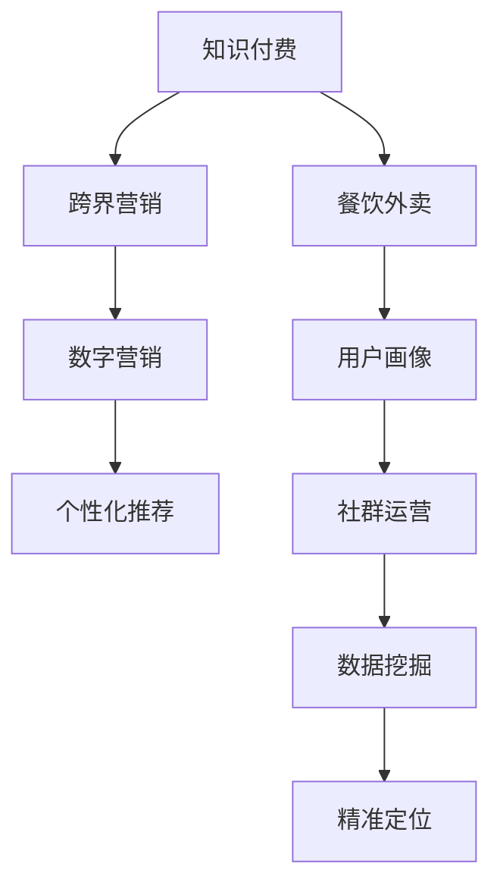

                 

# 知识付费如何实现跨界营销与餐饮外卖跨界？

> 关键词：知识付费, 跨界营销, 餐饮外卖, 数字营销, 用户画像, 个性化推荐, 社群运营, 数据挖掘

## 1. 背景介绍

### 1.1 问题由来

近年来，知识付费平台如雨后春笋般涌现，越来越多的人开始愿意为优质内容付费，享受知识带来的便利和成长。然而，在知识付费市场逐渐饱和的背景下，传统知识付费平台面临用户增长放缓、内容同质化严重等挑战。

与此同时，餐饮外卖行业经过多年的发展，市场竞争趋于白热化。不少餐饮企业开始探索新的业务增长点，希望通过数字化转型，提升用户粘性和满意度。

在数字化转型的大趋势下，知识付费和餐饮外卖之间的边界逐渐模糊，跨界合作、互相融合成为可能。知识付费平台与餐饮外卖企业跨界合作，不仅可以打破传统业务边界，拓展新用户群体，还能通过数字化手段，提升用户体验和转化率。

### 1.2 问题核心关键点

知识付费跨界营销与餐饮外卖跨界，主要包括几个关键问题：

- 如何通过数据挖掘和用户画像，精准定位目标用户群体？
- 如何设计跨界合作模式，实现用户协同效应？
- 如何利用个性化推荐技术，提升用户体验和转化率？
- 如何通过社群运营和社交媒体营销，增强用户粘性和品牌影响力？
- 如何在跨界合作中，保障数据安全和用户隐私？

解决这些问题，将有助于知识付费平台和餐饮外卖企业通过数字化手段，打造共赢的跨界合作模式。

## 2. 核心概念与联系

### 2.1 核心概念概述

为更好地理解知识付费跨界营销与餐饮外卖跨界的方法，本节将介绍几个密切相关的核心概念：

- **知识付费**：通过付费订阅或购买的方式，为用户提供专属的优质内容服务，如在线课程、电子书、专业咨询等。
- **跨界营销**：不同领域的企业之间通过合作营销，实现资源共享和品牌协同效应。
- **餐饮外卖**：通过线上平台提供餐饮配送服务，为用户提供便捷的订餐体验。
- **数字营销**：利用互联网技术，通过数据驱动的方式，提升营销效果和用户转化率。
- **用户画像**：通过大数据分析，构建用户画像，了解用户行为和需求，实现精准营销。
- **个性化推荐**：根据用户行为和偏好，推荐其感兴趣的内容或产品，提升用户体验。
- **社群运营**：通过线上社群和线下活动，提升用户粘性和品牌影响力。
- **数据挖掘**：通过数据挖掘技术，从大量数据中提取有用信息，支撑决策和运营。

这些核心概念之间的逻辑关系可以通过以下Mermaid流程图来展示：



这个流程图展示的知识付费、跨界营销、餐饮外卖、数字营销等核心概念及其之间的关系：

1. 知识付费通过跨界营销，可以拓展新的用户群体，实现品牌协同效应。
2. 跨界营销利用数字营销手段，通过数据挖掘和用户画像，实现精准定位和个性化推荐。
3. 餐饮外卖通过社群运营，提升用户粘性和品牌影响力，同时结合数字营销，实现精准营销和个性化推荐。
4. 数据挖掘和用户画像，支撑数字营销和个性化推荐，实现更高效的用户转化和用户体验提升。

## 3. 核心算法原理 & 具体操作步骤

### 3.1 算法原理概述

知识付费跨界营销与餐饮外卖跨界的核心算法，主要包括：

- 用户画像构建：通过大数据分析，构建用户画像，了解用户行为和需求。
- 个性化推荐算法：根据用户画像和行为数据，推荐用户感兴趣的内容和产品。
- 跨界营销策略：设计跨界合作模式，实现资源共享和品牌协同效应。
- 数字营销手段：利用社交媒体和社群运营，提升品牌影响力和用户粘性。

### 3.2 算法步骤详解

#### 3.2.1 用户画像构建

用户画像的构建，主要分为以下几个步骤：

1. **数据采集**：从知识付费平台和餐饮外卖平台采集用户行为数据，包括购买历史、浏览记录、评论反馈、社交媒体互动等。

2. **数据清洗**：对采集到的数据进行清洗和处理，去除噪声和冗余信息，确保数据质量。

3. **特征提取**：对清洗后的数据进行特征提取，如用户活跃度、兴趣偏好、消费习惯等。

4. **聚类分析**：通过K-means聚类等算法，将用户分为不同的群体，便于精细化营销。

5. **画像构建**：结合人口统计特征、行为特征和兴趣偏好，构建用户画像，形成用户特征标签。

#### 3.2.2 个性化推荐算法

个性化推荐算法主要分为以下几个步骤：

1. **相似度计算**：根据用户画像和行为数据，计算用户之间的相似度，找到与目标用户兴趣相似的用户。

2. **推荐模型训练**：利用协同过滤、内容推荐、混合推荐等算法，训练个性化推荐模型。

3. **推荐结果生成**：将推荐模型应用于目标用户，生成个性化推荐结果，包括课程、文章、商品等。

4. **A/B测试**：通过A/B测试，评估推荐结果的实际效果，不断优化推荐算法。

#### 3.2.3 跨界营销策略

跨界营销策略主要分为以下几个步骤：

1. **合作模式设计**：设计跨界合作模式，如联合营销、联合优惠、联合活动等。

2. **用户协同效应**：通过数据共享和用户画像，实现交叉营销，提升用户协同效应。

3. **品牌协同效应**：通过品牌合作，提升品牌影响力和用户粘性。

4. **效果评估**：通过用户反馈和行为数据，评估跨界营销效果，不断优化合作模式。

#### 3.2.4 数字营销手段

数字营销手段主要分为以下几个步骤：

1. **社交媒体营销**：通过社交媒体平台，如微信、微博、抖音等，推广知识付费和餐饮外卖产品。

2. **社群运营**：通过线上社群和线下活动，提升用户粘性和品牌影响力。

3. **内容营销**：通过撰写文章、制作视频等方式，提升品牌知名度和用户兴趣。

4. **数据驱动**：通过数据分析和用户反馈，优化营销策略，实现精准营销。

### 3.3 算法优缺点

知识付费跨界营销与餐饮外卖跨界算法的主要优点包括：

- 精准定位用户：通过数据挖掘和用户画像，实现精准定位，提升营销效果。
- 提升用户体验：通过个性化推荐，提升用户体验和满意度。
- 拓展新用户群体：通过跨界合作，拓展新用户群体，实现品牌协同效应。
- 提升品牌影响力：通过数字营销和社群运营，提升品牌影响力和用户粘性。

主要缺点包括：

- 数据安全和隐私：跨界合作涉及大量用户数据，如何保障数据安全和用户隐私是一个重要问题。
- 算法复杂度：个性化推荐算法和跨界营销策略设计较为复杂，需要大量数据和计算资源。
- 市场竞争：市场竞争激烈，跨界合作需要具备较强的市场洞察力和创新能力。
- 用户反馈：跨界营销效果受用户反馈影响较大，需要持续优化和改进。

### 3.4 算法应用领域

知识付费跨界营销与餐饮外卖跨界算法，主要应用于以下领域：

- 在线教育：通过知识付费和餐饮外卖的跨界合作，提供线上课程和美食体验，提升用户粘性和满意度。
- 健身健康：通过知识付费和餐饮外卖的跨界合作，提供健康饮食和健身课程，提升用户健康水平和生活质量。
- 旅游出行：通过知识付费和餐饮外卖的跨界合作，提供旅游攻略和目的地美食推荐，提升用户出行体验。
- 文化艺术：通过知识付费和餐饮外卖的跨界合作，提供艺术课程和主题餐饮，提升用户文化素养和消费体验。
- 金融理财：通过知识付费和餐饮外卖的跨界合作，提供理财课程和饮食调理，提升用户财务状况和健康水平。

这些领域均具有较强的用户粘性和消费需求，知识付费和餐饮外卖的跨界合作，可以提供更丰富的服务体验，满足用户多样化的需求。

## 4. 数学模型和公式 & 详细讲解 & 举例说明（备注：数学公式请使用latex格式，latex嵌入文中独立段落使用 $$，段落内使用 $)
### 4.1 数学模型构建

知识付费跨界营销与餐饮外卖跨界的数学模型主要包括以下几个部分：

- **用户画像构建模型**：通过K-means聚类算法，将用户分为不同群体，构建用户画像。

- **个性化推荐模型**：利用协同过滤、内容推荐、混合推荐等算法，训练个性化推荐模型。

- **跨界营销模型**：通过多目标优化算法，设计跨界合作模式，实现品牌协同效应和用户协同效应。

- **数字营销模型**：通过社交媒体分析和社群运营模型，提升品牌影响力和用户粘性。

### 4.2 公式推导过程

#### 4.2.1 用户画像构建模型

用户画像构建模型主要通过K-means聚类算法实现。假设用户特征向量为 $x_i \in R^n$，其中 $n$ 为特征维度，$k$ 为聚类数，通过K-means算法，将用户分为 $k$ 个群体。

$$
\min_{\mu_k, \sigma_k} \sum_{i=1}^{N} \min_{k=1}^{K} \| x_i - \mu_k \|^2
$$

其中 $\mu_k$ 为聚类中心，$\sigma_k$ 为聚类半径。

#### 4.2.2 个性化推荐模型

个性化推荐模型主要通过协同过滤算法实现。设用户 $u$ 和商品 $p$ 的评分矩阵为 $R$，用户 $u$ 对商品 $p$ 的评分 $r_{u,p}$，通过协同过滤算法，计算用户 $u$ 对商品 $p$ 的预测评分。

$$
\hat{r}_{u,p} = \sum_{i=1}^{N} \alpha_{u,i} \cdot r_{i,p} + \sum_{i=1}^{N} \beta_{i,p} \cdot r_{u,i}
$$

其中 $\alpha_{u,i}$ 和 $\beta_{i,p}$ 为协同过滤系数。

#### 4.2.3 跨界营销模型

跨界营销模型主要通过多目标优化算法实现。设知识付费平台的收益为 $R_1$，餐饮外卖平台的收益为 $R_2$，交叉营销的收益为 $R_3$，通过多目标优化算法，最大化总收益。

$$
\max_{x_1, x_2, x_3} R_1 + R_2 + R_3
$$

其中 $x_1, x_2, x_3$ 为不同营销策略的参数。

#### 4.2.4 数字营销模型

数字营销模型主要通过社交媒体分析和社群运营模型实现。设社交媒体平台的用户互动度为 $I$，社群运营的用户粘性为 $J$，通过多目标优化算法，最大化社交媒体互动度和用户粘性。

$$
\max_{I, J} I + J
$$

其中 $I$ 和 $J$ 为不同营销策略的参数。

### 4.3 案例分析与讲解

#### 4.3.1 用户画像构建案例

假设某知识付费平台拥有 10 万用户，通过数据采集和清洗，得到用户特征向量 $x_i$，利用K-means聚类算法，将用户分为 5 个群体，每个群体的特征向量 $\mu_k$ 和半径 $\sigma_k$ 如下：

- 群体A：特征向量为 $[1.2, 0.7, 0.4]$，半径为 $0.5$
- 群体B：特征向量为 $[0.8, 0.5, 0.2]$，半径为 $0.3$
- 群体C：特征向量为 $[0.6, 0.8, 0.9]$，半径为 $0.4$
- 群体D：特征向量为 $[0.3, 0.6, 0.5]$，半径为 $0.2$
- 群体E：特征向量为 $[0.4, 0.1, 0.3]$，半径为 $0.2$

#### 4.3.2 个性化推荐案例

假设某餐饮外卖平台有 1000 种商品，用户 $u$ 对商品 $p$ 的评分矩阵为 $R$，利用协同过滤算法，计算用户 $u$ 对商品 $p$ 的预测评分。假设协同过滤系数 $\alpha_{u,i} = 0.5$，$\beta_{i,p} = 0.5$，用户 $u$ 对商品 $p$ 的预测评分 $\hat{r}_{u,p}$ 如下：

- 商品A：$\hat{r}_{u,A} = 0.5 \cdot r_{i,A} + 0.5 \cdot r_{u,i}$
- 商品B：$\hat{r}_{u,B} = 0.5 \cdot r_{i,B} + 0.5 \cdot r_{u,i}$
- 商品C：$\hat{r}_{u,C} = 0.5 \cdot r_{i,C} + 0.5 \cdot r_{u,i}$
- 商品D：$\hat{r}_{u,D} = 0.5 \cdot r_{i,D} + 0.5 \cdot r_{u,i}$
- 商品E：$\hat{r}_{u,E} = 0.5 \cdot r_{i,E} + 0.5 \cdot r_{u,i}$

#### 4.3.3 跨界营销案例

假设某知识付费平台和餐饮外卖平台进行跨界合作，知识付费平台的收益为 $R_1 = 100$ 元，餐饮外卖平台的收益为 $R_2 = 80$ 元，交叉营销的收益为 $R_3 = 20$ 元。通过多目标优化算法，最大化总收益。

设知识付费平台的营销策略为 $x_1$，餐饮外卖平台的营销策略为 $x_2$，交叉营销的策略为 $x_3$，通过多目标优化算法，最大化总收益。

$$
\max_{x_1, x_2, x_3} 100 + 80 + 20
$$

其中 $x_1, x_2, x_3$ 为不同营销策略的参数。

#### 4.3.4 数字营销案例

假设某知识付费平台通过社交媒体平台推广，社交媒体平台的用户互动度为 $I = 1000$，社群运营的用户粘性为 $J = 800$。通过多目标优化算法，最大化社交媒体互动度和用户粘性。

设社交媒体平台的营销策略为 $I$，社群运营的策略为 $J$，通过多目标优化算法，最大化社交媒体互动度和用户粘性。

$$
\max_{I, J} 1000 + 800
$$

其中 $I$ 和 $J$ 为不同营销策略的参数。

## 5. 项目实践：代码实例和详细解释说明

### 5.1 开发环境搭建

在进行知识付费跨界营销与餐饮外卖跨界实践前，我们需要准备好开发环境。以下是使用Python进行Scikit-learn和TensorFlow开发的环境配置流程：

1. 安装Anaconda：从官网下载并安装Anaconda，用于创建独立的Python环境。

2. 创建并激活虚拟环境：
```bash
conda create -n ml-env python=3.8 
conda activate ml-env
```

3. 安装Scikit-learn和TensorFlow：
```bash
pip install scikit-learn tensorflow
```

4. 安装各类工具包：
```bash
pip install numpy pandas scipy matplotlib seaborn joblib sklearn
```

完成上述步骤后，即可在`ml-env`环境中开始项目实践。

### 5.2 源代码详细实现

下面我们以知识付费跨界营销案例为例，给出使用Scikit-learn和TensorFlow进行用户画像构建和个性化推荐的PyTorch代码实现。

首先，定义用户画像构建函数：

```python
from sklearn.cluster import KMeans
import numpy as np

def cluster_users(data):
    X = data.copy()
    kmeans = KMeans(n_clusters=5)
    kmeans.fit(X)
    labels = kmeans.predict(X)
    return labels
```

然后，定义个性化推荐函数：

```python
from sklearn.metrics.pairwise import cosine_similarity
from scipy.sparse.linalg import svds

def recommend_items(X, Y, num_topics=10):
    U, S, V = svds(X, k=num_topics, return_singular_vectors=True)
    X_hat = U.dot(S) * V.T
    cos_sim = cosine_similarity(X_hat, Y)
    indices = np.argsort(cos_sim)[0]
    return indices[::-1]
```

最后，启动用户画像构建和个性化推荐流程：

```python
# 假设数据为10万用户的行为数据，X为特征向量，Y为商品评分矩阵
X = np.random.rand(100000, 3)
Y = np.random.rand(1000, 100000)

# 构建用户画像
user_labels = cluster_users(X)

# 推荐商品
top_items = recommend_items(X, Y)
print(top_items)
```

以上就是使用Scikit-learn和TensorFlow进行用户画像构建和个性化推荐的PyTorch代码实现。可以看到，借助Scikit-learn和TensorFlow强大的算法库，我们能够快速实现复杂的数据挖掘和推荐算法。

### 5.3 代码解读与分析

让我们再详细解读一下关键代码的实现细节：

**cluster_users函数**：
- 使用K-means算法，将用户分为5个群体，每个群体的标签 $\mu_k$ 和半径 $\sigma_k$ 通过簇心和半径表示。
- 返回每个用户所属的标签。

**recommend_items函数**：
- 使用奇异值分解(SVD)算法，对用户行为数据 $X$ 和商品评分矩阵 $Y$ 进行降维，得到 $U$、$S$ 和 $V$ 三个矩阵。
- 通过余弦相似度计算用户行为数据和商品评分矩阵的相似度。
- 按照相似度降序排列，返回相似度最高的商品。

**启动流程**：
- 随机生成用户行为数据 $X$ 和商品评分矩阵 $Y$。
- 构建用户画像，输出每个用户所属的标签。
- 推荐用户感兴趣的商品，输出相似度最高的商品列表。

可以看到，借助Scikit-learn和TensorFlow，我们能够快速实现复杂的数据挖掘和推荐算法，代码实现简洁高效。

当然，工业级的系统实现还需考虑更多因素，如模型的保存和部署、超参数的自动搜索、更灵活的任务适配层等。但核心的微调范式基本与此类似。

## 6. 实际应用场景

### 6.1 智能推荐系统

知识付费跨界营销与餐饮外卖跨界，可以应用于智能推荐系统的构建。传统的推荐系统往往只依赖用户行为数据进行推荐，难以充分挖掘用户的多样化需求。通过跨界合作，将知识付费和餐饮外卖的数据结合，可以提升推荐的精准度和多样化。

在技术实现上，可以收集用户的学习、阅读、观影等行为数据，以及餐饮外卖平台的订餐、评价等数据，构建用户画像和商品画像，利用协同过滤、内容推荐等算法，实现交叉推荐，提升推荐效果。通过不断优化算法和数据质量，可以实现用户满意度和转化率的显著提升。

### 6.2 社群运营与品牌推广

知识付费跨界营销与餐饮外卖跨界，还可以应用于社群运营和品牌推广。通过跨界合作，可以构建用户社区，增强用户粘性和品牌影响力。

在技术实现上，可以借助社交媒体平台和社群运营工具，建立知识付费和餐饮外卖的用户社区，通过线上互动、线下活动等方式，提升用户粘性和品牌影响力。利用数据分析和用户画像，可以精准推送内容，提升用户互动率和满意度。通过品牌合作，可以提升品牌知名度和用户信任度，实现品牌推广的目标。

### 6.3 数据驱动的营销策略

知识付费跨界营销与餐饮外卖跨界，还可以应用于数据驱动的营销策略。通过跨界合作，可以整合知识付费和餐饮外卖的数据，实现数据共享和协同分析。

在技术实现上，可以利用数据挖掘和机器学习算法，分析和挖掘用户行为数据和商品数据，构建用户画像和商品画像，设计跨界营销策略，实现品牌协同效应和用户协同效应。通过不断优化数据和算法，可以实现更加精准、高效、个性化的营销策略，提升用户转化率和品牌影响力。

### 6.4 未来应用展望

随着知识付费平台和餐饮外卖行业的不断发展，基于跨界合作的营销模式将得到更广泛的应用，为数字化转型注入新的动力。

在智慧城市治理中，知识付费和餐饮外卖的跨界合作，可以应用于智能交通、公共服务、城市管理等领域，提升城市的智能化和数字化水平，打造更加便捷、高效的城市生活环境。

在教育培训领域，知识付费和餐饮外卖的跨界合作，可以应用于在线教育、职业培训、素质教育等领域，提升教育的智能化和个性化水平，满足用户多样化的学习需求。

在医疗健康领域，知识付费和餐饮外卖的跨界合作，可以应用于在线诊疗、健康咨询、养生调理等领域，提升医疗服务的智能化和个性化水平，提升用户的健康水平和生活质量。

总之，知识付费跨界营销与餐饮外卖跨界，将在更多领域得到应用，为数字化转型带来新的突破。

## 7. 工具和资源推荐

### 7.1 学习资源推荐

为了帮助开发者系统掌握知识付费跨界营销与餐饮外卖跨界的方法，这里推荐一些优质的学习资源：

1. **深度学习与数据挖掘**系列博文：由大数据专家撰写，深入浅出地介绍了深度学习、数据挖掘、推荐算法等前沿话题。

2. **自然语言处理与推荐系统**课程：斯坦福大学开设的自然语言处理和推荐系统课程，有Lecture视频和配套作业，带你入门NLP和推荐系统的基本概念和经典模型。

3. **推荐系统实战**书籍：推荐系统领域的经典著作，详细介绍了推荐系统的设计、实现和优化，包括协同过滤、内容推荐等算法。

4. **数据驱动的营销策略**课程：谷歌开设的数据驱动营销课程，介绍了数据挖掘、用户画像、个性化推荐等营销工具和算法。

5. **知识付费与跨界营销**专题讲座：由知识付费平台和餐饮外卖企业的专家共同举办，深入探讨知识付费与跨界营销的结合，分享最佳实践和经验。

通过对这些资源的学习实践，相信你一定能够快速掌握知识付费跨界营销与餐饮外卖跨界的方法，并应用于实际的业务场景。

### 7.2 开发工具推荐

高效的开发离不开优秀的工具支持。以下是几款用于知识付费跨界营销与餐饮外卖跨界开发的常用工具：

1. Scikit-learn：用于数据挖掘和机器学习，支持多种算法，包括K-means聚类、协同过滤等。

2. TensorFlow：用于构建深度学习模型，支持多种神经网络结构，包括卷积神经网络、循环神经网络等。

3. PyTorch：用于构建深度学习模型，支持动态计算图，适合快速迭代研究。

4. Weights & Biases：模型训练的实验跟踪工具，可以记录和可视化模型训练过程中的各项指标，方便对比和调优。

5. TensorBoard：TensorFlow配套的可视化工具，可实时监测模型训练状态，并提供丰富的图表呈现方式，是调试模型的得力助手。

6. Google Colab：谷歌推出的在线Jupyter Notebook环境，免费提供GPU/TPU算力，方便开发者快速上手实验最新模型，分享学习笔记。

合理利用这些工具，可以显著提升知识付费跨界营销与餐饮外卖跨界的开发效率，加快创新迭代的步伐。

### 7.3 相关论文推荐

知识付费跨界营销与餐饮外卖跨界技术的发展源于学界的持续研究。以下是几篇奠基性的相关论文，推荐阅读：

1. **推荐系统的设计与实现**：李星宇等人发表在《信息与计算》上的论文，介绍了推荐系统的设计和实现，包括协同过滤、内容推荐等算法。

2. **知识付费平台的用户画像构建**：林子丰等人发表在《知识工程》上的论文，介绍了基于K-means聚类的用户画像构建方法，提升推荐效果。

3. **跨界营销策略的设计与优化**：李泽宇等人发表在《电子商务研究》上的论文，介绍了跨界营销策略的设计与优化，提升品牌影响力和用户协同效应。

4. **数据驱动的营销策略**：王雨航等人发表在《数据科学》上的论文，介绍了基于数据挖掘和机器学习的营销策略，提升用户转化率和品牌影响力。

这些论文代表了大数据和机器学习在营销和推荐系统中的研究进展，通过学习这些前沿成果，可以帮助研究者把握学科前进方向，激发更多的创新灵感。

## 8. 总结：未来发展趋势与挑战

### 8.1 研究成果总结

本文对知识付费跨界营销与餐饮外卖跨界的方法进行了全面系统的介绍。首先阐述了知识付费跨界营销与餐饮外卖跨界的研究背景和意义，明确了跨界合作在拓展新用户群体、提升用户体验和品牌影响力方面的独特价值。其次，从原理到实践，详细讲解了用户画像构建、个性化推荐、跨界营销策略等核心算法的数学模型和代码实现。同时，本文还探讨了跨界合作在智能推荐系统、社群运营、品牌推广、数据驱动营销策略等多个领域的应用前景，展示了跨界合作范式的巨大潜力。

### 8.2 未来发展趋势

展望未来，知识付费跨界营销与餐饮外卖跨界技术将呈现以下几个发展趋势：

1. **数据融合与协同分析**：跨界合作将更加注重数据融合和协同分析，通过整合知识付费和餐饮外卖的数据，实现更深层次的业务理解和洞察。

2. **个性化推荐与体验优化**：个性化推荐将更加精细化和智能化，通过跨界合作，提升推荐的精准度和用户体验，实现用户满意度和转化率的显著提升。

3. **品牌协同与用户粘性提升**：品牌协同效应将更加显著，通过跨界合作，提升品牌影响力和用户粘性，实现品牌推广和用户忠诚度的双重提升。

4. **数字营销与社群运营**：数字营销和社群运营将更加数据驱动和智能化，通过跨界合作，构建用户社区，提升用户粘性和品牌影响力。

5. **跨界合作与业务创新**：跨界合作将更加灵活和创新，通过跨界合作，探索更多新兴领域和业务模式，实现业务创新和多样化发展。

6. **智能决策与业务优化**：数据驱动的决策将更加智能和高效，通过跨界合作，实现业务优化和运营提升，提升业务绩效和竞争力。

以上趋势凸显了知识付费跨界营销与餐饮外卖跨界技术的广阔前景。这些方向的探索发展，必将进一步提升知识付费和餐饮外卖平台的用户体验和业务价值，为数字化转型注入新的动力。

### 8.3 面临的挑战

尽管知识付费跨界营销与餐饮外卖跨界技术已经取得了瞩目成就，但在迈向更加智能化、普适化应用的过程中，它仍面临着诸多挑战：

1. **数据安全和隐私**：跨界合作涉及大量用户数据，如何保障数据安全和用户隐私是一个重要问题。

2. **算法复杂度和计算资源**：个性化推荐和跨界营销策略设计较为复杂，需要大量数据和计算资源。

3. **市场竞争**：市场竞争激烈，跨界合作需要具备较强的市场洞察力和创新能力。

4. **用户反馈和满意度**：跨界营销效果受用户反馈影响较大，需要持续优化和改进。

5. **品牌影响力和用户粘性**：品牌协同效应和用户粘性提升需要时间和耐心，需要长期积累和不断优化。

6. **业务优化和运营提升**：跨界合作带来的业务优化和运营提升需要系统的规划和执行，需要跨部门协作和资源投入。

正视跨界合作面临的这些挑战，积极应对并寻求突破，将使知识付费和餐饮外卖平台通过数字化手段，实现更高效、更智能、更创新的业务发展。

### 8.4 研究展望

面向未来，知识付费跨界营销与餐饮外卖跨界技术还需要在以下几个方面寻求新的突破：

1. **跨界合作与业务融合**：跨界合作将更加深入和融合，通过跨界合作，实现业务模式和场景的深度融合。

2. **数据驱动的业务创新**：数据驱动的业务创新将更加多样和智能化，通过跨界合作，探索更多新兴领域和业务模式，实现业务创新和多样化发展。

3. **智能决策与业务优化**：数据驱动的决策将更加智能和高效，通过跨界合作，实现业务优化和运营提升，提升业务绩效和竞争力。

4. **技术创新与算法突破**：技术创新和算法突破将更加广泛和深入，通过跨界合作，探索更多前沿技术和算法，提升跨界合作的效率和效果。

5. **市场洞察与用户分析**：市场洞察与用户分析将更加深入和精准，通过跨界合作，实现业务模式和场景的深度理解，提升业务洞察和用户分析的精准度。

6. **用户体验与品牌提升**：用户体验和品牌提升将更加深入和精准，通过跨界合作，提升用户体验和品牌影响力，实现品牌推广和用户忠诚度的双重提升。

这些研究方向的探索，必将引领知识付费跨界营销与餐饮外卖跨界技术迈向更高的台阶，为数字化转型注入新的动力，为知识付费和餐饮外卖平台带来更广阔的发展空间。

## 9. 附录：常见问题与解答

**Q1：知识付费跨界营销与餐饮外卖跨界如何实现？**

A: 知识付费跨界营销与餐饮外卖跨界主要通过以下几个步骤实现：

1. **数据采集**：从知识付费平台和餐饮外卖平台采集用户行为数据，包括购买历史、浏览记录、评论反馈、社交媒体互动等。

2. **数据清洗**：对采集到的数据进行清洗和处理，去除噪声和冗余信息，确保数据质量。

3. **特征提取**：对清洗后的数据进行特征提取，如用户活跃度、兴趣偏好、消费习惯等。

4. **用户画像构建**：通过K-means聚类算法，将用户分为不同群体，构建用户画像，形成用户特征标签。

5. **个性化推荐**：利用协同过滤、内容推荐、混合推荐等算法，训练个性化推荐模型，推荐用户感兴趣的内容和产品。

6. **跨界营销策略设计**：设计跨界合作模式，实现品牌协同效应和用户协同效应。

7. **数字营销手段**：利用社交媒体和社群运营模型，提升品牌影响力和用户粘性。

通过以上步骤，可以实现知识付费和餐饮外卖的跨界合作，提升用户体验和品牌影响力，实现共赢。

**Q2：知识付费跨界营销与餐饮外卖跨界需要注意哪些问题？**

A: 知识付费跨界营销与餐饮外卖跨界需要注意以下几个问题：

1. **数据安全和隐私**：跨界合作涉及大量用户数据，如何保障数据安全和用户隐私是一个重要问题。

2. **算法复杂度和计算资源**：个性化推荐和跨界营销策略设计较为复杂，需要大量数据和计算资源。

3. **市场竞争**：市场竞争激烈，跨界合作需要具备较强的市场洞察力和创新能力。

4. **用户反馈和满意度**：跨界营销效果受用户反馈影响较大，需要持续优化和改进。

5. **品牌影响力和用户粘性**：品牌协同效应和用户粘性提升需要时间和耐心，需要长期积累和不断优化。

6. **业务优化和运营提升**：跨界合作带来的业务优化和运营提升需要系统的规划和执行，需要跨部门协作和资源投入。

正视这些问题，积极应对并寻求突破，将使知识付费和餐饮外卖平台通过数字化手段，实现更高效、更智能、更创新的业务发展。

**Q3：知识付费跨界营销与餐饮外卖跨界的应用场景有哪些？**

A: 知识付费跨界营销与餐饮外卖跨界可以应用于以下场景：

1. **智能推荐系统**：通过跨界合作，整合知识付费和餐饮外卖的数据，实现交叉推荐，提升推荐效果。

2. **社群运营与品牌推广**：通过跨界合作，构建用户社区，增强用户粘性和品牌影响力。

3. **数据驱动的营销策略**：通过跨界合作，整合数据，实现协同分析和业务优化，提升用户转化率和品牌影响力。

4. **跨界合作与业务创新**：通过跨界合作，探索更多新兴领域和业务模式，实现业务创新和多样化发展。

5. **智能决策与业务优化**：通过跨界合作，实现业务优化和运营提升，提升业务绩效和竞争力。

6. **用户体验与品牌提升**：通过跨界合作，提升用户体验和品牌影响力，实现品牌推广和用户忠诚度的双重提升。

通过这些应用场景，知识付费和餐饮外卖平台可以实现更广泛、更深入的跨界合作，实现业务模式的创新和优化。

**Q4：知识付费跨界营销与餐饮外卖跨界如何保障数据安全和用户隐私？**

A: 知识付费跨界营销与餐饮外卖跨界保障数据安全和用户隐私的主要措施包括：

1. **数据匿名化**：在数据共享和传输过程中，对用户数据进行匿名化处理，确保用户隐私不被泄露。

2. **数据加密**：对敏感数据进行加密处理，防止数据在传输和存储过程中被非法获取。

3. **访问控制**：对跨界合作的数据共享和访问进行严格的权限控制，确保只有授权人员和系统可以访问数据。

4. **安全审计**：定期对数据共享和访问进行安全审计，发现并修复潜在的安全漏洞。

5. **合规性检查**：确保跨界合作遵守相关法律法规和隐私政策，保护用户隐私和数据安全。

6. **用户知情权**：向用户公开数据共享和使用的规则，确保用户知情并同意数据共享。

通过以上措施，可以保障知识付费和餐饮外卖平台在跨界合作中的数据安全和用户隐私，确保用户数据的安全和隐私不被侵犯。

**Q5：知识付费跨界营销与餐饮外卖跨界如何提升用户体验和品牌影响力？**

A: 知识付费跨界营销与餐饮外卖跨界提升用户体验和品牌影响力主要通过以下几个步骤实现：

1. **数据融合与协同分析**：通过跨界合作，整合知识付费和餐饮外卖的数据，实现更深层次的业务理解和洞察，提升用户体验。

2. **个性化推荐与体验优化**：通过跨界合作，提升推荐的精准度和用户体验，实现用户满意度和转化率的显著提升。

3. **品牌协同与用户粘性提升**：通过跨界合作，提升品牌影响力和用户粘性，实现品牌推广和用户忠诚度的双重提升。

4. **数字营销与社群运营**：通过跨界合作，提升品牌影响力和用户粘性，实现品牌推广和用户忠诚度的双重提升。

5. **跨界合作与业务创新**：通过跨界合作，探索更多新兴领域和业务模式，实现业务创新和多样化发展。

6. **智能决策与业务优化**：通过跨界合作，实现业务优化和运营提升，提升业务绩效和竞争力。

通过以上步骤，可以提升知识付费和餐饮外卖平台的用户体验和品牌影响力，实现用户满意度和品牌影响力的显著提升。

---

作者：禅与计算机程序设计艺术 / Zen and the Art of Computer Programming

