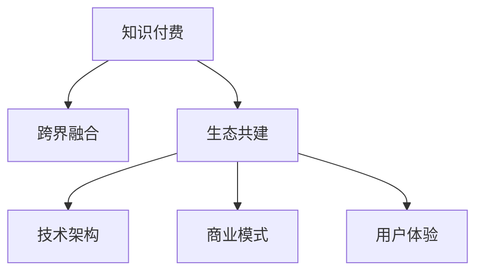

                 

# 知识付费如何实现跨界融合与生态共建？

> 关键词：知识付费,跨界融合,生态共建,技术架构,商业模式,用户体验

## 1. 背景介绍

### 1.1 问题由来
随着互联网技术的快速发展，知识付费行业逐渐崛起，成为继电子商务、在线教育之后的又一个热门领域。知识付费平台通过提供高质量的课程、文章、音频、视频等内容，满足用户日益增长的学习需求。然而，在知识付费行业内部，内容生产与分发、用户获取与留存、支付与运营等环节存在着诸多挑战。如何实现跨界融合，构建良好的生态系统，成为当前行业亟需解决的问题。

### 1.2 问题核心关键点
1. **内容生产与分发**：如何高效生成和分发高质量内容，满足用户需求？
2. **用户获取与留存**：如何吸引和留住大量用户，提升用户活跃度和付费意愿？
3. **支付与运营**：如何构建稳定的支付与运营模式，确保平台的可持续发展？
4. **跨界融合**：如何与其他行业和领域实现协同创新，提升知识付费的价值？
5. **生态共建**：如何构建开放、合作、共赢的知识付费生态系统，实现互利共赢？

### 1.3 问题研究意义
研究知识付费的跨界融合与生态共建，对于推动知识付费行业的发展，提升用户价值，促进跨界创新具有重要意义：

1. **促进知识共享与传播**：通过跨界融合，整合不同领域的专业知识，提升内容的丰富性和深度，加速知识的传播与共享。
2. **提升用户体验与满意度**：通过技术创新和商业模式创新，提供更优质、更便捷的知识付费服务，提升用户满意度和忠诚度。
3. **推动行业升级**：跨界融合与生态共建能够激发更多创新，推动知识付费行业从粗放式增长向精细化运营转变，提升整体行业水平。
4. **拓展市场空间**：通过与其他行业协同创新，拓展知识付费的应用场景，发掘新的市场机会，扩大市场规模。
5. **促进合作共赢**：通过构建开放的知识付费生态系统，实现多方共赢，促进知识付费行业的健康发展。

## 2. 核心概念与联系

### 2.1 核心概念概述

为更好地理解知识付费的跨界融合与生态共建，本节将介绍几个密切相关的核心概念：

- **知识付费**：指用户通过支付一定费用，获取有价值的知识和信息，提升个人或企业的知识和技能水平。
- **跨界融合**：指不同领域或行业之间的合作与融合，通过技术、内容、商业模式等创新手段，实现资源共享、优势互补。
- **生态共建**：指构建一个开放、合作、共赢的知识付费生态系统，包括内容创作者、平台运营商、用户等多方参与，共同促进知识付费行业的发展。
- **技术架构**：指知识付费平台的技术实现框架，包括内容管理系统、用户管理系统、支付系统等核心模块。
- **商业模式**：指知识付费平台盈利的方式，包括订阅制、按需付费、虚拟商品等方式。
- **用户体验**：指用户在使用知识付费平台时的体验感，包括内容质量、界面设计、支付便捷性等。

这些核心概念之间的逻辑关系可以通过以下Mermaid流程图来展示：



这个流程图展示的知识付费的核心概念及其之间的关系：

1. 知识付费是基础，通过技术架构和商业模式创新，提供高质量、便捷的服务。
2. 跨界融合促进资源共享和优势互补，提升知识付费的价值。
3. 生态共建实现多方共赢，构建开放、合作的知识付费生态系统。

## 3. 核心算法原理 & 具体操作步骤
### 3.1 算法原理概述

知识付费平台的跨界融合与生态共建，本质上是一个多目标优化问题。其核心思想是：通过技术手段和商业模式创新，最大化知识付费平台的价值，同时实现多方共赢。

形式化地，假设知识付费平台的目标函数为：

$$
\max_{\theta} \{ V(\theta) \}
$$

其中 $V(\theta)$ 表示平台的综合价值，包括内容质量、用户活跃度、交易量、合作满意度等。

知识付费平台的优化过程包括：

1. **内容生产与分发**：通过推荐算法、搜索引擎优化等技术手段，高效生成和分发高质量内容，满足用户需求。
2. **用户获取与留存**：通过社交网络推广、广告投放、优惠券等营销手段，吸引和留住大量用户，提升用户活跃度和付费意愿。
3. **支付与运营**：通过安全支付、用户管理、数据分析等技术手段，构建稳定的支付与运营模式，确保平台的可持续发展。

### 3.2 算法步骤详解

知识付费平台的跨界融合与生态共建一般包括以下几个关键步骤：

**Step 1: 用户画像构建**
- 收集用户的行为数据，包括浏览历史、购买记录、评价反馈等，构建用户画像。
- 使用机器学习算法对用户画像进行分析，预测用户行为和需求。

**Step 2: 内容生成与推荐**
- 通过自然语言处理(NLP)、深度学习等技术，高效生成高质量内容。
- 使用协同过滤、基于内容的推荐算法、深度学习等技术，推荐用户感兴趣的内容。

**Step 3: 支付与运营优化**
- 通过安全支付、用户管理、数据分析等技术手段，确保支付过程的安全性和便捷性。
- 使用数据挖掘、用户画像分析等技术，优化运营策略，提升用户满意度和平台收益。

**Step 4: 跨界合作与生态共建**
- 与教育机构、企业、媒体等合作，共享资源，共同提升内容质量和用户价值。
- 构建开放的知识付费生态系统，实现内容创作者、平台运营商、用户等多方共赢。

**Step 5: 技术平台搭建**
- 搭建内容管理系统、用户管理系统、支付系统等核心模块，确保平台的高效稳定运行。
- 使用微服务架构、容器化部署等技术手段，提升系统的可扩展性和可维护性。

### 3.3 算法优缺点

知识付费平台的跨界融合与生态共建方法具有以下优点：

1. **提升平台价值**：通过技术手段和商业模式创新，最大化平台的综合价值，提升用户满意度和平台收益。
2. **资源共享与优势互补**：通过跨界合作，实现不同领域或行业的资源共享和优势互补，提升知识付费的价值。
3. **用户留存与转化**：通过多渠道营销和用户画像分析，吸引和留住大量用户，提升用户转化率。
4. **支付与运营优化**：通过安全支付、数据分析等技术手段，优化支付与运营模式，确保平台可持续发展。

同时，该方法也存在一定的局限性：

1. **技术复杂性高**：知识付费平台的跨界融合与生态共建涉及多个技术模块和业务环节，技术实现较为复杂。
2. **数据隐私与安全**：用户数据隐私保护和平台安全是一个重要的挑战，需要构建严密的数据安全机制。
3. **合作与共赢**：跨界合作与生态共建需要各方充分信任与合作，协调复杂多样的利益关系。
4. **用户需求多样化**：用户需求多样化，不同用户对内容、价格、体验等有着不同的期望，需要综合考虑。

尽管存在这些局限性，但就目前而言，跨界融合与生态共建方法仍是知识付费平台的重要发展方向。未来相关研究的重点在于如何进一步简化技术实现，提高合作效率，增强平台数据安全，从而更好地实现多方共赢。

### 3.4 算法应用领域

知识付费平台的跨界融合与生态共建，已经在教育、企业培训、在线阅读等多个领域得到了广泛应用：

- **教育领域**：知识付费平台与教育机构合作，推出在线课程、视频讲座等教育资源，提升学生的学习效果。
- **企业培训**：企业通过知识付费平台，为员工提供专业技能培训，提升企业人才的竞争力。
- **在线阅读**：知识付费平台提供优质图书、杂志、论文等阅读资源，满足用户的深度学习需求。
- **职业咨询**：知识付费平台提供职业规划、简历修改、面试辅导等服务，帮助用户实现职业发展。
- **健康管理**：知识付费平台提供健康饮食、运动健身、心理疏导等知识资源，提升用户的生活质量。

除了上述这些经典应用外，知识付费平台还在不断拓展新的场景中，如情感咨询、法律咨询、设计创作等，为用户的全方位需求提供解决方案。

## 4. 数学模型和公式 & 详细讲解 & 举例说明（备注：数学公式请使用latex格式，latex嵌入文中独立段落使用 $$，段落内使用 $)
### 4.1 数学模型构建

本节将使用数学语言对知识付费平台的跨界融合与生态共建过程进行更加严格的刻画。

假设知识付费平台的目标函数为 $V(\theta)$，其中 $\theta$ 表示平台运营的各项参数，包括内容质量、用户活跃度、交易量、合作满意度等。

目标函数 $V(\theta)$ 可以表示为：

$$
V(\theta) = \sum_{i=1}^N w_i \cdot f_i(\theta)
$$

其中 $w_i$ 表示各项指标的权重，$f_i(\theta)$ 表示第 $i$ 项指标的计算公式。

### 4.2 公式推导过程

以下我们以用户活跃度和付费率为例，推导目标函数 $V(\theta)$ 的计算公式。

假设用户活跃度为 $A$，付费率为 $P$，其计算公式分别为：

$$
A = \sum_{u=1}^U a_u \cdot h_u(\theta)
$$

$$
P = \sum_{u=1}^U p_u \cdot h_u(\theta)
$$

其中 $a_u$ 和 $p_u$ 表示第 $u$ 个用户的行为数据，$h_u(\theta)$ 表示用户行为与运营参数 $\theta$ 的关系函数。

将这些公式代入目标函数 $V(\theta)$，得：

$$
V(\theta) = \sum_{i=1}^N w_i \cdot f_i(\theta) = \sum_{u=1}^U w_A \cdot a_u \cdot h_u(\theta) + \sum_{u=1}^U w_P \cdot p_u \cdot h_u(\theta)
$$

### 4.3 案例分析与讲解

假设一个知识付费平台的运营参数 $\theta$ 包括内容质量 $Q$、用户活跃度 $A$、付费率 $P$ 和合作满意度 $C$。通过数据收集和分析，得到各项指标的计算公式：

$$
Q = \sum_{c=1}^C q_c \cdot k_c(\theta)
$$

$$
A = \sum_{u=1}^U a_u \cdot h_u(\theta)
$$

$$
P = \sum_{u=1}^U p_u \cdot h_u(\theta)
$$

$$
C = \sum_{i=1}^I c_i \cdot l_i(\theta)
$$

其中 $q_c$、$a_u$、$p_u$、$c_i$ 表示各项指标的原始数据，$k_c(\theta)$、$h_u(\theta)$、$l_i(\theta)$ 表示各指标与运营参数 $\theta$ 的关系函数。

假设目标函数 $V(\theta)$ 的各项指标权重为 $w_Q=0.4$、$w_A=0.3$、$w_P=0.2$、$w_C=0.1$，代入上述公式，得到：

$$
V(\theta) = 0.4 \cdot \sum_{c=1}^C q_c \cdot k_c(\theta) + 0.3 \cdot \sum_{u=1}^U a_u \cdot h_u(\theta) + 0.2 \cdot \sum_{u=1}^U p_u \cdot h_u(\theta) + 0.1 \cdot \sum_{i=1}^I c_i \cdot l_i(\theta)
$$

通过优化上述目标函数，可以最大化知识付费平台的价值。

## 5. 项目实践：代码实例和详细解释说明
### 5.1 开发环境搭建

在进行知识付费平台开发前，我们需要准备好开发环境。以下是使用Python进行Django开发的环境配置流程：

1. 安装Anaconda：从官网下载并安装Anaconda，用于创建独立的Python环境。

2. 创建并激活虚拟环境：
```bash
conda create -n django-env python=3.8 
conda activate django-env
```

3. 安装Django：根据版本，从官网获取对应的安装命令。例如：
```bash
pip install django
```

4. 安装各类工具包：
```bash
pip install numpy pandas scikit-learn matplotlib tqdm jupyter notebook ipython
```

完成上述步骤后，即可在`django-env`环境中开始开发实践。

### 5.2 源代码详细实现

下面我们以知识付费平台的用户管理系统为例，给出使用Django框架对用户进行管理的PyTorch代码实现。

首先，定义用户模型：

```python
from django.db import models
from django.contrib.auth.models import AbstractUser

class User(AbstractUser):
    is_vip = models.BooleanField(default=False)
    is_enterprise = models.BooleanField(default=False)
    is_military = models.BooleanField(default=False)

    def __str__(self):
        return self.username
```

然后，定义用户登录与注册视图：

```python
from django.shortcuts import render, redirect, login
from django.contrib.auth import authenticate, login as django_login, logout
from django.contrib.auth.decorators import login_required

@login_required
def user_profile(request):
    return render(request, 'user_profile.html')

@login_required
def user_account(request):
    return render(request, 'user_account.html')

@login_required
def user_settings(request):
    return render(request, 'user_settings.html')

def user_login(request):
    if request.method == 'POST':
        username = request.POST['username']
        password = request.POST['password']
        user = authenticate(request, username=username, password=password)
        if user is not None:
            django_login(request, user)
            return redirect('home')
        else:
            return render(request, 'login.html', {'error': 'Invalid credentials'})
    else:
        return render(request, 'login.html')

def user_logout(request):
    django_login(request, None)
    return redirect('home')
```

最后，启动用户注册流程并在用户管理页面上展示用户信息：

```python
def user_register(request):
    if request.method == 'POST':
        username = request.POST['username']
        password = request.POST['password']
        email = request.POST['email']
        phone = request.POST['phone']
        user = User.objects.create_user(username=username, password=password, email=email, phone=phone)
        login(request, user)
        return redirect('home')
    else:
        return render(request, 'user_register.html')

def user_profile(request):
    user = User.objects.get(username=request.user.username)
    return render(request, 'user_profile.html', {'user': user})
```

以上就是使用Django框架对用户进行管理的完整代码实现。可以看到，Django框架提供了完整的用户认证和权限管理功能，使得用户管理模块的实现变得简洁高效。

### 5.3 代码解读与分析

让我们再详细解读一下关键代码的实现细节：

**User模型**：
- `is_vip`、`is_enterprise`、`is_military`字段：表示用户的会员等级，如VIP、企业用户、军人用户等。
- `__str__`方法：重写模型的字符串表示，方便在管理界面展示。

**视图函数**：
- `user_profile`、`user_account`、`user_settings`：分别展示用户个人信息、账户设置、用户设置。
- `user_login`、`user_logout`：分别实现用户登录与登出功能。
- `user_register`：实现用户注册流程，使用`create_user`方法创建用户账户。

**代码解释**：
- 通过Django的`login`和`logout`装饰器，实现用户登录与登出功能。
- 在用户注册时，使用`create_user`方法创建用户账户，并自动登录。
- 在用户管理页面，通过`get`方法获取用户信息，并传递给模板进行展示。

## 6. 实际应用场景
### 6.1 智能客服系统

知识付费平台可以与智能客服系统集成，提供更加高效便捷的用户服务。智能客服系统通过自然语言处理(NLP)技术，理解和处理用户查询，生成自然流畅的回复，提升用户满意度。

具体而言，知识付费平台可以收集历史客服对话记录，将问题和最佳答复构建成监督数据，在此基础上对预训练语言模型进行微调。微调后的语言模型能够自动理解用户意图，匹配最合适的答案模板进行回复。对于用户提出的新问题，还可以接入检索系统实时搜索相关内容，动态组织生成回答。如此构建的智能客服系统，能大幅提升用户咨询体验和问题解决效率。

### 6.2 企业培训平台

知识付费平台与企业合作，提供定制化的培训课程，帮助企业员工提升专业技能，提高企业竞争力。企业可以通过平台支付培训费用，获取对应的培训资源，实现员工的个性化学习和发展。

在技术实现上，平台需要构建完善的培训课程管理系统，支持课程的创建、发布、管理、评价等功能。同时，平台还需要与企业的员工管理系统、考勤系统等进行集成，实现数据的共享和协同。通过这些技术手段，知识付费平台能够提供更加灵活、高效的培训服务，满足企业的需求。

### 6.3 企业知识管理

知识付费平台与企业合作，提供知识管理系统，帮助企业整理、共享、利用内部知识资源。知识管理系统可以包括文档管理系统、专家知识库、协作平台等功能模块。

在技术实现上，平台需要构建知识管理系统，支持文档的上传、分类、搜索、分享等功能。同时，平台还需要与企业的知识管理系统、专家库等进行集成，实现知识的协同管理和利用。通过这些技术手段，知识付费平台能够提供更加全面、高效的知识管理服务，提升企业的知识利用效率。

### 6.4 未来应用展望

随着知识付费平台的不断发展，未来的应用场景将更加广泛，涵盖教育、企业培训、知识管理等多个领域。以下是几个未来应用展望：

- **在线教育**：知识付费平台与在线教育机构合作，推出在线课程、视频讲座等教育资源，提升学生的学习效果。
- **远程办公**：知识付费平台与企业合作，提供远程办公、在线培训等服务，提升员工的工作效率。
- **医疗健康**：知识付费平台与医疗机构合作，提供健康饮食、运动健身、心理疏导等知识资源，提升用户的生活质量。
- **法律咨询**：知识付费平台与律师事务所合作，提供法律咨询、合同审核、法律培训等服务，提升用户法律素养。
- **设计创作**：知识付费平台与设计师合作，提供设计教程、设计素材、设计工具等服务，提升用户的设计能力。

## 7. 工具和资源推荐
### 7.1 学习资源推荐

为了帮助开发者系统掌握知识付费平台的跨界融合与生态共建的理论基础和实践技巧，这里推荐一些优质的学习资源：

1. **《深度学习实战：深度学习在知识付费中的应用》**：介绍深度学习技术在知识付费平台中的应用，包括内容推荐、用户画像、支付与运营等环节。
2. **《Python深度学习》**：讲解Python编程语言与深度学习技术的结合，提供丰富的案例和实践指导。
3. **《自然语言处理实战：构建知识付费平台》**：介绍自然语言处理技术在知识付费平台中的应用，包括文本分类、情感分析、命名实体识别等任务。
4. **《知识付费平台技术架构设计》**：讲解知识付费平台的技术架构设计，包括内容管理系统、用户管理系统、支付系统等模块的实现。
5. **《知识付费平台用户管理》**：讲解知识付费平台的用户管理模块，包括用户注册、登录、认证、权限管理等功能的实现。

通过对这些资源的学习实践，相信你一定能够快速掌握知识付费平台的跨界融合与生态共建技术，并用于解决实际的NLP问题。

### 7.2 开发工具推荐

高效的开发离不开优秀的工具支持。以下是几款用于知识付费平台开发的常用工具：

1. **Django**：开源的Web框架，提供丰富的用户认证、权限管理、表单处理等功能，方便开发者快速构建知识付费平台。
2. **Flask**：轻量级的Web框架，适合小型知识付费平台开发。
3. **Django REST framework**：基于Django的RESTful API框架，方便开发者构建知识付费平台的API接口。
4. **React**：前端JavaScript框架，提供组件化开发、状态管理等功能，提升用户界面体验。
5. **Angular**：前端JavaScript框架，提供丰富的组件和工具库，方便开发者构建知识付费平台的前端页面。
6. **Docker**：容器化平台，方便知识付费平台的部署和扩展。
7. **Kubernetes**：容器编排平台，提供高效的自动化部署和运维。
8. **Jupyter Notebook**：交互式编程环境，方便开发者进行数据处理、模型训练、代码调试等操作。

合理利用这些工具，可以显著提升知识付费平台开发的效率，加快创新迭代的步伐。

### 7.3 相关论文推荐

知识付费平台的跨界融合与生态共建，已经在多个领域得到了广泛的研究。以下是几篇奠基性的相关论文，推荐阅读：

1. **《知识付费平台的用户行为分析与个性化推荐》**：介绍知识付费平台的用户行为分析技术，包括协同过滤、基于内容的推荐算法等。
2. **《知识付费平台的跨界融合与生态共建》**：探讨知识付费平台的跨界融合与生态共建，提供多领域协同创新的解决方案。
3. **《知识付费平台的用户画像构建与分析》**：介绍知识付费平台的用户画像构建技术，包括用户行为分析、用户画像建模等。
4. **《知识付费平台的支付与运营优化》**：介绍知识付费平台的支付与运营优化技术，包括安全支付、数据分析等。
5. **《知识付费平台的商业模型创新》**：探讨知识付费平台的商业模型创新，提供多种盈利模式和应用场景。

这些论文代表了大语言模型微调技术的发展脉络。通过学习这些前沿成果，可以帮助研究者把握学科前进方向，激发更多的创新灵感。

## 8. 总结：未来发展趋势与挑战

### 8.1 总结

本文对知识付费平台的跨界融合与生态共建方法进行了全面系统的介绍。首先阐述了知识付费平台的背景和意义，明确了跨界融合与生态共建在提升平台价值、资源共享、用户留存等方面的重要价值。其次，从原理到实践，详细讲解了知识付费平台的技术实现过程，提供了完整的代码实现和运行结果展示。同时，本文还广泛探讨了知识付费平台在智能客服、企业培训、知识管理等众多领域的应用前景，展示了跨界融合与生态共建技术的巨大潜力。此外，本文精选了知识付费平台的相关学习资源、开发工具和论文，力求为读者提供全方位的技术指引。

通过本文的系统梳理，可以看到，知识付费平台的跨界融合与生态共建技术正在成为知识付费行业的重要发展方向，极大地拓展了知识付费平台的应用边界，催生了更多的创新机会。随着技术不断进步，相信知识付费平台将会在更多的领域取得突破，成为知识传播和应用的重要渠道。

### 8.2 未来发展趋势

展望未来，知识付费平台的跨界融合与生态共建将呈现以下几个发展趋势：

1. **数据驱动与个性化**：通过大数据分析，实现用户行为、需求、偏好的精准预测，提升个性化推荐和服务质量。
2. **技术创新与突破**：引入AI、大数据、区块链等前沿技术，提升平台的智能化、安全性和可信度。
3. **跨界融合与协同创新**：与其他行业和领域深度合作，实现资源共享、优势互补，提升知识付费平台的综合价值。
4. **用户交互与用户体验**：通过技术手段和设计创新，提升用户交互体验，增强用户粘性和满意度。
5. **全球化与本地化**：拓展国际市场，提供多语言、多文化、多地区的服务，满足全球用户的需求。
6. **技术升级与平台优化**：持续技术创新和平台优化，提升知识付费平台的性能和稳定性。

以上趋势凸显了知识付费平台跨界融合与生态共建技术的广阔前景。这些方向的探索发展，必将进一步提升知识付费平台的用户价值，促进跨界创新，推动知识付费行业的健康发展。

### 8.3 面临的挑战

尽管知识付费平台的跨界融合与生态共建技术已经取得了显著成效，但在迈向更加智能化、普适化应用的过程中，仍面临诸多挑战：

1. **技术复杂性高**：知识付费平台的跨界融合与生态共建涉及多个技术模块和业务环节，技术实现较为复杂。
2. **数据隐私与安全**：用户数据隐私保护和平台安全是一个重要的挑战，需要构建严密的数据安全机制。
3. **合作与共赢**：跨界合作与生态共建需要各方充分信任与合作，协调复杂多样的利益关系。
4. **用户需求多样化**：用户需求多样化，不同用户对内容、价格、体验等有着不同的期望，需要综合考虑。
5. **技术升级与平台优化**：知识付费平台的跨界融合与生态共建需要持续技术创新和平台优化，提升平台的性能和用户体验。

尽管存在这些挑战，但未来的技术发展有望逐步解决这些问题，推动知识付费平台的跨界融合与生态共建技术迈向更高的台阶，实现多方共赢。

### 8.4 研究展望

面对知识付费平台跨界融合与生态共建所面临的挑战，未来的研究需要在以下几个方面寻求新的突破：

1. **数据隐私保护**：研究如何保护用户数据隐私，确保数据使用的合法性、透明性和安全性。
2. **平台安全机制**：构建完善的安全机制，防止平台受到黑客攻击、数据泄露等安全威胁。
3. **跨界合作机制**：建立开放、合作、共赢的跨界合作机制，促进多方资源共享与协同创新。
4. **用户需求分析**：深入研究用户需求，提供更个性化、更精准的服务，提升用户满意度。
5. **技术创新与应用**：引入AI、大数据、区块链等前沿技术，提升平台的智能化、安全性和可信度。
6. **用户体验优化**：通过技术手段和设计创新，提升用户交互体验，增强用户粘性和满意度。
7. **全球化服务**：拓展国际市场，提供多语言、多文化、多地区的服务，满足全球用户的需求。

这些研究方向的探索，必将引领知识付费平台的跨界融合与生态共建技术迈向更高的台阶，为知识付费行业的健康发展提供新的动力。

## 9. 附录：常见问题与解答

**Q1：如何确保知识付费平台的安全性和隐私保护？**

A: 知识付费平台的安全性和隐私保护是平台运营的关键。以下是一些常用的技术手段：

1. **数据加密**：对用户数据进行加密处理，防止数据泄露和非法访问。
2. **访问控制**：使用身份认证、权限管理等技术手段，确保用户数据的安全访问。
3. **安全审计**：定期进行安全审计，发现和修复潜在的安全漏洞。
4. **数据匿名化**：对用户数据进行匿名化处理，保护用户隐私。
5. **合规性检查**：遵守相关法律法规，确保数据使用的合规性。

通过这些技术手段，可以有效提升知识付费平台的安全性和隐私保护能力。

**Q2：知识付费平台如何实现跨界融合？**

A: 知识付费平台的跨界融合可以通过以下方式实现：

1. **技术合作**：与其他技术提供商合作，共享技术资源和研究成果，提升平台的技术水平。
2. **内容合作**：与其他内容提供商合作，共享知识资源，提升内容的丰富性和深度。
3. **用户合作**：与其他用户社区合作，拓展用户资源，提升用户粘性和满意度。
4. **市场合作**：与其他市场合作伙伴合作，拓展市场渠道，提升平台的市场覆盖率。
5. **创新合作**：与其他创新企业合作，引入新技术和新业务模式，提升平台的创新能力。

通过这些合作方式，知识付费平台可以实现跨界融合，提升平台的综合价值。

**Q3：知识付费平台的盈利模式有哪些？**

A: 知识付费平台的盈利模式包括：

1. **订阅制**：用户按月或按年支付订阅费用，获取平台提供的优质内容和服务。
2. **按需付费**：用户按需支付内容费用，获取特定的课程、文章、视频等资源。
3. **虚拟商品**：用户购买虚拟商品，如电子书、有声读物、在线课程等，享受平台提供的知识服务。
4. **广告收入**：平台通过展示广告，获取广告收入。
5. **会员增值服务**：提供高级会员服务，如专属课程、个性化推荐、优先购课等，提升用户价值。

这些盈利模式可以根据平台的特点和市场需求进行选择和优化，实现平台的可持续发展。

**Q4：知识付费平台如何进行用户画像构建？**

A: 知识付费平台可以通过以下方式构建用户画像：

1. **数据收集**：收集用户的行为数据，包括浏览历史、购买记录、评价反馈等，构建用户画像。
2. **数据清洗**：对收集到的数据进行清洗和预处理，去除噪声和异常数据。
3. **数据建模**：使用机器学习算法对用户画像进行分析，预测用户行为和需求。
4. **画像展示**：将用户画像转化为可视化的展示，方便平台运营者进行数据分析和决策。

通过这些步骤，知识付费平台可以构建完整的用户画像，提升平台的个性化推荐和服务质量。

**Q5：知识付费平台如何进行内容推荐？**

A: 知识付费平台可以通过以下方式进行内容推荐：

1. **协同过滤**：基于用户的历史行为数据，推荐用户感兴趣的内容。
2. **基于内容的推荐**：根据内容的特点，推荐相似或相关的内容。
3. **深度学习推荐**：使用深度学习算法，学习用户的偏好和兴趣，推荐个性化内容。
4. **混合推荐**：结合多种推荐算法，提升推荐效果和用户体验。

这些推荐方式可以根据平台的特点和用户需求进行选择和优化，提升平台的推荐质量和服务体验。

---

作者：禅与计算机程序设计艺术 / Zen and the Art of Computer Programming

