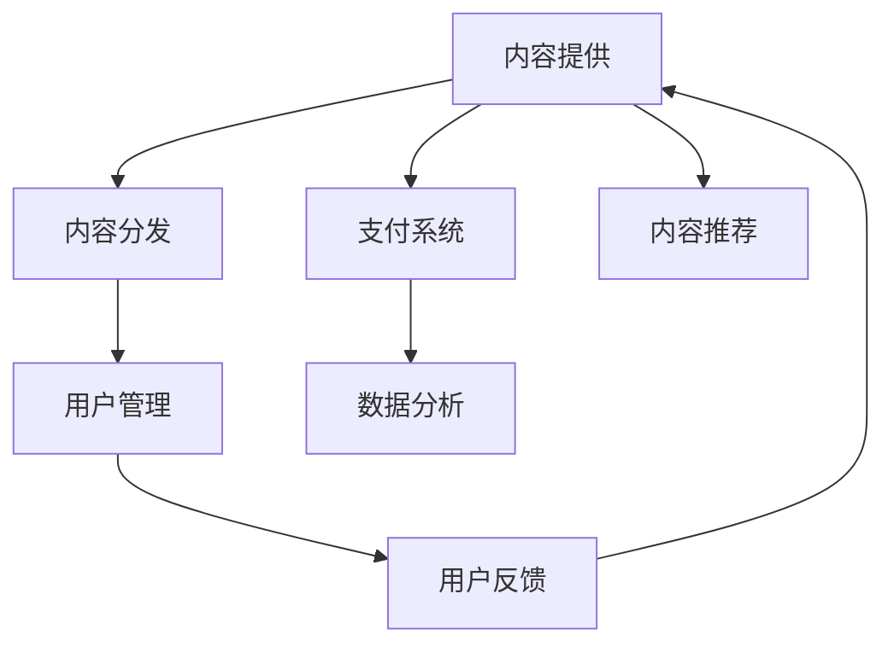

                 

# 知识付费平台搭建指南：程序员创业必读

## 1. 背景介绍

### 1.1 问题由来
近年来，随着互联网和移动互联网的迅猛发展，知识付费市场呈现出蓬勃发展态势。互联网与知识结合，催生了在线教育、知识分享、专家咨询等多个子领域。在线教育平台如“得到”、“知乎”，知识分享平台如“分答”、“行研帮”，以及专家咨询服务如“腾讯云专家、丁香医生”等，都开始通过知识付费模式，提供高质量的线上教育服务。

在知识付费的浪潮下，越来越多的程序员开始关注这一领域，考虑是否可以将自己的专业知识或技能转化为价值，以实现创业。然而，知识付费平台的搭建并不是一件简单的事情，涉及技术选型、市场运营、商业模式等多方面考量。本文将系统介绍知识付费平台的搭建流程与关键技术，帮助有志于创业的程序员快速入门。

### 1.2 问题核心关键点
知识付费平台的核心在于内容的提供与分发，以及用户对内容的付费行为。技术上，平台需要保证内容上传、存储、渲染、分发的稳定性，以及与支付系统的对接，同时确保用户体验良好。商业上，则需要通过市场运营、流量获取、用户留存等方式，实现知识变现。

本文将从技术、商业两方面切入，通过逻辑清晰、结构紧凑、通俗易懂的语言，深入探讨知识付费平台的搭建关键点。

### 1.3 问题研究意义
知识付费平台的搭建对于程序员而言，不仅是技术和商业的一次创新尝试，更是对现有知识体系的一次梳理与提升。通过知识付费平台，程序员可以将自己的专业知识传授给他人，同时也能从平台运营中学习到市场营销、用户管理等重要技能。此外，搭建知识付费平台还能加速创业者对人工智能、云计算、大数据等前沿技术的理解和应用。

## 2. 核心概念与联系

### 2.1 核心概念概述

为更好地理解知识付费平台的搭建，我们首先介绍几个关键概念：

- **知识付费平台**：基于互联网，提供优质内容与付费服务，以知识变现的在线平台。典型的知识付费平台如“得到”、“喜马拉雅”等。
- **内容提供**：平台汇聚各类专业内容，如文章、视频、音频等，提供用户消费。
- **内容分发**：采用技术手段，将内容推送给用户，实现高效匹配。
- **支付系统**：保证用户与平台之间的交易安全、高效，通常由第三方支付平台提供。
- **用户管理**：用户身份认证、行为跟踪、权益管理等，通过大数据、人工智能等技术实现。
- **数据分析**：通过数据分析，了解用户行为、内容消费趋势等，指导平台运营。

这些概念之间的联系紧密，构成了知识付费平台的基础框架。平台通过对内容提供与分发的优化，搭配完善的支付系统和用户管理机制，实现知识变现与增长。

### 2.2 核心概念原理和架构的 Mermaid 流程图



这个流程图展示了知识付费平台的核心架构：

1. 内容提供(A)是平台的根基，汇聚各类优质内容。
2. 内容分发(B)通过推荐算法将内容推送给用户，实现高效匹配。
3. 支付系统(C)保障交易安全，与第三方支付平台合作。
4. 用户管理(D)实现用户身份认证、行为跟踪等功能。
5. 数据分析(E)通过用户行为数据，指导平台运营。
6. 用户反馈(F)收集用户意见，持续优化平台体验。
7. 内容推荐(G)依据用户历史行为，推荐相关内容，提升用户粘性。

这一架构体现了知识付费平台的整体运作流程，各环节相互关联，协同工作。

## 3. 核心算法原理 & 具体操作步骤
### 3.1 算法原理概述

知识付费平台的核心算法分为内容推荐算法和用户管理算法。以下分别介绍这两部分内容。

### 3.2 算法步骤详解

#### 内容推荐算法

1. **用户画像构建**
   - 基于用户行为数据，如浏览、收藏、支付等，构建用户画像，描述用户兴趣、偏好等。
   - 使用协同过滤、标签聚类等方法对用户进行分类，便于推荐系统理解用户。

2. **内容特征提取**
   - 对每篇内容进行特征提取，如关键词、标签、时长、评分等，作为推荐算法的输入。
   - 利用自然语言处理技术，如TF-IDF、Word2Vec等，提取文本内容的语义特征。

3. **推荐模型训练**
   - 基于协同过滤、内容基推荐、混合推荐等模型，训练推荐算法。
   - 常用的协同过滤算法包括基于用户的协同过滤和基于物品的协同过滤。

4. **推荐结果生成**
   - 根据用户画像和内容特征，生成推荐结果。
   - 可以使用深度学习模型，如序列推荐模型、自适应推荐模型等，提升推荐效果。

#### 用户管理算法

1. **身份认证**
   - 基于密码、邮箱、社交账号等，实现用户身份认证。
   - 可引入生物识别、双因素认证等技术，提升安全性和用户体验。

2. **行为跟踪**
   - 记录用户行为数据，如登录、浏览、学习时长等，为后续分析提供依据。
   - 使用分布式日志系统，如Apache Kafka、ELK stack等，处理海量日志数据。

3. **权益管理**
   - 管理用户付费订阅、课程观看、积分兑换等权益。
   - 利用区块链技术，保证权益管理的透明性和不可篡改性。

4. **用户反馈分析**
   - 收集用户反馈数据，通过情感分析、意图识别等技术，了解用户满意度和需求。
   - 根据反馈数据，优化内容提供与分发，提升用户粘性。

### 3.3 算法优缺点

内容推荐算法的优点：

1. 提高用户体验。通过个性化推荐，使用户快速获取感兴趣的内容。
2. 提升内容消费量。通过精准推荐，提升内容观看、阅读、收听等消费量。
3. 增加平台收入。通过精准付费用户推荐，提升平台付费用户转化率。

内容推荐算法的缺点：

1. 用户隐私问题。推荐算法需要收集用户行为数据，可能带来隐私问题。
2. 数据冷启动问题。新用户缺乏历史行为数据，难以进行有效推荐。
3. 数据不均衡问题。某些热门内容的曝光率远高于其他内容，导致资源分配不均。

用户管理算法的优点：

1. 提升用户留存。通过用户画像和行为跟踪，及时发现流失用户，进行挽留。
2. 保障交易安全。通过身份认证和支付加密，保障交易安全，提升用户信任度。
3. 优化用户体验。通过权益管理与用户反馈，不断优化平台功能与界面。

用户管理算法的缺点：

1. 数据复杂性高。用户数据涉及隐私保护，处理复杂度高。
2. 计算资源消耗大。用户行为数据量大，处理过程中计算资源消耗大。
3. 系统架构复杂。涉及身份认证、行为跟踪、权益管理等多方面功能，系统架构复杂。

### 3.4 算法应用领域

知识付费平台的算法技术可以应用于多个领域，如在线教育、内容分发、广告推荐等，提升平台的用户体验和运营效率。

1. **在线教育**：通过个性化推荐，帮助学生快速找到适合自己的课程。
2. **内容分发**：为新闻、博客、社交媒体等平台，提供精准内容推荐，提升用户黏性。
3. **广告推荐**：为广告主提供精准用户群体，提升广告投放效果。

## 4. 数学模型和公式 & 详细讲解

### 4.1 数学模型构建

设用户集合为 $U$，内容集合为 $V$，行为数据为 $D$。内容推荐模型 $R$ 输入为 $U \times V$ 的特征矩阵 $X$，用户行为数据 $D$。模型的输出为对每个用户 $u$，推荐内容集合 $V$ 中的内容 $v$ 的概率 $p(v|u)$。

推荐模型的优化目标是最大化用户对推荐内容的满意度，即最大化期望满意度 $E[R(u)]$。

### 4.2 公式推导过程

推荐模型常用的公式为：

$$
p(v|u) = \frac{\exp(X_u \cdot \theta_v)}{\sum_{v' \in V} \exp(X_u \cdot \theta_{v'})}
$$

其中，$X_u$ 为第 $u$ 个用户的特征向量，$\theta_v$ 为内容 $v$ 的参数向量，$\exp$ 为指数函数。

在模型训练过程中，通常采用最大似然估计（MLE）或交叉熵损失函数进行优化。

### 4.3 案例分析与讲解

以基于协同过滤的推荐算法为例，假设有用户 $u_1$ 和 $u_2$，以及内容 $v_1$ 和 $v_2$，行为数据如表所示：

| 用户 | 内容 | 观看次数 |
| ---- | ---- | -------- |
| $u_1$ | $v_1$ | 5        |
| $u_1$ | $v_2$ | 2        |
| $u_2$ | $v_1$ | 3        |
| $u_2$ | $v_2$ | 1        |

根据协同过滤算法，计算 $u_1$ 和 $u_2$ 对 $v_2$ 的相似度，得：

$$
similarity(u_1,v_2) = \frac{1}{\sqrt{3}} \times 2 \times 5 = \frac{10}{\sqrt{3}}
$$

$$
similarity(u_2,v_2) = \frac{1}{\sqrt{2}} \times 1 \times 3 = \frac{3}{\sqrt{2}}
$$

最终，推荐系统推荐内容 $v_2$ 给用户 $u_1$ 的概率为：

$$
p(v_2|u_1) = \frac{\frac{10}{\sqrt{3}}}{\frac{10}{\sqrt{3}}+\frac{3}{\sqrt{2}}} \approx 0.8
$$

通过案例分析，可以看出协同过滤算法在推荐系统中的应用效果。

## 5. 项目实践：代码实例和详细解释说明

### 5.1 开发环境搭建

知识付费平台的搭建涉及多个技术栈，开发环境需要满足以下条件：

1. **前端**：采用 React、Vue 等框架，实现用户界面和交互。
2. **后端**：采用 Spring Boot、Django 等框架，处理业务逻辑和数据存储。
3. **数据库**：采用 MySQL、MongoDB 等关系型或非关系型数据库。
4. **缓存**：采用 Redis、Memcached 等内存缓存系统。
5. **消息队列**：采用 Kafka、RabbitMQ 等消息队列系统。
6. **支付系统**：与第三方支付平台（如支付宝、微信支付）对接。

### 5.2 源代码详细实现

以下是知识付费平台的源代码实现示例，使用 Spring Boot 和 MySQL 数据库：

```java
// 用户模块
@RestController
@RequestMapping("/users")
public class UserController {
    @Autowired
    private UserService userService;
    
    @GetMapping("/{id}")
    public User getUser(@PathVariable Long id) {
        return userService.findById(id);
    }
    
    @PostMapping("/signup")
    public void signUp(@RequestBody User user) {
        userService.save(user);
    }
}

// 内容模块
@RestController
@RequestMapping("/content")
public class ContentController {
    @Autowired
    private ContentService contentService;
    
    @GetMapping("/{id}")
    public Content getContent(@PathVariable Long id) {
        return contentService.findById(id);
    }
    
    @PostMapping("/subscribe")
    public void subscribe(@RequestBody Subscription subscription) {
        contentService.subscribe(subscription.getUserId(), subscription.getContentId());
    }
}

// 支付模块
@RestController
@RequestMapping("/payment")
public class PaymentController {
    @Autowired
    private PaymentService paymentService;
    
    @PostMapping("/submit")
    public void submitPayment(@RequestBody Payment payment) {
        paymentService.submit(payment);
    }
}
```

### 5.3 代码解读与分析

上述代码展示了知识付费平台的核心模块，包括用户、内容、支付等模块。

- 用户模块：实现了用户注册、查询等功能，封装了用户服务的业务逻辑。
- 内容模块：实现了内容浏览、订阅等功能，封装了内容服务的业务逻辑。
- 支付模块：实现了支付提交等功能，封装了支付服务的业务逻辑。

这些模块的设计基于 Spring Boot 框架的 MVC 模式，通过 RESTful API 进行数据交换。前端使用 React 组件化开发，后端使用 Spring Boot 处理业务逻辑和数据存储，数据库使用 MySQL，缓存使用 Redis，消息队列使用 Kafka。支付系统与第三方支付平台对接，保障交易安全。

## 6. 实际应用场景

### 6.1 智能客服

智能客服作为知识付费平台的重要组成部分，能够自动回答用户常见问题，提升用户体验。通过语音识别、自然语言处理等技术，智能客服系统可以理解用户意图，自动提供解决方案。

具体实现流程如下：

1. **语音识别**：将用户的语音转化为文本，便于后续处理。
2. **意图识别**：通过机器学习模型，理解用户意图，如查询课程、支付费用等。
3. **智能回复**：根据用户意图，智能客服系统自动生成回答，并通过语音或文本形式回复用户。

智能客服的优点在于提高用户满意度、减轻人工客服负担，降低人力成本。

### 6.2 内容推荐

内容推荐系统是知识付费平台的核心功能，通过推荐优质内容，提升用户粘性，增加平台收入。

具体实现流程如下：

1. **特征提取**：提取内容特征，如标题、标签、时长、评分等。
2. **模型训练**：训练推荐模型，如协同过滤、内容基推荐、混合推荐等。
3. **结果生成**：根据用户画像和内容特征，生成推荐结果。
4. **展示与反馈**：将推荐结果展示给用户，收集用户反馈，优化推荐算法。

内容推荐的优点在于提高用户内容消费量、提升平台收入。

### 6.3 数据分析

数据分析是知识付费平台的重要辅助功能，通过数据挖掘和分析，了解用户行为、内容消费趋势等，指导平台运营。

具体实现流程如下：

1. **数据收集**：收集用户行为数据，如浏览、收藏、支付等。
2. **数据存储**：使用数据库存储海量数据，如 MySQL、MongoDB 等。
3. **数据分析**：使用数据分析工具，如 Hadoop、Spark 等，分析用户行为数据。
4. **可视化**：将分析结果可视化，展示给运营人员，指导平台运营。

数据分析的优点在于提升平台运营效率、优化平台功能。

### 6.4 未来应用展望

未来，知识付费平台将向更多领域拓展，如医疗健康、法律咨询、金融理财等。同时，随着 AI、大数据等技术的进步，知识付费平台将实现更多智能化功能，如语音识别、自然语言生成、智能推荐等。

## 7. 工具和资源推荐

### 7.1 学习资源推荐

- **《深度学习》**：Ian Goodfellow 著，系统介绍深度学习理论和实践。
- **《机器学习实战》**：Peter Harrington 著，涵盖多种机器学习算法实现。
- **《TensorFlow 实战》**：王大力 著，系统介绍 TensorFlow 框架及其应用。

### 7.2 开发工具推荐

- **IDE**：如 VSCode、IntelliJ IDEA，提升开发效率。
- **版本控制**：如 Git，管理代码变更。
- **构建工具**：如 Maven、Gradle，自动化构建和打包。
- **测试工具**：如 JUnit、TestNG，自动化测试和覆盖率分析。

### 7.3 相关论文推荐

- **《深度学习在推荐系统中的应用》**：田进辉、李佳、程杰、张睿 著，系统介绍深度学习在推荐系统中的应用。
- **《知识图谱在推荐系统中的应用》**：李禹成、王兴华、刘伟、杨波 著，探讨知识图谱在推荐系统中的应用。
- **《知识付费平台的运营优化》**：吴海峰、周丽华、陈淑芳 著，探讨知识付费平台的运营优化策略。

## 8. 总结：未来发展趋势与挑战

### 8.1 总结

本文详细介绍了知识付费平台的搭建流程与关键技术，包括内容推荐、用户管理、数据分析等。通过对这些核心技术的理解，读者可以全面掌握知识付费平台的搭建方法，帮助有志于创业的程序员快速入门。

知识付费平台不仅是一个技术产品，更是一个商业项目。创业者在搭建平台时，需要综合考虑技术、商业、市场等多个方面，确保平台能够成功落地。

### 8.2 未来发展趋势

1. **AI 技术应用**：人工智能技术在推荐、智能客服、数据分析等方面将发挥越来越重要的作用，提升平台的用户体验和运营效率。
2. **大数据应用**：大数据技术将助力知识付费平台收集和分析更多用户数据，优化推荐算法，提升平台价值。
3. **区块链技术应用**：区块链技术可以保障用户权益、增强数据安全，为知识付费平台提供新的解决方案。

### 8.3 面临的挑战

1. **技术复杂性**：知识付费平台的搭建涉及多个技术栈和业务模块，技术实现复杂度高。
2. **数据隐私**：用户数据涉及隐私保护，处理过程中需要注意数据安全。
3. **商业模式**：知识付费平台需要平衡内容质量、用户体验和商业收入，找到可持续发展之路。

### 8.4 研究展望

未来的研究可以围绕以下方向展开：

1. **个性化推荐**：基于深度学习等技术，开发更加精准的个性化推荐算法，提升用户体验。
2. **智能客服**：引入自然语言处理等技术，提升智能客服系统的自然交互能力，降低人工客服负担。
3. **数据安全**：研究和应用区块链等技术，保障用户数据安全，提升平台信任度。
4. **商业模式**：探索多元化的商业模式，如内容付费、会员订阅、广告变现等，实现平台多样化收入。

综上所述，知识付费平台的搭建是一个技术、商业并重的复杂项目，需要系统化、多维度地进行设计和实施。希望本文能为有志于创业的程序员提供参考，帮助他们在知识付费领域取得成功。

---

作者：禅与计算机程序设计艺术 / Zen and the Art of Computer Programming

