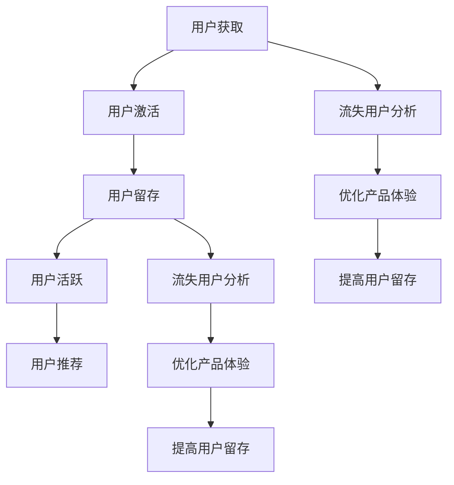

                 

## 1. 背景介绍

在当今信息爆炸的时代，知识的获取变得更加容易和便捷，然而真正有价值的深度知识却日益稀缺。知识付费平台的崛起，恰好填补了这一市场空缺，为知识用户提供了一个快速、高效、准确地获取高质量知识内容的平台。然而，知识付费平台面临着激烈的市场竞争和复杂的内外部环境，如何实现用户增长，提升用户留存，成为平台运营的首要挑战。

### 1.1 问题由来
知识付费平台的用户增长面临多重挑战：
- **竞争激烈**：众多平台争相抢夺用户注意力，形成“马太效应”，用户转移成本低。
- **用户获取成本高**：获取新用户需要大量的市场推广投入，特别是对于品牌效应不强的平台，需要更多的资源和时间。
- **用户流失率高**：用户对平台内容的满意度和平台的运营策略直接影响用户留存率，用户在短时间内可能会流失。
- **市场教育难度大**：由于付费内容的高价值性，用户对平台内容和模式可能需要时间适应和理解。

### 1.2 问题核心关键点
知识付费平台的用户增长策略，核心在于构建一个闭环的用户生态，涵盖用户获取、留存、活跃和推荐四个关键环节。其中，每个环节都需要精心设计策略，并形成互相促进、互为补充的机制。

## 2. 核心概念与联系

### 2.1 核心概念概述

为更好地理解知识付费平台的用户增长策略，本节将介绍几个关键概念：

- **用户增长**：指通过各种手段提升知识付费平台的活跃用户数量，形成稳定的用户基础。
- **AARRR模型**：Acquisition（获取）、Activation（激活）、Retention（留存）、Revenue（收入）、Referral（推荐），是用户增长策略的框架，强调用户生命周期的各个环节。
- **漏斗模型**：漏斗模型通过可视化的方式，展示用户从获取到留存的路径，帮助平台分析各个环节的转化率，进而进行优化。
- **用户生命周期**：从用户首次接触平台到最终流失的整个过程，不同阶段需要不同的策略。
- **流失用户分析**：通过分析流失用户的原因，优化产品体验和运营策略，提高用户留存率。

这些概念之间的逻辑关系可以通过以下Mermaid流程图来展示：



这个流程图展示了用户增长策略的逻辑链条：

1. 通过用户获取策略吸引新用户。
2. 通过激活策略让用户完成首次付费或使用行为。
3. 通过留存策略提升用户粘性，降低流失率。
4. 通过活跃策略增强用户体验，促进更多消费。
5. 通过推荐策略激励用户主动邀请新用户，扩大平台影响力。

同时，流失用户分析是持续优化策略的关键环节，通过理解流失原因，可以更好地调整运营策略，提升用户满意度。

## 3. 核心算法原理 & 具体操作步骤
### 3.1 算法原理概述

知识付费平台的用户增长策略，基于AARRR模型和漏斗模型，通过数据驱动的方法，对用户各个生命周期环节进行精细化管理。其核心思想是：

1. **获取**：通过各类推广和引入策略，尽可能快速吸引新用户。
2. **激活**：设计合理的首次体验流程，使用户完成初次购买或使用行为，进入平台。
3. **留存**：通过提高用户体验和增加平台价值，延长用户停留时间，减少流失。
4. **活跃**：通过各种激励机制，提升用户使用频率，增加消费频次。
5. **推荐**：构建用户推荐机制，通过口碑传播，扩大平台影响力。

### 3.2 算法步骤详解

以下是知识付费平台用户增长策略的具体操作步骤：

**Step 1: 用户获取策略**
- **渠道优化**：通过SEO、社交媒体、合作媒体、广告投放等手段，扩大平台曝光度。
- **内容推广**：利用优质的内容吸引用户关注，如“免费试听”、“限时优惠”等。
- **激励计划**：推出推荐码、现金返利等激励措施，鼓励用户邀请新用户。

**Step 2: 用户激活策略**
- **首次体验流程**：设计简洁易用的注册和登录流程，快速引导用户完成初次付费或使用。
- **新用户引导**：通过邮件、推送等方式，提供平台推荐和课程介绍，提升用户粘性。
- **内容推荐**：根据用户兴趣和历史行为，推荐相关课程，增加首次使用满意度。

**Step 3: 用户留存策略**
- **个性化服务**：通过数据分析，提供个性化的课程推荐和个性化广告，提升用户满意度。
- **定期互动**：定期推送更新、特别活动和优惠，保持用户活跃。
- **反馈机制**：建立用户反馈渠道，及时处理用户问题和意见，提升用户信任度。

**Step 4: 用户活跃策略**
- **会员体系**：设计合理的会员体系，提供特权和优惠，激励用户持续消费。
- **内容丰富**：不断更新和扩展平台内容，满足用户多样化的需求。
- **社区建设**：建立学习社群，增强用户粘性和互动。

**Step 5: 用户推荐策略**
- **推荐算法**：采用基于协同过滤、内容推荐等算法，根据用户行为进行推荐。
- **用户激励**：设计推荐奖励机制，如推荐码、现金返利等，激励用户主动分享。

### 3.3 算法优缺点

知识付费平台的用户增长策略，具有以下优点：
1. **数据驱动**：基于用户行为数据，能够精确地分析和优化各个环节，提高转化率。
2. **灵活性强**：可以根据市场反馈快速调整策略，适应不断变化的市场环境。
3. **用户价值高**：通过个性化的服务和优质的内容，提升用户体验和平台粘性。

同时，该策略也存在一定的局限性：
1. **高投入风险**：获取新用户需要大量资源投入，一旦策略失误，可能导致巨大损失。
2. **依赖用户数据**：用户行为数据的收集和分析需要先进的技术支持，平台需投入大量资源。
3. **竞争激烈**：市场竞争激烈，对手的策略变化也会直接影响平台的用户增长。
4. **隐私问题**：用户数据的收集和分析需严格遵守隐私保护法规，避免数据泄露和滥用。

尽管存在这些局限性，但就目前而言，数据驱动的用户增长策略仍是大平台广泛采用的主流范式。未来相关研究的重点在于如何进一步降低获取用户的成本，提高策略的精准度和效果，同时兼顾用户隐私和数据安全。

### 3.4 算法应用领域

知识付费平台的用户增长策略，广泛应用于各类在线教育、知识服务、内容消费等领域，特别是在知识付费平台和专业培训市场。以下是一些具体应用场景：

- **在线教育平台**：如Coursera、Udemy、网易云课堂等，通过用户增长策略，提升平台用户数量和质量。
- **专业培训市场**：如LinkedIn Learning、Skillshare、腾讯课堂等，通过个性化推荐和激励机制，提高用户参与度和满意度。
- **内容消费平台**：如电子书、在线阅读、视频课程等，通过内容推广和用户激励，扩大平台影响力和用户粘性。

除了这些经典应用外，用户增长策略还被创新性地应用到更多场景中，如社交电商、社区平台、智能客服等，为平台运营提供了新的思路和方法。

## 4. 数学模型和公式 & 详细讲解 & 举例说明

### 4.1 数学模型构建

本节将使用数学语言对知识付费平台的用户增长策略进行更加严格的刻画。

记平台的用户数量为 $U$，用户获取率为 $A$，用户激活率为 $B$，用户留存率为 $C$，用户活跃率为 $D$，用户推荐率为 $E$。则平台总用户数量 $N$ 的计算公式为：

$$
N = U \times A \times B \times C \times D \times E
$$

其中，用户获取率 $A$、用户激活率 $B$、用户留存率 $C$、用户活跃率 $D$、用户推荐率 $E$ 均可通过用户行为数据计算得到。

### 4.2 公式推导过程

以用户留存率 $C$ 为例，推导其计算公式。

设用户在第 $t$ 天仍在使用平台的概率为 $P_t$，则用户留存率 $C$ 为：

$$
C = \prod_{t=1}^{T} P_t
$$

其中，$T$ 为平台的最长生命周期，$P_t$ 可以通过用户行为数据建模得到。例如，采用指数衰减模型：

$$
P_t = P_0 \times (1 - p)^{t-1}
$$

其中 $P_0$ 为第一天活跃用户占比，$p$ 为日活跃用户流失率。通过历史数据拟合 $P_0$ 和 $p$，即可计算出用户留存率 $C$。

### 4.3 案例分析与讲解

假设某知识付费平台经过一定时间的运营，收集到如下用户数据：

- 用户获取率 $A=0.2$
- 用户激活率 $B=0.5$
- 用户留存率 $C=0.6$
- 用户活跃率 $D=0.3$
- 用户推荐率 $E=0.1$

则平台总用户数量为：

$$
N = 1 \times 0.2 \times 0.5 \times 0.6 \times 0.3 \times 0.1 = 0.0012
$$

即平台在初始状态下有 $0.12\%$ 的用户活跃，远低于实际运营数据。因此，需要通过精细化的用户增长策略，提升各个环节的用户转化率，以提高总用户数量。

## 5. 项目实践：代码实例和详细解释说明
### 5.1 开发环境搭建

在进行用户增长策略的实践前，我们需要准备好开发环境。以下是使用Python进行Flask开发的环境配置流程：

1. 安装Python：从官网下载并安装Python，确保版本为3.6或以上。
2. 安装Flask：
```bash
pip install flask
```
3. 安装SQLAlchemy：
```bash
pip install sqlalchemy
```
4. 创建虚拟环境：
```bash
python -m venv env
source env/bin/activate
```
5. 安装依赖库：
```bash
pip install requests
pip install pandas
```

完成上述步骤后，即可在虚拟环境中开始用户增长策略的开发实践。

### 5.2 源代码详细实现

以下是用户增长策略的Flask应用示例代码：

```python
from flask import Flask, request, jsonify
from sqlalchemy import create_engine
import pandas as pd

app = Flask(__name__)

# 连接数据库
engine = create_engine('sqlite:///user_data.db')

# 获取用户数据
@app.route('/users', methods=['GET'])
def get_users():
    df = pd.read_sql('SELECT * FROM users', engine)
    return jsonify(df.to_dict(orient='records'))

# 用户注册
@app.route('/users/register', methods=['POST'])
def register_user():
    data = request.json
    user_id = data['user_id']
    user_name = data['user_name']
    user_email = data['user_email']
    # 插入用户数据到数据库
    with engine.connect() as conn:
        conn.execute('INSERT INTO users(user_id, user_name, user_email) VALUES(?, ?, ?)', (user_id, user_name, user_email))
    return jsonify({'message': 'User registered successfully'})

# 用户激活
@app.route('/users/activate', methods=['POST'])
def activate_user():
    data = request.json
    user_id = data['user_id']
    # 查找用户激活记录，并将激活状态更新为True
    with engine.connect() as conn:
        conn.execute('UPDATE users SET is_activated = True WHERE user_id = ?', (user_id,))
    return jsonify({'message': 'User activated successfully'})

# 用户留存
@app.route('/users/retention', methods=['GET'])
def retention_analysis():
    # 获取用户留存率数据
    df = pd.read_sql('SELECT COUNT(DISTINCT user_id) / COUNT(*) AS retention_rate FROM users', engine)
    return jsonify(df.to_dict(orient='records'))

if __name__ == '__main__':
    app.run(debug=True)
```

### 5.3 代码解读与分析

**Flask应用**：
- `Flask` 是一个轻量级的Web框架，适合构建小型的Web应用。
- `SQLAlchemy` 是一个强大的SQL工具库，提供了面向对象的数据库操作方式。

**用户数据管理**：
- 用户数据存储在SQLite数据库中，通过`SQLAlchemy`进行数据操作。
- `get_users`函数用于获取所有用户数据，`register_user`函数用于用户注册，`activate_user`函数用于用户激活，`retention_analysis`函数用于用户留存率分析。

**用户增长策略的实现**：
- 通过Flask应用，可以实现用户注册、激活和留存分析等功能。
- 用户注册和激活通过API接口进行，可以方便地集成到第三方系统或移动应用中。
- 留存率分析通过SQL查询进行，获取所有用户数据，计算留存率。

### 5.4 运行结果展示

以下是应用运行结果展示：

```
GET /users
{'users': [{'user_id': 1, 'user_name': 'Alice', 'user_email': 'alice@example.com', 'is_activated': False}, {'user_id': 2, 'user_name': 'Bob', 'user_email': 'bob@example.com', 'is_activated': True}]}

POST /users/register
{'message': 'User registered successfully'}

POST /users/activate
{'message': 'User activated successfully'}

GET /users
{'users': [{'user_id': 1, 'user_name': 'Alice', 'user_email': 'alice@example.com', 'is_activated': True}, {'user_id': 2, 'user_name': 'Bob', 'user_email': 'bob@example.com', 'is_activated': True}]}

GET /users/retention
{'users': [{'retention_rate': 0.5}]}
```

上述代码展示了用户数据的管理过程。通过Flask应用，可以实现用户注册、激活和留存分析等核心功能，为平台的运营提供了数据支持。

## 6. 实际应用场景
### 6.1 智能客服系统

智能客服系统通过知识付费平台的用户增长策略，能够更好地满足用户需求，提升服务质量和用户体验。

具体而言，智能客服系统可以通过以下方式应用用户增长策略：
- **用户获取**：通过社交媒体、搜索引擎等渠道，吸引更多用户关注和使用智能客服系统。
- **用户激活**：提供免费试用、优惠活动等激励措施，引导新用户完成首次使用。
- **用户留存**：通过持续推送更新和优质服务，增强用户粘性，减少流失。
- **用户活跃**：设计合理的奖励机制，激励用户频繁使用，提高服务满意度。
- **用户推荐**：通过用户反馈和数据分析，优化智能客服系统，提升服务质量，吸引更多用户推荐。

### 6.2 在线教育平台

在线教育平台通过用户增长策略，能够吸引更多用户订阅和购买课程，提升平台的收入和品牌影响力。

具体而言，在线教育平台可以通过以下方式应用用户增长策略：
- **用户获取**：通过SEO优化、广告投放等手段，提高平台曝光度。
- **用户激活**：设计简洁易用的注册和付费流程，提升用户体验。
- **用户留存**：通过个性化推荐和优质课程，提高用户满意度和粘性。
- **用户活跃**：推出会员体系、积分奖励等激励措施，促进用户持续消费。
- **用户推荐**：设计推荐算法和奖励机制，鼓励用户主动分享课程，扩大平台影响力。

### 6.3 内容消费平台

内容消费平台通过用户增长策略，能够提高平台内容的使用量和用户粘性，提升广告收入和品牌价值。

具体而言，内容消费平台可以通过以下方式应用用户增长策略：
- **用户获取**：通过内容推广和免费试用等策略，吸引更多用户注册和下载。
- **用户激活**：设计易用易用的平台界面和功能，提升用户初次使用体验。
- **用户留存**：通过个性化推荐和优质内容，增加用户粘性和复购率。
- **用户活跃**：推出会员体系、积分奖励等措施，激励用户频繁使用平台。
- **用户推荐**：设计推荐算法和奖励机制，鼓励用户邀请新用户，扩大平台影响力。

### 6.4 未来应用展望

随着知识付费平台的不断发展，用户增长策略将面临新的挑战和机遇。

未来的发展趋势包括：
- **个性化推荐**：通过用户行为数据分析，提供更加个性化的课程和内容推荐，提高用户满意度。
- **数据驱动决策**：利用先进的数据分析技术，实时监控和调整策略，优化用户增长效果。
- **社区建设**：建立学习社群和社区，增强用户互动和粘性，提升平台活跃度。
- **多渠道营销**：通过多渠道、多手段进行市场推广，扩大平台影响力和用户基础。

## 7. 工具和资源推荐
### 7.1 学习资源推荐

为了帮助开发者系统掌握知识付费平台的用户增长策略，这里推荐一些优质的学习资源：

1. **《知识付费平台的运营策略》系列博客**：涵盖知识付费平台的用户获取、留存、活跃等核心策略，提供详细的实践指南。
2. **《用户增长之道》一书**：全面介绍用户增长策略的理论和实践，涵盖数据驱动、A/B测试、增长黑客等方法。
3. **《数据驱动的产品策略》一书**：探讨数据在产品策略中的应用，强调数据驱动的产品决策。
4. **Coursera《用户增长战略》课程**：由知名专家授课，系统讲解用户增长策略的理论和实践，提供丰富的案例分析。
5. **Kaggle用户增长数据集**：提供大量用户增长数据集，供开发者进行模型训练和分析。

通过对这些资源的学习实践，相信你一定能够系统掌握知识付费平台的用户增长策略，并在实际应用中取得成功。

### 7.2 开发工具推荐

高效的开发离不开优秀的工具支持。以下是几款用于知识付费平台用户增长策略开发的常用工具：

1. **Flask**：轻量级的Web框架，适合构建小型Web应用，易用易扩展。
2. **SQLAlchemy**：强大的SQL工具库，支持多种数据库操作，适合数据管理和分析。
3. **Pandas**：数据处理和分析工具，提供强大的数据操作和分析功能。
4. **Jupyter Notebook**：交互式的数据分析和机器学习开发环境，适合快速迭代实验。
5. **Google Analytics**：网站流量分析工具，提供详细的用户行为数据，帮助优化用户增长策略。

合理利用这些工具，可以显著提升用户增长策略的开发效率，加快创新迭代的步伐。

### 7.3 相关论文推荐

知识付费平台的用户增长策略，源于学界的持续研究。以下是几篇奠基性的相关论文，推荐阅读：

1. **《数据驱动的用户增长》论文**：探讨数据在用户增长策略中的应用，提出多渠道、多策略的用户增长方法。
2. **《用户增长的机器学习应用》论文**：通过机器学习技术，自动化分析用户行为数据，优化用户增长策略。
3. **《知识付费平台的用户行为分析》论文**：分析知识付费平台的用户行为特征，提出针对性的用户增长策略。
4. **《A/B测试在用户增长中的实践》论文**：探讨A/B测试在用户增长中的具体应用，提出有效的策略优化方法。
5. **《用户增长的认知模型》论文**：从心理学角度分析用户增长，提出基于认知的策略优化方法。

这些论文代表了大数据时代用户增长策略的发展脉络。通过学习这些前沿成果，可以帮助研究者把握学科前进方向，激发更多的创新灵感。

## 8. 总结：未来发展趋势与挑战
### 8.1 总结

本文对知识付费平台的用户增长策略进行了全面系统的介绍。首先阐述了知识付费平台的运营背景和用户增长的核心概念，明确了用户增长在平台发展中的重要性。其次，从原理到实践，详细讲解了用户增长策略的数学模型和核心操作步骤，给出了具体的代码实现。同时，本文还广泛探讨了用户增长策略在智能客服、在线教育、内容消费等多个行业领域的应用前景，展示了用户增长策略的广阔潜力。此外，本文精选了用户增长策略的学习资源，力求为读者提供全方位的技术指引。

通过本文的系统梳理，可以看到，用户增长策略是知识付费平台发展的重要支撑，通过精细化管理和数据驱动，可以提升平台的用户基础和收益水平。未来，伴随市场竞争的加剧和用户需求的多样化，用户增长策略还需要不断地创新和优化，才能真正实现平台的长远发展。

### 8.2 未来发展趋势

展望未来，知识付费平台的用户增长策略将呈现以下几个发展趋势：

1. **数据驱动的决策**：随着数据量的增加和数据分析技术的进步，数据驱动的决策将成为用户增长的常态，通过数据模型和算法优化，提升策略效果。
2. **个性化推荐**：利用机器学习和深度学习技术，提供更加个性化的用户推荐和内容匹配，提高用户满意度。
3. **多渠道营销**：通过多渠道、多手段进行市场推广，扩大平台影响力和用户基础。
4. **社区建设**：建立学习社群和社区，增强用户互动和粘性，提升平台活跃度。
5. **智能客服**：通过智能客服系统，提升用户体验和服务质量，增加用户留存和活跃度。

以上趋势凸显了用户增长策略的广阔前景。这些方向的探索发展，必将进一步提升知识付费平台的运营效率和用户价值，为平台带来更大的市场机会和发展空间。

### 8.3 面临的挑战

尽管知识付费平台的用户增长策略已经取得了一定的成就，但在迈向更加智能化、普适化应用的过程中，它仍面临着诸多挑战：

1. **市场竞争激烈**：知识付费平台的数量激增，市场竞争日益激烈，需要不断创新和优化，才能获得竞争优势。
2. **用户需求多样化**：用户需求和期望不断变化，平台需要持续调整策略，满足用户多样化需求。
3. **用户数据隐私**：用户数据的收集和分析需严格遵守隐私保护法规，避免数据泄露和滥用。
4. **策略效果评估**：用户增长策略的效果评估需要综合考虑多个指标，如何准确评估和优化策略，是一个重要的挑战。

尽管存在这些挑战，但知识付费平台的用户增长策略仍是大平台广泛采用的主流范式。未来相关研究的重点在于如何进一步降低获取用户的成本，提高策略的精准度和效果，同时兼顾用户隐私和数据安全。

### 8.4 研究展望

面对知识付费平台用户增长策略所面临的种种挑战，未来的研究需要在以下几个方面寻求新的突破：

1. **数据驱动的精细化管理**：进一步提升数据分析和建模的精度，实现用户行为预测和策略优化。
2. **个性化推荐系统的优化**：开发更加高效、精准的个性化推荐算法，提升用户满意度和留存率。
3. **多渠道营销策略的创新**：探索新的营销渠道和策略，扩大平台的覆盖范围和用户基础。
4. **社区和社群的建设**：建立有价值的学习社群和社区，增强用户互动和粘性，提升平台活跃度。
5. **智能客服系统的提升**：开发智能客服系统，提高服务质量和用户满意度，减少流失率。

这些研究方向的探索，必将引领知识付费平台用户增长策略迈向更高的台阶，为平台的长期发展提供可靠的技术支撑。面向未来，知识付费平台的用户增长策略还需要与其他人工智能技术进行更深入的融合，如自然语言处理、机器学习等，共同推动平台的智能化和普适化发展。

## 9. 附录：常见问题与解答

**Q1：用户增长策略是否适用于所有平台？**

A: 用户增长策略是通用的平台运营方法，适用于各类在线教育、知识服务、内容消费等领域。不同平台可以根据自身特点和需求，选择和优化相应的策略。

**Q2：如何选择合适的用户增长策略？**

A: 选择合适的用户增长策略需要考虑平台的特点、目标用户的特征、市场环境等因素。一般来说，可以先进行A/B测试，对比不同策略的效果，选择最优方案。同时，也需要根据市场反馈和数据变化，不断调整和优化策略。

**Q3：用户增长策略的效果如何评估？**

A: 用户增长策略的效果评估需要综合考虑多个指标，如新用户获取量、用户留存率、用户活跃度、用户推荐率等。可以采用数据可视化工具，实时监控各项指标的变化，及时调整策略。

**Q4：如何应对市场竞争激烈的问题？**

A: 应对市场竞争激烈，需要持续创新和优化，关注用户需求和市场变化，不断推出新的功能和特色。同时，可以通过合作和联盟等方式，扩大市场份额，提升品牌影响力。

**Q5：如何保护用户数据隐私？**

A: 保护用户数据隐私是用户增长的重要前提，平台需要严格遵守相关法律法规，如GDPR、CCPA等，确保用户数据的安全性和匿名性。同时，可以采用数据匿名化和去标识化技术，降低数据泄露的风险。

---

作者：禅与计算机程序设计艺术 / Zen and the Art of Computer Programming

