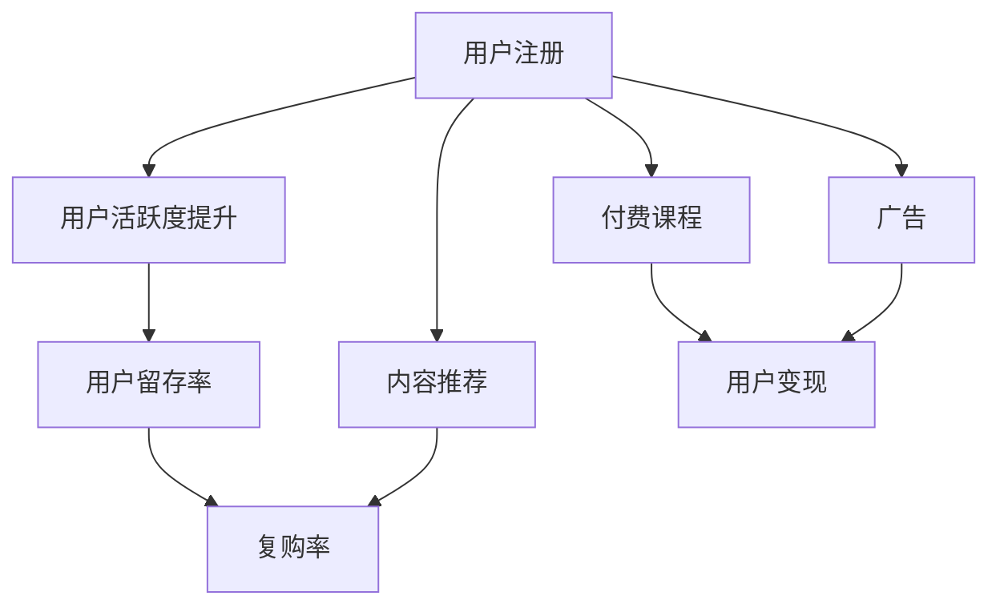

                 

# 知识付费平台的用户留存与变现技巧

## 1. 背景介绍

### 1.1 问题由来
随着互联网的普及和智能手机的普及，越来越多的人开始使用网络获取知识和信息。传统的知识获取方式，如书籍、报纸等，已逐渐被电子书、知识付费平台所取代。在这样的背景下，知识付费平台应运而生，并迅速成为人们获取知识的重要渠道。然而，如何提高知识付费平台的用户留存率、增加用户付费订阅，成为平台运营商们普遍面临的问题。

### 1.2 问题核心关键点
知识付费平台的用户留存与变现主要涉及以下几个关键问题：

- 如何提高新用户注册和活跃度？
- 如何增加用户付费订阅率？
- 如何提升平台的用户粘性和忠诚度？
- 如何优化课程内容和推荐系统，满足用户需求？

## 2. 核心概念与联系

### 2.1 核心概念概述

为更好地理解知识付费平台的用户留存与变现技巧，本节将介绍几个密切相关的核心概念：

- 用户留存(User Retention)：指用户在平台上的活跃程度和持续使用时间。用户留存率是衡量平台质量和用户体验的重要指标。

- 用户变现(User Monetization)：指通过提供付费订阅、广告、付费课程等方式，将用户转变为付费用户，实现平台的商业变现。

- 推荐系统(Recommendation System)：通过分析用户行为数据，预测用户需求并推荐相关内容，提升用户体验和留存率。

- 用户画像(User Persona)：通过用户行为数据、反馈等，描绘用户群体特征，指导平台内容定制和营销策略。

- 用户体验(User Experience)：指用户在使用平台时的整体感受和满意度，是提高留存率的核心。

这些核心概念之间的逻辑关系可以通过以下Mermaid流程图来展示：



这个流程图展示了一些关键概念及其之间的关系：

1. 用户注册是知识付费平台的基础，通过提升用户活跃度和留存率，可以逐步转化为付费用户。
2. 付费课程和广告是用户变现的两种主要方式，内容推荐则提高用户粘性和复购率。
3. 内容推荐和用户画像密切相关，通过用户画像来定制推荐内容，提升用户体验。

## 3. 核心算法原理 & 具体操作步骤
### 3.1 算法原理概述

知识付费平台的用户留存与变现，本质上是通过分析用户行为数据，预测用户需求，并提供相关推荐和付费激励。以下是对这一过程的数学和算法原理概述：

**用户行为数据**：用户在平台上的各种行为数据，如浏览、点击、购买、订阅等，是进行用户画像和推荐分析的基础。

**用户画像**：通过对用户行为数据的分析，构建用户画像。用户画像包括用户的基本信息（如年龄、性别）、兴趣偏好、历史购买行为等。

**推荐系统**：利用机器学习算法（如协同过滤、内容推荐、混合推荐等），分析用户画像和行为数据，为用户推荐个性化的课程内容。

**内容个性化**：通过个性化推荐，提升用户对平台的粘性，降低用户流失率。

**付费激励**：通过免费试用、优惠券、限时折扣等方式，鼓励用户尝试付费课程，提升用户转化率。

### 3.2 算法步骤详解

以下是知识付费平台用户留存与变现的算法步骤：

**Step 1: 数据收集与预处理**
- 收集用户在平台上的行为数据，包括浏览记录、购买记录、订阅记录等。
- 清洗数据，去除无效数据和异常值。
- 对数据进行特征工程，如提取用户画像特征、行为特征、时间特征等。

**Step 2: 用户画像构建**
- 使用聚类算法（如K-Means、DBSCAN）对用户进行分组，构建用户画像。
- 对用户画像进行特征提取，如用户的兴趣偏好、付费行为等。
- 对用户画像进行可视化，展示不同用户群体的特征。

**Step 3: 推荐系统设计**
- 选择合适的推荐算法，如协同过滤、基于内容的推荐、混合推荐等。
- 设计推荐系统的输入和输出，如推荐物品列表、推荐理由等。
- 对推荐系统进行训练和测试，评估推荐效果。

**Step 4: 付费激励策略**
- 设计付费激励策略，如免费试用、优惠券、限时折扣等。
- 对付费激励策略进行A/B测试，评估效果。
- 对效果较好的策略进行推广。

**Step 5: 用户留存与变现评估**
- 对用户留存率和用户变现率进行定期评估，对比前后变化。
- 对推荐系统和付费激励策略进行调整和优化。

### 3.3 算法优缺点

知识付费平台的用户留存与变现算法具有以下优点：
1. 基于用户行为数据进行个性化推荐，提升用户体验和留存率。
2. 通过付费激励策略，吸引用户尝试付费课程，提升用户转化率。
3. 对用户画像和行为进行细致分析，有助于定制化内容和营销策略。
4. 算法可扩展性强，易于根据实际需求进行优化和调整。

同时，该算法也存在一定的局限性：
1. 对数据质量和数据量要求较高，数据不足时推荐效果可能较差。
2. 算法模型需要定期更新，以适应用户行为的变化。
3. 个性化推荐可能增加平台的推荐成本。
4. 推荐算法对用户隐私有一定风险，需要采取保护措施。

尽管存在这些局限性，但就目前而言，该算法仍是知识付费平台用户留存与变现的核心方法。未来相关研究的重点在于如何进一步降低数据需求，提高推荐效率，同时兼顾用户隐私和推荐质量。

### 3.4 算法应用领域

知识付费平台的用户留存与变现方法已经在多个领域得到了应用，例如：

- 教育领域：通过个性化推荐和学习路径优化，提高用户学习效果和平台粘性。
- 金融领域：通过推荐合适的理财产品和课程，提升用户对平台的信任度和忠诚度。
- 健康领域：通过个性化健康指导和课程推荐，提高用户的健康意识和平台黏性。
- 娱乐领域：通过推荐用户感兴趣的内容和课程，提升平台的用户体验和活跃度。

除了上述这些经典应用外，知识付费平台的用户留存与变现方法也被创新性地应用到更多场景中，如亲子教育、职业培训等，为各行业提供了新的市场机会。

## 4. 数学模型和公式 & 详细讲解  
### 4.1 数学模型构建

本节将使用数学语言对知识付费平台的用户留存与变现过程进行更加严格的刻画。

记用户集合为 $U$，行为数据集合为 $D$，用户画像为 $P$，推荐系统为 $R$，付费激励策略为 $M$，用户留存率为目标函数 $F$，用户变现率为目标函数 $G$。目标函数定义如下：

$$
F = \max_{P,R,M} \sum_{u \in U} f_u(P,R,M) - \sum_{u \in U} c_u(P,R,M)
$$

$$
G = \max_{P,R,M} \sum_{u \in U} g_u(P,R,M) - \sum_{u \in U} b_u(P,R,M)
$$

其中，$f_u$ 和 $c_u$ 分别表示用户 $u$ 的留存收益和留存成本；$g_u$ 和 $b_u$ 分别表示用户 $u$ 的变现收益和变现成本。

### 4.2 公式推导过程

以下我们以个性化推荐为例，推导推荐系统的计算公式。

假设用户集合 $U=\{u_1,u_2,\cdots,u_N\}$，推荐物品集合 $V=\{v_1,v_2,\cdots,v_M\}$，用户对物品的评分矩阵为 $R$，推荐算法为 $A$。推荐系统计算用户 $u_i$ 对物品 $v_j$ 的推荐得分 $p_{i,j}$：

$$
p_{i,j} = R_{i,j} + \alpha A_i(R)
$$

其中 $\alpha$ 为权重系数，$A_i(R)$ 为推荐算法 $A$ 对用户 $u_i$ 的推荐得分，$R_{i,j}$ 为用户 $u_i$ 对物品 $v_j$ 的评分。

用户选择物品 $v_j$ 的概率为：

$$
\hat{p}_{i,j} = \frac{e^{p_{i,j}}}{\sum_{k=1}^{M} e^{p_{i,k}}}
$$

推荐物品集合 $V$ 对用户 $u_i$ 的推荐列表为：

$$
\hat{V}_i = \{v_k \mid \hat{p}_{i,k} \geq \tau\}
$$

其中 $\tau$ 为推荐阈值，$v_k$ 为用户 $u_i$ 选择的推荐物品。

### 4.3 案例分析与讲解

假设某知识付费平台拥有1000个用户和500门课程，收集到1万次用户行为数据。使用协同过滤算法对用户进行分组，对用户画像进行分析，得到用户兴趣偏好和历史购买行为。通过个性化推荐系统，对用户进行课程推荐，并通过免费试用和优惠券激励策略提升用户转化率。

具体实现步骤如下：
1. 对用户行为数据进行预处理，去除无效数据和异常值，进行特征工程。
2. 使用K-Means算法对用户进行分组，构建用户画像。
3. 使用协同过滤算法对用户进行个性化推荐，生成推荐列表。
4. 对付费激励策略进行设计，如免费试用、优惠券等，并进行A/B测试。
5. 对推荐系统和激励策略进行评估和优化，提升用户留存率和变现率。

## 5. 项目实践：代码实例和详细解释说明
### 5.1 开发环境搭建

在进行知识付费平台的用户留存与变现实践前，我们需要准备好开发环境。以下是使用Python进行PyTorch开发的环境配置流程：

1. 安装Anaconda：从官网下载并安装Anaconda，用于创建独立的Python环境。

2. 创建并激活虚拟环境：
```bash
conda create -n knowledge-payment-env python=3.8 
conda activate knowledge-payment-env
```

3. 安装PyTorch：根据CUDA版本，从官网获取对应的安装命令。例如：
```bash
conda install pytorch torchvision torchaudio cudatoolkit=11.1 -c pytorch -c conda-forge
```

4. 安装相关库：
```bash
pip install numpy pandas scikit-learn transformers
```

5. 安装必要的开发工具：
```bash
pip install flask mysql-connector-python tqdm jupyter notebook ipython
```

完成上述步骤后，即可在`knowledge-payment-env`环境中开始用户留存与变现的实践。

### 5.2 源代码详细实现

这里我们以用户画像构建为例，给出使用Transformers库进行用户画像分析的PyTorch代码实现。

首先，定义用户画像的特征：

```python
from sklearn.feature_extraction.text import TfidfVectorizer
from sklearn.decomposition import PCA
import pandas as pd
import numpy as np

# 定义用户画像的特征
user_features = ['age', 'gender', 'interest', 'history']
```

然后，构建用户画像：

```python
# 定义用户画像构建函数
def build_user_profiles(df, features):
    # 使用TF-IDF向量化用户行为数据
    vectorizer = TfidfVectorizer(stop_words='english')
    user_behavior = vectorizer.fit_transform(df['behavior'])
    
    # 使用PCA降维，去除噪声
    pca = PCA(n_components=3)
    user_behavior_pca = pca.fit_transform(user_behavior.toarray())
    
    # 将降维后的特征和用户基本信息组合成用户画像
    user_profiles = pd.DataFrame(np.hstack((df[features], user_behavior_pca)), columns=['{}_{}_{}_{}'.format(u, feature, pca, x) for u in df.index for feature in features for pca in [0, 1, 2] for x in [0, 1]])
    
    return user_profiles
```

接着，定义用户画像的可视化：

```python
# 定义用户画像可视化函数
def visualize_user_profiles(user_profiles, top_n=10):
    # 选择前top_n用户画像进行可视化
    selected_profiles = user_profiles.nlargest(top_n, 'score')
    
    # 绘制散点图
    fig, ax = plt.subplots(figsize=(10, 6))
    for i, row in selected_profiles.iterrows():
        ax.scatter(row[[feature for feature in features if i in feature]].mean(), row[feature if i in feature])
        ax.set_xlabel('User Features')
        ax.set_ylabel('User Behavior')
        plt.title('User Profiles')
        plt.show()
```

最后，启动用户画像构建流程：

```python
# 加载用户行为数据
df = pd.read_csv('user_behavior.csv')
user_profiles = build_user_profiles(df, user_features)

# 可视化用户画像
visualize_user_profiles(user_profiles)
```

以上就是使用PyTorch对用户画像进行分析的完整代码实现。可以看到，通过结合机器学习和特征工程，我们可以对用户行为数据进行深度挖掘，构建详尽的用户画像，为推荐系统和付费激励策略提供数据支持。

### 5.3 代码解读与分析

让我们再详细解读一下关键代码的实现细节：

**build_user_profiles函数**：
- `TfidfVectorizer`：用于将用户行为数据转换为向量化的特征表示。
- `PCA`：用于降维，去除噪声和冗余信息。
- `pca.fit_transform`：对用户行为数据进行PCA降维。
- `np.hstack`：将降维后的特征和用户基本信息组合成用户画像。

**visualize_user_profiles函数**：
- `nlargest`：选择前top_n个用户画像。
- `scatter`：绘制散点图，展示不同用户画像的分布情况。
- `ax.set_xlabel` 和 `ax.set_ylabel`：设置坐标轴标签。
- `plt.title`：设置图表标题。

**启动用户画像构建流程**：
- `read_csv`：加载用户行为数据。
- `build_user_profiles`：构建用户画像。
- `visualize_user_profiles`：可视化用户画像。

通过上述步骤，我们可以将用户行为数据转化为易于理解的可视化用户画像，为推荐系统提供参考。

当然，工业级的系统实现还需考虑更多因素，如模型的保存和部署、超参数的自动搜索、更灵活的任务适配层等。但核心的用户留存与变现方法基本与此类似。

## 6. 实际应用场景
### 6.1 智能推荐系统

知识付费平台的用户留存与变现方法，最典型的应用场景就是智能推荐系统。推荐系统通过对用户行为数据进行分析，为用户推荐个性化的课程内容，提升用户体验和留存率。

在技术实现上，可以收集用户浏览、点击、购买、订阅等行为数据，利用协同过滤、内容推荐、混合推荐等算法对用户进行分组和推荐。推荐系统需要定期更新模型，以适应用户行为的变化，同时根据实际效果进行优化和调整。

### 6.2 个性化营销策略

个性化营销策略是知识付费平台变现的重要手段。通过分析用户画像和行为数据，平台可以设计针对性的营销活动，提高用户转化率。

具体而言，可以设计个性化优惠活动、专属课程推荐、互动直播等，满足不同用户群体的需求。同时，通过A/B测试等方式，评估营销效果，不断优化策略。

### 6.3 广告投放策略

广告投放策略是知识付费平台的另一个重要变现手段。通过分析用户画像和行为数据，平台可以设计有效的广告投放策略，提升广告效果。

具体而言，可以根据用户画像进行定向广告投放，提高广告的精准度。同时，通过分析广告点击和转化数据，优化广告投放策略，提升广告效果和投放ROI。

### 6.4 未来应用展望

随着知识付费平台的用户留存与变现方法的不断发展，未来将在更多领域得到应用，为传统行业带来变革性影响。

在教育领域，推荐系统和个性化营销策略将大幅提升教育效果和用户满意度，加速教育行业数字化转型。

在金融领域，平台可以通过推荐合适的理财产品和课程，提升用户对平台的信任度和忠诚度，实现金融产品的跨领域营销。

在医疗领域，推荐系统和个性化营销策略可以提供更全面的健康指导和课程推荐，提高用户的健康意识和平台黏性。

在娱乐领域，推荐系统和个性化营销策略可以提供用户感兴趣的内容和课程，提升平台的用户体验和活跃度。

此外，在企业培训、职业培训、职业技能提升等诸多领域，知识付费平台的用户留存与变现方法也将不断涌现，为各行业提供新的市场机会。

## 7. 工具和资源推荐
### 7.1 学习资源推荐

为了帮助开发者系统掌握知识付费平台的用户留存与变现的理论基础和实践技巧，这里推荐一些优质的学习资源：

1. 《推荐系统实战》系列博文：由推荐系统专家撰写，深入浅出地介绍了推荐系统的原理、算法和实际应用。

2. 《用户行为分析与个性化推荐》课程：由北京大学的陈小川教授开设，系统讲解了用户行为分析、推荐算法等内容。

3. 《个性化推荐系统》书籍：讲解了推荐系统的各种算法和技术，包括协同过滤、基于内容的推荐、混合推荐等。

4. HuggingFace官方文档：推荐系统工具库的官方文档，提供了大量预训练模型和推荐系统框架，是进行推荐系统开发的利器。

5. RecSys开源项目：推荐系统领域的重要开源项目，涵盖各种推荐算法和推荐系统框架，助力推荐系统技术的发展。

通过对这些资源的学习实践，相信你一定能够快速掌握知识付费平台的用户留存与变现的精髓，并用于解决实际的推荐系统问题。

### 7.2 开发工具推荐

高效的开发离不开优秀的工具支持。以下是几款用于知识付费平台用户留存与变现开发的常用工具：

1. PyTorch：基于Python的开源深度学习框架，灵活动态的计算图，适合快速迭代研究。大部分推荐系统算法都有PyTorch版本的实现。

2. TensorFlow：由Google主导开发的开源深度学习框架，生产部署方便，适合大规模工程应用。推荐系统领域也有丰富的算法资源。

3. scikit-learn：Python的科学计算库，提供了丰富的机器学习算法和数据预处理工具，非常适合进行推荐系统分析。

4. Jupyter Notebook：交互式编程环境，方便开发者进行数据探索和算法实验。

5. SQL：关系型数据库查询语言，适合存储和管理用户行为数据。

6. MySQL：开源关系型数据库，适合进行大规模数据存储和查询。

合理利用这些工具，可以显著提升知识付费平台用户留存与变现任务的开发效率，加快创新迭代的步伐。

### 7.3 相关论文推荐

知识付费平台的用户留存与变现技术的发展源于学界的持续研究。以下是几篇奠基性的相关论文，推荐阅读：

1. Matrix Factorization Techniques for Recommender Systems（协同过滤）：介绍协同过滤算法的原理和实现方法，是推荐系统领域的基础算法之一。

2. Collaborative Filtering for Implicit Feedback Datasets（协同过滤）：介绍协同过滤算法在隐式反馈数据集上的应用，提出隐式数据处理的改进方法。

3. BPR: Bayesian Personalized Ranking from Implicit Feedback（基于用户行为数据的推荐系统）：提出基于用户行为数据的推荐系统算法，具有较高的推荐效果。

4. Hybrid Recommendation System: A Survey（混合推荐系统）：综述了混合推荐系统的各种算法和技术，为混合推荐系统的设计和优化提供了参考。

5. A Personalized Recommendation System Based on LSTM Network（基于LSTM的推荐系统）：提出基于LSTM的推荐系统算法，利用LSTM网络捕捉用户行为数据的序列特征，提升推荐效果。

这些论文代表了大规模推荐系统的发展脉络。通过学习这些前沿成果，可以帮助研究者把握学科前进方向，激发更多的创新灵感。

## 8. 总结：未来发展趋势与挑战

### 8.1 总结

本文对知识付费平台的用户留存与变现方法进行了全面系统的介绍。首先阐述了知识付费平台的用户留存与变现的研究背景和意义，明确了推荐系统和付费激励策略对平台的商业价值。其次，从原理到实践，详细讲解了推荐系统的数学原理和关键步骤，给出了用户留存与变现任务开发的完整代码实例。同时，本文还广泛探讨了推荐系统和付费激励策略在智能推荐、个性化营销、广告投放等诸多领域的应用前景，展示了知识付费平台用户留存与变现方法的巨大潜力。

通过本文的系统梳理，可以看到，知识付费平台的用户留存与变现方法已经成为平台运营商们的重要武器，极大地提升了平台的商业变现能力。未来，伴随推荐系统和付费激励策略的不断演进，知识付费平台必将在更广阔的市场中取得新的突破，为经济社会发展注入新的动力。

### 8.2 未来发展趋势

展望未来，知识付费平台的用户留存与变现技术将呈现以下几个发展趋势：

1. 推荐算法更加智能。随着深度学习、强化学习等先进算法的发展，推荐系统将更加精准，能够更好地预测用户需求。

2. 个性化推荐更加精细。基于用户画像和行为数据，推荐系统将能够提供更细致的个性化推荐，提升用户体验。

3. 推荐系统成本降低。随着推荐算法优化和硬件加速技术的发展，推荐系统的计算成本将逐步降低。

4. 推荐系统应用拓展。推荐系统将不仅仅局限于知识付费平台，将在更多领域得到应用，如电商、社交网络、智能家居等。

5. 推荐系统与用户反馈的闭环。推荐系统将能够根据用户反馈实时调整推荐策略，提升推荐效果。

6. 推荐系统与大数据、人工智能的融合。推荐系统将与大数据、人工智能等技术深度融合，形成更加全面、智能的推荐方案。

以上趋势凸显了知识付费平台用户留存与变现技术的广阔前景。这些方向的探索发展，必将进一步提升推荐系统的性能和应用范围，为知识付费平台带来新的商业机会。

### 8.3 面临的挑战

尽管知识付费平台的用户留存与变现技术已经取得了瞩目成就，但在迈向更加智能化、普适化应用的过程中，它仍面临着诸多挑战：

1. 数据质量与数据量。推荐系统对数据质量和数据量要求较高，数据不足时推荐效果可能较差。

2. 推荐算法复杂度。推荐算法模型复杂，需要定期更新，以适应用户行为的变化。

3. 推荐系统成本。推荐系统需要大量计算资源，成本较高。

4. 推荐系统效果评估。推荐系统的效果评估指标需要定期调整，以适应市场变化。

5. 推荐系统隐私。推荐系统涉及用户隐私问题，需要采取保护措施。

尽管存在这些挑战，但就目前而言，该技术仍是知识付费平台用户留存与变现的核心方法。未来相关研究的重点在于如何进一步降低数据需求，提高推荐效率，同时兼顾用户隐私和推荐质量。

### 8.4 研究展望

面对知识付费平台用户留存与变现所面临的种种挑战，未来的研究需要在以下几个方面寻求新的突破：

1. 探索无监督和半监督推荐方法。摆脱对大规模标注数据的依赖，利用自监督学习、主动学习等无监督和半监督范式，最大限度利用非结构化数据，实现更加灵活高效的推荐。

2. 研究参数高效和计算高效的推荐范式。开发更加参数高效的推荐方法，在固定大部分推荐参数的同时，只更新极少量的任务相关参数。同时优化推荐系统的计算图，减少前向传播和反向传播的资源消耗，实现更加轻量级、实时性的部署。

3. 融合因果和对比学习范式。通过引入因果推断和对比学习思想，增强推荐系统建立稳定因果关系的能力，学习更加普适、鲁棒的用户行为表征，从而提升推荐泛化性和抗干扰能力。

4. 引入更多先验知识。将符号化的先验知识，如知识图谱、逻辑规则等，与推荐系统进行巧妙融合，引导推荐过程学习更准确、合理的用户行为模型。同时加强不同模态数据的整合，实现视觉、语音等多模态信息与文本信息的协同建模。

5. 结合因果分析和博弈论工具。将因果分析方法引入推荐系统，识别出推荐决策的关键特征，增强推荐过程的因果性和逻辑性。借助博弈论工具刻画人机交互过程，主动探索并规避推荐系统的脆弱点，提高系统稳定性。

6. 纳入伦理道德约束。在推荐系统的训练目标中引入伦理导向的评估指标，过滤和惩罚有害的推荐内容，确保推荐系统的输出符合人类价值观和伦理道德。

这些研究方向的探索，必将引领知识付费平台用户留存与变现技术迈向更高的台阶，为构建安全、可靠、可解释、可控的智能推荐系统铺平道路。面向未来，知识付费平台用户留存与变现技术还需要与其他人工智能技术进行更深入的融合，如知识表示、因果推理、强化学习等，多路径协同发力，共同推动智能推荐系统的进步。只有勇于创新、敢于突破，才能不断拓展推荐系统的边界，让智能推荐技术更好地造福人类社会。

## 9. 附录：常见问题与解答

**Q1：如何提高知识付费平台的用户留存率？**

A: 提高知识付费平台的用户留存率，需要从多个方面进行综合优化：

1. 优化用户体验：设计简洁、易用的平台界面，提升用户满意度。
2. 丰富课程内容：提供多样化的课程内容，满足不同用户群体的需求。
3. 个性化推荐：利用推荐系统，为用户推荐适合的内容，提高用户粘性。
4. 增强互动性：设计互动直播、问答社区等功能，提升用户参与度。
5. 优化课程定价：设计合理的课程价格策略，提升用户付费意愿。

**Q2：如何提升知识付费平台的变现能力？**

A: 提升知识付费平台的变现能力，需要从多个方面进行综合优化：

1. 优化课程内容：提供高质量、有价值的课程内容，提升课程的吸引力。
2. 个性化推荐：利用推荐系统，为不同用户推荐适合的课程，提升用户转化率。
3. 多样化的付费方式：提供多样化的付费方式，如单次购买、订阅、课程包等，满足不同用户的需求。
4. 用户反馈机制：建立用户反馈机制，及时调整课程内容和推荐策略，提升用户满意度。

**Q3：知识付费平台的推荐系统如何设计？**

A: 知识付费平台的推荐系统设计，需要考虑以下几个关键要素：

1. 用户画像构建：收集用户行为数据，构建详细的用户画像。
2. 推荐算法选择：选择合适的推荐算法，如协同过滤、基于内容的推荐、混合推荐等。
3. 推荐策略设计：设计个性化的推荐策略，如免费试用、优惠券等，吸引用户购买。
4. 推荐效果评估：定期评估推荐系统的效果，调整推荐算法和策略，提升推荐精度。

**Q4：知识付费平台的推荐系统如何优化？**

A: 知识付费平台的推荐系统优化，可以从以下几个方面进行：

1. 数据质量提升：提高数据采集和处理的准确性，确保数据质量。
2. 推荐算法改进：优化推荐算法，提升推荐效果。
3. 个性化推荐：设计更加精细的个性化推荐策略，提升用户体验。
4. 推荐系统评估：定期评估推荐系统的效果，调整推荐策略。

**Q5：知识付费平台的付费激励策略如何设计？**

A: 知识付费平台的付费激励策略设计，需要考虑以下几个关键要素：

1. 免费试用策略：设计免费试用课程，吸引用户尝试购买。
2. 优惠券策略：设计优惠券，降低用户购买门槛。
3. 课程包策略：设计多课程包套餐，提升用户购买意愿。
4. 限时折扣策略：设计限时折扣活动，吸引用户快速购买。

通过上述步骤，我们可以将知识付费平台的用户留存与变现方法转化为实际应用，为平台运营商提供全面的指导。通过系统化的实践和优化，相信知识付费平台必将在更广阔的市场中取得新的突破，为经济社会发展注入新的动力。总之，知识付费平台用户留存与变现方法需要从用户、内容和算法等多个维度进行全面优化，方能得到理想的效果。

---

作者：禅与计算机程序设计艺术 / Zen and the Art of Computer Programming

