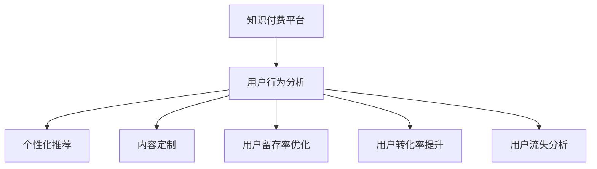

                 

# 知识付费平台的用户行为分析与应用

> 关键词：知识付费、用户行为、数据分析、个性化推荐、业务优化、用户留存、用户转化率、业务增长

## 1. 背景介绍

### 1.1 问题由来
随着移动互联网和数字经济的高速发展，知识付费成为越来越多人获取高质量知识内容的重要方式。知识付费平台如得到、知乎live、网易云课堂等，基于用户对知识的需求，为用户提供专业、系统、有价值的学习内容。然而，由于知识付费平台的商品化特征，用户的付费行为受到多重因素的影响。平台如何通过科学的分析方法，精确地理解和预测用户的行为，提升用户的满意度和平台的业务增长，成为一个亟需解决的问题。

### 1.2 问题核心关键点
用户行为分析是知识付费平台实现业务优化和增长的重要手段。通过对用户的行为数据进行分析，平台可以挖掘出用户真实的需求和偏好，优化产品设计和服务流程，提升用户留存和转化率，最终实现业务的增长和扩展。具体而言，核心关键点包括：

1. **用户行为数据获取**：如何有效地收集和处理用户行为数据，如购买记录、浏览记录、评价反馈等，以便进行深入分析。
2. **用户行为分析方法**：运用哪些数据分析技术和算法，如聚类、回归、分类等，对用户行为进行建模和预测。
3. **用户行为预测应用**：如何将分析结果转化为具体业务决策，如个性化推荐、内容定制、营销策略优化等，从而提升用户满意度和服务质量。

### 1.3 问题研究意义
通过深入分析用户行为，知识付费平台可以更好地满足用户需求，提升用户粘性和平台留存率，最终实现业务的持续增长。具体而言：

1. **提升用户留存率**：通过分析用户行为，了解用户流失原因，设计针对性的策略，提升用户忠诚度。
2. **优化用户体验**：根据用户行为数据，优化产品设计和功能实现，提升用户满意度。
3. **增加用户转化率**：通过精准推荐和个性化服务，提升潜在用户的付费意愿，增加平台收益。
4. **指导内容生产**：通过用户行为分析，了解用户对内容的偏好，指导平台内容生产，提升内容质量和用户粘性。

## 2. 核心概念与联系

### 2.1 核心概念概述

为更好地理解知识付费平台的用户行为分析方法，本节将介绍几个密切相关的核心概念：

- **知识付费平台**：基于移动互联网和数字技术，为用户提供高质量知识内容并收取费用的在线平台。
- **用户行为分析**：通过对用户行为数据（如购买、浏览、互动等）进行分析，揭示用户需求和行为模式，从而指导业务决策。
- **个性化推荐**：根据用户历史行为和实时数据，向用户推荐可能感兴趣的内容，提升用户满意度和平台转化率。
- **内容定制化**：根据用户偏好和需求，定制化生成或展示内容，增强用户体验。
- **用户留存率**：衡量用户在平台上停留的时间，反映用户对平台的依赖度和满意度。
- **用户转化率**：衡量潜在用户转化为付费用户的比例，反映平台的盈利能力。
- **用户流失分析**：分析用户流失原因，优化用户体验和服务流程，提升用户留存率。

这些核心概念之间的逻辑关系可以通过以下Mermaid流程图来展示：



这个流程图展示了几大核心概念及其之间的关系：

1. 知识付费平台通过用户行为分析，获取用户需求和行为模式。
2. 根据分析结果，进行个性化推荐和内容定制，提升用户满意度。
3. 通过优化用户留存率和提升用户转化率，实现业务增长。
4. 通过分析用户流失原因，进行针对性的策略调整，提高用户留存率。

这些概念共同构成了知识付费平台的业务优化框架，使其能够更好地服务用户，推动业务发展。

## 3. 核心算法原理 & 具体操作步骤

### 3.1 算法原理概述

知识付费平台的用户行为分析主要基于统计分析、机器学习和深度学习等技术手段。其核心思想是：通过收集和处理用户行为数据，构建用户行为模型，并根据模型预测用户的行为倾向，从而指导平台优化产品设计和服务流程。

形式化地，假设用户行为数据集为 $D=\{(x_i,y_i)\}_{i=1}^N$，其中 $x_i$ 表示用户行为特征向量，$y_i$ 表示用户行为标签（如是否付费、购买商品、流失等）。知识付费平台的目标是找到最优的预测模型 $f(x)$，使得：

$$
f(x_i) \approx y_i
$$

其中 $f(x)$ 可以是一个简单的线性回归模型、逻辑回归模型，也可以是复杂的神经网络模型。通过最小化预测误差，模型能够准确预测用户的行为，从而指导业务决策。

### 3.2 算法步骤详解

知识付费平台的用户行为分析一般包括以下几个关键步骤：

**Step 1: 数据准备**
- 收集和清洗用户行为数据，包括购买记录、浏览记录、评价反馈等。
- 对数据进行初步处理和特征提取，构建用户行为特征向量 $x$。
- 划分训练集和测试集，用于模型训练和评估。

**Step 2: 模型选择与训练**
- 根据业务需求，选择合适的机器学习或深度学习模型，如线性回归、逻辑回归、决策树、随机森林、神经网络等。
- 对模型进行超参数调优，选择最优模型参数。
- 在训练集上对模型进行训练，最小化预测误差。

**Step 3: 模型评估与优化**
- 使用测试集对训练好的模型进行评估，计算预测准确率、召回率、F1分数等指标。
- 根据评估结果，调整模型参数，优化模型性能。
- 使用交叉验证等方法，进一步验证模型的泛化能力。

**Step 4: 业务应用与迭代优化**
- 将训练好的模型应用到实际业务场景中，如个性化推荐、内容定制、流失用户预测等。
- 实时监测模型效果，根据业务反馈进行迭代优化。
- 定期重新训练模型，适应数据分布的变化。

以上是知识付费平台用户行为分析的一般流程。在实际应用中，还需要针对具体业务场景，对分析过程的各个环节进行优化设计，如改进特征提取方法，引入更多的用户行为数据等，以进一步提升分析效果。

### 3.3 算法优缺点

知识付费平台用户行为分析的主要优点包括：

1. **数据驱动决策**：基于数据建模和预测，可以科学地指导业务决策，减少决策的盲目性。
2. **用户行为洞察**：通过深入分析用户行为，了解用户真实需求和偏好，提升用户体验。
3. **业务效果显著**：优化个性化推荐和内容定制，提升用户满意度和转化率，实现业务增长。
4. **灵活可扩展**：根据业务需求，选择适合的分析方法和模型，灵活应对不同的业务场景。

同时，该方法也存在一定的局限性：

1. **数据质量和完整性**：用户行为数据的收集和处理需要较高技术门槛，数据质量可能存在问题。
2. **模型复杂度**：复杂的机器学习和深度学习模型计算量大，可能带来较大的技术负担。
3. **隐私和安全**：用户行为数据涉及隐私问题，数据采集和处理需要遵守相关法律法规，保护用户隐私。
4. **实时性要求**：实时性要求高的业务场景，需要保证模型预测的及时性，这可能对数据处理和模型推理带来挑战。

尽管存在这些局限性，但就目前而言，基于机器学习和深度学习的用户行为分析方法，仍然是大数据时代知识付费平台业务优化的重要手段。未来相关研究的重点在于如何进一步降低数据处理的复杂度，提高模型的实时性和可解释性，同时兼顾用户隐私和数据安全。

### 3.4 算法应用领域

知识付费平台的用户行为分析方法，已经在多种业务场景中得到了广泛的应用，例如：

1. **个性化推荐**：通过分析用户浏览和购买行为，推荐可能感兴趣的内容。
2. **内容定制化**：根据用户偏好和需求，定制化生成或展示内容，提升用户体验。
3. **用户留存率优化**：分析用户流失原因，设计针对性的策略，提升用户忠诚度。
4. **用户转化率提升**：通过精准推荐和个性化服务，提升潜在用户的付费意愿。
5. **新用户获取**：分析新用户特征和行为，设计有效的市场推广策略。

除了上述这些经典场景外，用户行为分析还被创新性地应用到更多业务中，如用户兴趣预测、行为序列建模、用户细分等，为知识付费平台的业务增长提供了新思路。随着分析方法的不断演进，相信用户行为分析将在更多业务领域发挥更大的作用，推动知识付费平台的可持续发展。

## 4. 数学模型和公式 & 详细讲解  
### 4.1 数学模型构建

本节将使用数学语言对知识付费平台的用户行为分析过程进行更加严格的刻画。

假设用户行为数据集为 $D=\{(x_i,y_i)\}_{i=1}^N$，其中 $x_i$ 表示用户行为特征向量，$y_i$ 表示用户行为标签。定义模型 $f(x)$ 为线性回归模型，形式化地，用户行为分析的目标是找到最优的线性回归系数 $\theta$，使得：

$$
f(x_i) = \theta^T x_i
$$

其中 $x_i \in \mathbb{R}^d$，$d$ 为特征维度，$\theta \in \mathbb{R}^d$。定义损失函数为平均均方误差损失：

$$
\mathcal{L}(\theta) = \frac{1}{N}\sum_{i=1}^N (y_i - f(x_i))^2
$$

最小化损失函数 $\mathcal{L}(\theta)$ 得到最优参数 $\theta^*$。

### 4.2 公式推导过程

以下我们以用户流失预测为例，推导线性回归模型的训练和预测过程。

假设用户流失行为数据集为 $D=\{(x_i,y_i)\}_{i=1}^N$，其中 $x_i$ 表示用户行为特征向量，$y_i \in \{0,1\}$ 表示用户是否流失。我们希望构建一个线性回归模型 $f(x)$，预测用户流失概率 $p_i$：

$$
p_i = f(x_i) = \theta^T x_i
$$

其中 $\theta$ 为模型参数，$x_i \in \mathbb{R}^d$，$d$ 为特征维度。定义损失函数为平均均方误差损失：

$$
\mathcal{L}(\theta) = \frac{1}{N}\sum_{i=1}^N (y_i - f(x_i))^2
$$

根据梯度下降算法，最小化损失函数 $\mathcal{L}(\theta)$ 得到最优参数 $\theta^*$：

$$
\theta^* = \mathop{\arg\min}_{\theta} \mathcal{L}(\theta)
$$

其中 $\theta^* = (\theta_1^*, \theta_2^*, ..., \theta_d^*)^T$，$\nabla_{\theta}\mathcal{L}(\theta)$ 为损失函数对参数 $\theta$ 的梯度：

$$
\nabla_{\theta}\mathcal{L}(\theta) = \frac{2}{N}\sum_{i=1}^N (y_i - f(x_i))x_i
$$

在得到最优参数 $\theta^*$ 后，可以使用该模型对新用户行为数据进行预测，判断用户是否可能流失：

$$
p_i = f(x_i) = \theta^T x_i
$$

根据预测结果 $p_i$，可以进行针对性的策略设计，如提升用户体验、增加营销投入等，降低用户流失率。

## 5. 项目实践：代码实例和详细解释说明
### 5.1 开发环境搭建

在进行用户行为分析实践前，我们需要准备好开发环境。以下是使用Python进行Scikit-learn开发的环境配置流程：

1. 安装Anaconda：从官网下载并安装Anaconda，用于创建独立的Python环境。

2. 创建并激活虚拟环境：
```bash
conda create -n sk-env python=3.8 
conda activate sk-env
```

3. 安装Scikit-learn：
```bash
pip install scikit-learn
```

4. 安装各类工具包：
```bash
pip install numpy pandas scikit-learn matplotlib tqdm jupyter notebook ipython
```

完成上述步骤后，即可在`sk-env`环境中开始用户行为分析实践。

### 5.2 源代码详细实现

下面我们以用户流失预测为例，给出使用Scikit-learn对线性回归模型进行用户行为分析的Python代码实现。

首先，定义用户流失预测的数据处理函数：

```python
import pandas as pd
from sklearn.model_selection import train_test_split

def load_data(file_path):
    df = pd.read_csv(file_path)
    X = df.drop('is_churn', axis=1)
    y = df['is_churn']
    X_train, X_test, y_train, y_test = train_test_split(X, y, test_size=0.2, random_state=42)
    return X_train, X_test, y_train, y_test

# 读取数据
X_train, X_test, y_train, y_test = load_data('churn_data.csv')
```

然后，定义模型和优化器：

```python
from sklearn.linear_model import LinearRegression

model = LinearRegression()
```

接着，定义训练和评估函数：

```python
from sklearn.metrics import accuracy_score

def train_model(X, y):
    model.fit(X, y)
    return model

def evaluate_model(model, X_test, y_test):
    y_pred = model.predict(X_test)
    accuracy = accuracy_score(y_test, y_pred)
    return accuracy

# 训练模型
model = train_model(X_train, y_train)
```

最后，启动训练流程并在测试集上评估：

```python
# 评估模型
accuracy = evaluate_model(model, X_test, y_test)
print(f"模型准确率：{accuracy:.2f}")
```

以上就是使用Scikit-learn对线性回归模型进行用户流失预测的完整代码实现。可以看到，得益于Scikit-learn的强大封装，我们可以用相对简洁的代码完成用户行为分析任务。

### 5.3 代码解读与分析

让我们再详细解读一下关键代码的实现细节：

**load_data函数**：
- 定义数据加载和预处理逻辑，将数据集划分为训练集和测试集。

**train_model函数**：
- 定义模型训练逻辑，使用训练集数据拟合线性回归模型。

**evaluate_model函数**：
- 定义模型评估逻辑，使用测试集数据计算模型预测准确率。

**训练流程**：
- 定义训练次数，循环迭代
- 在每次迭代中，使用训练集数据训练模型，并输出模型参数
- 在测试集上评估模型，输出准确率

可以看到，Scikit-learn提供了一站式机器学习工具，极大地方便了用户行为分析的开发和应用。开发者可以将更多精力放在特征工程、模型调参等关键环节上，而不必过多关注底层的实现细节。

当然，工业级的系统实现还需考虑更多因素，如模型保存和部署、超参数搜索、数据增强等，但核心的分析范式基本与此类似。通过深入理解这些关键细节，相信你一定能够快速掌握用户行为分析的精髓，并用于解决实际的业务问题。

## 6. 实际应用场景
### 6.1 智能推荐系统

知识付费平台的智能推荐系统，能够根据用户的历史行为和兴趣，精准推荐可能感兴趣的内容。通过用户行为分析，可以更好地理解用户需求和偏好，提升推荐系统的精准度和用户满意度。

在技术实现上，可以收集用户浏览、点击、评价等行为数据，构建用户行为特征向量，并使用推荐算法模型（如协同过滤、内容推荐、深度学习等）进行训练和预测。根据预测结果，生成推荐列表，提升用户互动率和付费意愿。

### 6.2 用户行为建模

用户行为建模是知识付费平台优化用户留存率的重要手段。通过分析用户流失原因，可以设计针对性的策略，提升用户粘性和平台留存率。

具体而言，可以收集用户流失数据，包括流失前的行为记录、评价反馈等，进行行为序列建模。通过时间序列分析、聚类分析等方法，挖掘出用户流失的关键特征和模式。根据这些特征和模式，设计个性化的流失干预策略，如邮件营销、电话回访等，提升用户留存率。

### 6.3 用户价值评估

用户价值评估是知识付费平台衡量用户贡献和收益的重要指标。通过分析用户购买行为、互动行为、评价反馈等数据，可以构建用户价值评估模型，量化用户对平台的贡献。

具体而言，可以定义用户价值指数（User Value Index, UVI），基于用户的付费金额、互动频率、内容偏好等维度，计算用户对平台的价值。根据UVI对用户进行分层，针对不同价值用户设计不同的营销策略和服务方案，提升平台的整体收益和用户满意度。

### 6.4 未来应用展望

随着用户行为分析技术的不断进步，基于机器学习和深度学习的用户行为分析方法，将在更多业务场景中得到应用，为知识付费平台的业务增长带来新的动力。

在智慧医疗领域，基于用户行为分析的医疗推荐系统，可以为用户推荐个性化的医疗咨询和健康管理服务，提升用户的健康水平。

在智能教育领域，基于用户行为分析的个性化学习推荐，可以为用户推荐最适合的学习内容和资源，提升学习效果和用户满意度。

在智慧金融领域，基于用户行为分析的智能理财和投资推荐，可以为用户推荐最适合的理财方案和投资机会，提升用户收益和满意度。

此外，在企业人力资源、智能客服、智能制造等众多领域，基于用户行为分析的人工智能应用也将不断涌现，为各行各业提供新的发展思路。相信随着技术的日益成熟，用户行为分析技术将成为知识付费平台业务优化和增长的重要工具，推动人工智能技术在更多垂直行业的规模化落地。

## 7. 工具和资源推荐
### 7.1 学习资源推荐

为了帮助开发者系统掌握用户行为分析的理论基础和实践技巧，这里推荐一些优质的学习资源：

1. 《机器学习实战》（周志华著）：全面介绍了机器学习的基本概念和算法，适合初学者入门。
2. 《Python机器学习》（Sebastian Raschka著）：详细讲解了Python在机器学习中的实现，适合进阶学习。
3. Coursera《机器学习》（Andrew Ng主讲）：斯坦福大学开设的著名课程，讲解了机器学习的基本原理和应用。
4 Kaggle数据科学竞赛平台：提供丰富的数据集和竞赛，实践机器学习算法，提升技能。
5 阿里云机器学习实验室：提供丰富的机器学习框架和工具，支持深度学习、自然语言处理等前沿技术的研究。

通过对这些资源的学习实践，相信你一定能够快速掌握用户行为分析的精髓，并用于解决实际的业务问题。
###  7.2 开发工具推荐

高效的开发离不开优秀的工具支持。以下是几款用于用户行为分析开发的常用工具：

1. Jupyter Notebook：基于Web的交互式编程环境，方便进行数据处理和算法实验。
2. TensorBoard：TensorFlow配套的可视化工具，可实时监测模型训练状态，提供丰富的图表呈现方式。
3. PyTorch Lightning：基于PyTorch的深度学习框架，提供简单易用的模型构建和训练接口。
4. Dask：基于分布式计算的Python库，支持大规模数据处理和并行计算。
5. Airflow：开源的工作流管理系统，支持复杂的任务调度和数据管道构建。

合理利用这些工具，可以显著提升用户行为分析任务的开发效率，加快创新迭代的步伐。

### 7.3 相关论文推荐

用户行为分析技术的发展源于学界的持续研究。以下是几篇奠基性的相关论文，推荐阅读：

1. 《User Behavior Analysis in Recommendation Systems》（IEEE TNNLS）：系统总结了推荐系统中的用户行为分析方法，并提出多种改进方案。
2. 《Collaborative Filtering in Recommender Systems》（SIGKDD）：详细介绍了协同过滤算法在推荐系统中的应用，提供了多种评估指标和方法。
3. 《Deep Neural Networks for User Behavior Prediction》（SIGKDD）：提出基于深度学习的用户行为预测方法，并进行了实验验证。
4. 《Natural Language Processing for Recommendation Systems》（KDD）：探讨了自然语言处理在推荐系统中的应用，提出了多种文本特征提取和融合方法。
5. 《Fashion-Net: A Fashion Recommendation Model Based on Deep Attention Mechanism》（IEEE TSMC）：提出基于深度注意力机制的推荐模型，提升了推荐系统的效果和可解释性。

这些论文代表了大数据时代用户行为分析技术的发展脉络。通过学习这些前沿成果，可以帮助研究者把握学科前进方向，激发更多的创新灵感。

## 8. 总结：未来发展趋势与挑战

### 8.1 总结

本文对知识付费平台的用户行为分析方法进行了全面系统的介绍。首先阐述了用户行为分析的研究背景和意义，明确了其在业务优化和增长中的独特价值。其次，从原理到实践，详细讲解了用户行为分析的数学模型和关键步骤，给出了用户行为分析任务的完整代码实例。同时，本文还广泛探讨了用户行为分析在多个行业领域的应用前景，展示了其广泛的应用场景和巨大的潜力。此外，本文精选了用户行为分析的各类学习资源，力求为读者提供全方位的技术指引。

通过本文的系统梳理，可以看到，基于机器学习和深度学习的用户行为分析技术，正在成为知识付费平台业务优化和增长的重要手段。这些方法的科学应用，可以显著提升平台的用户满意度和业务增长。未来，伴随技术的不断演进，用户行为分析方法将更趋智能化和自动化，推动知识付费平台的持续发展。

### 8.2 未来发展趋势

展望未来，用户行为分析技术将呈现以下几个发展趋势：

1. **多模态数据融合**：未来的用户行为分析将更多地融合多模态数据，如文本、图像、视频、音频等，提升分析的全面性和准确性。
2. **实时性要求提高**：随着实时性业务场景的增加，用户行为分析技术需要进一步提高响应速度，实时获取和处理用户数据。
3. **可解释性增强**：未来的用户行为分析将更注重模型的可解释性，通过解释模型内部工作机制，提升用户信任和平台透明度。
4. **隐私保护加强**：随着数据隐私法规的完善，用户行为分析技术需要更好地保护用户隐私，确保数据安全和合规。
5. **模型复杂度提升**：未来用户行为分析将更依赖于复杂的深度学习模型，提升分析的深度和精度。
6. **业务应用多样化**：用户行为分析技术将应用于更多业务场景，如智能推荐、客户服务、广告投放等，推动业务创新和优化。

以上趋势凸显了用户行为分析技术的广阔前景。这些方向的探索发展，将进一步提升知识付费平台的业务效率和服务质量，实现业务的持续增长。

### 8.3 面临的挑战

尽管用户行为分析技术已经取得了瞩目成就，但在迈向更加智能化、普适化应用的过程中，它仍面临着诸多挑战：

1. **数据质量**：用户行为数据的获取和处理需要高技术门槛，数据质量可能存在问题。如何提高数据收集和处理的效率和准确性，是一个重要问题。
2. **计算资源**：复杂的数据分析和模型训练需要大量计算资源，计算成本可能较高。如何优化算法和模型结构，降低计算资源消耗，是一个技术难题。
3. **模型复杂度**：复杂的深度学习模型可能存在“黑箱”问题，模型的解释性和可控性较弱。如何提高模型的透明性和可解释性，是一个关键挑战。
4. **隐私保护**：用户行为数据涉及隐私问题，数据采集和处理需要遵守相关法律法规，保护用户隐私。如何在保护隐私的同时，进行有效的数据分析，是一个技术难题。
5. **实时性要求**：实时性业务场景对用户行为分析技术的响应速度提出了较高要求。如何提高模型的实时性和计算效率，是一个技术难题。

尽管存在这些挑战，但未来的研究仍将在算法、模型、隐私保护等方面持续发力，推动用户行为分析技术的不断进步。只有不断突破技术瓶颈，才能实现用户行为分析技术的广泛应用，推动知识付费平台的业务发展。

### 8.4 研究展望

面对用户行为分析技术面临的种种挑战，未来的研究需要在以下几个方面寻求新的突破：

1. **无监督学习应用**：探索无监督学习和半监督学习的方法，降低对标注数据的依赖，提高数据分析的效率和准确性。
2. **自适应算法**：开发自适应算法，根据不同业务场景和数据特性，自动调整算法和模型参数，提升数据分析的灵活性和效率。
3. **跨模态融合**：研究跨模态数据融合的方法，提升用户行为分析的全面性和准确性，推动多模态数据的协同应用。
4. **隐私保护技术**：研究隐私保护技术，如差分隐私、联邦学习等，保护用户数据隐私，确保数据安全和合规。
5. **实时数据分析**：研究实时数据分析技术，如流式计算、分布式计算等，提升用户行为分析的实时性和响应速度。
6. **模型可解释性**：研究可解释性方法，如LIME、SHAP等，提升用户行为分析的透明性和可控性，增强用户信任。

这些研究方向的探索，必将引领用户行为分析技术迈向更高的台阶，为知识付费平台的业务优化和增长提供新的动力。面向未来，用户行为分析技术还需要与其他人工智能技术进行更深入的融合，如知识表示、因果推理、强化学习等，多路径协同发力，共同推动知识付费平台的可持续发展。

## 9. 附录：常见问题与解答

**Q1：知识付费平台如何收集用户行为数据？**

A: 知识付费平台可以通过多种方式收集用户行为数据，包括：

1. **浏览记录**：记录用户浏览的页面、文章、视频等，以及浏览时长、页面停留时间等。
2. **点击记录**：记录用户点击的按钮、链接、广告等，以及点击次数和频率。
3. **评价反馈**：记录用户对内容的评价、打分、评论等。
4. **购买记录**：记录用户的付费记录，包括购买课程、订阅会员、参与活动等。
5. **互动记录**：记录用户与平台和内容之间的互动记录，如评论、点赞、分享等。

**Q2：如何处理用户行为数据中的缺失值和异常值？**

A: 用户行为数据中的缺失值和异常值需要进行处理，以保证数据分析的准确性和有效性。

1. **缺失值处理**：可以采用插值法、均值填补、中位数填补等方法，填补缺失值。
2. **异常值处理**：可以采用离群点检测、平滑处理、截断等方法，处理异常值。

**Q3：如何选择适合用户行为分析的机器学习模型？**

A: 选择适合用户行为分析的机器学习模型需要考虑多个因素，包括：

1. **问题类型**：根据问题的类型（如分类、回归、聚类等）选择不同的模型。
2. **数据特征**：根据数据的特征（如时间序列、多模态等）选择不同的模型。
3. **模型复杂度**：根据模型的复杂度和可解释性选择模型。

常用的模型包括线性回归、逻辑回归、决策树、随机森林、梯度提升树、支持向量机、神经网络等。在选择模型时，需要综合考虑模型的性能、可解释性、计算资源等因素。

**Q4：如何评估用户行为分析模型的效果？**

A: 评估用户行为分析模型的效果需要选择合适的评估指标，并使用适当的评估方法。

常用的评估指标包括准确率、召回率、F1分数、ROC曲线、AUC值等。评估方法包括交叉验证、留出法、自助法等。

在实际应用中，可以使用测试集数据进行模型评估，并根据评估结果调整模型参数和优化模型结构。

**Q5：如何提高用户行为分析模型的实时性？**

A: 提高用户行为分析模型的实时性需要采用高性能计算技术，如分布式计算、流式计算等。

可以使用Spark、Flink、Kafka等分布式计算框架，实现大规模数据的实时处理和分析。同时，可以采用流式计算模型，如Storm、Apache Flink等，实现数据的实时流处理。

此外，还可以通过优化模型结构和算法，降低计算复杂度，提升模型的实时性。

**Q6：如何保护用户行为数据的隐私和安全？**

A: 保护用户行为数据的隐私和安全需要采用多种技术手段，如数据加密、差分隐私、联邦学习等。

可以使用AES、RSA等加密算法，对用户行为数据进行加密存储和传输。同时，可以采用差分隐私技术，在数据分析过程中加入噪声，保护用户隐私。

此外，可以采用联邦学习技术，在保护用户隐私的前提下，进行多方的数据共享和协作。

---

作者：禅与计算机程序设计艺术 / Zen and the Art of Computer Programming

