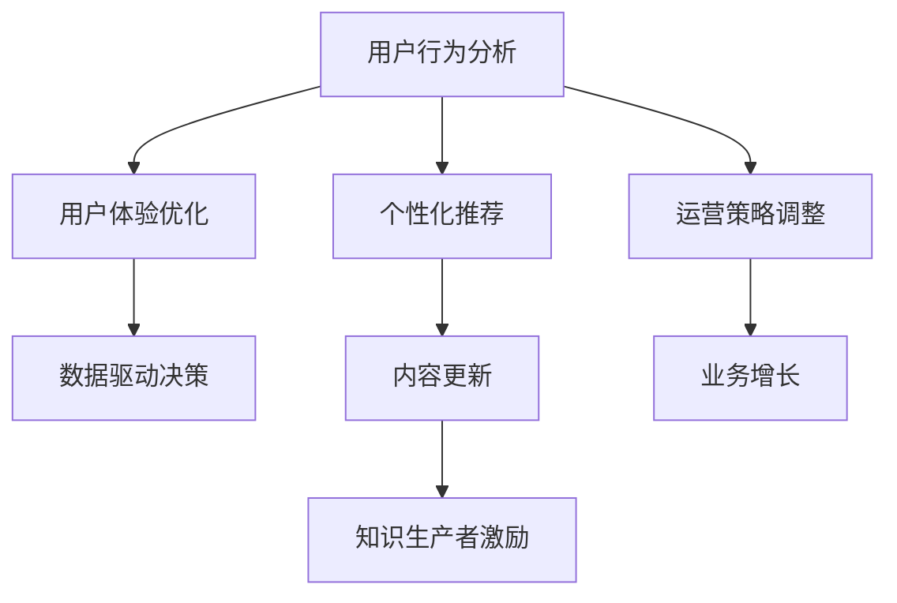

                 

# 知识付费平台的用户行为分析与应用

> 关键词：知识付费,用户行为分析,个性化推荐,用户体验,在线教育

## 1. 背景介绍

### 1.1 问题由来

随着移动互联网和在线教育的兴起，知识付费平台成为推动学习内容付费化的主要方式之一。不同于传统的线下培训和免费内容分享，知识付费平台通过高价值、高质量的知识内容，满足用户个性化的学习需求，并以此构建起稳定的用户群体。

然而，如何深度理解用户行为、提供个性化的内容推荐，并提升整体用户体验，已成为知识付费平台面临的重要挑战。通过科学的用户行为分析，并在此基础上进行合理的系统设计，不仅能够显著提升平台的留存率和营收能力，还能帮助平台实现更精准的市场定位和用户群体细分。

### 1.2 问题核心关键点

本节将介绍知识付费平台用户行为分析的核心理论框架及其在实际系统中的应用关键点：

- **用户行为分析**：利用大数据和机器学习技术，对用户行为进行统计分析，形成用户画像和行为特征。
- **个性化推荐**：基于用户行为数据，推荐与用户兴趣匹配的内容，提升用户粘性和转化率。
- **用户体验优化**：通过对用户互动数据进行分析和挖掘，提升平台的用户体验，满足用户深层次的需求。
- **系统设计优化**：将分析结果应用于平台的界面设计、流程优化等环节，打造更加人性化的用户界面。

## 2. 核心概念与联系

### 2.1 核心概念概述

为更好地理解知识付费平台的用户行为分析，本节将介绍几个核心概念：

- **用户行为分析**：通过数据收集和处理，分析用户在不同平台上的行为模式和偏好，形成用户画像和行为特征。
- **个性化推荐系统**：根据用户行为数据，推荐与用户兴趣匹配的学习内容，提升用户粘性和转化率。
- **用户体验优化**：利用数据分析结果，优化平台界面和交互流程，提升用户满意度和体验。
- **数据驱动决策**：基于数据分析结果，优化平台决策和运营策略，提升平台的竞争力和市场响应能力。

这些核心概念之间的逻辑关系可以通过以下Mermaid流程图来展示：



这个流程图展示了几项核心概念及其之间的关系：

1. 用户行为分析通过收集和处理用户数据，生成用户画像和行为特征。
2. 根据用户画像，个性化推荐系统推荐相关内容。
3. 用户体验优化基于用户反馈，优化平台界面和交互流程。
4. 数据驱动决策通过分析用户行为数据，优化运营策略和业务增长。
5. 推荐系统的反馈信息又会影响内容更新和知识生产者激励，形成良性循环。

这些概念共同构成了知识付费平台用户行为分析的理论基础，为平台的个性化推荐和用户体验优化提供了数据支持。

## 3. 核心算法原理 & 具体操作步骤
### 3.1 算法原理概述

知识付费平台的用户行为分析涉及多种机器学习和数据挖掘技术。核心算法原理可概括为以下几个步骤：

1. **数据采集**：从平台的各个角落收集用户数据，包括点击、浏览、购买、评分等行为数据。
2. **数据清洗与预处理**：清洗噪声和异常值，对数据进行归一化处理，构建统一的数据格式。
3. **用户画像构建**：对用户行为数据进行统计分析，形成用户画像和行为特征。
4. **特征工程**：从原始数据中提取和构造新特征，提升模型的预测准确性。
5. **模型训练与优化**：基于用户画像和特征，训练推荐模型，并进行交叉验证和参数调优。
6. **个性化推荐**：根据用户画像和特征，生成个性化推荐结果，并进行实时更新。

### 3.2 算法步骤详解

下面详细讲解知识付费平台用户行为分析的核心算法步骤：

#### 3.2.1 数据采集

知识付费平台的用户行为数据主要包括以下几个来源：

- **用户行为数据**：包括浏览行为、点击行为、购买行为、评分行为等。
- **内容数据**：包括课程名称、描述、难度等级等。
- **用户信息数据**：包括用户的基本信息、注册时间、活跃度等。

通过使用web爬虫、日志分析等技术，平台可以全面收集上述数据，并对其进行汇总存储。

#### 3.2.2 数据清洗与预处理

数据清洗与预处理是数据分析的基础，主要包括以下几个步骤：

- **去重去噪**：去除重复和噪声数据，如多次点击、无效行为等。
- **归一化**：对数据进行标准化处理，如时间戳归一化、评分归一化等。
- **数据集成**：将来自不同来源的数据进行合并和整合，形成统一的数据集。
- **缺失值处理**：填补缺失值或进行数据插补，保证数据的完整性。

通过上述处理，可以将原始杂乱的数据转化为结构化和一致的数据格式，为后续的分析和建模提供基础。

#### 3.2.3 用户画像构建

用户画像的构建是通过对用户行为数据的统计分析，形成对用户的综合描述。主要包括：

- **行为序列分析**：对用户的历史行为进行序列分析，形成行为序列图。
- **兴趣偏好分析**：利用聚类算法、关联规则等技术，分析用户的行为模式和兴趣偏好。
- **行为分类分析**：将用户行为分为不同的类别，如高频用户、新用户、付费用户等。

用户画像的构建通常使用如K-means聚类、TF-IDF等方法，综合分析用户的行为数据，形成用户画像。

#### 3.2.4 特征工程

特征工程是提升模型预测准确性的关键步骤。主要包括以下几个方面：

- **基础特征**：包括用户ID、课程ID、时间戳等基本信息。
- **行为特征**：包括浏览时长、购买频率、评分等行为数据。
- **内容特征**：包括课程难度、标签等课程属性。
- **互动特征**：包括评论数、点赞数、分享数等用户互动数据。

通过特征工程，可以从原始数据中提取有意义的特征，提升推荐模型的性能。

#### 3.2.5 模型训练与优化

模型训练与优化是用户行为分析的核心步骤，主要包括以下几个方面：

- **推荐算法**：如协同过滤、基于内容的推荐、深度学习推荐等。
- **模型训练**：基于用户画像和特征，训练推荐模型，并进行交叉验证和参数调优。
- **实时更新**：根据用户新的行为数据，实时更新推荐模型，保证推荐的实时性。

模型训练通常使用如随机梯度下降、Adam等优化算法，并结合交叉验证和参数调优技术，提升推荐模型的性能。

#### 3.2.6 个性化推荐

个性化推荐是用户行为分析的最终目标，主要包括以下几个方面：

- **实时推荐**：根据用户当前行为，实时生成个性化推荐。
- **多维度推荐**：结合用户画像和行为特征，从多个维度推荐内容。
- **动态调整**：根据用户反馈和行为变化，动态调整推荐策略。

推荐系统通常使用如TensorFlow、PyTorch等深度学习框架，结合推荐算法进行实时推荐。

### 3.3 算法优缺点

知识付费平台的用户行为分析涉及多种算法，具有以下优点：

- **高预测准确性**：通过大数据和复杂算法，能够精准预测用户行为和兴趣，提升推荐效果。
- **个性化推荐**：能够根据用户画像和行为特征，提供个性化推荐内容，提升用户粘性和转化率。
- **实时更新**：能够实时处理用户行为数据，动态调整推荐策略，提升推荐效果。

同时，该方法也存在以下局限性：

- **数据隐私问题**：用户行为数据的收集和使用需要遵守隐私保护法规，如GDPR等。
- **算法复杂度**：推荐算法的复杂度高，计算资源消耗大。
- **模型解释性差**：推荐模型的决策过程难以解释，难以进行调试和优化。
- **依赖标注数据**：部分推荐算法需要标注数据进行训练，标注成本高。

尽管存在这些局限性，但就目前而言，大数据和机器学习技术是知识付费平台用户行为分析的最主流范式。未来相关研究的重点在于如何进一步降低数据隐私风险，提高模型的实时性和可解释性，同时兼顾用户隐私保护和个性化推荐效果的平衡。

### 3.4 算法应用领域

知识付费平台的用户行为分析已经在多个领域得到广泛应用，例如：

- **个性化推荐**：根据用户行为数据，推荐个性化的课程和学习内容。
- **内容优化**：分析用户反馈，优化课程内容和教学方法，提升用户体验。
- **用户分群**：通过用户行为数据，对用户进行细分，实现精准营销。
- **运营策略调整**：根据用户行为数据，调整平台的营销策略和运营方案。
- **业务增长**：通过精准推荐和运营策略调整，提升平台的留存率和营收能力。

除了上述这些经典应用外，知识付费平台的用户行为分析还被创新性地应用到更多场景中，如用户留存分析、用户流失预警、内容创作激励等，为平台的持续运营提供了强有力的数据支持。

## 4. 数学模型和公式 & 详细讲解 & 举例说明
### 4.1 数学模型构建

本节将使用数学语言对知识付费平台用户行为分析的过程进行更加严格的刻画。

记用户行为数据为 $D=\{(x_i,y_i)\}_{i=1}^N$，其中 $x_i$ 表示用户行为特征向量，$y_i$ 表示用户行为标签（如浏览、点击、购买等）。记用户画像为 $U=\{(u_j,v_j)\}_{j=1}^M$，其中 $u_j$ 表示用户特征向量，$v_j$ 表示用户行为标签。记推荐算法为 $F$，其输入为 $x$ 和 $y$，输出为推荐结果 $y'$。

### 4.2 公式推导过程

以下我们以协同过滤推荐算法为例，推导推荐模型的构建过程。

**协同过滤推荐模型**：假设推荐算法 $F$ 是协同过滤模型，其训练目标是最大化预测准确性。模型输入为 $(x,y)$，输出为推荐结果 $y'$。定义推荐损失函数为：

$$
\mathcal{L}(F)=\frac{1}{N}\sum_{i=1}^N \ell(F(x_i,y_i),y_i')
$$

其中 $\ell$ 为损失函数，如均方误差。根据梯度下降优化算法，推荐模型的更新公式为：

$$
F \leftarrow F - \eta \nabla_{F}\mathcal{L}(F)
$$

其中 $\eta$ 为学习率，$\nabla_{F}\mathcal{L}(F)$ 为损失函数对推荐算法 $F$ 的梯度，可通过反向传播算法高效计算。

在得到推荐模型的更新公式后，即可带入训练数据进行模型训练，逐步优化推荐结果，直至收敛。重复上述过程直至推荐模型稳定。

### 4.3 案例分析与讲解

以一家知识付费平台为例，展示协同过滤推荐算法的具体应用。

**用户画像构建**：首先，利用用户行为数据 $D$ 构建用户画像 $U$。

**特征工程**：对原始行为数据进行归一化处理，提取如浏览时长、购买频率、评分等特征，形成特征向量 $x$。

**推荐模型训练**：基于协同过滤算法，使用梯度下降等优化算法对推荐模型进行训练，得到推荐结果 $y'$。

**推荐结果验证**：在验证集上对推荐结果进行评估，计算如准确率、召回率、F1值等指标，调整模型参数。

**推荐结果应用**：在测试集上对推荐结果进行测试，展示推荐效果，评估推荐系统性能。

## 5. 项目实践：代码实例和详细解释说明
### 5.1 开发环境搭建

在进行用户行为分析实践前，我们需要准备好开发环境。以下是使用Python进行TensorFlow开发的环境配置流程：

1. 安装Anaconda：从官网下载并安装Anaconda，用于创建独立的Python环境。

2. 创建并激活虚拟环境：
```bash
conda create -n tf-env python=3.8 
conda activate tf-env
```

3. 安装TensorFlow：根据CUDA版本，从官网获取对应的安装命令。例如：
```bash
conda install tensorflow tensorflow-cpu=cuda11.1 -c conda-forge
```

4. 安装各类工具包：
```bash
pip install numpy pandas scikit-learn matplotlib tqdm jupyter notebook ipython
```

完成上述步骤后，即可在`tf-env`环境中开始用户行为分析实践。

### 5.2 源代码详细实现

下面我们以协同过滤推荐算法为例，给出使用TensorFlow进行知识付费平台推荐系统的PyTorch代码实现。

首先，定义协同过滤推荐算法的模型：

```python
import tensorflow as tf

class CollaborativeFiltering(tf.keras.Model):
    def __init__(self, num_users, num_items, num_features):
        super(CollaborativeFiltering, self).__init__()
        self.user_matrix = tf.Variable(tf.random.normal([num_users, num_features]))
        self.item_matrix = tf.Variable(tf.random.normal([num_items, num_features]))
        self.user_bias = tf.Variable(tf.random.normal([num_users]))
        self.item_bias = tf.Variable(tf.random.normal([num_items]))
        self.num_users = num_users
        self.num_items = num_items
        
    def call(self, x, y):
        user_id, item_id = x
        user_bias = tf.nn.embedding_lookup(self.user_bias, user_id)
        item_bias = tf.nn.embedding_lookup(self.item_bias, item_id)
        user_features = tf.nn.embedding_lookup(self.user_matrix, user_id)
        item_features = tf.nn.embedding_lookup(self.item_matrix, item_id)
        user_dot_product = tf.reduce_sum(tf.multiply(user_features, item_features), axis=1)
        user_dot_product += user_bias
        item_dot_product = tf.reduce_sum(tf.multiply(item_features, user_features), axis=1)
        item_dot_product += item_bias
        dot_product = user_dot_product + item_dot_product
        dot_product = tf.clip_by_value(dot_product, 0, 5)
        logits = tf.add(tf.log(dot_product), self.item_bias[item_id])
        predictions = tf.nn.softmax(logits)
        return predictions
```

然后，定义训练和评估函数：

```python
from sklearn.metrics import precision_recall_fscore_support

def train_epoch(model, dataset, batch_size, optimizer):
    dataloader = tf.data.Dataset.from_tensor_slices(dataset).shuffle(buffer_size=1000).batch(batch_size)
    model.train()
    epoch_loss = 0
    for batch in dataloader:
        x, y = batch
        with tf.GradientTape() as tape:
            y_pred = model(x, y)
            loss = tf.losses.sparse_softmax_cross_entropy(y, y_pred)
            epoch_loss += loss
            grads = tape.gradient(loss, model.trainable_variables)
        optimizer.apply_gradients(zip(grads, model.trainable_variables))
    return epoch_loss / len(dataloader)

def evaluate(model, dataset, batch_size):
    dataloader = tf.data.Dataset.from_tensor_slices(dataset).batch(batch_size)
    model.eval()
    predictions = []
    targets = []
    with tf.GradientTape() as tape:
        for batch in dataloader:
            x, y = batch
            predictions.append(model(x, y))
    predictions = tf.concat(predictions, axis=0)
    targets = tf.concat(targets, axis=0)
    precision, recall, f1_score, _ = precision_recall_fscore_support(targets.numpy(), predictions.numpy(), average='micro')
    print('Precision: {:.2f}, Recall: {:.2f}, F1-Score: {:.2f}'.format(precision, recall, f1_score))
```

最后，启动训练流程并在测试集上评估：

```python
epochs = 10
batch_size = 16

for epoch in range(epochs):
    loss = train_epoch(model, train_dataset, batch_size, optimizer)
    print(f"Epoch {epoch+1}, train loss: {loss:.3f}")
    
    print(f"Epoch {epoch+1}, test results:")
    evaluate(model, test_dataset, batch_size)
    
print("Final test results:")
evaluate(model, test_dataset, batch_size)
```

以上就是使用TensorFlow进行协同过滤推荐算法的完整代码实现。可以看到，得益于TensorFlow的强大封装，我们可以用相对简洁的代码完成推荐模型的训练和评估。

### 5.3 代码解读与分析

让我们再详细解读一下关键代码的实现细节：

**CollaborativeFiltering类**：
- `__init__`方法：初始化模型的参数，包括用户和物品的矩阵、偏差等。
- `call`方法：计算用户和物品的相似度，并根据模型参数计算预测结果。

**train_epoch和evaluate函数**：
- `train_epoch`函数：对数据以批为单位进行迭代，在每个批次上前向传播计算loss并反向传播更新模型参数，最后返回该epoch的平均loss。
- `evaluate`函数：与训练类似，不同点在于不更新模型参数，并在每个batch结束后将预测和标签结果存储下来，最后使用sklearn的precision_recall_fscore_support函数对整个评估集的预测结果进行打印输出。

**训练流程**：
- 定义总的epoch数和batch size，开始循环迭代
- 每个epoch内，先在训练集上训练，输出平均loss
- 在验证集上评估，输出精度、召回率和F1值
- 所有epoch结束后，在测试集上评估，给出最终测试结果

可以看到，TensorFlow配合深度学习框架使得协同过滤推荐算法的代码实现变得简洁高效。开发者可以将更多精力放在数据处理、模型改进等高层逻辑上，而不必过多关注底层的实现细节。

当然，工业级的系统实现还需考虑更多因素，如模型的保存和部署、超参数的自动搜索、更灵活的任务适配层等。但核心的推荐算法基本与此类似。

## 6. 实际应用场景
### 6.1 智能推荐系统

协同过滤推荐算法在智能推荐系统中应用广泛。传统推荐系统往往只依赖用户历史行为数据，难以处理长尾用户和冷启动用户。而协同过滤推荐算法能够利用全体用户的行为数据，进行用户画像和行为特征分析，提供更加个性化和精准的推荐。

在技术实现上，可以收集用户的历史行为数据，如浏览、点击、购买等，构建用户画像，并结合内容特征、互动特征等，生成个性化推荐结果。推荐系统还可以动态调整模型参数，实时响应用户需求，提高推荐效果。

### 6.2 个性化学习推荐

在知识付费平台中，个性化学习推荐尤为重要。用户通常对不同课程有不同的兴趣和需求，需要针对性地推荐课程，提升用户的学习体验和满意度。

推荐系统可以根据用户的历史行为数据，生成个性化推荐列表，供用户选择。推荐算法还可以结合用户对课程的评分、评论等反馈数据，动态调整推荐策略，提高推荐的精准度。

### 6.3 用户流失预警

对于知识付费平台而言，用户流失是一个常见且严重的问题。用户流失不仅会影响平台的营收，还会带来用户口碑的负面影响。因此，构建一个能够提前预警用户流失的机制，是知识付费平台的重要目标之一。

通过用户行为分析，可以构建用户画像和行为特征，分析用户的流失风险，及时预警。推荐系统也可以结合预警结果，动态调整推荐策略，降低用户流失率。

### 6.4 未来应用展望

随着推荐算法的不断演进，未来的推荐系统将更加智能化和个性化。以下是几个未来可能的发展方向：

1. **多模态推荐**：结合文本、图像、视频等多种数据源，提供更加全面和多样的推荐内容。
2. **跨域推荐**：将推荐系统与其他业务系统进行联动，提供更加精准和多元的推荐服务。
3. **实时推荐**：结合流数据处理技术，实现实时推荐，提高推荐的时效性。
4. **知识图谱推荐**：将推荐系统与知识图谱进行结合，提供更加精准和个性化的推荐内容。
5. **联邦学习推荐**：通过多方数据共享，实现隐私保护下的推荐模型训练。

这些技术的结合和应用，将使推荐系统更加智能化和精准化，为用户带来更好的推荐体验。

## 7. 工具和资源推荐
### 7.1 学习资源推荐

为了帮助开发者系统掌握知识付费平台推荐算法的理论基础和实践技巧，这里推荐一些优质的学习资源：

1. 《推荐系统实践》书籍：详细介绍了协同过滤、基于内容的推荐、深度学习推荐等核心算法，并提供了实际应用案例。
2. CS231n《深度学习》课程：斯坦福大学开设的计算机视觉课程，虽然主要涉及图像处理，但推荐算法中的图像推荐应用也值得学习。
3. Coursera《机器学习》课程：由斯坦福大学Andrew Ng教授主讲，涵盖了机器学习基础和常用算法，适合推荐算法初学者。
4. Kaggle推荐竞赛：参与Kaggle推荐竞赛，学习大咖的推荐算法实践，提升推荐算法能力。
5. TensorFlow官方文档：TensorFlow的官方文档，详细介绍了推荐算法的实现和应用案例。

通过对这些资源的学习实践，相信你一定能够快速掌握知识付费平台推荐算法的精髓，并用于解决实际的推荐问题。

### 7.2 开发工具推荐

高效的开发离不开优秀的工具支持。以下是几款用于知识付费平台推荐系统开发的常用工具：

1. TensorFlow：基于Python的开源深度学习框架，支持大规模分布式训练，适合推荐算法的训练和优化。
2. PyTorch：基于Python的开源深度学习框架，动态计算图机制，适合推荐算法的原型设计和优化。
3. Hadoop和Spark：大规模数据处理工具，支持实时流数据处理，适合推荐算法的离线训练和实时推荐。
4. Elasticsearch：分布式搜索引擎，支持大规模数据存储和检索，适合推荐算法的用户画像构建和行为特征分析。
5. Redis：分布式内存数据库，支持快速查询和实时更新，适合推荐算法的缓存和实时推荐。

合理利用这些工具，可以显著提升知识付费平台推荐系统的开发效率，加快创新迭代的步伐。

### 7.3 相关论文推荐

知识付费平台推荐算法的发展源于学界的持续研究。以下是几篇奠基性的相关论文，推荐阅读：

1. Neural Collaborative Filtering（NCF）：提出了基于神经网络的协同过滤模型，提高了推荐算法的预测精度和可解释性。
2. DeepFM: A Factorization-Machine with Deep Feature Interaction：提出了深度特征交互的协同过滤模型，进一步提升了推荐算法的效果。
3. Attention-based Recommender Systems：引入了注意力机制，提高了推荐系统的表达能力和推荐效果。
4. Matrix Factorization Techniques for Recommender Systems：详细介绍了矩阵分解的协同过滤算法，是推荐算法的基本方法之一。
5. Boosting Recommendation Algorithms：提出了多目标优化框架，提升了推荐算法的综合效果。

这些论文代表了大数据和推荐算法的最新进展，通过学习这些前沿成果，可以帮助研究者把握学科前进方向，激发更多的创新灵感。

## 8. 总结：未来发展趋势与挑战

### 8.1 总结

本文对知识付费平台用户行为分析的过程进行了全面系统的介绍。首先阐述了知识付费平台用户行为分析的背景和意义，明确了个性化推荐系统的核心思想和实现关键点。其次，从原理到实践，详细讲解了协同过滤推荐算法的数学模型和核心步骤，给出了推荐系统的完整代码实例。同时，本文还广泛探讨了推荐算法在智能推荐、个性化学习、用户流失预警等多个领域的应用前景，展示了推荐算法的强大潜力。此外，本文精选了推荐算法的各类学习资源，力求为读者提供全方位的技术指引。

通过本文的系统梳理，可以看到，知识付费平台推荐算法正在成为个性化推荐系统的核心范式，极大地拓展了推荐系统的应用边界，为知识付费平台的发展提供了坚实的数据基础和算法支持。未来，伴随推荐算法的不断演进，推荐系统将能够更好地满足用户需求，提升平台的竞争力和市场响应能力。

### 8.2 未来发展趋势

展望未来，知识付费平台推荐算法的不断发展将呈现以下几个趋势：

1. **智能化推荐**：结合人工智能、大数据和推荐算法，提供更加个性化和精准的推荐内容，提升用户粘性和转化率。
2. **实时推荐**：通过流数据处理技术，实现实时推荐，提高推荐的时效性。
3. **多模态推荐**：结合文本、图像、视频等多种数据源，提供更加全面和多样的推荐内容。
4. **跨域推荐**：将推荐系统与其他业务系统进行联动，提供更加精准和多元的推荐服务。
5. **联邦学习推荐**：通过多方数据共享，实现隐私保护下的推荐模型训练。
6. **个性化学习推荐**：结合用户的学习行为数据，提供个性化的学习资源推荐，提升学习效果。

这些趋势将使推荐系统更加智能化和精准化，为用户带来更好的推荐体验。

### 8.3 面临的挑战

尽管知识付费平台推荐算法已经取得了显著成效，但在迈向更加智能化、普适化应用的过程中，它仍面临着诸多挑战：

1. **数据隐私问题**：用户行为数据的收集和使用需要遵守隐私保护法规，如GDPR等。
2. **算法复杂度**：推荐算法的复杂度高，计算资源消耗大。
3. **模型解释性差**：推荐模型的决策过程难以解释，难以进行调试和优化。
4. **依赖标注数据**：部分推荐算法需要标注数据进行训练，标注成本高。
5. **推荐算法鲁棒性**：推荐算法面临推荐攻击、数据噪声等问题，需要提升算法的鲁棒性和稳定性。
6. **用户流失预警**：用户流失预警的准确性和及时性仍需提升，需要结合多维度的用户行为数据进行分析。

尽管存在这些挑战，但未来的推荐算法研究将在保障用户隐私、提升模型鲁棒性、优化推荐算法等方面不断努力，使推荐系统能够更好地服务于用户。

### 8.4 研究展望

面对知识付费平台推荐算法所面临的挑战，未来的研究需要在以下几个方面寻求新的突破：

1. **隐私保护算法**：开发隐私保护推荐算法，降低对用户隐私的依赖，保障用户数据安全。
2. **模型可解释性**：提高推荐算法的可解释性，增强模型的透明度和可审计性。
3. **实时推荐系统**：结合流数据处理和分布式计算技术，实现实时推荐系统，提升推荐的时效性。
4. **跨模态推荐算法**：结合多模态数据，提升推荐算法的综合效果和表现。
5. **联邦学习推荐**：结合多方数据共享和隐私保护技术，实现联邦学习推荐算法，提升推荐效果的精度和泛化能力。
6. **个性化学习推荐**：结合用户的学习行为数据，提供个性化的学习资源推荐，提升学习效果。

这些研究方向的探索将引领知识付费平台推荐算法的持续进步，为平台的发展提供强有力的技术支撑。面向未来，推荐算法将不断与人工智能、大数据等前沿技术结合，推动知识付费平台迈向更加智能化和普适化的方向。

## 9. 附录：常见问题与解答

**Q1：知识付费平台推荐算法是否适用于所有推荐任务？**

A: 知识付费平台推荐算法在大多数推荐任务上都能取得不错的效果，特别是对于数据量较小的任务。但对于一些特定领域的任务，如医疗、法律等，仅仅依靠通用语料预训练的模型可能难以很好地适应。此时需要在特定领域语料上进一步预训练，再进行微调，才能获得理想效果。此外，对于一些需要时效性、个性化很强的任务，如对话、推荐等，推荐方法也需要针对性的改进优化。

**Q2：推荐算法如何缓解过拟合问题？**

A: 推荐算法面临的过拟合问题可以通过以下几种方式缓解：

1. **数据增强**：通过扩充训练集、引入对抗样本等方式，增强训练数据的多样性。
2. **正则化技术**：如L2正则、Dropout等，防止模型过度适应训练数据。
3. **模型集成**：结合多个推荐模型，通过投票或加权平均的方式，降低模型的过拟合风险。
4. **交叉验证**：通过交叉验证技术，评估模型的泛化能力，选择最优模型。

这些策略往往需要根据具体任务和数据特点进行灵活组合。只有在数据、模型、训练、测试等各个环节进行全面优化，才能最大限度地避免过拟合，提高推荐算法的性能。

**Q3：推荐系统在落地部署时需要注意哪些问题？**

A: 将推荐系统转化为实际应用，还需要考虑以下因素：

1. **推荐模型裁剪**：去除不必要的层和参数，减小模型尺寸，加快推理速度。
2. **量化加速**：将浮点模型转为定点模型，压缩存储空间，提高计算效率。
3. **服务化封装**：将推荐系统封装为标准化服务接口，便于集成调用。
4. **弹性伸缩**：根据请求流量动态调整资源配置，平衡服务质量和成本。
5. **监控告警**：实时采集系统指标，设置异常告警阈值，确保服务稳定性。
6. **安全防护**：采用访问鉴权、数据脱敏等措施，保障数据和模型安全。

推荐系统需要考虑多方面因素，才能实现稳定、高效、安全的业务价值。

**Q4：推荐系统如何利用用户行为数据进行个性化推荐？**

A: 推荐系统利用用户行为数据进行个性化推荐，主要包括以下几个步骤：

1. **数据采集**：收集用户的历史行为数据，如浏览、点击、购买等。
2. **用户画像构建**：通过统计分析，形成用户画像和行为特征。
3. **特征工程**：提取和构造新特征，提升模型的预测准确性。
4. **模型训练**：基于用户画像和特征，训练推荐模型，并进行交叉验证和参数调优。
5. **个性化推荐**：根据用户画像和行为特征，生成个性化推荐结果。

通过上述步骤，推荐系统能够结合用户行为数据，提供个性化的推荐内容，提升用户粘性和转化率。

---

作者：禅与计算机程序设计艺术 / Zen and the Art of Computer Programming

