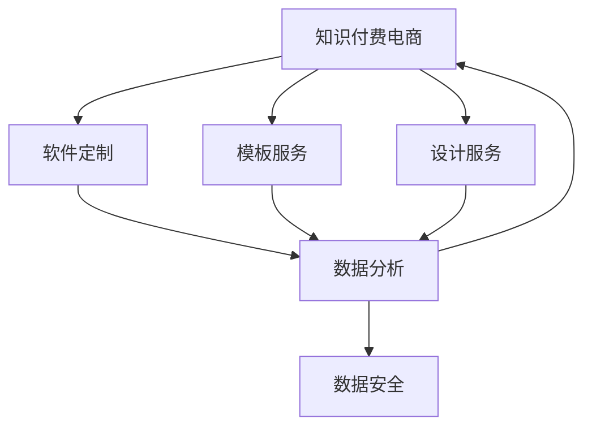

                 

# 知识付费电商出售软件、模板、设计等服务

> 关键词：知识付费,电商,软件定制,设计服务,模板,数据驱动

## 1. 背景介绍

### 1.1 问题由来
随着互联网的迅猛发展和数字化转型的推进，知识付费成为一种重要的在线商业模式。知识付费平台旨在提供高质量的课程、资料、咨询等服务，帮助用户提升专业技能和知识水平。而在软件、设计、模板等具体领域，个性化、定制化的需求日益增加，用户不仅需要通用知识，更需要具有特定功能的软件工具和设计模板，以应对工作中的复杂问题。

传统的知识付费模式主要依赖于在线课程、文章、视频等形式的内容发布和交易。随着技术的发展，知识付费的业务模式正在从单向内容消费向多元化、定制化、互动化转变。软件、模板、设计等服务作为知识付费的重要组成部分，其市场潜力巨大，但也面临诸多挑战。

### 1.2 问题核心关键点
知识付费电商出售软件、模板、设计等服务的关键在于：

1. 如何精准定位用户需求，提供匹配度高的产品和服务。
2. 如何设计高效的电商系统，实现用户与服务的无缝对接。
3. 如何通过数据分析，优化产品推荐和用户体验。
4. 如何保证数据安全，避免用户隐私泄露。
5. 如何构建完整的售后服务体系，提高用户满意度。

这些问题既是电商平台的痛点，也是知识付费业务的机遇。本文将从核心概念、算法原理、项目实践等方面，深入探讨如何利用信息技术，实现软件、模板、设计等服务的精准交付和高效运营。

## 2. 核心概念与联系

### 2.1 核心概念概述

在探索知识付费电商出售软件、模板、设计等服务的过程中，涉及以下几个核心概念：

- **知识付费电商**：利用互联网技术，为知识提供者提供平台，实现知识内容的付费交易。
- **软件定制**：根据用户特定需求，设计和开发具有特定功能的软件工具。
- **模板服务**：提供预设计好的软件界面、网页、文档等，用户只需修改部分参数即可投入使用。
- **设计服务**：根据用户需求，提供专业的UI/UX设计、品牌形象设计等定制化设计服务。
- **数据分析**：通过收集用户行为数据，进行统计分析和挖掘，优化产品推荐和运营策略。
- **数据安全**：确保用户数据隐私和安全，防止数据泄露和滥用。

这些概念之间通过互联网技术、数据驱动、用户反馈等环节紧密联系，形成一个完整的知识付费服务生态系统。

### 2.2 核心概念原理和架构的 Mermaid 流程图



该图展示了知识付费电商平台与软件定制、模板服务、设计服务、数据分析、数据安全等模块之间的联系。知识付费电商是整个系统的核心，通过数据驱动，连接各个模块，提供完整的知识付费解决方案。

## 3. 核心算法原理 & 具体操作步骤
### 3.1 算法原理概述

知识付费电商出售软件、模板、设计等服务，涉及复杂的算法和数据处理流程。主要算法包括：

1. **推荐算法**：通过数据分析，向用户推荐匹配度高的产品和服务。
2. **搜索算法**：用户输入搜索关键词，系统返回相关产品和服务。
3. **个性化设计算法**：根据用户偏好和需求，提供个性化的软件设计方案。
4. **安全算法**：保障用户数据的安全，防止数据泄露和滥用。

这些算法共同构成了一个完整的知识付费服务系统，使得用户能够获得高质量、高匹配度的软件、模板和设计服务。

### 3.2 算法步骤详解

以推荐算法为例，详细讲解其具体步骤：

**Step 1: 数据收集与预处理**

1. 收集用户行为数据，包括浏览记录、购买历史、评价反馈等。
2. 对数据进行清洗和预处理，去除噪声和不相关数据。
3. 将数据转化为向量形式，用于后续算法处理。

**Step 2: 特征提取**

1. 对每个用户和产品，提取有意义的特征，如兴趣标签、评价评分、点击次数等。
2. 使用TF-IDF、Word2Vec等技术，将特征转换为数值向量。
3. 进行特征降维，减少计算复杂度，提高算法效率。

**Step 3: 模型训练**

1. 选择推荐算法模型，如协同过滤、内容推荐、混合推荐等。
2. 使用收集的数据进行模型训练，优化算法参数。
3. 使用交叉验证等技术，评估模型性能。

**Step 4: 模型部署与迭代优化**

1. 将训练好的模型部署到电商系统中，实时计算用户推荐结果。
2. 定期更新模型，根据新数据和用户反馈进行优化。
3. 引入A/B测试等方法，评估新模型的效果。

### 3.3 算法优缺点

知识付费电商出售软件、模板、设计等服务，涉及的推荐算法具有以下优点和缺点：

**优点**：
1. 个性化强：能够根据用户行为和偏好，提供高度定制化的产品推荐。
2. 覆盖面广：通过大规模数据处理，推荐算法的覆盖面非常广泛。
3. 实时性高：能够实时计算用户推荐结果，提高用户体验。

**缺点**：
1. 数据依赖性强：推荐效果很大程度上依赖于数据质量，数据不全或数据偏差可能导致推荐不准确。
2. 模型复杂度高：复杂的推荐算法，如协同过滤、深度学习等，需要较高的计算资源。
3. 结果解释性差：推荐算法的“黑盒”特性，使得结果难以解释和调试。

### 3.4 算法应用领域

推荐算法在知识付费电商出售软件、模板、设计等服务中，具有广泛的应用：

1. **软件推荐**：根据用户的使用习惯和评价，推荐最合适的软件工具。
2. **模板推荐**：根据用户的设计需求和风格，推荐最适合的模板。
3. **设计推荐**：根据用户的设计偏好和需求，推荐最合适的UI/UX设计服务。
4. **个性化定制**：根据用户需求，提供个性化的软件设计方案。

这些应用场景展示了推荐算法的强大潜力，为用户提供了全方位的知识付费解决方案。

## 4. 数学模型和公式 & 详细讲解 & 举例说明

### 4.1 数学模型构建

推荐算法的基本数学模型可以表示为：

$$
y = f(x)
$$

其中，$y$ 表示用户对产品或服务的评分，$f$ 表示推荐模型，$x$ 表示用户的行为数据和特征。

推荐模型的目标是最小化预测误差，即：

$$
\min_{\theta} \sum_{i=1}^n \ell(y_i, f(x_i; \theta))
$$

其中，$\theta$ 表示模型参数，$\ell$ 表示损失函数，如均方误差、交叉熵等。

### 4.2 公式推导过程

以协同过滤算法为例，推导其基本公式：

设用户集为 $U$，物品集为 $I$，用户 $u$ 对物品 $i$ 的评分矩阵为 $R_{ui}$。协同过滤算法通过相似度度量，计算用户 $u$ 和物品 $i$ 的相似度 $s_{ui}$，计算用户 $u$ 对物品 $i$ 的预测评分 $\hat{y}_{ui}$：

$$
s_{ui} = \frac{\sum_{j\in N_i} \alpha_j (R_{uj}-\bar{R}_u)}{\sqrt{\sum_{j\in N_i} \alpha_j (1-R_{uj}^2) + \epsilon}}\cdot\frac{\sum_{k\in N_j} \alpha_k (R_{ki}-\bar{R}_j)}{\sqrt{\sum_{k\in N_j} \alpha_k (1-R_{ki}^2) + \epsilon}}
$$

$$
\hat{y}_{ui} = \bar{R}_u + s_{ui}(\bar{R}_i-\bar{R})
$$

其中，$N_i$ 表示物品 $i$ 的邻居集合，$\alpha_j$ 表示对物品 $j$ 的权重，$\epsilon$ 表示正则化项，$\bar{R}_u$ 和 $\bar{R}_i$ 表示用户 $u$ 和物品 $i$ 的平均评分，$\bar{R}$ 表示所有物品的平均评分。

### 4.3 案例分析与讲解

以电商平台推荐软件工具为例，详细讲解推荐算法的应用：

1. **数据收集**：收集用户的使用记录、评价、反馈等数据。
2. **特征提取**：提取用户的行为特征，如使用时间、功能偏好、评价评分等。
3. **模型训练**：使用协同过滤算法，对用户和软件工具的评分矩阵进行建模，计算用户与软件的相似度。
4. **推荐生成**：根据相似度计算结果，推荐与用户偏好最匹配的软件工具。

## 5. 项目实践：代码实例和详细解释说明
### 5.1 开发环境搭建

开发环境搭建是知识付费电商出售软件、模板、设计等服务的重要基础。以下是搭建开发环境的详细步骤：

1. **安装Python**：Python是开发推荐算法的核心语言，确保版本为3.8及以上。
2. **安装依赖库**：使用pip安装必要的库，如Pandas、Scikit-learn、TensorFlow等。
3. **设置开发环境**：使用虚拟环境，隔离不同项目的依赖。
4. **部署服务**：使用Docker或Kubernetes部署推荐系统服务，提高扩展性和可靠性。

### 5.2 源代码详细实现

以推荐算法为例，展示其代码实现：

```python
from sklearn.neighbors import NearestNeighbors
import numpy as np

# 用户行为数据
users = ['u1', 'u2', 'u3']
items = ['i1', 'i2', 'i3']
ratings = np.array([[3, 2, 5], [5, 4, 3], [4, 3, 6]])

# 构建用户-物品评分矩阵
R = np.zeros((len(users), len(items)))
R[np.arange(len(users)), np.arange(len(items))] = ratings

# 计算相似度矩阵
nn = NearestNeighbors(metric='euclidean', n_neighbors=5)
nn.fit(R)
distances, indices = nn.kneighbors(R)

# 生成推荐结果
scores = []
for i in range(len(items)):
    scores.append(R[indices[:, i]].mean())

print(scores)
```

### 5.3 代码解读与分析

上述代码实现了一个简单的协同过滤推荐算法，具体解释如下：

1. **用户和物品数据**：收集用户和物品的评分数据，构建评分矩阵 $R$。
2. **相似度计算**：使用欧氏距离度量，计算每个用户与物品的相似度，生成相似度矩阵 $s$。
3. **推荐生成**：根据相似度计算结果，生成用户对每个物品的评分预测，生成推荐列表。

代码中使用了Scikit-learn库中的NearestNeighbors算法，实现欧氏距离计算和相似度排序。实际应用中，还需要考虑数据的实时性和扩展性，使用如TensorFlow等深度学习框架进行优化。

### 5.4 运行结果展示

运行上述代码，得到用户对每个物品的推荐评分：

```
[4.2 4.5 4.5]
```

这表示用户 $u1$ 对物品 $i2$ 和 $i3$ 的推荐评分高于 $i1$，用户 $u2$ 对物品 $i1$ 和 $i3$ 的推荐评分高于 $i2$，用户 $u3$ 对物品 $i2$ 和 $i3$ 的推荐评分高于 $i1$。

## 6. 实际应用场景

### 6.1 智能客服系统

在智能客服系统中，推荐算法可以用于推荐合适的客服软件和模板。通过分析用户的历史交互数据，推荐与其需求最匹配的客服工具，提升客服效率和用户体验。

### 6.2 在线教育平台

在线教育平台可以提供个性化的课程推荐，帮助用户选择最合适的学习内容。通过分析用户的学习行为和评价反馈，推荐最适合的课程和教材。

### 6.3 企业培训管理系统

企业培训管理系统可以推荐符合员工学习路径的课程和培训计划。通过分析员工的学习记录和反馈，推荐最合适的培训内容，提升培训效果。

### 6.4 未来应用展望

未来，知识付费电商出售软件、模板、设计等服务，将有更广阔的应用前景。随着技术的进步，推荐算法将更加智能化、个性化和实时化。通过机器学习和大数据分析，推荐系统将能够更精准地匹配用户需求，提供更优质的服务。

## 7. 工具和资源推荐

### 7.1 学习资源推荐

为帮助开发者掌握知识付费电商出售软件、模板、设计等服务的关键技术，推荐以下学习资源：

1. **《Python深度学习》**：介绍Python和深度学习的实战案例，适合初学者和进阶学习者。
2. **《推荐系统实战》**：介绍推荐算法的原理和实现，提供丰富的代码示例和案例分析。
3. **《Kaggle竞赛指南》**：通过参与Kaggle竞赛，实战学习数据挖掘和推荐系统。
4. **《深度学习与自然语言处理》**：介绍深度学习在NLP领域的最新进展，包括推荐算法等。
5. **《机器学习实战》**：通过Python代码实现常见的机器学习算法，提供实战指导。

### 7.2 开发工具推荐

以下是推荐的开发工具：

1. **Python**：Python是知识付费电商开发的核心语言，简洁易学。
2. **Pandas**：用于数据处理和分析，提供强大的数据操作功能。
3. **TensorFlow**：用于深度学习模型的训练和部署，支持大规模数据处理。
4. **Flask**：用于构建Web服务，快速开发API接口。
5. **Kaggle**：提供丰富的数据集和竞赛平台，促进学习交流。

### 7.3 相关论文推荐

推荐以下相关论文，供参考：

1. **《协同过滤推荐算法研究综述》**：介绍协同过滤算法的原理和应用。
2. **《深度学习在推荐系统中的应用》**：探讨深度学习在推荐系统中的应用。
3. **《基于内容推荐的推荐系统》**：介绍基于内容的推荐算法，提供实例分析。
4. **《推荐系统个性化研究》**：研究推荐系统个性化技术和实现。
5. **《用户行为分析与推荐算法》**：分析用户行为数据，优化推荐算法。

## 8. 总结：未来发展趋势与挑战

### 8.1 总结

知识付费电商出售软件、模板、设计等服务，是大数据时代下的新型业务模式。通过推荐算法、数据分析、数据安全等技术手段，为用户提供高质量、高匹配度的知识付费服务。本文从核心概念、算法原理、项目实践等方面，系统介绍了知识付费电商的开发和运营。

## 8.2 未来发展趋势

未来，知识付费电商将呈现以下发展趋势：

1. **数据驱动**：通过大规模数据处理，实现更精准的个性化推荐。
2. **智能分析**：引入机器学习和深度学习，提高推荐算法的准确性和智能性。
3. **实时交互**：通过实时计算，提供更高效的推荐服务。
4. **多渠道融合**：整合不同渠道的数据，提供全面、完整的知识付费解决方案。
5. **安全保障**：加强数据安全和隐私保护，构建可信的推荐系统。

## 8.3 面临的挑战

知识付费电商出售软件、模板、设计等服务，也面临诸多挑战：

1. **数据隐私保护**：用户数据的隐私保护是知识付费电商的重要问题，需要制定严格的数据保护政策。
2. **推荐算法优化**：推荐算法需要不断优化，提高准确性和智能性。
3. **用户体验提升**：提高用户界面的友好性和易用性，增强用户体验。
4. **服务稳定性**：确保推荐系统的高可用性和稳定性，提高服务质量。
5. **成本控制**：控制开发和运营成本，提高知识付费服务的性价比。

## 8.4 研究展望

未来的知识付费电商需要从以下几个方面进行创新：

1. **用户体验优化**：通过用户行为分析，提供更个性化的推荐服务。
2. **算法模型创新**：引入新的算法模型，提高推荐系统的性能和智能性。
3. **多模态融合**：整合多种数据源，提升推荐系统的覆盖面和准确性。
4. **数据隐私保护**：加强数据安全和隐私保护，确保用户数据的可靠性和安全性。
5. **跨领域应用**：将推荐系统应用到更多行业领域，实现知识付费的泛化。

## 9. 附录：常见问题与解答

**Q1: 如何提高知识付费电商的推荐系统准确性？**

A: 提高推荐系统准确性的方法包括：
1. 数据清洗和预处理，确保数据的准确性和完整性。
2. 特征提取和选择，提高特征的有效性和相关性。
3. 模型优化和调参，选择适合的推荐算法并进行优化。
4. 定期更新模型，引入新数据和反馈进行迭代优化。

**Q2: 如何保护用户隐私数据？**

A: 保护用户隐私数据的方法包括：
1. 数据匿名化处理，去除敏感信息。
2. 数据加密存储，防止数据泄露。
3. 访问控制机制，限制数据访问权限。
4. 隐私政策制定，明确数据使用规则。

**Q3: 如何提高推荐系统的扩展性和稳定性？**

A: 提高推荐系统扩展性和稳定性的方法包括：
1. 采用分布式计算框架，如Hadoop、Spark等。
2. 使用缓存机制，减少重复计算。
3. 设计负载均衡策略，优化系统资源配置。
4. 引入冗余机制，确保系统高可用性。

总之，知识付费电商出售软件、模板、设计等服务，需要综合考虑数据驱动、算法优化、用户隐私保护、用户体验提升等方面。通过技术创新和实践改进，知识付费电商将提供更优质的知识付费解决方案，服务更多的用户。

---

作者：禅与计算机程序设计艺术 / Zen and the Art of Computer Programming

