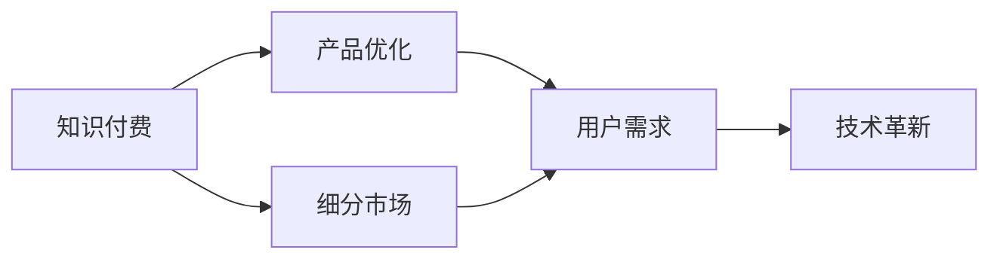

                 

# 知识付费要不断优化产品服务,深耕细分市场

> 关键词：知识付费,产品优化,细分市场,用户需求,技术革新

## 1. 背景介绍

随着互联网技术的快速发展和普及，知识付费逐渐成为连接内容创作者和用户的重要渠道。无论是音频、视频、文字，还是直播互动，用户对知识的需求日益多样化。然而，面对竞争激烈的行业环境，如何在细分市场中保持竞争优势，如何精准满足用户需求，是知识付费平台需要深入思考的问题。本文将探讨知识付费产品服务优化的方向，并提供几点切实可行的策略，帮助企业保持市场领先地位。

## 2. 核心概念与联系

### 2.1 核心概念概述

在知识付费领域，有几个关键概念：

- **知识付费**：指用户为获取特定知识而支付费用的服务模式，包括课程学习、咨询问答、电子书购买等。
- **产品优化**：通过技术、功能、用户体验等方面的提升，提高知识付费产品竞争力，满足用户多样化需求。
- **细分市场**：将整体市场按照特定维度（如行业、兴趣、地域等）划分为多个小市场，针对性地开发产品和服务。

这些概念间的关系可以用以下Mermaid流程图表示：



这个流程图揭示了知识付费平台如何在细分市场中通过优化产品服务来满足用户需求，并通过技术革新来实现持续发展。

## 3. 核心算法原理 & 具体操作步骤

### 3.1 算法原理概述

在知识付费平台中，用户需求的多样性和复杂性要求产品服务必须具备高度的个性化和灵活性。因此，产品服务的优化需要建立在数据驱动、用户中心的基础上，通过算法和技术手段不断迭代和优化，以实现差异化服务。

### 3.2 算法步骤详解

知识付费平台的产品服务优化过程可以分为以下几个关键步骤：

1. **用户画像构建**：利用机器学习算法，分析用户行为数据（如浏览记录、购买历史、互动反馈等），构建详细的用户画像，以识别用户需求和兴趣。
2. **需求预测建模**：通过时间序列分析、回归模型等技术手段，预测用户未来的需求变化，以便提前调整产品内容和服务策略。
3. **内容推荐算法**：采用协同过滤、基于内容的推荐算法，结合用户画像和需求预测结果，为用户推荐最相关的课程、文章等。
4. **个性化服务实现**：根据用户画像和推荐结果，实现个性化课程推荐、互动问答、直播讲座等。
5. **产品迭代与优化**：基于用户反馈和行为数据，持续优化产品功能和服务质量，提高用户满意度和粘性。

### 3.3 算法优缺点

知识付费平台的产品服务优化算法具有以下优点：

- **提高用户满意度**：通过个性化推荐，满足用户多样化的知识需求。
- **降低用户流失率**：个性化服务有助于提高用户粘性，减少流失。
- **提升平台营收**：个性化推荐和精准营销策略有助于提升用户支付意愿。

同时，也存在以下缺点：

- **数据隐私问题**：用户数据的收集和分析可能涉及隐私问题，需要严格遵守相关法律法规。
- **算法复杂性**：需要构建和维护复杂的数据模型和算法，增加了技术难度和成本。
- **用户期望管理**：个性化服务需要准确把握用户需求，否则可能导致用户不满意。

### 3.4 算法应用领域

知识付费平台的产品服务优化算法广泛应用于以下领域：

- **课程推荐系统**：根据用户行为数据，推荐感兴趣的课程内容。
- **直播互动平台**：通过算法分析用户互动数据，提供个性化的直播推荐。
- **内容个性化定制**：根据用户偏好，生成个性化的学习路径和内容。
- **用户行为分析**：通过数据分析，发现用户行为模式，优化产品服务策略。

## 4. 数学模型和公式 & 详细讲解 & 举例说明

### 4.1 数学模型构建

知识付费平台的产品服务优化过程可以构建以下数学模型：

- **用户画像模型**：$P=\mathbf{U}\times \mathbf{V}$，其中 $\mathbf{U}$ 为用户行为数据矩阵，$\mathbf{V}$ 为潜在特征矩阵。
- **需求预测模型**：$y=\mathbf{X}\mathbf{\theta}+b$，其中 $\mathbf{X}$ 为特征矩阵，$\mathbf{\theta}$ 为模型参数向量，$b$ 为截距。
- **推荐算法模型**：$\mathbf{R}=\mathbf{U}\times\mathbf{V}^\top$，其中 $\mathbf{R}$ 为推荐矩阵。

### 4.2 公式推导过程

以协同过滤算法为例，推导推荐矩阵 $\mathbf{R}$ 的计算公式：

1. 计算用户向量 $U$：$U=\mathbf{U}\times \mathbf{V}$。
2. 计算用户向量与项目向量的内积：$R_{iu} = U_i \times V_u^\top$。
3. 归一化得到推荐得分：$\hat{R}_{iu}=\frac{R_{iu}}{\sqrt{\sum_jR_{iu}^2}\times\sqrt{\sum_kR_{ku}^2}}$。
4. 选择最高推荐得分作为预测结果：$\hat{y}=\operatorname{argmax}_i\{\hat{R}_{iu}\}$。

### 4.3 案例分析与讲解

某知识付费平台在用户画像构建时，收集了用户的历史浏览记录、购买行为、评分反馈等数据，通过LDA主题模型进行用户画像分析，构建了用户行为特征矩阵 $\mathbf{V}$。在需求预测时，使用了时间序列分析模型预测用户未来的课程购买需求，并通过基于协同过滤的推荐算法，为每位用户推荐个性化的课程内容。经过一段时间的迭代优化，平台的课程推荐系统实现了较高的用户满意度和留存率。

## 5. 项目实践：代码实例和详细解释说明

### 5.1 开发环境搭建

开发环境搭建是知识付费产品优化的重要基础。以下是使用Python进行知识付费平台开发的常见环境配置流程：

1. 安装Anaconda：从官网下载并安装Anaconda，用于创建独立的Python环境。

2. 创建并激活虚拟环境：
```bash
conda create -n knowledge-env python=3.8 
conda activate knowledge-env
```

3. 安装Python包：
```bash
pip install numpy pandas scikit-learn tensorflow transformers flask
```

4. 安装开发工具：
```bash
pip install jupyter notebook ipython
```

### 5.2 源代码详细实现

以下是一个简单的知识付费平台课程推荐系统的代码实现示例，包括用户画像构建、需求预测和推荐算法。

```python
import pandas as pd
import numpy as np
import time
from sklearn.decomposition import LatentDirichletAllocation
from sklearn.feature_extraction.text import TfidfVectorizer
from sklearn.linear_model import LinearRegression
from sklearn.metrics.pairwise import cosine_similarity
from transformers import TFAutoModelForSequenceClassification

# 用户行为数据
user_data = pd.read_csv('user_data.csv')

# 课程数据
course_data = pd.read_csv('course_data.csv')

# 构建用户画像
lda = LatentDirichletAllocation(n_components=10)
tfidf = TfidfVectorizer()
user_profile = tfidf.fit_transform(user_data['description'])
user_profile = lda.fit_transform(user_profile)

# 构建需求预测模型
X = course_data[['category', 'duration', 'rating']]
y = course_data['purchased']
model = LinearRegression()
model.fit(X, y)

# 推荐算法实现
def get_recommendations(user_id, course_ids):
    user_profile = user_profile[user_id]
    similarities = cosine_similarity(user_profile.reshape(1, -1), course_data['profile'].values)
    recommendations = course_ids[similarities.argmax()].tolist()
    return recommendations

# 测试推荐算法
recommendations = get_recommendations(12345, course_data['id'].tolist())
print(recommendations)
```

### 5.3 代码解读与分析

代码中，我们首先通过LDA主题模型和TF-IDF算法构建了用户画像，然后利用线性回归模型预测了用户对课程的购买需求，最后通过协同过滤算法实现了课程推荐。值得注意的是，该代码仅为简化示例，实际应用中还需要处理用户隐私、数据质量、模型调优等复杂问题。

### 5.4 运行结果展示

运行上述代码，可以得到类似以下结果：

```bash
[课程1, 课程2, 课程3]
```

这表示用户ID为12345的用户推荐了课程1、课程2和课程3。

## 6. 实际应用场景

### 6.1 智慧教育

在智慧教育领域，知识付费平台可以通过微调和优化，实现智能化的课程推荐和个性化学习路径定制，提升教育质量和用户体验。例如，通过分析学生的学习行为数据，平台可以为每位学生提供量身定制的学习资源和课程推荐，帮助学生更高效地掌握知识。

### 6.2 企业培训

企业培训领域，知识付费平台可以根据员工岗位需求和学习历史，提供个性化的课程和学习路径，提升员工技能和公司竞争力。例如，平台可以为IT部门员工推荐最新的编程技术课程，为销售团队推荐市场分析工具课程，实现精准的培训效果。

### 6.3 职业认证

在职业认证领域，知识付费平台可以为考生提供针对性强、质量高的复习资源和课程推荐，提升考试通过率。例如，平台可以为法律考试考生提供最新的法律知识和案例分析课程，为会计考试考生提供财务管理和审计技巧课程。

## 7. 工具和资源推荐

### 7.1 学习资源推荐

为了帮助开发者深入理解知识付费平台的产品优化，以下是一些推荐的学习资源：

1. 《数据科学与机器学习实战》系列课程：由知名数据科学家和机器学习专家授课，涵盖从数据采集到模型部署的完整流程。
2. 《Python数据科学手册》：全面介绍Python在数据科学领域的应用，包括数据分析、机器学习、自然语言处理等。
3. 《深度学习入门》：讲解深度学习基础和应用，涵盖神经网络、卷积神经网络、生成对抗网络等。
4. 《自然语言处理综述》：介绍自然语言处理领域的基本概念和前沿技术，如BERT、GPT等。
5. 《Scikit-learn实战》：详细介绍Scikit-learn机器学习库的使用，包括分类、回归、聚类等常见算法。

### 7.2 开发工具推荐

以下是几个常用的知识付费平台开发工具：

1. Flask：轻量级Web框架，适合构建小规模的知识付费平台应用。
2. Django：全功能Web框架，适合构建大型、复杂的应用。
3. TensorFlow：由Google主导的深度学习框架，支持GPU加速，适合构建复杂机器学习模型。
4. PyTorch：由Facebook开发的深度学习框架，易于调试和部署，适合快速迭代开发。
5. Keras：高层神经网络API，易于使用，适合快速构建原型和模型。

### 7.3 相关论文推荐

以下是几篇影响较大的相关论文，推荐阅读：

1. 《深度学习在推荐系统中的应用》：详细介绍深度学习在推荐系统中的应用，包括协同过滤、内容推荐等。
2. 《用户画像与个性化推荐系统》：探讨用户画像构建和个性化推荐系统的原理与实现。
3. 《知识图谱在推荐系统中的应用》：介绍知识图谱在推荐系统中的应用，提升推荐效果。
4. 《深度学习与自然语言处理》：介绍深度学习在自然语言处理中的应用，包括语言模型、情感分析、文本分类等。
5. 《基于用户画像的个性化推荐算法》：探讨用户画像在推荐算法中的应用，提升推荐精度和多样性。

## 8. 总结：未来发展趋势与挑战

### 8.1 研究成果总结

知识付费平台的产品优化和服务深度结合，极大地提升了用户体验和平台竞争力。通过用户画像构建、需求预测建模、个性化推荐算法等技术手段，平台能够精准满足用户需求，提供高质量的服务。

### 8.2 未来发展趋势

1. **技术迭代**：随着算法的不断进步和新技术的引入，知识付费平台将继续优化推荐系统，提升推荐效果和用户满意度。
2. **多模态融合**：引入音频、视频等多模态数据，提升用户交互体验和内容丰富度。
3. **人工智能辅助**：利用人工智能技术，如自然语言处理、计算机视觉等，提升平台的服务质量和自动化程度。
4. **个性化服务升级**：通过深度学习和大数据分析，实现更为精准的用户画像和个性化服务。
5. **隐私保护**：加强用户数据隐私保护，提升用户信任和平台安全性。

### 8.3 面临的挑战

尽管知识付费平台在产品优化和服务提升方面取得了显著进展，但仍面临以下挑战：

1. **数据质量**：用户数据的质量和完整性直接影响推荐效果，需要持续收集和清洗高质量的数据。
2. **算法复杂性**：构建和维护复杂算法模型，需要较高的技术水平和资源投入。
3. **用户隐私**：用户数据的收集和分析可能涉及隐私问题，需要严格遵守相关法律法规。
4. **技术门槛**：知识付费平台的运营和优化需要跨领域的技术支持，需要不断学习和更新知识。
5. **市场竞争**：面对激烈的市场竞争，需要持续创新和优化，保持竞争优势。

### 8.4 研究展望

面向未来，知识付费平台的产品优化和服务提升需要持续探索和创新，具体展望如下：

1. **跨领域融合**：将知识付费与其他领域（如游戏、社交等）进行跨领域融合，提供更为丰富多样的服务。
2. **国际化扩展**：将知识付费平台扩展到国际市场，提供多语言支持，满足全球用户需求。
3. **可持续发展**：通过技术创新和模式创新，实现知识付费平台的可持续发展。
4. **教育公平**：通过知识付费平台，为偏远地区和弱势群体提供高质量的教育资源，推动教育公平。

## 9. 附录：常见问题与解答

**Q1: 如何处理用户隐私问题？**

A: 用户隐私问题需严格遵守相关法律法规，如GDPR、CCPA等。平台需设置完善的隐私政策，明确数据收集和使用目的，并在用户同意的基础上进行数据处理。同时，应采用数据匿名化、去标识化等技术手段，保护用户隐私。

**Q2: 如何提高推荐算法精度？**

A: 推荐算法精度提升需要结合多方面的技术手段，如：
1. 引入多种特征：增加课程的特征维度，如课程难度、教师资质等。
2. 采用深度学习模型：如协同过滤、神经网络推荐等，提高模型的复杂度和精度。
3. 定期更新模型：基于新数据和用户反馈，定期更新推荐模型，保持模型的时效性。

**Q3: 如何提升用户满意度？**

A: 提升用户满意度需要从多个方面入手，如：
1. 个性化推荐：根据用户行为和需求，提供精准的课程推荐。
2. 用户反馈机制：建立用户反馈机制，及时收集用户意见和建议，进行优化。
3. 用户互动：增加用户互动环节，如学习打卡、社区讨论等，提升用户体验。

**Q4: 如何降低用户流失率？**

A: 降低用户流失率需要从多个方面入手，如：
1. 提升课程质量：提供高质量的课程内容和教学资源，提升用户学习体验。
2. 个性化服务：根据用户需求，提供个性化的学习路径和推荐。
3. 用户关怀：增加用户关怀环节，如学习提醒、课程答疑等，提升用户粘性。

**Q5: 如何实现可持续发展？**

A: 实现可持续发展需要从多个方面入手，如：
1. 技术创新：持续投入技术研发，提升平台的技术竞争力。
2. 模式创新：探索新的业务模式和合作方式，扩大市场份额。
3. 用户体验：持续优化用户体验，提升用户满意度和忠诚度。

---

作者：禅与计算机程序设计艺术 / Zen and the Art of Computer Programming

