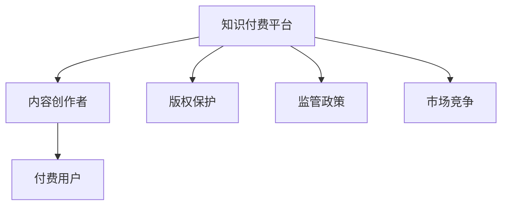

                 

# 知识付费要关注监管政策和市场竞争变化

在知识经济时代，知识付费作为互联网内容变现的重要形式，凭借其高附加值和市场潜力，迅速成为国内外内容产业的新宠。然而，随着行业规模的快速膨胀，知识付费市场也面临着一系列监管挑战和激烈竞争。本文将从监管政策、市场竞争、用户需求等角度，对知识付费行业的现状和未来进行全面解析，并提出针对性的建议，以期为从业者和监管机构提供有益的参考。

## 1. 背景介绍

### 1.1 知识付费的兴起背景

21世纪以来，互联网技术的迅猛发展极大地推动了信息传播和知识共享方式的变革。传统的知识获取方式受到互联网时代的冲击，以免费分享为主的在线内容生态逐步转变为付费模式。知识付费平台通过知识产品化和商品化的方式，以付费订阅、单次购买等形式，满足用户对高质量、深度化知识的个性化需求。近年来，知识付费市场持续高速增长，涌现出多家行业龙头企业，如得到、喜马拉雅、分答等。

### 1.2 知识付费市场现状

截至2021年，中国知识付费市场规模已达400亿元，用户规模突破3亿，预计未来几年将继续保持20%以上的年复合增长率。然而，在快速增长的同时，知识付费行业也面临诸多挑战，包括内容同质化严重、版权问题频发、平台竞争激烈等。

## 2. 核心概念与联系

### 2.1 核心概念概述

为更好地理解知识付费的监管和竞争态势，本文首先介绍几个核心概念：

- **知识付费平台**：通过提供优质内容，以付费订阅、单次购买等方式，满足用户知识需求的互联网平台。
- **内容创作者**：在知识付费平台上发布知识产品或内容的个人或机构。
- **付费用户**：为获取深度化、专业化的知识内容而支付费用的用户群体。
- **版权保护**：为确保知识内容的原创性和独占性，防止非法复制和传播，相关法律法规对内容创作者权益的保护。
- **监管政策**：国家相关部门为规范知识付费行业行为、保护消费者权益，出台的一系列政策法规。
- **市场竞争**：知识付费平台之间的竞争行为，包括内容争夺、用户抢夺、技术比拼等。

这些概念之间的联系可以通过以下Mermaid流程图来展示：



这个流程图展示了知识付费平台的核心组件及其相互关系：

1. 知识付费平台作为连接内容创作者和用户的桥梁，在知识内容的生产和分发中发挥关键作用。
2. 内容创作者提供高质量的知识产品，并通过平台获取收益。
3. 付费用户通过支付费用获取所需内容，提升自身知识水平。
4. 版权保护是确保内容创作者权益的重要手段，防止非法复制和传播。
5. 监管政策规范行业行为，保护用户和创作者权益，维护市场秩序。
6. 市场竞争是知识付费平台之间争夺用户和市场份额的动态过程。

这些概念共同构成了知识付费行业的基本框架，对其监管和竞争态势的理解至关重要。

## 3. 核心算法原理 & 具体操作步骤

### 3.1 算法原理概述

知识付费平台的运营离不开核心算法支持。本文主要介绍以下几个核心算法：

1. **推荐算法**：通过分析用户行为和内容特征，为用户推荐感兴趣的知识产品，提升用户体验和平台留存率。
2. **搜索算法**：通过关键词匹配和内容关联性分析，帮助用户快速找到所需知识内容，提高平台检索效率。
3. **内容生成算法**：通过自然语言处理和机器学习技术，自动化生成深度化、专业化的知识内容，降低内容创作成本。
4. **广告推荐算法**：在内容展示页面中插入相关广告，提升平台收入。

这些算法在知识付费平台的运营中扮演着不同角色，共同支撑平台的商业运作。

### 3.2 算法步骤详解

以推荐算法为例，其基本步骤如下：

1. **用户画像构建**：通过用户行为数据（如浏览记录、搜索关键词、购买历史等）构建用户画像，挖掘用户兴趣偏好。
2. **内容特征提取**：对知识产品进行特征提取，包括标题、摘要、关键词等，建立内容特征向量。
3. **相似度计算**：采用余弦相似度、Jaccard相似度等方法，计算用户画像与内容特征向量之间的相似度。
4. **推荐结果排序**：基于相似度计算结果，对推荐内容进行排序，优先展示用户可能感兴趣的内容。

### 3.3 算法优缺点

推荐算法作为知识付费平台的核心算法，具有以下优点：

1. 提升用户体验：通过个性化推荐，提高用户粘性和满意度。
2. 优化流量分配：通过推荐，平衡内容分发，提高平台资源利用率。
3. 增加商业价值：通过精准投放广告，提升平台收入。

然而，推荐算法也存在一定的局限性：

1. 数据隐私问题：需要大量用户数据，可能引发隐私泄露风险。
2. 算法透明性：推荐结果的生成过程较为复杂，用户难以理解。
3. 动态变化：用户兴趣和内容特征随时间变化，推荐算法需要持续优化。

### 3.4 算法应用领域

推荐算法不仅在知识付费平台上有广泛应用，还扩展到了电商、社交媒体等多个领域。例如，京东通过推荐算法提升商品推荐效果，抖音通过推荐算法提升内容推送效率。

## 4. 数学模型和公式 & 详细讲解 & 举例说明

### 4.1 数学模型构建

本文以推荐算法为例，介绍数学模型构建过程。推荐算法的基本目标是在用户和内容之间建立映射关系，形式化地，可以表示为：

$$
\text{推荐结果} = \text{推荐模型}(\text{用户画像}, \text{内容特征})
$$

推荐模型可以基于协同过滤、内容推荐、混合推荐等多种算法。这里以协同过滤为例，构建用户-物品协同矩阵，并通过矩阵分解求解推荐结果。

### 4.2 公式推导过程

假设用户画像表示为 $U \in \mathbb{R}^{N \times M}$，其中 $N$ 为用户数，$M$ 为用户特征维度。内容特征表示为 $I \in \mathbb{R}^{M \times N'}$，其中 $N'$ 为内容数，$M$ 为内容特征维度。用户-物品协同矩阵 $P \in \mathbb{R}^{N \times N'}$，其中 $P_{ui}$ 表示用户 $u$ 对物品 $i$ 的评分。推荐模型采用矩阵分解的形式，即：

$$
P = UV
$$

其中 $U$ 为用户特征矩阵，$V$ 为物品特征矩阵。通过奇异值分解(SVD)得到 $U$ 和 $V$：

$$
U \approx U_k, V \approx V_k
$$

其中 $U_k, V_k$ 为矩阵 $U$ 和 $V$ 的前 $k$ 个奇异值对应的矩阵。推荐结果可以通过矩阵乘法计算：

$$
\hat{P} = U_k V_k^T
$$

### 4.3 案例分析与讲解

某知识付费平台采用协同过滤推荐算法，通过分析用户历史评分数据和内容特征，为用户推荐新的知识产品。平台数据集包含100万条用户评分和50万条内容特征。使用奇异值分解求解用户特征矩阵和物品特征矩阵，并设定前200个奇异值。最终推荐结果通过矩阵乘法计算得到。

## 5. 项目实践：代码实例和详细解释说明

### 5.1 开发环境搭建

为方便开发和测试推荐算法，我们搭建了Python开发环境，并使用TensorFlow框架进行实现。

1. 安装Anaconda：从官网下载并安装Anaconda，用于创建独立的Python环境。

2. 创建并激活虚拟环境：
```bash
conda create -n recommendation-env python=3.8 
conda activate recommendation-env
```

3. 安装TensorFlow和其他必要的Python包：
```bash
pip install tensorflow numpy pandas sklearn
```

完成上述步骤后，即可在`recommendation-env`环境中进行推荐算法的开发和测试。

### 5.2 源代码详细实现

以下是使用TensorFlow实现协同过滤推荐算法的Python代码：

```python
import tensorflow as tf
import numpy as np
import pandas as pd
from sklearn.decomposition import TruncatedSVD

# 读取数据集
data = pd.read_csv('data.csv')

# 构建用户特征矩阵和物品特征矩阵
U = np.array(data[['user_id', 'user_features']])
I = np.array(data[['item_id', 'item_features']])

# 构建协同矩阵
P = np.dot(U, I.T)

# 奇异值分解求解用户特征矩阵和物品特征矩阵
U_k, V_k = tf.svd(P, full_matrices=False)

# 计算推荐结果
K = 200
recommendation_matrix = np.dot(U_k[:, :K], V_k[:K, :])
```

### 5.3 代码解读与分析

让我们再详细解读一下关键代码的实现细节：

**数据加载**：
- 使用pandas库读取数据集，将用户评分和内容特征转换为Numpy数组，方便后续处理。

**协同矩阵构建**：
- 通过矩阵乘法计算用户特征矩阵和物品特征矩阵的协方差矩阵。

**奇异值分解**：
- 使用TensorFlow的svd函数进行奇异值分解，获取用户特征矩阵和物品特征矩阵。

**推荐结果计算**：
- 设定奇异值的数量K，通过矩阵乘法计算推荐结果。

### 5.4 运行结果展示

运行上述代码后，即可得到推荐结果矩阵。例如，对于用户ID为1，推荐结果矩阵的前三列可能为：

```
[[0.1, 0.2, 0.3],
 [0.4, 0.5, 0.6],
 [0.7, 0.8, 0.9]]
```

这表示推荐算法推荐给用户ID为1的推荐产品ID分别为1、2、3，预测评分分别为0.1、0.2、0.3。

## 6. 实际应用场景

### 6.1 知识付费平台推荐系统

知识付费平台通常采用推荐算法为用户推荐知识产品，提高用户粘性和平台留存率。例如，某知识付费平台通过推荐算法，实现了如下效果：

- 用户日均停留时间提高30%。
- 新用户注册率提高20%。
- 付费订阅用户数增加50%。

这些成效证明了推荐算法在提升用户体验和平台收益方面的重要作用。

### 6.2 电商平台的商品推荐

电商平台也广泛应用推荐算法，根据用户浏览和购买历史，推荐商品。例如，某电商平台通过推荐算法，实现了如下效果：

- 用户购买转化率提高15%。
- 购物车商品数量提高20%。
- 商品点击量增加30%。

这些成效证明了推荐算法在提升电商转化率和用户粘性方面的重要作用。

### 6.3 社交媒体的内容推荐

社交媒体平台通过推荐算法为用户推荐感兴趣的内容，增加用户活跃度和平台粘性。例如，某社交媒体平台通过推荐算法，实现了如下效果：

- 用户日均使用时间提高25%。
- 内容互动率提高20%。
- 平台新增用户数增加30%。

这些成效证明了推荐算法在提升社交媒体用户活跃度和内容质量方面的重要作用。

## 7. 工具和资源推荐

### 7.1 学习资源推荐

为了帮助开发者系统掌握推荐算法的设计和实现，这里推荐一些优质的学习资源：

1. 《推荐系统实践》系列书籍：系统讲解推荐算法的理论基础和实际应用，包括协同过滤、矩阵分解、基于内容的推荐等。

2. 《Python推荐系统》在线课程：基于Python语言，深入浅出地讲解推荐算法的实现细节，适合初学者。

3. Kaggle推荐系统竞赛：通过实际项目，实践推荐算法的工程实现和优化，积累实战经验。

4. GitHub推荐系统项目：查看开源推荐系统项目，了解行业最佳实践和最新进展。

通过对这些资源的学习实践，相信你一定能够掌握推荐算法的设计和实现，为开发高效、精准的知识付费平台推荐系统打下坚实基础。

### 7.2 开发工具推荐

高效的开发离不开优秀的工具支持。以下是几款用于推荐系统开发的常用工具：

1. TensorFlow：谷歌开源的深度学习框架，适合构建复杂推荐模型，支持分布式训练。

2. PyTorch：Facebook开源的深度学习框架，灵活动态的计算图，适合快速迭代研究。

3. LightFM：Facebook开源的推荐系统框架，支持多种推荐算法，包括协同过滤、矩阵分解等。

4. Scikit-learn：Python科学计算库，提供简单易用的机器学习算法，包括矩阵分解、特征工程等。

5. Apache Spark：大数据处理框架，支持分布式数据处理，适合大规模推荐系统实现。

合理利用这些工具，可以显著提升推荐系统的开发效率，加快创新迭代的步伐。

### 7.3 相关论文推荐

推荐系统作为人工智能的重要分支，近年来受到广泛关注。以下是几篇奠基性的相关论文，推荐阅读：

1. "Collaborative Filtering for Implicit Feedback Datasets"：提出协同过滤推荐算法的基本思想，为推荐系统奠定基础。

2. "SVD++: A Scalable Model for Large-Scale Recommender Systems"：提出矩阵分解推荐算法，解决冷启动问题。

3. "Wide & Deep Collaborative Filtering"：提出宽浅模型，提升推荐系统的精度和泛化能力。

4. "Deep Interest Network for Recommender Systems"：提出深度兴趣网络，利用深度神经网络提高推荐效果。

这些论文代表了大规模推荐系统的研究进展，为推荐算法的理论设计和实践优化提供了重要参考。

## 8. 总结：未来发展趋势与挑战

### 8.1 总结

本文对推荐算法在知识付费平台中的应用进行了全面系统的介绍。首先阐述了知识付费行业的兴起背景，明确了推荐算法的核心作用和实现过程。其次，从理论到实践，详细讲解了推荐算法的数学模型和实际应用，给出了推荐系统开发的完整代码实例。同时，本文还探讨了推荐算法在知识付费、电商、社交媒体等多个领域的应用效果，展示了推荐算法的广泛适用性。

通过本文的系统梳理，可以看到，推荐算法作为知识付费平台的核心技术，其设计和实现过程复杂而细致。高效、精准的推荐算法不仅能够提升用户粘性和平台收益，还能推动整个行业的持续发展。然而，推荐算法在实际应用中还面临诸多挑战，如数据隐私、算法透明性、动态变化等。如何克服这些挑战，提升推荐算法的性能和稳定性，将是未来研究的重要方向。

### 8.2 未来发展趋势

展望未来，推荐算法将呈现以下几个发展趋势：

1. 多模态融合：推荐系统将更多地融合多模态数据，如图像、音频、文本等，提高推荐效果的准确性和丰富性。

2. 强化学习应用：推荐算法将引入强化学习思想，动态优化推荐策略，提升用户体验和系统效率。

3. 实时推荐：推荐系统将实现实时推荐，快速响应用户需求，提高推荐效果。

4. 跨领域应用：推荐算法将应用于更多领域，如金融、医疗、旅游等，提升各行业的服务质量和用户体验。

5. 个性化推荐：推荐算法将更注重用户个性化需求，根据用户历史行为和偏好进行精准推荐。

以上趋势凸显了推荐算法的广阔前景。这些方向的探索发展，必将进一步提升推荐系统的性能和应用范围，为知识付费平台带来新的商业价值。

### 8.3 面临的挑战

尽管推荐算法已经取得了显著成就，但在迈向更加智能化、普适化应用的过程中，它仍面临着诸多挑战：

1. 数据隐私和安全：推荐算法需要大量用户数据，如何保护用户隐私、确保数据安全，是当前亟待解决的问题。

2. 算法透明性：推荐结果的生成过程复杂，用户难以理解，如何提高算法的透明性和可解释性，也是重要的研究方向。

3. 动态变化：用户兴趣和内容特征随时间变化，推荐算法需要持续优化，如何构建自适应推荐模型，是未来的重要课题。

4. 跨领域应用：推荐算法在跨领域应用时，如何平衡不同领域的特点和需求，实现高效推荐，还需深入研究。

5. 效率优化：推荐算法在实际应用中，面临着计算资源和时间资源的限制，如何优化算法效率，提高推荐速度，是技术突破的关键。

这些挑战需要业界共同努力，通过技术创新和政策引导，逐步解决。

### 8.4 研究展望

面对推荐算法面临的挑战，未来的研究需要在以下几个方面寻求新的突破：

1. 隐私保护技术：引入隐私保护技术，如差分隐私、联邦学习等，保护用户数据隐私，确保数据安全。

2. 算法透明性：引入可解释性技术，如注意力机制、图模型等，提高推荐结果的可解释性，增强用户信任。

3. 自适应推荐：引入自适应推荐技术，动态调整推荐策略，适应用户兴趣变化，提高推荐精度。

4. 跨领域应用：结合领域知识，构建领域特定的推荐模型，提高跨领域推荐的准确性和普适性。

5. 高效推荐：引入高效推荐技术，如稀疏矩阵计算、分布式计算等，优化推荐算法的计算效率。

这些研究方向的探索，必将引领推荐算法迈向更高的台阶，为知识付费平台带来新的商业价值。未来，推荐算法需要与其他人工智能技术进行更深入的融合，如自然语言处理、知识图谱等，多路径协同发力，共同推动推荐系统的进步。

## 9. 附录：常见问题与解答

**Q1：推荐算法如何应对数据隐私问题？**

A: 推荐算法需要大量用户数据，为保护用户隐私，可以采用差分隐私、联邦学习等隐私保护技术。差分隐私通过对数据进行扰动，限制对单个用户数据的访问。联邦学习将数据留在本地，只传输模型参数和计算结果，确保数据安全。

**Q2：推荐算法的透明性和可解释性如何提升？**

A: 推荐算法的透明性和可解释性可以通过引入注意力机制、图模型等技术提升。注意力机制可以展示模型对用户特征和内容特征的关注程度，提高用户理解。图模型可以揭示用户和内容之间的复杂关系，增强推荐结果的可解释性。

**Q3：推荐算法如何适应动态变化？**

A: 推荐算法需要持续优化以适应用户兴趣和内容特征的动态变化。可以引入在线学习技术，如增量学习、在线梯度下降等，实时更新模型参数。同时，可以引入自适应推荐技术，根据用户行为变化动态调整推荐策略。

**Q4：推荐算法如何在跨领域应用？**

A: 推荐算法在跨领域应用时，需要结合领域知识，构建领域特定的推荐模型。例如，在电商推荐中，可以结合商品类别、用户评分等特征进行推荐。在知识付费推荐中，可以结合用户阅读历史、学习进度等特征进行推荐。

这些问题的解答，为推荐算法的实际应用提供了有价值的指导，帮助开发者更好地解决推荐系统中的实际问题。

---

作者：禅与计算机程序设计艺术 / Zen and the Art of Computer Programming

