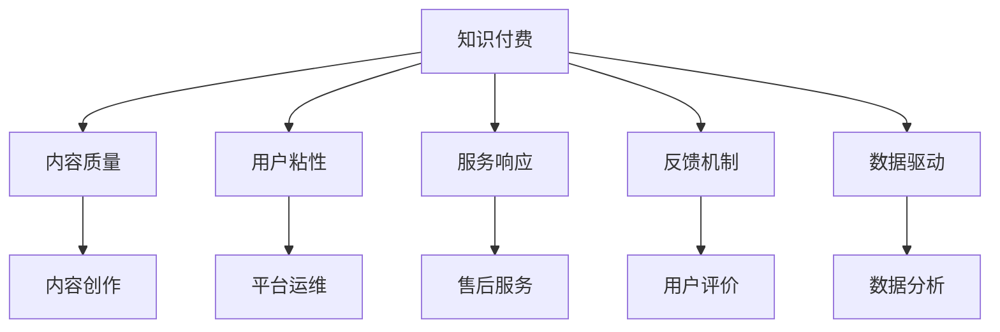

                 

## 1. 背景介绍

随着信息时代的到来，知识付费成为一种新型的商业模式，深受消费者青睐。与传统广告、电视节目等形式相比，知识付费能够直接提供有价值的信息和技能，满足用户的深层次需求。然而，尽管知识付费市场迅速扩张，但用户流失率却居高不下。究其原因，除了内容质量本身，客户服务体系的建设不完善是一个重要因素。

### 1.1 问题由来
知识付费平台以内容为王，但优质的内容背后，是完善的客户服务体系支撑。一个简单的订阅服务背后，可能包含几十个环节的协同工作，包括内容创作、平台运维、用户互动等。一个环节的缺失或不足，都会直接影响用户体验，进而影响平台的忠诚度和商业价值。

### 1.2 问题核心关键点
知识付费平台建立完善的客户服务体系，需要关注以下几个核心关键点：
1. **内容质量**：提供高质量、有价值的内容，满足用户实际需求。
2. **用户互动**：与用户建立良好的互动关系，提升用户粘性。
3. **服务响应**：提供及时的售后服务，解决用户问题。
4. **反馈机制**：建立有效的反馈机制，快速迭代改进。
5. **数据驱动**：利用数据驱动服务优化，提升服务效率和质量。

这些关键点相互关联，共同构成了一个完整的客户服务体系。如何从内容到服务，形成闭环，是知识付费平台成功的关键。

### 1.3 问题研究意义
建立完善的客户服务体系，不仅能够提升用户满意度，增加用户粘性，还能提升平台的商业价值，增加变现能力。对于用户而言，优质的服务能带来更好的使用体验，进一步激发其付费意愿。对于平台而言，完善的客户服务体系能够提升用户信任度，吸引更多高质量用户，从而提升平台的整体收入和品牌影响力。

## 2. 核心概念与联系

### 2.1 核心概念概述

为更好地理解知识付费平台客户服务体系的建设，本节将介绍几个密切相关的核心概念：

- **知识付费**：通过付费方式获取高质量知识和技能的学习方式。
- **客户服务体系**：包括内容创作、平台运维、用户互动、售后服务等环节的协同工作机制。
- **内容质量**：内容的相关性、准确性、深度和时效性等。
- **用户粘性**：用户对平台的依赖程度和重复使用频率。
- **服务响应**：平台对用户问题的响应速度和解决方案的准确性。
- **反馈机制**：用户对服务的评价和建议，用于改进服务的机制。
- **数据驱动**：利用数据分析和算法优化服务流程，提升服务效率和质量。

这些核心概念之间的逻辑关系可以通过以下Mermaid流程图来展示：



这个流程图展示了一些关键概念及其之间的联系：

1. 知识付费平台通过高质量的内容吸引用户，并在内容创作上不断优化。
2. 通过提供优质的服务，提升用户粘性，增强用户对平台的依赖。
3. 提供及时的售后服务，解决用户问题，提升服务响应。
4. 建立有效的反馈机制，收集用户建议，用于服务迭代改进。
5. 利用数据分析驱动服务优化，提升服务效率和质量。

这些概念共同构成了知识付费平台客户服务体系的框架，使其能够更好地满足用户需求，提升平台竞争力。

## 3. 核心算法原理 & 具体操作步骤
### 3.1 算法原理概述

知识付费平台客户服务体系的核心算法原理是：通过高质量的内容和优质服务，提升用户满意度，增加用户粘性，从而提高平台的商业价值。具体而言，客户服务体系可以分为以下几个步骤：

1. **内容创作**：根据用户需求，创作高质量的内容。
2. **平台运维**：确保平台稳定运行，保障内容可访问性。
3. **用户互动**：与用户建立良好的互动关系，提升用户粘性。
4. **售后服务**：提供及时的售后服务，解决用户问题。
5. **反馈机制**：建立有效的反馈机制，快速迭代改进。
6. **数据驱动**：利用数据驱动服务优化，提升服务效率和质量。

### 3.2 算法步骤详解

#### 3.2.1 内容创作

内容创作是知识付费平台的基础，需要根据用户需求，创作高质量、有价值的内容。具体步骤包括：

1. **需求分析**：收集用户需求和反馈，分析用户关注的热点问题。
2. **内容规划**：根据需求，制定内容创作计划，包括选题、形式、风格等。
3. **内容制作**：结合用户需求和内容计划，制作高质量内容。
4. **内容发布**：将内容发布到平台，让用户可访问。

#### 3.2.2 平台运维

平台运维是保障内容可访问性的重要环节，需要确保平台的稳定运行和高效访问。具体步骤包括：

1. **系统部署**：确保平台在各环境（开发、测试、生产）的稳定部署。
2. **性能优化**：优化平台性能，确保内容访问速度快、响应快。
3. **安全防护**：建立安全防护机制，防止数据泄露和恶意攻击。
4. **监控告警**：实时监控平台运行状态，设置异常告警机制。

#### 3.2.3 用户互动

用户互动是提升用户粘性的关键环节，需要与用户建立良好的互动关系。具体步骤包括：

1. **社区建设**：建立用户社区，让用户互相交流分享。
2. **用户运营**：通过互动活动、专属服务等方式，提升用户粘性。
3. **数据驱动**：利用数据分析，了解用户行为，优化互动策略。

#### 3.2.4 售后服务

售后服务是解决用户问题的关键环节，需要提供及时的售后服务。具体步骤包括：

1. **问题收集**：收集用户问题和反馈，进行分类和分析。
2. **问题解决**：针对不同问题，制定解决方案，并快速实施。
3. **满意度评估**：对解决问题的满意度和效果进行评估，用于持续改进。

#### 3.2.5 反馈机制

反馈机制是快速迭代改进的重要环节，需要建立有效的反馈机制。具体步骤包括：

1. **反馈渠道**：提供多种反馈渠道，如在线客服、邮件、社交媒体等。
2. **反馈收集**：收集用户反馈，进行分类和分析。
3. **反馈处理**：对反馈进行处理，制定改进措施。
4. **反馈闭环**：将改进措施落实到实际服务中，并再次收集反馈，形成闭环。

#### 3.2.6 数据驱动

数据驱动是提升服务效率和质量的重要手段，需要利用数据分析优化服务。具体步骤包括：

1. **数据采集**：收集用户行为数据、服务数据等，进行统计和分析。
2. **数据建模**：利用数据建模技术，分析用户行为、服务效果等。
3. **决策支持**：利用数据分析结果，优化服务流程和策略。
4. **持续优化**：根据数据分析结果，持续优化服务流程和策略，提升服务质量。

### 3.3 算法优缺点

知识付费平台客户服务体系的建设，具有以下优点：

1. **提升用户满意度**：通过高质量的内容和优质服务，提升用户满意度，增加用户粘性。
2. **增加用户粘性**：建立良好的用户互动关系，提升用户对平台的依赖程度，增加用户重复使用频率。
3. **提升平台商业价值**：通过优质的服务和用户粘性，提升平台的商业价值，增加变现能力。
4. **快速迭代改进**：建立有效的反馈机制，快速收集用户建议，进行迭代改进。

然而，该方法也存在一定的局限性：

1. **资源消耗大**：内容创作、平台运维、用户互动等环节需要大量资源，成本较高。
2. **数据隐私问题**：收集用户反馈和行为数据时，需要确保数据隐私和安全。
3. **服务响应速度**：提升服务响应速度需要投入大量人力和资源，存在一定的延迟。
4. **技术复杂度**：建立完善的客户服务体系需要复杂的技术实现，需要高水平的技术团队支持。

尽管存在这些局限性，但知识付费平台客户服务体系的建设，是提升用户体验和平台商业价值的重要手段，值得投入资源和精力进行深入探索。

### 3.4 算法应用领域

知识付费平台客户服务体系的应用，广泛覆盖了以下领域：

1. **内容创作**：知识付费平台提供的高质量课程、文章、视频等，通过内容创作环节，提升用户满意度。
2. **平台运维**：知识付费平台需要确保平台稳定运行，保障内容可访问性。
3. **用户互动**：知识付费平台通过社区建设、用户运营等互动环节，提升用户粘性。
4. **售后服务**：知识付费平台提供及时的售后服务，解决用户问题，提升用户满意度。
5. **反馈机制**：知识付费平台建立有效的反馈机制，快速收集用户建议，进行迭代改进。
6. **数据驱动**：知识付费平台利用数据分析驱动服务优化，提升服务效率和质量。

这些领域共同构成了知识付费平台客户服务体系的完整框架，确保平台能够提供高质量的服务，满足用户需求，提升平台商业价值。

## 4. 数学模型和公式 & 详细讲解  
### 4.1 数学模型构建

知识付费平台客户服务体系涉及多个环节，每个环节都可以建立数学模型进行分析和优化。

以用户满意度（S）为例，其影响因素包括内容质量（C）、服务响应（R）、用户粘性（A）等。数学模型如下：

$$ S = f(C, R, A) $$

其中，内容质量（C）、服务响应（R）、用户粘性（A）均为自变量，用户满意度（S）为因变量。

### 4.2 公式推导过程

假设用户满意度（S）由内容质量（C）、服务响应（R）、用户粘性（A）共同决定，则公式可以表示为：

$$ S = C \times R \times A $$

其中，内容质量（C）、服务响应（R）、用户粘性（A）分别为0到1之间的分数，代表各自的满意度。

根据上述假设，用户满意度的计算公式为：

$$ S = C \times R \times A $$

具体来说，内容质量（C）可以表示为：

$$ C = \frac{P}{T} $$

其中，P为满足用户需求的内容数量，T为用户需求总数。

服务响应（R）可以表示为：

$$ R = \frac{T}{U} $$

其中，T为用户提出问题的数量，U为用户反馈问题的解决数量。

用户粘性（A）可以表示为：

$$ A = \frac{U}{L} $$

其中，U为用户重复使用平台次数，L为用户初次使用平台次数。

### 4.3 案例分析与讲解

以知识付费平台知乎为例，分析其客户服务体系建设：

知乎的客户服务体系建设，从内容创作、平台运维、用户互动、售后服务、反馈机制、数据驱动等多个环节进行优化，形成闭环。

1. **内容创作**：知乎邀请大量专家、学者、行业大咖进行内容创作，提供高质量、有价值的文章、课程、回答等，满足用户实际需求。
2. **平台运维**：知乎建立高可用性、高性能的平台架构，确保内容可访问性。同时，建立安全防护机制，防止数据泄露和恶意攻击。
3. **用户互动**：知乎通过社区建设、用户运营等互动环节，提升用户粘性。例如，知乎建立问答社区，用户可以互相交流分享，提升互动性。
4. **售后服务**：知乎提供及时的售后服务，解决用户问题。例如，知乎建立在线客服、邮件客服等，快速解决用户问题。
5. **反馈机制**：知乎建立有效的反馈机制，快速收集用户建议，进行迭代改进。例如，知乎建立用户反馈渠道，定期收集用户反馈，优化服务流程。
6. **数据驱动**：知乎利用数据分析驱动服务优化，提升服务效率和质量。例如，知乎通过分析用户行为数据，优化推荐算法，提升用户体验。

知乎的客户服务体系建设，全面覆盖了内容创作、平台运维、用户互动、售后服务、反馈机制、数据驱动等多个环节，形成了闭环，提升了用户满意度，增加用户粘性，显著提升了平台的商业价值。

## 5. 项目实践：代码实例和详细解释说明
### 5.1 开发环境搭建

在进行知识付费平台客户服务体系建设实践前，我们需要准备好开发环境。以下是使用Python进行Django开发的环境配置流程：

1. 安装Python：从官网下载并安装Python，推荐使用Python 3.7及以上版本。

2. 安装Django：通过pip命令安装Django框架。

```bash
pip install django
```

3. 安装MySQL：安装MySQL数据库，并创建知识付费平台的数据库。

```bash
sudo apt-get install mysql-server
sudo mysql -u root -p
CREATE DATABASE knowledgepay;
```

4. 安装Nginx：安装Nginx服务器，用于部署知识付费平台。

```bash
sudo apt-get install nginx
sudo systemctl start nginx
```

5. 配置Django项目：在Python环境中创建Django项目，并配置数据库连接。

```python
# settings.py
DATABASES = {
    'default': {
        'ENGINE': 'django.db.backends.mysql',
        'NAME': 'knowledgepay',
        'USER': 'root',
        'PASSWORD': 'password',
        'HOST': 'localhost',
        'PORT': '3306',
    }
}
```

完成上述步骤后，即可在Python环境中开始知识付费平台客户服务体系建设的实践。

### 5.2 源代码详细实现

这里我们以知乎的客户服务体系为例，给出使用Django框架进行知识付费平台开发的Python代码实现。

首先，定义Django应用：

```python
# apps.py
from django.apps import AppConfig

class KnowledgepayConfig(AppConfig):
    default_auto_field = 'django.db.models.BigAutoField'
    name = 'knowledgepay'
```

然后，定义Django模型：

```python
# models.py
from django.db import models

class Article(models.Model):
    title = models.CharField(max_length=255)
    content = models.TextField()
    author = models.CharField(max_length=255)
    create_time = models.DateTimeField(auto_now_add=True)
    update_time = models.DateTimeField(auto_now=True)

class Comment(models.Model):
    article = models.ForeignKey(Article, on_delete=models.CASCADE)
    user = models.CharField(max_length=255)
    content = models.TextField()
    create_time = models.DateTimeField(auto_now_add=True)
    update_time = models.DateTimeField(auto_now=True)

class Feedback(models.Model):
    user = models.CharField(max_length=255)
    content = models.TextField()
    status = models.CharField(max_length=20, choices=[('unprocessed', '未处理'), ('processed', '已处理')])
    create_time = models.DateTimeField(auto_now_add=True)
    update_time = models.DateTimeField(auto_now=True)
```

接着，定义Django视图：

```python
# views.py
from django.shortcuts import render
from .models import Article, Comment, Feedback

def article_list(request):
    articles = Article.objects.all()
    return render(request, 'article_list.html', {'articles': articles})

def article_detail(request, id):
    article = Article.objects.get(id=id)
    comments = Comment.objects.filter(article=article).order_by('create_time')
    feedbacks = Feedback.objects.filter(article=article).order_by('create_time')
    return render(request, 'article_detail.html', {'article': article, 'comments': comments, 'feedbacks': feedbacks})

def submit_feedback(request):
    user = request.POST['user']
    content = request.POST['content']
    status = 'processed'
    feedback = Feedback.objects.create(user=user, content=content, status=status)
    return render(request, 'submit_feedback.html', {'feedback': feedback})
```

最后，定义Django模板：

```html
<!-- article_list.html -->


  <h1>文章列表</h1>
  <ul>
    
      <li><a href="">{{ article.title }}</a></li>
    
  </ul>

```

```html
<!-- article_detail.html -->


  <h1>{{ article.title }}</h1>
  <p>{{ article.content }}</p>
  <h2>评论列表</h2>
  <ul>
    
      <li>{{ comment.content }}</li>
    
  </ul>
  <h2>反馈列表</h2>
  <ul>
    
      <li>{{ feedback.content }}</li>
    
  </ul>
  <form method="post">
    
    <label for="user">用户：</label>
    <input type="text" id="user" name="user" required>
    <label for="content">内容：</label>
    <textarea id="content" name="content" required></textarea>
    <button type="submit">提交反馈</button>
  </form>

```

### 5.3 代码解读与分析

让我们再详细解读一下关键代码的实现细节：

**models.py**：
- `Article`模型：定义文章信息，包括标题、内容、作者、创建时间和更新时间。
- `Comment`模型：定义文章评论，包括文章、用户、内容、创建时间和更新时间。
- `Feedback`模型：定义用户反馈，包括用户、内容、状态、创建时间和更新时间。

**views.py**：
- `article_list`视图：获取所有文章，返回文章列表页面。
- `article_detail`视图：获取指定文章的详细信息，包括文章内容、评论列表和反馈列表。
- `submit_feedback`视图：接收用户反馈信息，保存反馈记录，返回反馈提交页面。

**article_list.html**：
- 定义文章列表页面，显示所有文章标题和链接。

**article_detail.html**：
- 定义文章详情页面，显示文章内容、评论列表和反馈列表。
- 提供反馈表单，用户可以提交反馈。

### 5.4 运行结果展示

启动Django开发服务器：

```bash
python manage.py runserver
```

在浏览器中访问http://localhost:8000/，即可看到文章列表页面。点击文章标题，进入文章详情页面，查看评论和反馈。

通过上述代码实现，可以初步构建知识付费平台的客户服务体系。当然，在实际应用中，还需要进一步优化和完善，如增加用户认证、权限控制、数据统计等功能。

## 6. 实际应用场景
### 6.1 智能客服系统

知识付费平台的客户服务体系，可以应用于智能客服系统的构建。智能客服系统能够7x24小时不间断服务，快速响应客户咨询，用自然流畅的语言解答各类常见问题。

在技术实现上，可以收集企业内部的历史客服对话记录，将问题和最佳答复构建成监督数据，在此基础上对预训练模型进行微调。微调后的模型能够自动理解用户意图，匹配最合适的答案模板进行回复。对于客户提出的新问题，还可以接入检索系统实时搜索相关内容，动态组织生成回答。如此构建的智能客服系统，能大幅提升客户咨询体验和问题解决效率。

### 6.2 金融舆情监测

金融机构需要实时监测市场舆论动向，以便及时应对负面信息传播，规避金融风险。传统的人工监测方式成本高、效率低，难以应对网络时代海量信息爆发的挑战。知识付费平台的客户服务体系，可以应用于金融舆情监测。

具体而言，可以收集金融领域相关的新闻、报道、评论等文本数据，并对其进行主题标注和情感标注。在此基础上对预训练语言模型进行微调，使其能够自动判断文本属于何种主题，情感倾向是正面、中性还是负面。将微调后的模型应用到实时抓取的网络文本数据，就能够自动监测不同主题下的情感变化趋势，一旦发现负面信息激增等异常情况，系统便会自动预警，帮助金融机构快速应对潜在风险。

### 6.3 个性化推荐系统

当前的推荐系统往往只依赖用户的历史行为数据进行物品推荐，无法深入理解用户的真实兴趣偏好。知识付费平台的客户服务体系，可以应用于个性化推荐系统。

在实践中，可以收集用户浏览、点击、评论、分享等行为数据，提取和用户交互的物品标题、描述、标签等文本内容。将文本内容作为模型输入，用户的后续行为（如是否点击、购买等）作为监督信号，在此基础上微调预训练语言模型。微调后的模型能够从文本内容中准确把握用户的兴趣点。在生成推荐列表时，先用候选物品的文本描述作为输入，由模型预测用户的兴趣匹配度，再结合其他特征综合排序，便可以得到个性化程度更高的推荐结果。

### 6.4 未来应用展望

随着知识付费平台客户服务体系的不断发展，未来在更多领域得到应用，为各行各业带来变革性影响。

在智慧医疗领域，知识付费平台可以提供高质量的医学知识课程、文章、视频等，提升医护人员的知识和技能水平，提高医疗服务的智能化水平，辅助医生诊疗，加速新药开发进程。

在智能教育领域，知识付费平台可以提供高质量的在线课程、学习资料、互动工具等，因材施教，促进教育公平，提高教学质量。

在智慧城市治理中，知识付费平台可以提供智慧城市管理、城市事件监测、舆情分析、应急指挥等知识课程，提高城市管理的自动化和智能化水平，构建更安全、高效的未来城市。

此外，在企业生产、社会治理、文娱传媒等众多领域，知识付费平台的客户服务体系也将不断涌现，为传统行业数字化转型升级提供新的技术路径。相信随着技术的日益成熟，知识付费平台的客户服务体系必将在构建人机协同的智能时代中扮演越来越重要的角色。

## 7. 工具和资源推荐
### 7.1 学习资源推荐

为了帮助开发者系统掌握知识付费平台的客户服务体系的建设，这里推荐一些优质的学习资源：

1. **Django官方文档**：Django的官方文档提供了详细的教程和示例，适合初学者快速上手。
2. **Django Cookbook**：Django Cookbook提供了丰富的开发技巧和实用代码，适合开发者深入学习和参考。
3. **Django for Beginners**：Django for Beginners是一本适合初学者的教程，适合快速入门。
4. **Python Web Development with Django**：这本书详细介绍了Django框架的使用，适合有一定编程基础的开发者学习。

通过这些资源的学习实践，相信你一定能够快速掌握知识付费平台客户服务体系的建设方法，并将其应用到实际项目中。

### 7.2 开发工具推荐

高效的开发离不开优秀的工具支持。以下是几款用于知识付费平台客户服务体系建设的常用工具：

1. **Django**：Django框架提供了强大的Web开发功能，支持快速的开发和部署。
2. **MySQL**：MySQL数据库适合存储结构化数据，是知识付费平台常用的数据存储方案。
3. **Nginx**：Nginx服务器支持高并发访问，适合部署Web应用。
4. **Git**：Git版本控制工具适合代码管理和协作开发。
5. **Jira**：Jira项目管理工具适合跟踪任务进度，进行项目管理和优化。

合理利用这些工具，可以显著提升知识付费平台客户服务体系的开发效率，加快创新迭代的步伐。

### 7.3 相关论文推荐

知识付费平台客户服务体系的发展源于学界的持续研究。以下是几篇奠基性的相关论文，推荐阅读：

1. **Knowledge-based Tutoring Systems**：研究了知识图谱在智能辅导系统中的应用，提升了用户学习效果。
2. **Customer Satisfaction in E-Commerce**：研究了在线客服系统的客户满意度，探讨了客户服务体系的重要性。
3. **Data-Driven Personalized Recommendation Systems**：研究了个性化推荐系统的数据驱动优化方法，提升了用户推荐体验。
4. **Semantic Web for Knowledge Management**：研究了语义网在知识管理中的应用，提升了知识检索和共享效率。

这些论文代表了大数据时代知识付费平台客户服务体系的发展脉络。通过学习这些前沿成果，可以帮助研究者把握学科前进方向，激发更多的创新灵感。

## 8. 总结：未来发展趋势与挑战
### 8.1 总结

本文对知识付费平台客户服务体系的建设进行了全面系统的介绍。首先阐述了知识付费平台的背景和客户服务体系的重要性，明确了客户服务体系建设的核心关键点。其次，从原理到实践，详细讲解了知识付费平台客户服务体系的数学模型和操作步骤，给出了完整的代码实例和详细解释。同时，本文还广泛探讨了客户服务体系在智能客服、金融舆情、个性化推荐等多个领域的应用前景，展示了客户服务体系的价值。

通过本文的系统梳理，可以看到，知识付费平台客户服务体系的建设是提升用户体验和平台商业价值的重要手段，值得投入资源和精力进行深入探索。

### 8.2 未来发展趋势

展望未来，知识付费平台客户服务体系将呈现以下几个发展趋势：

1. **技术智能化**：随着人工智能技术的发展，知识付费平台的客户服务体系将逐步智能化，能够自动理解用户意图，提供更精准的服务。
2. **数据驱动**：知识付费平台的客户服务体系将更加依赖数据分析，通过用户行为数据、服务数据等，优化服务流程和策略。
3. **平台协同**：知识付费平台的客户服务体系将与第三方平台协同工作，提升服务效率和质量。
4. **用户个性化**：知识付费平台的客户服务体系将更加注重用户个性化需求，提供定制化服务。
5. **全场景应用**：知识付费平台的客户服务体系将应用于更多场景，如智能客服、金融舆情、个性化推荐等。

这些趋势凸显了知识付费平台客户服务体系的发展潜力，值得进一步探索和实践。

### 8.3 面临的挑战

尽管知识付费平台客户服务体系的发展前景广阔，但在建设过程中也面临着诸多挑战：

1. **技术复杂度**：建立完善的客户服务体系需要复杂的技术实现，需要高水平的技术团队支持。
2. **用户隐私**：收集用户反馈和行为数据时，需要确保数据隐私和安全。
3. **服务响应速度**：提升服务响应速度需要投入大量人力和资源，存在一定的延迟。
4. **资源消耗**：内容创作、平台运维、用户互动等环节需要大量资源，成本较高。
5. **数据质量**：数据质量对客户服务体系的建设至关重要，需要确保数据的准确性和完整性。

尽管存在这些挑战，但知识付费平台客户服务体系的建设，是提升用户体验和平台商业价值的重要手段，值得投入资源和精力进行深入探索。

### 8.4 研究展望

面向未来，知识付费平台客户服务体系的研究需要在以下几个方面寻求新的突破：

1. **技术智能化**：探索人工智能技术在客户服务体系中的应用，提升服务效率和质量。
2. **数据驱动**：研究数据分析技术在客户服务体系中的应用，优化服务流程和策略。
3. **平台协同**：研究与其他平台协同工作的机制，提升服务效率和质量。
4. **用户个性化**：研究用户个性化需求分析技术，提供定制化服务。
5. **全场景应用**：研究客户服务体系在不同场景中的应用，拓展服务范围和价值。

这些研究方向的研究突破，将推动知识付费平台客户服务体系的不断优化和进步，为客户带来更好的服务体验，为平台创造更大的商业价值。

## 9. 附录：常见问题与解答

**Q1：知识付费平台如何获取高质量的内容？**

A: 知识付费平台获取高质量的内容，主要通过以下方式：
1. 招募专家、学者、行业大咖进行内容创作，提供高质量的课程、文章、视频等。
2. 与知名出版社、研究机构等合作，获取高质量的知识内容。
3. 鼓励用户上传原创内容，提升平台内容的丰富度。

**Q2：知识付费平台的客户服务体系建设有哪些关键步骤？**

A: 知识付费平台的客户服务体系建设，主要包括以下关键步骤：
1. 内容创作：提供高质量的内容，满足用户实际需求。
2. 平台运维：确保平台稳定运行，保障内容可访问性。
3. 用户互动：与用户建立良好的互动关系，提升用户粘性。
4. 售后服务：提供及时的售后服务，解决用户问题。
5. 反馈机制：建立有效的反馈机制，快速迭代改进。
6. 数据驱动：利用数据分析驱动服务优化，提升服务效率和质量。

**Q3：知识付费平台如何提升用户粘性？**

A: 知识付费平台提升用户粘性，主要通过以下方式：
1. 建立社区，让用户互相交流分享。
2. 通过互动活动、专属服务等方式，提升用户粘性。
3. 利用数据分析，了解用户行为，优化互动策略。

**Q4：知识付费平台的客户服务体系建设需要哪些资源？**

A: 知识付费平台的客户服务体系建设，需要以下资源：
1. 技术团队：需要高水平的技术团队进行开发和维护。
2. 数据资源：需要收集用户行为数据、服务数据等，用于数据分析和优化。
3. 资金投入：需要投入大量资金进行平台建设和技术研发。
4. 人力资源：需要大量人力资源进行内容创作、平台运维、用户互动等环节的工作。

**Q5：知识付费平台如何提升服务响应速度？**

A: 知识付费平台提升服务响应速度，主要通过以下方式：
1. 优化平台架构，确保高并发访问。
2. 使用缓存技术，减少数据库访问压力。
3. 建立自动化服务流程，快速解决问题。

通过这些资源的投入和优化，知识付费平台的客户服务体系将更加高效、智能、个性化，提升用户体验和平台商业价值。

