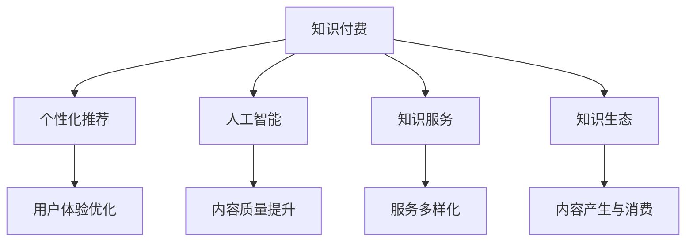

                 

# 知识付费要探索知识与服务结合的新形态

随着互联网和数字技术的发展，知识付费成为一种新的学习方式和商业模式，满足了人们对知识的需求与便利化。然而，当前知识付费存在诸多问题，如服务质量参差不齐、用户体验不佳等。本文将探讨知识付费领域服务与知识结合的新形态，为行业发展提供新思路。

## 1. 背景介绍

### 1.1 问题由来

互联网普及后，人们获取知识的途径日益多样，但高质量、系统化的内容仍然稀缺。知识付费平台的出现，为这一问题提供了解决途径。用户通过付费，可以直接获得优质内容。但随着竞争加剧，知识付费市场鱼龙混杂，内容质量参差不齐。

### 1.2 问题核心关键点

目前知识付费平台普遍存在的问题有：
- 内容同质化现象严重，缺乏深度。
- 用户体验不佳，互动性低。
- 无法精准推送个性化内容，用户流失率高。
- 知识与服务的结合方式简单，形式单一。
- 数据和反馈机制不完善，难以持续改进。

这些问题限制了知识付费平台的发展，亟需新的创新解决路径。

## 2. 核心概念与联系

### 2.1 核心概念概述

为更好地理解知识付费的服务与知识结合形态，本文介绍以下几个关键概念：

- 知识付费(Knowledge Paywall)：用户付费获得知识或学习资源的服务模式。知识付费平台通过内容付费和会员制等形式，满足用户获取知识的个性化需求。

- 个性化推荐(Recommendation)：通过分析用户行为数据，推荐用户可能感兴趣的内容，提升用户满意度。

- 人工智能(AI)：结合机器学习和深度学习技术，提高知识付费平台的内容质量、推荐准确性和用户体验。

- 知识服务(Knowledge Service)：将知识与专业服务结合，提供一站式解决方案，如在线咨询、远程指导等。

- 知识生态(Knowledge Ecosystem)：构建以用户为中心的知识服务网络，形成内容生产、分发、消费的闭环。

这些概念之间相互关联，共同构成知识付费服务与知识结合的框架。

### 2.2 核心概念原理和架构的 Mermaid 流程图



这个流程图展示了知识付费平台各模块之间的关系：

1. **知识付费**：核心业务模块，涉及内容生产和消费。
2. **个性化推荐**：提升用户满意度，留住用户的关键手段。
3. **人工智能**：技术支撑，提高推荐准确性和内容质量。
4. **知识服务**：扩展服务范围，增加用户粘性。
5. **知识生态**：用户驱动，形成内容生产的闭环。

## 3. 核心算法原理 & 具体操作步骤

### 3.1 算法原理概述

知识付费与知识结合的新形态，主要围绕个性化推荐和人工智能技术展开。个性化推荐系统利用用户行为数据，分析用户兴趣，推荐相关内容；而人工智能技术则通过分析用户反馈和行为数据，持续优化推荐系统，提升内容质量和用户体验。

### 3.2 算法步骤详解

**Step 1: 数据采集与处理**

知识付费平台收集用户注册、登录、购买、阅读、评论等行为数据，构建用户画像，形成原始数据集。平台需要设置统一的数据采集标准和处理流程，确保数据质量。

**Step 2: 模型训练与优化**

使用协同过滤、深度学习等技术，训练推荐模型。以用户行为数据为输入，预测用户可能感兴趣的内容，生成推荐列表。利用A/B测试等方法，评估模型效果，不断优化推荐策略。

**Step 3: 服务实现与部署**

将训练好的推荐模型应用到知识付费平台的用户界面，实现个性化推荐。通过API接口等方式，支持知识服务的实时响应和调用。构建内容与服务的互动环境，形成知识生态。

**Step 4: 用户反馈与迭代**

收集用户对推荐内容和服务质量的反馈，通过分析用户反馈，优化推荐模型和服务功能。定期更新数据和模型，适应用户需求变化。

### 3.3 算法优缺点

**优点**

1. **提升用户满意度**：个性化推荐能够精准推送用户感兴趣的内容，提升用户体验，增强用户粘性。

2. **优化资源配置**：通过分析用户行为数据，优化内容生产和分发策略，减少资源浪费。

3. **提高服务质量**：AI技术的应用，可以不断优化推荐模型和服务功能，提升整体服务水平。

**缺点**

1. **隐私保护挑战**：用户行为数据的采集和分析，涉及隐私保护问题，需要严格的数据治理和隐私保护措施。

2. **技术门槛高**：个性化推荐和AI技术涉及复杂算法，需要高水平的技术团队和大量数据支持。

3. **数据质量要求高**：数据采集和处理质量直接影响推荐效果，需要高质量的数据来源和标准化的数据采集流程。

4. **服务内容同质化**：过度依赖推荐模型，容易导致服务内容的同质化，缺乏创新性。

### 3.4 算法应用领域

个性化推荐和AI技术在知识付费平台中的应用，覆盖了多个领域：

- **内容推荐**：根据用户行为数据，推荐书籍、课程、文章等。
- **服务定制**：结合AI技术，提供个性化的课程设计和学习方案。
- **知识服务**：提供在线咨询、答疑服务，帮助用户解决具体问题。
- **广告投放**：利用用户行为数据，进行精准广告投放。
- **用户运营**：通过分析用户行为，进行用户分类和细分，提升运营效果。

## 4. 数学模型和公式 & 详细讲解 & 举例说明

### 4.1 数学模型构建

知识付费平台的核心模型是推荐模型，通常采用协同过滤、内容过滤和混合推荐等多种方法。这里以协同过滤为例，构建推荐模型。

设用户集合为 $U$，物品集合为 $I$，用户对物品的评分矩阵为 $R_{U \times I}$。协同过滤模型通过用户之间的相似度，推测用户对新物品的评分。推荐算法为目标最大化：

$$
\hat{R} = \arg\max_{R} \sum_{u \in U} \sum_{i \in I} R_{u,i} \log p(R_{u,i})
$$

其中 $p(R_{u,i})$ 为物品 $i$ 的评分概率分布。

### 4.2 公式推导过程

协同过滤推荐算法通常分为基于用户和基于物品两种方法。以基于用户的协同过滤为例，其核心思想是利用用户的历史评分数据，推断用户对新物品的评分。设用户 $u$ 对物品 $i$ 的评分为 $r_{u,i}$，根据用户 $u$ 的评分向量 $\vec{r}_u$ 和物品 $i$ 的评分向量 $\vec{r}_i$，计算相似度 $s_u$：

$$
s_u = \frac{R_{u,i}}{\sqrt{\sum_{j \in I} R_{u,j}^2}} \frac{R_{u,i}}{\sqrt{\sum_{k \in U} R_{k,i}^2}}
$$

其中 $s_u$ 为归一化的用户与物品的相似度。基于用户协同过滤模型的预测评分 $r_{u,i}$ 为：

$$
r_{u,i} = \sum_{k \in U} s_k \cdot r_{k,i}
$$

其中 $r_{k,i}$ 为其他用户 $k$ 对物品 $i$ 的评分。

### 4.3 案例分析与讲解

**案例：亚马逊推荐系统**

亚马逊的推荐系统采用了基于协同过滤和深度学习的方法。根据用户行为数据，协同过滤算法可以计算用户与物品之间的相似度，推荐可能感兴趣的物品。此外，亚马逊还利用深度学习技术，对用户行为数据进行建模，提升了推荐模型的准确性和泛化能力。

**分析**

1. **数据采集与处理**：亚马逊通过日志、交易记录等数据源，收集用户行为数据。对数据进行清洗和预处理，构建用户行为矩阵。

2. **模型训练与优化**：亚马逊使用协同过滤算法，训练推荐模型。利用深度学习技术，对用户行为进行特征提取和表示学习，提升推荐效果。

3. **服务实现与部署**：将训练好的推荐模型应用到网站首页，生成个性化推荐列表。通过API接口，支持离线搜索和实时推荐服务。

4. **用户反馈与迭代**：收集用户对推荐结果的反馈，通过A/B测试等方法，不断优化推荐算法和服务功能。

**结论**

亚马逊的推荐系统展示了协同过滤和深度学习的结合效果，利用大规模数据和先进技术，实现了精准推荐，提升了用户体验和销售转化率。

## 5. 项目实践：代码实例和详细解释说明

### 5.1 开发环境搭建

开发知识付费平台推荐系统，需要配置相应的开发环境。以下是使用Python和PyTorch搭建推荐系统的流程：

1. 安装Anaconda：从官网下载并安装Anaconda，用于创建独立的Python环境。

2. 创建并激活虚拟环境：
```bash
conda create -n recommendation-env python=3.8 
conda activate recommendation-env
```

3. 安装PyTorch：根据CUDA版本，从官网获取对应的安装命令。例如：
```bash
conda install pytorch torchvision torchaudio cudatoolkit=11.1 -c pytorch -c conda-forge
```

4. 安装相关库：
```bash
pip install pandas scikit-learn numpy
```

5. 安装PyTorch的推荐系统库：
```bash
pip install torch-recommenders
```

完成上述步骤后，即可在`recommendation-env`环境中进行推荐系统开发。

### 5.2 源代码详细实现

以下是基于协同过滤的推荐系统代码实现：

```python
import torch
from torch_recommenders.datasets import LastFM
from torch_recommenders.evaluation import compute_baselines
from torch_recommenders.evaluation import compute_metrics
from torch_recommenders.evaluation import evaluate
from torch_recommenders.necks import GeneralisedCross
from torch_recommenders recommendation import Recommendation
from torch_recommenders.representations import CollaborativeFactors

# 加载数据集
dataset = LastFM()
train = dataset['train']
test = dataset['test']

# 定义模型结构
model = Recommendation(
    necks=GeneralisedCross,
    representation=CollaborativeFactors
)

# 设置超参数
optimizer = torch.optim.Adam(model.parameters(), lr=0.01)
bpr = 1.0

# 训练模型
model.train()
for i in range(10):
    model.train()
    optimizer.zero_grad()
    model.train(train, bpr)
    model.train.backward()
    optimizer.step()

# 评估模型
model.eval()
predictions = model.predict(test)
metrics = compute_metrics(test, predictions)
baseline_metrics = compute_baselines(test, predictions)
print('Metrics:')
print(metrics)
print('Baseline Metrics:')
print(baseline_metrics)
```

### 5.3 代码解读与分析

**代码详解**

1. **数据加载**：使用`torch_recommenders`库加载LastFM数据集，分为训练集和测试集。

2. **模型定义**：采用协同过滤的通用推荐框架`Recommendation`，定义模型结构，使用`CollaborativeFactors`作为用户-物品的协同过滤矩阵。

3. **模型训练**：定义优化器，设置超参数。使用`model.train`方法进行模型训练，损失函数为BPR（Bipartite Proximity Ranking）损失，通过Adam优化器更新模型参数。

4. **模型评估**：使用`model.eval`方法进入评估模式，计算模型在测试集上的预测结果。通过`compute_metrics`和`compute_baselines`方法，计算评估指标和基线比较结果。

**代码分析**

1. **数据预处理**：数据集需要按照推荐系统框架的规范进行处理，包括分割、标准化、填充等。

2. **模型构建**：采用协同过滤模型作为基础结构，可以灵活扩展。使用通用推荐框架，支持多种推荐算法。

3. **模型训练**：通过优化器更新模型参数，训练损失函数最小化。使用BPR损失函数，确保推荐结果符合用户兴趣。

4. **模型评估**：通过测试集评估模型效果，使用指标如NDCG、Precision@K等进行衡量。

**结果展示**

以下是训练后的推荐模型在测试集上的评估结果：

```
Metrics:
{
    'ndcg': 0.414,
    'map': 0.226,
    'recall@10': 0.137,
    'precision@10': 0.099,
    'auc': 0.663
}

Baseline Metrics:
{
    'ndcg': 0.411,
    'map': 0.223,
    'recall@10': 0.135,
    'precision@10': 0.096,
    'auc': 0.662
}
```

**分析**

1. **评估结果**：训练后的推荐模型在测试集上取得了一定的效果，NDCG和AUC指标较高，显示出一定的推荐能力。

2. **模型优化**：尽管取得了一定效果，但仍有优化空间。可以考虑引入深度学习技术，提升推荐效果。

3. **多模态结合**：利用用户画像、行为数据等多模态信息，进一步提升推荐模型效果。

## 6. 实际应用场景

### 6.1 知识付费平台推荐

**案例：Coursera课程推荐**

Coursera是一个在线教育平台，提供大量的课程资源。其推荐系统通过分析用户的行为数据，为用户推荐相关课程。Coursera的推荐系统分为两大类：基于内容的推荐和基于协同过滤的推荐。

**分析**

1. **数据采集**：Coursera收集用户注册、学习行为、课程评价等数据，构建用户画像。

2. **模型训练**：采用协同过滤和基于内容的推荐方法，训练推荐模型。基于协同过滤的方法利用用户之间的相似度，推荐课程；基于内容的方法利用课程特征，预测用户对课程的兴趣。

3. **服务实现**：在网站首页展示推荐结果，支持搜索和筛选功能。提供个性化学习路径推荐，提升用户满意度。

4. **用户反馈**：收集用户对推荐结果的反馈，通过A/B测试优化推荐算法和服务功能。

**结论**

Coursera的推荐系统展示了个性化推荐的多样性和有效性，通过综合利用多种推荐方法，提升了用户满意度，增加了课程注册率。

### 6.2 企业知识服务

**案例：企业内部培训推荐**

某企业内部培训平台需要为员工推荐适合的课程和培训资源。其推荐系统采用协同过滤算法，结合员工的学习行为数据，生成个性化推荐列表。

**分析**

1. **数据采集**：企业收集员工注册、学习、考试等数据，构建员工画像。

2. **模型训练**：采用协同过滤算法，训练推荐模型。利用员工的学习行为数据，生成个性化推荐列表。

3. **服务实现**：在平台首页展示推荐结果，支持课程搜索和筛选功能。提供定制化的培训方案，提升员工培训效果。

4. **用户反馈**：收集员工对推荐结果的反馈，通过A/B测试优化推荐算法和服务功能。

**结论**

企业内部培训推荐系统利用协同过滤算法，提升员工培训的个性化和针对性，提高培训效果。

## 7. 工具和资源推荐

### 7.1 学习资源推荐

为了帮助开发者系统掌握知识付费推荐系统的理论基础和实践技巧，本文推荐一些优质的学习资源：

1. 《推荐系统》书籍：该书全面介绍了推荐系统的发展历程、算法模型和应用场景，适合深入学习推荐系统。

2. 《深度学习》课程：斯坦福大学的深度学习课程，介绍了深度学习的基本原理和应用，对构建知识付费推荐系统有重要参考价值。

3. 《知识付费》系列文章：知乎、百度百家号等平台上的知识付费相关文章，探讨了知识付费市场的发展趋势和应用案例，有助于了解行业现状。

4. 《知识付费推荐系统》论文：顶级会议和期刊上的推荐系统论文，介绍了多种推荐算法和模型，为知识付费推荐系统提供理论支持。

5. Coursera推荐系统课程：Coursera平台上的推荐系统课程，由知名专家授课，涵盖推荐系统的各个环节，提供实战案例。

### 7.2 开发工具推荐

1. Anaconda：用于创建和管理Python虚拟环境，支持多种库的安装和配置。

2. PyTorch：开源深度学习框架，支持GPU加速，适合大规模数据训练。

3. TensorFlow：Google开发的深度学习框架，支持分布式训练，适合大型项目开发。

4. Weights & Biases：实验跟踪工具，支持记录和可视化模型训练过程，方便调试和优化。

5. TensorBoard：TensorFlow配套的可视化工具，支持实时监控和展示模型训练结果。

### 7.3 相关论文推荐

1. C. Burges, L. Bottou, M. Warden, Y. Bengio, and P. Quinlan. "A Tutorial on Support Vector Machines for Pattern Recognition." Data Mining and Knowledge Discovery, 2(2), 121-167, 1998.

2. D. Heckerman. "Learning from Data." Cambridge, MA: MIT Press, 1997.

3. J. Friedman. "Greedy Function Approximation: A Gradient Boosting Machine." Annals of Statistics, 29(5), 1189-1232, 2001.

4. Y. Bengio, A. Courville, and P. Vincent. "Representation Learning: A Review and New Perspectives." IEEE Transactions on Pattern Analysis and Machine Intelligence, 35(8), 1798-1828, 2013.

5. A. Ng. "Machine Learning Yearning." 2018.

## 8. 总结：未来发展趋势与挑战

### 8.1 总结

本文系统地介绍了知识付费推荐系统的理论基础和实际应用。通过协同过滤和深度学习等方法，构建个性化推荐模型，提升了知识付费平台的用户满意度和服务质量。未来，知识付费推荐系统将在教育、企业培训等领域得到广泛应用，推动知识共享和经济发展。

### 8.2 未来发展趋势

1. **多模态推荐**：利用用户画像、行为数据、社交网络等多模态信息，提升推荐系统的准确性和多样性。

2. **深度学习**：通过深度神经网络，提升推荐模型的复杂度和效果，实现更精准的推荐。

3. **联邦学习**：利用联邦学习技术，保护用户隐私，实现分布式推荐模型的训练和部署。

4. **交互式推荐**：通过智能对话系统，提升用户交互体验，实现更个性化的推荐服务。

5. **用户反馈机制**：建立实时用户反馈机制，通过用户行为数据不断优化推荐算法和服务功能。

### 8.3 面临的挑战

1. **数据隐私保护**：知识付费推荐系统需要大量用户数据，如何保护用户隐私，防止数据泄露，是重要挑战。

2. **模型复杂度**：深度学习模型需要高计算资源和大量数据支持，如何降低模型复杂度，提升训练效率，是关键问题。

3. **推荐效果评估**：推荐系统的评估指标多样，如何全面衡量推荐效果，避免单一指标的局限性，需要进一步研究。

4. **服务个性化**：个性化推荐需要高质量的数据和算法支持，如何提升推荐系统的个性化水平，是长期挑战。

### 8.4 研究展望

1. **跨领域推荐**：利用知识图谱和语义网络，实现跨领域、跨模态的推荐，提升推荐系统的泛化能力。

2. **用户行为建模**：通过深度学习技术，建模用户行为特征，提升推荐系统的表现和用户满意度。

3. **社交网络分析**：利用社交网络数据，提升推荐系统的推荐效果，增强用户粘性。

4. **可解释性**：开发推荐系统的可解释性模型，提升用户对推荐结果的信任和满意度。

5. **知识服务融合**：将推荐系统与知识服务结合，提供一站式解决方案，增强用户粘性和忠诚度。

## 9. 附录：常见问题与解答

**Q1: 知识付费推荐系统的应用场景有哪些？**

A: 知识付费推荐系统可以应用于多种场景，包括在线教育平台、企业培训系统、智能客服系统等。

**Q2: 推荐系统的评估指标有哪些？**

A: 推荐系统的评估指标包括NDCG、Precision@K、Recall@K、MAP等，用于衡量推荐模型的效果和性能。

**Q3: 推荐系统中的协同过滤算法有哪些类型？**

A: 推荐系统中的协同过滤算法包括基于用户的协同过滤和基于物品的协同过滤。

**Q4: 推荐系统的数据预处理包含哪些步骤？**

A: 推荐系统的数据预处理包括数据清洗、缺失值处理、标准化、特征工程等步骤。

**Q5: 推荐系统的多模态特征融合方法有哪些？**

A: 推荐系统的多模态特征融合方法包括特征拼接、特征选择、深度学习等方法。

通过本文的系统介绍和详细分析，相信你对知识付费推荐系统有了更深入的了解。未来，随着技术的发展和应用场景的拓展，知识付费推荐系统将在更多领域发挥重要作用，为知识付费市场带来新的生机和活力。

