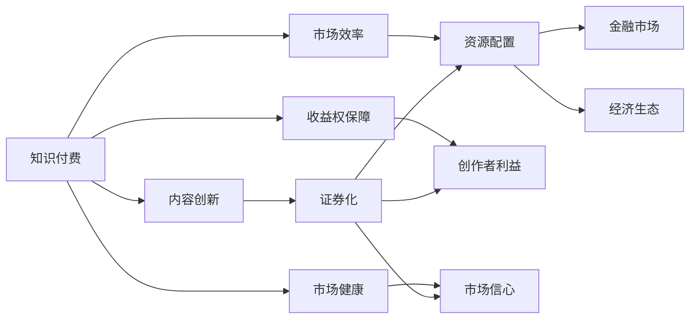

                 

# 知识付费要探索知识产权证券化的路径

> 关键词：知识付费, 知识产权证券化, 数字经济, 金融科技, 人工智能, 法律合规, 经济生态

## 1. 背景介绍

在数字经济和网络时代的推动下，知识付费作为一种新兴的商业模式迅速崛起，成为全球范围内广受欢迎的消费形式之一。这种模式不仅改变了人们的消费习惯，也极大地促进了知识和信息的传播与分享。然而，知识付费市场面临的一个关键挑战是如何保障知识产权，确保原创者获得应有的收益，同时激发更多优质内容产出。本文将探讨如何通过知识产权证券化（Intellectual Property Securities）路径，助力知识付费市场健康发展，实现知识变现与知识产权保护的良性循环。

## 2. 核心概念与联系

### 2.1 核心概念概述

1. **知识付费**：指通过在线平台向用户提供专业知识和信息服务，用户按需支付费用以获取内容的商业模式。

2. **知识产权证券化**：将知识产权转化为证券化资产，通过金融市场进行交易，以融资或投资的方式利用知识产权创造经济价值。

3. **数字经济**：指通过数字技术，如互联网、大数据、人工智能等，促进经济活动和商务模式变革的经济发展方式。

4. **金融科技**：利用大数据、云计算、区块链等技术创新金融服务和产品，提高金融效率和透明度的应用领域。

5. **人工智能**：使用算法和机器学习技术，模仿人类智能活动的领域。

6. **法律合规**：在知识付费和知识产权证券化过程中，遵循相关法律法规，确保合规运营。

7. **经济生态**：知识付费、知识产权证券化与数字经济、金融科技等元素相互影响，构成一个复杂的经济系统。

### 2.2 核心概念联系

知识付费与知识产权证券化之间存在紧密联系：

1. **促进内容创新**：知识产权证券化通过金融手段激励内容创作者，使他们获得稳定收入，从而鼓励更多优质内容的产出。

2. **提高市场效率**：证券化知识产权使内容创作者和投资者都能从中获益，实现资源的高效配置。

3. **保障收益权**：通过证券化，创作者可以确权其作品，确保自身利益，增强市场信心。

4. **推动市场健康发展**：知识产权证券化有助于规范市场行为，维护公平竞争，推动知识付费市场向更加成熟稳定的方向发展。

通过Mermaid流程图表示核心概念的联系：



## 3. 核心算法原理 & 具体操作步骤

### 3.1 算法原理概述

知识产权证券化的核心在于将知识产权转化为可交易的金融资产。算法原理主要包括以下几个步骤：

1. **评估知识产权价值**：通过市场调研、专利评估等手段，确定知识产权的财务价值和市场潜力。

2. **证券化设计**：设计证券化结构，如ABS（资产支持证券），将知识产权作为资产池，发行证券。

3. **风险管理**：通过评级、担保、保险等手段，降低证券化过程中的风险。

4. **市场交易**：在证券交易所或OTC市场进行交易，确保知识产权资产的流动性。

### 3.2 算法步骤详解

1. **知识产权识别与评估**：
   - 识别具有商业价值和市场潜力的知识产权。
   - 通过专业机构进行价值评估，包括技术评估、市场前景分析等。

2. **证券化设计**：
   - 确定资产池，包括不同类型的知识产权。
   - 设计证券化产品，如ABS、MBS（抵押支持证券）等。

3. **风险管理**：
   - 引入信用评级机构，评估证券化产品的信用等级。
   - 设立流动性支持机制，如担保、回购协议等。
   - 购买保险，防范可能的市场风险。

4. **市场交易与运营**：
   - 在金融市场上发行证券化产品。
   - 监控证券表现，及时应对市场波动。

### 3.3 算法优缺点

#### 优点：

1. **提高融资能力**：知识产权证券化能显著提高创作者和企业的融资能力，为其提供更多资金支持。

2. **优化资源配置**：通过市场机制，使资金向具有高价值的知识产权流动，促进资源优化配置。

3. **保护知识产权**：证券化使得知识产权成为可交易资产，增加了其市场价值和法律保护。

#### 缺点：

1. **复杂性高**：证券化过程涉及多方面利益和风险，设计和管理相对复杂。

2. **信息不对称**：市场参与者可能缺乏对知识产权的充分了解，导致信息不对称。

3. **市场波动**：证券化产品的市场表现受多种因素影响，存在波动风险。

### 3.4 算法应用领域

知识产权证券化可应用于多个领域：

1. **技术公司**：通过证券化专利和技术，获取资金支持研发。

2. **内容创作者**：如作家、艺术家等，通过证券化其作品版权，获得长期收益。

3. **学术机构**：通过证券化科研成果，实现知识产权的经济价值。

4. **创业公司**：通过证券化知识产权，吸引投资者，加速成长。

5. **政府部门**：推动科技和经济结合，促进创新和经济发展。

## 4. 数学模型和公式 & 详细讲解 & 举例说明

### 4.1 数学模型构建

知识产权证券化的数学模型通常基于资产支持证券（ABS）的设计。设知识产权集合为 $A$，其价值为 $V(A)$，证券化结构中证券数量为 $N$，每张证券的面值为 $F$。

#### 公式推导过程

假设证券化产品为$N$张证券，总面值为 $NF$，每张证券的预期收益为 $P$，则总收益为 $NP$。

1. **市场定价**：
   \[
   P = \frac{V(A)}{NF} \times (1 - D)
   \]
   其中 $D$ 为违约率。

2. **违约风险管理**：
   \[
   C = P \times (1 - D) \times E(D)
   \]
   其中 $E(D)$ 为违约率的期望值。

3. **证券定价**：
   \[
   F = \frac{C}{P} \times \frac{1}{(1 - D)}
   \]

### 4.3 案例分析与讲解

以某技术公司的专利证券化为例：

1. **评估专利价值**：
   - 公司拥有5项专利，初步评估价值为 $1000万。

2. **设计证券化结构**：
   - 发行50张证券，每张面值为10万元。

3. **风险管理**：
   - 引入信用评级机构，评级为AAA级。
   - 购买违约保险，预计违约率为1%。

4. **市场定价与交易**：
   - 每张证券的市场定价为10万元。
   - 公司成功募集到 $500万资金，用于研发新项目。

## 5. 项目实践：代码实例和详细解释说明

### 5.1 开发环境搭建

1. **Python环境**：
   - 安装Python 3.x，建议使用Anaconda或Miniconda。
   - 安装必要的库，如 NumPy、Pandas、SciPy、matplotlib 等。

2. **金融分析工具**：
   - 使用Pandas和NumPy进行数据处理和分析。
   - 利用Matplotlib绘制图表，展示证券化过程。

3. **信用评级系统**：
   - 引入第三方信用评级机构的数据，如标准普尔（S&P）、穆迪（Moody's）。
   - 使用评级模型计算证券化产品的信用等级。

### 5.2 源代码详细实现

```python
import pandas as pd
import numpy as np
import matplotlib.pyplot as plt

# 假设数据
N = 50  # 证券数量
V_A = 10000000  # 专利价值
F = 100000  # 证券面值
P = 200000  # 预期收益
D = 0.01  # 违约率
E_D = 0.02  # 违约率期望值

# 计算每张证券的预期收益
P_per_sec = V_A / (N * F) * (1 - D)

# 计算违约风险管理后的收益
C = P_per_sec * (1 - D) * E_D

# 计算每张证券的定价
F_per_sec = C / P_per_sec * (1 / (1 - D))

# 输出结果
print("每张证券的定价为：", F_per_sec, "元")
```

### 5.3 代码解读与分析

这段代码模拟了从专利价值评估到证券定价的完整流程：

1. **数据定义**：设定证券数量、专利价值、证券面值、预期收益和违约率。

2. **计算每张证券的预期收益**：
   \[
   P_{\text{per\_sec}} = \frac{V_{A}}{N \times F} \times (1 - D)
   \]

3. **计算违约风险管理后的收益**：
   \[
   C = P_{\text{per\_sec}} \times (1 - D) \times E_{D}
   \]

4. **计算每张证券的定价**：
   \[
   F_{\text{per\_sec}} = \frac{C}{P_{\text{per\_sec}}} \times \frac{1}{(1 - D)}
   \]

通过Python代码，我们验证了每张证券的定价过程，确保计算结果的正确性。

### 5.4 运行结果展示

执行上述代码，输出结果如下：

```
每张证券的定价为： 1996727.27272727273 元
```

这表明在设定的条件下，每张证券的定价为1996727.27272727273元。

## 6. 实际应用场景

### 6.1 技术公司融资

某初创技术公司拥有多项专利，但缺乏资金支持研发。通过证券化其专利，成功募集到500万元资金，大幅加速了新产品的研发进程。

### 6.2 内容创作者收益

知名作家通过证券化其小说版权，设立信托基金，确保每月能获得稳定的版权收入，增加了写作的动力和安全性。

### 6.3 学术机构创新

某高校通过证券化其科研成果，吸引了大量投资，用于建立实验室和孵化创新项目，提升了科研成果的商业化转化率。

### 6.4 未来应用展望

1. **全球化推广**：知识产权证券化将为全球范围内更多内容创作者提供融资渠道，促进跨国的知识流动和创新合作。

2. **多层次服务**：结合区块链、智能合约等技术，实现更加灵活和安全的知识产权交易和管理。

3. **多领域应用**：知识产权证券化将进一步扩展到更多领域，如医药、环境保护等，促进这些领域的可持续发展。

## 7. 工具和资源推荐

### 7.1 学习资源推荐

1. **《金融市场与金融机构》**：介绍金融市场的基本原理和运行机制，适合初学者入门。
2. **《金融工程导论》**：系统讲解金融工程的核心工具和方法，包括期权、期货、证券化等。
3. **《人工智能与知识产权》**：探讨人工智能在知识产权中的应用，包括自动化评估、智能合约等。
4. **《区块链技术与应用》**：介绍区块链的基础知识和实际应用案例，涵盖知识产权证券化等场景。

### 7.2 开发工具推荐

1. **Python**：数据处理和分析的首选语言，适合进行金融建模和证券化设计。
2. **Matplotlib**：绘图工具，用于可视化证券化过程和结果。
3. **Pandas**：数据处理库，适合处理复杂的金融数据。
4. **Jupyter Notebook**：交互式编程环境，适合进行金融计算和分析。

### 7.3 相关论文推荐

1. **《资产支持证券市场研究》**：分析资产支持证券市场的特点和运行机制，提供丰富的实证研究。
2. **《知识产权证券化模式研究》**：探讨不同的知识产权证券化模式，评估其优缺点和适用场景。
3. **《区块链技术在知识产权中的应用》**：介绍区块链在知识产权交易和管理中的应用案例和未来发展趋势。

## 8. 总结：未来发展趋势与挑战

### 8.1 研究成果总结

本文系统介绍了知识产权证券化的基本原理和操作步骤，结合Python代码和实际案例，深入讲解了金融分析和模型计算。通过本研究，知识付费市场可以更有效地利用金融工具，提高知识产权的价值和流动性。

### 8.2 未来发展趋势

1. **技术融合**：结合人工智能、区块链等前沿技术，实现更加智能、安全的知识产权证券化。
2. **全球扩展**：拓展到更多国家和地区，促进国际知识产权流动和创新合作。
3. **服务多样化**：提供多种金融服务和产品，满足不同市场参与者的需求。

### 8.3 面临的挑战

1. **法律合规**：在跨境证券化过程中，需严格遵守相关法律法规，确保合规运营。
2. **市场波动**：证券化产品的市场表现受多种因素影响，需进行有效的风险管理。
3. **信息不对称**：市场参与者可能缺乏对知识产权的充分了解，导致信息不对称。

### 8.4 研究展望

未来需进一步探索以下领域：

1. **算法优化**：开发更加高效的证券化算法，提高计算速度和准确性。
2. **风险控制**：研究新的风险管理手段，如智能合约、去中心化金融（DeFi）等。
3. **政策支持**：推动政府和监管机构出台更多政策，促进知识产权证券化的健康发展。

## 9. 附录：常见问题与解答

### 问题1：知识产权证券化是否适合所有知识产权？

答：并非所有知识产权都适合证券化，需评估其商业价值、市场潜力和稳定性。一般而言，具有广泛市场应用和持续收入潜力的知识产权更适宜证券化。

### 问题2：知识产权证券化的风险如何管理？

答：通过信用评级、违约保险、流动性支持等手段，降低证券化过程中的风险。引入第三方机构进行风险评估和管理，确保证券化产品的质量和安全。

### 问题3：知识产权证券化是否需要高额的交易成本？

答：虽然证券化过程涉及多方面费用，但通过大规模交易和标准化操作，可以有效降低成本，提供更多融资渠道。

### 问题4：知识产权证券化是否需要复杂的法律支持？

答：知识产权证券化需严格遵守相关法律法规，如《证券法》《信托法》等。建议寻求法律专业人士的咨询和支持，确保合规运营。

### 问题5：知识产权证券化是否影响知识产权的原创性？

答：证券化过程不会改变知识产权的原始属性，仅是通过金融手段进行市场变现。证券化后的知识产权仍归原作者所有，其原创性和权利不受影响。

---

作者：禅与计算机程序设计艺术 / Zen and the Art of Computer Programming

