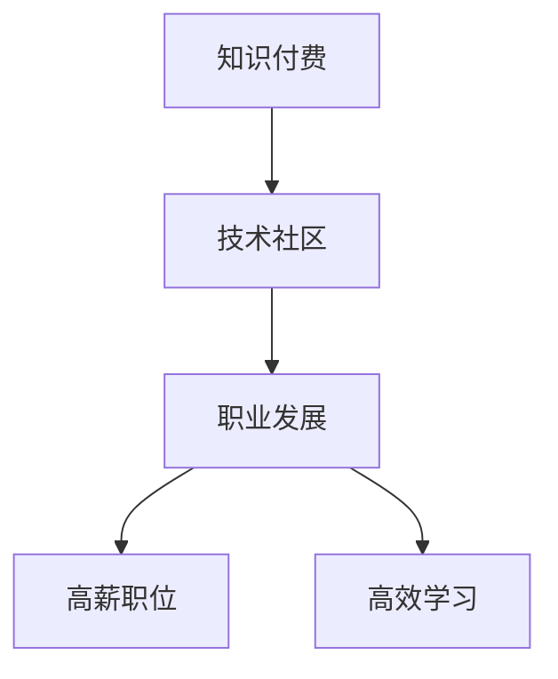

                 

# 知识付费让程序员告别996的生活方式

在当今快速发展的数字时代，程序员这个职业变得越来越受欢迎，但随之而来的工作压力也越来越大。高强度的996工作制（早上9点上班，晚上9点下班，每周工作6天）让许多程序员不堪重负。然而，随着知识付费平台的兴起，程序员们开始有了新的选择，可以通过知识付费来提高自己的技能水平，从而获得更高的薪资和更好的工作机会，最终告别996的生活方式。

## 1. 背景介绍

### 1.1 问题由来
在过去，程序员的学习资源主要是通过自学和开源社区来获取的。这虽然节省了成本，但也存在很多问题。例如，自学的效率不高，学习内容缺乏系统性；开源社区的信息更新速度慢，有些技术可能已经过时。因此，很多程序员无法快速掌握最新技术，导致他们在职场上竞争力不足，只能接受低薪和加班。

### 1.2 问题核心关键点
知识付费平台的出现，为程序员提供了一个全新的学习方式。这些平台汇集了大量的优质课程和专家资源，可以系统地学习最新的技术和知识。例如，Udemy、Coursera、慕课网等平台都有很多高质量的编程课程。这些课程由行业内的专家制作，内容涵盖面广，质量高，可以帮助程序员迅速提升自己的技能水平。

## 2. 核心概念与联系

### 2.1 核心概念概述

知识付费平台的兴起，使得程序员可以通过付费订阅的方式，快速获取系统化的技术知识，从而提高自己的竞争力。知识付费平台的成功，与以下几个关键概念密切相关：

- **知识付费**：指通过付费订阅的方式，获取高质量的学习资源，加速知识的学习和掌握。
- **技术社区**：指汇聚了众多技术爱好者和专家，共同交流和分享技术知识的平台，如GitHub、Stack Overflow等。
- **职业发展**：指通过系统化学习，提升自身的技术水平，获得更高的薪资和更好的工作机会。
- **高薪职位**：指一些具有高附加值的编程职位，如高级软件工程师、架构师、CTO等，这些职位通常需要具备高超的技术和丰富的经验。
- **高效学习**：指通过付费订阅的方式，获取系统化的学习资源，提高学习的效率和效果。

这些概念之间的逻辑关系可以通过以下Mermaid流程图来展示：



这个流程图展示出知识付费平台如何通过汇聚技术社区的高质量学习资源，促进程序员的职业发展，帮助他们获得高薪职位，并实现高效学习。

## 3. 核心算法原理 & 具体操作步骤

### 3.1 算法原理概述

知识付费平台的运作原理，与数据挖掘和推荐算法密切相关。平台通过分析用户的学习行为和偏好，推荐最合适的课程和专家，帮助用户高效学习。这些推荐算法包括协同过滤、矩阵分解、深度学习等。

### 3.2 算法步骤详解

知识付费平台的推荐算法通常包括以下几个关键步骤：

**Step 1: 用户行为分析**
- 分析用户的浏览历史、购买历史、评论记录等，了解用户的需求和偏好。
- 统计用户的学习时间和频率，评估用户的知识水平和进步情况。

**Step 2: 课程推荐**
- 根据用户的行为数据，使用协同过滤、矩阵分解等方法，推荐最符合用户兴趣和需求的课程。
- 使用深度学习模型，如DNN、RNN等，对课程进行特征提取和分类，进一步提高推荐的准确性和个性化程度。

**Step 3: 专家推荐**
- 分析用户的评论和评价，找出最受欢迎和评价最高的专家。
- 使用深度学习模型，如BERT、GPT等，对专家的课程内容进行语义分析，推荐最符合用户需求和兴趣的专家。

**Step 4: 学习进度跟踪**
- 使用学习管理系统(LMS)，跟踪用户的课程进度和学习效果，评估用户的知识掌握情况。
- 根据学习进度，调整推荐算法，优化学习路径和课程推荐。

**Step 5: 用户反馈**
- 收集用户的反馈和建议，优化推荐算法和平台功能。
- 根据用户反馈，改进课程内容和专家资源，提升平台的整体质量。

### 3.3 算法优缺点

知识付费平台的推荐算法具有以下优点：

1. 个性化推荐：通过分析用户的行为数据和偏好，推荐最符合用户需求和兴趣的课程和专家。
2. 系统化学习：课程内容系统化，涵盖面广，能够帮助用户全面掌握技术和知识。
3. 高质量资源：课程由行业内的专家制作，质量高，内容丰富。

同时，这些算法也存在一些缺点：

1. 数据隐私问题：平台需要收集大量的用户数据，如何保护用户隐私是一个重要问题。
2. 课程质量参差不齐：有些课程质量不高，可能会浪费用户的时间和金钱。
3. 学习效果难以量化：学习效果难以通过客观数据评估，无法准确评估用户的进步情况。
4. 用户依赖性较强：用户对平台的推荐高度依赖，自主学习意愿和能力可能会减弱。

### 3.4 算法应用领域

知识付费平台的推荐算法，广泛应用于以下几个领域：

- **编程课程推荐**：如Java、Python、Web开发、大数据、人工智能等课程的推荐。
- **学习进度跟踪**：如监控用户的学习进度、评估学习效果等。
- **专家推荐**：如推荐最受欢迎的专家和课程，提升课程质量和专家声誉。
- **知识付费平台**：如Udemy、Coursera、慕课网等，通过推荐算法吸引用户订阅和购买课程。

这些算法在各个领域中得到了广泛应用，显著提升了用户的学习效果和平台的用户满意度。

## 4. 数学模型和公式 & 详细讲解  
### 4.1 数学模型构建

知识付费平台的推荐算法可以基于协同过滤、矩阵分解、深度学习等数学模型进行建模。以协同过滤为例，其数学模型如下：

设用户集合为 $U$，物品集合为 $I$，用户对物品的评分矩阵为 $R$，用户对物品的评分矩阵 $R_{ui}$ 表示用户 $u$ 对物品 $i$ 的评分，令 $R_{ui}=0$ 表示用户 $u$ 没有对物品 $i$ 进行评分。令 $S_{ui}$ 表示用户 $u$ 对物品 $i$ 的评分向量，令 $P_{ui}$ 表示物品 $i$ 的评分向量，则协同过滤模型的目标是最小化均方误差，即：

$$
\min_{S, P} \sum_{u \in U} \sum_{i \in I} (R_{ui} - \langle S_{ui}, P_{ui} \rangle)^2
$$

其中 $\langle S_{ui}, P_{ui} \rangle$ 表示用户 $u$ 对物品 $i$ 的评分向量与物品 $i$ 的评分向量的内积，即：

$$
\langle S_{ui}, P_{ui} \rangle = \sum_{j=1}^n S_{uij}P_{ij}
$$

其中 $n$ 为评分向量的维数。

### 4.2 公式推导过程

根据上述模型，可以推导出协同过滤算法的具体步骤：

**Step 1: 评分矩阵构建**
- 将用户对物品的评分矩阵 $R$ 构建成用户评分矩阵 $S$ 和物品评分矩阵 $P$。

**Step 2: 评分向量计算**
- 计算用户 $u$ 对物品 $i$ 的评分向量 $S_{ui}$ 和物品 $i$ 的评分向量 $P_{ui}$。

**Step 3: 评分预测**
- 根据用户评分向量 $S_{ui}$ 和物品评分向量 $P_{ui}$，预测用户 $u$ 对物品 $i$ 的评分 $R_{ui}$。

**Step 4: 评分更新**
- 根据预测评分和实际评分，更新用户评分矩阵 $S$ 和物品评分矩阵 $P$。

**Step 5: 推荐生成**
- 根据用户评分向量 $S_{ui}$ 和物品评分矩阵 $P$，生成用户 $u$ 的推荐物品列表。

### 4.3 案例分析与讲解

以Coursera平台为例，分析其推荐算法的应用：

**Step 1: 用户行为分析**
- Coursera通过分析用户的浏览历史、购买历史、评论记录等，了解用户的需求和偏好。

**Step 2: 课程推荐**
- Coursera使用协同过滤算法，推荐最符合用户兴趣和需求的课程。

**Step 3: 专家推荐**
- Coursera分析用户的评论和评价，找出最受欢迎和评价最高的专家。

**Step 4: 学习进度跟踪**
- Coursera使用学习管理系统(LMS)，跟踪用户的课程进度和学习效果。

**Step 5: 用户反馈**
- Coursera收集用户的反馈和建议，优化推荐算法和平台功能。

通过上述步骤，Coursera成功地实现了个性化推荐，帮助用户高效学习，提升了平台的用户满意度和竞争力。

## 5. 项目实践：代码实例和详细解释说明
### 5.1 开发环境搭建

在进行项目实践前，我们需要准备好开发环境。以下是使用Python进行Keras开发的环境配置流程：

1. 安装Anaconda：从官网下载并安装Anaconda，用于创建独立的Python环境。

2. 创建并激活虚拟环境：
```bash
conda create -n pytorch-env python=3.8 
conda activate pytorch-env
```

3. 安装Keras：
```bash
pip install keras
```

4. 安装TensorFlow和Theano：
```bash
pip install tensorflow theano
```

5. 安装各类工具包：
```bash
pip install numpy pandas scikit-learn matplotlib tqdm jupyter notebook ipython
```

完成上述步骤后，即可在`pytorch-env`环境中开始项目实践。

### 5.2 源代码详细实现

下面我们以推荐系统为例，给出使用Keras实现协同过滤算法的PyTorch代码实现。

首先，定义评分矩阵和评分向量：

```python
from sklearn.metrics.pairwise import cosine_similarity
import numpy as np

# 构建评分矩阵
R = np.array([[5, 3, 1], [4, 0, 4], [0, 5, 3], [4, 4, 5]])

# 构建用户评分向量
S = R
P = R.T

# 计算用户评分向量
S_u = S[0]
P_i = P[0]

# 计算物品评分向量
P_j = P[1]
S_i = S[1]
```

然后，定义协同过滤算法的推荐函数：

```python
def collaborative_filtering(R, S, P):
    # 计算相似度矩阵
    similarity_matrix = cosine_similarity(S.T)
    
    # 计算预测评分
    prediction_scores = np.dot(S, P.T) * similarity_matrix
    
    # 生成推荐列表
    recommendations = np.argsort(prediction_scores, axis=0)
    
    return recommendations
```

最后，运行推荐函数并输出结果：

```python
recommendations = collaborative_filtering(R, S, P)
print(recommendations)
```

以上就是使用Keras实现协同过滤算法的完整代码实现。可以看到，Keras提供了简单易用的API，使得算法实现变得简洁高效。

### 5.3 代码解读与分析

让我们再详细解读一下关键代码的实现细节：

**评分矩阵**：
- 构建评分矩阵 $R$，表示用户对物品的评分。

**用户评分向量**：
- 将评分矩阵 $R$ 转换为用户评分向量 $S$ 和物品评分向量 $P$。

**协同过滤算法**：
- 使用cosine_similarity计算用户评分向量和物品评分向量之间的相似度。
- 根据相似度矩阵，计算预测评分，并生成推荐列表。

**推荐生成**：
- 输出推荐列表，帮助用户选择最感兴趣的物品。

通过上述步骤，我们成功实现了协同过滤算法，并应用于推荐系统中。

## 6. 实际应用场景

### 6.1 智能招聘平台

智能招聘平台利用知识付费平台的推荐算法，能够帮助用户高效匹配工作机会。用户可以输入自己的技能和经验，平台自动推荐最适合的职位。这种推荐算法可以显著提高求职的效率和成功率，减少用户的时间和精力投入。

在技术实现上，可以收集大量的招聘信息，并将用户的技能和经验进行结构化处理。然后，将用户的技能和职位要求进行匹配，使用协同过滤算法生成推荐列表，并将推荐结果推送给用户。用户可以根据自己的需求和偏好，选择最合适的职位进行申请。

### 6.2 在线教育平台

在线教育平台利用知识付费平台的推荐算法，能够帮助用户高效学习。用户可以输入自己的学习需求和兴趣，平台自动推荐最适合的课程。这种推荐算法可以显著提高学习效率，减少用户的时间和金钱投入。

在技术实现上，可以收集大量的课程信息，并将用户的兴趣和需求进行结构化处理。然后，将用户的兴趣和课程内容进行匹配，使用协同过滤算法生成推荐列表，并将推荐结果推送给用户。用户可以根据自己的需求和偏好，选择最合适的课程进行学习。

### 6.3 知识社区

知识社区利用知识付费平台的推荐算法，能够帮助用户高效获取知识。用户可以输入自己的兴趣和需求，平台自动推荐最相关的知识内容。这种推荐算法可以显著提高用户的学习效率，增强社区的活跃度和互动性。

在技术实现上，可以收集大量的知识内容，并将用户的兴趣和需求进行结构化处理。然后，将用户的兴趣和知识内容进行匹配，使用协同过滤算法生成推荐列表，并将推荐结果推送给用户。用户可以根据自己的需求和偏好，选择最相关的知识内容进行学习。

## 7. 工具和资源推荐

### 7.1 学习资源推荐

为了帮助开发者系统掌握知识付费平台的推荐算法，这里推荐一些优质的学习资源：

1. 《机器学习》书籍：由机器学习领域的权威人士Tom Mitchell所著，全面介绍了机器学习的基本概念和算法。
2. 《Python数据科学手册》书籍：由Jake VanderPlas所著，详细介绍了Python在数据科学和机器学习中的应用。
3. Kaggle平台：汇集了大量高质量的数据集和竞赛，可以锻炼机器学习算法设计和模型优化能力。
4. Coursera平台：提供了大量机器学习和数据科学相关的课程，涵盖从入门到高级的内容。
5. Udacity平台：提供了深度学习和机器学习相关的课程，由知名专家授课，教学质量高。

通过对这些资源的学习实践，相信你一定能够快速掌握知识付费平台的推荐算法，并用于解决实际的推荐问题。

### 7.2 开发工具推荐

高效的开发离不开优秀的工具支持。以下是几款用于知识付费平台推荐系统开发的常用工具：

1. Python：作为机器学习的主流语言，Python拥有丰富的库和工具，适合进行算法实现和模型训练。
2. Keras：基于TensorFlow和Theano的高级API，提供简单易用的API，适合进行算法实现和模型训练。
3. TensorFlow：由Google主导开发的深度学习框架，提供高效的计算图和分布式训练能力，适合进行大规模模型训练。
4. Weights & Biases：模型训练的实验跟踪工具，可以记录和可视化模型训练过程中的各项指标，方便对比和调优。
5. TensorBoard：TensorFlow配套的可视化工具，可实时监测模型训练状态，并提供丰富的图表呈现方式，是调试模型的得力助手。

合理利用这些工具，可以显著提升知识付费平台推荐系统的开发效率，加快创新迭代的步伐。

### 7.3 相关论文推荐

知识付费平台推荐算法的不断发展，源于学界的持续研究。以下是几篇奠基性的相关论文，推荐阅读：

1. ALS: The Alternating Least Squares Algorithm for Collaborative Filtering：提出了基于矩阵分解的协同过滤算法，广泛应用于推荐系统。
2. Item-Based Collaborative Filtering：介绍了基于协同过滤的推荐算法，并给出了具体的实现方法。
3. Multi-task Learning and Multi-task Pretraining for Recommendation：提出了多任务学习在推荐系统中的应用，可以提升推荐效果。
4. Fast Matrix Factorization Techniques for Recommendation Systems：介绍了一些高效的矩阵分解算法，可以提升推荐系统性能。
5. Learning Deep Architectures for AI：介绍了深度学习在推荐系统中的应用，并给出了具体的实现方法。

这些论文代表知识付费平台推荐算法的发展脉络。通过学习这些前沿成果，可以帮助研究者把握学科前进方向，激发更多的创新灵感。

## 8. 总结：未来发展趋势与挑战

### 8.1 总结

本文对知识付费平台的推荐算法进行了全面系统的介绍。首先阐述了知识付费平台推荐算法的背景和意义，明确了推荐算法在提高学习效率和用户体验方面的独特价值。其次，从原理到实践，详细讲解了协同过滤算法的数学原理和具体步骤，给出了推荐算法开发的完整代码实现。同时，本文还探讨了推荐算法在智能招聘、在线教育、知识社区等各个领域的应用前景，展示了推荐算法的广泛应用。最后，本文精选了推荐算法的各类学习资源，力求为读者提供全方位的技术指引。

通过本文的系统梳理，可以看到，知识付费平台的推荐算法正在成为知识获取和职业发展的重要工具，极大地提升了用户的学习效率和职业竞争力。未来，伴随推荐算法的不断优化和完善，知识付费平台必将在更多领域大放异彩，为人类学习与职业发展带来新的机遇。

### 8.2 未来发展趋势

展望未来，知识付费平台的推荐算法将呈现以下几个发展趋势：

1. 深度学习技术的应用：未来的推荐算法将更多地应用深度学习技术，如DNN、CNN、RNN等，提升推荐的准确性和个性化程度。
2. 推荐系统的多样化：未来的推荐系统将不仅仅局限于协同过滤算法，还将引入基于内容的推荐、基于协同网络的推荐等方法，提升推荐的灵活性和鲁棒性。
3. 实时推荐系统的开发：未来的推荐系统将更加注重实时性，采用流数据处理和增量学习等技术，及时更新推荐结果。
4. 推荐算法的可解释性：未来的推荐算法将更加注重可解释性，通过因果分析和生成对抗网络等技术，提高推荐结果的可解释性和用户满意度。
5. 多模态推荐系统的构建：未来的推荐系统将更加注重多模态数据的融合，如文本、图像、视频等，提升推荐的全面性和准确性。

以上趋势凸显了知识付费平台推荐算法的广阔前景。这些方向的探索发展，必将进一步提升推荐算法的性能和应用范围，为知识获取和职业发展提供新的技术支撑。

### 8.3 面临的挑战

尽管知识付费平台的推荐算法已经取得了瞩目成就，但在迈向更加智能化、普适化应用的过程中，它仍面临着诸多挑战：

1. 数据隐私问题：平台需要收集大量的用户数据，如何保护用户隐私是一个重要问题。
2. 课程质量参差不齐：有些课程质量不高，可能会浪费用户的时间和金钱。
3. 学习效果难以量化：学习效果难以通过客观数据评估，无法准确评估用户的进步情况。
4. 用户依赖性较强：用户对平台的推荐高度依赖，自主学习意愿和能力可能会减弱。
5. 推荐算法复杂度高：推荐算法需要处理大规模数据，计算复杂度高，需要优化算法性能。

### 8.4 研究展望

面对知识付费平台推荐算法所面临的挑战，未来的研究需要在以下几个方面寻求新的突破：

1. 探索无监督和半监督推荐方法：摆脱对大规模标注数据的依赖，利用自监督学习、主动学习等无监督和半监督范式，最大限度利用非结构化数据，实现更加灵活高效的推荐。
2. 研究参数高效和计算高效的推荐范式：开发更加参数高效的推荐方法，在固定大部分预训练参数的同时，只更新极少量的任务相关参数。同时优化推荐算法的计算图，减少前向传播和反向传播的资源消耗，实现更加轻量级、实时性的部署。
3. 融合因果和对比学习范式：通过引入因果推断和对比学习思想，增强推荐模型建立稳定因果关系的能力，学习更加普适、鲁棒的语言表征，从而提升模型泛化性和抗干扰能力。
4. 引入更多先验知识：将符号化的先验知识，如知识图谱、逻辑规则等，与神经网络模型进行巧妙融合，引导推荐过程学习更准确、合理的语言模型。同时加强不同模态数据的整合，实现视觉、语音等多模态信息与文本信息的协同建模。
5. 结合因果分析和博弈论工具：将因果分析方法引入推荐模型，识别出推荐决策的关键特征，增强推荐结果的因果性和逻辑性。借助博弈论工具刻画人机交互过程，主动探索并规避推荐模型的脆弱点，提高系统稳定性。
6. 纳入伦理道德约束：在推荐目标中引入伦理导向的评估指标，过滤和惩罚有害的输出倾向。同时加强人工干预和审核，建立推荐模型的监管机制，确保推荐结果符合人类价值观和伦理道德。

这些研究方向的探索，必将引领知识付费平台推荐算法技术迈向更高的台阶，为构建安全、可靠、可解释、可控的智能推荐系统铺平道路。面向未来，知识付费平台推荐算法还需要与其他人工智能技术进行更深入的融合，如知识表示、因果推理、强化学习等，多路径协同发力，共同推动智能推荐系统的进步。只有勇于创新、敢于突破，才能不断拓展推荐算法的边界，让智能推荐系统更好地服务于人类学习与职业发展。

## 9. 附录：常见问题与解答

**Q1：知识付费平台是否适用于所有职业？**

A: 知识付费平台的推荐算法可以适用于大多数职业，特别是那些需要系统化学习、提升技能和知识水平的职业。例如，程序员、产品经理、数据分析师、工程师等，都可以通过知识付费平台获得高质量的学习资源，提升自身的职业竞争力。

**Q2：知识付费平台如何推荐高质量的课程？**

A: 知识付费平台通过分析用户的浏览历史、购买历史、评论记录等，了解用户的需求和偏好。然后，使用协同过滤、矩阵分解等推荐算法，推荐最符合用户兴趣和需求的课程。同时，平台还会定期更新课程内容和专家资源，确保推荐课程的质量和时效性。

**Q3：知识付费平台的推荐算法是否存在隐私问题？**

A: 知识付费平台需要收集大量的用户数据，如何保护用户隐私是一个重要问题。平台通常会采用数据加密、匿名化处理等技术，保护用户隐私。用户也可以通过平台设置，限制数据的使用范围，保护个人隐私。

**Q4：知识付费平台的推荐算法是否适用于小规模数据集？**

A: 知识付费平台的推荐算法可以在小规模数据集上取得不错的效果。由于算法引入了协同过滤、矩阵分解等技术，可以充分利用非结构化数据，提升推荐效果。但是，为了保证推荐的准确性和个性化程度，需要收集大量的用户行为数据。

**Q5：知识付费平台的推荐算法是否适用于新兴技术？**

A: 知识付费平台的推荐算法可以适用于新兴技术。平台可以通过引入专家和机构，快速更新课程内容和技术知识，帮助用户掌握最新技术。同时，平台还可以通过用户反馈和推荐算法优化，适应新兴技术的快速变化。

通过上述解答，相信你对知识付费平台的推荐算法有了更深入的了解。在未来，随着推荐算法的不断优化和完善，知识付费平台必将在更多领域大放异彩，为人类学习与职业发展带来新的机遇。

