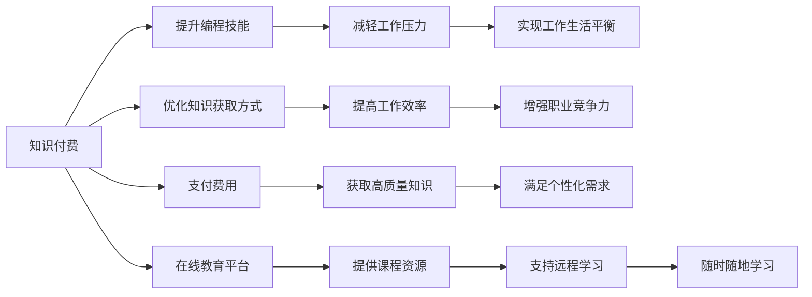

                 

# 知识付费让程序员告别996的生活方式的策略

## 1. 背景介绍

随着科技的高速发展和互联网的普及，程序员已成为社会的重要角色。他们不仅需要掌握多种编程语言和技术框架，还需要持续学习新知识以跟上技术进步的步伐。然而，加班文化在许多公司成为常态，特别是互联网公司，程序员们常常面临高强度的工作压力，每天工作时间超过12小时，这种"996"的生活方式严重影响着他们的身心健康。如何改变这一现状，成为了程序员和企业管理者共同关注的焦点。本文将探讨知识付费在解决这一问题中的潜力和策略。

## 2. 核心概念与联系

### 2.1 核心概念概述

- **知识付费**：通过购买课程、订阅专家服务等形式，支付费用以获取高质量知识或技能的消费行为。知识付费本质上是基于信息不对称的市场，用户通过付费购买知识，以此获取其无法通过免费渠道获得的高价值信息。
- **996工作制**：指的是每天工作9小时，每周工作6天的超时工作制度，典型代表如中国的互联网企业。
- **编程技能提升**：通过学习新技术、参与编程项目等方式提升编程技能，提高工作效率和职业竞争力。
- **工作生活平衡**：在职业生涯和日常生活之间寻求合理平衡，确保身心健康，提高生活质量。
- **在线教育平台**：如Coursera、Udemy、Codecademy等，提供高质量课程和资源，满足程序员的学习需求。

这些概念之间相互关联，共同构成了程序员职场生活和工作状态的重要组成部分。知识付费作为其中一种解决方案，旨在通过优化知识获取方式，帮助程序员提升技能，减轻工作压力，实现更健康的工作生活平衡。

### 2.2 核心概念原理和架构的 Mermaid 流程图



该流程图展示了知识付费从付费获取知识，到提升技能，减轻压力，实现平衡的全过程。其中，A至E的部分为知识付费的核心逻辑，B至D部分为实施知识付费后带来的效果，K至N部分为知识付费的实现方式。

## 3. 核心算法原理 & 具体操作步骤

### 3.1 算法原理概述

知识付费的本质是通过付费方式获取高质量的知识资源，从而提升个人技能和职业竞争力。在这个过程中，知识付费平台作为中间环节，扮演着知识提供者和用户桥梁的角色。

知识付费的算法原理主要包括以下几个方面：

- **个性化推荐算法**：通过分析用户的浏览历史、购买记录等行为数据，推荐最适合用户的课程和资源。
- **学习进度追踪**：记录用户的学习进度，并根据进度调整课程难度和内容，以适应用户的学习节奏。
- **互动学习机制**：引入在线讨论、作业提交、社区互动等功能，增强用户的学习效果。

### 3.2 算法步骤详解

知识付费的算法步骤主要包括以下几个环节：

1. **用户注册和认证**：用户注册账户，并进行身份认证，以确保支付安全和课程信息准确。
2. **课程推荐和选择**：平台根据用户的兴趣、历史行为等数据，推荐适合的课程。用户可以选择感兴趣的课程进行购买。
3. **支付和课程获取**：用户通过在线支付方式支付课程费用，获得课程访问权限。
4. **课程学习**：用户在平台上观看课程视频、阅读教材、完成作业，并参与社区讨论。
5. **学习进度跟踪**：平台记录用户的学习进度，提供学习报告和进度统计，帮助用户了解自己的学习效果。
6. **反馈和评价**：用户可以对课程进行评价和反馈，帮助平台优化课程内容和学习体验。

### 3.3 算法优缺点

#### 优点

- **高效学习**：通过付费获取高质量课程，避免自学过程中遇到的各种问题，提高学习效率。
- **个性化推荐**：根据用户行为数据进行个性化推荐，帮助用户快速找到适合自己的课程。
- **灵活学习**：课程内容可以随时随地进行学习，不受时间和地点限制。

#### 缺点

- **成本高昂**：知识付费需要支付一定的费用，对于一些经济困难的用户来说，可能难以负担。
- **课程质量不一**：平台上的课程质量参差不齐，用户需要花费时间筛选和甄别，才能找到真正有用的课程。
- **缺乏互动**：一些课程可能缺乏互动机制，无法及时解答用户问题，影响学习效果。

### 3.4 算法应用领域

知识付费的应用领域非常广泛，以下是几个主要应用场景：

- **编程技能提升**：程序员可以通过在线教育平台学习新的编程语言和技术框架，提升编程技能。
- **职业发展**：通过学习管理、沟通、领导力等课程，提升职业发展所需的各种软技能。
- **工具和资源**：购买和订阅各种编程工具、开发环境和云服务，提高工作效率。
- **软技能提升**：学习时间管理、情绪管理、心理调适等课程，提升生活质量和工作幸福感。

## 4. 数学模型和公式 & 详细讲解 & 举例说明

### 4.1 数学模型构建

知识付费的数学模型主要涉及以下几个变量：

- **U**：用户集合
- **C**：课程集合
- **R**：用户行为数据集合（如浏览历史、购买记录等）
- **P**：课程价格
- **T**：用户学习进度
- **R**：用户评价和反馈

根据这些变量，可以构建以下数学模型：

$$
\text{Recommendation}(U,C,R) = f(U,C,R)
$$

其中，推荐函数 $f$ 用于根据用户行为数据推荐适合的课程。

### 4.2 公式推导过程

推荐函数 $f$ 的推导主要基于协同过滤和矩阵分解等算法。这里以协同过滤为例，推导推荐函数：

设用户 $u$ 对课程 $c$ 的评分向量为 $\vec{r}_{uc}$，课程 $c$ 的评分向量为 $\vec{r}_c$。则推荐函数可以表示为：

$$
\vec{r}_{uc} \approx \alpha \hat{R}_{uc} + (1-\alpha)\hat{P}(\hat{R}_c)
$$

其中，$\hat{R}_{uc}$ 为协同过滤推荐结果，$\hat{P}(\hat{R}_c)$ 为基于内容的推荐结果，$\alpha$ 为两者的权重。

### 4.3 案例分析与讲解

以在线教育平台Coursera为例，分析知识付费的具体应用：

- **个性化推荐**：Coursera通过分析用户的历史学习行为，推荐与其兴趣相关的课程，如编程、数据科学、人工智能等。
- **互动学习**：平台提供论坛、小组讨论等功能，用户可以与其他学员交流学习心得，解决学习问题。
- **课程认证**：完成课程学习后，用户可以获得证书，证明其完成了某一领域的学习，增强职业竞争力。

## 5. 项目实践：代码实例和详细解释说明

### 5.1 开发环境搭建

开发知识付费平台需要选择合适的技术栈和开发环境。以下是一个基本的搭建流程：

1. **服务器搭建**：使用AWS或阿里云等云平台搭建服务器环境，配置好相应的服务器资源。
2. **前端开发**：使用React或Vue等前端框架开发用户界面，提供课程浏览、课程选择、学习等功能。
3. **后端开发**：使用Node.js或Python等后端语言，结合SQL或NoSQL数据库，实现用户注册、课程推荐、支付等功能。
4. **课程录制和发布**：录制课程视频，上传至云存储服务，生成课程页面，发布到平台上。
5. **课程学习跟踪**：开发学习进度跟踪功能，记录用户学习情况，生成学习报告。

### 5.2 源代码详细实现

以下是一个简单的知识付费平台课程推荐功能的Python代码实现：

```python
from flask import Flask, render_template
from sklearn.metrics.pairwise import cosine_similarity

app = Flask(__name__)

# 模拟课程数据
courses = {
    'Python基础': [4.5, 4.2, 4.8],
    '数据科学入门': [3.9, 3.8, 4.0],
    '机器学习基础': [4.0, 4.1, 4.2]
}

@app.route('/')
def index():
    user_id = 123
    # 获取用户行为数据
    user_data = {
        '浏览': ['Python基础', '数据科学入门', '机器学习基础'],
        '购买': ['数据科学入门', '机器学习基础']
    }
    
    # 计算课程相似度
    similarities = {}
    for course in courses:
        similarities[course] = sum(user_data['浏览'].count(course) + user_data['购买'].count(course))
    
    # 推荐课程
    recommended_courses = sorted(courses, key=lambda x: similarities[x], reverse=True)[:3]
    
    return render_template('index.html', courses=courses, recommended_courses=recommended_courses)

if __name__ == '__main__':
    app.run(debug=True)
```

### 5.3 代码解读与分析

上述代码实现了一个简单的课程推荐功能，主要分为以下几个部分：

1. **数据模拟**：使用Python字典模拟课程数据，包含课程名称和用户评分。
2. **用户行为数据**：使用Python字典模拟用户行为数据，包含用户浏览过的课程和购买过的课程。
3. **课程相似度计算**：计算每个课程与用户行为数据的相似度，作为推荐依据。
4. **推荐课程**：根据相似度对课程进行排序，推荐用户可能感兴趣的课程。
5. **页面渲染**：使用Flask框架将推荐结果渲染到HTML页面上。

### 5.4 运行结果展示

运行上述代码后，打开Web页面，可以看到推荐的课程列表。例如，对于用户ID为123的用户，其推荐课程为'数据科学入门'、'机器学习基础'和'Python基础'。

## 6. 实际应用场景

### 6.1 智能客服系统

智能客服系统通过知识付费平台提供专业培训课程，帮助客服人员掌握更多客户服务技巧和知识。用户可以通过在线课程学习如何处理常见问题，提高服务质量和客户满意度。此外，智能客服系统还可以通过知识付费平台获取最新的行业动态和前沿技术，持续提升服务水平。

### 6.2 金融分析

金融分析人员可以通过知识付费平台学习最新的金融市场分析方法和金融工具使用技巧，提升金融分析和决策能力。平台上的课程内容涵盖了宏观经济分析、股票投资、金融建模等各个方面，帮助分析人员更好地应对复杂的金融市场。

### 6.3 医疗健康

医疗健康领域的专业人员可以通过知识付费平台学习最新的医疗技术、疾病治疗方案和医疗数据分析方法，提高医疗服务水平和患者满意度。平台上的课程内容涵盖了医学基础、临床实践、健康管理等多个方面，为医疗人员提供全方位的学习支持。

### 6.4 未来应用展望

未来，知识付费平台将更广泛地应用于各个领域，成为个人技能提升和职业发展的重要工具。以下是一些未来应用展望：

- **人工智能与知识付费结合**：利用AI技术对用户行为数据进行更精准的分析，提供更加个性化的课程推荐。
- **虚拟现实与知识付费结合**：通过虚拟现实技术，提供沉浸式的学习体验，增强学习效果。
- **区块链与知识付费结合**：利用区块链技术保护用户隐私和课程版权，提升平台的可信度和安全性。

## 7. 工具和资源推荐

### 7.1 学习资源推荐

1. **Coursera**：提供高质量的在线课程，涵盖计算机科学、数据科学、人工智能等多个领域。
2. **Udemy**：提供广泛的编程课程和技术培训，课程内容丰富，价格相对较低。
3. **Codecademy**：提供交互式的编程学习平台，通过动手实践提升编程技能。
4. **edX**：提供多所世界名校的在线课程，涵盖数学、物理、工程等多个学科。
5. **Udacity**：提供专业技能培训课程，包括数据科学、人工智能、机器学习等。

### 7.2 开发工具推荐

1. **AWS**：提供强大的云计算服务，支持搭建服务器和存储环境。
2. **AWS Amplify**：提供快速搭建Web应用的平台，简化前端开发过程。
3. **Node.js**：轻量级的后端开发框架，易于扩展和维护。
4. **Flask**：轻量级的Web框架，适合开发小型应用。
5. **React**：流行的前端框架，支持丰富的组件和状态管理。

### 7.3 相关论文推荐

1. **《知识付费：一个多角度分析》**：分析了知识付费的市场现状、用户需求和平台发展趋势。
2. **《在线教育平台的个性化推荐算法研究》**：介绍了在线教育平台的个性化推荐算法，并进行了案例分析。
3. **《区块链技术在知识付费中的应用》**：探讨了区块链技术在知识付费平台中的应用，如何保护用户隐私和版权。

## 8. 总结：未来发展趋势与挑战

### 8.1 研究成果总结

知识付费作为一种新兴的消费模式，已在多个领域得到了广泛应用。通过知识付费，用户可以获取高质量的知识和技能，提升个人竞争力，同时也推动了教育和技术行业的创新和发展。

### 8.2 未来发展趋势

1. **技术融合**：知识付费将与人工智能、虚拟现实等前沿技术深度融合，提供更优质的学习体验。
2. **平台多样化**：知识付费平台将更加多元化，涵盖更多的领域和行业，满足不同用户的需求。
3. **用户需求个性化**：平台将更加注重用户的个性化需求，提供定制化的课程和服务。
4. **全球化拓展**：知识付费平台将打破地域限制，拓展到全球市场，为用户提供更广泛的课程选择。

### 8.3 面临的挑战

1. **内容质量**：知识付费平台需要不断提升课程内容的质量，确保用户能够获得有价值的知识和技能。
2. **价格合理性**：课程价格需要更加透明和合理，避免价格过高导致用户负担。
3. **平台监管**：知识付费平台需要加强监管，确保内容的真实性和版权合法性。
4. **用户体验**：平台需要提升用户体验，提供更加便捷、高效的学习方式。

### 8.4 研究展望

未来，知识付费将进一步融入互联网生态，成为各行各业发展的核心驱动力。通过持续优化技术和服务，知识付费平台将帮助更多人实现自我提升，推动社会进步。

## 9. 附录：常见问题与解答

**Q1：知识付费是否适用于所有用户？**

A: 知识付费并不适用于所有用户。对于那些经济条件较差，或者学习需求较低的人来说，可能无法负担知识付费的费用。此外，对于一些自学能力强、学习动机不足的用户，知识付费可能无法激发其学习热情。

**Q2：知识付费是否能够解决996问题？**

A: 知识付费本身并不能直接解决996问题。它更多地是一种辅助手段，通过提升用户技能和职业竞争力，间接地改善工作环境和职业发展。解决996问题需要企业文化的改变和劳动法的完善。

**Q3：知识付费是否能够提高工作效率？**

A: 知识付费可以间接地提高工作效率。通过学习新知识和技能，用户可以更好地应对工作中的挑战，提升解决问题的能力，从而提高工作效率。

**Q4：知识付费是否能够提升用户的工作幸福感？**

A: 知识付费可以提升用户的工作幸福感。通过学习新知识和技能，用户可以更加自信和从容地应对工作中的挑战，减少工作压力，提升生活质量。

**Q5：知识付费是否能够推动企业发展？**

A: 知识付费可以推动企业发展。通过提升员工的技能和职业竞争力，企业可以更好地应对市场变化，提高工作效率和创新能力，从而实现可持续发展。

---

作者：禅与计算机程序设计艺术 / Zen and the Art of Computer Programming

