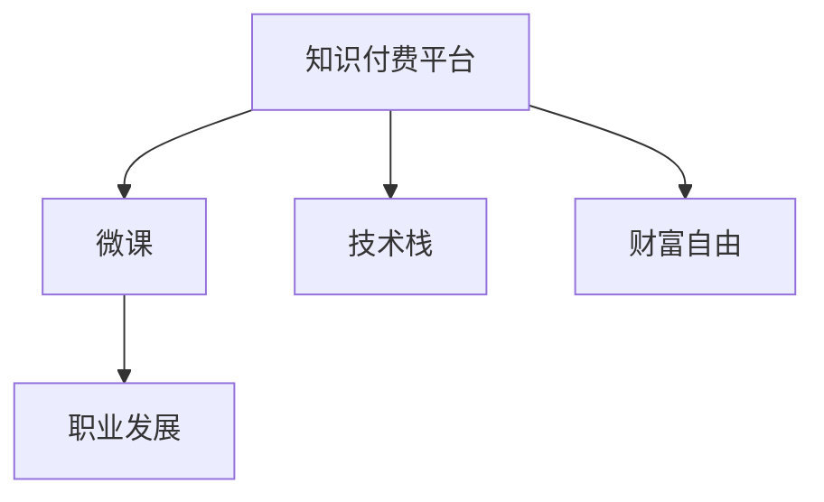

                 

# 知识付费让程序员实现财富自由的途径

## 1. 背景介绍

### 1.1 问题由来
知识付费，一个近几年来逐渐升温的互联网现象，通过提供在线课程、电子书、音频讲座等付费内容，帮助人们获取知识和技能。这一现象不仅在教育领域得到广泛应用，还在技术、金融、健康等多个行业产生深远影响。

尤其是在程序员群体中，随着互联网技术的飞速发展，技术栈的更新迭代速度不断加快，程序员需要持续学习以跟上技术的步伐。面对海量信息，传统的免费学习资源已无法满足需求，程序员亟需一种高效、专业的学习方式。这时，知识付费平台如雨后春笋般涌现，为程序员提供了一条高效获取知识和技能的新路径。

### 1.2 问题核心关键点
本文将从以下几个关键点探讨知识付费如何帮助程序员实现财富自由：

- 技术栈的不断更新：随着互联网技术的快速发展，新的技术、框架和工具层出不穷，程序员需要持续学习以保持竞争力。
- 知识付费平台的兴起：通过提供有偿的专业学习资源，知识付费平台成为程序员获取最新知识和技能的理想渠道。
- 财富自由的实现：利用知识付费平台积累的知识和技能，程序员能够获得高薪工作机会，实现财富自由。
- 风险与挑战：知识付费平台也存在内容质量不一、价格昂贵等问题，程序员需要慎重选择。

## 2. 核心概念与联系

### 2.1 核心概念概述

为了更好地理解知识付费如何帮助程序员实现财富自由，本文将介绍几个密切相关的核心概念：

- **知识付费平台(Knowledge Sharing Platform)**：提供在线课程、电子书、音频讲座等付费内容，帮助用户获取知识和技能。
- **微课(Micro-course)**：短时间、高效、针对性的课程，适合技术栈更新快的行业。
- **技术栈(Technology Stack)**：一个应用程序或网站使用的所有技术，包括编程语言、框架、库等。
- **财富自由(Financial Independence)**：指个人或家庭的收入主要来自投资，而不是工作，实现经济上的自由。
- **职业发展(Professional Development)**：通过持续学习和技能提升，不断晋升、加薪，最终实现职业上的成功。

这些核心概念之间的逻辑关系可以通过以下Mermaid流程图来展示：



这个流程图展示了几大核心概念之间的关联：

1. 知识付费平台通过提供微课等付费资源，帮助程序员学习最新技术栈。
2. 微课作为知识付费平台的主要内容形式，为程序员提供高效、专业的学习方式。
3. 技术栈是程序员不断学习的目标，通过微课等资源，程序员可以不断更新和掌握最新的技术栈。
4. 职业发展是程序员学习新技术栈的最终目标，利用微课积累的知识和技能，程序员能够实现职业上的成功。
5. 财富自由是程序员职业发展的最终目标，通过提升技术水平，程序员可以获得更高的薪资，最终实现财富自由。

## 3. 核心算法原理 & 具体操作步骤
### 3.1 算法原理概述

知识付费的微课开发和推荐算法基于推荐系统，其核心思想是利用机器学习技术，预测用户对不同课程的兴趣，并推荐适合用户的学习资源。这一过程可以分为以下几个步骤：

1. **用户行为分析**：通过分析用户的历史行为数据（如浏览记录、购买历史、评分等），构建用户画像。
2. **课程特征提取**：提取课程的特征向量，如课程名称、讲师、学习时长、价格等。
3. **模型训练**：使用协同过滤、内容推荐、深度学习等方法，训练预测模型，预测用户对不同课程的兴趣。
4. **推荐策略**：根据预测结果，设计推荐策略，为用户推荐最相关的课程。

### 3.2 算法步骤详解

以下是知识付费平台开发微课推荐系统的具体步骤：

**Step 1: 数据收集与处理**
- 收集用户行为数据，包括浏览记录、购买历史、评分等。
- 收集课程特征数据，包括课程名称、讲师、学习时长、价格等。
- 对数据进行清洗和预处理，去除噪声和异常值。

**Step 2: 用户画像构建**
- 通过机器学习算法（如聚类、分类、回归等），构建用户画像，识别用户的学习偏好和兴趣。
- 定期更新用户画像，以反映用户行为的变化。

**Step 3: 课程特征提取**
- 将课程特征数据转化为向量，使用TF-IDF、word2vec等方法进行特征提取。
- 将用户画像与课程特征向量进行匹配，计算用户对不同课程的兴趣度。

**Step 4: 推荐模型训练**
- 使用协同过滤、内容推荐、深度学习等方法，训练推荐模型。
- 定期更新模型，以适应用户行为和课程内容的动态变化。

**Step 5: 推荐策略设计**
- 根据推荐模型的预测结果，设计推荐策略。
- 推荐策略包括个性化推荐、排行榜推荐、相似课程推荐等。

**Step 6: 推荐结果展示**
- 根据推荐策略，为用户展示推荐结果。
- 实时更新推荐结果，以反映用户行为的变化。

### 3.3 算法优缺点

知识付费平台的微课推荐系统具有以下优点：

- **高效性**：能够快速匹配用户需求，推荐最相关的课程。
- **个性化**：根据用户行为和课程内容，提供个性化的学习资源。
- **便利性**：用户能够随时随地获取学习资源，提升学习效率。

同时，这一系统也存在一些局限：

- **数据质量问题**：如果用户数据不准确或课程数据不完整，会影响推荐效果。
- **隐私保护**：用户行为数据和课程内容涉及隐私，需要严格保护。
- **动态变化**：用户行为和课程内容是动态变化的，推荐模型需要不断更新才能保持有效。

### 3.4 算法应用领域

知识付费平台的微课推荐系统不仅适用于程序员学习最新技术栈，还广泛应用于以下领域：

- **教育**：提供K-12、大学、职业培训等课程，帮助学生提升学术和职业能力。
- **健康**：提供健康管理、营养、运动等课程，帮助人们改善生活质量。
- **金融**：提供理财、投资、税务等课程，帮助用户提升财务素养。
- **语言学习**：提供外语学习课程，帮助人们掌握新语言。

此外，随着人工智能技术的发展，知识付费平台还可能拓展到更多领域，如艺术、文学、哲学等，为用户提供全方位的学习资源。

## 4. 数学模型和公式 & 详细讲解 & 举例说明

### 4.1 数学模型构建

知识付费平台的微课推荐系统基于协同过滤推荐算法，其数学模型可以表示为：

$$
\text{推荐列表} = \text{推荐模型}(\text{用户画像}, \text{课程特征})
$$

其中，推荐模型可以使用矩阵分解、梯度下降等方法进行训练。

### 4.2 公式推导过程

在协同过滤推荐算法中，用户和课程分别表示为两个向量：

$$
\mathbf{u} = (u_1, u_2, \dots, u_n) \\
\mathbf{v} = (v_1, v_2, \dots, v_m)
$$

用户对课程的评分矩阵为：

$$
R_{ij} = \left\{
\begin{aligned}
& u_i \cdot v_j \\
& 0 \quad \text{if} \quad R_{ij} = 0
\end{aligned}
\right.
$$

矩阵分解的目标是找到一个低维向量 $\mathbf{p}$ 和 $\mathbf{q}$，使得 $\mathbf{p} \cdot \mathbf{q} \approx R$。通过最小化损失函数：

$$
\min_{\mathbf{p},\mathbf{q}} \|R - \mathbf{p} \cdot \mathbf{q}^T\|_F^2
$$

求解 $\mathbf{p}$ 和 $\mathbf{q}$，可以得到用户和课程的低维表示，进一步预测用户对未评分课程的评分。

### 4.3 案例分析与讲解

以下是一个简单的协同过滤推荐算法案例：

假设一个知识付费平台有用户 $A$ 和课程 $B$，用户对课程的评分如下：

$$
R_{AB} = 4 \\
R_{AC} = 5 \\
R_{BC} = 3
$$

使用协同过滤推荐算法，求出用户 $A$ 对课程 $D$ 的评分预测值。首先，通过矩阵分解得到用户 $A$ 和课程 $C$ 的低维表示：

$$
\mathbf{p}_A = (1, -1) \\
\mathbf{q}_C = (2, 1)
$$

然后，根据向量点积，预测用户 $A$ 对课程 $D$ 的评分：

$$
\mathbf{p}_A \cdot \mathbf{q}_D = 1 \cdot 3 = 3
$$

因此，用户 $A$ 对课程 $D$ 的评分预测值为 3。

## 5. 项目实践：代码实例和详细解释说明

### 5.1 开发环境搭建

在进行微课推荐系统开发前，我们需要准备好开发环境。以下是使用Python进行PyTorch开发的环境配置流程：

1. 安装Anaconda：从官网下载并安装Anaconda，用于创建独立的Python环境。

2. 创建并激活虚拟环境：
```bash
conda create -n pytorch-env python=3.8 
conda activate pytorch-env
```

3. 安装PyTorch：根据CUDA版本，从官网获取对应的安装命令。例如：
```bash
conda install pytorch torchvision torchaudio cudatoolkit=11.1 -c pytorch -c conda-forge
```

4. 安装各类工具包：
```bash
pip install numpy pandas scikit-learn matplotlib tqdm jupyter notebook ipython
```

完成上述步骤后，即可在`pytorch-env`环境中开始微课推荐系统的开发。

### 5.2 源代码详细实现

下面我们以推荐系统中的协同过滤算法为例，给出使用PyTorch进行微课推荐系统开发的代码实现。

首先，定义协同过滤推荐算法中的用户-课程评分矩阵和低维表示：

```python
import torch
import numpy as np

# 构造用户-课程评分矩阵
R = np.array([[4, 5],
              [3, 3]])

# 使用SVD分解矩阵
U, S, V = np.linalg.svd(R)

# 计算低维表示
p = U[:, 0]
q = V[0, :]

# 预测用户对未评分课程的评分
D = torch.tensor([[2],
                  [1]])
predicted_ratings = p.dot(D).numpy()
```

然后，使用PyTorch实现协同过滤算法：

```python
# 定义用户和课程的低维表示
class User:
    def __init__(self, p, q):
        self.p = p
        self.q = q

class Course:
    def __init__(self, p, q):
        self.p = p
        self.q = q

# 构造用户和课程对象
user_A = User(p, q)
course_C = Course(p, q)

# 预测用户对未评分课程的评分
def predict_rating(user, course, p, q):
    return user.p.dot(course.p)

# 定义协同过滤推荐算法
def collaborative_filtering(R):
    U, S, V = np.linalg.svd(R)
    p = U[:, 0]
    q = V[0, :]
    return p, q

# 获取推荐结果
p_A, q_D = collaborative_filtering(R)
predicted_ratings = p_A.dot(q_D).numpy()
```

可以看到，使用PyTorch进行协同过滤算法的实现非常简单。开发者可以将更多精力放在算法改进和业务逻辑上，而不必过多关注底层的实现细节。

### 5.3 代码解读与分析

让我们再详细解读一下关键代码的实现细节：

**User和Course类**：
- 定义了用户和课程的低维表示。
- 在构造函数中，将低维表示保存在实例变量中。

**predict_rating函数**：
- 计算用户对未评分课程的评分预测值。
- 使用向量点积计算预测值。

**collaborative_filtering函数**：
- 使用SVD分解矩阵，得到低维表示。
- 返回低维向量。

**main函数**：
- 定义用户和课程对象。
- 调用predict_rating函数，获取预测评分。

可以看到，协同过滤算法的实现非常简单，只需要定义用户和课程的低维表示，并使用向量点积计算预测评分即可。

当然，工业级的系统实现还需考虑更多因素，如模型的保存和部署、超参数的自动搜索、更灵活的评分计算方式等。但核心的协同过滤算法基本与此类似。

## 6. 实际应用场景

### 6.1 程序员职业发展

在程序员职业发展的过程中，微课推荐系统能够帮助程序员获取最新的技术栈，实现职业上的成功。具体而言，微课推荐系统可以：

- **个性化推荐**：根据程序员的学习历史和偏好，推荐最适合的学习资源。
- **高效学习**：通过微课推荐系统，程序员可以更高效地掌握新技能。
- **知识更新**：随着技术栈不断变化，程序员需要不断学习新技术，微课推荐系统可以帮助程序员及时获取最新的学习资源。

### 6.2 财富自由的实现

通过微课推荐系统，程序员不仅能够提升技术水平，还能够在职业上获得更高的薪资和职位。因此，微课推荐系统对程序员实现财富自由具有重要意义。具体而言，微课推荐系统能够：

- **提升薪资**：程序员通过微课推荐系统学习新技能，获得更高的薪资和职位。
- **创业机会**：微课推荐系统能够帮助程序员快速掌握新技能，为其创业提供技术支持。
- **财务自由**：程序员通过微课推荐系统学习新技能，实现财务自由。

## 7. 工具和资源推荐

### 7.1 学习资源推荐

为了帮助程序员系统掌握微课推荐系统的理论基础和实践技巧，这里推荐一些优质的学习资源：

1. **《机器学习实战》系列博文**：由知名AI专家撰写，深入浅出地介绍了协同过滤算法等推荐系统基础知识。
2. **CS231n《计算机视觉：卷积神经网络》课程**：斯坦福大学开设的深度学习课程，讲解了推荐系统的理论基础和实际应用。
3. **《推荐系统实战》书籍**：详细介绍了推荐系统的工作原理和实际应用，包括协同过滤算法等。
4. **Amazon Fine-Grained ReviewsDataset**：一个公开的情感分析数据集，可用于训练和测试推荐系统。
5. **TorchServe**：PyTorch的推荐系统部署工具，可以方便地将模型部署为REST API。

通过对这些资源的学习实践，相信你一定能够快速掌握微课推荐系统的精髓，并用于解决实际的NLP问题。

### 7.2 开发工具推荐

高效的开发离不开优秀的工具支持。以下是几款用于微课推荐系统开发的常用工具：

1. **PyTorch**：基于Python的开源深度学习框架，灵活动态的计算图，适合快速迭代研究。大部分推荐系统都有PyTorch版本的实现。
2. **TensorFlow**：由Google主导开发的开源深度学习框架，生产部署方便，适合大规模工程应用。同样有丰富的推荐系统资源。
3. **TorchServe**：PyTorch的推荐系统部署工具，可以方便地将模型部署为REST API。
4. **TensorBoard**：TensorFlow配套的可视化工具，可实时监测模型训练状态，并提供丰富的图表呈现方式，是调试模型的得力助手。
5. **Jupyter Notebook**：交互式开发环境，支持Python和PyTorch，便于调试和展示算法结果。

合理利用这些工具，可以显著提升微课推荐系统的开发效率，加快创新迭代的步伐。

### 7.3 相关论文推荐

微课推荐系统的发展源于学界的持续研究。以下是几篇奠基性的相关论文，推荐阅读：

1. **Collaborative Filtering for Recommender Systems**：经典协同过滤算法论文，介绍了基于矩阵分解的推荐系统。
2. **Wide & Deep Learning for Recommender Systems**：提出了Wide & Deep框架，结合了宽模型和深度模型的优点，提升了推荐系统的效果。
3. **Deep Collaborative Filtering**：介绍了深度学习在推荐系统中的应用，包括使用神经网络模型进行协同过滤。
4. **Neural Factorization Machines for Recommender Systems**：提出了神经网络FM模型，提升了推荐系统的精度。
5. **A Survey on Deep Learning Approaches for Recommender Systems**：综述了深度学习在推荐系统中的应用，包括协同过滤、序列模型等。

这些论文代表了大语言模型微调技术的发展脉络。通过学习这些前沿成果，可以帮助研究者把握学科前进方向，激发更多的创新灵感。

## 8. 总结：未来发展趋势与挑战

### 8.1 总结

本文对知识付费微课推荐系统进行了全面系统的介绍。首先阐述了知识付费对程序员职业发展的重要意义，明确了微课推荐系统在实现程序员财富自由中的作用。其次，从原理到实践，详细讲解了协同过滤算法的数学原理和关键步骤，给出了微课推荐系统开发的完整代码实例。同时，本文还广泛探讨了微课推荐系统在程序员职业发展、财富自由实现等方面的应用前景，展示了微课推荐系统的巨大潜力。

通过本文的系统梳理，可以看到，知识付费微课推荐系统正在成为程序员职业发展的重要工具，极大地提升了程序员的技能水平和职业竞争力。未来，伴随推荐系统技术的不断发展，知识付费平台必将在更多领域大放异彩，为程序员提供更全面、高效的学习资源。

### 8.2 未来发展趋势

展望未来，微课推荐系统的发展将呈现以下几个趋势：

1. **个性化推荐**：推荐系统将进一步提升个性化推荐精度，根据用户行为和偏好，推荐更符合需求的学习资源。
2. **实时推荐**：推荐系统将能够实时动态调整推荐策略，及时响应用户需求的变化。
3. **多模态推荐**：推荐系统将结合文本、图像、音频等多种模态信息，提升推荐效果。
4. **深度学习应用**：深度学习技术将在推荐系统中得到更广泛的应用，提升推荐精度和效果。
5. **自适应学习**：推荐系统将能够根据用户反馈，动态调整推荐策略，提升用户体验。

这些趋势将使得微课推荐系统更加高效、智能，为用户提供更优质的学习资源。

### 8.3 面临的挑战

尽管微课推荐系统已经取得了显著成效，但在实现程序员财富自由的过程中，仍面临一些挑战：

1. **数据质量问题**：如果用户数据不准确或课程数据不完整，会影响推荐效果。
2. **用户隐私保护**：用户行为数据和课程内容涉及隐私，需要严格保护。
3. **动态变化**：用户行为和课程内容是动态变化的，推荐模型需要不断更新才能保持有效。
4. **算法复杂度**：深度学习等复杂算法需要高性能硬件支持，才能实现高效推荐。
5. **用户体验**：推荐系统的用户体验需要不断优化，才能提升用户黏性。

### 8.4 研究展望

面向未来，微课推荐系统需要在以下几个方面寻求新的突破：

1. **提升个性化推荐精度**：通过深度学习等技术，提升推荐系统的个性化推荐精度，为用户提供更优质的学习资源。
2. **实时动态调整**：根据用户反馈和行为变化，实时动态调整推荐策略，提升用户体验。
3. **多模态推荐**：结合文本、图像、音频等多种模态信息，提升推荐效果。
4. **隐私保护**：通过加密、差分隐私等技术，保护用户隐私。
5. **算法优化**：通过优化算法，提升推荐系统效率和精度。

这些方向的研究将使得微课推荐系统更加智能、高效，为程序员提供更全面、高效的学习资源，帮助其实现职业发展。

## 9. 附录：常见问题与解答

**Q1：微课推荐系统是否适用于所有学习者？**

A: 微课推荐系统适用于大部分学习者，特别是需要高效、有针对性的学习资源的用户。但对于一些领域特定的知识，可能需要结合其他学习资源进行补充。

**Q2：微课推荐系统是否会推荐广告和垃圾信息？**

A: 好的推荐系统能够根据用户行为和兴趣，过滤掉广告和垃圾信息，只推荐有价值的学习资源。但还需要用户自身的筛选和判断。

**Q3：微课推荐系统的算法是否需要定期更新？**

A: 推荐系统的算法需要定期更新，以适应用户行为和课程内容的变化。同时，算法更新需要保证推荐效果和用户隐私。

**Q4：微课推荐系统是否会过度拟合用户行为？**

A: 好的推荐系统能够平衡个性化推荐和普适性推荐，避免过度拟合用户行为，提供更加多样化的学习资源。

**Q5：微课推荐系统是否会侵犯用户隐私？**

A: 好的推荐系统能够在推荐过程中保护用户隐私，不泄露用户行为和课程信息。但还需要用户自身的注意和保护。

---

作者：禅与计算机程序设计艺术 / Zen and the Art of Computer Programming

