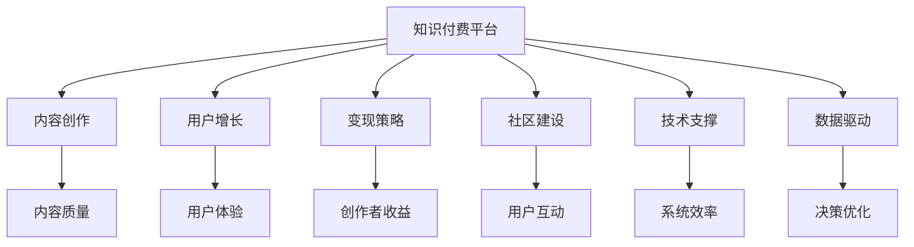

                 

# 知识付费赚钱的内容生态建设策略

> 关键词：知识付费,内容生态,内容创作,用户增长,变现策略,社区建设,技术支撑,数据驱动,持续优化

## 1. 背景介绍

### 1.1 问题由来

随着互联网技术的发展，知识付费正成为越来越多人的选择。通过平台付费获取优质内容，既能满足个人知识需求，又能支持优质内容创作者。但同时，知识付费市场的乱象也逐渐浮现：内容质量良莠不齐、价格虚高、用户体验不佳等问题亟需解决。内容生态建设成为知识付费平台亟待突破的关键。

### 1.2 问题核心关键点

内容生态建设的核心在于：如何构建一个健康、高效、可持续发展的知识付费内容体系。一方面，需要吸引优质的内容创作者，生产高质量内容；另一方面，需要优化用户体验，促进用户增长和付费转化。此外，还需要合理设置定价策略，保障创作者收益，实现平台盈利。

### 1.3 问题研究意义

建设一个健康、高效的内容生态，不仅能够提升平台的用户体验和内容质量，还能促进用户增长和付费转化，进而实现平台的商业化盈利。这对提升知识付费平台的市场竞争力和可持续发展能力，具有重要意义。

## 2. 核心概念与联系

### 2.1 核心概念概述

为更好地理解内容生态建设，本节将介绍几个密切相关的核心概念：

- **知识付费**：指用户通过付费获取有价值知识的服务。知识付费平台则是提供内容创作、知识传播和付费交易的一站式平台。
- **内容生态**：指以知识付费平台为核心，以内容创作者、平台、用户为组成部分的知识生产、传播和消费的生态系统。
- **内容创作**：指内容创作者根据市场需求，创作优质、专业、实用的知识内容。
- **用户增长**：指通过各种策略吸引新用户，提升平台的活跃度和用户粘性。
- **变现策略**：指通过合理定价、会员制度、广告等多种方式实现内容创作者的收益和平台的盈利。
- **社区建设**：指在平台内部构建良好的用户互动环境，增强用户归属感和平台粘性。
- **技术支撑**：指利用大数据、AI、区块链等技术，提升内容推荐、版权保护、内容审核等环节的效率和公平性。
- **数据驱动**：指利用平台大数据，分析用户行为、内容质量、市场趋势等，实现科学的运营决策和优化。

这些核心概念之间的逻辑关系可以通过以下Mermaid流程图来展示：



这个流程图展示了一系列核心概念及其之间的关系：

1. 知识付费平台以内容创作为基础，通过技术支撑和数据驱动，提升内容质量。
2. 用户增长、社区建设、变现策略等环节在平台生态中互相支撑，共同促进内容生产和用户付费。
3. 创作者收益的提升和平台盈利是内容生态的最终目标。

这些概念共同构成了知识付费平台的运营框架，对其运营效果至关重要。

## 3. 核心算法原理 & 具体操作步骤
### 3.1 算法原理概述

知识付费平台的内容生态建设，本质上是一个复杂的系统工程。其核心思想是通过构建和优化内容创作者、平台、用户之间的良性互动关系，实现平台的可持续发展和盈利。

具体而言，平台需要：
- 吸引优质的内容创作者，提供持续高质量的内容产出。
- 优化用户体验，提升用户粘性和付费意愿。
- 合理定价和变现，保障创作者收益和平台盈利。
- 通过技术支撑和数据驱动，提升平台运营效率和决策质量。

### 3.2 算法步骤详解

以下是知识付费平台内容生态建设的一般步骤：

**Step 1: 吸引优质内容创作者**
- 提供优厚待遇和激励机制，吸引并留住优质内容创作者。
- 构建专业化的创作环境，提供必要的技术支持和服务保障。
- 引入KOL（Key Opinion Leaders）和知名专家，提升平台的影响力和内容质量。

**Step 2: 提升内容质量**
- 建立严格的内容审核机制，确保内容的专业性和实用性。
- 引入用户反馈和评价系统，动态调整内容推荐算法。
- 提供创作者互动和交流平台，促进内容交流和创新。

**Step 3: 优化用户体验**
- 设计友好的界面和交互方式，提升用户使用体验。
- 通过个性化推荐，将高质量内容精准推送给目标用户。
- 建立多渠道运营，覆盖不同用户需求，提升平台覆盖面和用户粘性。

**Step 4: 促进用户增长**
- 利用各类营销手段，吸引新用户注册和使用平台。
- 通过数据分析和用户画像，优化用户获取策略，提升用户增长效率。
- 建立会员制度，通过积分奖励和特权服务，提升用户粘性和付费意愿。

**Step 5: 实现创作者收益和平台盈利**
- 合理设置内容和服务的定价，保障创作者收益。
- 引入多元化的变现模式，如付费订阅、按需购买、广告分成等，提升平台盈利能力。
- 定期分析和优化用户消费行为，提升平台整体收益水平。

**Step 6: 构建社区建设**
- 通过各类互动功能，增强用户归属感和平台粘性。
- 引入社区管理机制，促进用户之间的良性互动和内容分享。
- 定期组织线上线下活动，提升用户参与感和平台影响力。

**Step 7: 提供技术支撑**
- 利用大数据、AI等技术，提升内容推荐、版权保护、内容审核等环节的效率和公平性。
- 采用区块链技术，保障内容的原创性和版权，防止侵权和盗版。
- 引入智能算法，优化平台运营和用户体验，提升平台竞争力。

**Step 8: 数据驱动运营**
- 利用平台大数据，分析用户行为、内容质量、市场趋势等，实现科学的运营决策和优化。
- 建立实时数据监控系统，及时发现和解决问题，提升平台运营效率。
- 通过用户调研和数据分析，不断优化内容和用户体验，提升平台的用户满意度和粘性。

以上是知识付费平台内容生态建设的一般流程。在实际应用中，还需要根据平台特性和市场环境，进行灵活调整和优化。

### 3.3 算法优缺点

知识付费平台的内容生态建设具有以下优点：
1. 提升平台的用户体验和内容质量，增强用户粘性和付费意愿。
2. 通过吸引优质创作者和优化内容推荐，提升平台的市场竞争力和用户满意度。
3. 通过多元化的变现模式，提升平台盈利能力，实现可持续发展。
4. 通过数据驱动和智能算法，提升运营效率和决策质量。

同时，该方法也存在一定的局限性：
1. 对创作者激励机制的设计和运营成本投入较大。
2. 对平台的技术支持和数据分析能力要求较高。
3. 对市场环境变化和用户需求变化的响应速度要求较快。
4. 需要持续监控和优化内容质量和用户体验，防止劣质内容的出现。
5. 数据隐私和安全问题需引起高度重视，避免数据泄露和滥用。

尽管存在这些局限性，但就目前而言，内容生态建设仍是知识付费平台的核心竞争力所在。未来相关研究的重点在于如何进一步优化激励机制，降低运营成本，提高平台效率和用户满意度。

### 3.4 算法应用领域

知识付费平台的内容生态建设，在多个领域得到了广泛的应用，如教育培训、知识分享、职业技能培训等，为行业发展注入了新的活力。

- **教育培训**：通过知识付费平台，教育机构可以提供在线课程和辅导，提升教育质量和学习效果。
- **知识分享**：各类专家和学者可以通过平台分享知识，与读者互动交流，形成知识传播的良性循环。
- **职业技能培训**：企业和员工可以利用平台学习新技能，提升自身竞争力，助力企业转型升级。

除了上述这些经典领域外，知识付费平台的内容生态建设还在更多场景中得到应用，如金融理财、健康养生、心理辅导等，为各行业数字化转型提供新的机遇。

## 4. 数学模型和公式 & 详细讲解 & 举例说明
### 4.1 数学模型构建

为更好地理解知识付费平台的内容生态建设，本节将引入一些数学模型，用于描述和分析平台运营的关键指标和优化目标。

记知识付费平台的用户数为 $U$，活跃用户数为 $A$，付费用户数为 $P$，总内容数为 $C$，优质内容数为 $Q$，平台收益为 $R$。定义以下指标：

- **用户增长率**：$\mu_U = \frac{dU}{dt} / U$
- **用户流失率**：$\lambda_U = \frac{dU}{dt} / (U - dU)$
- **付费转化率**：$\alpha = \frac{P}{U}$
- **内容质量**：$P_{\text{score}} = \frac{Q}{C}$
- **平台收益**：$R = P \cdot \text{Average Revenue Per User} = \text{付费用户数} \cdot \text{每用户平均收益}$

### 4.2 公式推导过程

以下我们将推导用户增长率和付费转化率的关系，并探讨其优化策略。

假设平台采用线性增长模型，用户数 $U(t)$ 随时间 $t$ 变化的公式为：

$$
U(t) = U_0 + \mu_U t
$$

其中 $U_0$ 为初始用户数。由此可得用户增长率：

$$
\mu_U = \frac{dU}{dt} / U = \frac{U_0}{U}
$$

类似地，付费转化率 $\alpha$ 可以表示为：

$$
\alpha = \frac{P(t)}{U(t)} = \frac{P_0 + \alpha \cdot U_0 \cdot e^{-\lambda_U t}}{U_0 + \mu_U t}
$$

其中 $P_0$ 为初始付费用户数，$\lambda_U$ 为用户流失率。

通过上述推导，我们可以看到用户增长率和付费转化率之间存在动态关联。通过优化用户增长率和付费转化率，可以实现平台的可持续增长和盈利。

### 4.3 案例分析与讲解

假设某知识付费平台初始用户数为 1000，初始付费用户数为 200，每月用户增长率为 5%，付费转化率为 10%，流失率为 2%。我们希望在 6 个月内，用户数达到 5000，付费用户数达到 500。我们需要求解每月应投入多少营销预算，才能实现这一目标。

设每月投入的营销预算为 $B$，则每月新增用户数 $dU = B / 100$，每月新增付费用户数 $dP = \alpha \cdot dU = 0.1 \cdot dU = 0.01B$。6 个月内，用户数达到 5000，付费用户数达到 500，因此：

$$
U(6) = 1000 + \mu_U \cdot 6 \cdot (B / 100)
$$

$$
P(6) = 200 + 0.1 \cdot \alpha \cdot (1000 + \mu_U \cdot 6 \cdot (B / 100))
$$

根据目标值，解得 $B = 2400$。即每月需要投入 2400 元的营销预算，才能在 6 个月内实现用户数达到 5000，付费用户数达到 500 的目标。

以上案例展示了如何通过数学模型进行平台运营的优化决策。

## 5. 项目实践：代码实例和详细解释说明
### 5.1 开发环境搭建

在进行知识付费平台内容生态建设时，需要搭建一套高效、可扩展的开发环境。以下是使用Python进行Flask开发的开发环境配置流程：

1. 安装Anaconda：从官网下载并安装Anaconda，用于创建独立的Python环境。

2. 创建并激活虚拟环境：
```bash
conda create -n flask-env python=3.8 
conda activate flask-env
```

3. 安装Flask：
```bash
pip install Flask
```

4. 安装SQLite：
```bash
pip install sqlite3
```

5. 安装Flask-RESTful：
```bash
pip install Flask-RESTful
```

6. 安装Flask-SQLAlchemy：
```bash
pip install Flask-SQLAlchemy
```

完成上述步骤后，即可在`flask-env`环境中开始项目开发。

### 5.2 源代码详细实现

这里我们以一个简单的知识付费平台为例，给出基于Flask的代码实现。

首先，定义用户和内容模型：

```python
from flask_sqlalchemy import SQLAlchemy
from flask import Flask, jsonify, request

app = Flask(__name__)
app.config['SQLALCHEMY_DATABASE_URI'] = 'sqlite:///users.db'
db = SQLAlchemy(app)

class User(db.Model):
    id = db.Column(db.Integer, primary_key=True)
    name = db.Column(db.String(100), nullable=False)
    email = db.Column(db.String(100), nullable=False)
    subscription = db.Column(db.String(50), nullable=True)

class Content(db.Model):
    id = db.Column(db.Integer, primary_key=True)
    title = db.Column(db.String(100), nullable=False)
    description = db.Column(db.String(200), nullable=False)
    author_id = db.Column(db.Integer, db.ForeignKey('user.id'), nullable=False)
```

然后，定义API接口：

```python
@app.route('/users', methods=['POST'])
def create_user():
    data = request.get_json()
    new_user = User(name=data['name'], email=data['email'], subscription=data['subscription'])
    db.session.add(new_user)
    db.session.commit()
    return jsonify({'message': 'User created successfully'})

@app.route('/contents', methods=['POST'])
def create_content():
    data = request.get_json()
    new_content = Content(title=data['title'], description=data['description'], author_id=data['author_id'])
    db.session.add(new_content)
    db.session.commit()
    return jsonify({'message': 'Content created successfully'})

@app.route('/users/<id>', methods=['GET'])
def get_user(id):
    user = User.query.get(id)
    return jsonify(user.to_dict())

@app.route('/contents/<id>', methods=['GET'])
def get_content(id):
    content = Content.query.get(id)
    return jsonify(content.to_dict())
```

最后，运行应用程序：

```python
if __name__ == '__main__':
    app.run(debug=True)
```

运行成功后，通过以下地址访问：

```
http://localhost:5000/users
http://localhost:5000/users/<id>
http://localhost:5000/content
http://localhost:5000/content/<id>
```

以上代码展示了如何通过Flask搭建一个简单的知识付费平台，并通过SQLite进行数据存储。

### 5.3 代码解读与分析

这里我们详细解读一下关键代码的实现细节：

**User模型和Content模型**：
- 使用Flask-SQLAlchemy定义SQLite数据库模型，包含用户和内容信息。
- 用户信息包含姓名、邮箱、订阅状态等，内容信息包含标题、描述、作者ID等。

**create_user和create_content函数**：
- 通过Flask提供的API接口，实现用户和内容的创建。
- 用户和内容创建后，会自动保存到数据库中。

**get_user和get_content函数**：
- 通过API接口，获取指定ID的用户和内容信息，并以JSON格式返回。
- 使用Flask的to_dict方法，将模型转换为字典，便于JSON序列化。

**if __name__ == '__main__':
    app.run(debug=True)**：
- 启动Flask应用程序，开启调试模式。

### 5.4 运行结果展示

在运行上述代码后，可以通过以下URL访问：

```
http://localhost:5000/users
http://localhost:5000/users/<id>
http://localhost:5000/content
http://localhost:5000/content/<id>
```

例如，创建用户和内容：

```bash
POST http://localhost:5000/users
Content-Type: application/json

{
  "name": "Alice",
  "email": "alice@example.com",
  "subscription": "silver"
}

POST http://localhost:5000/content
Content-Type: application/json

{
  "title": "Python基础",
  "description": "本课程介绍Python编程语言的基础知识",
  "author_id": 1
}
```

创建完成后，可以通过ID获取用户和内容信息：

```bash
GET http://localhost:5000/users/1
Content-Type: application/json

{
  "id": 1,
  "name": "Alice",
  "email": "alice@example.com",
  "subscription": "silver"
}

GET http://localhost:5000/content/1
Content-Type: application/json

{
  "id": 1,
  "title": "Python基础",
  "description": "本课程介绍Python编程语言的基础知识",
  "author_id": 1
}
```

以上代码和结果展示了如何使用Flask搭建一个简单的知识付费平台，并进行基本的数据操作。

## 6. 实际应用场景
### 6.1 智能教育平台

在智能教育领域，知识付费平台可以提供优质的在线课程和学习资源，帮助学生提升学习效果。平台可以通过邀请名师、组建学习小组等方式，提升课程质量和互动性。同时，还可以通过用户行为数据分析，优化课程推荐和个性化学习路径，提升学习效率。

### 6.2 企业培训平台

在企业培训领域，知识付费平台可以提供定制化的职业技能培训课程，帮助员工提升专业技能，助力企业转型升级。平台可以与企业合作，推出内部培训课程，提升企业整体竞争力。

### 6.3 在线阅读平台

在在线阅读领域，知识付费平台可以提供高质量的电子书和文章资源，满足用户深度阅读需求。平台可以通过用户行为数据分析，推荐优质内容，提升用户粘性。同时，还可以通过付费机制，保障优质内容的版权和创作者收益。

### 6.4 未来应用展望

随着知识付费平台的不断发展，未来的应用场景将更加丰富多样。

在智慧医疗领域，平台可以提供专业的医学知识和健康管理服务，提升医疗服务质量和效率。在智慧金融领域，平台可以提供金融投资和理财知识，提升用户财富管理能力。在智慧家居领域，平台可以提供智能设备和家居管理知识，提升用户生活质量。

未来，知识付费平台将进一步拓展应用场景，成为各行业数字化转型的重要助手。通过内容生态建设，平台将更好地满足用户需求，提升用户体验，实现可持续发展和盈利。

## 7. 工具和资源推荐
### 7.1 学习资源推荐

为帮助开发者系统掌握知识付费平台的内容生态建设，这里推荐一些优质的学习资源：

1. **Flask官方文档**：Flask官方提供的详尽文档，涵盖了Flask开发的各种细节，是Flask开发的必备参考资料。

2. **SQLite官方文档**：SQLite官方提供的SQL数据库开发文档，适合SQL数据库开发的初学者使用。

3. **RESTful API设计指南**：RESTful API设计指南，介绍API开发的规范和最佳实践。

4. **《深入理解Flask》书籍**：深入理解Flask开发的经典书籍，适合Flask开发的中高级用户。

5. **Kaggle数据集**：Kaggle提供的各种数据集，适合数据驱动的内容推荐和个性化学习路径设计。

6. **GitHub开源项目**：GitHub上的开源知识付费平台项目，可以学习他人的开发思路和经验。

7. **Coursera《Flask Web Development》课程**：Coursera提供的Flask开发课程，适合Flask开发初学者。

通过对这些资源的学习实践，相信你一定能够快速掌握知识付费平台的内容生态建设精髓，并用于解决实际的开发问题。

### 7.2 开发工具推荐

高效的开发离不开优秀的工具支持。以下是几款用于知识付费平台内容生态建设开发的常用工具：

1. **Flask**：轻量级的Web框架，易于上手，适合开发小型知识付费平台。

2. **SQLite**：轻量级的SQL数据库，适合存储小规模数据，适合知识付费平台开发。

3. **MySQL/PostgreSQL**：适用于存储大规模数据，支持复杂查询和事务处理，适合大型知识付费平台。

4. **Redis**：高速缓存系统，适合存储 frequently accessed 数据，提升Web应用性能。

5. **ElasticSearch**：分布式搜索系统，适合存储和检索大量数据，支持复杂查询和全文搜索。

6. **Grafana**：开源的数据可视化工具，适合实时监控和数据分析。

7. **Prometheus**：开源的监控和告警系统，适合实时监控和问题诊断。

合理利用这些工具，可以显著提升知识付费平台的内容生态建设开发效率，加快创新迭代的步伐。

### 7.3 相关论文推荐

知识付费平台的内容生态建设研究源于学界的持续研究。以下是几篇奠基性的相关论文，推荐阅读：

1. **《知识付费市场分析与研究》**：对中国知识付费市场进行了深入分析，探讨了知识付费平台的运营模式和盈利策略。

2. **《智能教育平台的设计与实现》**：介绍了一种基于Flask的智能教育平台设计，探讨了平台的交互设计和用户管理。

3. **《内容推荐系统的设计与实现》**：介绍了一种基于协同过滤和内容特征匹配的内容推荐系统，适用于知识付费平台的个性化推荐。

4. **《内容质量评价与优化研究》**：探讨了如何通过用户反馈和数据分析，优化内容质量和用户满意度。

5. **《用户增长策略的理论与实践》**：介绍了一种用户增长策略，通过多种渠道推广和激励机制，提升平台用户增长和粘性。

6. **《知识付费平台的内容审核与版权保护》**：探讨了如何通过技术手段和法律手段，保障知识付费平台的内容质量和版权。

这些论文代表了大数据和人工智能在知识付费平台内容生态建设中的应用，为知识付费平台的开发提供了理论基础和实践指导。

## 8. 总结：未来发展趋势与挑战
### 8.1 总结

本文对知识付费平台的内容生态建设进行了全面系统的介绍。首先阐述了知识付费平台的背景和意义，明确了内容生态建设在平台运营中的核心地位。其次，从理论到实践，详细讲解了知识付费平台的运营框架和关键指标。最后，展示了知识付费平台在教育、培训、阅读等多个领域的应用前景，展望了平台未来的发展趋势和挑战。

通过本文的系统梳理，可以看到，知识付费平台的内容生态建设正在成为平台核心竞争力所在，为提升平台用户粘性、促进用户付费、实现平台盈利提供了重要保障。未来，知识付费平台需要通过持续的创新和优化，提升内容质量和用户体验，才能在激烈的市场竞争中脱颖而出。

### 8.2 未来发展趋势

展望未来，知识付费平台的内容生态建设将呈现以下几个发展趋势：

1. **智能化**：通过引入AI技术，如自然语言处理、图像识别等，提升内容推荐和个性化服务质量。
2. **多元化**：平台内容将更加丰富多样，涵盖多个领域，满足用户多方面的需求。
3. **互动化**：通过社区建设、用户互动等方式，增强用户参与感和平台粘性。
4. **数据化**：利用大数据和分析技术，优化运营决策和内容推荐，提升平台运营效率。
5. **本地化**：根据不同地域和文化背景，定制化内容和推荐策略，提升平台用户覆盖面。
6. **安全化**：通过技术手段和法律手段，保障用户隐私和内容版权，提升平台信任度。

这些趋势凸显了知识付费平台内容生态建设的广阔前景。通过不断探索和创新，平台将能够更好地满足用户需求，提升用户体验，实现可持续发展。

### 8.3 面临的挑战

尽管知识付费平台的内容生态建设取得了一定进展，但在迈向更加智能化、普适化应用的过程中，它仍面临诸多挑战：

1. **创作者激励机制的设计和运营成本投入较大**。需要建立科学的创作者激励机制，同时需投入较大的人力和财力保障平台运营。
2. **内容质量和用户体验的持续优化**。需要通过持续的内容审核和用户反馈，提升平台内容和用户体验，防止劣质内容的出现。
3. **数据隐私和安全问题需引起高度重视**。需采用合适的技术手段和法律法规，保障用户数据隐私和内容版权，防止数据泄露和滥用。
4. **技术支撑和数据分析能力的要求较高**。需要引入先进的AI技术和数据处理技术，提升平台运营效率和决策质量。
5. **市场环境变化和用户需求变化的快速响应**。需要持续监控市场环境变化和用户需求变化，及时调整运营策略。

尽管存在这些挑战，但知识付费平台的内容生态建设仍具有广阔的前景和巨大的潜力。未来相关研究的重点在于如何进一步优化激励机制，降低运营成本，提高平台效率和用户满意度。

### 8.4 研究展望

面向未来，知识付费平台的内容生态建设需要在以下几个方面寻求新的突破：

1. **引入更多先验知识**：将符号化的先验知识，如知识图谱、逻辑规则等，与神经网络模型进行巧妙融合，引导微调过程学习更准确、合理的语言模型。
2. **结合因果分析和博弈论工具**：将因果分析方法引入微调模型，识别出模型决策的关键特征，增强输出解释的因果性和逻辑性。借助博弈论工具刻画人机交互过程，主动探索并规避模型的脆弱点，提高系统稳定性。
3. **融合多模态数据**：引入视觉、语音等多模态信息，提升内容推荐和个性化服务质量，满足用户多方面的需求。
4. **引入伦理道德约束**：在模型训练目标中引入伦理导向的评估指标，过滤和惩罚有偏见、有害的输出倾向，确保输出符合人类价值观和伦理道德。
5. **引入人工智能技术**：引入自然语言处理、计算机视觉、语音识别等AI技术，提升内容推荐和个性化服务质量。

这些研究方向的探索，将引领知识付费平台的内容生态建设迈向更高的台阶，为构建安全、可靠、可解释、可控的智能系统铺平道路。面向未来，知识付费平台的内容生态建设还需要与其他人工智能技术进行更深入的融合，共同推动自然语言理解和智能交互系统的进步。只有勇于创新、敢于突破，才能不断拓展语言模型的边界，让智能技术更好地造福人类社会。

## 9. 附录：常见问题与解答

**Q1：知识付费平台的商业模式有哪些？**

A: 知识付费平台的商业模式主要有以下几种：

1. **订阅制**：用户通过付费成为平台会员，享受多种特权服务，如优先推荐、专属内容等。
2. **按需购买**：用户通过单次购买获取特定内容，享受一次付费多次阅读服务。
3. **广告分成**：平台通过展示广告和付费广告，获取收入分成。
4. **会员激励**：平台通过积分奖励和特权服务，提升用户粘性和付费意愿。

不同的商业模式需要不同的运营策略和盈利模式，需要根据平台特性和市场环境进行选择。

**Q2：知识付费平台如何平衡创作者收益和平台盈利？**

A: 知识付费平台需要通过合理的定价策略和变现模式，平衡创作者收益和平台盈利。具体而言：

1. **合理定价**：通过市场调研和用户行为分析，合理设置内容和服务的定价，保障创作者收益。
2. **多元化变现**：引入多元化的变现模式，如订阅制、按需购买、广告分成等，提升平台盈利能力。
3. **会员制度**：通过会员制度，提供多种特权服务，提升用户粘性和付费意愿，同时保障创作者收益。
4. **用户调研**：通过用户调研和数据分析，优化定价策略和变现模式，提升平台整体收益水平。

平衡创作者收益和平台盈利需要综合考虑多方面因素，科学决策，灵活调整。

**Q3：知识付费平台的内容审核机制如何设置？**

A: 知识付费平台的内容审核机制需要包括以下几个环节：

1. **内容质量评估**：通过用户评分和专家评审，对内容质量进行评估，剔除低质量内容。
2. **版权审核**：引入版权数据库，审核内容是否侵犯版权，保障内容原创性和版权。
3. **违规内容筛选**：通过关键词匹配和内容审核算法，筛除违规和有害内容。
4. **用户反馈机制**：建立用户反馈和举报系统，及时发现和处理违规内容。
5. **人工复审**：对关键内容进行人工复审，确保内容审核的准确性和公平性。

通过以上环节，可以有效提升平台内容质量，保障用户权益，提升平台整体声誉。

**Q4：知识付费平台如何优化用户增长和付费转化？**

A: 知识付费平台需要通过以下策略优化用户增长和付费转化：

1. **多渠道推广**：通过线上线下多种渠道推广平台，提升品牌知名度和用户覆盖面。
2. **用户画像和行为分析**：通过数据分析，了解用户行为和需求，优化用户获取策略。
3. **个性化推荐**：通过个性化推荐，提升用户体验和内容相关性，促进用户付费。
4. **会员制度和积分奖励**：通过会员制度和积分奖励，提升用户粘性和付费意愿。
5. **多渠道变现**：通过多种变现模式，提升平台盈利能力，提升用户付费意愿。
6. **持续优化**：通过持续优化平台功能和用户体验，提升用户满意度和平台粘性。

通过以上策略，可以最大化提升用户增长和付费转化，实现平台盈利目标。

**Q5：知识付费平台如何进行内容推荐和个性化服务？**

A: 知识付费平台的内容推荐和个性化服务需要引入以下技术手段：

1. **协同过滤算法**：通过分析用户行为和内容标签，推荐相似内容和相关内容。
2. **内容特征匹配**：提取内容特征，匹配用户兴趣和内容特点，推荐高质量内容。
3. **自然语言处理**：通过NLP技术，解析用户输入和内容文本，实现更加精准的推荐。
4. **用户画像和行为分析**：通过数据分析，了解用户行为和需求，优化推荐策略。
5. **实时反馈和优化**：通过用户反馈和数据分析，持续优化推荐算法，提升推荐质量。

通过以上技术手段，可以提升内容推荐和个性化服务质量，满足用户需求，提升平台用户粘性。

---

作者：禅与计算机程序设计艺术 / Zen and the Art of Computer Programming

