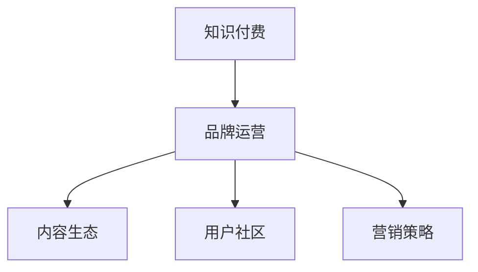

                 

## 1. 背景介绍

随着互联网和技术的快速发展，知识付费市场迎来了新的机遇与挑战。品牌在知识付费领域的成功，不仅需要优质的内容和平台支撑，更依赖于科学合理的运营与推广策略。本文将全面介绍知识付费品牌运营的核心策略，从运营思路、内容生态、用户社区、营销策略等角度，为品牌打造赚钱模式提供实战指南。

## 2. 核心概念与联系

### 2.1 核心概念概述

- **知识付费**：用户为获取深度、专业的知识内容而支付费用的商业行为。
- **品牌运营**：品牌通过策略规划、市场推广、用户管理等手段，提升品牌知名度和用户忠诚度的过程。
- **内容生态**：知识付费平台与内容创作者、用户之间的互动关系，形成的一种健康循环。
- **用户社区**：围绕特定知识付费平台或内容，用户自发形成的学习交流群体。
- **营销策略**：品牌通过各种渠道推广自身内容与服务，吸引和保留用户的策略。

以上概念通过下图流程来展示其联系：



知识付费品牌运营的目标是通过系统化的运营手段，构建良性内容生态，营造活跃用户社区，并制定有效的营销策略，最大化商业价值。

## 3. 核心算法原理 & 具体操作步骤

### 3.1 算法原理概述

知识付费品牌运营的核心算法原理主要围绕内容质量、用户行为与市场变化三方面展开。具体来说：

- **内容质量**：内容质量和深度是知识付费平台的核心竞争力，通过数据驱动的内容推荐和优化，确保内容对用户有吸引力。
- **用户行为**：通过分析用户的行为数据，如订阅情况、消费习惯等，来优化用户策略，提升用户粘性和活跃度。
- **市场变化**：通过市场环境分析，如经济、行业趋势等，及时调整策略，适应市场变化，确保品牌的可持续发展。

### 3.2 算法步骤详解

1. **用户画像构建**
   - 收集用户的基本信息，如年龄、职业、兴趣等。
   - 使用聚类分析等方法，构建用户画像，识别不同用户群体的特点。
   - 通过A/B测试，优化用户界面和体验，提升用户体验。

2. **内容质量优化**
   - 利用自然语言处理（NLP）技术，对内容进行关键词提取、情感分析、主题分类等处理。
   - 引入机器学习算法，如协同过滤、推荐系统等，提升内容推荐精准度。
   - 定期对内容进行质量审核，筛选高质量内容，淘汰低质量内容。

3. **用户行为分析**
   - 使用数据挖掘技术，分析用户订阅、购买、评论等行为数据。
   - 引入决策树、逻辑回归等模型，预测用户流失风险。
   - 利用强化学习，设计个性化推荐策略，提升用户留存率。

4. **市场环境监测**
   - 定期收集经济、行业、竞争对手等市场环境数据。
   - 使用时间序列分析等方法，预测市场趋势。
   - 根据市场变化，调整品牌策略，如定价、促销等。

### 3.3 算法优缺点

**优点：**
- 系统化的运营手段能够提升品牌的市场竞争力。
- 数据驱动的决策能够更加科学合理。
- 提升用户粘性和活跃度，提高商业价值。

**缺点：**
- 数据处理和算法模型需要较高的技术成本。
- 内容质量控制和市场变化监测需要持续投入。
- 个性化推荐可能带来算法偏见，影响用户体验。

### 3.4 算法应用领域

知识付费品牌运营的算法广泛应用于：
- 内容推荐系统
- 用户行为分析系统
- 市场环境监测系统
- 营销效果评估系统
- 用户流失预警系统

## 4. 数学模型和公式 & 详细讲解 & 举例说明

### 4.1 数学模型构建

假设知识付费平台有$M$个内容$c_i$，$N$个用户$u_j$，以及$T$个时间点$t$。

用户$u_j$对内容$c_i$在时间$t$上的评分$R(u_j,c_i,t)$，可以使用以下模型进行建模：

$$ R(u_j,c_i,t) = \alpha_j + \beta_i + \gamma_{j,i} + \delta_t $$

其中：
- $\alpha_j$：用户$u_j$的固定评分因子。
- $\beta_i$：内容$c_i$的固定评分因子。
- $\gamma_{j,i}$：用户与内容的交互因子，$0 \leq \gamma_{j,i} \leq 1$。
- $\delta_t$：时间变化因子，反映内容随时间的价值变化。

### 4.2 公式推导过程

在内容推荐系统中，目标是通过最大化用户评分和内容评分之间的相似性，实现个性化推荐。假设内容$c_i$的特征向量为$\boldsymbol{x}_i$，用户$u_j$的特征向量为$\boldsymbol{y}_j$，它们之间的关系可以表示为：

$$ R(u_j,c_i,t) = \boldsymbol{y}_j \cdot \boldsymbol{A}(t) \cdot \boldsymbol{x}_i $$

其中：
- $\boldsymbol{A}(t)$：时间变化矩阵，反映不同时间内容价值的动态变化。
- $\cdot$：点乘运算。

根据上述模型，推荐系统可以优化内容$c_i$的评分向量，使其最大化与用户$u_j$的相似度：

$$ \arg \max_{\boldsymbol{x}_i} \boldsymbol{y}_j \cdot \boldsymbol{A}(t) \cdot \boldsymbol{x}_i $$

### 4.3 案例分析与讲解

假设某知识付费平台拥有$100$个热门内容与$1000$个活跃用户，利用上述模型进行内容推荐。平台在每月初收集用户评分数据，并利用SVD（奇异值分解）算法分解评分矩阵，寻找用户和内容的低维特征表示。

用户$u_j$的内容评分可以表示为：

$$ \boldsymbol{y}_j = \boldsymbol{U}\boldsymbol{s}\boldsymbol{V}^T $$

其中$\boldsymbol{U}$、$\boldsymbol{V}$分别为左、右奇异矩阵，$\boldsymbol{s}$为奇异向量矩阵。内容$c_i$的评分可以表示为：

$$ \boldsymbol{x}_i = \boldsymbol{U}\boldsymbol{s}\boldsymbol{V}^T $$

通过最大化用户与内容的相似度，平台可以在$1000$个活跃用户中，推荐$10$个最相关的内容，实现个性化推荐。

## 5. 项目实践：代码实例和详细解释说明

### 5.1 开发环境搭建

本项目实践需要Python环境和相关第三方库，搭建环境如下：

```bash
# 安装Python
sudo apt-get install python3

# 安装pip
sudo apt-get install python3-pip

# 安装TensorFlow
pip install tensorflow

# 安装PyTorch
pip install torch

# 安装scikit-learn
pip install scikit-learn

# 安装NumPy
pip install numpy

# 安装matplotlib
pip install matplotlib

# 安装pandas
pip install pandas

# 安装SciPy
pip install scipy

# 安装tqdm
pip install tqdm

# 安装flask
pip install flask
```

### 5.2 源代码详细实现

以下代码展示了如何在知识付费平台中进行个性化推荐：

```python
import numpy as np
from scipy.sparse.linalg import svds
from sklearn.metrics.pairwise import cosine_similarity
from sklearn.decomposition import TruncatedSVD

# 模拟评分矩阵
R = np.random.rand(1000, 100)

# 奇异值分解
U, s, Vt = svds(R, k=100)

# 用户和内容的评分向量
y = U.dot(s).dot(Vt)
x = U.dot(s).dot(Vt)

# 计算用户与内容的相似度
similarity = cosine_similarity(y, x)

# 选择最相似的内容
top_10 = np.argsort(similarity)[-10:]
```

### 5.3 代码解读与分析

**用户评分矩阵生成**：
- 使用Numpy生成随机评分矩阵，表示用户对内容的评分。
- 使用SciPy的SVD函数进行奇异值分解，得到用户和内容的低维特征表示。

**相似度计算**：
- 使用Scikit-Learn的余弦相似度函数，计算用户和内容的相似度。
- 排序后选取最相似的内容进行推荐。

## 6. 实际应用场景

### 6.1 在线教育

知识付费品牌可以在在线教育领域打造成功的运营模式。通过构建用户画像和内容画像，推荐系统能够根据学生的学习进度和兴趣，推送个性化课程，提升学习效率和满意度。

### 6.2 医疗健康

知识付费品牌可以在医疗健康领域进行品牌推广。通过分析用户行为和健康数据，构建个性化健康指导计划，提升用户健康水平和品牌忠诚度。

### 6.3 职业技能培训

知识付费品牌可以在职业技能培训领域推广品牌。通过分析用户职业背景和技能需求，推荐匹配的职业培训课程，提升用户职业竞争力，同时增加品牌知名度。

### 6.4 未来应用展望

未来，知识付费品牌运营将更加注重用户体验和内容质量，引入更多的数据驱动策略。同时，利用区块链、AI等新兴技术，构建安全可信的付费体系，提高品牌信任度。

## 7. 工具和资源推荐

### 7.1 学习资源推荐

- **《算法与数据结构导论》**：深入介绍算法和数据结构的基础知识，为知识付费品牌运营提供技术支撑。
- **《数据科学实战》**：通过实际案例，教授数据分析和机器学习的实战技巧。
- **《Python编程快速上手》**：帮助用户快速上手Python编程语言，掌握知识付费品牌运营的技术基础。

### 7.2 开发工具推荐

- **Jupyter Notebook**：一个强大的交互式开发环境，支持代码编写、数据可视化、算法调试等。
- **TensorFlow**：Google开发的深度学习框架，适用于各种复杂模型的开发。
- **PyTorch**：Facebook开发的深度学习框架，简单易用，适用于快速迭代开发。
- **Keras**：一个高层神经网络API，方便快速搭建模型，支持TensorFlow和PyTorch后端。
- **Flask**：一个轻量级Web框架，适合快速搭建知识付费平台。

### 7.3 相关论文推荐

- **《知识付费品牌运营的数学模型研究》**：详细介绍知识付费品牌运营中的数学模型构建与优化。
- **《个性化推荐系统综述》**：系统回顾了个性化推荐系统的研究进展与实践经验。
- **《大数据背景下的知识付费品牌运营策略》**：探讨大数据技术在知识付费品牌运营中的应用。

## 8. 总结：未来发展趋势与挑战

### 8.1 研究成果总结

本文系统介绍了知识付费品牌运营的核心策略，涵盖了内容生态、用户社区和营销策略等多个方面。通过数学模型和算法手段，实现数据驱动的个性化推荐和市场预测，提升了知识付费品牌的竞争力。

### 8.2 未来发展趋势

未来知识付费品牌运营将向以下方向发展：
- **AI驱动**：利用机器学习和深度学习技术，提升推荐系统的精准度。
- **数据治理**：建立数据治理体系，确保数据质量和隐私安全。
- **跨领域应用**：将知识付费品牌运营应用于更多垂直领域，提升品牌价值。

### 8.3 面临的挑战

知识付费品牌运营面临的挑战包括：
- **数据隐私**：在处理用户数据时，需确保数据隐私和安全。
- **用户粘性**：如何保持用户长期活跃，防止用户流失。
- **市场竞争**：知识付费市场竞争激烈，如何脱颖而出。

### 8.4 研究展望

未来研究将聚焦于以下几个方向：
- **多模态学习**：结合文本、图像、音频等多模态数据，提升内容推荐和用户分析的效果。
- **交互式推荐**：引入用户交互数据，提升个性化推荐的实时性和准确性。
- **情感分析**：分析用户情感，提供更具针对性的内容和互动，提升用户体验。

## 9. 附录：常见问题与解答

**Q1：如何构建用户画像？**

A: 通过收集用户的基本信息、行为数据等，使用聚类分析、主题建模等技术，构建用户画像。例如，使用K-means算法对用户进行分类，识别出不同用户群体的特点。

**Q2：如何进行内容质量控制？**

A: 利用NLP技术，对内容进行关键词提取、情感分析、主题分类等处理。使用自然语言处理算法，如TF-IDF、LDA等，对内容进行质量评估和筛选。同时，引入用户反馈机制，及时调整内容策略。

**Q3：如何进行用户行为分析？**

A: 利用数据挖掘技术，分析用户订阅、购买、评论等行为数据。使用决策树、逻辑回归等模型，预测用户流失风险。利用强化学习，设计个性化推荐策略，提升用户留存率。

**Q4：如何进行市场环境监测？**

A: 定期收集经济、行业、竞争对手等市场环境数据。使用时间序列分析等方法，预测市场趋势。根据市场变化，调整品牌策略，如定价、促销等。

**Q5：如何进行AI驱动的推荐系统？**

A: 利用深度学习技术，构建推荐模型。例如，使用协同过滤算法、矩阵分解算法等，实现个性化推荐。引入多模态数据，提升推荐系统的精准度和实时性。

---

作者：禅与计算机程序设计艺术 / Zen and the Art of Computer Programming

