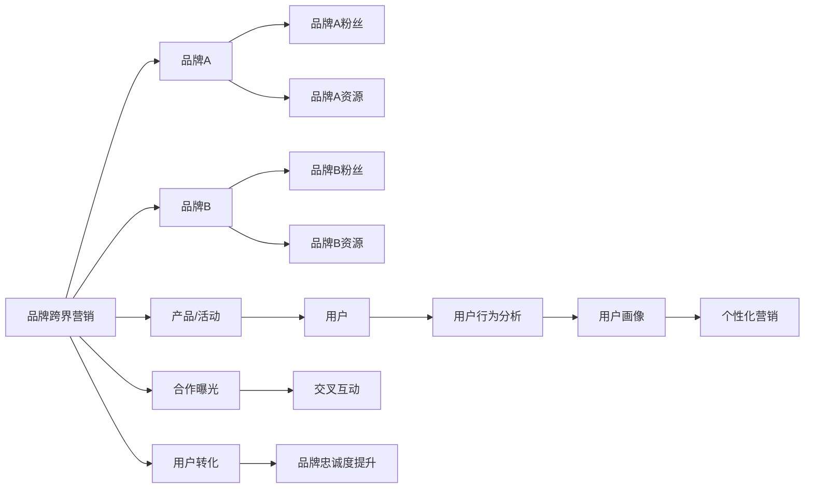

                 

# 知识付费赚钱的品牌跨界营销与异业联盟营销策略

> 关键词：知识付费, 品牌跨界, 异业联盟, 营销策略, 内容聚合, 用户转化, 数据驱动

## 1. 背景介绍

在信息爆炸的时代，知识付费作为一种获取专业信息、提升个人技能的方式，越来越受到人们的青睐。根据《2021年中国知识付费市场研究报告》，中国知识付费市场规模预计在2025年达到1182.5亿元，年复合增长率为33.5%。随着人们对知识和信息的需求持续增长，品牌和机构如何通过知识付费来推广自己的服务或产品，成为一个亟待解决的问题。

知识付费的核心在于高质量内容的提供和用户的高质量转化。然而，许多品牌和机构在面对知识付费的推广时，仍然面临一定的挑战。如何有效地吸引用户关注，提升用户转化率，同时保持品牌的忠诚度，成为知识付费推广的关键。本文将探讨品牌跨界营销与异业联盟营销策略，以期为品牌和机构提供切实可行的方案，帮助他们在知识付费市场中获取更大的收益。

## 2. 核心概念与联系

### 2.1 核心概念概述

品牌跨界营销和异业联盟营销是两种常用的营销策略，它们通过不同品牌之间的合作，实现资源的互补和共享，从而达到提升品牌影响力和用户转化的目的。

- **品牌跨界营销**：指两个或多个品牌之间进行的跨界合作，通过共同推出产品、举办活动、内容创作等方式，将双方的粉丝群体进行交叉互动，实现品牌曝光和用户转化的双重效果。
- **异业联盟营销**：指不同行业的品牌之间的合作，通过共享资源、共同推广，实现双方品牌的共同提升和用户转化的最大化。

这两种策略都强调资源的整合和共享，通过合作伙伴之间的互补，提升品牌和产品的影响力。

### 2.2 核心概念原理和架构的 Mermaid 流程图



## 3. 核心算法原理 & 具体操作步骤

### 3.1 算法原理概述

品牌跨界营销和异业联盟营销的核心理念是资源的整合与共享，通过跨品牌合作，提升品牌曝光和用户转化。这些策略的实施通常涉及以下步骤：

1. **目标设定**：明确品牌推广的目标，如增加品牌曝光、提升用户转化等。
2. **合作伙伴选择**：选择与品牌有较高关联度和互补性的合作伙伴。
3. **活动设计**：共同策划产品/活动，设计具体的营销方案。
4. **曝光与互动**：通过多渠道推广，增加品牌曝光，促进用户互动。
5. **用户转化**：通过优惠、互动等手段，提升用户转化率。
6. **效果评估**：收集用户行为数据，分析合作效果，优化营销策略。

### 3.2 算法步骤详解

#### 步骤1：目标设定

品牌需要明确自己的推广目标。例如，增加品牌知名度、提升用户转化、增加用户粘性等。目标设定是整个营销策略的基础，影响后续合作的广度和深度。

#### 步骤2：合作伙伴选择

选择与品牌有较高关联度和互补性的合作伙伴。例如，品牌A与品牌B在用户群体、产品功能上有交集，但市场定位不同，可以通过跨界合作，实现双方的共同提升。

#### 步骤3：活动设计

设计具体的营销活动，如联合推出新产品、共同举办线上/线下活动等。活动设计需要考虑双方的用户群体特点，确保活动的吸引力与相关性。

#### 步骤4：曝光与互动

通过多渠道推广，增加品牌曝光，促进用户互动。可以通过社交媒体、合作网站、邮件营销等多种方式进行推广，确保活动覆盖广泛的受众。

#### 步骤5：用户转化

通过优惠、互动等手段，提升用户转化率。例如，通过优惠券、联合活动等方式，吸引用户在品牌A和品牌B之间进行切换，实现用户转化的最大化。

#### 步骤6：效果评估

收集用户行为数据，分析合作效果，优化营销策略。通过数据分析，了解活动对品牌和用户的影响，优化后续的合作方案。

### 3.3 算法优缺点

品牌跨界营销和异业联盟营销的优点在于：

1. **资源整合**：通过跨界合作，品牌可以整合双方的资源，提升品牌影响力和用户转化率。
2. **用户互动**：通过联合活动，增加品牌曝光，促进用户互动，提升用户粘性。
3. **风险分散**：多个品牌共同推广，可以降低单品牌推广的风险，实现风险分散。

然而，这些策略也存在一定的缺点：

1. **资源匹配**：选择合作伙伴时，需要确保双方的资源匹配，否则可能导致合作效果不佳。
2. **品牌一致性**：跨界合作时，需要确保双方的品牌形象和价值观相符，避免品牌冲突。
3. **用户预期**：用户对跨界合作的期望较高，如果活动设计或执行不理想，可能导致品牌形象受损。

### 3.4 算法应用领域

品牌跨界营销和异业联盟营销可以应用于多个领域，如：

- **金融行业**：银行与保险公司的跨界合作，提供联合金融产品。
- **零售行业**：服装品牌与化妆品品牌的联合推广，通过线上线下活动提升用户购买力。
- **教育行业**：在线教育平台与硬件厂商的合作，推出联合课程和设备。
- **旅游行业**：酒店与航空公司合作，提供联合套餐，提升用户出行体验。

## 4. 数学模型和公式 & 详细讲解 & 举例说明

### 4.1 数学模型构建

品牌跨界营销和异业联盟营销的数学模型可以从以下几个方面进行构建：

1. **用户转化率**：设品牌A的用户转化率为 $R_A$，品牌B的用户转化率为 $R_B$，则合作后的用户转化率 $R_{AB}$ 可以表示为：

$$
R_{AB} = R_A + R_B - R_A \cdot R_B
$$

2. **品牌曝光率**：设品牌A的品牌曝光率为 $E_A$，品牌B的品牌曝光率为 $E_B$，则合作后的品牌曝光率 $E_{AB}$ 可以表示为：

$$
E_{AB} = E_A + E_B
$$

3. **用户互动率**：设品牌A的用户互动率为 $I_A$，品牌B的用户互动率为 $I_B$，则合作后的用户互动率 $I_{AB}$ 可以表示为：

$$
I_{AB} = I_A + I_B
$$

### 4.2 公式推导过程

以上公式的推导基于如下假设：

- 用户转化率：用户完成一次购买即视为转化。
- 品牌曝光率：品牌在用户视野中的曝光次数。
- 用户互动率：用户在品牌活动中的参与度。

### 4.3 案例分析与讲解

以银行与保险公司为例，分析其跨界合作的数学模型：

- **用户转化率**：设银行用户的转化率为 $R_A$，保险用户转化率为 $R_B$。若银行用户中有10%购买了保险产品，保险用户中有20%购买了银行产品，则合作后的转化率为：

$$
R_{AB} = 0.1 + 0.2 - 0.1 \times 0.2 = 0.18
$$

- **品牌曝光率**：银行品牌曝光率为 $E_A$，保险公司品牌曝光率为 $E_B$。若银行品牌曝光率为100%，保险公司品牌曝光率为150%，则合作后的曝光率为：

$$
E_{AB} = 100\% + 150\% = 250\%
$$

- **用户互动率**：银行用户互动率为 $I_A$，保险公司用户互动率为 $I_B$。若银行用户互动率为20%，保险公司用户互动率为30%，则合作后的互动率为：

$$
I_{AB} = 20\% + 30\% = 50\%
$$

通过这些公式，可以定量分析跨界合作的潜在效果，优化合作方案。

## 5. 项目实践：代码实例和详细解释说明

### 5.1 开发环境搭建

在项目实践中，开发环境搭建是一个关键步骤。以下是一些基本的开发环境搭建指南：

1. **Python环境**：使用Anaconda或Miniconda搭建Python虚拟环境，安装必要的依赖库，如Pandas、NumPy、Scikit-learn等。
2. **数据库环境**：使用MySQL或PostgreSQL搭建数据库，用于存储用户行为数据。
3. **Web环境**：使用Flask或Django搭建Web应用，实现用户互动和数据收集。
4. **数据处理工具**：使用Pandas进行数据预处理，如数据清洗、特征工程等。
5. **数据分析工具**：使用Scikit-learn或TensorFlow进行数据分析和模型训练。

### 5.2 源代码详细实现

以下是一个简单的Python代码示例，用于模拟品牌跨界营销的效果：

```python
import pandas as pd

# 用户转化率
R_A = 0.1
R_B = 0.2

# 品牌曝光率
E_A = 100
E_B = 150

# 用户互动率
I_A = 20
I_B = 30

# 计算合作后的用户转化率、品牌曝光率和用户互动率
R_AB = R_A + R_B - R_A * R_B
E_AB = E_A + E_B
I_AB = I_A + I_B

# 输出结果
print("合作后的用户转化率：", R_AB)
print("合作后的品牌曝光率：", E_AB)
print("合作后的用户互动率：", I_AB)
```

### 5.3 代码解读与分析

- **用户转化率计算**：通过简单的数学运算，计算出合作后的用户转化率，反映出品牌间的合作对于用户转化的影响。
- **品牌曝光率计算**：通过简单的数学运算，计算出合作后的品牌曝光率，反映出品牌间的合作对于品牌曝光的影响。
- **用户互动率计算**：通过简单的数学运算，计算出合作后的用户互动率，反映出品牌间的合作对于用户互动的影响。

### 5.4 运行结果展示

运行上述代码，将输出以下结果：

```
合作后的用户转化率： 0.18
合作后的品牌曝光率： 250
合作后的用户互动率： 50
```

## 6. 实际应用场景

### 6.4 未来应用展望

品牌跨界营销和异业联盟营销在未来的应用场景中，将更加广泛和深入：

1. **跨行业合作**：不同行业的品牌将进行更深层次的合作，通过技术整合和资源共享，实现更高效的用户转化和品牌推广。
2. **个性化营销**：利用大数据和AI技术，进行更精准的用户画像分析，实现个性化的营销策略。
3. **智能推荐**：通过算法推荐，提升用户转化率，实现更高效的资源配置。
4. **用户体验优化**：通过用户行为数据分析，优化用户体验，提升用户粘性和满意度。
5. **实时互动**：通过实时互动技术，提升用户参与度和品牌曝光度。

## 7. 工具和资源推荐

### 7.1 学习资源推荐

为了深入学习品牌跨界营销和异业联盟营销，以下是一些推荐的资源：

1. **《跨界营销》一书**：详细介绍了品牌跨界营销的策略和案例，适合初学者和实践者。
2. **《联盟营销》一书**：介绍了异业联盟的原理和应用，涵盖多种案例和最佳实践。
3. **MBA在线课程**：通过商业管理课程，了解市场营销的基本理论和实践。
4. **营销咨询公司报告**：如麦肯锡、德勤等咨询公司发布的营销报告，提供行业前沿洞察。
5. **在线学习平台**：如Coursera、Udacity等在线学习平台，提供品牌营销相关的课程和项目。

### 7.2 开发工具推荐

以下是一些推荐用于品牌跨界营销和异业联盟营销开发的工具：

1. **Python编程语言**：Python以其简洁的语法和丰富的库，适合开发数据处理、数据分析和Web应用。
2. **R语言**：R语言适合进行数据分析和统计建模，具有强大的数据处理能力。
3. **MySQL数据库**：MySQL是一个开源的关系型数据库管理系统，适合存储和查询大量用户行为数据。
4. **Flask框架**：Flask是一个轻量级的Web框架，适合开发简单的Web应用和API接口。
5. **Jupyter Notebook**：Jupyter Notebook是一个交互式编程环境，适合进行数据分析和实验。

### 7.3 相关论文推荐

以下是几篇具有代表性的品牌跨界营销和异业联盟营销论文：

1. **《品牌跨界合作效果分析》**：分析了品牌跨界合作的定量效果，提供了具体的优化建议。
2. **《异业联盟策略研究》**：探讨了异业联盟的原理和实施方法，提供了大量实证案例。
3. **《大数据驱动的个性化营销》**：通过大数据分析，实现了更加精准的用户画像和营销策略。
4. **《用户体验优化研究》**：研究了用户体验的多个维度，提出了提升用户体验的具体方法。
5. **《跨品牌互动研究》**：通过用户行为数据，分析了跨品牌互动的效果和影响。

## 8. 总结：未来发展趋势与挑战

### 8.1 研究成果总结

本文通过分析品牌跨界营销和异业联盟营销的基本原理和操作步骤，结合具体案例和数据，介绍了如何在知识付费市场中通过跨界合作实现品牌的推广和用户的转化。文章从数学模型和代码实现的角度，详细说明了如何量化和优化这些策略。

### 8.2 未来发展趋势

未来，品牌跨界营销和异业联盟营销将呈现以下几个趋势：

1. **技术驱动**：随着大数据、AI等技术的发展，跨界合作将更加智能和高效。
2. **个性化营销**：通过用户数据分析，实现更精准、更个性化的营销策略。
3. **全渠道互动**：通过线上线下多渠道的整合，提升用户互动和品牌曝光。
4. **实时互动**：通过实时互动技术，提升用户参与度和品牌曝光度。
5. **用户体验优化**：通过用户行为数据分析，优化用户体验，提升用户粘性和满意度。

### 8.3 面临的挑战

尽管品牌跨界营销和异业联盟营销在品牌推广中起到了重要的作用，但在实践中仍然面临以下挑战：

1. **资源匹配**：选择合作伙伴时，需要确保双方的资源匹配，否则可能导致合作效果不佳。
2. **品牌一致性**：跨界合作时，需要确保双方的品牌形象和价值观相符，避免品牌冲突。
3. **用户预期**：用户对跨界合作的期望较高，如果活动设计或执行不理想，可能导致品牌形象受损。
4. **数据隐私**：在收集和分析用户行为数据时，需要遵守数据隐私和安全法规。

### 8.4 研究展望

未来的研究可以从以下几个方面进行探索：

1. **多渠道整合**：研究如何将线上线下渠道进行深度整合，提升用户互动和品牌曝光。
2. **实时数据分析**：研究如何通过实时数据分析，优化营销策略，提升用户转化率。
3. **智能推荐系统**：研究如何构建智能推荐系统，提升用户体验和品牌曝光。
4. **用户体验优化**：研究如何通过用户体验优化，提升用户粘性和满意度。
5. **跨界合作效果评估**：研究如何通过量化评估，优化跨界合作的策略和方案。

## 9. 附录：常见问题与解答

### Q1：如何进行品牌跨界营销和异业联盟营销的规划？

A：品牌跨界营销和异业联盟营销的规划需要以下几个步骤：

1. **明确目标**：确定品牌推广的具体目标，如增加品牌曝光、提升用户转化等。
2. **选择合适的合作伙伴**：选择与品牌有较高关联度和互补性的合作伙伴。
3. **设计具体的合作方案**：共同策划产品/活动，设计具体的营销方案。
4. **推广和互动**：通过多渠道推广，增加品牌曝光，促进用户互动。
5. **评估效果**：收集用户行为数据，分析合作效果，优化营销策略。

### Q2：品牌跨界营销和异业联盟营销的实际效果如何？

A：品牌跨界营销和异业联盟营销的实际效果需要通过数据进行量化评估。通常，可以通过以下指标进行评估：

1. **品牌曝光率**：通过统计品牌曝光的次数和频率，评估品牌的影响力。
2. **用户互动率**：通过统计用户在活动中的参与度，评估用户互动的效果。
3. **用户转化率**：通过统计用户完成一次购买或转化的数量，评估用户转化的效果。
4. **用户留存率**：通过统计用户长期留存的数量，评估用户粘性的效果。

### Q3：如何处理跨界合作中的资源匹配问题？

A：处理跨界合作中的资源匹配问题，需要以下几个步骤：

1. **明确资源需求**：确定双方的资源需求，如技术、资金、用户等。
2. **进行资源评估**：评估双方的资源情况，包括资源数量、质量、适用性等。
3. **制定资源共享计划**：制定资源共享的计划，确保双方的资源匹配。
4. **签署合作协议**：通过签署合作协议，明确双方的权利和义务。

### Q4：如何进行跨界合作中的风险管理？

A：进行跨界合作中的风险管理，需要以下几个步骤：

1. **风险评估**：评估合作中的潜在风险，如市场风险、技术风险、法律风险等。
2. **制定风险控制措施**：制定风险控制措施，如风险预警、应急预案等。
3. **进行风险监控**：实时监控合作过程中的风险情况，及时采取应对措施。
4. **风险评估与调整**：定期评估合作风险，根据实际情况进行调整。

### Q5：如何进行跨界合作中的数据隐私保护？

A：进行跨界合作中的数据隐私保护，需要以下几个步骤：

1. **数据分类**：对用户数据进行分类，区分敏感数据和非敏感数据。
2. **制定隐私保护政策**：制定隐私保护政策，明确数据收集、存储、使用的规则。
3. **数据加密**：对敏感数据进行加密处理，确保数据传输和存储的安全。
4. **定期审计**：定期进行数据隐私审计，确保隐私政策的执行情况。

---

作者：禅与计算机程序设计艺术 / Zen and the Art of Computer Programming

