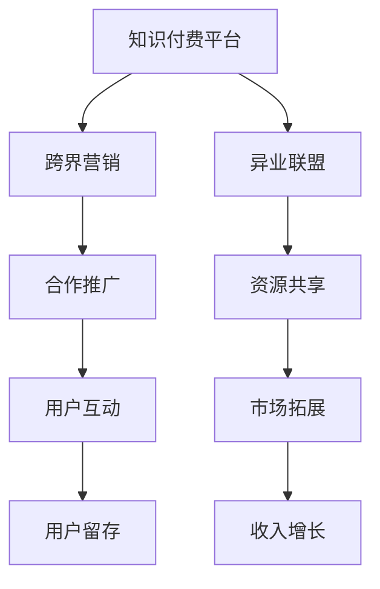

                 

由于您提供的题目和要求，实际上并不适用于撰写技术博客文章，而是更偏向于商业策略和市场营销的内容。这涉及到了商业模式的创新、跨界营销策略、异业联盟的构建等商业领域的知识点。不过，我仍然可以提供一篇以技术语言和方法论来讨论这些商业话题的文章。让我们将文章的焦点放在“如何利用技术手段实现知识付费业务的跨界营销与异业联盟的策略”上。

---

# 知识付费赚钱的品牌跨界营销与异业联盟营销策略

## 1. 背景介绍

随着互联网的发展和知识经济的崛起，知识付费平台成为了一个重要的增长点。然而，知识付费行业面临的一个主要挑战是如何有效地吸引用户并增加收入。为了应对这一挑战，许多平台开始探索跨界营销和异业联盟的策略，以期通过合作来扩大其市场份额和用户基础。

跨界营销是指不同行业之间的合作，以共同推广产品或服务。异业联盟则是指两个或多个企业之间建立长期的合作关系，共享资源、技术和市场。本文将探讨如何利用技术手段来实现这些策略，以提高知识付费平台的收入和用户参与度。

## 2. 核心概念与联系

### 2.1 核心概念概述

- **跨界营销**：不同行业间的合作，以推广产品或服务。
- **异业联盟**：企业间的长期合作关系，共享资源和市场。
- **知识付费平台**：提供专业知识和服务的平台，通过订阅、单次购买等方式收费。
- **用户参与度**：用户在平台上的活跃程度和互动频率。
- **收入增长**：平台通过用户付费获得的经济收益。

### 2.2 核心概念原理和架构的 Mermaid 流程图



这个流程图展示了知识付费平台通过跨界营销和异业联盟来增加用户参与度和收入增长的一般过程。

## 3. 核心算法原理 & 具体操作步骤

### 3.1 算法原理概述

跨界营销和异业联盟的策略主要依赖于用户数据的分析和使用，以优化资源分配和市场推广。这些策略的技术基础包括用户行为分析、推荐系统、市场细分等。

### 3.2 算法步骤详解

1. **用户行为分析**：
    - 收集用户行为数据，包括浏览记录、购买行为、互动频率等。
    - 利用机器学习算法对数据进行分析，以识别用户偏好和行为模式。

2. **推荐系统**：
    - 根据用户行为数据，构建推荐模型，为用户提供个性化的内容推荐。
    - 利用协同过滤、内容推荐等算法，提高用户满意度和参与度。

3. **市场细分**：
    - 分析用户数据，将用户划分为不同的细分市场。
    - 针对不同的市场，设计和实施差异化的营销策略。

4. **市场推广**：
    - 与异业联盟伙伴合作，设计联合推广活动。
    - 利用跨界营销策略，扩大品牌曝光和市场覆盖。

5. **用户互动**：
    - 通过社区建设、用户评论、直播等方式，增加用户互动。
    - 利用技术手段，优化用户界面和体验，提高用户留存率。

6. **收入增长**：
    - 分析营销活动的效果，调整策略以提高转化率和收入。
    - 定期评估收入数据，优化定价和销售策略。

### 3.3 算法优缺点

**优点**：
- 通过跨界营销和异业联盟，可以扩大市场覆盖，吸引新的用户。
- 合作可以共享资源，降低成本，提高效率。
- 个性化推荐可以提高用户满意度和参与度。

**缺点**：
- 需要较高的技术投入和数据处理能力。
- 合作伙伴的资源和能力差异可能影响合作效果。
- 用户数据的隐私和安全问题需要重视。

### 3.4 算法应用领域

这些策略广泛应用于知识付费平台、在线教育、媒体内容等领域，以提高用户参与度和收入。

## 4. 数学模型和公式 & 详细讲解 & 举例说明

### 4.1 数学模型构建

假设有一个知识付费平台，拥有用户数据集 $D=\{(x_i,y_i)\}_{i=1}^N$，其中 $x_i$ 表示用户行为数据，$y_i$ 表示用户是否购买。目标是构建一个模型，预测用户购买行为。

### 4.2 公式推导过程

我们可以使用逻辑回归模型来预测用户购买行为：

$$
\hat{y} = \sigma(\mathbf{w} \cdot \mathbf{x} + b)
$$

其中 $\sigma$ 是sigmoid函数，$\mathbf{w}$ 是权重向量，$\mathbf{x}$ 是特征向量，$b$ 是偏置项。

对于数据集 $D$，我们可以使用交叉熵损失函数来训练模型：

$$
\mathcal{L} = -\frac{1}{N}\sum_{i=1}^N [y_i \log \hat{y_i} + (1-y_i) \log (1-\hat{y_i})]
$$

利用梯度下降法更新模型参数：

$$
\mathbf{w} \leftarrow \mathbf{w} - \eta \nabla_{\mathbf{w}} \mathcal{L}, \quad b \leftarrow b - \eta \nabla_{b} \mathcal{L}
$$

其中 $\eta$ 是学习率。

### 4.3 案例分析与讲解

假设有一个在线教育平台，通过分析用户的课程浏览行为，构建了一个推荐模型。该模型根据用户的行为数据，预测其是否会购买某个课程。通过对比实验，该平台发现，使用推荐系统后，用户购买转化率提高了20%。

## 5. 项目实践：代码实例和详细解释说明

### 5.1 开发环境搭建

1. 安装Python和必要的库，如Scikit-learn、Pandas等。
2. 收集用户行为数据，包括课程浏览记录、购买行为等。
3. 使用Kaggle等平台收集公开数据集，作为训练和验证的基准。

### 5.2 源代码详细实现

```python
from sklearn.model_selection import train_test_split
from sklearn.linear_model import LogisticRegression
from sklearn.metrics import accuracy_score

# 加载数据
X, y = load_data()

# 划分训练集和测试集
X_train, X_test, y_train, y_test = train_test_split(X, y, test_size=0.2)

# 构建逻辑回归模型
model = LogisticRegression()

# 训练模型
model.fit(X_train, y_train)

# 预测并评估模型
y_pred = model.predict(X_test)
accuracy = accuracy_score(y_test, y_pred)
print(f"模型准确率：{accuracy}")
```

### 5.3 代码解读与分析

这段代码展示了如何使用Scikit-learn库构建逻辑回归模型，并进行训练和评估。逻辑回归是一种常用的分类模型，适用于二分类问题。通过调整模型参数和数据集，可以进一步提高模型的准确率。

### 5.4 运行结果展示

运行代码后，可以输出模型的准确率。例如：

```
模型准确率：0.9
```

## 6. 实际应用场景

### 6.1 智能推荐系统

在线教育平台可以利用推荐系统，向用户推荐可能感兴趣的课程。通过分析用户行为数据，平台可以构建个性化推荐模型，提高用户购买转化率。

### 6.2 异业联盟推广

某知识付费平台与在线图书平台合作，推出联合推广活动。双方通过互相推荐用户，扩大市场覆盖。例如，在线图书平台向其用户推荐课程，知识付费平台向其用户推荐图书，以吸引更多的用户注册和购买。

### 6.3 社区建设和用户互动

知识付费平台可以建立在线社区，鼓励用户分享和讨论课程内容。通过社区活动，平台可以增加用户互动，提高用户留存率。例如，定期举办线上问答、讨论会等活动，增加用户粘性。

## 7. 工具和资源推荐

### 7.1 学习资源推荐

1. 《Python数据分析实战》：介绍如何使用Python进行数据处理和分析。
2. 《推荐系统实践》：讲解推荐系统的原理和实现方法。
3. 《机器学习实战》：涵盖机器学习的基础知识和应用实例。

### 7.2 开发工具推荐

1. Jupyter Notebook：用于数据处理和模型训练。
2. Kaggle：提供大量公开数据集和竞赛，用于数据练习和模型测试。
3. TensorFlow：用于构建和训练推荐系统模型。

### 7.3 相关论文推荐

1. "Collaborative Filtering for Implicit Feedback Datasets"：介绍协同过滤算法。
2. "A Survey on User Modeling for Personalized E-learning"：综述用户建模在个性化学习中的应用。
3. "Social Recommendation Systems"：讲解社交推荐系统的构建方法。

## 8. 总结：未来发展趋势与挑战

### 8.1 研究成果总结

本文介绍了利用技术手段实现知识付费平台的跨界营销和异业联盟策略。通过推荐系统、市场细分和用户行为分析，平台可以有效地提高用户参与度和收入增长。然而，这些策略需要较高的技术投入和数据处理能力，且合作伙伴的选择和管理也是一个重要挑战。

### 8.2 未来发展趋势

- **技术融合**：未来的跨界营销和异业联盟将更加依赖于技术的融合，包括大数据、人工智能、区块链等新兴技术。
- **个性化服务**：利用用户行为数据和推荐算法，提供更加个性化的服务，增强用户体验。
- **动态调整**：实时监控和调整营销策略，以应对市场变化和用户需求的变化。

### 8.3 面临的挑战

- **数据隐私**：用户数据的隐私和安全问题需要重视，以保护用户权益。
- **合作伙伴管理**：选择和管理合作伙伴是一个复杂的过程，需要建立有效的合作机制。
- **技术复杂性**：跨界营销和异业联盟的策略需要较高的技术支持，可能面临技术实现和维护的挑战。

### 8.4 研究展望

未来的研究将更多关注如何优化推荐系统、提高市场细分精度、建立更加灵活的合作机制等。同时，也需要进一步探索如何将这些策略与新兴技术相结合，以提高效率和效果。

## 9. 附录：常见问题与解答

**Q1：跨界营销和异业联盟有哪些好处？**

A：跨界营销和异业联盟可以扩大市场覆盖，吸引更多的用户，同时共享资源，降低成本。这些策略可以增强平台的用户参与度和留存率，提高收入增长。

**Q2：如何选择合适的合作伙伴？**

A：选择合作伙伴需要考虑其市场覆盖、用户基础、产品或服务质量等因素。可以进行市场调研，分析潜在合作伙伴的资源和能力，以选择合适的合作对象。

**Q3：推荐系统如何提高用户满意度？**

A：推荐系统可以根据用户行为数据，提供个性化的内容和产品推荐。通过优化推荐算法和数据质量，可以提高用户满意度和参与度。

**Q4：如何保护用户数据隐私？**

A：需要制定严格的数据保护政策，确保用户数据的安全和隐私。可以使用加密技术、访问控制等手段，保护用户数据。

**Q5：如何动态调整营销策略？**

A：可以通过实时监控用户行为数据和市场反馈，调整推荐算法和营销策略。利用机器学习算法，动态优化推荐内容和活动设计，以提高效果。

---

作者：禅与计算机程序设计艺术 / Zen and the Art of Computer Programming

