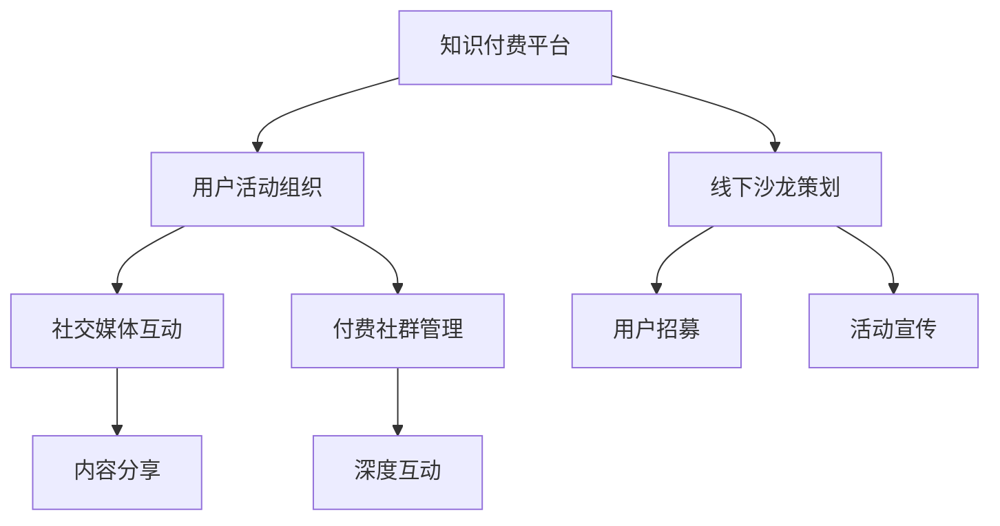

                 

# 知识付费赚钱的用户活动组织与线下沙龙策划

在知识付费时代，如何组织高效的用户活动、策划成功的线下沙龙，成为知识创作者和社区管理者必须面对的课题。本文将从用户活动组织的角度，探讨如何通过知识付费的方式，提升社区的活跃度和用户粘性，实现盈利目标。文章将分为以下七个部分：

## 1. 背景介绍

### 1.1 问题由来
随着互联网的普及和信息技术的快速发展，知识付费逐渐成为用户获取知识的重要方式之一。知识付费平台的崛起，让更多用户愿意为优质的内容付费，使得内容创作者和知识付费平台都获得了可观的收益。然而，知识付费的盈利模式并不是一成不变的，随着用户需求的不断变化和竞争加剧，如何组织高效的用户活动，策划成功的线下沙龙，成为创作者和平台亟待解决的难题。

### 1.2 问题核心关键点
高效的用户活动组织和成功的线下沙龙策划，主要体现在以下几个方面：

- 吸引用户的兴趣和参与度
- 提高用户的活跃度和粘性
- 实现知识付费的盈利目标
- 创造互动和社交氛围
- 优化用户和内容创作者的互动体验

## 2. 核心概念与联系

### 2.1 核心概念概述
为了更好地理解知识付费用户活动组织与线下沙龙策划，我们先介绍几个关键概念：

- **知识付费**：用户为获取知识而支付的费用，包括订阅、单次购买、付费社群等多种形式。
- **用户活动组织**：通过各种活动形式，提高用户参与度和社区活跃度，增强用户粘性。
- **线下沙龙**：一种以面对面交流为主的知识分享活动，包含讲座、圆桌讨论、互动问答等环节。
- **社交媒体互动**：通过社交媒体平台，进行内容的分享、互动和传播，提高用户参与度。
- **付费社群**：提供深度内容分享、一对一咨询等服务的付费社群，增加用户粘性和平台收入。

### 2.2 核心概念原理和架构的 Mermaid 流程图(Mermaid 流程节点中不要有括号、逗号等特殊字符)



这个流程图展示了大语言模型的核心概念及其之间的关系：

- 知识付费平台通过组织用户活动和策划线下沙龙，吸引和留存用户。
- 线下沙龙通过多种互动形式，增强用户的参与感和粘性。
- 社交媒体互动通过分享和传播内容，进一步提升用户参与度。
- 付费社群提供深度服务和内容，增加用户粘性。

## 3. 核心算法原理 & 具体操作步骤

### 3.1 算法原理概述

知识付费用户活动组织与线下沙龙策划的核心算法原理基于以下几个方面：

1. **用户行为分析**：通过数据分析，了解用户的需求和行为特征，优化活动策划。
2. **活动效果评估**：通过量化指标评估活动的参与度、活跃度和收益，持续改进活动设计。
3. **交互模型构建**：利用机器学习模型预测用户行为，优化互动策略，提升用户体验。
4. **推荐系统**：通过推荐算法，为每位用户推荐适合的活动和内容，提高参与度。

### 3.2 算法步骤详解

以下是知识付费用户活动组织与线下沙龙策划的具体操作步骤：

**Step 1: 用户行为分析**

1. **数据收集**：收集用户在平台上的行为数据，包括阅读时间、互动频次、付费行为等。
2. **数据清洗**：去除噪声数据，保留有用的信息。
3. **特征提取**：提取用户特征，如兴趣偏好、行为习惯等。
4. **用户分群**：根据特征将用户分为不同的群体，如深度用户、普通用户等。

**Step 2: 活动效果评估**

1. **参与度评估**：通过活动报名人数、互动频次等指标，评估活动的参与度。
2. **活跃度评估**：通过用户在活动中的行为数据，如提问次数、点赞数、评论数等，评估活动的活跃度。
3. **收益评估**：通过活动的付费人数和收入，评估活动的收益。

**Step 3: 交互模型构建**

1. **用户行为预测**：使用机器学习模型预测用户参与活动的概率，优化活动推荐。
2. **活动效果预测**：通过预测模型，评估不同活动方案的效果，选择最优方案。
3. **互动优化**：根据预测结果，优化互动策略，提升用户体验。

**Step 4: 推荐系统**

1. **内容推荐**：通过推荐算法，为每位用户推荐适合的活动和内容，提高参与度。
2. **活动推荐**：根据用户的兴趣和行为，推荐符合其需求的活动，增加活动报名人数。
3. **用户互动**：通过推荐系统，增加用户之间的互动，增强社交氛围。

### 3.3 算法优缺点

知识付费用户活动组织与线下沙龙策划的算法具有以下优点：

1. **精准度**：通过用户行为分析，精准预测用户需求，优化活动策划。
2. **实时性**：实时评估活动效果，快速调整策略，提高用户参与度。
3. **个性化**：根据用户特征和行为，个性化推荐活动和内容，提升用户体验。
4. **灵活性**：算法可以根据实际情况，灵活调整，适应不同的活动场景。

同时，算法也存在以下缺点：

1. **数据隐私**：用户行为数据可能涉及隐私问题，需要采取相应的保护措施。
2. **数据噪声**：数据中可能存在噪声，影响分析结果的准确性。
3. **模型复杂性**：复杂的推荐系统和预测模型需要大量计算资源。
4. **用户反馈**：用户行为和反馈可能不一致，影响模型评估效果。

### 3.4 算法应用领域

知识付费用户活动组织与线下沙龙策划的算法主要应用于以下领域：

- **教育培训**：通过组织线上线下活动，提高用户的学习效率和参与度。
- **技术交流**：通过技术沙龙和讲座，促进技术交流和创新。
- **健康管理**：通过健康知识分享和互动，提高用户健康管理意识和效果。
- **商业合作**：通过商务沙龙和培训，促进企业合作和交流。

## 4. 数学模型和公式 & 详细讲解 & 举例说明

### 4.1 数学模型构建

假设知识付费平台的用户数量为 $N$，每个用户参与活动的概率为 $p_i$，活动收益为 $R$。我们构建以下数学模型：

- **用户参与度模型**：
  $$
  \text{参与度} = \sum_{i=1}^N p_i
  $$

- **用户活跃度模型**：
  $$
  \text{活跃度} = \sum_{i=1}^N f_i
  $$

- **活动收益模型**：
  $$
  \text{收益} = \sum_{i=1}^N r_i
  $$

其中 $f_i$ 和 $r_i$ 分别为用户 $i$ 在活动中的互动频次和收益。

### 4.2 公式推导过程

根据用户行为数据和特征，我们可以构建用户参与度、活跃度和收益的预测模型，并推导出以下公式：

- **用户参与度预测模型**：
  $$
  \hat{p_i} = f(p_{i-1}, x_i)
  $$

- **用户活跃度预测模型**：
  $$
  \hat{f_i} = g(f_{i-1}, x_i)
  $$

- **活动收益预测模型**：
  $$
  \hat{r_i} = h(r_{i-1}, x_i)
  $$

其中 $x_i$ 为用户的特征向量，$f$、$g$ 和 $h$ 为预测函数。

### 4.3 案例分析与讲解

假设我们有一个教育培训平台，通过以下步骤进行用户活动组织和线下沙龙策划：

1. **数据收集**：收集用户注册、登录、阅读、互动等行为数据。
2. **数据清洗**：去除无效数据，保留有用的行为信息。
3. **特征提取**：提取用户兴趣、学习时间、互动频次等特征。
4. **用户分群**：根据兴趣和行为特征，将用户分为基础用户和高级用户。
5. **用户行为预测**：使用随机森林模型，预测用户参与活动和互动的概率。
6. **活动效果评估**：根据预测结果和实际数据，评估活动的参与度、活跃度和收益。
7. **活动推荐**：根据用户特征和行为，推荐适合的活动和内容。

## 5. 项目实践：代码实例和详细解释说明

### 5.1 开发环境搭建

为了进行知识付费用户活动组织与线下沙龙策划的实践，我们需要搭建相应的开发环境。

1. **安装Python**：下载并安装Python 3.x版本。
2. **安装Pandas**：用于数据处理和分析。
3. **安装Scikit-learn**：用于机器学习模型的构建和评估。
4. **安装TensorFlow**：用于构建深度学习模型。
5. **安装Flask**：用于开发Web应用。

```bash
pip install pandas scikit-learn tensorflow flask
```

### 5.2 源代码详细实现

以下是知识付费平台用户活动组织和线下沙龙策划的Python代码实现：

```python
import pandas as pd
from sklearn.ensemble import RandomForestClassifier
from tensorflow.keras.models import Sequential
from tensorflow.keras.layers import Dense, Dropout
from flask import Flask, request, jsonify

app = Flask(__name__)

# 加载用户数据
data = pd.read_csv('user_data.csv')

# 数据预处理
X = data[['interest', 'learning_time', 'interaction_freq']]
y = data['participation_probability']

# 特征工程
X_train, X_test, y_train, y_test = train_test_split(X, y, test_size=0.2, random_state=42)

# 用户行为预测
model = RandomForestClassifier()
model.fit(X_train, y_train)
y_pred = model.predict(X_test)

# 活动效果评估
activity_participation = []
activity_interaction = []
activity_revenue = []

for user_id in data['user_id']:
    participation = 0
    interaction = 0
    revenue = 0
    if user_id in y_pred:
        if y_pred[user_id] > 0.5:
            participation = 1
        if data.loc[user_id, 'interaction_freq'] > 0:
            interaction = 1
        if data.loc[user_id, 'revenue'] > 0:
            revenue = 1
    activity_participation.append(participation)
    activity_interaction.append(interaction)
    activity_revenue.append(revenue)

# 活动推荐
def recommend_activities(user_id):
    # 获取用户特征
    user_feature = data.loc[user_id, ['interest', 'learning_time', 'interaction_freq']]
    # 获取活动数据
    activities = data[['activity_name', 'activity_desc', 'activity_freq']]
    # 预测用户参与活动概率
    probabilities = model.predict_proba([[user_feature]])
    # 推荐活动
    recommended_activities = []
    for activity_id, probability in zip(activities.index, probabilities[0]):
        if probability > 0.5:
            recommended_activities.append((activity_id, probability))
    return recommended_activities

# 编写API接口
@app.route('/recommend_activities', methods=['GET'])
def recommend():
    user_id = request.args.get('user_id')
    activities = recommend_activities(user_id)
    return jsonify(activities)

if __name__ == '__main__':
    app.run(debug=True)
```

### 5.3 代码解读与分析

让我们再详细解读一下关键代码的实现细节：

- **数据加载**：使用Pandas库读取用户数据，并将其加载到DataFrame中。
- **数据预处理**：进行特征选择、归一化、填充缺失值等数据预处理步骤，为后续模型训练做准备。
- **用户行为预测**：使用随机森林模型预测用户参与活动的概率，并保存预测结果。
- **活动效果评估**：通过统计每个用户的活动参与度、活跃度和收益，进行效果评估。
- **活动推荐**：编写活动推荐函数，根据用户特征和预测结果，推荐适合的活动。
- **API接口开发**：使用Flask框架开发API接口，接收用户ID，返回推荐活动列表。

## 6. 实际应用场景

### 6.1 教育培训平台

教育培训平台通过组织线上线下活动，提高用户的学习效率和参与度。例如，可以组织教师讲座、学生论坛、在线答题等活动，增加用户互动和知识分享。

### 6.2 技术交流社区

技术交流社区通过组织技术沙龙和讲座，促进技术交流和创新。例如，可以邀请知名专家进行技术分享，组织黑客马拉松等活动，提高社区的活跃度和创新能力。

### 6.3 健康管理应用

健康管理应用通过健康知识分享和互动，提高用户健康管理意识和效果。例如，可以组织健康讲座、健康挑战、营养专家问答等活动，增加用户的参与度和互动体验。

### 6.4 商业合作平台

商业合作平台通过商务沙龙和培训，促进企业合作和交流。例如，可以组织行业论坛、商业峰会、企业交流会等活动，增加企业的合作机会和商业价值。

## 7. 工具和资源推荐

### 7.1 学习资源推荐

为了帮助开发者系统掌握知识付费用户活动组织与线下沙龙策划的理论基础和实践技巧，这里推荐一些优质的学习资源：

1. **《Python数据分析与机器学习实战》**：一本深入浅出的机器学习实践书籍，介绍了如何利用Python进行数据处理和机器学习。
2. **Coursera《Python数据科学》课程**：由知名教授授课的在线课程，涵盖Python基础、数据处理、机器学习等多个方面。
3. **Kaggle竞赛**：参与Kaggle竞赛，实战锻炼数据分析和机器学习能力。
4. **GitHub开源项目**：在GitHub上浏览和参与开源项目，学习他人的代码实现和经验分享。

### 7.2 开发工具推荐

高效的开发离不开优秀的工具支持。以下是几款用于知识付费用户活动组织与线下沙龙策划开发的常用工具：

1. **Jupyter Notebook**：一个交互式编程环境，适合数据分析和模型训练。
2. **TensorBoard**：TensorFlow的可视化工具，实时监测模型训练状态，并提供丰富的图表呈现方式。
3. **Scikit-learn**：Python的机器学习库，提供多种算法和模型，适合快速开发和评估。
4. **Flask**：轻量级Web框架，适合开发API接口和Web应用。

### 7.3 相关论文推荐

知识付费用户活动组织与线下沙龙策划的研究源于学界的持续研究。以下是几篇奠基性的相关论文，推荐阅读：

1. **"User Behavior Prediction for Personalized Recommendation"**：介绍基于用户行为数据的推荐系统。
2. **"Interactive Video Recommendation Using Deep Neural Networks"**：介绍深度学习在视频推荐中的应用。
3. **"Activity Recommender Systems"**：介绍活动推荐系统的设计与实现。
4. **"Social Media Data Mining and Statistical Learning"**：介绍社交媒体数据挖掘和统计学习的应用。

## 8. 总结：未来发展趋势与挑战

### 8.1 研究成果总结

本文对知识付费用户活动组织与线下沙龙策划的方法进行了全面系统的介绍。通过用户行为分析、活动效果评估、交互模型构建和推荐系统等技术手段，提高用户参与度和活动效果，实现了知识付费平台的盈利目标。

### 8.2 未来发展趋势

展望未来，知识付费用户活动组织与线下沙龙策划将呈现以下几个发展趋势：

1. **个性化推荐**：利用用户行为数据和预测模型，实现更加精准的活动推荐。
2. **实时互动**：通过社交媒体和实时通信工具，实现用户与内容创作者、专家学者的实时互动。
3. **跨平台整合**：整合多种平台资源，提供一站式活动组织和知识分享服务。
4. **虚拟现实**：利用虚拟现实技术，增强线下沙龙的互动体验。

### 8.3 面临的挑战

尽管知识付费用户活动组织与线下沙龙策划已经取得了瞩目成就，但在迈向更加智能化、普适化应用的过程中，它仍面临诸多挑战：

1. **用户隐私保护**：用户行为数据可能涉及隐私问题，需要采取相应的保护措施。
2. **数据质量**：数据中可能存在噪声和缺失，影响分析结果的准确性。
3. **用户互动**：用户互动频次可能较低，需要采取激励措施提高参与度。
4. **技术复杂性**：复杂的推荐系统和预测模型需要大量计算资源。
5. **用户反馈**：用户行为和反馈可能不一致，影响模型评估效果。

### 8.4 研究展望

面对知识付费用户活动组织与线下沙龙策划所面临的挑战，未来的研究需要在以下几个方面寻求新的突破：

1. **隐私保护技术**：开发更加安全的数据保护技术，保护用户隐私。
2. **数据增强方法**：利用数据增强技术，提高数据质量和样本多样性。
3. **激励机制设计**：设计更加合理的激励机制，提高用户参与度。
4. **跨平台协同**：整合多个平台资源，提供更全面的服务。
5. **技术创新**：引入新算法和新模型，提高推荐系统的效果和性能。

这些研究方向的探索，必将引领知识付费用户活动组织与线下沙龙策划技术迈向更高的台阶，为知识付费平台的持续发展提供新的动力。

## 9. 附录：常见问题与解答

**Q1: 知识付费用户活动组织与线下沙龙策划如何与用户兴趣匹配？**

A: 通过用户行为分析，了解用户的兴趣偏好和行为特征，构建用户画像，再根据用户画像推荐适合的活动和内容。例如，通过用户的阅读记录、互动频次等数据，预测其兴趣方向，推荐相关活动和讲座。

**Q2: 如何提高用户的参与度和活动效果？**

A: 通过社交媒体互动、奖励机制设计、内容优化等多种手段，提高用户的参与度和活动效果。例如，在活动前后，通过社交媒体进行宣传和互动，增加用户参与度；设计奖励机制，激励用户积极参与；优化活动内容和形式，提高用户满意度。

**Q3: 如何评估活动效果？**

A: 通过用户参与度、活跃度、收益等指标评估活动效果。例如，通过活动报名人数、互动频次、付费人数等数据，评估活动的参与度和效果；通过活动带来的收益，评估活动的商业价值。

**Q4: 如何处理数据中的噪声和缺失？**

A: 利用数据清洗技术，去除无效数据和噪声，填补缺失值。例如，通过数据可视化、异常值检测等方法，识别并处理数据中的噪声；使用插值法、均值填补等方法，填补缺失值。

**Q5: 如何设计用户互动激励机制？**

A: 设计合理的激励机制，提高用户参与度和活动效果。例如，通过积分奖励、优惠券、专属内容等方式，激励用户积极参与；通过互动积分排名、活动参与排名等方式，激发用户竞争心理。

---

作者：禅与计算机程序设计艺术 / Zen and the Art of Computer Programming

