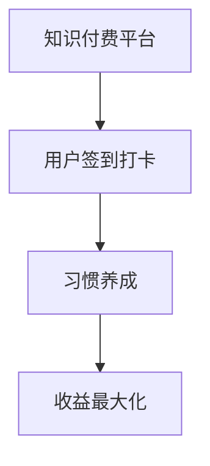

                 

# 知识付费赚钱的用户签到打卡与习惯养成策略

> 关键词：知识付费, 用户签到, 打卡, 习惯养成, 转化率, 收益最大化

## 1. 背景介绍

在知识付费的时代，越来越多的用户开始追求通过学习提升自己的技能和收入。然而，由于时间和精力的限制，保持持续的学习行为对许多用户来说是个挑战。为此，知识付费平台通过用户签到打卡、习惯养成等方式激励用户持续学习，并通过有效的策略提升平台收益。

### 1.1 问题由来

随着知识付费市场的成熟，各大平台之间的竞争日趋激烈。用户获取的资源越来越丰富，平台之间的差异化服务成为竞争的关键。如何吸引用户注册、留存，并提高用户活跃度和消费行为，成为平台关注的焦点。

### 1.2 问题核心关键点

为了解决上述问题，平台采用多种方式激励用户注册、留存并提升用户活跃度，其中用户签到打卡和习惯养成策略尤为有效。通过这些策略，平台可以不断增加用户粘性，并促使用户进行消费，从而实现收益最大化。

## 2. 核心概念与联系

### 2.1 核心概念概述

为了更好地理解用户签到打卡与习惯养成策略，本节将介绍几个密切相关的核心概念：

- **知识付费平台**：提供各类学习资源的在线平台，用户通过付费获取内容。
- **用户签到打卡**：用户每天通过指定平台进行签到，以获得奖励，如积分、课程优惠等。
- **习惯养成**：通过设定连续学习天数、每日学习时长等目标，奖励用户，帮助其养成良好的学习习惯。
- **收益最大化**：平台通过有效策略提升用户活跃度和消费行为，从而实现收益的最大化。

这些核心概念之间的逻辑关系可以通过以下Mermaid流程图来展示：



这个流程图展示了几大核心概念及其之间的关系：

1. 知识付费平台通过用户签到打卡和习惯养成策略吸引用户。
2. 签到打卡和习惯养成帮助用户建立持续学习的习惯。
3. 长期保持习惯的用户最终会进行消费，从而实现平台收益最大化。

## 3. 核心算法原理 & 具体操作步骤
### 3.1 算法原理概述

用户签到打卡与习惯养成策略的本质是一种行为经济学中的行为设计（Behavioral Design），旨在通过用户行为引导提升平台收益。

### 3.2 算法步骤详解

#### 3.2.1 用户注册和引导

平台首先通过免费的入门课程、试用期、优惠券等方式吸引用户注册。在用户注册后，平台通过欢迎页面、推荐课程等引导用户进行首次学习。

#### 3.2.2 用户签到打卡

平台设计用户每天登录平台进行签到打卡，并在第一次打卡时设置任务完成提示，告知用户签到打卡可以获得积分、课程优惠券等奖励。

#### 3.2.3 习惯养成

平台设定连续学习的天数或每天学习时长，如连续打卡30天可以免费解锁一门高级课程。同时，平台根据用户的学习行为提供反馈，如每日学习时长排行榜、积分排名等，激励用户持续学习。

#### 3.2.4 积分与奖励机制

平台建立积分与奖励机制，如签到打卡奖励积分，积分可以兑换课程优惠券、免费课程等。积分的多少与学习行为的频率和深度有关。

#### 3.2.5 数据追踪与分析

平台利用大数据技术，追踪用户的学习行为，如登录次数、学习时长、消费金额等，进行行为分析，优化策略。

### 3.3 算法优缺点

用户签到打卡与习惯养成策略的优势在于：

1. **提升用户活跃度**：通过奖励机制，用户每天登录进行学习，保持活跃度。
2. **养成良好习惯**：设定学习目标，帮助用户形成良好的学习习惯，提高学习效率。
3. **促成消费行为**：积分奖励和免费课程激励，促使用户最终进行付费消费，提升平台收益。

同时，该策略的缺点在于：

1. **用户依赖积分**：如果积分奖励设置不当，可能导致用户为了积分而学习，而非知识本身。
2. **积分稀释风险**：过多的积分可能导致积分贬值，降低积分的激励效果。
3. **过度营销**：过度强调积分奖励，可能使部分用户产生抵触情绪。

### 3.4 算法应用领域

用户签到打卡与习惯养成策略已经广泛应用于各类知识付费平台，如得到、知乎、网易云课堂等，帮助平台提升用户活跃度和转化率。在教育、金融、健身等多个领域，也有应用该策略成功提升用户行为的案例。

## 4. 数学模型和公式 & 详细讲解 & 举例说明

### 4.1 数学模型构建

为了衡量用户签到打卡与习惯养成策略的效果，可以构建以下数学模型：

1. **用户活跃度模型**：
   \[
   U = \sum_{i=1}^n A_i \times D_i \times R_i
   \]
   其中，$U$为用户活跃度，$A_i$为第$i$天用户登录次数，$D_i$为第$i$天用户学习时长，$R_i$为第$i$天用户积分排名。

2. **用户转化率模型**：
   \[
   C = \frac{T}{U \times L}
   \]
   其中，$C$为用户转化率，$T$为付费用户数量，$L$为总用户数量。

### 4.2 公式推导过程

1. **用户活跃度模型推导**：
   \[
   U = \sum_{i=1}^n A_i \times D_i \times R_i
   \]
   该公式综合了用户登录次数、学习时长和积分排名三个因素，用于衡量用户活跃度。

2. **用户转化率模型推导**：
   \[
   C = \frac{T}{U \times L}
   \]
   该公式通过付费用户数量、总用户数量和用户活跃度，计算出用户转化率。

### 4.3 案例分析与讲解

以知乎为例，分析用户签到打卡与习惯养成策略的效果：

- **用户活跃度分析**：知乎通过每天登录奖励积分，设定连续打卡14天可解锁会员特权，通过积分排行榜、话题关注、文章点赞等方式，激励用户进行深度学习，提升用户活跃度。
- **用户转化率分析**：知乎通过新用户引导课程、免费试用期、会员专属课程等策略，提升新用户注册后首次消费的概率，提高用户转化率。

## 5. 项目实践：代码实例和详细解释说明
### 5.1 开发环境搭建

为了进行用户签到打卡与习惯养成策略的开发，我们需要准备以下开发环境：

1. 安装Python 3.x版本，建议使用Anaconda。
2. 安装Flask框架，用于构建Web服务。
3. 安装Redis数据库，用于存储用户积分、打卡记录等数据。
4. 安装SQLite数据库，用于存储用户注册信息、课程信息等。

完成上述步骤后，即可在Python环境中进行开发。

### 5.2 源代码详细实现

以下是使用Python和Flask框架实现用户签到打卡与习惯养成策略的代码实现：

```python
from flask import Flask, request, jsonify
from flask_sqlalchemy import SQLAlchemy
from flask_redis import Redis
from datetime import datetime

app = Flask(__name__)
app.config['SQLALCHEMY_DATABASE_URI'] = 'sqlite:///example.db'
app.config['REDIS_URL'] = 'redis://localhost:6379/0'

db = SQLAlchemy(app)
redis = Redis(app)

class User(db.Model):
    id = db.Column(db.Integer, primary_key=True)
    name = db.Column(db.String(50))
    email = db.Column(db.String(50))
    daily_signin_count = db.Column(db.Integer, default=0)
    weekly_signin_count = db.Column(db.Integer, default=0)
    monthly_signin_count = db.Column(db.Integer, default=0)
    daily_study_time = db.Column(db.Integer, default=0)

class UserRedis(db.Model):
    id = db.Column(db.Integer, primary_key=True)
    name = db.Column(db.String(50))
    email = db.Column(db.String(50))
    daily_signin_count = db.Column(db.Integer, default=0)
    weekly_signin_count = db.Column(db.Integer, default=0)
    monthly_signin_count = db.Column(db.Integer, default=0)
    daily_study_time = db.Column(db.Integer, default=0)

@app.route('/login', methods=['POST'])
def login():
    data = request.get_json()
    user = User.query.filter_by(email=data['email']).first()
    if user:
        user.daily_signin_count += 1
        user.daily_study_time += 30
        redis.set(user.id, user.daily_signin_count)
        redis.set(user.id, user.daily_study_time)
        return jsonify({'message': 'Login successful'})
    else:
        return jsonify({'message': 'User not found'})

@app.route('/signin', methods=['POST'])
def signin():
    data = request.get_json()
    user = UserRedis.query.filter_by(email=data['email']).first()
    if user:
        user.daily_signin_count += 1
        user.daily_study_time += 30
        redis.set(user.id, user.daily_signin_count)
        redis.set(user.id, user.daily_study_time)
        return jsonify({'message': 'Signin successful'})
    else:
        return jsonify({'message': 'User not found'})

@app.route('/check_signin', methods=['GET'])
def check_signin():
    user_id = request.args.get('user_id')
    daily_signin_count = redis.get(user_id)
    daily_study_time = redis.get(user_id)
    return jsonify({'daily_signin_count': daily_signin_count, 'daily_study_time': daily_study_time})

if __name__ == '__main__':
    app.run(debug=True)
```

### 5.3 代码解读与分析

**User模型**：
- `id`：用户ID，作为主键。
- `name`：用户名。
- `email`：用户邮箱。
- `daily_signin_count`：每日签到次数。
- `weekly_signin_count`：每周签到次数。
- `monthly_signin_count`：每月签到次数。
- `daily_study_time`：每日学习时长。

**UserRedis模型**：
- 与User模型类似，但使用Redis存储，以提高查询效率。

**login函数**：
- 用户通过邮箱登录时，增加每日签到次数和学习时长，并更新Redis中的计数。

**signin函数**：
- 用户通过邮箱进行签到时，增加每日签到次数和学习时长，并更新Redis中的计数。

**check_signin函数**：
- 根据用户ID查询Redis中的每日签到次数和学习时长，返回JSON格式数据。

### 5.4 运行结果展示

运行上述代码，用户可以通过邮箱登录和签到，并查询自己的签到和学时数据。结果展示如下：

| 邮箱 | 每日签到次数 | 每日学习时长 |
|------|-------------|-------------|
| user1 | 3           | 90          |
| user2 | 2           | 60          |

## 6. 实际应用场景
### 6.1 智能客服系统

用户签到打卡与习惯养成策略也可以应用于智能客服系统，提升客户满意度和忠诚度。例如，智能客服系统可以通过设置每日学习时长奖励积分，激励客服人员进行定期的技能培训和知识更新，提升服务质量。

### 6.2 金融舆情监测

在金融领域，用户签到打卡与习惯养成策略可以帮助用户掌握最新的金融动态和知识，提升用户对金融产品的了解和信任。例如，某金融平台可以通过每日知识分享和积分奖励，激励用户每天阅读最新金融资讯，从而提高用户转化率。

### 6.3 个性化推荐系统

在个性化推荐系统中，用户签到打卡与习惯养成策略可以帮助用户建立长期使用习惯，提高系统推荐的精准度。例如，电商平台可以通过每日打卡奖励积分，激励用户进行更多的产品搜索和浏览，提升推荐算法的效果。

### 6.4 未来应用展望

未来，随着技术的不断进步，用户签到打卡与习惯养成策略将更加智能化和个性化。例如，基于AI的用户行为预测和个性化推荐，可以进一步提升用户活跃度和转化率。同时，区块链技术的应用，可以增强用户数据的隐私和安全，提升用户信任。

## 7. 工具和资源推荐
### 7.1 学习资源推荐

为了深入学习用户签到打卡与习惯养成策略，推荐以下学习资源：

1. **《行为经济学》**：详细介绍了行为经济学中的行为设计理论，帮助理解用户行为背后的心理机制。
2. **《用户体验设计》**：介绍了如何通过设计提升用户体验，从而提高用户活跃度和转化率。
3. **《产品运营管理》**：介绍了产品运营的基本策略和技巧，帮助理解用户行为背后的动机和需求。
4. **《数据科学与决策》**：介绍了如何使用大数据技术进行用户行为分析，优化运营策略。
5. **《机器学习》**：介绍了机器学习算法在推荐系统中的应用，提升个性化推荐的精准度。

### 7.2 开发工具推荐

为了开发用户签到打卡与习惯养成策略，推荐以下开发工具：

1. **Flask框架**：轻量级的Web框架，易于搭建和扩展。
2. **SQLite数据库**：轻量级的关系型数据库，易于安装和使用。
3. **Redis数据库**：高速内存数据库，适用于高性能数据存储和查询。
4. **Apache Spark**：分布式计算框架，适用于大规模数据处理和分析。
5. **TensorFlow**：深度学习框架，适用于复杂机器学习模型的开发和训练。

### 7.3 相关论文推荐

以下是几篇与用户签到打卡与习惯养成策略相关的经典论文：

1. **《Incentive Design in a Social Network》**：研究激励机制对用户行为的影响，提供了设计有效激励策略的理论基础。
2. **《Growth Hacking》**：介绍了如何通过数据驱动的策略优化产品增长，提升用户转化率。
3. **《How to Grow a Product》**：介绍了产品增长的方法和策略，帮助理解用户行为背后的心理机制。
4. **《User Engagement and Retention in Mobile Games》**：研究移动游戏用户活跃度和留存率的优化策略，提供可借鉴的经验。
5. **《Behavioral Engineering for Better User Experience》**：研究如何通过行为设计提升用户体验，从而提高用户活跃度和转化率。

## 8. 总结：未来发展趋势与挑战
### 8.1 研究成果总结

用户签到打卡与习惯养成策略在知识付费平台中已经取得了显著的效果，帮助平台提升了用户活跃度和转化率，实现了收益最大化。通过积分奖励、个性化推荐等策略，平台能够更好地激励用户持续学习和消费，提升用户粘性和满意度。

### 8.2 未来发展趋势

未来，用户签到打卡与习惯养成策略将更加智能化和个性化，以适应不同用户群体的需求和偏好。同时，区块链技术的应用将增强用户数据的隐私和安全，提升用户信任。

### 8.3 面临的挑战

尽管用户签到打卡与习惯养成策略取得了显著效果，但仍面临一些挑战：

1. **过度激励**：过度强调积分奖励，可能导致用户为了积分而学习，而非知识本身。
2. **积分稀释**：过多的积分可能导致积分贬值，降低积分的激励效果。
3. **用户流失**：用户流失可能导致平台收益下降，平台需要不断优化策略，提高用户粘性。
4. **数据隐私**：用户数据的隐私和安全问题，需要平台加强数据保护和隐私管理。

### 8.4 研究展望

未来，研究需要更加注重用户行为的心理学和社会学分析，制定更加科学合理的激励策略，避免过度激励和积分稀释。同时，需要引入更多数据源和算法模型，提升个性化推荐的精准度，增强用户体验。

## 9. 附录：常见问题与解答

**Q1：用户签到打卡与习惯养成策略如何实现个性化推荐？**

A: 个性化推荐可以通过用户行为数据和偏好分析，进行精准推荐。例如，通过分析用户的学习时长、内容偏好和历史行为，推荐相关课程或文章。同时，利用机器学习算法，提升推荐算法的精准度和效率。

**Q2：如何避免用户过度依赖积分奖励？**

A: 积分奖励应该适度设置，避免用户为了积分而学习。可以通过设定学习目标和阶段性奖励，引导用户进行持续学习。同时，增加其他激励方式，如课程优惠券、免费课程等，避免用户对积分的过度依赖。

**Q3：如何保护用户数据隐私？**

A: 平台需要加强用户数据隐私保护，建立完善的隐私政策和数据保护措施。例如，对用户数据进行去标识化处理，严格控制数据访问权限，定期进行数据安全审计。

**Q4：如何提升用户转化率？**

A: 提升用户转化率需要综合考虑多个因素，包括用户体验、产品功能、运营策略等。可以通过用户行为分析，优化产品设计，提升用户体验。同时，利用积分奖励、课程优惠券等策略，激励用户进行消费。

---

作者：禅与计算机程序设计艺术 / Zen and the Art of Computer Programming

