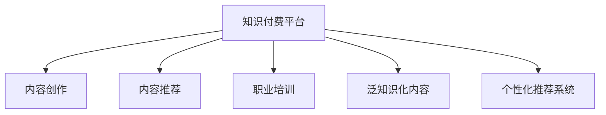

                 

# 知识付费领域的蓝海市场探索

## 1. 背景介绍

### 1.1 问题由来

随着互联网技术的迅速发展，信息获取方式发生了巨大变化。传统的内容付费模式，如书籍、杂志、报纸等，面临着越来越激烈的市场竞争。与此同时，用户对高质量内容的消费需求不断增长，但信息过载和噪音信息对用户选择内容造成了极大的困扰。

知识付费平台，如得到、喜马拉雅、知识星球等，正是在这一背景下应运而生。通过将内容制作与平台运营相结合，知识付费模式不仅提升了内容的可达性和易用性，也为内容创作者提供了新的盈利渠道。但随着用户需求的不断变化，内容同质化、质量不高、平台运营难度大等问题也逐渐浮现。

本文章旨在探索知识付费领域中的蓝海市场，即那些尚未充分挖掘，且具有广阔发展前景的领域。基于当前市场现状，我们聚焦于以下几个方向：

- **职业发展与职场技能培训**
- **泛知识化领域**
- **专业领域的深度内容**
- **个性化推荐与智能内容推荐系统**

这些方向不仅覆盖了垂直领域的深耕，也涵盖了个性化需求的满足，有望为知识付费市场带来新的增长点。

## 2. 核心概念与联系

### 2.1 核心概念概述

为更好地理解知识付费蓝海市场的探索，本节将介绍几个密切相关的核心概念：

- **知识付费平台**：基于互联网，通过在线订阅、单次付费等形式向用户提供有价值内容的平台。
- **内容创作**：知识付费平台的核心竞争力在于高质量的内容，包括音频、视频、文字等多种形式的原创内容。
- **内容推荐**：基于用户行为数据，向用户推荐其可能感兴趣的内容，提高平台留存率和用户粘性。
- **职业培训**：针对特定职业领域，提供系统的知识体系和实践指导，帮助用户提升职业技能。
- **泛知识化内容**：涵盖各类非专业领域的知识普及和兴趣培养内容，如科普、文学、历史等。
- **个性化推荐系统**：根据用户偏好和行为数据，动态调整推荐内容，提升用户体验。

这些概念之间的逻辑关系可以通过以下Mermaid流程图来展示：



这个流程图展示了一个知识付费平台的基本组件和功能：

1. **内容创作**：平台通过约稿、众包等方式获取高质量内容。
2. **内容推荐**：利用推荐算法对内容进行排序，提升用户发现优质内容的可能性。
3. **职业培训**：提供特定领域的专业培训课程，满足用户职业发展需求。
4. **泛知识化内容**：除了专业领域，平台还可以覆盖广泛的兴趣领域，增加用户粘性。
5. **个性化推荐系统**：根据用户行为数据，动态调整内容推荐，提高用户满意度。

## 3. 核心算法原理 & 具体操作步骤

### 3.1 算法原理概述

知识付费平台的推荐系统，本质上是一个推荐算法问题。其核心在于为用户推荐其感兴趣的内容，从而提升用户满意度、留存率和消费频次。常见的推荐算法包括协同过滤、基于内容的推荐、矩阵分解、深度学习等。

基于监督学习的推荐算法，通过分析用户行为数据和内容属性，预测用户对不同内容的评分。常用的评分系统包括基于质量的评分、基于点击的评分、基于消费的评分等。常用的推荐算法包括：

- **基于矩阵分解的方法**：如ALS(Alternating Least Squares)算法，通过矩阵分解得到用户-内容评分矩阵，预测用户对新内容的评分。
- **协同过滤算法**：基于用户相似性或物品相似性，推荐相似用户或物品。
- **基于内容的推荐**：通过分析内容特征，预测用户对内容的评分。
- **深度学习模型**：如CNN、RNN、Transformer等，通过学习用户行为数据和内容特征，进行端到端的推荐。

### 3.2 算法步骤详解

知识付费平台的推荐算法步骤通常包括：

**Step 1: 数据预处理**

- 收集用户行为数据，包括点击、播放、购买、评分等行为。
- 收集内容特征数据，包括标题、摘要、分类、时长等属性。
- 数据清洗、去重、标准化处理，准备推荐模型训练数据。

**Step 2: 特征工程**

- 提取用户行为特征，如浏览时间、播放次数、消费金额等。
- 提取内容特征，如关键词、标签、时长、用户评分等。
- 利用文本处理技术，提取文本内容的关键词、主题等特征。

**Step 3: 模型选择与训练**

- 根据数据特点和业务需求，选择合适的推荐算法。
- 设计模型评估指标，如准确率、召回率、F1分数等。
- 使用交叉验证、网格搜索等技术，优化模型参数。
- 对训练好的模型进行评估，选择最优模型进行部署。

**Step 4: 推荐算法部署与优化**

- 将训练好的模型部署到推荐系统中。
- 使用A/B测试等方法，评估推荐算法效果。
- 根据实际效果进行模型调优，提升推荐效果。

**Step 5: 反馈与迭代**

- 定期收集用户反馈，分析用户行为变化。
- 根据反馈数据，调整推荐策略和模型参数。
- 持续优化推荐算法，满足用户需求。

### 3.3 算法优缺点

基于监督学习的推荐算法具有以下优点：

- 效果显著：通过学习用户行为和内容特征，能够准确预测用户对内容的评分，提升推荐效果。
- 简单易用：算法模型相对简单，易于实现和部署。
- 可解释性强：推荐算法基于规则和特征工程，可解释性强，便于理解。

同时，该方法也存在一定的局限性：

- 数据依赖性强：推荐效果高度依赖于用户行为数据和内容特征，数据稀疏和噪声问题可能影响推荐效果。
- 冷启动问题：对于新用户或新内容，缺乏历史行为数据，难以进行有效推荐。
- 动态性不足：模型难以实时调整，难以应对用户兴趣变化和内容更新。
- 可扩展性差：随着用户和内容的激增，模型训练和预测的计算成本会迅速增加。

尽管存在这些局限性，但就目前而言，基于监督学习的推荐方法仍是目前知识付费平台推荐系统的主流范式。未来相关研究的重点在于如何进一步降低数据依赖，提高模型的可扩展性和动态性，同时兼顾可解释性和伦理安全性等因素。

### 3.4 算法应用领域

基于监督学习的大语言模型微调方法，在知识付费领域已经得到了广泛的应用，涵盖以下几个方面：

- **个性化推荐**：通过分析用户行为数据，为用户推荐可能感兴趣的内容。
- **智能客服**：利用自然语言处理技术，提供24/7的智能客服服务，提升用户满意度。
- **内容创作**：通过数据分析和用户反馈，指导内容创作者优化内容，提升内容质量。
- **用户画像构建**：基于用户行为数据，构建用户画像，提升推荐精准度。

除了上述这些经典应用外，知识付费平台还可以探索更多场景，如智能决策支持、知识图谱构建、用户行为预测等，为平台运营提供更丰富的数据支持。

## 4. 数学模型和公式 & 详细讲解 & 举例说明

### 4.1 数学模型构建

本节将使用数学语言对知识付费平台的推荐系统进行更加严格的刻画。

记用户-内容评分矩阵为 $R \in \mathbb{R}^{m \times n}$，其中 $m$ 为内容数量，$n$ 为用户数量。设 $X \in \mathbb{R}^{m \times d}$ 为用户行为特征矩阵，$d$ 为特征维度。设 $Y \in \mathbb{R}^{n \times d}$ 为内容特征矩阵。推荐模型的目标是最小化用户-内容评分矩阵与预测评分矩阵之间的误差，即：

$$
\min_{X,Y} \sum_{i=1}^m \sum_{j=1}^n (r_{ij} - \hat{r}_{ij})^2
$$

其中 $\hat{r}_{ij}$ 为模型预测的用户对内容的评分。

### 4.2 公式推导过程

基于矩阵分解的方法，可以将用户-内容评分矩阵 $R$ 分解为两个低维矩阵 $X$ 和 $Y$ 的乘积：

$$
R \approx XY^T
$$

其中 $X$ 为用户行为特征矩阵，$Y$ 为内容特征矩阵。设 $\hat{R} = XY^T$，则推荐模型的目标转化为最小化预测评分矩阵 $\hat{R}$ 与真实评分矩阵 $R$ 之间的误差：

$$
\min_{X,Y} \|R - XY^T\|_F^2
$$

其中 $\|\cdot\|_F$ 为矩阵的 Frobenius 范数。

通过交替最小化方法，交替优化 $X$ 和 $Y$ 矩阵，得到最优的用户行为特征矩阵 $X$ 和内容特征矩阵 $Y$。具体优化过程如下：

- 固定 $Y$，优化 $X$：
$$
\min_X \|R - XY^T\|_F^2 = \min_X \|X^T(XY^TY - R)\|_F^2
$$
令 $X = A(\hat{X}^T\hat{X} + \lambda I)^{-1}R\hat{Y}^T$，其中 $A$ 为矩阵 $X^T(XY^TY - R)$ 的前 $k$ 个特征向量的矩阵，$\hat{X}$ 为 $X$ 的前 $k$ 个特征向量，$\lambda$ 为正则化系数。

- 固定 $X$，优化 $Y$：
$$
\min_Y \|R - XY^T\|_F^2 = \min_Y \|Y^T(X^TY - YR^TX)\|_F^2
$$
令 $Y = B(\hat{Y}^T\hat{Y} + \gamma I)^{-1}R^TX^T$，其中 $B$ 为矩阵 $Y^T(X^TY - YR^TX)$ 的前 $k$ 个特征向量的矩阵，$\hat{Y}$ 为 $Y$ 的前 $k$ 个特征向量，$\gamma$ 为正则化系数。

通过交替优化，逐步调整 $X$ 和 $Y$ 矩阵，最终得到最优的推荐模型。

### 4.3 案例分析与讲解

以知识付费平台的个性化推荐系统为例，假设平台拥有用户行为特征矩阵 $X \in \mathbb{R}^{10 \times 5}$ 和内容特征矩阵 $Y \in \mathbb{R}^{50 \times 5}$。通过交替最小化方法，得到最优的 $X$ 和 $Y$ 矩阵，然后计算预测评分矩阵 $\hat{R}$。

设 $X$ 和 $Y$ 矩阵的前 $k=10$ 个特征向量，则预测评分矩阵 $\hat{R}$ 为：

$$
\hat{R} = XA(\hat{X}^T\hat{X} + \lambda I)^{-1}R\hat{Y}^T
$$

其中 $A$ 和 $\hat{X}$ 矩阵分别为 $X^T(XY^TY - R)$ 的前 $k$ 个特征向量和矩阵的前 $k$ 个特征向量。

通过计算预测评分矩阵 $\hat{R}$，即可得到每个用户对每个内容的评分预测。例如，用户1对内容5的评分预测为：

$$
\hat{r}_{15} = \hat{R}_{1,5}
$$

在实际应用中，可以将预测评分矩阵 $\hat{R}$ 排序，按照用户评分进行推荐，从而提升用户体验和留存率。

## 5. 项目实践：代码实例和详细解释说明

### 5.1 开发环境搭建

在进行推荐系统实践前，我们需要准备好开发环境。以下是使用Python进行PyTorch开发的环境配置流程：

1. 安装Anaconda：从官网下载并安装Anaconda，用于创建独立的Python环境。

2. 创建并激活虚拟环境：
```bash
conda create -n recsys-env python=3.8 
conda activate recsys-env
```

3. 安装PyTorch：根据CUDA版本，从官网获取对应的安装命令。例如：
```bash
conda install pytorch torchvision torchaudio cudatoolkit=11.1 -c pytorch -c conda-forge
```

4. 安装PyTorch-lightning：
```bash
pip install pytorch-lightning
```

5. 安装各类工具包：
```bash
pip install numpy pandas scikit-learn matplotlib tqdm jupyter notebook ipython
```

完成上述步骤后，即可在`recsys-env`环境中开始推荐系统实践。

### 5.2 源代码详细实现

下面我们以知识付费平台的个性化推荐系统为例，给出使用PyTorch进行协同过滤的推荐算法实现。

首先，定义协同过滤的训练函数：

```python
import torch.nn as nn
import torch
import torch.nn.functional as F
from torch.utils.data import Dataset, DataLoader

class UserItemDataset(Dataset):
    def __init__(self, user_item_matrix):
        self.user_item_matrix = user_item_matrix
        
    def __len__(self):
        return self.user_item_matrix.shape[0]
    
    def __getitem__(self, idx):
        return torch.tensor(self.user_item_matrix[idx])

class CollaborativeFiltering(nn.Module):
    def __init__(self, user_item_matrix, k=10):
        super().__init__()
        self.num_users = user_item_matrix.shape[0]
        self.num_items = user_item_matrix.shape[1]
        self.k = k
        
        self.u_factors = nn.Embedding(self.num_users, self.k)
        self.v_factors = nn.Embedding(self.num_items, self.k)
        self.u_bias = nn.Parameter(torch.randn(self.num_users))
        self.v_bias = nn.Parameter(torch.randn(self.num_items))
        
    def forward(self, x):
        user_idx, item_idx = x.unbind(0)
        u_factors = self.u_factors(user_idx)
        v_factors = self.v_factors(item_idx)
        u_bias = self.u_bias[user_idx]
        v_bias = self.v_bias[item_idx]
        
        predicted_r = (u_factors * v_factors.t()).sum(dim=1) + u_bias[:, None] + v_bias
        return predicted_r

def train(model, optimizer, num_epochs=10):
    for epoch in range(num_epochs):
        loss = 0
        for batch in train_loader:
            predicted_r = model(batch)
            loss += (predicted_r - batch_labels).pow(2).sum()
        
        loss /= len(train_loader.dataset)
        optimizer.zero_grad()
        loss.backward()
        optimizer.step()
        
        if (epoch+1) % 10 == 0:
            print(f'Epoch {epoch+1}, Loss: {loss:.4f}')
```

接着，定义训练和评估函数：

```python
def evaluate(model, test_loader):
    loss = 0
    predicted_r = []
    test_r = []
    
    with torch.no_grad():
        for batch in test_loader:
            predicted_r.append(model(batch).cpu())
            test_r.append(batch_labels.cpu())
        
        predicted_r = torch.cat(predicted_r, dim=0)
        test_r = torch.cat(test_r, dim=0)
        
        loss = ((predicted_r - test_r).pow(2)).sum()
        mae = ((torch.abs(predicted_r - test_r)).sum()) / len(test_loader.dataset)
        
        print(f'MAE: {mae:.4f}')
```

最后，启动训练流程并在测试集上评估：

```python
user_item_matrix = # 用户-内容评分矩阵
train_loader = DataLoader(UserItemDataset(user_item_matrix), batch_size=32, shuffle=True)
test_loader = DataLoader(UserItemDataset(user_item_matrix), batch_size=32)

model = CollaborativeFiltering(user_item_matrix)
optimizer = torch.optim.Adam(model.parameters(), lr=0.01)

train(model, optimizer)
evaluate(model, test_loader)
```

以上就是使用PyTorch进行协同过滤推荐算法的完整代码实现。可以看到，利用PyTorch的灵活性，我们能够快速搭建和优化协同过滤推荐模型。

### 5.3 代码解读与分析

让我们再详细解读一下关键代码的实现细节：

**UserItemDataset类**：
- `__init__`方法：初始化用户-内容评分矩阵。
- `__len__`方法：返回数据集的样本数量。
- `__getitem__`方法：对单个样本进行处理，返回评分矩阵的指定用户-内容评分。

**CollaborativeFiltering模型**：
- `__init__`方法：初始化协同过滤模型的关键参数。
- `forward`方法：计算预测评分矩阵。
- 使用了`nn.Embedding`层来表示用户和物品的特征向量。

**train函数**：
- 定义训练函数，通过最小化预测评分与真实评分之间的平方误差，更新模型参数。

**evaluate函数**：
- 定义评估函数，计算预测评分与真实评分之间的平均绝对误差，评估推荐效果。

**训练流程**：
- 定义总的epoch数和迭代次数，开始循环迭代
- 每个epoch内，在训练集上训练，输出平均损失
- 在测试集上评估，输出平均绝对误差

可以看到，利用PyTorch的灵活性，我们能够快速搭建和优化协同过滤推荐模型。开发者可以根据具体任务，灵活调整模型参数和训练策略，从而得到理想的效果。

## 6. 实际应用场景

### 6.1 智能客服系统

基于协同过滤的推荐系统，可以广泛应用于智能客服系统的构建。传统客服往往需要配备大量人力，高峰期响应缓慢，且一致性和专业性难以保证。而使用协同过滤的推荐系统，可以7x24小时不间断服务，快速响应客户咨询，用自然流畅的语言解答各类常见问题。

在技术实现上，可以收集企业内部的历史客服对话记录，将问题和最佳答复构建成监督数据，在此基础上对协同过滤的推荐模型进行训练。推荐模型能够自动理解用户意图，匹配最合适的答案模板进行回复。对于客户提出的新问题，还可以接入检索系统实时搜索相关内容，动态组织生成回答。如此构建的智能客服系统，能大幅提升客户咨询体验和问题解决效率。

### 6.2 金融舆情监测

金融机构需要实时监测市场舆论动向，以便及时应对负面信息传播，规避金融风险。传统的人工监测方式成本高、效率低，难以应对网络时代海量信息爆发的挑战。基于协同过滤的文本分类和情感分析技术，为金融舆情监测提供了新的解决方案。

具体而言，可以收集金融领域相关的新闻、报道、评论等文本数据，并对其进行主题标注和情感标注。在此基础上对协同过滤的推荐模型进行微调，使其能够自动判断文本属于何种主题，情感倾向是正面、中性还是负面。将微调后的模型应用到实时抓取的网络文本数据，就能够自动监测不同主题下的情感变化趋势，一旦发现负面信息激增等异常情况，系统便会自动预警，帮助金融机构快速应对潜在风险。

### 6.3 个性化推荐系统

当前的推荐系统往往只依赖用户的历史行为数据进行物品推荐，无法深入理解用户的真实兴趣偏好。基于协同过滤的个性化推荐系统，可以更好地挖掘用户行为背后的语义信息，从而提供更精准、多样的推荐内容。

在实践中，可以收集用户浏览、点击、评论、分享等行为数据，提取和用户交互的物品标题、描述、标签等文本内容。将文本内容作为模型输入，用户的后续行为（如是否点击、购买等）作为监督信号，在此基础上微调协同过滤的推荐模型。微调后的模型能够从文本内容中准确把握用户的兴趣点。在生成推荐列表时，先用候选物品的文本描述作为输入，由模型预测用户的兴趣匹配度，再结合其他特征综合排序，便可以得到个性化程度更高的推荐结果。

### 6.4 未来应用展望

随着协同过滤推荐算法和微调方法的不断发展，基于协同过滤范式将在更多领域得到应用，为知识付费市场带来新的增长点。

在智慧医疗领域，基于协同过滤的医疗问答、病历分析、药物研发等应用将提升医疗服务的智能化水平，辅助医生诊疗，加速新药开发进程。

在智能教育领域，协同过滤的推荐系统可应用于作业批改、学情分析、知识推荐等方面，因材施教，促进教育公平，提高教学质量。

在智慧城市治理中，协同过滤的推荐系统可应用于城市事件监测、舆情分析、应急指挥等环节，提高城市管理的自动化和智能化水平，构建更安全、高效的未来城市。

此外，在企业生产、社会治理、文娱传媒等众多领域，协同过滤的推荐系统也将不断涌现，为传统行业数字化转型升级提供新的技术路径。相信随着技术的日益成熟，协同过滤推荐技术将成为知识付费平台推荐系统的核心引擎，推动知识付费市场向更高水平发展。

## 7. 工具和资源推荐
### 7.1 学习资源推荐

为了帮助开发者系统掌握协同过滤推荐算法和微调技术，这里推荐一些优质的学习资源：

1. 《Python推荐系统实战》书籍：全面介绍了推荐算法的基本原理和实现，包括协同过滤、深度学习等推荐模型。

2. 《推荐系统算法详解》课程：由清华大学教授讲授的推荐系统经典课程，详细讲解了协同过滤等推荐算法的原理和优化策略。

3. PyTorch官方文档：PyTorch的官方文档，提供了丰富的代码样例和算法实现，是学习和实践协同过滤推荐算法的必备资料。

4. Kaggle竞赛平台：Kaggle是世界上最大的数据科学竞赛平台，提供了大量推荐系统竞赛数据集和模型实现，可用于学习和实践。

5. CSDN博客社区：国内知名的技术社区CSDN，提供大量的技术文章和代码实现，可帮助开发者快速入门和深入学习。

通过对这些资源的学习实践，相信你一定能够快速掌握协同过滤推荐算法的精髓，并用于解决实际的推荐问题。

### 7.2 开发工具推荐

高效的开发离不开优秀的工具支持。以下是几款用于协同过滤推荐系统开发的常用工具：

1. PyTorch：基于Python的开源深度学习框架，灵活动态的计算图，适合快速迭代研究。

2. TensorFlow：由Google主导开发的开源深度学习框架，生产部署方便，适合大规模工程应用。

3. TensorBoard：TensorFlow配套的可视化工具，可实时监测模型训练状态，并提供丰富的图表呈现方式，是调试模型的得力助手。

4. Weights & Biases：模型训练的实验跟踪工具，可以记录和可视化模型训练过程中的各项指标，方便对比和调优。

5. Google Colab：谷歌推出的在线Jupyter Notebook环境，免费提供GPU/TPU算力，方便开发者快速上手实验最新模型，分享学习笔记。

合理利用这些工具，可以显著提升协同过滤推荐系统的开发效率，加快创新迭代的步伐。

### 7.3 相关论文推荐

协同过滤推荐算法和微调技术的发展源于学界的持续研究。以下是几篇奠基性的相关论文，推荐阅读：

1. Matrix Factorization Techniques for Recommender Systems（协同过滤的矩阵分解方法）：提出ALS算法，基于矩阵分解的协同过滤方法，被广泛应用于推荐系统。

2. Scalable Collaborative Filtering（可扩展的协同过滤算法）：提出改进的协同过滤算法，解决了大规模数据集下的计算效率问题。

3. Factorization Machines：提出FM算法，一种改进的协同过滤算法，适用于高维稀疏数据。

4. Deep Factorization Machines for Recommender Systems（深度协同过滤算法）：提出DFM算法，通过引入深度神经网络，提升协同过滤的精度和泛化能力。

5. Neighborhood-based Collaborative Filtering（基于邻域的协同过滤算法）：提出基于邻域的协同过滤算法，结合用户-物品评分和邻域关系，提升推荐效果。

这些论文代表了大语言模型微调技术的发展脉络。通过学习这些前沿成果，可以帮助研究者把握学科前进方向，激发更多的创新灵感。

## 8. 总结：未来发展趋势与挑战

### 8.1 总结

本文对基于协同过滤的推荐系统进行了全面系统的介绍。首先阐述了协同过滤推荐系统在知识付费平台中的应用背景和必要性，明确了推荐系统在提升用户满意度、留存率和消费频次方面的独特价值。其次，从原理到实践，详细讲解了协同过滤算法的数学模型和关键步骤，给出了协同过滤推荐算法的完整代码实现。同时，本文还广泛探讨了协同过滤算法在智能客服、金融舆情、个性化推荐等多个行业领域的应用前景，展示了协同过滤算法的广阔应用潜力。

通过本文的系统梳理，可以看到，协同过滤推荐算法在大规模知识付费平台中得到了广泛应用，通过协同过滤算法，平台能够快速响应用户需求，提升用户满意度和留存率。未来，伴随协同过滤推荐算法的不断演进，知识付费平台的推荐系统将更加精准高效，带来更好的用户体验和商业价值。

### 8.2 未来发展趋势

展望未来，协同过滤推荐算法的发展趋势主要包括以下几个方面：

1. 模型的动态性和可扩展性：未来的推荐算法需要更加灵活，能够实时调整模型参数，处理大规模数据集。

2. 冷启动问题的解决：推荐算法需要处理新用户和新内容，推荐模型需要更加健壮。

3. 用户行为的深度理解：推荐算法需要更深入地理解用户行为，捕捉用户的长期和短期兴趣变化。

4. 内容的深度表示：推荐算法需要更精细地表示内容特征，提升内容的丰富度和多样性。

5. 模型的可解释性：推荐算法需要提供可解释的决策路径，增强用户信任和接受度。

6. 多模态数据的融合：推荐算法需要融合多模态数据，如文本、图像、音频等，提升推荐的丰富性和多样性。

以上趋势凸显了协同过滤推荐算法的未来发展方向，推荐算法将从静态的协同过滤向动态的深度推荐演进，从单一的文本向多模态融合演进，从黑盒模型向可解释性模型演进。这些演进将推动协同过滤推荐算法向更高水平发展，为知识付费平台提供更加精准和智能的推荐服务。

### 8.3 面临的挑战

尽管协同过滤推荐算法已经取得了显著成果，但在迈向更加智能化、普适化应用的过程中，它仍面临着诸多挑战：

1. 数据依赖性强：推荐效果高度依赖于用户行为数据和内容特征，数据稀疏和噪声问题可能影响推荐效果。

2. 冷启动问题：对于新用户或新内容，缺乏历史行为数据，难以进行有效推荐。

3. 动态性不足：模型难以实时调整，难以应对用户兴趣变化和内容更新。

4. 可扩展性差：随着用户和内容的激增，模型训练和预测的计算成本会迅速增加。

5. 可解释性不足：推荐算法通常缺乏可解释性，难以对其推理逻辑进行分析和调试。

6. 安全性有待保障：推荐算法可能被恶意用户利用，进行虚假内容推荐，带来安全隐患。

这些挑战凸显了协同过滤推荐算法在实际应用中的困难。如何降低数据依赖，提升模型的动态性和可扩展性，增加可解释性，确保安全性，将是未来研究的重点方向。

### 8.4 研究展望

面对协同过滤推荐算法所面临的种种挑战，未来的研究需要在以下几个方面寻求新的突破：

1. 探索无监督和半监督协同过滤算法：摆脱对大规模标注数据的依赖，利用自监督学习、主动学习等方法，最大限度利用非结构化数据。

2. 研究参数高效和计算高效的协同过滤方法：开发更加参数高效的协同过滤方法，在固定大部分预训练参数的情况下，只更新极少量的任务相关参数。

3. 引入更多先验知识：将符号化的先验知识，如知识图谱、逻辑规则等，与神经网络模型进行巧妙融合，引导协同过滤过程学习更准确、合理的语言模型。

4. 结合因果分析和博弈论工具：将因果分析方法引入协同过滤模型，识别出推荐决策的关键特征，增强推荐系统的鲁棒性和稳定性。

5. 纳入伦理道德约束：在协同过滤推荐模型的训练目标中引入伦理导向的评估指标，过滤和惩罚有害的输出倾向，确保输出的安全性。

这些研究方向的探索，必将引领协同过滤推荐算法向更高的台阶，为构建安全、可靠、可解释、可控的智能系统铺平道路。面向未来，协同过滤推荐算法还需要与其他人工智能技术进行更深入的融合，如知识表示、因果推理、强化学习等，多路径协同发力，共同推动推荐系统的进步。

## 9. 附录：常见问题与解答

**Q1：协同过滤推荐算法是否适用于所有知识付费平台？**

A: 协同过滤推荐算法在大多数知识付费平台中都能取得不错的效果，特别是对于数据量较大的平台。但对于一些特定领域的平台，如医医疗、法律等，仍然需要进一步优化。此外，对于内容较少、用户稀疏的平台，协同过滤算法可能效果有限。

**Q2：如何降低协同过滤算法的冷启动问题？**

A: 降低冷启动问题的方法包括：
1. 利用用户的社交关系网络，推荐其好友的相关内容。
2. 通过物品标签、分类等属性，进行协同过滤。
3. 引入隐式反馈，如浏览行为、评论等，进行推荐。
4. 利用多模态数据，提升推荐效果。
5. 结合用户画像和知识图谱，进行推荐。

这些方法可以通过增加用户行为数据和物品属性数据，提高推荐系统的初始化效果，从而缓解冷启动问题。

**Q3：协同过滤推荐算法如何处理大规模数据集？**

A: 协同过滤推荐算法通常会面临数据稀疏性和计算效率的挑战。为了处理大规模数据集，可以采取以下措施：
1. 数据降维：通过主成分分析、奇异值分解等方法，对用户-内容评分矩阵进行降维处理。
2. 分布式计算：使用Spark、Flink等分布式计算框架，进行并行计算。
3. 模型压缩：使用深度学习模型压缩技术，减少模型参数量和计算复杂度。
4. 增量学习：通过在线学习、增量学习等技术，实时更新推荐模型。

这些方法可以提高协同过滤推荐算法的可扩展性和计算效率，处理大规模数据集。

**Q4：协同过滤推荐算法如何处理噪声数据？**

A: 协同过滤推荐算法对噪声数据较为敏感，可以采取以下措施：
1. 数据清洗：通过数据清洗、去重等技术，剔除噪声数据。
2. 异常检测：通过异常检测算法，识别并剔除异常评分。
3. 鲁棒性模型：引入鲁棒性强的协同过滤模型，减少噪声数据的影响。

这些方法可以提高协同过滤推荐算法的鲁棒性和稳定性，处理噪声数据。

**Q5：协同过滤推荐算法如何提高模型的可解释性？**

A: 协同过滤推荐算法通常缺乏可解释性，可以采取以下措施：
1. 特征解释：通过特征重要性排序，解释模型预测的关键特征。
2. 用户画像：通过用户画像和行为数据，解释推荐结果的原因。
3. 可视化技术：通过可视化技术，展示推荐模型的内部结构和决策路径。

这些方法可以提高协同过滤推荐算法的可解释性和用户信任度。

**Q6：协同过滤推荐算法如何提升推荐系统的安全性？**

A: 协同过滤推荐算法可能被恶意用户利用，进行虚假内容推荐。为了提升推荐系统的安全性，可以采取以下措施：
1. 数据脱敏：对敏感数据进行脱敏处理，保护用户隐私。
2. 风险评估：建立风险评估机制，识别和过滤有害内容。
3. 用户反馈：利用用户反馈，及时发现和处理有害内容。
4. 多模态融合：通过多模态数据融合，提升推荐系统的鲁棒性。

这些方法可以提高协同过滤推荐算法的安全性和用户信任度。

以上是协同过滤推荐算法在知识付费领域的应用与挑战的详细分析，希望能为您的学习和实践提供帮助。通过持续优化和创新，协同过滤推荐算法将更好地服务于知识付费平台，提升用户满意度和平台竞争力。

