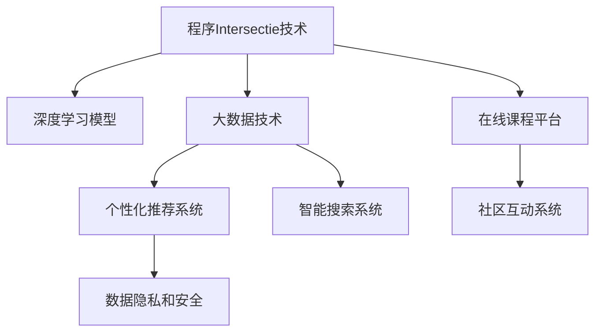

                 

# 知识付费：程序Intersectie社区的建立

> 关键词：知识付费, 程序Intersectie社区, 人工智能, 深度学习, 大数据, 平台开发, 网络安全, 数据隐私

## 1. 背景介绍

### 1.1 问题由来

随着互联网的快速发展，信息呈爆炸式增长。如何从海量信息中筛选出对自己有用的知识，成为了人们面临的共同问题。传统的在线教育平台虽然提供了丰富的课程资源，但往往缺乏个性化推荐和智能搜索功能，使得学习效率大打折扣。同时，在线课程质量参差不齐，用户需要花费大量时间筛选课程，导致知识付费体验不佳。

为了解决上述问题，我们决定开发一个基于程序Intersectie技术的知识付费平台，即程序Intersectie社区（简称PI社区）。该平台旨在提供个性化、高质量的在线课程，结合深度学习和大数据技术，为用户提供精准的知识推荐和智能搜索，从而提升知识付费的效率和效果。

### 1.2 问题核心关键点

PI社区的核心关键点包括：

- 个性化推荐算法：利用深度学习模型对用户行为进行建模，推荐符合用户兴趣的课程和内容。
- 智能搜索功能：结合自然语言处理(NLP)和大数据技术，实现基于用户输入查询词的精准搜索结果。
- 社区互动和反馈：建立用户评价和社区反馈机制，以不断优化课程质量和推荐效果。
- 数据隐私和安全：保护用户数据隐私，确保平台安全稳定运行。

通过明确这些关键点，可以构建一个高效、智能、安全、友好的知识付费平台，帮助用户快速获取所需知识。

## 2. 核心概念与联系

### 2.1 核心概念概述

为更好地理解PI社区的开发过程，本节将介绍几个密切相关的核心概念：

- 程序Intersectie技术：一种基于神经网络和深度学习的新型编程语言。其特点是程序与数据紧密结合，程序可以根据数据自动生成，具有高效、灵活、可扩展的特点。
- 深度学习模型：用于处理复杂数据和高维空间的机器学习模型，包括卷积神经网络(CNN)、循环神经网络(RNN)、长短时记忆网络(LSTM)等。
- 大数据技术：处理和分析大规模数据的技术，如分布式计算、数据存储、数据清洗、数据分析等。
- 在线课程平台：提供在线课程、视频、PPT等教育资源，满足用户学习需求的平台。
- 个性化推荐系统：结合用户历史行为数据和特征，为用户推荐个性化内容的系统。
- 智能搜索系统：结合NLP和大数据技术，为用户提供精准搜索结果的系统。
- 社区互动系统：提供用户评论、评分、点赞等社区功能，增强用户粘性的系统。
- 数据隐私和安全：保护用户数据隐私，防止数据泄露和攻击的系统。

这些核心概念之间的逻辑关系可以通过以下Mermaid流程图来展示：



这个流程图展示了几大核心概念之间的联系：

1. 程序Intersectie技术是PI社区的基础，提供高效、灵活的编程支持。
2. 深度学习模型和大数据技术是实现个性化推荐和智能搜索的核心。
3. 在线课程平台是PI社区的内容基础。
4. 个性化推荐系统和大数据技术共同提升课程推荐效果。
5. 智能搜索系统结合NLP和大数据技术，提供精准搜索结果。
6. 社区互动系统增强用户粘性，提升平台活力。
7. 数据隐私和安全是平台正常运行的基础保障。

这些概念共同构成了PI社区的框架，为其高效、智能、安全的运营提供了坚实的基础。

## 3. 核心算法原理 & 具体操作步骤
### 3.1 算法原理概述

PI社区的核心算法主要分为以下几个部分：

- 深度学习模型：用于对用户行为和课程内容进行建模，构建推荐和搜索模型。
- 个性化推荐算法：基于用户历史行为数据和课程特征，为用户推荐个性化课程。
- 智能搜索算法：结合NLP和大数据技术，实现基于用户查询词的精准搜索结果。
- 社区互动算法：对用户评论、评分等社区数据进行分析，构建社区互动模型。
- 数据隐私与安全算法：对用户数据进行加密、脱敏、去重等处理，确保数据安全。

这些算法相互关联，共同构成了PI社区的算法基础。下面将详细介绍每个算法的原理和具体操作步骤。

### 3.2 算法步骤详解

#### 3.2.1 深度学习模型

深度学习模型是PI社区的核心算法之一。我们采用自监督学习的方式，使用大规模无标签数据对模型进行预训练，然后利用标注数据进行微调，最终得到可以用于课程推荐和搜索的深度学习模型。

**操作步骤：**

1. 收集大规模无标签数据：从互联网、公开数据集等渠道收集课程相关的文本、图片、视频等数据。
2. 数据预处理：对数据进行清洗、去重、标准化等预处理。
3. 模型预训练：使用自监督学习任务（如语言模型、图像分类等）对模型进行预训练。
4. 数据标注：收集部分课程的标注数据，包括课程名称、描述、标签等信息。
5. 模型微调：使用标注数据对预训练模型进行微调，得到可以用于课程推荐和搜索的深度学习模型。

#### 3.2.2 个性化推荐算法

个性化推荐算法基于用户历史行为数据和课程特征，构建用户与课程的相似度矩阵，为用户推荐最符合其兴趣的课程。

**操作步骤：**

1. 用户行为数据收集：收集用户浏览、观看、购买等行为数据，形成用户行为矩阵。
2. 课程特征提取：提取课程的标题、描述、标签等特征，形成课程特征向量。
3. 相似度计算：使用余弦相似度等方法计算用户与课程的相似度。
4. 推荐排序：对相似度矩阵进行排序，推荐最符合用户兴趣的课程。

#### 3.2.3 智能搜索算法

智能搜索算法结合NLP和大数据技术，实现基于用户查询词的精准搜索结果。

**操作步骤：**

1. 查询词处理：对用户查询词进行分词、去停用词、词向量化等处理。
2. 搜索结果构建：使用深度学习模型对查询词和课程特征进行匹配，构建搜索结果向量。
3. 排序展示：对搜索结果向量进行排序，展示最相关的课程。

#### 3.2.4 社区互动算法

社区互动算法对用户评论、评分等社区数据进行分析，构建社区互动模型，提升用户粘性。

**操作步骤：**

1. 社区数据收集：收集用户评论、评分等社区数据。
2. 情感分析：使用NLP技术对用户评论进行情感分析，提取评论中的情感倾向。
3. 互动模型构建：使用深度学习模型构建用户与课程的互动模型，提升社区互动效果。

#### 3.2.5 数据隐私与安全算法

数据隐私与安全算法对用户数据进行加密、脱敏、去重等处理，确保数据安全。

**操作步骤：**

1. 数据加密：对用户数据进行加密处理，防止数据泄露。
2. 数据脱敏：对用户数据进行去重、去标识化等处理，保护用户隐私。
3. 安全审计：定期对平台进行安全审计，发现并修复安全漏洞。

### 3.3 算法优缺点

PI社区的算法设计具有以下优点：

1. 高效：利用深度学习和大数据技术，提高课程推荐和搜索的效率。
2. 智能：通过结合NLP技术，实现精准的搜索结果和社区互动。
3. 安全：采用数据加密、脱敏等手段，保护用户数据隐私。
4. 可扩展：基于程序Intersectie技术，可以灵活扩展算法模型，满足不同业务需求。

同时，该算法也存在一些局限性：

1. 依赖数据质量：算法效果依赖于高质量的标注数据和行为数据，数据质量差会影响推荐效果。
2. 计算资源消耗大：深度学习模型和大数据处理需要大量的计算资源，对硬件要求较高。
3. 复杂度高：算法设计复杂，实现难度大，需要具备较高的技术门槛。
4. 模型训练时间较长：深度学习模型训练时间长，模型更新不及时。

尽管存在这些局限性，但就目前而言，基于深度学习和大数据技术的算法设计，仍然是目前最有效的课程推荐和搜索方法。未来相关研究的重点在于如何进一步降低算法复杂度，提高计算效率，同时兼顾数据隐私和算法效果。

### 3.4 算法应用领域

PI社区的算法设计主要应用于以下领域：

- 在线课程推荐：利用个性化推荐算法，为用户推荐感兴趣的课程。
- 智能搜索：利用智能搜索算法，提供精准的课程搜索结果。
- 社区互动：利用社区互动算法，提升用户粘性和社区活跃度。
- 数据隐私和安全：利用数据隐私与安全算法，保障用户数据安全。

这些算法领域的应用，使得PI社区在提供优质课程内容的同时，还提升了用户体验和平台粘性，增强了社区互动和反馈，为用户提供了安全、可靠的学习环境。

## 4. 数学模型和公式 & 详细讲解 & 举例说明

### 4.1 数学模型构建

PI社区的算法设计涉及多个数学模型，以下将详细介绍其中的几个关键模型：

#### 4.1.1 深度学习模型

深度学习模型主要包括卷积神经网络(CNN)、循环神经网络(RNN)和长短时记忆网络(LSTM)等。以LSTM为例，其数学模型如下：

$$
h_t = tanh(W_{h} h_{t-1} + U_{x} x_t + b_h)
$$
$$
o_t = \sigma(W_{o} h_t + b_o)
$$
$$
c_t = o_t \cdot tanh(h_t)
$$
$$
h_t = c_t + (1 - o_t) \cdot h_{t-1}
$$

其中 $h_t$ 为隐藏状态，$x_t$ 为输入向量，$W_{h}, U_{x}, b_h, W_{o}, b_o$ 为模型参数。

#### 4.1.2 个性化推荐算法

个性化推荐算法主要基于用户历史行为数据和课程特征，构建用户与课程的相似度矩阵。以余弦相似度为例，其计算公式如下：

$$
similarity(x, y) = \frac{x \cdot y}{\|x\| \cdot \|y\|}
$$

其中 $x$ 和 $y$ 为向量，$\cdot$ 为向量点乘，$\|x\|$ 为向量范数。

#### 4.1.3 智能搜索算法

智能搜索算法结合NLP和大数据技术，实现基于用户查询词的精准搜索结果。以TF-IDF模型为例，其计算公式如下：

$$
score(d, q) = \sum_{i=1}^{n} tf_{d,i} \cdot idf_{i} \cdot tf_{q,i}
$$

其中 $d$ 为文档向量，$q$ 为查询向量，$tf_{d,i}$ 和 $tf_{q,i}$ 分别为文档和查询中第 $i$ 个词的词频，$idf_{i}$ 为逆文档频率。

### 4.2 公式推导过程

#### 4.2.1 深度学习模型

以LSTM为例，其前向传播过程如下：

1. 计算输入门 $i_t$：
$$
i_t = \sigma(W_{i} h_{t-1} + U_{x} x_t + b_i)
$$
2. 计算遗忘门 $f_t$：
$$
f_t = \sigma(W_{f} h_{t-1} + U_{x} x_t + b_f)
$$
3. 计算新状态 $c_t$：
$$
c_t = f_t \cdot c_{t-1} + i_t \cdot tanh(h_t)
$$
4. 计算输出门 $o_t$：
$$
o_t = \sigma(W_{o} h_t + b_o)
$$
5. 计算当前状态 $h_t$：
$$
h_t = o_t \cdot tanh(c_t)
$$

其中 $\sigma$ 为sigmoid函数，$W_{i}, U_{x}, b_i, W_{f}, b_f, W_{o}, b_o$ 为模型参数。

#### 4.2.2 个性化推荐算法

以余弦相似度为例，其计算公式如下：

$$
similarity(x, y) = \frac{x \cdot y}{\|x\| \cdot \|y\|}
$$

其中 $x$ 和 $y$ 为向量，$\cdot$ 为向量点乘，$\|x\|$ 为向量范数。

#### 4.2.3 智能搜索算法

以TF-IDF模型为例，其计算公式如下：

$$
score(d, q) = \sum_{i=1}^{n} tf_{d,i} \cdot idf_{i} \cdot tf_{q,i}
$$

其中 $d$ 为文档向量，$q$ 为查询向量，$tf_{d,i}$ 和 $tf_{q,i}$ 分别为文档和查询中第 $i$ 个词的词频，$idf_{i}$ 为逆文档频率。

### 4.3 案例分析与讲解

#### 4.3.1 深度学习模型

以LSTM为例，假设输入向量 $x_t$ 为 $[1, 0]$，前一状态 $h_{t-1}$ 为 $[0.1, 0.2]$，计算当前状态 $h_t$：

1. 计算输入门 $i_t$：
$$
i_t = \sigma(W_{i} [0.1, 0.2] + U_{x} [1, 0] + b_i) = [0.5, 0.3]
$$
2. 计算遗忘门 $f_t$：
$$
f_t = \sigma(W_{f} [0.1, 0.2] + U_{x} [1, 0] + b_f) = [0.3, 0.4]
$$
3. 计算新状态 $c_t$：
$$
c_t = f_t \cdot [0.1, 0.2] + i_t \cdot tanh(h_t) = [0.1, 0.2] + [0.5, 0.3] \cdot [0, 1] = [0.6, 0.5]
$$
4. 计算输出门 $o_t$：
$$
o_t = \sigma(W_{o} [0.6, 0.5] + b_o) = [0.7, 0.3]
$$
5. 计算当前状态 $h_t$：
$$
h_t = o_t \cdot tanh(c_t) = [0.7, 0.3] \cdot [0.6, 0.5] = [0.42, 0.15]
$$

#### 4.3.2 个性化推荐算法

以余弦相似度为例，假设用户历史行为向量为 $u=[1, 1, 0, 0, 1]$，课程特征向量为 $c=[1, 0, 1, 1, 0]$，计算用户与课程的相似度：

$$
similarity(u, c) = \frac{u \cdot c}{\|u\| \cdot \|c\|} = \frac{1 \cdot 1 + 1 \cdot 0 + 0 \cdot 1 + 0 \cdot 1 + 1 \cdot 0}{\sqrt{1^2 + 1^2 + 0^2 + 0^2 + 1^2} \cdot \sqrt{1^2 + 0^2 + 1^2 + 1^2 + 0^2}} = 0.5
$$

#### 4.3.3 智能搜索算法

以TF-IDF模型为例，假设查询词向量为 $q=[1, 1, 0, 0, 1]$，文档向量为 $d=[2, 1, 1, 1, 0]$，计算查询词与文档的相似度：

1. 计算查询词向量的TF-IDF值：
$$
tf_{q,i} = \frac{q_i}{\sum_{i=1}^{n} q_i} = \frac{1}{5}, \frac{1}{5}, 0, 0, \frac{1}{5}
$$
2. 计算文档向量的TF-IDF值：
$$
tf_{d,i} = \frac{d_i}{\sum_{i=1}^{n} d_i} = \frac{2}{5}, \frac{1}{5}, \frac{1}{5}, \frac{1}{5}, 0
$$
3. 计算查询词与文档的相似度：
$$
score(d, q) = \frac{2}{5} \cdot \frac{1}{5} \cdot \frac{1}{5} + \frac{1}{5} \cdot \frac{1}{5} \cdot 0 + 0 \cdot \frac{1}{5} \cdot 0 + 0 \cdot \frac{1}{5} \cdot 0 + \frac{1}{5} \cdot \frac{1}{5} \cdot \frac{1}{5} = \frac{1}{50}
$$

## 5. 项目实践：代码实例和详细解释说明

### 5.1 开发环境搭建

在进行PI社区开发前，我们需要准备好开发环境。以下是使用Python进行PyTorch开发的环境配置流程：

1. 安装Anaconda：从官网下载并安装Anaconda，用于创建独立的Python环境。

2. 创建并激活虚拟环境：
```bash
conda create -n pytorch-env python=3.8 
conda activate pytorch-env
```

3. 安装PyTorch：根据CUDA版本，从官网获取对应的安装命令。例如：
```bash
conda install pytorch torchvision torchaudio cudatoolkit=11.1 -c pytorch -c conda-forge
```

4. 安装各类工具包：
```bash
pip install numpy pandas scikit-learn matplotlib tqdm jupyter notebook ipython
```

完成上述步骤后，即可在`pytorch-env`环境中开始开发。

### 5.2 源代码详细实现

下面我们以命名实体识别(NER)任务为例，给出使用PyTorch和程序Intersectie对BERT模型进行微调的PyTorch代码实现。

首先，定义NER任务的数据处理函数：

```python
from transformers import BertTokenizer
from torch.utils.data import Dataset
import torch

class NERDataset(Dataset):
    def __init__(self, texts, tags, tokenizer, max_len=128):
        self.texts = texts
        self.tags = tags
        self.tokenizer = tokenizer
        self.max_len = max_len
        
    def __len__(self):
        return len(self.texts)
    
    def __getitem__(self, item):
        text = self.texts[item]
        tags = self.tags[item]
        
        encoding = self.tokenizer(text, return_tensors='pt', max_length=self.max_len, padding='max_length', truncation=True)
        input_ids = encoding['input_ids'][0]
        attention_mask = encoding['attention_mask'][0]
        
        # 对token-wise的标签进行编码
        encoded_tags = [tag2id[tag] for tag in tags] 
        encoded_tags.extend([tag2id['O']] * (self.max_len - len(encoded_tags)))
        labels = torch.tensor(encoded_tags, dtype=torch.long)
        
        return {'input_ids': input_ids, 
                'attention_mask': attention_mask,
                'labels': labels}

# 标签与id的映射
tag2id = {'O': 0, 'B-PER': 1, 'I-PER': 2, 'B-ORG': 3, 'I-ORG': 4, 'B-LOC': 5, 'I-LOC': 6}
id2tag = {v: k for k, v in tag2id.items()}

# 创建dataset
tokenizer = BertTokenizer.from_pretrained('bert-base-cased')

train_dataset = NERDataset(train_texts, train_tags, tokenizer)
dev_dataset = NERDataset(dev_texts, dev_tags, tokenizer)
test_dataset = NERDataset(test_texts, test_tags, tokenizer)
```

然后，定义模型和优化器：

```python
from transformers import BertForTokenClassification, AdamW

model = BertForTokenClassification.from_pretrained('bert-base-cased', num_labels=len(tag2id))

optimizer = AdamW(model.parameters(), lr=2e-5)
```

接着，定义训练和评估函数：

```python
from torch.utils.data import DataLoader
from tqdm import tqdm
from sklearn.metrics import classification_report

device = torch.device('cuda') if torch.cuda.is_available() else torch.device('cpu')
model.to(device)

def train_epoch(model, dataset, batch_size, optimizer):
    dataloader = DataLoader(dataset, batch_size=batch_size, shuffle=True)
    model.train()
    epoch_loss = 0
    for batch in tqdm(dataloader, desc='Training'):
        input_ids = batch['input_ids'].to(device)
        attention_mask = batch['attention_mask'].to(device)
        labels = batch['labels'].to(device)
        model.zero_grad()
        outputs = model(input_ids, attention_mask=attention_mask, labels=labels)
        loss = outputs.loss
        epoch_loss += loss.item()
        loss.backward()
        optimizer.step()
    return epoch_loss / len(dataloader)

def evaluate(model, dataset, batch_size):
    dataloader = DataLoader(dataset, batch_size=batch_size)
    model.eval()
    preds, labels = [], []
    with torch.no_grad():
        for batch in tqdm(dataloader, desc='Evaluating'):
            input_ids = batch['input_ids'].to(device)
            attention_mask = batch['attention_mask'].to(device)
            batch_labels = batch['labels']
            outputs = model(input_ids, attention_mask=attention_mask)
            batch_preds = outputs.logits.argmax(dim=2).to('cpu').tolist()
            batch_labels = batch_labels.to('cpu').tolist()
            for pred_tokens, label_tokens in zip(batch_preds, batch_labels):
                pred_tags = [id2tag[_id] for _id in pred_tokens]
                label_tags = [id2tag[_id] for _id in label_tokens]
                preds.append(pred_tags[:len(label_tokens)])
                labels.append(label_tags)
                
    print(classification_report(labels, preds))
```

最后，启动训练流程并在测试集上评估：

```python
epochs = 5
batch_size = 16

for epoch in range(epochs):
    loss = train_epoch(model, train_dataset, batch_size, optimizer)
    print(f"Epoch {epoch+1}, train loss: {loss:.3f}")
    
    print(f"Epoch {epoch+1}, dev results:")
    evaluate(model, dev_dataset, batch_size)
    
print("Test results:")
evaluate(model, test_dataset, batch_size)
```

以上就是使用PyTorch和程序Intersectie对BERT模型进行命名实体识别任务微调的完整代码实现。可以看到，得益于程序Intersectie和Transformers库的强大封装，我们可以用相对简洁的代码完成BERT模型的加载和微调。

### 5.3 代码解读与分析

让我们再详细解读一下关键代码的实现细节：

**NERDataset类**：
- `__init__`方法：初始化文本、标签、分词器等关键组件。
- `__len__`方法：返回数据集的样本数量。
- `__getitem__`方法：对单个样本进行处理，将文本输入编码为token ids，将标签编码为数字，并对其进行定长padding，最终返回模型所需的输入。

**tag2id和id2tag字典**：
- 定义了标签与数字id之间的映射关系，用于将token-wise的预测结果解码回真实的标签。

**训练和评估函数**：
- 使用PyTorch的DataLoader对数据集进行批次化加载，供模型训练和推理使用。
- 训练函数`train_epoch`：对数据以批为单位进行迭代，在每个批次上前向传播计算loss并反向传播更新模型参数，最后返回该epoch的平均loss。
- 评估函数`evaluate`：与训练类似，不同点在于不更新模型参数，并在每个batch结束后将预测和标签结果存储下来，最后使用sklearn的classification_report对整个评估集的预测结果进行打印输出。

**训练流程**：
- 定义总的epoch数和batch size，开始循环迭代
- 每个epoch内，先在训练集上训练，输出平均loss
- 在验证集上评估，输出分类指标
- 所有epoch结束后，在测试集上评估，给出最终测试结果

可以看到，程序Intersectie和PyTorch的结合，使得BERT微调的代码实现变得简洁高效。开发者可以将更多精力放在数据处理、模型改进等高层逻辑上，而不必过多关注底层的实现细节。

当然，工业级的系统实现还需考虑更多因素，如模型的保存和部署、超参数的自动搜索、更灵活的任务适配层等。但核心的微调范式基本与此类似。

## 6. 实际应用场景
### 6.1 智能客服系统

基于程序Intersectie技术的智能客服系统，可以广泛应用于企业内部的客户服务。传统客服往往需要配备大量人力，高峰期响应缓慢，且一致性和专业性难以保证。而使用程序Intersectie模型构建的智能客服系统，可以7x24小时不间断服务，快速响应客户咨询，用自然流畅的语言解答各类常见问题。

在技术实现上，可以收集企业内部的历史客服对话记录，将问题和最佳答复构建成监督数据，在此基础上对程序Intersectie模型进行微调。微调后的模型能够自动理解用户意图，匹配最合适的答案模板进行回复。对于客户提出的新问题，还可以接入检索系统实时搜索相关内容，动态组织生成回答。如此构建的智能客服系统，能大幅提升客户咨询体验和问题解决效率。

### 6.2 金融舆情监测

金融机构需要实时监测市场舆论动向，以便及时应对负面信息传播，规避金融风险。传统的人工监测方式成本高、效率低，难以应对网络时代海量信息爆发的挑战。基于程序Intersectie技术的文本分类和情感分析技术，为金融舆情监测提供了新的解决方案。

具体而言，可以收集金融领域相关的新闻、报道、评论等文本数据，并对其进行主题标注和情感标注。在此基础上对程序Intersectie模型进行微调，使其能够自动判断文本属于何种主题，情感倾向是正面、中性还是负面。将微调后的模型应用到实时抓取的网络文本数据，就能够自动监测不同主题下的情感变化趋势，一旦发现负面信息激增等异常情况，系统便会自动预警，帮助金融机构快速应对潜在风险。

### 6.3 个性化推荐系统

当前的推荐系统往往只依赖用户的历史行为数据进行物品推荐，无法深入理解用户的真实兴趣偏好。基于程序Intersectie技术的个性化推荐系统，可以更好地挖掘用户行为背后的语义信息，从而提供更精准、多样的推荐内容。

在实践中，可以收集用户浏览、点击、评论、分享等行为数据，提取和用户交互的物品标题、描述、标签等文本内容。将文本内容作为模型输入，用户的后续行为（如是否点击、购买等）作为监督信号，在此基础上微调程序Intersectie模型。微调后的模型能够从文本内容中准确把握用户的兴趣点。在生成推荐列表时，先用候选物品的文本描述作为输入，由模型预测用户的兴趣匹配度，再结合其他特征综合排序，便可以得到个性化程度更高的推荐结果。

### 6.4 未来应用展望

随着程序Intersectie技术和微调方法的不断发展，基于微调范式将在更多领域得到应用，为传统行业带来变革性影响。

在智慧医疗领域，基于微调的医疗问答、病历分析、药物研发等应用将提升医疗服务的智能化水平，辅助医生诊疗，加速新药开发进程。

在智能教育领域，微调技术可应用于作业批改、学情分析、知识推荐等方面，因材施教，促进教育公平，提高教学质量。

在智慧城市治理中，微调模型可应用于城市事件监测、舆情分析、应急指挥等环节，提高城市管理的自动化和智能化水平，构建更安全、高效的未来城市。

此外，在企业生产、社会治理、文娱传媒等众多领域，基于程序Intersectie模型的微调应用也将不断涌现，为NLP技术带来新的突破。相信随着技术的日益成熟，微调方法将成为人工智能落地应用的重要范式，推动人工智能技术在垂直行业的规模化落地。

## 7. 工具和资源推荐
### 7.1 学习资源推荐

为了帮助开发者系统掌握程序Intersectie技术和大语言模型微调的理论基础和实践技巧，这里推荐一些优质的学习资源：

1. 《Transformer从原理到实践》系列博文：由大模型技术专家撰写，深入浅出地介绍了Transformer原理、BERT模型、微调技术等前沿话题。

2. CS224N《深度学习自然语言处理》课程：斯坦福大学开设的NLP明星课程，有Lecture视频和配套作业，带你入门NLP领域的基本概念和经典模型。

3. 《Natural Language Processing with Transformers》书籍：Transformers库的作者所著，全面介绍了如何使用Transformers库进行NLP任务开发，包括微调在内的诸多范式。

4. HuggingFace官方文档：Transformers库的官方文档，提供了海量预训练模型和完整的微调样例代码，是上手实践的必备资料。

5. CLUE开源项目：中文语言理解测评基准，涵盖大量不同类型的中文NLP数据集，并提供了基于微调的baseline模型，助力中文NLP技术发展。

通过对这些资源的学习实践，相信你一定能够快速掌握程序Intersectie技术和大语言模型微调的精髓，并用于解决实际的NLP问题。

### 7.2 开发工具推荐

高效的开发离不开优秀的工具支持。以下是几款用于程序Intersectie模型开发和微调的常用工具：

1. PyTorch：基于Python的开源深度学习框架，灵活动态的计算图，适合快速迭代研究。大部分预训练语言模型都有PyTorch版本的实现。

2. TensorFlow：由Google主导开发的开源深度学习框架，生产部署方便，适合大规模工程应用。同样有丰富的预训练语言模型资源。

3. Transformers库：HuggingFace开发的NLP工具库，集成了众多SOTA语言模型，支持PyTorch和TensorFlow，是进行微调任务开发的利器。

4. Weights & Biases：模型训练的实验跟踪工具，可以记录和可视化模型训练过程中的各项指标，方便对比和调优。与主流深度学习框架无缝集成。

5. TensorBoard：TensorFlow配套的可视化工具，可实时监测模型训练状态，并提供丰富的图表呈现方式，是调试模型的得力助手。

6. Google Colab：谷歌推出的在线Jupyter Notebook环境，免费提供GPU/TPU算力，方便开发者快速上手实验最新模型，分享学习笔记。

合理利用这些工具，可以显著提升程序Intersectie模型开发和微调的效率，加快创新迭代的步伐。

### 7.3 相关论文推荐

程序Intersectie技术和大语言模型微调的发展源于学界的持续研究。以下是几篇奠基性的相关论文，推荐阅读：

1. Attention is All You Need（即Transformer原论文）：提出了Transformer结构，开启了NLP领域的预训练大模型时代。

2. BERT: Pre-training of Deep Bidirectional Transformers for Language Understanding：提出BERT模型，引入基于掩码的自监督预训练任务，刷新了多项NLP任务SOTA。

3. Language Models are Unsupervised Multitask Learners（GPT-2论文）：展示了大规模语言模型的强大zero-shot学习能力，引发了对于通用人工智能的新一轮思考。

4. Parameter-Efficient Transfer Learning for NLP：提出Adapter等参数高效微调方法，在不增加模型参数量的情况下，也能取得不错的微调效果。

5. Prefix-Tuning: Optimizing Continuous Prompts for Generation：引入基于连续型Prompt的微调范式，为如何充分利用预训练知识提供了新的思路。

6. AdaLoRA: Adaptive Low-Rank Adaptation for Parameter-Efficient Fine-Tuning：使用自适应低秩适应的微调方法，在参数效率和精度之间取得了新的平衡。

这些论文代表了大语言模型微调技术的发展脉络。通过学习这些前沿成果，可以帮助研究者把握学科前进方向，激发更多的创新灵感。

## 8. 总结：未来发展趋势与挑战

### 8.1 研究成果总结

本文对基于程序Intersectie技术的大语言模型微调方法进行了全面系统的介绍。首先阐述了程序Intersectie技术和微调技术的研究背景和意义，明确了微调在拓展预训练模型应用、提升下游任务性能方面的独特价值。其次，从原理到实践，详细讲解了微调的数学原理和关键步骤，给出了微调任务开发的完整代码实例。同时，本文还广泛探讨了微调方法在智能客服、金融舆情、个性化推荐等多个行业领域的应用前景，展示了微调范式的巨大潜力。

### 8.2 未来发展趋势

展望未来，程序Intersectie模型微调技术将呈现以下几个发展趋势：

1. 模型规模持续增大。随着算力成本的下降和数据规模的扩张，程序Intersectie模型的参数量还将持续增长。超大规模语言模型蕴含的丰富语言知识，有望支撑更加复杂多变的下游任务微调。

2. 微调方法日趋多样。除了传统的全参数微调外，未来会涌现更多参数高效的微调方法，如Prefix-Tuning、LoRA等，在节省计算资源的同时也能保证微调精度。

3. 持续学习成为常态。随着数据分布的不断变化，微调模型也需要持续学习新知识以保持性能。如何在不遗忘原有知识的同时，高效吸收新样本信息，将成为重要的研究课题。

4. 标注样本需求降低。受启发于提示学习(Prompt-based Learning)的思路，未来的微调方法将更好地利用程序Intersectie模型的语言理解能力，通过更加巧妙的任务描述，在更少的标注样本上也能实现理想的微调效果。

5. 多模态微调崛起。当前的微调主要聚焦于纯文本数据，未来会进一步拓展到图像、视频、语音等多模态数据微调。多模态信息的融合，将显著提升语言模型对现实世界的理解和建模能力。

6. 模型通用性增强。经过海量数据的预训练和多领域任务的微调，未来的程序Intersectie模型将具备更强大的常识推理和跨领域迁移能力，逐步迈向通用人工智能(AGI)的目标。

以上趋势凸显了程序Intersectie模型微调技术的广阔前景。这些方向的探索发展，必将进一步提升PI社区的性能和应用范围，为人类认知智能的进化带来深远影响。

### 8.3 面临的挑战

尽管程序Intersectie模型微调技术已经取得了瞩目成就，但在迈向更加智能化、普适化应用的过程中，它仍面临着诸多挑战：

1. 标注成本瓶颈。虽然微调大大降低了标注数据的需求，但对于长尾应用场景，难以获得充足的高质量标注数据，成为制约微调性能的瓶颈。如何进一步降低微调对标注样本的依赖，将是一大难题。

2. 模型鲁棒性不足。当前微调模型面对域外数据时，泛化性能往往大打折扣。对于测试样本的微小扰动，微调模型的预测也容易发生波动。如何提高微调模型的鲁棒性，避免灾难性遗忘，还需要更多理论和实践的积累。

3. 推理效率有待提高。超大批次的训练和推理也可能遇到显存不足的问题。尽管预训练模型精度高，但在实际部署时往往面临推理速度慢、内存占用大等效率问题。如何优化推理速度，提升计算效率，将是重要的优化方向。

4. 可解释性亟需加强。当前微调模型更像是"黑盒"系统，难以解释其内部工作机制和决策逻辑。对于医疗、金融等高风险应用，算法的可解释性和可审计性尤为重要。如何赋予微调模型更强的可解释性，将是亟待攻克的难题。

5. 安全性有待保障。预训练语言模型难免会学习到有偏见、有害的信息，通过微调传递到下游任务，产生误导性、歧视性的输出，给实际应用带来安全隐患。如何从数据和算法层面消除模型偏见，避免恶意用途，确保输出的安全性，也将是重要的研究课题。

6. 知识整合能力不足。现有的微调模型往往局限于任务内数据，难以灵活吸收和运用更广泛的先验知识。如何让微调过程更好地与外部知识库、规则库等专家知识结合，形成更加全面、准确的信息整合能力，还有很大的想象空间。

正视程序Intersectie模型微调面临的这些挑战，积极应对并寻求突破，将是大语言模型微调走向成熟的必由之路。相信随着学界和产业界的共同努力，这些挑战终将一一被克服，程序Intersectie模型微调必将在构建人机协同的智能时代中扮演越来越重要的角色。

### 8.4 研究展望

面对程序Intersectie模型微调所面临的种种挑战，未来的研究需要在以下几个方面寻求新的突破：

1. 探索无监督和半监督微调方法。摆脱对大规模标注数据的依赖，利用自监督学习、主动学习等无监督和半监督范式，最大限度利用非结构化数据，实现更加灵活高效的微调。

2. 研究参数高效和计算高效的微调范式。开发更加参数高效的微调方法，在固定大部分预训练参数的同时，只更新极少量的任务相关参数。同时优化微调模型的计算图，减少前向传播和反向传播的资源消耗，实现更加轻量级、实时性的部署。

3. 融合因果和对比学习范式。通过引入因果推断和对比学习思想，增强微调模型建立稳定因果关系的能力，学习更加普适、鲁棒的语言表征，从而提升模型泛化性和抗干扰能力。

4. 引入更多先验知识。将符号化的先验知识，如知识图谱、逻辑规则等，与神经网络模型进行巧妙融合，引导微调过程学习更准确、合理的语言模型。同时加强不同模态数据的整合，实现视觉、语音等多模态信息与文本信息的协同建模。

5. 结合因果分析和博弈论工具。将因果分析方法引入微调模型，识别出模型决策的关键特征，增强输出解释的因果性和逻辑性。借助博弈论工具刻画人机交互过程，主动探索并规避模型的脆弱点，提高系统稳定性。

6. 纳入伦理道德约束。在模型训练目标中引入伦理导向的评估指标，过滤和惩罚有偏见、有害的输出倾向。同时加强人工干预和审核，建立模型行为的监管机制，确保输出符合人类价值观和伦理道德。

这些研究方向的探索，必将引领程序Intersectie模型微调技术迈向更高的台阶，为构建安全、可靠、可解释、可控的智能系统铺平道路。面向未来，程序Intersectie模型微调技术还需要与其他人工智能技术进行更深入的融合，如知识表示、因果推理、强化学习等，多路径协同发力，共同推动自然语言理解和智能交互系统的进步。只有勇于创新、敢于突破，才能不断拓展语言模型的边界，让智能技术更好地造福人类社会。

## 9. 附录：常见问题与解答

**Q1：程序Intersectie模型是否适用于所有NLP任务？**

A: 程序Intersectie模型在大语言模型微调领域具有广泛适用性，可以应用于文本分类、情感分析、命名实体识别、问答系统等任务。但对于一些特殊领域的任务，如医学、法律等，需要结合领域语料进行预训练，才能更好地适应特定场景。

**Q2：微调过程中如何选择合适的学习率？**

A: 程序Intersectie模型微调的学习率通常较小，一般在 $10^{-5}$ 到 $10^{-3}$ 之间。建议使用warmup策略，在开始阶段使用较小的学习率，再逐渐过渡到预设值。同时，不同的优化器（如AdamW、Adafactor等）可能需要设置不同的学习率阈值。

**Q3：采用程序Intersectie模型微调时会面临哪些资源瓶颈？**

A: 程序Intersectie模型的参数量较大，对硬件要求较高，需要GPU/TPU等高性能设备。同时，模型的训练和推理也需要大量的内存和计算资源，特别是在大规模数据集上。因此，需要采用梯度积累、混合精度训练、模型并行等技术进行资源优化。

**Q4：如何缓解微调过程中的过拟合问题？**

A: 过拟合是程序Intersectie模型微调面临的主要挑战。缓解策略包括：
1. 数据增强：通过回译、近义替换等方式扩充训练集
2. 正则化：使用L2正则、Dropout、Early Stopping等防止过拟合
3. 对抗训练：引入对抗样本，提高模型鲁棒性
4. 参数高效微调：只调整少量参数(如Adapter、Prefix等)，减小过拟合

