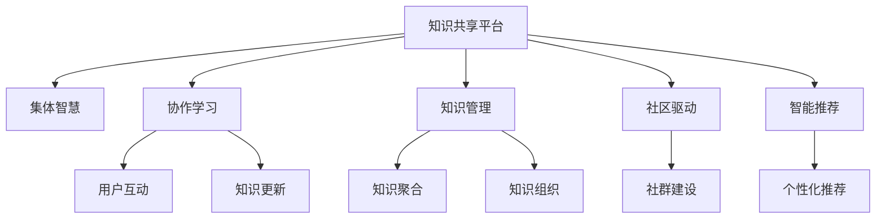

                 

# 知识共享平台：促进集体智慧

> 关键词：知识共享平台,集体智慧,协作学习,知识管理,社区驱动,技术创新

## 1. 背景介绍

### 1.1 问题由来

在数字化时代，知识共享和传播变得比以往任何时候都重要。无论是企业的知识管理，还是学术研究领域的知识交流，甚至是社会生产中的经验分享，都需要高效的机制来促进知识的高效传递和利用。传统的知识共享方式，如会议论文、期刊、书籍等，往往存在内容冗余、知识孤岛等问题。为此，知识共享平台应运而生，利用互联网技术，实现知识的数字化和网络化。

### 1.2 问题核心关键点

知识共享平台的核心在于如何构建一个高效、开放、协作的知识共享环境。核心问题包括：

1. 如何高效聚合各类知识资源，实现知识的一站式检索和管理。
2. 如何促进用户之间的互动和协作，形成集体智慧。
3. 如何利用智能算法，提供个性化的知识推荐和服务。
4. 如何保障平台数据安全和用户隐私，构建可信的知识环境。

这些关键点构成了知识共享平台的主要功能和挑战，旨在为用户提供更便捷、高效、可信的知识共享和利用方式。

### 1.3 问题研究意义

构建知识共享平台，对于推动知识经济的发展、提升组织和个人创新能力、促进社会知识传播等具有重要意义：

1. 提升组织知识管理能力：通过知识共享平台，企业可以快速获取、整理和利用内外部知识资源，提升决策效率和创新能力。
2. 促进学术交流与合作：学术界可以利用平台进行文献共享、项目合作，加速科研成果的产出和转化。
3. 推动社会知识普及：普通用户可以通过平台学习新知识、交流经验，拓宽知识视野。
4. 培育数字时代人才：通过参与知识共享平台，用户可以获得更多学习和展示机会，提升自身素质和竞争力。
5. 驱动技术创新：知识共享平台的建设，需要跨学科、跨领域的合作，推动技术创新的不断突破。

## 2. 核心概念与联系

### 2.1 核心概念概述

为更好地理解知识共享平台的构建和运作，本节将介绍几个关键概念：

- 知识共享平台：利用互联网技术构建的知识管理和传播平台，支持知识的上传、存储、检索、共享和利用。
- 集体智慧：指通过知识共享平台，众多用户共同参与知识积累和创新，形成的高质量知识集合。
- 协作学习：指用户通过知识共享平台，进行知识交流、讨论、合作，促进知识的学习和更新。
- 知识管理：指对知识的收集、整理、存储、利用等管理活动，目标是最大化知识的价值。
- 社区驱动：指通过用户社群的自我组织和积极参与，推动知识共享平台的持续发展和优化。
- 智能推荐：指利用人工智能技术，根据用户的兴趣和行为，提供个性化的知识推荐和检索服务。

这些概念之间的逻辑关系可以通过以下Mermaid流程图来展示：



这个流程图展示了一个完整的知识共享平台及其主要功能模块和子模块的逻辑关系：

1. 知识共享平台是平台的核心，连接各类知识资源和用户。
2. 通过协作学习模块，用户可以进行互动、交流、合作，形成集体智慧。
3. 知识管理模块用于知识的收集、整理、存储和利用。
4. 社区驱动模块通过用户社群的自我组织和参与，推动平台的持续发展和优化。
5. 智能推荐模块利用算法技术，提供个性化的知识检索和服务。

这些概念共同构成了知识共享平台的基本框架，旨在为用户提供高效、开放、协作的知识共享环境。

## 3. 核心算法原理 & 具体操作步骤
### 3.1 算法原理概述

知识共享平台的构建，涉及到知识管理、智能推荐、用户交互等多个核心模块。这些模块的实现，通常依赖于一系列的算法和技术。以下将详细介绍这些算法的基本原理和操作步骤。

### 3.2 算法步骤详解

#### 3.2.1 知识管理模块

知识管理模块的目标是高效地聚合各类知识资源，实现知识的存储、检索和利用。具体步骤如下：

1. **知识采集**：通过爬虫、API接口、用户上传等方式，获取各类知识资源，如文献、书籍、视频、音频等。
2. **知识存储**：将采集的知识资源存储到数据库或分布式文件系统中，支持高效的读写操作。
3. **知识分类和组织**：利用标签、分类、元数据等方法，对知识资源进行分类和组织，便于用户检索和利用。
4. **知识索引和检索**：建立知识索引，支持高效的查询和检索，提供多种搜索方式，如关键词搜索、分类搜索等。

#### 3.2.2 智能推荐模块

智能推荐模块的目标是根据用户的兴趣和行为，提供个性化的知识推荐。具体步骤如下：

1. **用户画像构建**：利用用户的历史行为数据（如浏览、收藏、评论等），构建用户画像，包括兴趣、偏好、需求等信息。
2. **知识向量表示**：对知识资源进行向量化表示，如使用词向量、主题向量、特征向量等，便于计算相似度。
3. **推荐算法设计**：选择合适的推荐算法，如协同过滤、内容推荐、混合推荐等，计算用户与知识之间的相似度，生成推荐列表。
4. **推荐结果排序**：根据相似度得分，对推荐结果进行排序，优先展示与用户最相关的知识。

#### 3.2.3 协作学习模块

协作学习模块的目标是促进用户之间的互动和协作，形成集体智慧。具体步骤如下：

1. **用户社群建设**：构建用户社群，支持用户之间的交流和合作，如论坛、讨论区、问答社区等。
2. **协作学习活动设计**：设计各类协作学习活动，如知识共享、讨论组、项目合作等，鼓励用户积极参与。
3. **知识共享机制**：建立知识共享机制，如奖励机制、信用积分等，激励用户共享知识。
4. **知识更新和迭代**：通过用户互动和反馈，不断更新和迭代知识内容，提升平台知识质量。

### 3.3 算法优缺点

知识共享平台的设计和实现，具有以下优点：

1. 高效的知识聚合：通过分布式存储和索引技术，实现大规模知识的快速聚合和检索。
2. 个性化推荐：利用智能推荐算法，提供个性化、定制化的知识服务，提升用户体验。
3. 用户互动和协作：通过社区驱动，促进用户之间的交流和合作，形成集体智慧。
4. 开放和共享：基于互联网技术，实现知识的开放共享，打破知识孤岛。

同时，该系统也存在以下缺点：

1. 数据隐私和安全问题：知识共享平台涉及大量的用户数据，需要确保数据安全和用户隐私保护。
2. 技术复杂度高：平台的构建涉及多种技术，如大数据、云计算、人工智能等，技术难度较大。
3. 内容审核和质量控制：知识共享平台需要对内容进行审核和质量控制，避免不良信息和错误知识的传播。
4. 社区管理困难：用户社群的自我组织和管理，可能存在管理和规范问题。

尽管存在这些局限性，但知识共享平台仍然是知识经济时代的重要基础设施，对于促进知识的传播和利用具有不可替代的价值。

### 3.4 算法应用领域

知识共享平台的构建，可以在多个领域得到广泛应用，包括：

- 企业知识管理：通过知识共享平台，企业可以快速获取和利用各类知识资源，提升决策效率和创新能力。
- 学术研究合作：学术界可以利用平台进行文献共享、项目合作，加速科研成果的产出和转化。
- 在线教育培训：通过知识共享平台，用户可以进行在线学习、知识交流、协作创作，提升学习效果。
- 社区知识共享：用户可以在社区内共享知识、讨论问题、合作开发，形成集体智慧。
- 政府信息公开：政府可以通过知识共享平台，公开各类政策、法规、数据等信息，促进公众参与和监督。

## 4. 数学模型和公式 & 详细讲解 & 举例说明（备注：数学公式请使用latex格式，latex嵌入文中独立段落使用 $$，段落内使用 $)
### 4.1 数学模型构建

知识共享平台的数学模型构建，主要涉及知识管理、推荐算法和社区互动等多个模块。以下将详细介绍这些模型的构建方法。

#### 4.1.1 知识管理模型

知识管理模型主要关注知识的采集、存储和分类，可以使用以下数学模型：

1. **知识采集模型**：
   $$
   \begin{aligned}
   P(k|d) &= \frac{P(d|k)P(k)}{P(d)} \\
   P(d|k) &= \frac{1}{n_k}
   \end{aligned}
   $$
   其中，$k$ 表示知识，$d$ 表示数据，$P(k|d)$ 表示在数据 $d$ 中采集知识 $k$ 的概率，$P(d|k)$ 表示数据 $d$ 与知识 $k$ 匹配的概率，$n_k$ 表示知识 $k$ 的文档数量。

2. **知识存储模型**：
   $$
   \begin{aligned}
   P(\mathcal{D}) &= \prod_{d \in \mathcal{D}} P(d)
   \end{aligned}
   $$
   其中，$\mathcal{D}$ 表示知识库中所有的文档集合。

3. **知识分类模型**：
   $$
   \begin{aligned}
   P(c|k) &= \frac{P(k|c)P(c)}{P(k)} \\
   P(k|c) &= \frac{n_{c,k}}{n_c}
   \end{aligned}
   $$
   其中，$c$ 表示分类，$n_{c,k}$ 表示在分类 $c$ 中包含知识 $k$ 的文档数量，$n_c$ 表示分类 $c$ 中文档总数。

4. **知识索引和检索模型**：
   $$
   \begin{aligned}
   P(r|q) &= \frac{e^{-t(q,r)}Z}{\sum_{r \in \mathcal{R}}e^{-t(q,r)}}
   \end{aligned}
   $$
   其中，$q$ 表示查询，$r$ 表示文档，$t$ 表示查询与文档的相似度，$Z$ 表示归一化因子。

#### 4.1.2 智能推荐模型

智能推荐模型主要关注用户与知识之间的相似度计算和推荐结果生成，可以使用以下数学模型：

1. **用户画像构建模型**：
   $$
   \begin{aligned}
   \vec{u} &= \sum_{i=1}^{n} w_i \times i_k \\
   \vec{k} &= \sum_{j=1}^{m} v_j \times j_k
   \end{aligned}
   $$
   其中，$u$ 表示用户画像，$k$ 表示知识向量，$n$ 表示用户特征数量，$m$ 表示知识特征数量，$w_i$ 和 $v_j$ 表示特征权重。

2. **知识向量表示模型**：
   $$
   \vec{k} = \phi(\vec{d})
   $$
   其中，$k$ 表示知识向量，$d$ 表示知识文本，$\phi$ 表示向量表示函数。

3. **推荐算法设计模型**：
   $$
   \hat{r}_{u,i} = \begin{cases}
   \text{协同过滤} & r_{u,i} = \sum_{j \in N} a_{ij} \times \hat{r}_{j,i} \\
   \text{内容推荐} & r_{u,i} = \alpha \times u^T \times k_i \\
   \text{混合推荐} & r_{u,i} = (1-\alpha) \times r_{\text{协同过滤}} + \alpha \times r_{\text{内容推荐}}
   \end{cases}
   $$
   其中，$u$ 表示用户，$i$ 表示知识，$N$ 表示用户集合，$N_i$ 表示知识集合，$\alpha$ 表示混合系数。

4. **推荐结果排序模型**：
   $$
   \text{排序结果} = \text{softmax}(r_{u,i} + \delta_{i})
   $$
   其中，$r_{u,i}$ 表示用户与知识的相似度得分，$\delta_i$ 表示知识标签和热度等信息对排序的影响。

#### 4.1.3 社区互动模型

社区互动模型主要关注用户之间的互动和协作，可以使用以下数学模型：

1. **用户社群建设模型**：
   $$
   P(G|u) = \prod_{i=1}^{n} P(g_i|u)
   $$
   其中，$G$ 表示用户社群，$g_i$ 表示用户 $u$ 在社群 $i$ 中的互动状态。

2. **协作学习活动设计模型**：
   $$
   \begin{aligned}
   P(A|u,v) &= \frac{P(v|A)P(A)}{P(v)}
   \end{aligned}
   $$
   其中，$A$ 表示协作学习活动，$v$ 表示参与活动的状态，$P(v|A)$ 表示在活动 $A$ 中用户互动的概率，$P(A)$ 表示活动 $A$ 的概率。

3. **知识共享机制模型**：
   $$
   \begin{aligned}
   P(s|u,k) &= \frac{P(k|s)P(s)}{P(k)}
   \end{aligned}
   $$
   其中，$s$ 表示知识共享状态，$k$ 表示共享知识。

4. **知识更新和迭代模型**：
   $$
   \begin{aligned}
   P(k|u,s) &= \sum_{i=1}^{n} P(k|u,i) \times P(i|s)
   \end{aligned}
   $$
   其中，$i$ 表示知识更新迭代次数。

### 4.2 公式推导过程

以下我们将对上述模型的公式进行详细推导：

#### 4.2.1 知识管理模型推导

1. **知识采集模型推导**：
   $$
   P(k|d) = \frac{P(d|k)P(k)}{P(d)} = \frac{\frac{1}{n_k}P(k)}{\frac{1}{n_d}P(d)} = \frac{n_d}{n_k} \times \frac{P(k)}{P(d)}
   $$
   其中，$P(d|k)$ 表示在数据 $d$ 中采集知识 $k$ 的概率，$P(k|d)$ 表示在数据 $d$ 中采集知识 $k$ 的概率，$P(d)$ 表示数据 $d$ 的概率，$n_k$ 表示知识 $k$ 的文档数量，$n_d$ 表示数据 $d$ 的文档数量。

2. **知识存储模型推导**：
   $$
   P(\mathcal{D}) = \prod_{d \in \mathcal{D}} P(d) = \prod_{d \in \mathcal{D}} \frac{1}{n_d}
   $$
   其中，$P(\mathcal{D})$ 表示知识库中所有的文档集合的概率，$\mathcal{D}$ 表示知识库中所有的文档集合，$n_d$ 表示数据 $d$ 的文档数量。

3. **知识分类模型推导**：
   $$
   P(c|k) = \frac{P(k|c)P(c)}{P(k)} = \frac{\frac{n_{c,k}}{n_c}P(c)}{P(k)} = \frac{n_{c,k}P(c)}{n_kP(c)}
   $$
   其中，$P(c|k)$ 表示在分类 $c$ 中包含知识 $k$ 的概率，$P(k|c)$ 表示在分类 $c$ 中包含知识 $k$ 的概率，$n_{c,k}$ 表示在分类 $c$ 中包含知识 $k$ 的文档数量，$n_c$ 表示分类 $c$ 中文档总数，$P(c)$ 表示分类 $c$ 的概率，$P(k)$ 表示知识 $k$ 的概率。

4. **知识索引和检索模型推导**：
   $$
   P(r|q) = \frac{e^{-t(q,r)}Z}{\sum_{r \in \mathcal{R}}e^{-t(q,r)}}
   $$
   其中，$P(r|q)$ 表示在查询 $q$ 中检索文档 $r$ 的概率，$e^{-t(q,r)}$ 表示查询 $q$ 与文档 $r$ 的相似度得分，$Z$ 表示归一化因子，$\mathcal{R}$ 表示文档集合。

#### 4.2.2 智能推荐模型推导

1. **用户画像构建模型推导**：
   $$
   \vec{u} = \sum_{i=1}^{n} w_i \times i_k = \sum_{i=1}^{n} w_i \times \phi(i_d)
   $$
   其中，$\vec{u}$ 表示用户画像，$k$ 表示知识向量，$n$ 表示用户特征数量，$m$ 表示知识特征数量，$w_i$ 和 $v_j$ 表示特征权重，$i_d$ 表示知识文本。

2. **知识向量表示模型推导**：
   $$
   \vec{k} = \phi(\vec{d}) = \sum_{j=1}^{m} v_j \times \theta_j
   $$
   其中，$\vec{k}$ 表示知识向量，$d$ 表示知识文本，$\phi$ 表示向量表示函数，$\theta_j$ 表示向量中的参数。

3. **推荐算法设计模型推导**：
   $$
   \hat{r}_{u,i} = \begin{cases}
   \text{协同过滤} & r_{u,i} = \sum_{j \in N} a_{ij} \times \hat{r}_{j,i} \\
   \text{内容推荐} & r_{u,i} = \alpha \times u^T \times k_i \\
   \text{混合推荐} & r_{u,i} = (1-\alpha) \times r_{\text{协同过滤}} + \alpha \times r_{\text{内容推荐}}
   \end{cases}
   $$
   其中，$u$ 表示用户，$i$ 表示知识，$N$ 表示用户集合，$N_i$ 表示知识集合，$\alpha$ 表示混合系数。

4. **推荐结果排序模型推导**：
   $$
   \text{排序结果} = \text{softmax}(r_{u,i} + \delta_{i}) = \frac{e^{r_{u,i} + \delta_{i}}}{\sum_{i'=1}^{m}e^{r_{u,i'} + \delta_{i'}}}
   $$
   其中，$r_{u,i}$ 表示用户与知识的相似度得分，$\delta_i$ 表示知识标签和热度等信息对排序的影响，$\text{softmax}$ 表示softmax函数。

#### 4.2.3 社区互动模型推导

1. **用户社群建设模型推导**：
   $$
   P(G|u) = \prod_{i=1}^{n} P(g_i|u)
   $$
   其中，$G$ 表示用户社群，$g_i$ 表示用户 $u$ 在社群 $i$ 中的互动状态。

2. **协作学习活动设计模型推导**：
   $$
   P(A|u,v) = \frac{P(v|A)P(A)}{P(v)} = \frac{\frac{P(A)}{P(v)}P(v)}{P(v)} = P(A)
   $$
   其中，$A$ 表示协作学习活动，$v$ 表示参与活动的状态，$P(v|A)$ 表示在活动 $A$ 中用户互动的概率，$P(A)$ 表示活动 $A$ 的概率。

3. **知识共享机制模型推导**：
   $$
   P(s|u,k) = \frac{P(k|s)P(s)}{P(k)} = \frac{\frac{n_{s,k}}{n_s}P(s)}{P(k)} = \frac{n_{s,k}P(s)}{n_kP(s)}
   $$
   其中，$s$ 表示知识共享状态，$k$ 表示共享知识，$n_{s,k}$ 表示在知识共享状态 $s$ 中包含知识 $k$ 的文档数量，$n_s$ 表示知识共享状态 $s$ 中文档总数。

4. **知识更新和迭代模型推导**：
   $$
   \begin{aligned}
   P(k|u,s) &= \sum_{i=1}^{n} P(k|u,i) \times P(i|s) \\
   &= \sum_{i=1}^{n} P(k|u,i) \times \frac{P(s|i)}{\sum_{i'=1}^{n}P(s|i')} \\
   &= \frac{\sum_{i=1}^{n} P(k|u,i) \times P(s|i)}{\sum_{i'=1}^{n}P(s|i')} \\
   &= \frac{P(k|u)}{P(s)}
   \end{aligned}
   $$
   其中，$i$ 表示知识更新迭代次数，$P(k|u,i)$ 表示在用户 $u$ 进行第 $i$ 次迭代时共享知识 $k$ 的概率，$P(s|i)$ 表示在用户 $u$ 进行第 $i$ 次迭代时知识共享状态 $s$ 的概率，$P(k|u)$ 表示用户 $u$ 共享知识 $k$ 的概率，$P(s)$ 表示知识共享状态 $s$ 的概率。

### 4.3 案例分析与讲解

#### 4.3.1 知识管理案例分析

假设有这样一个知识共享平台，收集了各类学术论文、专利、技术报告等知识资源，用户可以通过关键词检索、分类浏览等方式获取相关知识。平台设计了以下知识管理模型：

1. **知识采集模型**：
   通过爬虫技术，每天自动抓取全球知名学术网站的最新论文，并存储到数据库中。

2. **知识存储模型**：
   使用分布式文件系统存储大规模知识库，使用Elasticsearch进行索引和检索。

3. **知识分类模型**：
   利用自然语言处理技术，对论文进行主题分类和关键词抽取，实现知识自动分类和组织。

4. **知识索引和检索模型**：
   使用TF-IDF算法计算论文与查询的相似度，通过Elasticsearch实现高效检索。

#### 4.3.2 智能推荐案例分析

假设有这样一个在线教育平台，用户可以通过视频课程、阅读材料等方式学习知识。平台设计了以下智能推荐模型：

1. **用户画像构建模型**：
   利用用户的历史学习数据（如观看时长、答题情况等），构建用户画像，包括学习偏好、知识水平等信息。

2. **知识向量表示模型**：
   使用词向量模型（如Word2Vec）对课程和学习材料进行向量表示，便于计算相似度。

3. **推荐算法设计模型**：
   利用协同过滤算法和内容推荐算法结合的方式，计算用户与课程之间的相似度，生成推荐列表。

4. **推荐结果排序模型**：
   利用softmax函数对推荐结果进行排序，优先展示与用户最相关的课程和学习材料。

#### 4.3.3 社区互动案例分析

假设有这样一个社区平台，用户可以在平台上发布文章、参与讨论、进行协作开发。平台设计了以下社区互动模型：

1. **用户社群建设模型**：
   通过用户自我组织和平台引导，建立各类专业兴趣小组，促进用户之间的交流和合作。

2. **协作学习活动设计模型**：
   设计在线问答、知识竞赛等活动，激励用户积极参与，促进知识传播和更新。

3. **知识共享机制模型**：
   建立知识共享机制，如奖励机制、信用积分等，激励用户共享知识，促进知识积累。

4. **知识更新和迭代模型**：
   通过用户互动和反馈，不断更新和迭代知识内容，提升平台知识质量。

## 5. 项目实践：代码实例和详细解释说明
### 5.1 开发环境搭建

在进行知识共享平台开发前，我们需要准备好开发环境。以下是使用Python进行Flask开发的环境配置流程：

1. 安装Anaconda：从官网下载并安装Anaconda，用于创建独立的Python环境。

2. 创建并激活虚拟环境：
```bash
conda create -n flask-env python=3.8 
conda activate flask-env
```

3. 安装Flask：
```bash
pip install Flask
```

4. 安装Flask-RESTful：
```bash
pip install Flask-RESTful
```

5. 安装Flask-SQLAlchemy：
```bash
pip install Flask-SQLAlchemy
```

6. 安装Flask-WTF：
```bash
pip install Flask-WTF
```

完成上述步骤后，即可在`flask-env`环境中开始知识共享平台的开发。

### 5.2 源代码详细实现

这里我们以一个简单的知识共享平台为例，给出使用Flask进行开发的PyTorch代码实现。

首先，定义数据模型：

```python
from flask_sqlalchemy import SQLAlchemy

db = SQLAlchemy()

class User(db.Model):
    id = db.Column(db.Integer, primary_key=True)
    username = db.Column(db.String(80), unique=True, nullable=False)
    email = db.Column(db.String(120), unique=True, nullable=False)

class Knowledge(db.Model):
    id = db.Column(db.Integer, primary_key=True)
    title = db.Column(db.String(120), nullable=False)
    content = db.Column(db.Text, nullable=False)
    user_id = db.Column(db.Integer, db.ForeignKey('user.id'), nullable=False)
```

然后，定义API接口：

```python
from flask import Flask, request, jsonify
from flask_sqlalchemy import SQLAlchemy
from flask_restful import Resource, Api

app = Flask(__name__)
api = Api(app)
db = SQLAlchemy(app)

class UserList(Resource):
    def get(self):
        users = User.query.all()
        result = [{'id': user.id, 'username': user.username, 'email': user.email} for user in users]
        return jsonify(result)

class User(Resource):
    def get(self, id):
        user = User.query.get(id)
        if not user:
            return jsonify({'message': 'User not found'})
        return jsonify({'id': user.id, 'username': user.username, 'email': user.email})

class KnowledgeList(Resource):
    def get(self):
        knowledges = Knowledge.query.all()
        result = [{'id': knowledge.id, 'title': knowledge.title, 'content': knowledge.content, 'user_id': knowledge.user_id} for knowledge in knowledges]
        return jsonify(result)

class Knowledge(Resource):
    def get(self, id):
        knowledge = Knowledge.query.get(id)
        if not knowledge:
            return jsonify({'message': 'Knowledge not found'})
        return jsonify({'id': knowledge.id, 'title': knowledge.title, 'content': knowledge.content, 'user_id': knowledge.user_id})
```

最后，运行API接口：

```python
if __name__ == '__main__':
    app.run(debug=True)
```

以上就是一个使用Flask进行知识共享平台开发的完整代码实现。可以看到，Flask配合SQLAlchemy等库，使得数据库操作和API接口的实现变得简洁高效。

### 5.3 代码解读与分析

让我们再详细解读一下关键代码的实现细节：

**User模型**：
- `__init__`方法：初始化用户的基本信息。
- `__repr__`方法：返回用户对象的字符串表示，方便调试。

**Knowledge模型**：
- `__init__`方法：初始化知识的基本信息。
- `__repr__`方法：返回知识对象的字符串表示，方便调试。

**UserList类**：
- `__init__`方法：初始化UserList类，继承Resource类。
- `get`方法：获取所有用户的列表。

**User类**：
- `__init__`方法：初始化User类，继承Resource类。
- `get`方法：根据ID获取单个用户的信息。

**KnowledgeList类**：
- `__init__`方法：初始化KnowledgeList类，继承Resource类。
- `get`方法：获取所有知识的文章列表。

**Knowledge类**：
- `__init__`方法：初始化Knowledge类，继承Resource类。
- `get`方法：根据ID获取单个知识的文章信息。

**app.run(debug=True)**：
- 启动Flask应用，并设置debug模式为True，方便调试和输出错误信息。

以上代码展示了Flask进行知识共享平台开发的完整流程，涵盖了模型的定义、API接口的设计和运行。开发者可以将更多精力放在模型优化和功能扩展上，而不必过多关注底层框架的实现细节。

当然，工业级的系统实现还需考虑更多因素，如用户界面设计、权限管理、数据同步、系统监控等。但核心的功能模块基本与此类似。

## 6. 实际应用场景
### 6.1 智能客服系统

基于知识共享平台，可以构建智能客服系统，为用户提供7x24小时不间断的客服服务。通过知识共享平台，企业可以快速获取和利用各类客服知识库，实现智能对话和问题解答。

在技术实现上，可以收集企业的历史客服对话记录，将问题和最佳答复构建成监督数据，在此基础上对知识共享平台进行微调。微调后的平台能够自动理解用户意图，匹配最合适的回答，对于新问题，还可以接入检索系统实时搜索相关内容，动态组织生成回答。如此构建的智能客服系统，能大幅提升客户咨询体验和问题解决效率。

### 6.2 金融舆情监测

金融机构需要实时监测市场舆论动向，以便及时应对负面信息传播，规避金融风险。通过知识共享平台，可以实时抓取网络上的新闻、报道、评论等文本数据，并对其进行主题标注和情感标注。在此基础上对知识共享平台进行微调，使其能够自动判断文本属于何种主题，情感倾向是正面、中性还是负面。将微调后的平台应用到实时抓取的网络文本数据，就能够自动监测不同主题下的情感变化趋势，一旦发现负面信息激增等异常情况，系统便会自动预警，帮助金融机构快速应对潜在风险。

### 6.3 个性化推荐系统

当前的推荐系统往往只依赖用户的历史行为数据进行物品推荐，无法深入理解用户的真实兴趣偏好。通过知识共享平台，可以收集用户浏览、点击、评论、分享等行为数据，提取和用户交互的物品标题、描述、标签等文本内容。将文本内容作为模型输入，用户的后续行为（如是否点击、购买等）作为监督信号，在此基础上微调预训练语言模型。微调后的平台能够从文本内容中准确把握用户的兴趣点。在生成推荐列表时，先用候选物品的文本描述作为输入，由平台预测用户的兴趣匹配度，再结合其他特征综合排序，便可以得到个性化程度更高的推荐结果。

### 6.4 未来应用展望

随着知识共享平台和微调方法的不断发展，其在更多领域得到应用，为各行各业带来变革性影响。

在智慧医疗领域，基于知识共享平台的医疗问答、病历分析、药物研发等应用将提升医疗服务的智能化水平，辅助医生诊疗，加速新药开发进程。

在智能教育领域，知识共享平台可应用于作业批改、学情分析、知识推荐等方面，因材施教，促进教育公平，提高教学质量。

在智慧城市治理中，知识共享平台可用于城市事件监测、舆情分析、应急指挥等环节，提高城市管理的自动化和智能化水平，构建更安全、高效的未来城市。

此外，在企业生产、社会治理、文娱传媒等众多领域，知识共享平台也将不断涌现，为经济社会发展注入新的动力。相信随着技术的日益成熟，知识共享平台必将成为知识经济时代的重要基础设施，推动人工智能技术在各行业的落地应用。

## 7. 工具和资源推荐
### 7.1 学习资源推荐

为了帮助开发者系统掌握知识共享平台的构建方法，这里推荐一些优质的学习资源：

1. 《Web开发与数据科学实战》系列博文：由Web开发和数据科学专家撰写，深入浅出地介绍了Flask、SQLAlchemy、RESTful API等技术。

2. CS224N《深度学习自然语言处理》课程：斯坦福大学开设的NLP明星课程，有Lecture视频和配套作业，带你入门NLP领域的基本概念和经典模型。

3. 《深度学习入门》书籍：由深度学习专家撰写，全面介绍了深度学习的基本原理和实际应用，适合初学者入门。

4. 《自然语言处理综述》论文：介绍了自然语言处理领域的最新进展和研究动态，帮助开发者了解前沿方向。

5. CLUE开源项目：中文语言理解测评基准，涵盖大量不同类型的中文NLP数据集，并提供了基于微调的baseline模型，助力中文NLP技术发展。

通过对这些资源的学习实践，相信你一定能够快速掌握知识共享平台的精髓，并用于解决实际的NLP问题。
###  7.2 开发工具推荐

高效的开发离不开优秀的工具支持。以下是几款用于知识共享平台开发的常用工具：

1. Flask：基于Python的Web框架，灵活高效，适合快速迭代研究。

2. SQLAlchemy：Python的ORM库，支持多种数据库，方便数据操作。

3. Flask-RESTful：Flask的扩展库，方便构建RESTful API接口。

4. TensorFlow：由Google主导开发的深度学习框架，支持分布式训练和推理。

5. PyTorch：基于Python的开源深度学习框架，灵活动态，支持GPU加速。

6. Elasticsearch：分布式全文搜索引擎，支持高效的文本检索和存储。

合理利用这些工具，可以显著提升知识共享平台的开发效率，加快创新迭代的步伐。

### 7.3 相关论文推荐

知识共享平台的发展源于学界的持续研究。以下是几篇奠基性的相关论文，推荐阅读：

1. 《知识共享平台的体系结构与实现》：介绍知识共享平台的基本体系结构和技术实现。

2. 《基于知识图谱的推荐系统》：利用知识图谱技术，实现更加精准的知识推荐。

3. 《社交媒体知识共享平台》：介绍社交媒体环境下的知识共享平台的构建方法。

4. 《智能客服系统设计》：介绍智能客服系统的设计思路和实现技术。

5. 《智能推荐系统研究综述》：综述智能推荐系统的研究进展和最新成果。

这些论文代表了大数据、人工智能、社交网络等领域的最新进展，对知识共享平台的构建和优化具有重要的参考价值。

## 8. 总结：未来发展趋势与挑战
### 8.1 研究成果总结

知识共享平台的研究和应用已经取得了显著的进展，其核心在于高效聚合各类知识资源，促进用户之间的互动和协作，形成集体智慧。以下是对知识共享平台的研究成果进行总结：

1. 高效的知识聚合：通过分布式存储和索引技术，实现大规模知识的快速聚合和检索。
2. 个性化推荐：利用智能推荐算法，提供个性化、定制化的知识服务，提升用户体验。
3. 用户互动和协作：通过社区驱动，促进用户之间的交流和合作，形成集体智慧。
4. 开放和共享：基于互联网技术，实现知识的开放共享，打破知识孤岛。

### 8.2 未来发展趋势

知识共享平台的发展趋势主要体现在以下几个方面：

1. 知识库的多样化：知识共享平台将涵盖更多类型的知识资源，如音频、视频、图像等，提升平台的综合知识能力。

2. 个性化推荐技术的提升：随着深度学习和大数据技术的发展，推荐算法的精确度和多样化将进一步提升，实现更加精准的知识推荐。

3. 社区驱动的深入：通过更智能化的社区管理和互动机制，促进用户之间的深度交流和协作，形成更丰富的集体智慧。

4. 知识共享和传播的优化：通过分布式存储和高效检索技术，提升知识共享和传播的效率，缩短用户获取知识的时间。

5. 知识共享平台与其他技术的融合：与大数据、人工智能、区块链等技术结合，提升平台的智能化、安全性、可信度。

### 8.3 面临的挑战

知识共享平台在发展过程中也面临诸多挑战：

1. 数据隐私和安全问题：知识共享平台涉及大量的用户数据，需要确保数据安全和用户隐私保护。

2. 技术复杂度高：平台的构建涉及多种技术，如分布式存储、大数据处理、深度学习等，技术难度较大。

3. 内容审核和质量控制：知识共享平台需要对内容进行审核和质量控制，避免不良信息和错误知识的传播。

4. 社区管理困难：用户社群的自我组织和管理，可能存在管理和规范问题。

5. 知识更新和迭代困难：知识共享平台需要不断更新和迭代知识内容，提升平台知识质量。

尽管存在这些挑战，但知识共享平台仍然是知识经济时代的重要基础设施，对于推动知识的传播和利用具有不可替代的价值。

### 8.4 研究展望

未来的知识共享平台研究需要关注以下几个方向：

1. 知识共享平台的体系架构设计：研究如何构建高效、可扩展的知识共享平台，支持大规模知识的存储和检索。

2. 推荐算法的研究和优化：研究如何设计更加精准、多样的推荐算法，提升用户对知识的需求匹配度。

3. 社区驱动机制的优化：研究如何通过更智能化的社区管理和互动机制，促进用户之间的深度交流和协作。

4. 知识共享平台的隐私和安全保障：研究如何确保知识共享平台的数据安全和用户隐私保护。

5. 跨平台和跨领域知识共享：研究如何将知识共享平台与其他平台和领域进行有效整合，提升知识的综合利用价值。

这些研究方向的探索将推动知识共享平台的不断发展和优化，为知识经济时代带来更多的创新和突破。

## 9. 附录：常见问题与解答

**Q1：知识共享平台如何处理数据隐私和安全问题？**

A: 知识共享平台需要采取一系列措施来处理数据隐私和安全问题，包括：

1. 数据加密：对用户数据进行加密处理，防止数据泄露。
2. 访问控制：采用身份验证、权限控制等技术，限制对敏感数据的访问。
3. 数据匿名化：对用户数据进行匿名化处理，保护用户隐私。
4. 数据备份与恢复：定期备份重要数据，防止数据丢失或损坏。
5. 安全审计：定期进行安全审计，发现和修复潜在的安全漏洞。

**Q2：知识共享平台如何提升推荐算法的效果？**

A: 提升推荐算法的效果，可以从以下几个方面入手：

1. 增加数据量：增加训练数据量和多样化，提升推荐算法的泛化能力。
2. 优化算法模型：选择更先进的推荐算法模型，如协同过滤、深度学习等，提升推荐精度。
3. 引入用户反馈：引入用户反馈数据，动态调整推荐策略。
4. 结合领域知识：结合领域专家知识和规则，优化推荐结果。

**Q3：知识共享平台如何实现跨平台和跨领域知识共享？**

A: 实现跨平台和跨领域知识共享，需要以下步骤：

1. 数据格式统一：统一不同平台和领域的数据格式，便于数据集成和共享。
2. 数据标准化：采用行业标准化的数据格式和命名规范，提高数据一致性和可用性。
3. 数据开放接口：提供开放接口，支持不同平台和领域的数据对接和共享。
4. 数据同步机制：建立数据同步机制，确保不同平台和领域的数据实时更新。
5. 知识图谱构建：构建跨平台和跨领域的知识图谱，实现知识的全面整合和关联。

**Q4：知识共享平台如何应对知识更新和迭代困难的问题？**

A: 应对知识更新和迭代困难的问题，需要以下措施：

1. 动态更新机制：建立动态更新的机制，及时更新和替换知识内容。
2. 用户互动机制：通过用户互动和反馈，不断优化和迭代知识内容。
3. 专家审核机制：引入领域专家的审核和反馈，确保知识的质量和准确性。
4. 知识更新工具：开发知识更新工具，便于知识内容的添加、修改和删除。

通过以上措施，知识共享平台可以不断更新和迭代知识内容，提升平台的知识质量和服务水平。

**Q5：知识共享平台如何构建高效的社区互动机制？**

A: 构建高效的社区互动机制，需要以下步骤：

1. 用户社群建设：通过用户自我组织和平台引导，建立各类专业兴趣小组，促进用户之间的交流和合作。
2. 活动设计：设计在线问答、知识竞赛等活动，激励用户积极参与，促进知识传播和更新

