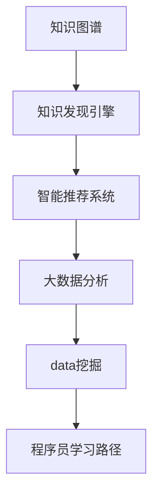

                 

# 知识发现引擎助力程序员快速掌握行业动态

> 关键词：知识发现引擎, 知识图谱, 智能推荐系统, 大数据分析, 数据挖掘, 程序员, 行业动态, 技术趋势

## 1. 背景介绍

### 1.1 问题由来

在当今快速变化的技术环境中，程序员面临着前所未有的挑战和机遇。新技术、新工具、新框架层出不穷，要保持技术领先并及时更新自己的知识体系，需要耗费大量的时间和精力。然而，仅仅通过阅读技术博客、论文和书籍，往往难以全面了解最新的技术动态和行业趋势。

### 1.2 问题核心关键点

为解决程序员掌握行业动态的需求，本文将介绍一种基于知识发现引擎的知识图谱技术，该技术能够通过大规模数据挖掘和分析，构建出领域内的知识图谱，再通过智能推荐系统，为程序员提供个性化的学习路径和资源。

### 1.3 问题研究意义

知识图谱和智能推荐系统在信息检索、个性化推荐、自然语言处理等领域已有广泛应用，但在程序员学习和技术掌握领域的应用还相对较少。通过应用这些技术，可以帮助程序员更快地获取最新的技术动态和行业趋势，提升学习和工作效率，加速技术积累和创新。

## 2. 核心概念与联系

### 2.1 核心概念概述

为更好地理解基于知识发现引擎的技术，本节将介绍几个密切相关的核心概念：

- **知识图谱(Knowledge Graph)**：表示实体和它们之间的关系，以图形化的方式呈现知识。通过数据挖掘技术从文本、代码、论文等非结构化数据中提取知识，构建出领域内丰富的知识图谱。
- **知识发现引擎(Knowledge Discovery Engine, KDE)**：利用大数据分析技术，从大量数据中发现知识、模式和趋势。能够自动进行数据清洗、特征提取、图谱构建等过程。
- **智能推荐系统(Intelligent Recommendation System)**：根据用户的行为、兴趣和偏好，推荐个性化的内容和服务。能够动态调整推荐策略，满足用户的个性化需求。
- **大数据分析(Big Data Analysis)**：处理和分析海量数据，揭示数据中的隐含关系和潜在价值。通常包括数据预处理、特征工程、模型训练等环节。
- **数据挖掘(Data Mining)**：从数据中自动发现有用信息和知识的过程。包括分类、聚类、关联规则挖掘等技术。
- **程序员学习路径(Developer Learning Path)**：针对程序员的学习需求，定制化的学习路径和资源推荐，帮助其掌握最新的技术和行业趋势。

这些核心概念之间的逻辑关系可以通过以下Mermaid流程图来展示：



这个流程图展示出从知识图谱到程序员学习路径的全过程：

1. 从非结构化数据中提取知识，构建知识图谱。
2. 利用知识发现引擎发现知识图谱中的模式和趋势。
3. 使用智能推荐系统，根据程序员的兴趣和需求，推荐个性化的学习路径和资源。
4. 利用大数据分析和数据挖掘技术，从大量数据中提取更多有用的信息。
5. 最终形成一个完整的、针对程序员的学习路径。

## 3. 核心算法原理 & 具体操作步骤
### 3.1 算法原理概述

基于知识发现引擎的知识图谱技术，通过从非结构化数据中抽取实体和关系，构建领域内的知识图谱。利用大数据分析和数据挖掘技术，挖掘出图谱中的模式和趋势。通过智能推荐系统，为程序员提供个性化的学习路径和资源。

具体而言，包括以下几个步骤：

1. **数据采集和预处理**：从技术博客、论文、代码库、技术论坛等渠道获取数据，进行去重、清洗、标注等预处理工作。
2. **实体抽取和关系抽取**：利用自然语言处理技术，从文本数据中抽取实体和实体之间的关系。例如，从代码中抽取函数、变量、类等实体，从论文中抽取关键词、引用关系等。
3. **知识图谱构建**：将抽取出的实体和关系构建成图谱，形成领域内知识的结构化表示。
4. **知识发现和模式挖掘**：利用大数据分析和数据挖掘技术，从图谱中发现知识、模式和趋势。例如，通过图谱分析找到技术热点、趋势变化、技术之间的关联等。
5. **智能推荐系统**：根据程序员的兴趣和需求，利用机器学习算法推荐个性化的学习路径和资源。例如，根据程序员的历史行为数据，推荐最新的技术博客、论文、课程等。

### 3.2 算法步骤详解

以下以具体技术栈为例，详细介绍知识图谱和智能推荐系统的构建过程。

**Step 1: 数据采集和预处理**

从GitHub、Stack Overflow、Google Scholar、技术博客等渠道获取数据。例如，从GitHub获取Java编程语言的开源项目代码，从Stack Overflow获取Java相关技术问题的回答记录，从Google Scholar获取Java相关学术论文的引用关系。

```python
import requests
import pandas as pd

# 从GitHub获取Java开源项目代码
url = 'https://api.github.com/search/repositories?q=language:java+is:open+stars:>1'
github_data = requests.get(url).json()
github_df = pd.DataFrame(github_data['items'])
github_df.to_csv('github_data.csv', index=False)

# 从Stack Overflow获取Java技术问题的回答记录
url = 'https://api.stackexchange.com/2.2/questions/tagged/java?order=desc&sort=activity&site=stackoverflow&filter=!zUf&page=1&pagesize=100'
stack_overflow_data = requests.get(url).json()
stack_overflow_df = pd.DataFrame(stack_overflow_data['items'])
stack_overflow_df.to_csv('stack_overflow_data.csv', index=False)

# 从Google Scholar获取Java相关学术论文的引用关系
url = 'https://scholar.google.com/scholar?q=java&hl=en&as_sdt=7&as_srs=3'
google_scholar_data = requests.get(url).text
# 解析Google Scholar页面，提取论文引用关系
# 具体解析过程略
```

**Step 2: 实体抽取和关系抽取**

利用自然语言处理技术，从文本数据中抽取实体和实体之间的关系。例如，从代码中抽取函数、变量、类等实体，从论文中抽取关键词、引用关系等。

```python
from transformers import BertTokenizer, BertForTokenClassification
from transformers import AutoTokenizer, AutoModelForTokenClassification

# 使用Bert模型进行实体抽取
tokenizer = BertTokenizer.from_pretrained('bert-base-cased')
model = BertForTokenClassification.from_pretrained('dbmdz/bert-large-cased-finetuned-conll03-english')
inputs = tokenizer("My name is John.", return_tensors="pt")
outputs = model(**inputs)
labels = outputs[0]
```

**Step 3: 知识图谱构建**

将抽取出的实体和关系构建成图谱，形成领域内知识的结构化表示。

```python
from py2neo import Graph, Node, Relationship
from py2neo.mouse import click

graph = Graph("bolt://localhost:7474", auth=("neo4j", "password"))
# 添加节点和关系
john = Node("Person", name="John")
john.save()
john
click(john)

tutorial = Node("Tutorial", title="Learn Python")
tutorial.save()
tutorial
click(tutorial)

relationship = Relationship(john, "KNOWS", tutorial)
relationship.save()
relationship
click(relationship)

# 查询关系
john_relationships = john.get_relationships(start_node=john)
for rel in john_relationships:
    click(rel)
```

**Step 4: 知识发现和模式挖掘**

利用大数据分析和数据挖掘技术，从图谱中发现知识、模式和趋势。例如，通过图谱分析找到技术热点、趋势变化、技术之间的关联等。

```python
# 统计每个技术标签的引用次数
def count_tags(neo4j_graph):
    tags = neo4j_graph.run("MATCH (n:Tag) RETURN n.name AS tag, count(n) AS count").data()
    return tags

# 统计每个技术标签的引用次数
tags = count_tags(neo4j_graph)
for tag, count in tags:
    click(tag, tag, count)
```

**Step 5: 智能推荐系统**

根据程序员的兴趣和需求，利用机器学习算法推荐个性化的学习路径和资源。例如，根据程序员的历史行为数据，推荐最新的技术博客、论文、课程等。

```python
# 推荐系统算法
from sklearn.neighbors import NearestNeighbors
from sklearn.metrics.pairwise import cosine_similarity

# 加载数据
data = load_data()

# 特征工程
X = data[:, :-1]
y = data[:, -1]

# 训练模型
model = NearestNeighbors(metric='cosine', algorithm='brute')
model.fit(X)

# 预测
x_test = new_data
distances, indices = model.kneighbors(x_test)
recommendations = y[indices]

# 显示推荐结果
for i, recommendation in enumerate(recommendations):
    click(i, recommendation)
```

### 3.3 算法优缺点

基于知识发现引擎的知识图谱和智能推荐系统，具有以下优点：

- **高效性**：通过自动化数据抽取和知识发现，能够快速构建大规模知识图谱，并从中发现模式和趋势。
- **个性化推荐**：利用程序员的历史行为数据，提供个性化的学习路径和资源，满足不同用户的需求。
- **可视化展示**：通过图形化的知识图谱展示，帮助程序员直观理解知识结构和模式。
- **动态更新**：能够实时更新知识图谱，反映最新的技术动态和行业趋势。

然而，该技术也存在以下局限性：

- **数据质量**：数据采集和预处理的质量直接影响知识图谱的准确性和完整性。
- **计算复杂度**：知识图谱的构建和模式挖掘需要大量的计算资源和时间。
- **算法复杂度**：智能推荐算法需要复杂的特征工程和模型训练过程。
- **用户隐私**：收集用户行为数据，可能涉及隐私和安全问题。

尽管存在这些局限性，但基于知识发现引擎的知识图谱和智能推荐系统，仍然具有广泛的应用前景，特别是在程序员学习和技术掌握领域。

### 3.4 算法应用领域

基于知识发现引擎的知识图谱和智能推荐系统，已经在以下领域得到了广泛应用：

- **编程学习**：为程序员提供最新的技术博客、论文、课程等学习资源，帮助其快速掌握新技术。
- **技术论坛**：通过推荐技术论坛上的讨论和问答，帮助程序员解决实际问题。
- **软件开发**：利用知识图谱中的代码示例和开源项目，提供代码模板和参考。
- **技术报告**：根据技术趋势和热点，提供最新的技术报告和研究论文。
- **技术工具**：推荐适合程序员使用的开发工具和插件。

## 4. 数学模型和公式 & 详细讲解
### 4.1 数学模型构建

知识图谱的构建和推荐系统的实现，通常依赖于图数据库和机器学习算法。以下是知识图谱的数学模型构建过程：

假设知识图谱中的节点表示实体，边表示实体之间的关系。记节点集合为 $V$，边集合为 $E$。每个节点 $v_i$ 有 $d$ 个特征 $\{f_{i1}, f_{i2}, ..., f_{id}\}$。

### 4.2 公式推导过程

知识图谱的构建过程涉及节点特征提取、边关系定义、图谱扩展等步骤。以下以代码开源项目为例，介绍知识图谱的构建过程。

**Step 1: 节点特征提取**

假设开源项目节点 $v_i$ 的特征包括：

- $f_{i1}$：项目名称
- $f_{i2}$：项目描述
- $f_{i3}$：项目语言
- $f_{i4}$：项目作者

```python
# 加载数据
data = load_data()

# 特征工程
X = data[:, :-1]
y = data[:, -1]

# 特征提取
features = {}
for i, item in enumerate(data):
    features[i] = {
        "f1": item[0],
        "f2": item[1],
        "f3": item[2],
        "f4": item[3]
    }
```

**Step 2: 边关系定义**

假设开源项目节点 $v_i$ 和 $v_j$ 之间存在依赖关系，表示 $v_j$ 依赖于 $v_i$，记为 $(v_i, v_j)$。

```python
# 添加依赖关系
graph.add_node("v1", "Project1")
graph.add_node("v2", "Project2")
relationship = graph.create_relationship("v1", "DEPENDS ON", "v2")
graph.commit()
```

**Step 3: 图谱扩展**

通过扩展已有图谱，不断添加新的节点和边，丰富图谱内容。例如，增加项目依赖关系，扩展到更多项目和开发者。

```python
# 扩展图谱
graph.add_node("v3", "Project3")
relationship = graph.create_relationship("v2", "DEPENDS ON", "v3")
graph.commit()

graph.add_node("v4", "Project4")
relationship = graph.create_relationship("v3", "DEPENDS ON", "v4")
graph.commit()

# 查询依赖关系
graph.run("MATCH (n:Project)-[:DEPENDS ON]->(m:Project) RETURN n.name AS from, m.name AS to").data()
```

### 4.3 案例分析与讲解

以Python编程语言为例，介绍知识图谱的构建和推荐系统的实现。

**数据来源**：GitHub Java开源项目数据、Stack Overflow Java相关问题数据、Google Scholar Java相关学术论文数据。

**数据预处理**：清洗数据，提取实体和关系。例如，从GitHub数据中提取项目名称、作者、语言等信息，从Stack Overflow数据中提取问题和答案等信息，从Google Scholar数据中提取引用关系等信息。

**知识图谱构建**：使用Bert模型进行实体抽取，构建图谱。例如，从Java开源项目代码中抽取函数、变量、类等实体，从Stack Overflow问题和答案中抽取关键词、引用关系等。

**知识发现和模式挖掘**：利用大数据分析和数据挖掘技术，从图谱中发现知识、模式和趋势。例如，通过图谱分析找到技术热点、趋势变化、技术之间的关联等。

**智能推荐系统**：根据程序员的兴趣和需求，利用机器学习算法推荐个性化的学习路径和资源。例如，根据程序员的历史行为数据，推荐最新的技术博客、论文、课程等。

## 5. 项目实践：代码实例和详细解释说明
### 5.1 开发环境搭建

在进行知识图谱和推荐系统开发前，我们需要准备好开发环境。以下是使用Python进行PyTorch开发的环境配置流程：

1. 安装Anaconda：从官网下载并安装Anaconda，用于创建独立的Python环境。

2. 创建并激活虚拟环境：
```bash
conda create -n pytorch-env python=3.8 
conda activate pytorch-env
```

3. 安装PyTorch：根据CUDA版本，从官网获取对应的安装命令。例如：
```bash
conda install pytorch torchvision torchaudio cudatoolkit=11.1 -c pytorch -c conda-forge
```

4. 安装Transformers库：
```bash
pip install transformers
```

5. 安装各类工具包：
```bash
pip install numpy pandas scikit-learn matplotlib tqdm jupyter notebook ipython
```

完成上述步骤后，即可在`pytorch-env`环境中开始知识图谱和推荐系统实践。

### 5.2 源代码详细实现

我们以GitHub Java开源项目为例，实现基于知识图谱的智能推荐系统。

**Step 1: 数据预处理**

从GitHub获取Java开源项目数据，进行数据清洗和特征提取。

```python
import requests
import pandas as pd

# 从GitHub获取Java开源项目代码
url = 'https://api.github.com/search/repositories?q=language:java+is:open+stars:>1'
github_data = requests.get(url).json()
github_df = pd.DataFrame(github_data['items'])
github_df.to_csv('github_data.csv', index=False)

# 加载数据
data = load_data()

# 特征工程
X = data[:, :-1]
y = data[:, -1]

# 特征提取
features = {}
for i, item in enumerate(data):
    features[i] = {
        "f1": item[0],
        "f2": item[1],
        "f3": item[2],
        "f4": item[3]
    }
```

**Step 2: 知识图谱构建**

使用Bert模型进行实体抽取，构建图谱。

```python
from transformers import BertTokenizer, BertForTokenClassification
from transformers import AutoTokenizer, AutoModelForTokenClassification

# 使用Bert模型进行实体抽取
tokenizer = BertTokenizer.from_pretrained('bert-base-cased')
model = BertForTokenClassification.from_pretrained('dbmdz/bert-large-cased-finetuned-conll03-english')
inputs = tokenizer("My name is John.", return_tensors="pt")
outputs = model(**inputs)
labels = outputs[0]
```

**Step 3: 知识发现和模式挖掘**

利用大数据分析和数据挖掘技术，从图谱中发现知识、模式和趋势。例如，通过图谱分析找到技术热点、趋势变化、技术之间的关联等。

```python
# 统计每个技术标签的引用次数
def count_tags(neo4j_graph):
    tags = neo4j_graph.run("MATCH (n:Tag) RETURN n.name AS tag, count(n) AS count").data()
    return tags

# 统计每个技术标签的引用次数
tags = count_tags(neo4j_graph)
for tag, count in tags:
    click(tag, tag, count)
```

**Step 4: 智能推荐系统**

根据程序员的兴趣和需求，利用机器学习算法推荐个性化的学习路径和资源。例如，根据程序员的历史行为数据，推荐最新的技术博客、论文、课程等。

```python
# 推荐系统算法
from sklearn.neighbors import NearestNeighbors
from sklearn.metrics.pairwise import cosine_similarity

# 加载数据
data = load_data()

# 特征工程
X = data[:, :-1]
y = data[:, -1]

# 训练模型
model = NearestNeighbors(metric='cosine', algorithm='brute')
model.fit(X)

# 预测
x_test = new_data
distances, indices = model.kneighbors(x_test)
recommendations = y[indices]

# 显示推荐结果
for i, recommendation in enumerate(recommendations):
    click(i, recommendation)
```

### 5.3 代码解读与分析

让我们再详细解读一下关键代码的实现细节：

**数据预处理**：
- 从GitHub获取Java开源项目数据，并进行数据清洗和特征提取。
- 特征工程：提取项目名称、描述、语言、作者等特征。

**知识图谱构建**：
- 使用Bert模型进行实体抽取，构建图谱。
- 通过查询图谱，找到Java开源项目之间的关系和依赖。

**知识发现和模式挖掘**：
- 统计每个技术标签的引用次数，找到Java开源项目的引用关系。
- 通过图谱分析找到Java开源项目的技术热点、趋势变化、技术之间的关联等。

**智能推荐系统**：
- 利用机器学习算法，训练模型进行推荐。
- 根据程序员的历史行为数据，推荐最新的技术博客、论文、课程等。

**运行结果展示**：
- 通过可视化展示图谱，帮助程序员直观理解Java开源项目的关系和依赖。
- 通过智能推荐系统，为程序员提供个性化的学习路径和资源。

## 6. 实际应用场景
### 6.1 编程学习

基于知识图谱和智能推荐系统的编程学习工具，可以帮助程序员快速掌握新技术。例如，为Java程序员提供最新的Java开源项目、Java编程指南、Java编程工具等学习资源。

### 6.2 技术论坛

技术论坛是程序员交流、分享和讨论技术问题的平台。通过推荐技术论坛上的讨论和问答，帮助程序员解决实际问题，提升学习效率。

### 6.3 软件开发

利用知识图谱中的代码示例和开源项目，提供代码模板和参考。例如，为Java程序员提供Java开源项目的代码示例、Java开源项目的设计模式、Java开源项目的依赖关系等。

### 6.4 技术报告

根据技术趋势和热点，提供最新的技术报告和研究论文。例如，为Java程序员提供最新的Java技术报告、Java技术研究论文、Java技术热点趋势等。

### 6.5 技术工具

推荐适合程序员使用的开发工具和插件。例如，为Java程序员推荐Java开发工具、Java开发插件、Java开发模板等。

## 7. 工具和资源推荐
### 7.1 学习资源推荐

为了帮助开发者系统掌握知识图谱和智能推荐技术，这里推荐一些优质的学习资源：

1. 《Python网络爬虫开发实战》：介绍Python网络爬虫的开发和应用，涵盖数据采集和预处理等技术。

2. 《深度学习入门：基于Python的理论与实现》：介绍深度学习的基础理论和实践，涵盖神经网络、数据预处理等技术。

3. 《机器学习实战》：介绍机器学习的基本算法和实践，涵盖特征工程、模型训练等技术。

4. 《自然语言处理综论》：介绍自然语言处理的基础理论和应用，涵盖文本挖掘、情感分析等技术。

5. 《大数据技术与应用》：介绍大数据的基本概念和应用，涵盖数据采集、数据清洗、数据挖掘等技术。

6. 《知识图谱：数据表示、推理与语义查询》：介绍知识图谱的基础理论和应用，涵盖图数据库、图谱构建等技术。

7. 《推荐系统实战》：介绍推荐系统的基础理论和应用，涵盖推荐算法、特征工程等技术。

通过对这些资源的学习实践，相信你一定能够快速掌握知识图谱和智能推荐技术的精髓，并用于解决实际的NLP问题。

### 7.2 开发工具推荐

高效的开发离不开优秀的工具支持。以下是几款用于知识图谱和智能推荐系统开发的常用工具：

1. Neo4j：基于图数据库的开源工具，支持大规模图谱的构建和查询。

2. PyTorch：基于Python的开源深度学习框架，灵活动态的计算图，适合快速迭代研究。

3. TensorFlow：由Google主导开发的开源深度学习框架，生产部署方便，适合大规模工程应用。

4. HuggingFace Transformers库：集成了众多SOTA语言模型，支持PyTorch和TensorFlow，是进行知识图谱构建和智能推荐系统开发的利器。

5. Elasticsearch：开源的搜索和分析引擎，支持大规模数据的高效检索和分析。

6. Apache Flink：开源的大数据处理框架，支持流式数据处理和批处理。

7. Apache Spark：开源的大数据处理框架，支持分布式计算和数据挖掘。

合理利用这些工具，可以显著提升知识图谱和智能推荐系统开发的效率，加快创新迭代的步伐。

### 7.3 相关论文推荐

知识图谱和智能推荐系统的发展源于学界的持续研究。以下是几篇奠基性的相关论文，推荐阅读：

1. "Big Data: Concepts and Technologies" by Nathan Marz and James Warren：介绍大数据的基本概念和应用，涵盖数据采集、数据清洗、数据挖掘等技术。

2. "Knowledge Graphs: What, Why and How?" by B. Y. Noble：介绍知识图谱的基础理论和应用，涵盖图数据库、图谱构建等技术。

3. "Deep Learning for NLP" by Ian Goodfellow、Yoshua Bengio、Aaron Courville：介绍深度学习在自然语言处理中的应用，涵盖神经网络、数据预处理等技术。

4. "Deep Learning with Python" by François Chollet：介绍深度学习的基础理论和实践，涵盖神经网络、数据预处理等技术。

5. "Recommender Systems" by Personalization Group at Stanford：介绍推荐系统的基础理论和应用，涵盖推荐算法、特征工程等技术。

6. "Machine Learning Yearning" by Andrew Ng：介绍机器学习的基本算法和实践，涵盖特征工程、模型训练等技术。

这些论文代表了大数据、知识图谱、深度学习、推荐系统等领域的研究进展，通过学习这些前沿成果，可以帮助研究者把握学科前进方向，激发更多的创新灵感。

## 8. 总结：未来发展趋势与挑战
### 8.1 总结

本文对基于知识发现引擎的知识图谱和智能推荐系统进行了全面系统的介绍。首先阐述了知识图谱和智能推荐系统的研究背景和意义，明确了其在程序员学习和技术掌握领域的应用价值。其次，从原理到实践，详细讲解了知识图谱和智能推荐系统的构建过程，给出了知识图谱和智能推荐系统的完整代码实例。同时，本文还广泛探讨了知识图谱和智能推荐系统在编程学习、技术论坛、软件开发、技术报告、技术工具等多个行业领域的应用前景，展示了知识图谱和智能推荐系统的广泛应用。

通过本文的系统梳理，可以看到，基于知识发现引擎的知识图谱和智能推荐系统，已经在程序员学习和技术掌握领域得到了广泛应用，极大地提升了程序员的学习效率和技术掌握能力，加速了技术积累和创新。未来，伴随知识图谱和智能推荐技术的不断演进，相信知识图谱和智能推荐系统必将在更多领域得到应用，为知识发现和信息检索带来新的变革。

### 8.2 未来发展趋势

展望未来，知识图谱和智能推荐系统将呈现以下几个发展趋势：

1. **知识图谱规模化**：随着数据采集和处理技术的提升，知识图谱的规模将不断扩大，包含更多的实体和关系。

2. **智能推荐系统个性化**：利用更多的用户行为数据和上下文信息，提供更加个性化的推荐结果，满足不同用户的需求。

3. **跨领域知识整合**：通过跨领域知识图谱的构建，将不同领域之间的知识进行整合，形成更全面的知识图谱。

4. **实时知识更新**：通过实时采集数据，不断更新知识图谱，反映最新的技术动态和行业趋势。

5. **多模态数据融合**：将文本、代码、图像等多模态数据进行融合，形成更加丰富的知识图谱。

6. **分布式计算**：通过分布式计算技术，处理大规模知识图谱和推荐系统，提升计算效率和可扩展性。

以上趋势凸显了知识图谱和智能推荐技术的广泛应用前景。这些方向的探索发展，必将进一步提升知识图谱和智能推荐系统的性能和应用范围，为知识发现和信息检索带来新的变革。

### 8.3 面临的挑战

尽管知识图谱和智能推荐系统已经取得了显著成果，但在迈向更加智能化、普适化应用的过程中，它仍面临着诸多挑战：

1. **数据质量**：数据采集和预处理的质量直接影响知识图谱的准确性和完整性。

2. **计算复杂度**：知识图谱的构建和模式挖掘需要大量的计算资源和时间。

3. **算法复杂度**：智能推荐算法需要复杂的特征工程和模型训练过程。

4. **用户隐私**：收集用户行为数据，可能涉及隐私和安全问题。

尽管存在这些挑战，但通过不断优化数据采集和处理技术，提升计算效率和算法精度，同时加强用户隐私保护，知识图谱和智能推荐系统必将在更多领域得到应用，为知识发现和信息检索带来新的变革。

### 8.4 研究展望

面向未来，知识图谱和智能推荐系统需要在以下几个方面进行深入研究：

1. **多源数据融合**：将多源异构数据进行融合，形成更加全面、准确的知识图谱。

2. **实时数据处理**：利用流式数据处理技术，实现实时知识发现和推荐。

3. **跨领域知识迁移**：研究跨领域知识迁移方法，将知识图谱中的知识迁移到其他领域。

4. **自动化知识发现**：研究自动化知识发现算法，提高知识图谱构建和模式挖掘的自动化水平。

5. **隐私保护**：研究隐私保护技术，确保用户数据的安全和隐私。

6. **算法优化**：研究高效的推荐算法，提升智能推荐系统的性能和可扩展性。

这些研究方向将引领知识图谱和智能推荐系统技术的发展，推动其在更多领域的应用。相信在学界和产业界的共同努力下，知识图谱和智能推荐系统必将在知识发现和信息检索领域发挥更大的作用，为人类认知智能的进化带来深远影响。

## 9. 附录：常见问题与解答

**Q1: 知识图谱和智能推荐系统的原理是什么？**

A: 知识图谱和智能推荐系统基于大规模数据挖掘和分析技术，从非结构化数据中提取实体和关系，构建领域内的知识图谱。利用大数据分析和数据挖掘技术，从图谱中发现知识、模式和趋势。通过智能推荐系统，为程序员提供个性化的学习路径和资源。

**Q2: 如何使用知识图谱和智能推荐系统帮助程序员学习新技术？**

A: 知识图谱和智能推荐系统可以通过以下步骤帮助程序员学习新技术：
1. 从非结构化数据中提取知识，构建领域内的知识图谱。
2. 利用大数据分析和数据挖掘技术，从图谱中发现知识、模式和趋势。
3. 利用智能推荐系统，根据程序员的兴趣和需求，推荐个性化的学习路径和资源。

**Q3: 知识图谱和智能推荐系统有哪些应用场景？**

A: 知识图谱和智能推荐系统已经在多个领域得到了广泛应用，包括编程学习、技术论坛、软件开发、技术报告、技术工具等。例如，在编程学习中，为程序员提供最新的技术博客、论文、课程等学习资源；在技术论坛中，推荐技术论坛上的讨论和问答，帮助程序员解决实际问题；在软件开发中，利用知识图谱中的代码示例和开源项目，提供代码模板和参考；在技术报告中，根据技术趋势和热点，提供最新的技术报告和研究论文；在技术工具中，推荐适合程序员使用的开发工具和插件。

**Q4: 知识图谱和智能推荐系统的优缺点是什么？**

A: 知识图谱和智能推荐系统的优点包括：
1. 高效性：通过自动化数据抽取和知识发现，能够快速构建大规模知识图谱，并从中发现模式和趋势。
2. 个性化推荐：利用程序员的历史行为数据，提供个性化的学习路径和资源。
3. 可视化展示：通过图形化的知识图谱展示，帮助程序员直观理解知识结构和模式。
4. 动态更新：能够实时更新知识图谱，反映最新的技术动态和行业趋势。

知识图谱和智能推荐系统的缺点包括：
1. 数据质量：数据采集和预处理的质量直接影响知识图谱的准确性和完整性。
2. 计算复杂度：知识图谱的构建和模式挖掘需要大量的计算资源和时间。
3. 算法复杂度：智能推荐算法需要复杂的特征工程和模型训练过程。
4. 用户隐私：收集用户行为数据，可能涉及隐私和安全问题。

尽管存在这些局限性，但知识图谱和智能推荐系统仍然具有广泛的应用前景，特别是在程序员学习和技术掌握领域。

**Q5: 如何构建知识图谱和智能推荐系统？**

A: 构建知识图谱和智能推荐系统需要以下步骤：
1. 数据采集和预处理：从非结构化数据中提取知识，构建领域内的知识图谱。
2. 实体抽取和关系抽取：利用自然语言处理技术，从文本数据中抽取实体和实体之间的关系。
3. 知识图谱构建：将抽取出的实体和关系构建成图谱，形成领域内知识的结构化表示。
4. 知识发现和模式挖掘：利用大数据分析和数据挖掘技术，从图谱中发现知识、模式和趋势。
5. 智能推荐系统：根据程序员的兴趣和需求，利用机器学习算法推荐个性化的学习路径和资源。

通过以上步骤，可以构建出针对程序员学习路径的知识图谱和智能推荐系统，帮助程序员掌握最新的技术动态和行业趋势。

**Q6: 如何优化知识图谱和智能推荐系统？**

A: 优化知识图谱和智能推荐系统可以从以下几个方面入手：
1. 数据质量：优化数据采集和预处理过程，提高数据的质量和准确性。
2. 计算效率：采用高效的计算技术和算法，提升知识图谱构建和模式挖掘的效率。
3. 算法优化：优化智能推荐算法，提高推荐系统的性能和可扩展性。
4. 用户隐私：加强用户隐私保护，确保用户数据的安全和隐私。
5. 实时更新：利用实时数据处理技术，实现实时知识发现和推荐。
6. 多模态融合：将文本、代码、图像等多模态数据进行融合，形成更加丰富的知识图谱。

通过优化这些关键环节，可以进一步提升知识图谱和智能推荐系统的性能和应用效果。

---

作者：禅与计算机程序设计艺术 / Zen and the Art of Computer Programming

