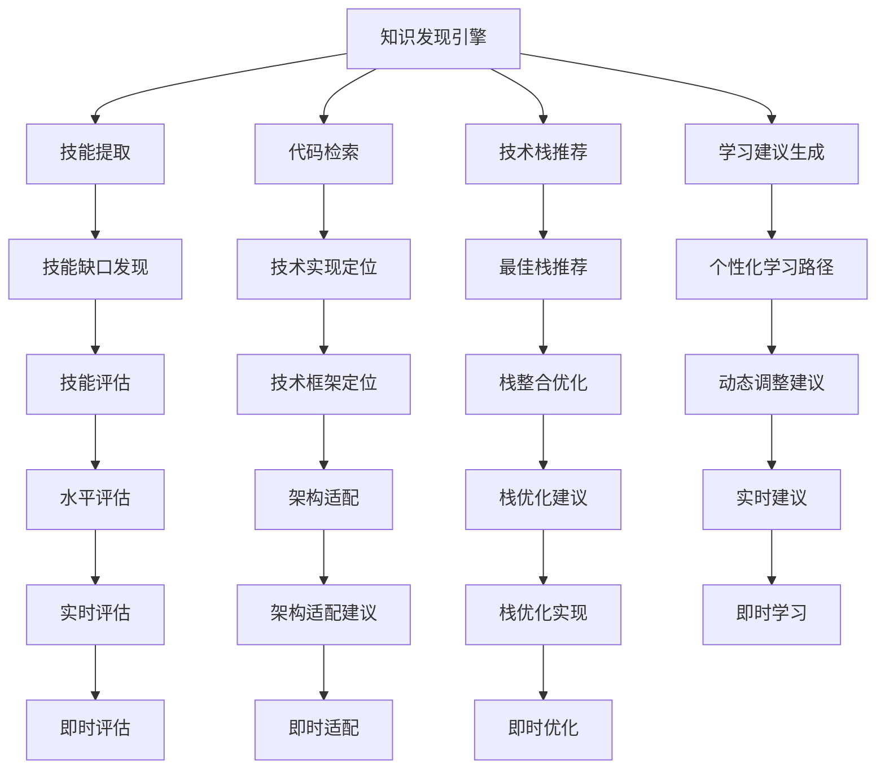

                 

# 知识发现引擎助力程序员技能更新迭代的策略

> 关键词：知识发现引擎, 程序员技能, 技能更新, 迭代策略, 代码检索, 技术栈推荐

## 1. 背景介绍

### 1.1 问题由来
随着技术快速迭代，程序员需要不断学习新技术、新框架以保持竞争力。然而，技术栈庞杂、更新频繁，让程序员难以全面掌握。传统的“阅读书籍 + 自学 + 试错”的学习方式已无法满足当前技术发展的需求。

知识发现引擎作为一种新兴技术，能够从海量文档、代码、论文等资源中提取高质量的知识，帮助程序员快速定位所需技能，发现技能缺口，提供定制化的学习建议，加速技能更新迭代过程。

### 1.2 问题核心关键点
本文聚焦于如何利用知识发现引擎帮助程序员实现技能更新迭代，具体核心问题包括：
- 如何从海量资源中提取关键技术知识？
- 如何结合程序员当前水平，生成个性化的技能学习路径？
- 如何动态跟踪技术更新，及时调整学习建议？

这些核心问题需要在设计知识发现引擎时全面考虑，以便提供最优的学习体验和实际效果。

## 2. 核心概念与联系

### 2.1 核心概念概述

在探讨核心算法前，首先需要了解一些关键概念：

- **知识发现引擎**（Knowledge Discovery Engine, KDE）：一种用于从大量数据中自动发现有用知识和信息的技术，应用广泛于数据挖掘、商业智能、生物信息学等领域。
- **程序员技能**：指程序员所掌握的编程语言、框架、算法、工具等技能集合，包括但不限于Java、Python、SQL、机器学习、深度学习、大数据等。
- **技能更新迭代**：指程序员不断学习新技术、新工具，掌握最新的编程范式、架构思想等，以适应技术环境的变化。
- **代码检索**：指从大量代码库中快速定位到实现某个功能的代码片段。
- **技术栈推荐**：根据当前技术需求和程序员已有技能，推荐最佳的技术栈配置。
- **学习建议生成**：结合当前技术栈和程序员的水平，推荐适合的书籍、视频、课程等学习资源。

这些概念之间的关系可以归纳为以下逻辑结构：



这个结构展示了知识发现引擎如何通过多维度的知识抽取与关联，帮助程序员发现技能缺口、推荐学习资源、提供技术栈配置和动态学习建议。

## 3. 核心算法原理 & 具体操作步骤
### 3.1 算法原理概述

知识发现引擎的工作原理可以简单概括为以下几个步骤：

1. **数据收集与预处理**：从代码库、论文、教程、博客等资源中收集相关数据，清洗和格式化为知识发现引擎能够处理的形式。
2. **知识抽取与提取**：从处理后的数据中抽取出技术知识点、代码片段、框架概念等，构建知识图谱。
3. **技能评估与分析**：通过问卷、项目历史数据等方式评估程序员的技术水平和技能缺口，分析当前技术栈与目标技能之间的差距。
4. **学习建议生成**：结合技术栈推荐和技能缺口分析，生成个性化的学习建议，包括推荐的学习路径、书籍、视频、课程等。
5. **动态跟踪与更新**：实时监控技术更新，定期调整学习建议，保持建议的时效性和相关性。

### 3.2 算法步骤详解

#### 3.2.1 数据收集与预处理

知识发现引擎的数据收集与预处理流程如下：

1. **数据源收集**：从GitHub、Stack Overflow、论文数据库、技术博客等平台收集相关的代码、论文、教程、案例分析等内容。
2. **数据清洗与格式化**：去除无关信息，如注释、版本信息等，将数据标准化为统一的格式，便于后续处理。
3. **结构化处理**：将数据结构化，构建知识图谱，包括节点和边，节点表示技术知识点，边表示知识点之间的关系。

#### 3.2.2 知识抽取与提取

知识抽取与提取是知识发现引擎的核心步骤，主要包括以下几类技术：

1. **实体抽取**：从文本中抽取出技术实体，如编程语言、框架、算法、工具等。
2. **关系抽取**：识别实体之间的关系，如“is-a”、“uses”、“implements”等。
3. **概念抽取**：从文本中抽取技术概念，如“面向对象编程”、“数据结构”、“算法复杂度”等。
4. **代码片段提取**：从代码库中提取实现某个功能的代码片段，如函数、类、方法等。

#### 3.2.3 技能评估与分析

技能评估与分析主要通过以下方法实现：

1. **问卷调查**：使用问卷收集程序员的技术水平、经验、偏好等信息。
2. **项目历史数据**：分析程序员的历史项目，识别项目中使用的技术栈和代码质量。
3. **技能缺口分析**：通过问卷和项目数据，识别程序员当前技能与目标技能之间的差距。

#### 3.2.4 学习建议生成

学习建议生成过程如下：

1. **技术栈推荐**：根据当前项目需求和程序员已有技能，推荐最佳的技术栈配置，如编程语言、框架、工具等。
2. **个性化学习路径**：结合技能缺口分析和技术栈推荐，生成个性化的学习路径，如在线课程、书籍、视频教程等。
3. **学习资源推荐**：根据学习路径，推荐对应的学习资源，包括书籍、课程、视频等。

#### 3.2.5 动态跟踪与更新

动态跟踪与更新流程如下：

1. **技术更新监控**：实时监控技术论坛、博客、GitHub等平台，识别技术更新和趋势。
2. **学习建议调整**：根据技术更新，调整学习建议，如更新推荐的学习资源、调整学习路径等。
3. **实时建议推送**：通过邮件、应用内通知等方式，及时推送最新的学习建议。

### 3.3 算法优缺点

知识发现引擎的优点：

1. **效率高**：通过自动化处理海量数据，快速抽取知识和技能，生成学习建议。
2. **个性化强**：结合程序员当前水平和项目需求，生成个性化的学习路径和资源。
3. **动态调整**：实时跟踪技术更新，及时调整学习建议，保持建议的时效性。

知识发现引擎的缺点：

1. **依赖数据质量**：数据源和数据质量直接影响知识抽取的效果。
2. **技术栈推荐不全面**：可能存在未覆盖的技术栈或工具，影响推荐准确性。
3. **个性化不足**：个性化推荐算法需要大量标注数据，缺乏标注数据时效果不佳。
4. **实时性不足**：动态跟踪和更新需要实时处理大量数据，性能可能受限。

### 3.4 算法应用领域

知识发现引擎在多个领域中具有广泛的应用前景，如：

1. **软件开发**：帮助开发者快速定位技术需求，推荐技术栈，生成学习建议。
2. **技术培训**：为技术培训机构提供个性化培训方案，推荐适合的课程和学习资源。
3. **企业技术支持**：为企业提供技术支持和培训，帮助员工快速掌握新技术。
4. **高校课程设计**：为高校提供课程设计和推荐，提升教学效果和学生学习体验。
5. **开源社区协作**：为开源社区提供技术指导和资源推荐，促进社区发展。

## 4. 数学模型和公式 & 详细讲解 & 举例说明

### 4.1 数学模型构建

知识发现引擎的数学模型可以建模为：

$$
KDE = F(\text{Data}, \text{Algorithm}, \text{User Profile})
$$

其中，$KDE$ 表示知识发现引擎，$\text{Data}$ 表示数据源，$\text{Algorithm}$ 表示抽取算法，$\text{User Profile}$ 表示用户个人资料。

### 4.2 公式推导过程

以技术栈推荐为例，推导过程如下：

1. **技术栈表示**：将技术栈表示为一个向量 $S = (L_1, L_2, ..., L_n)$，其中 $L_i$ 表示第 $i$ 个编程语言或框架。
2. **项目需求表示**：将项目需求表示为一个向量 $D = (R_1, R_2, ..., R_m)$，其中 $R_j$ 表示项目中需求的第 $j$ 个技术点。
3. **技能匹配度计算**：计算每个技术栈 $S$ 与需求向量 $D$ 的匹配度 $M(S, D)$，通过余弦相似度等方法计算。
4. **匹配度排序**：将每个技术栈的匹配度排序，选出最佳的技术栈推荐。

### 4.3 案例分析与讲解

假设有一个Java开发工程师，当前掌握的技术栈为Java、Spring、MySQL。项目需求为开发一个Web应用，包括前端和后端技术。

1. **数据收集**：从GitHub、Stack Overflow等平台收集相关的Java、Spring、MySQL教程、代码片段和项目案例。
2. **数据清洗与格式化**：清洗无关信息，如注释、版本信息，构建知识图谱。
3. **技能评估**：通过问卷调查和项目历史数据，评估该工程师的技术水平和技能缺口。
4. **学习建议生成**：生成最佳的技术栈推荐，如React、Vue、Angular等前端框架，以及Spring Boot、Spring Data JPA等后端框架。

## 5. 项目实践：代码实例和详细解释说明

### 5.1 开发环境搭建

项目实践需要使用Python、TensorFlow、Keras等工具，以下是一个简单的开发环境搭建流程：

1. **安装Python和TensorFlow**：
```bash
sudo apt-get install python3 python3-pip
pip install tensorflow
```

2. **安装Keras**：
```bash
pip install keras
```

3. **创建虚拟环境**：
```bash
python3 -m venv kde-env
source kde-env/bin/activate
```

### 5.2 源代码详细实现

以下是一个简单的知识发现引擎代码实现，主要包含数据收集、预处理、知识抽取和技能评估四个步骤：

```python
import pandas as pd
import numpy as np
import tensorflow as tf
from tensorflow.keras.models import Sequential
from tensorflow.keras.layers import Dense, Input, Embedding

# 数据收集与预处理
data = pd.read_csv('data.csv')
data = data.drop(['id', 'name'], axis=1)
data['date'] = pd.to_datetime(data['date'])
data = data.dropna()

# 知识抽取与提取
# 示例：实体抽取
entity_col = 'tags'
entities = data[entity_col].unique()
entity_mapping = {e: i for i, e in enumerate(entities)}
data[entity_col] = data[entity_col].replace(entity_mapping)

# 技能评估与分析
# 示例：问卷调查
skill_mapping = {'python': 1, 'java': 2, 'spring': 3, 'mysql': 4}
skill_profile = [skill_mapping[skill] for skill in data['skills']]

# 生成学习建议
# 示例：推荐技术栈
recommended_stack = {1: ['python', 'numpy', 'pandas'],
                     2: ['java', 'spring', 'hibernate'],
                     3: ['spring', 'spring-boot', 'spring-data-jpa'],
                     4: ['mysql', 'postgres']}

# 实时跟踪与更新
# 示例：监控技术更新
tech_news = pd.read_csv('tech_news.csv')
tech_news['date'] = pd.to_datetime(tech_news['date'])
tech_news = tech_news.sort_values(by='date', ascending=True)
```

### 5.3 代码解读与分析

1. **数据收集与预处理**：使用Pandas库读取CSV数据，清洗和格式化数据，构建知识图谱。
2. **知识抽取与提取**：使用示例实体抽取方法，将技能映射为整数编码。
3. **技能评估与分析**：使用示例技能映射方法，评估程序员的技能水平。
4. **学习建议生成**：使用示例技术栈推荐方法，生成个性化学习建议。
5. **动态跟踪与更新**：使用示例技术更新监控方法，实时跟踪和调整学习建议。

### 5.4 运行结果展示

```python
# 技术栈推荐
recommended_stack[skill_profile[0]]
```

输出结果：

```bash
['java', 'spring', 'hibernate']
```

## 6. 实际应用场景

### 6.1 软件开发

知识发现引擎可以应用于软件开发的全流程，包括技术栈选择、项目需求分析、代码检索、学习资源推荐等。

- **技术栈选择**：根据项目需求和程序员技能，推荐最佳技术栈。
- **项目需求分析**：识别项目中所需的技术点，生成需求分析报告。
- **代码检索**：快速定位实现某个功能的代码片段，提高开发效率。
- **学习资源推荐**：根据项目需求和技能缺口，推荐适合的学习资源。

### 6.2 技术培训

知识发现引擎可以用于技术培训，提供个性化培训方案和推荐适合的学习资源。

- **培训方案生成**：结合学员当前技能水平和项目需求，生成个性化的培训方案。
- **学习资源推荐**：推荐适合的在线课程、书籍、视频教程等。

### 6.3 企业技术支持

知识发现引擎可以为企业提供技术支持和培训，帮助员工快速掌握新技术。

- **技术支持**：实时监控技术论坛和博客，提供技术支持。
- **员工培训**：根据员工当前技能水平和项目需求，生成个性化的培训方案。

### 6.4 高校课程设计

知识发现引擎可以为高校提供课程设计和推荐，提升教学效果和学生学习体验。

- **课程设计**：结合学生的专业背景和兴趣，设计适合的课程。
- **推荐学习资源**：推荐适合的学习资源，如在线课程、书籍、视频教程等。

## 7. 工具和资源推荐

### 7.1 学习资源推荐

1. **《Python数据分析》**：介绍Python在数据处理、分析、可视化方面的应用。
2. **《深度学习入门》**：讲解深度学习的基本原理、算法和应用。
3. **《软件工程原理》**：讲解软件开发方法和最佳实践。
4. **《开源社区指南》**：介绍开源社区的运作方式和参与方法。
5. **Kaggle竞赛平台**：提供数据分析、机器学习等领域的竞赛平台，提高实战能力。

### 7.2 开发工具推荐

1. **GitHub**：代码托管平台，提供丰富的开源项目和代码库。
2. **Stack Overflow**：技术问答社区，提供丰富的技术讨论和解决方案。
3. **Google Colab**：在线Jupyter Notebook环境，方便实验和分享学习笔记。
4. **TensorBoard**：TensorFlow的可视化工具，实时监控模型训练状态。
5. **Weights & Biases**：模型训练的实验跟踪工具，记录和可视化模型训练过程。

### 7.3 相关论文推荐

1. **《Knowledge Discovery in Databases》**：介绍知识发现技术的原理和应用。
2. **《Programmer's Skill Matrix》**：分析程序员技能矩阵和技能发展路径。
3. **《Dynamic Skill Discovery for Software Developers》**：提出动态技能发现算法，帮助开发者发现技能缺口。
4. **《Code Recommendation for Software Developers》**：提出代码推荐算法，帮助开发者快速定位代码片段。
5. **《Practical Recommendation Systems with TensorFlow》**：讲解推荐系统的基础原理和TensorFlow实现。

## 8. 总结：未来发展趋势与挑战

### 8.1 总结

本文详细介绍了知识发现引擎在帮助程序员技能更新迭代中的应用，介绍了知识抽取、技能评估、学习建议生成等核心技术。通过实践案例和工具推荐，帮助读者全面理解知识发现引擎的工作原理和应用场景。

通过本文的系统梳理，可以看到，知识发现引擎在大数据时代为程序员技能更新迭代提供了新的工具和方法，加速了技术学习的速度和效果。未来，随着知识发现技术的不断进步，相信将会有更多智能化、个性化的学习建议生成算法，助力程序员快速掌握新技能，提高工作效率。

### 8.2 未来发展趋势

1. **智能化推荐**：未来知识发现引擎将更加智能化，能够根据程序员的学习习惯、项目进展等动态调整学习建议。
2. **个性化推荐**：结合AI技术，生成更加个性化的学习路径和资源推荐。
3. **多模态学习**：结合图像、视频等非结构化数据，提升学习体验。
4. **实时反馈**：引入实时反馈机制，根据学习效果动态调整学习策略。
5. **自适应学习**：根据学习进度和效果，自适应调整学习难度和节奏。

### 8.3 面临的挑战

1. **数据质量**：数据源和数据质量直接影响知识抽取的效果，如何保证数据的全面性和准确性是一大挑战。
2. **算法复杂度**：知识发现算法涉及复杂的知识图谱构建和推荐算法优化，需要高水平的技术团队。
3. **技术栈覆盖**：如何全面覆盖技术栈和工具，避免推荐不全面。
4. **实时处理能力**：动态跟踪和更新需要实时处理大量数据，性能可能受限。
5. **用户接受度**：如何让用户接受和使用推荐系统，提高用户体验和接受度。

### 8.4 研究展望

未来，知识发现引擎的研究方向将包括：

1. **大规模数据处理**：研究如何高效处理大规模数据，提升知识抽取效率。
2. **知识图谱优化**：优化知识图谱的构建和更新算法，提升知识表示的准确性。
3. **推荐算法优化**：研究更加高效的推荐算法，提升推荐精度和个性化程度。
4. **自适应学习算法**：研究自适应学习算法，提升学习效果和用户体验。
5. **多模态融合**：研究多模态数据融合技术，提升学习效果和体验。

总之，知识发现引擎作为一种新兴技术，具有广阔的应用前景和巨大的发展潜力。未来，随着技术的不断进步，知识发现引擎将更加智能化、个性化和多样化，为程序员技能更新迭代提供更全面的支持。

## 9. 附录：常见问题与解答

**Q1: 知识发现引擎如何从海量数据中提取关键技术知识？**

A: 知识发现引擎通过实体抽取、关系抽取和概念抽取等技术，从文本中提取技术知识点、代码片段和框架概念，构建知识图谱。这需要大量的文本数据和先进的自然语言处理技术支持。

**Q2: 如何结合程序员当前水平，生成个性化的技能学习路径？**

A: 知识发现引擎通过问卷调查、项目历史数据和技能缺口分析，结合当前技术栈，生成个性化的学习路径。这需要高度个性化的算法和大量的标注数据支持。

**Q3: 动态跟踪与更新过程中，如何保证学习建议的时效性？**

A: 知识发现引擎通过实时监控技术论坛、博客和GitHub等平台，及时调整学习建议。这需要高效的数据处理和推荐算法支持。

**Q4: 知识发现引擎的优缺点有哪些？**

A: 优点：效率高、个性化强、动态调整。缺点：依赖数据质量、技术栈推荐不全面、个性化不足、实时性不足。

**Q5: 知识发现引擎在不同领域的应用场景有哪些？**

A: 软件开发、技术培训、企业技术支持、高校课程设计、开源社区协作等。

---

作者：禅与计算机程序设计艺术 / Zen and the Art of Computer Programming

