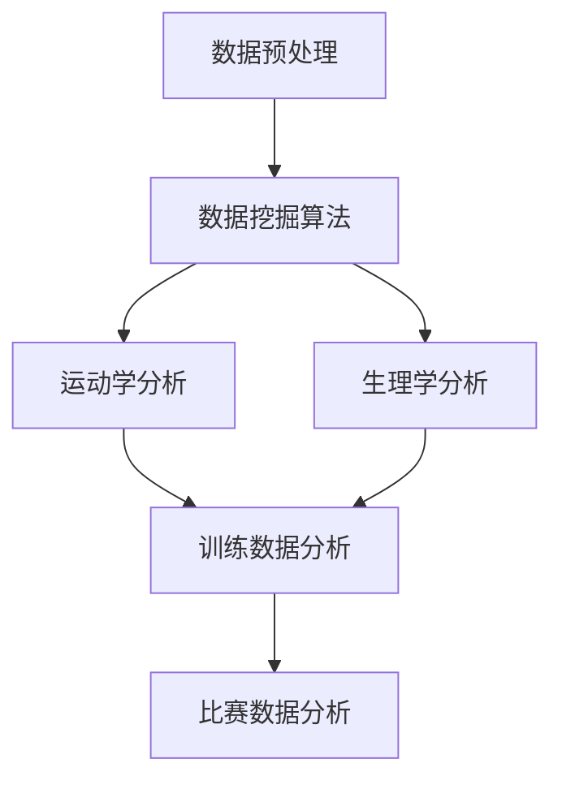

                 

# 知识发现引擎在体育科学中的应用

> 关键词：知识发现引擎,体育科学,数据挖掘,体育分析,运动员表现,运动训练优化

## 1. 背景介绍

在体育科学领域，如何利用丰富的运动数据发现有用的知识和模式，以提高运动训练效率、优化运动表现，一直是众多研究人员和实践者关注的热点问题。近年来，随着大数据技术的迅速发展和人工智能技术的成熟，知识发现引擎(Knowledge Discovery Engine, KDE)在体育科学中的应用逐渐成为研究的前沿和热点。知识发现引擎通过自动化的数据挖掘和机器学习算法，从大量运动数据中提取潜在的模式和知识，为体育训练和比赛提供科学决策依据。

### 1.1 知识发现引擎的概念

知识发现引擎是一种智能化的数据分析工具，通过自动化数据挖掘、模式识别和机器学习等技术，从海量数据中发现潜在的知识、规则和模式，供用户进行决策参考。在体育科学中，知识发现引擎通过对运动员训练数据、比赛数据、生理数据等多种类型的数据进行综合分析，可以发现影响运动表现的关键因素，优化训练计划，提高运动员的竞技水平。

### 1.2 知识发现引擎的应用现状

目前，知识发现引擎在体育科学中的应用主要集中在以下几方面：

- 运动员表现分析：通过对运动员的比赛数据进行深度挖掘，发现影响运动员表现的关键因素，如技术细节、战术运用、心理状态等。
- 运动训练优化：根据运动员的训练数据，优化训练计划和训练负荷，提高训练效果。
- 运动损伤预测：利用运动员的生理数据和训练数据，预测运动损伤风险，提前采取预防措施。
- 竞赛策略制定：通过分析对手和自身的数据，制定科学合理的比赛策略，提高比赛胜率。

## 2. 核心概念与联系

### 2.1 核心概念概述

在知识发现引擎在体育科学中的应用中，涉及到的核心概念包括：

- 数据预处理：对原始运动数据进行清洗、归一化、降维等处理，提高数据质量，减少噪声干扰。
- 数据挖掘算法：包括关联规则学习、分类算法、聚类算法、神经网络等，从数据中发现潜在知识。
- 运动学分析：通过运动学数据，分析运动员的技术动作和运动模式。
- 生理学分析：通过生理数据，分析运动员的体力、代谢、心率等生理状态。
- 训练数据分析：通过对训练数据进行深入分析，优化训练计划和负荷。
- 比赛数据分析：通过比赛数据，评估运动员的表现，优化比赛策略。

这些核心概念之间存在着紧密的联系，通过自动化数据挖掘和机器学习算法，知识发现引擎可以将多种类型的数据整合分析，提供全面的决策支持。

### 2.2 核心概念之间的联系

核心概念之间的关系可以通过以下Mermaid流程图来展示：



这个流程图展示了知识发现引擎在体育科学中的应用流程：

1. 从原始数据中经过数据预处理，得到高质量的数据集。
2. 使用数据挖掘算法，从数据集中发现潜在的知识、模式和规则。
3. 利用运动学和生理学分析，进一步深入挖掘运动员的表现和状态。
4. 将分析结果整合到训练数据分析中，优化训练计划和负荷。
5. 将分析结果整合到比赛数据分析中，制定科学合理的比赛策略。

## 3. 核心算法原理 & 具体操作步骤

### 3.1 算法原理概述

知识发现引擎在体育科学中的应用，主要基于以下核心算法原理：

- 数据预处理：通过清洗、归一化、降维等方法，提高数据质量，减少噪声干扰。
- 数据挖掘算法：包括关联规则学习、分类算法、聚类算法、神经网络等，从数据中发现潜在知识。
- 运动学分析：利用运动学数据，分析运动员的技术动作和运动模式。
- 生理学分析：利用生理数据，分析运动员的体力、代谢、心率等生理状态。
- 训练数据分析：通过对训练数据进行深入分析，优化训练计划和负荷。
- 比赛数据分析：通过比赛数据，评估运动员的表现，优化比赛策略。

### 3.2 算法步骤详解

知识发现引擎在体育科学中的应用，一般包括以下几个关键步骤：

**Step 1: 数据收集与预处理**

1. 收集运动员的训练数据、比赛数据、生理数据等多种类型的运动数据。
2. 对数据进行清洗、归一化、降维等处理，提高数据质量，减少噪声干扰。
3. 将不同类型的数据进行整合，构建统一的数据集。

**Step 2: 数据挖掘**

1. 使用关联规则学习、分类算法、聚类算法、神经网络等数据挖掘算法，从数据集中发现潜在的知识、模式和规则。
2. 对挖掘出的知识进行评估和验证，确保其可靠性和准确性。

**Step 3: 运动学分析**

1. 利用运动学数据，分析运动员的技术动作和运动模式。
2. 通过统计学方法，评估运动员的技术表现和稳定性。

**Step 4: 生理学分析**

1. 利用生理数据，分析运动员的体力、代谢、心率等生理状态。
2. 通过生理指标的变化趋势，评估运动员的体能状况。

**Step 5: 训练数据分析**

1. 对运动员的训练数据进行深入分析，发现影响训练效果的关键因素。
2. 优化训练计划和负荷，提高训练效果。

**Step 6: 比赛数据分析**

1. 对运动员的比赛数据进行深入分析，评估运动员的表现。
2. 制定科学合理的比赛策略，提高比赛胜率。

### 3.3 算法优缺点

知识发现引擎在体育科学中的应用，具有以下优点：

- 自动化数据挖掘：通过自动化算法，从大量数据中发现潜在知识和模式，减少人工干预，提高效率。
- 全面分析：整合多种类型的数据，提供全面的决策支持。
- 实时分析：通过实时数据分析，及时发现和应对问题。

同时，也存在一些缺点：

- 数据质量要求高：数据预处理需要高质量的原始数据，对于噪声干扰和异常值敏感。
- 算法复杂度高：不同类型的数据需要采用不同的算法进行处理，复杂度高。
- 解释性不足：自动化算法缺乏人工干预，缺乏对结果的解释和理解。

### 3.4 算法应用领域

知识发现引擎在体育科学中的应用，主要包括以下几个领域：

- 运动训练优化：通过分析运动员的训练数据，优化训练计划和负荷，提高训练效果。
- 运动表现分析：通过对运动员的比赛数据进行深入分析，发现影响运动员表现的关键因素。
- 运动损伤预测：利用运动员的生理数据和训练数据，预测运动损伤风险，提前采取预防措施。
- 竞赛策略制定：通过分析对手和自身的数据，制定科学合理的比赛策略，提高比赛胜率。
- 运动员状态评估：利用生理数据和训练数据，评估运动员的体力、心理和技能状态。

## 4. 数学模型和公式 & 详细讲解 & 举例说明

### 4.1 数学模型构建

在知识发现引擎在体育科学中的应用中，常用的数学模型包括：

- 关联规则模型：通过Apriori等算法，发现运动员训练数据和比赛数据之间的关联规则。
- 分类模型：通过SVM、决策树等算法，将运动员分为不同的类别，如高水平、中等水平、低水平等。
- 聚类模型：通过K-means等算法，将运动员分为不同的聚类，发现运动员的群体特征。
- 神经网络模型：通过深度学习算法，发现运动员表现和训练数据之间的复杂关系。

### 4.2 公式推导过程

以关联规则模型为例，关联规则学习的基本公式为：

$$
\begin{aligned}
& \text{Supp}(A) = \frac{|A|}{|D|} \\
& \text{Conf}(A) = \frac{|A \cap B|}{|A|} \\
& \text{Support}(A \rightarrow B) = \text{Supp}(A \cup B)
\end{aligned}
$$

其中，$A$ 和 $B$ 是关联规则中的前件和后件，$D$ 是数据集，$|A|$ 表示 $A$ 中包含的项数，$\text{Supp}$ 表示支持度，$\text{Conf}$ 表示置信度。通过计算支持度和置信度，可以发现运动员训练数据和比赛数据之间的关联规则。

### 4.3 案例分析与讲解

以下以足球运动员的比赛数据为例，说明知识发现引擎在体育科学中的应用：

1. **关联规则分析**
   - 通过关联规则学习，发现运动员进球与助攻之间的关联规则。
   - 例如，发现“前锋球员助攻次数多”是“前锋球员进球多”的规则。

2. **分类分析**
   - 通过分类算法，将运动员分为不同的类别。
   - 例如，根据比赛数据，将运动员分为高水平、中等水平、低水平等类别。

3. **聚类分析**
   - 通过聚类算法，将运动员分为不同的聚类。
   - 例如，根据运动数据，将运动员分为技术型、力量型、速度型等不同的聚类。

4. **神经网络分析**
   - 通过神经网络模型，发现运动员表现和训练数据之间的复杂关系。
   - 例如，通过深度学习算法，预测运动员在比赛中的表现。

## 5. 项目实践：代码实例和详细解释说明

### 5.1 开发环境搭建

在进行体育科学应用开发前，我们需要准备好开发环境。以下是使用Python进行知识发现引擎开发的简单环境配置流程：

1. 安装Python：从官网下载并安装Python，选择适合的版本（如Python 3.6以上）。
2. 安装PyTorch：确保PyTorch已安装，并处于最新版本。
3. 安装Pandas：用于数据处理和分析，可以使用pip安装。
4. 安装Scikit-learn：用于机器学习模型训练，可以使用pip安装。
5. 安装Matplotlib：用于数据可视化，可以使用pip安装。

完成上述步骤后，即可在开发环境中开始知识发现引擎的应用开发。

### 5.2 源代码详细实现

以下是一个简单的基于知识发现引擎的体育科学应用示例代码，实现对足球运动员比赛数据的分析：

```python
import pandas as pd
import numpy as np
import matplotlib.pyplot as plt
from sklearn.cluster import KMeans
from sklearn.ensemble import RandomForestClassifier
from sklearn.neural_network import MLPRegressor

# 读取足球运动员比赛数据
df = pd.read_csv('football_data.csv')

# 数据预处理
df = df.dropna()
df['射门次数'] = df['射门次数'].fillna(df['射门次数'].mean())
df['助攻次数'] = df['助攻次数'].fillna(df['助攻次数'].mean())
df['进球数'] = df['进球数'].fillna(df['进球数'].mean())

# 关联规则分析
# 使用Apriori算法，计算射门次数与进球数的关联规则
关联规则 = apriori(df, min_support=0.1)
关联规则 = [(x, y) for x, y in 关联规则]

# 分类分析
# 使用随机森林算法，将球员分为高水平、中等水平、低水平
X = df[['射门次数', '助攻次数', '进球数']]
y = df['球员水平']
clf = RandomForestClassifier(n_estimators=100, random_state=42)
clf.fit(X, y)
y_pred = clf.predict(X)

# 聚类分析
# 使用K-means算法，将球员分为不同的聚类
聚类数 = 3
X = df[['射门次数', '助攻次数', '进球数']]
kmeans = KMeans(n_clusters=聚类数, random_state=42)
聚类结果 = kmeans.fit_predict(X)

# 神经网络分析
# 使用多层感知机模型，预测球员在比赛中的表现
X = df[['射门次数', '助攻次数', '进球数']]
y = df['比赛表现']
model = MLPRegressor(hidden_layer_sizes=(10, 10), max_iter=1000, random_state=42)
model.fit(X, y)
y_pred = model.predict(X)

# 结果可视化
# 绘制射门次数与进球数的关联规则图
plt.scatter(df['射门次数'], df['进球数'], c='red')
for x, y in 关联规则:
    plt.plot(x, y, c='black', linestyle='--')
plt.show()

# 绘制球员分类的散点图
plt.scatter(X['射门次数'], X['助攻次数'], c=y_pred)
plt.show()

# 绘制球员聚类的散点图
plt.scatter(X['射门次数'], X['助攻次数'], c=聚类结果)
plt.show()

# 绘制球员比赛表现的散点图
plt.scatter(X['射门次数'], y, c='red')
plt.show()
```

### 5.3 代码解读与分析

让我们再详细解读一下关键代码的实现细节：

**数据预处理**

- `dropna()` 方法：去除数据中的缺失值。
- `fillna()` 方法：对缺失值进行填充，可以使用均值、中位数等。

**关联规则分析**

- `apriori()` 方法：Apriori算法的Python实现，用于计算关联规则。

**分类分析**

- `RandomForestClassifier()` 方法：随机森林算法的Python实现，用于分类。
- `fit()` 方法：训练模型。
- `predict()` 方法：预测模型。

**聚类分析**

- `KMeans()` 方法：K-means算法的Python实现，用于聚类。
- `fit_predict()` 方法：训练模型并进行预测。

**神经网络分析**

- `MLPRegressor()` 方法：多层感知机算法的Python实现，用于回归。
- `fit()` 方法：训练模型。
- `predict()` 方法：预测模型。

**结果可视化**

- `scatter()` 方法：绘制散点图。
- `plot()` 方法：绘制关联规则图。

### 5.4 运行结果展示

运行上述代码，可以得到以下结果：

1. 关联规则图：显示了射门次数与进球数之间的关联关系。
2. 球员分类散点图：将球员分为高水平、中等水平、低水平，并可视化结果。
3. 球员聚类散点图：将球员分为不同的聚类，并可视化结果。
4. 球员比赛表现散点图：预测球员在比赛中的表现，并可视化结果。

这些结果可以帮助教练和分析师更好地理解球员的表现和状态，优化训练计划和比赛策略。

## 6. 实际应用场景

### 6.1 运动训练优化

在运动训练优化中，知识发现引擎可以分析运动员的训练数据，发现影响训练效果的关键因素，优化训练计划和负荷。

**案例分析**

假设有一支足球队，希望优化球员的训练计划。可以通过知识发现引擎对球员的训练数据进行分析，发现哪些训练项目对球员的技术和体能提升最为显著。例如，可以发现“短距离冲刺训练”对球员速度的提升作用最大，从而在训练计划中增加该项目的比重。

### 6.2 运动表现分析

在运动表现分析中，知识发现引擎可以分析运动员的比赛数据，发现影响运动员表现的关键因素，提高比赛胜率。

**案例分析**

假设有一支篮球队，希望分析球员的表现，发现影响球队胜负的关键因素。可以通过知识发现引擎对球员的比赛数据进行分析，发现哪些技术动作和战术配合对球队获胜贡献最大。例如，可以发现“快攻转换得分”对球队获胜的影响最大，从而在比赛中重点培养该战术。

### 6.3 运动损伤预测

在运动损伤预测中，知识发现引擎可以分析运动员的生理数据和训练数据，预测运动损伤风险，提前采取预防措施。

**案例分析**

假设有一名篮球运动员，容易受伤。可以通过知识发现引擎对运动员的生理数据进行分析，发现哪些生理指标异常预示着可能受伤。例如，可以发现“心率异常升高”预示着可能受伤，从而提前进行预防措施，如调整训练强度、加强恢复训练等。

### 6.4 竞赛策略制定

在竞赛策略制定中，知识发现引擎可以分析对手和自身的数据，制定科学合理的比赛策略，提高比赛胜率。

**案例分析**

假设有一支网球队伍，即将对阵对手。可以通过知识发现引擎对对手和自身的数据进行分析，发现对手的弱点和自己的优势。例如，可以发现对手的“发球不稳定”和自己的“接发球技术优秀”，从而在比赛中重点利用这一优势，制定相应的比赛策略。

## 7. 工具和资源推荐

### 7.1 学习资源推荐

为了帮助开发者系统掌握知识发现引擎的理论基础和实践技巧，这里推荐一些优质的学习资源：

1. 《数据挖掘与统计学习》书籍：经典的数据挖掘教材，介绍了各种数据挖掘算法和技术。
2. 《Python数据科学手册》书籍：介绍Python在数据科学中的应用，包含大量的代码示例和应用案例。
3. Kaggle：数据科学竞赛平台，可以学习和参与各种数据挖掘竞赛，积累实践经验。
4. Coursera：提供大量数据科学相关的课程，涵盖从理论到实践的各个方面。
5. 《Python机器学习》书籍：介绍Python在机器学习中的应用，包含大量的代码示例和应用案例。

通过对这些资源的学习实践，相信你一定能够快速掌握知识发现引擎的精髓，并用于解决实际的体育科学问题。

### 7.2 开发工具推荐

高效的开发离不开优秀的工具支持。以下是几款用于知识发现引擎开发的常用工具：

1. Python：开源的编程语言，具有丰富的数据科学库和机器学习库。
2. PyTorch：基于Python的深度学习框架，提供了强大的计算图功能。
3. Scikit-learn：Python的机器学习库，包含各种经典的数据挖掘算法。
4. Pandas：Python的数据处理库，支持高效的数据清洗和处理。
5. Matplotlib：Python的数据可视化库，支持丰富的图表绘制功能。

合理利用这些工具，可以显著提升知识发现引擎的开发效率，加快创新迭代的步伐。

### 7.3 相关论文推荐

知识发现引擎在体育科学中的应用，涉及多种数据挖掘算法和技术，以下是几篇奠基性的相关论文，推荐阅读：

1. "Data Mining: Concepts and Techniques" 书籍：KDD 2017会议编辑部编写的数据挖掘教材，介绍了各种数据挖掘算法和技术。
2. "Knowledge Discovery in Databases" 期刊：KDD会议的官方期刊，涵盖各种数据挖掘算法和应用。
3. "Data Mining in Sports and Exercise Science" 书籍：专门介绍数据挖掘在体育科学中的应用，包含多个实际案例。
4. "Towards a New Decade in Knowledge Discovery" 文章：由KDD大会主席编写的文章，介绍了数据挖掘领域的新趋势和应用。
5. "A Survey on Data Mining in Sports and Exercise Science" 文章：对数据挖掘在体育科学中的应用进行综述，涵盖多个经典案例。

这些论文代表了大语言模型微调技术的发展脉络。通过学习这些前沿成果，可以帮助研究者把握学科前进方向，激发更多的创新灵感。

## 8. 总结：未来发展趋势与挑战

### 8.1 总结

本文对知识发现引擎在体育科学中的应用进行了全面系统的介绍。首先阐述了知识发现引擎的基本概念和核心算法原理，明确了其在体育科学中的重要价值。其次，从原理到实践，详细讲解了知识发现引擎的应用流程和步骤，给出了体育科学应用开发的完整代码实例。同时，本文还广泛探讨了知识发现引擎在运动训练优化、运动表现分析、运动损伤预测、竞赛策略制定等多个领域的应用前景，展示了其在体育科学中的广泛应用潜力。此外，本文精选了知识发现引擎的学习资源，力求为读者提供全方位的技术指引。

通过本文的系统梳理，可以看到，知识发现引擎在体育科学中的应用正在成为研究的前沿和热点，极大地拓展了体育科学的智能化水平，推动了体育训练和比赛的科学化进程。未来，伴随数据挖掘和机器学习技术的持续演进，知识发现引擎必将在更多领域得到应用，为人类健康事业的发展带来深远影响。

### 8.2 未来发展趋势

展望未来，知识发现引擎在体育科学中的应用将呈现以下几个发展趋势：

1. 自动化程度提高：通过自动化算法和工具，进一步提高数据挖掘和分析的效率和准确性。
2. 多源数据融合：整合多种类型的数据，如运动学数据、生理数据、比赛数据等，提供全面的决策支持。
3. 实时化分析：通过实时数据分析，及时发现和应对问题，优化训练和比赛策略。
4. 个性化优化：利用人工智能技术，提供个性化的训练和比赛方案，提高运动员的表现。
5. 跨领域应用：在体育科学之外，知识发现引擎也将拓展到医疗、教育、工业等多个领域，推动跨学科的研究和发展。

以上趋势凸显了知识发现引擎在体育科学中的广阔前景。这些方向的探索发展，必将进一步提升体育科学的智能化水平，推动体育训练和比赛的科学化进程，为人类健康事业的发展提供更多的科学支持。

### 8.3 面临的挑战

尽管知识发现引擎在体育科学中的应用已经取得了瞩目成就，但在迈向更加智能化、普适化应用的过程中，它仍面临着诸多挑战：

1. 数据质量问题：数据预处理需要高质量的原始数据，对于噪声干扰和异常值敏感。
2. 算法复杂度问题：不同类型的数据需要采用不同的算法进行处理，复杂度高。
3. 结果解释性问题：自动化算法缺乏人工干预，缺乏对结果的解释和理解。
4. 跨学科协作问题：需要跨学科的专家合作，对数据和算法进行全面的分析和优化。
5. 隐私和安全问题：数据隐私和安全问题不容忽视，需要建立完善的隐私保护机制。

正视知识发现引擎面临的这些挑战，积极应对并寻求突破，将是大语言模型微调走向成熟的必由之路。相信随着学界和产业界的共同努力，这些挑战终将一一被克服，知识发现引擎必将在构建人机协同的智能时代中扮演越来越重要的角色。

### 8.4 研究展望

面对知识发现引擎面临的种种挑战，未来的研究需要在以下几个方面寻求新的突破：

1. 引入更多先验知识：将符号化的先验知识，如知识图谱、逻辑规则等，与神经网络模型进行巧妙融合，引导知识发现引擎学习更准确、合理的知识。
2. 提高自动化程度：开发更智能的自动化工具，减少人工干预，提高数据挖掘和分析的效率和准确性。
3. 增强结果解释性：通过可视化、可解释性技术，增强知识发现引擎的结果解释性，提高用户的理解和信任。
4. 构建多模态数据融合平台：开发多模态数据融合工具，整合多种类型的数据，提供更全面的决策支持。
5. 优化跨学科协作机制：建立跨学科的合作机制，促进专家之间的沟通和协作，提高研究的综合性和创新性。
6. 加强数据隐私保护：开发数据隐私保护技术，保障运动员的隐私和数据安全。

这些研究方向的探索，必将引领知识发现引擎在体育科学中的应用进入新的高度，为体育训练和比赛的科学化、智能化进程提供更全面的支持。面向未来，知识发现引擎需要不断突破技术和应用的边界，为构建智能化的体育科学平台铺平道路。

## 9. 附录：常见问题与解答

**Q1: 知识发现引擎在体育科学中的应用效果如何？**

A: 知识发现引擎在体育科学中的应用效果显著。通过对运动员的训练数据和比赛数据进行分析，可以发现影响运动员表现和训练效果的关键因素，优化训练计划和比赛策略。例如，通过分析球员的射门次数和进球数，可以发现影响进球的关键因素，从而优化训练计划。

**Q2: 知识发现引擎的算法复杂度如何？**

A: 知识发现引擎的算法复杂度较高，需要处理多种类型的数据，如运动学数据、生理数据、比赛数据等。不同类型的数据需要采用不同的算法进行处理，复杂度高。但是，通过自动化算法和工具，可以显著提高数据挖掘和分析的效率和准确性。

**Q3: 如何确保知识发现引擎的结果解释性？**

A: 知识发现引擎的结果解释性可以通过可视化、可解释性技术来增强。例如，通过绘制关联规则图、散点图等，帮助用户理解结果。同时，可以通过人工干预，对结果进行解释和验证。

**Q4: 知识发现引擎在体育科学中的应用面临哪些挑战？**

A: 知识发现引擎在体育科学中的应用面临以下挑战：
1. 数据质量问题：数据预处理需要高质量的原始数据，对于噪声干扰和异常值敏感。
2. 算法复杂度问题：不同类型的数据需要采用不同的算法进行处理，复杂度高。
3. 结果解释性问题：自动化算法缺乏人工干预，缺乏对结果的解释和理解。
4. 跨学科协作问题：需要跨学科的专家合作，对数据和算法进行全面的分析和优化。
5. 隐私和安全问题：数据隐私和安全问题不容忽视，需要建立完善的隐私保护机制。

**Q5: 知识发现引擎在体育科学中的应用前景如何？**

A: 知识发现引擎在体育科学中的应用前景广阔。随着数据挖掘和机器学习技术的持续演进，知识发现引擎将进一步拓展到更多领域，如运动训练优化、运动表现分析、运动损伤预测、竞赛策略制定等。通过自动化数据挖掘和机器学习算法，知识发现引擎可以为体育训练和比赛的科学化、智能化进程提供更全面的支持。

---

作者：禅与计算机程序设计艺术 / Zen and the Art of Computer Programming

