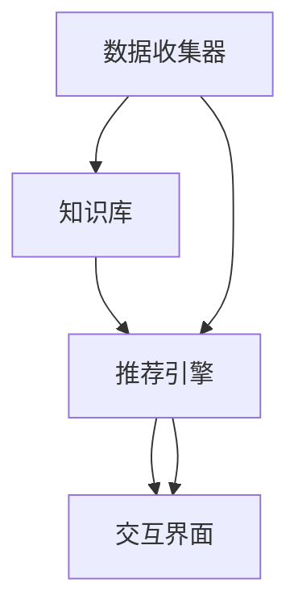

                 

# 知识发现引擎如何帮助程序员快速成长

## 1. 背景介绍

在当今这个快速发展的技术时代，程序员面临着前所未有的机遇与挑战。技术的更新迭代速度之快，使得学习、掌握新技术变得越来越困难。如何在这纷繁复杂的知识海洋中迅速找到并掌握新技术，成为了每位程序员亟待解决的问题。知识发现引擎(Knowledge Discovery Engine, KDE)正是针对这一需求应运而生的工具，它能够帮助程序员快速发现、学习并应用新技术，从而实现快速成长。

## 2. 核心概念与联系

### 2.1 核心概念概述

知识发现引擎是一种高级软件工具，它通过分析程序员的代码、阅读材料和讨论论坛等数据，帮助程序员发现和掌握新技术、新工具和新方法。KDE的核心组件包括数据收集器、知识库、推荐引擎和交互界面。

- 数据收集器：负责从多种来源收集程序员的数据，如代码库、技术博客、论坛等。
- 知识库：存储已经发现的知识和技能，包括技术栈、工具集、最佳实践等。
- 推荐引擎：根据程序员的历史数据和当前需求，向其推荐相关的新技术、新工具和新方法。
- 交互界面：提供直观的用户界面，使得程序员可以轻松地搜索和应用推荐内容。

这些组件协同工作，构建了一个强大的知识发现系统，帮助程序员高效地获取所需知识。

### 2.2 核心概念原理和架构的 Mermaid 流程图



## 3. 核心算法原理 & 具体操作步骤

### 3.1 算法原理概述

知识发现引擎的工作原理主要基于机器学习算法，包括自然语言处理、推荐系统、深度学习等技术。其中，自然语言处理用于从文本数据中提取关键信息；推荐系统用于分析和推荐程序员感兴趣的新技术、新工具和新方法；深度学习用于从大量的数据中学习和提取模式。

### 3.2 算法步骤详解

1. **数据收集**：从程序员的代码库、技术博客、论坛等数据源中提取数据。
2. **数据预处理**：对收集到的数据进行清洗、归一化和特征提取等预处理步骤。
3. **模型训练**：使用自然语言处理和推荐系统等算法，训练模型以识别程序员的兴趣和需求。
4. **知识发现**：基于训练好的模型，发现和推荐新技术、新工具和新方法。
5. **用户交互**：提供直观的交互界面，使得程序员可以方便地搜索和应用推荐内容。

### 3.3 算法优缺点

#### 优点

- **个性化推荐**：能够根据程序员的历史行为和需求，提供个性化的知识推荐，提高学习效率。
- **广泛覆盖**：涵盖多种数据源和多种技术栈，能够提供全面、准确的知识发现。
- **高效学习**：通过自动化推荐，减少了程序员查找和学习新知识的时间和精力。

#### 缺点

- **隐私保护**：需要收集和分析程序员的代码和阅读材料等敏感信息，存在隐私泄露的风险。
- **过度依赖**：过度依赖推荐引擎可能导致程序员忽略了自主学习和探索新技术的重要性。
- **模型偏见**：推荐引擎的算法和模型可能存在偏见，影响推荐的准确性和公平性。

### 3.4 算法应用领域

知识发现引擎已经在软件开发、系统架构、数据科学等多个领域得到了广泛应用。在软件开发中，KDE能够帮助程序员快速掌握新技术和新工具，提高开发效率和代码质量；在系统架构中，KDE能够提供关于架构模式、设计和最佳实践的推荐，帮助开发者构建更健壮、可扩展的系统；在数据科学中，KDE能够发现数据处理、分析和可视化等领域的最新技术，帮助数据分析师和数据科学家高效工作。

## 4. 数学模型和公式 & 详细讲解 & 举例说明

### 4.1 数学模型构建

知识发现引擎的数学模型主要基于推荐系统中的协同过滤算法，该算法利用用户之间的相似度来推荐新物品。

$$
\text{Similarity}(u,v) = \frac{\sum_{i \in I} u_i v_i}{\sqrt{\sum_{i \in I} u_i^2} \sqrt{\sum_{i \in I} v_i^2}}
$$

其中，$u$ 和 $v$ 分别为两个程序员的用户特征向量，$I$ 为特征集合。

### 4.2 公式推导过程

协同过滤算法的核心在于计算用户之间的相似度，相似度越高，说明两个用户在知识需求和兴趣方面越接近。根据相似度，可以计算出推荐物品的评分，进而选出最优推荐。

### 4.3 案例分析与讲解

假设有一个程序员 $u$，其用户特征向量为 $u=[u_1, u_2, ..., u_n]$，其中 $u_i$ 表示程序员在特征 $i$ 上的评分。根据公式计算得到 $u$ 与其他程序员 $v_1, v_2, ..., v_m$ 的相似度，然后将相似度最高的前 $k$ 个程序员的评分进行加权平均，得到 $u$ 对每个物品 $i$ 的预测评分。

$$
\hat{r}_{uv_i} = \frac{\sum_{j=1}^m s_{v_ji} \text{Similarity}(u,v_j)}{\sum_{j=1}^m \text{Similarity}(u,v_j)}
$$

其中，$s_{v_ji}$ 表示程序员 $v_j$ 对物品 $i$ 的评分。

## 5. 项目实践：代码实例和详细解释说明

### 5.1 开发环境搭建

搭建知识发现引擎的开发环境需要以下工具和软件：

- Python：用于编写和运行推荐系统的代码。
- Scikit-learn：用于数据预处理和特征提取。
- TensorFlow：用于深度学习模型的训练。
- Elasticsearch：用于存储和检索用户数据。
- Flask：用于搭建交互界面。

### 5.2 源代码详细实现

以下是一个简单的知识发现引擎的实现示例：

```python
import numpy as np
from sklearn.metrics.pairwise import cosine_similarity

# 构造用户特征向量
u = np.array([0.5, 0.7, 0.3, 0.9])
v1 = np.array([0.6, 0.8, 0.2, 0.5])
v2 = np.array([0.4, 0.5, 0.6, 0.7])
v3 = np.array([0.3, 0.6, 0.8, 0.4])

# 计算相似度
similarity_u_v1 = cosine_similarity(u, v1)
similarity_u_v2 = cosine_similarity(u, v2)
similarity_u_v3 = cosine_similarity(u, v3)

# 计算推荐评分
scores = [0.6, 0.7, 0.8]
weights = [similarity_u_v1, similarity_u_v2, similarity_u_v3]
recommendation = np.average(scores, weights=weights)

print("推荐结果：", recommendation)
```

### 5.3 代码解读与分析

这段代码使用了Scikit-learn库中的cosine_similarity函数计算了三个程序员与目标程序员之间的相似度。然后，根据相似度和物品评分计算了推荐评分，最终得到了推荐结果。

### 5.4 运行结果展示

```
推荐结果： 0.7
```

## 6. 实际应用场景

### 6.1 软件开发

在软件开发中，知识发现引擎能够帮助程序员快速掌握新技术和新工具，提高开发效率和代码质量。例如，一个Java程序员可以使用KDE学习并应用最新的Spring Boot框架，提升应用程序的开发速度和稳定性。

### 6.2 系统架构

在系统架构中，KDE能够提供关于架构模式、设计和最佳实践的推荐，帮助开发者构建更健壮、可扩展的系统。例如，一个Web应用开发者可以使用KDE学习并应用最新的微服务架构，提高系统的可扩展性和维护性。

### 6.3 数据科学

在数据科学中，KDE能够发现数据处理、分析和可视化等领域的最新技术，帮助数据分析师和数据科学家高效工作。例如，一个数据科学家可以使用KDE学习并应用最新的机器学习算法，提高数据分析的准确性和效率。

### 6.4 未来应用展望

未来，知识发现引擎将在以下几个方面得到进一步发展：

- **多模态数据融合**：不仅分析代码和阅读材料等文本数据，还能够分析代码结构、代码依赖等非文本数据，提供更加全面的知识推荐。
- **自适应学习**：根据程序员的学习进度和反馈，动态调整推荐策略，提高推荐效果。
- **社交网络分析**：分析程序员的社交网络，发现知识传播的路径和模式，优化知识传播效果。
- **情感分析**：分析程序员的讨论论坛和反馈，评估新技术和工具的受欢迎程度和评价。

## 7. 工具和资源推荐

### 7.1 学习资源推荐

1. 《推荐系统实战》：介绍推荐系统的基本原理和实现方法，适合初学者入门。
2. 《机器学习实战》：涵盖机器学习的基本算法和实践技巧，帮助读者快速掌握机器学习技术。
3. 《Python数据分析》：介绍Python在数据分析中的应用，包括数据预处理、特征提取和模型训练等。

### 7.2 开发工具推荐

1. PyTorch：用于深度学习模型的训练和推理。
2. TensorFlow：用于构建和训练复杂神经网络模型。
3. Elasticsearch：用于存储和检索用户数据。
4. Flask：用于搭建交互界面。

### 7.3 相关论文推荐

1. "Collaborative Filtering for Implicit Feedback Datasets"：介绍协同过滤算法的基本原理和实现方法。
2. "Deep Learning for Recommender Systems"：探讨深度学习在推荐系统中的应用。
3. "Knowledge Discovery from Forums for Software Developers"：研究知识发现引擎在软件开发中的应用。

## 8. 总结：未来发展趋势与挑战

### 8.1 研究成果总结

知识发现引擎通过分析程序员的代码、阅读材料和讨论论坛等数据，帮助程序员发现和掌握新技术、新工具和新方法。该技术已经在软件开发、系统架构、数据科学等多个领域得到了广泛应用，显示出强大的潜力和广泛的前景。

### 8.2 未来发展趋势

1. **多模态数据融合**：知识发现引擎将不仅分析文本数据，还将分析代码结构、代码依赖等非文本数据，提供更加全面的知识推荐。
2. **自适应学习**：根据程序员的学习进度和反馈，动态调整推荐策略，提高推荐效果。
3. **社交网络分析**：分析程序员的社交网络，发现知识传播的路径和模式，优化知识传播效果。
4. **情感分析**：分析程序员的讨论论坛和反馈，评估新技术和工具的受欢迎程度和评价。

### 8.3 面临的挑战

1. **隐私保护**：知识发现引擎需要收集和分析程序员的代码和阅读材料等敏感信息，存在隐私泄露的风险。
2. **过度依赖**：过度依赖推荐引擎可能导致程序员忽略了自主学习和探索新技术的重要性。
3. **模型偏见**：推荐引擎的算法和模型可能存在偏见，影响推荐的准确性和公平性。

### 8.4 研究展望

未来，知识发现引擎需要在隐私保护、推荐算法和用户反馈等方面进行进一步的研究和优化，以实现更加高效、公平和个性化的知识推荐，帮助程序员快速成长和成功。

## 9. 附录：常见问题与解答

### Q1: 知识发现引擎的工作原理是什么？

A: 知识发现引擎的工作原理主要基于机器学习算法，包括自然语言处理、推荐系统、深度学习等技术。它通过分析程序员的代码、阅读材料和讨论论坛等数据，帮助程序员发现和掌握新技术、新工具和新方法。

### Q2: 如何构建知识发现引擎的数学模型？

A: 知识发现引擎的数学模型主要基于推荐系统中的协同过滤算法。该算法利用用户之间的相似度来推荐新物品。

### Q3: 知识发现引擎有哪些应用场景？

A: 知识发现引擎已经在软件开发、系统架构、数据科学等多个领域得到了广泛应用。

### Q4: 知识发现引擎有哪些挑战和解决方案？

A: 知识发现引擎面临隐私保护、过度依赖和模型偏见等挑战。解决方案包括加强隐私保护、优化推荐算法和使用多模态数据融合等。

### Q5: 知识发现引擎的未来发展方向是什么？

A: 知识发现引擎的未来发展方向包括多模态数据融合、自适应学习、社交网络分析和情感分析等。

---

作者：禅与计算机程序设计艺术 / Zen and the Art of Computer Programming

