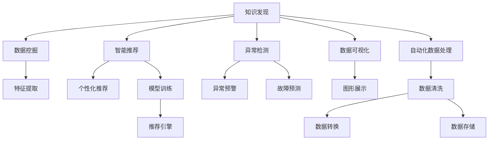

                 

# 知识发现引擎如何改变程序员的学习模式

## 1. 背景介绍

### 1.1 问题由来
随着人工智能(AI)技术的快速发展，程序员的学习模式也在悄然发生改变。传统的以编写代码为主的学习方式，逐渐被数据驱动、模型驱动的知识发现模式所替代。现代软件工程师不仅需要掌握编程技能，还需要具备一定的数据分析、机器学习等知识，以更好地构建智能系统、优化系统性能、提升用户体验。

这种变化主要源于大数据和AI技术的普及应用，使得程序员需要处理和分析海量数据，并利用这些数据发现隐藏的模式和规律，从而构建智能应用。知识发现引擎作为这一转变的重要工具，正在重塑程序员的学习和开发模式。

### 1.2 问题核心关键点
知识发现引擎是一种通过分析数据来发现潜在的知识、模式和关联的软件工具。在现代软件开发中，知识发现引擎被广泛应用于数据分析、数据挖掘、智能推荐、异常检测等多个领域，显著提升了软件开发的效率和质量。

核心关键点包括：
- 数据处理与分析：知识发现引擎能够高效处理和分析大规模数据，帮助程序员快速提取有用信息。
- 模式识别与发现：通过算法发现数据中的潜在模式和关联，辅助程序员构建智能模型。
- 智能推荐与优化：利用知识发现引擎进行用户行为分析，提供智能推荐和系统优化方案。
- 异常检测与预警：通过异常检测技术，及时发现数据中的异常和错误，防止系统故障和漏洞。

## 2. 核心概念与联系

### 2.1 核心概念概述

为更好地理解知识发现引擎如何改变程序员的学习模式，本节将介绍几个密切相关的核心概念：

- 知识发现(Knowledge Discovery)：指从大量数据中自动发现、抽取和总结有用信息的过程。知识发现不仅包括数据处理和分析，还包括模式识别、异常检测等高级应用。
- 数据挖掘(Data Mining)：是从数据中自动发现和提取出有用的信息、模式和规律的技术。数据挖掘通常使用统计学、机器学习等方法。
- 智能推荐系统(Intelligent Recommendation System)：基于用户行为数据，通过算法推荐相关内容或服务，优化用户体验。
- 异常检测(Anomaly Detection)：检测数据中的异常和错误，预测系统故障或异常行为，防止损失。
- 数据可视化(Data Visualization)：将数据以图形、图表等形式展示，直观展现数据特征和规律，辅助决策。
- 自动化数据处理(Automatic Data Processing)：通过自动化技术处理和清洗数据，提高数据质量，为知识发现提供可靠基础。

这些概念之间的逻辑关系可以通过以下Mermaid流程图来展示：



这个流程图展示了知识发现引擎的核心组件和应用场景：

1. 知识发现引擎以数据清洗和转换为基础，通过特征提取和模型训练，发现数据中的模式和规律。
2. 智能推荐系统利用知识发现的结果，提供个性化推荐服务。
3. 异常检测系统通过监控数据，预测和预警系统异常。
4. 数据可视化技术将数据和发现结果直观展示，辅助决策。

这些核心概念共同构成了知识发现引擎的技术框架，使其能够全面支持程序员的数据驱动学习和开发。

## 3. 核心算法原理 & 具体操作步骤

### 3.1 算法原理概述

知识发现引擎的核心算法原理主要基于数据挖掘和机器学习技术，通过构建和优化数据模型，从数据中提取和发现有用的信息。核心算法包括但不限于：

- 分类算法：如决策树、随机森林、支持向量机等，用于将数据划分为不同的类别。
- 聚类算法：如K-means、DBSCAN等，用于发现数据中的自然分组或群组。
- 关联规则算法：如Apriori、FP-growth等，用于发现数据中的关联关系和规则。
- 时间序列分析算法：如ARIMA、LSTM等，用于预测时间序列数据的变化趋势。
- 异常检测算法：如孤立森林、One-class SVM等，用于检测数据中的异常点和异常行为。

知识发现引擎通常包括以下几个关键步骤：

1. 数据收集与预处理：从不同来源收集数据，进行清洗、转换和标准化，确保数据质量。
2. 特征提取与选择：从原始数据中提取特征，选择与目标任务最相关的特征，提高模型效果。
3. 模型训练与优化：使用机器学习算法训练模型，优化模型参数，提高模型泛化能力。
4. 结果分析和展示：分析和展示模型的发现结果，如模式、规律、异常等，提供决策支持。

### 3.2 算法步骤详解

知识发现引擎的算法步骤详解如下：

**Step 1: 数据收集与预处理**
- 从不同数据源（如数据库、API接口、日志文件等）收集数据。
- 进行数据清洗，去除噪声和冗余数据，处理缺失值和异常值。
- 对数据进行标准化和归一化，提高数据质量。
- 使用数据转换技术，将数据转化为适合算法处理的格式。

**Step 2: 特征提取与选择**
- 使用特征提取算法，从原始数据中提取出有用的特征。
- 对提取出的特征进行评估，选择最相关和最具区分度的特征。
- 使用特征选择算法，进一步筛选出最优特征子集。

**Step 3: 模型训练与优化**
- 选择合适的机器学习算法，如分类、聚类、关联规则等。
- 使用训练数据集训练模型，优化模型参数。
- 使用交叉验证、正则化等技术，防止模型过拟合。
- 评估模型效果，选择最优模型。

**Step 4: 结果分析和展示**
- 分析模型发现的结果，如模式、规律、异常等。
- 将发现结果以图形、图表等形式展示，提供直观的决策支持。
- 根据发现结果，提出数据驱动的优化和改进方案。

### 3.3 算法优缺点

知识发现引擎具有以下优点：
1. 高效处理大规模数据：通过自动化数据处理和特征提取，能够高效处理海量数据，提取有用信息。
2. 数据驱动决策：发现数据中的模式和规律，为决策提供科学依据。
3. 智能推荐和优化：利用发现结果进行智能推荐和系统优化，提升用户体验和系统性能。
4. 异常检测与预警：及时发现数据中的异常和错误，防止系统故障和漏洞。

同时，该技术也存在一定的局限性：
1. 数据依赖性强：知识发现的效果高度依赖于数据质量和数据量。
2. 算法复杂度高：需要选择合适的算法和优化模型参数，算法实现复杂。
3. 可解释性不足：发现结果通常缺乏直观的解释，难以理解和调试。
4. 数据隐私和安全问题：处理和分析敏感数据时，需要严格的数据隐私和安全保障措施。

尽管存在这些局限性，但就目前而言，知识发现引擎在数据驱动的软件开发中扮演了重要角色，显著提升了软件的智能水平和用户体验。

### 3.4 算法应用领域

知识发现引擎已经在多个领域得到了广泛应用，覆盖了几乎所有常见任务，例如：

- 商业智能(BI)：通过分析用户行为数据，发现商业规律，进行市场预测和客户细分。
- 客户推荐系统：利用用户行为数据，进行个性化推荐，提升电商平台的转化率。
- 金融风控系统：通过分析交易数据，发现异常行为和风险，防范金融欺诈。
- 医疗诊断系统：利用患者数据，进行疾病诊断和预测，提升医疗服务质量。
- 工业生产系统：通过监测设备数据，预测设备故障，优化生产流程。
- 智能交通系统：分析交通数据，进行流量预测和路况优化，提升交通效率。

除了上述这些经典任务外，知识发现引擎还被创新性地应用到更多场景中，如城市管理、环境保护、社交网络分析等，为各行各业带来了新的技术变革。

## 4. 数学模型和公式 & 详细讲解 & 举例说明

### 4.1 数学模型构建

本节将使用数学语言对知识发现引擎的算法过程进行更加严格的刻画。

假设从数据集中抽取出的特征向量为 $\mathbf{x} \in \mathbb{R}^n$，其对应的标签为 $y \in \{1, -1\}$。我们的目标是找到一个最优的分类模型 $f$，使得模型在测试集上的分类误差最小。

定义损失函数为：

$$
L(f, \mathbf{x}, y) = \begin{cases}
0 & \text{if } y \cdot f(\mathbf{x}) > 0 \\
1 & \text{otherwise}
\end{cases}
$$

在损失函数的基础上，可以定义经验风险函数：

$$
\mathcal{L}(f) = \frac{1}{N} \sum_{i=1}^N L(f, \mathbf{x}_i, y_i)
$$

最小化经验风险函数即为我们的目标，即：

$$
\min_{f} \mathcal{L}(f)
$$

在实际应用中，我们通常使用基于梯度的优化算法（如SGD、Adam等）来近似求解上述最优化问题。设 $\eta$ 为学习率，$\lambda$ 为正则化系数，则参数的更新公式为：

$$
\theta \leftarrow \theta - \eta \nabla_{\theta}\mathcal{L}(\theta) - \eta\lambda\theta
$$

其中 $\nabla_{\theta}\mathcal{L}(\theta)$ 为损失函数对模型参数的梯度，可通过反向传播算法高效计算。

### 4.2 公式推导过程

以下我们以二分类任务为例，推导逻辑回归模型的梯度下降公式。

假设模型 $f$ 为逻辑回归模型，输出为 $f(\mathbf{x}) = \mathbf{w} \cdot \mathbf{x} + b$，其中 $\mathbf{w}$ 为权重向量，$b$ 为偏置项。根据逻辑回归的输出形式，可以定义损失函数为：

$$
L(f, \mathbf{x}, y) = -y\log(f(\mathbf{x})) - (1-y)\log(1-f(\mathbf{x}))
$$

将其代入经验风险函数，得：

$$
\mathcal{L}(\mathbf{w}, b) = -\frac{1}{N}\sum_{i=1}^N [y_i\log f(\mathbf{x}_i)+(1-y_i)\log(1-f(\mathbf{x}_i))]
$$

根据链式法则，损失函数对模型参数的梯度为：

$$
\nabla_{\mathbf{w}}\mathcal{L}(\mathbf{w}, b) = -\frac{1}{N}\sum_{i=1}^N [\frac{y_i}{f(\mathbf{x}_i)}-\frac{1-y_i}{1-f(\mathbf{x}_i)}] \mathbf{x}_i
$$

$$
\nabla_{b}\mathcal{L}(\mathbf{w}, b) = -\frac{1}{N}\sum_{i=1}^N [y_i - f(\mathbf{x}_i)]
$$

在得到损失函数的梯度后，即可带入参数更新公式，完成模型的迭代优化。重复上述过程直至收敛，最终得到最优的模型参数 $\mathbf{w}^*$ 和 $b^*$。

## 5. 项目实践：代码实例和详细解释说明

### 5.1 开发环境搭建

在进行知识发现引擎实践前，我们需要准备好开发环境。以下是使用Python进行Scikit-learn开发的简单环境配置流程：

1. 安装Anaconda：从官网下载并安装Anaconda，用于创建独立的Python环境。

2. 创建并激活虚拟环境：
```bash
conda create -n sklearn-env python=3.8 
conda activate sklearn-env
```

3. 安装Scikit-learn：从官网获取安装命令，如：
```bash
conda install scikit-learn -c conda-forge
```

4. 安装各类工具包：
```bash
pip install numpy pandas scikit-learn matplotlib tqdm jupyter notebook ipython
```

完成上述步骤后，即可在`sklearn-env`环境中开始知识发现引擎的实践。

### 5.2 源代码详细实现

下面我们以K-means聚类为例，给出使用Scikit-learn库对数据进行聚类的Python代码实现。

首先，定义K-means聚类的数据处理函数：

```python
from sklearn.cluster import KMeans
from sklearn.datasets import load_iris
from sklearn.metrics import silhouette_score
import numpy as np

def kmeans_clustering(X, n_clusters=3, max_iter=300, n_init=10):
    model = KMeans(n_clusters=n_clusters, max_iter=max_iter, n_init=n_init)
    model.fit(X)
    return model.labels_, model.inertia_

# 加载Iris数据集
data = load_iris()
X = data.data

# 进行K-means聚类
labels, inertia = kmeans_clustering(X, n_clusters=3, max_iter=300, n_init=10)

# 计算轮廓系数
silhouette = silhouette_score(X, labels)
print(f"Silhouette score: {silhouette:.3f}")
```

然后，定义模型和评估函数：

```python
from sklearn.model_selection import train_test_split
from sklearn.metrics import accuracy_score

def train_model(X, y, test_size=0.2):
    X_train, X_test, y_train, y_test = train_test_split(X, y, test_size=test_size)
    model = KMeans(n_clusters=3, max_iter=300, n_init=10)
    model.fit(X_train)
    y_pred = model.predict(X_test)
    accuracy = accuracy_score(y_test, y_pred)
    return accuracy
```

最后，启动训练流程并在测试集上评估：

```python
accuracy = train_model(X, data.target)
print(f"Accuracy: {accuracy:.3f}")
```

以上就是使用Scikit-learn对K-means聚类进行知识发现引擎实践的完整代码实现。可以看到，Scikit-learn的封装使得K-means聚类的代码实现变得简洁高效。

### 5.3 代码解读与分析

让我们再详细解读一下关键代码的实现细节：

**K-meansClustering类**：
- `__init__`方法：初始化聚类数量、最大迭代次数、初始化次数等参数。
- `fit`方法：进行K-means聚类，训练模型并得到聚类结果。
- `predict`方法：根据训练好的模型对新数据进行聚类。

**Iris数据集加载**：
- `load_iris`方法：从Scikit-learn库加载经典的Iris数据集，并进行数据加载和处理。

**模型训练与评估**：
- `train_model`方法：对数据进行训练-测试集的划分，并使用K-means聚类进行模型训练和评估。

**模型性能评估**：
- `accuracy_score`方法：计算预测结果与真实标签之间的准确率，评估模型性能。

可以看到，Scikit-learn提供了丰富的机器学习算法和工具，使得知识发现引擎的实践变得相对容易。

当然，工业级的系统实现还需考虑更多因素，如模型的保存和部署、超参数的自动搜索、更灵活的任务适配层等。但核心的知识发现范式基本与此类似。

## 6. 实际应用场景

### 6.1 商业智能

商业智能(BI)系统利用知识发现引擎，从销售、客户、市场等数据中发现商业规律，进行市场预测和客户细分，帮助企业制定科学的决策策略。具体应用包括：

- 市场趋势分析：通过分析历史销售数据，发现市场趋势和变化规律，预测未来市场走向。
- 客户行为预测：利用客户行为数据，预测客户流失率和购买意向，进行精准营销。
- 产品需求分析：分析客户反馈和销售数据，发现热门产品需求，指导生产计划和库存管理。

### 6.2 客户推荐系统

客户推荐系统通过知识发现引擎，从用户行为数据中发现用户兴趣和行为模式，进行个性化推荐，提升电商平台的转化率和用户满意度。具体应用包括：

- 推荐引擎优化：利用用户行为数据，进行个性化推荐，提升推荐效果。
- 用户画像构建：通过分析用户行为数据，构建用户画像，提供定制化服务。
- 用户反馈分析：分析用户反馈和评价，发现产品缺陷和改进方向，提升产品品质。

### 6.3 金融风控系统

金融风控系统通过知识发现引擎，从交易数据中发现异常行为和风险，防范金融欺诈，保障金融安全。具体应用包括：

- 交易行为分析：利用交易数据，发现异常交易行为，预防金融欺诈。
- 风险评估预测：通过分析交易数据，预测客户信用风险，制定贷款审批策略。
- 异常检测预警：实时监测交易数据，及时发现异常行为，提前预警风险。

### 6.4 医疗诊断系统

医疗诊断系统通过知识发现引擎，从患者数据中发现疾病规律和异常，进行疾病诊断和预测，提升医疗服务质量。具体应用包括：

- 疾病诊断分析：利用患者数据，进行疾病诊断和预测，提升诊断准确率。
- 治疗方案优化：分析患者数据，发现有效治疗方案，指导临床治疗。
- 病案管理优化：通过分析病案数据，发现医疗流程中的瓶颈和问题，优化管理流程。

### 6.5 工业生产系统

工业生产系统通过知识发现引擎，从设备数据中发现异常和故障，预测设备故障，优化生产流程。具体应用包括：

- 设备故障预测：通过分析设备数据，预测设备故障和维护需求，避免生产中断。
- 生产流程优化：分析生产数据，发现生产流程中的瓶颈和问题，优化生产计划。
- 质量控制管理：通过分析生产数据，发现产品质量问题，提升产品品质。

### 6.6 智能交通系统

智能交通系统通过知识发现引擎，从交通数据中发现交通规律和异常，进行交通流量预测和路况优化，提升交通效率。具体应用包括：

- 交通流量预测：利用交通数据，进行交通流量预测，优化交通管理。
- 路况优化调整：分析交通数据，发现交通拥堵点和原因，优化交通路线。
- 交通异常预警：实时监测交通数据，及时发现异常行为，提前预警风险。

## 7. 工具和资源推荐

### 7.1 学习资源推荐

为了帮助开发者系统掌握知识发现引擎的理论基础和实践技巧，这里推荐一些优质的学习资源：

1. 《Python机器学习》（西瓜书）：经典教材，详细介绍了机器学习算法和Python实现，是入门知识发现的基础读物。

2. 《Pattern Recognition and Machine Learning》（PRML）：由Christopher Bishop撰写，深入讲解机器学习算法和模型，是深度学习的经典教材。

3. 《Deep Learning Specialization》（Coursera）：由Andrew Ng教授开设的深度学习课程，涵盖机器学习、深度学习等核心内容。

4. Kaggle：全球知名的数据科学竞赛平台，提供大量真实数据集和开源代码，是实践知识发现的好去处。

5. GitHub：代码托管平台，提供丰富的开源项目和代码示例，帮助开发者学习和交流。

通过对这些资源的学习实践，相信你一定能够快速掌握知识发现引擎的精髓，并用于解决实际的业务问题。

### 7.2 开发工具推荐

高效的开发离不开优秀的工具支持。以下是几款用于知识发现引擎开发的常用工具：

1. Scikit-learn：基于Python的开源机器学习库，提供丰富的算法和工具，支持数据处理、模型训练和评估等任务。

2. TensorFlow：由Google主导开发的深度学习框架，生产部署方便，适合大规模工程应用。

3. PyTorch：基于Python的开源深度学习框架，灵活动态的计算图，适合快速迭代研究。

4. Weights & Biases：模型训练的实验跟踪工具，可以记录和可视化模型训练过程中的各项指标，方便对比和调优。

5. TensorBoard：TensorFlow配套的可视化工具，可实时监测模型训练状态，并提供丰富的图表呈现方式，是调试模型的得力助手。

6. Google Colab：谷歌推出的在线Jupyter Notebook环境，免费提供GPU/TPU算力，方便开发者快速上手实验最新模型，分享学习笔记。

合理利用这些工具，可以显著提升知识发现引擎的开发效率，加快创新迭代的步伐。

### 7.3 相关论文推荐

知识发现引擎的研究源于学界的持续研究。以下是几篇奠基性的相关论文，推荐阅读：

1. K-Means: A Method for Assigning Multivariate Observations to Fuzzy Clustering Sets: 提出了K-means聚类算法，奠定了聚类算法的基础。

2. An Introduction to Statistical Learning with Applications in R: 由Gareth James等撰写，详细介绍了统计学习算法和R语言实现，是统计学习的经典教材。

3. Learning with Local and Global Consistency: 提出了一种结合局部和全局一致性的机器学习算法，提高了模型的泛化能力。

4. Scikit-learn: Machine Learning in Python: 由Scikit-learn团队撰写，介绍了Scikit-learn库的使用方法和应用实例，是实践知识发现的重要参考。

5. An Introduction to the RapidMiner Machine Learning Platform: 介绍了RapidMiner平台的使用方法和应用实例，适合初学者入门。

这些论文代表了大规模知识发现引擎的发展脉络。通过学习这些前沿成果，可以帮助研究者把握学科前进方向，激发更多的创新灵感。

## 8. 总结：未来发展趋势与挑战

### 8.1 总结

本文对知识发现引擎如何改变程序员的学习模式进行了全面系统的介绍。首先阐述了知识发现引擎的研究背景和意义，明确了其在数据驱动软件开发中的重要地位。其次，从原理到实践，详细讲解了知识发现引擎的数学原理和关键步骤，给出了知识发现引擎任务开发的完整代码实例。同时，本文还广泛探讨了知识发现引擎在商业智能、客户推荐系统、金融风控系统等多个领域的应用前景，展示了其广阔的应用场景。此外，本文精选了知识发现引擎的学习资源和开发工具，力求为读者提供全方位的技术指引。

通过本文的系统梳理，可以看到，知识发现引擎正在成为数据驱动软件开发的重要范式，极大地拓展了程序员的数据驱动学习和开发模式。受益于大数据和AI技术的普及，知识发现引擎能够高效处理和分析海量数据，发现数据中的模式和规律，辅助程序员构建智能应用，提升软件开发效率和质量。未来，随着大数据和AI技术的进一步发展，知识发现引擎必将在更多领域得到广泛应用，为软件开发注入新的活力。

### 8.2 未来发展趋势

展望未来，知识发现引擎将在多个领域呈现以下几个发展趋势：

1. 自动化程度提升：未来的知识发现引擎将更加自动化，能够自动处理和分析大规模数据，发现数据中的模式和规律。

2. 集成学习发展：未来的知识发现引擎将更加集成化，能够将多种机器学习算法和工具进行有效结合，提升模型的泛化能力和应用范围。

3. 模型解释性增强：未来的知识发现引擎将更加注重模型的可解释性，通过引入因果分析和可视化技术，增强模型的透明性和可解释性。

4. 实时处理能力提升：未来的知识发现引擎将更加实时化，能够实时处理和分析数据，提供即时决策支持。

5. 多模态融合发展：未来的知识发现引擎将更加多模态化，能够处理和分析视觉、语音、文本等多种模态的数据，提供更加全面的决策支持。

6. 跨领域应用扩展：未来的知识发现引擎将更加跨领域化，能够应用于更多垂直行业，提供个性化和定制化的解决方案。

以上趋势凸显了知识发现引擎的巨大发展潜力和应用前景。这些方向的探索发展，必将进一步提升知识发现引擎的智能化水平，为软件开发注入新的活力。

### 8.3 面临的挑战

尽管知识发现引擎已经取得了显著成就，但在迈向更加智能化、普适化应用的过程中，仍面临诸多挑战：

1. 数据质量问题：知识发现的效果高度依赖于数据质量，如何保证数据质量是关键挑战之一。

2. 算法复杂度高：知识发现算法的实现复杂度较高，需要更多的工程实践和优化。

3. 模型可解释性不足：复杂模型往往缺乏直观的解释，难以理解和调试。

4. 数据隐私和安全问题：处理和分析敏感数据时，需要严格的数据隐私和安全保障措施。

尽管存在这些挑战，但通过不断的技术创新和工程实践，相信知识发现引擎必将在更多领域得到广泛应用，为软件开发注入新的活力。

### 8.4 未来突破

面对知识发现引擎所面临的种种挑战，未来的研究需要在以下几个方面寻求新的突破：

1. 自动化数据清洗和预处理：引入自动化数据清洗和预处理技术，提升数据质量，减少人工干预。

2. 轻量级高效模型设计：设计更加轻量级和高效的模型，提升知识发现引擎的实时处理能力。

3. 多模态数据融合技术：开发多模态数据融合技术，提升知识发现引擎的跨领域应用能力。

4. 模型可解释性增强：引入因果分析和可视化技术，增强知识发现模型的透明性和可解释性。

5. 数据隐私和安全保护：引入数据隐私和安全保护技术，保障敏感数据的隐私和安全。

6. 跨领域应用拓展：将知识发现引擎应用到更多垂直行业，提供个性化和定制化的解决方案。

这些研究方向的探索，必将引领知识发现引擎技术迈向更高的台阶，为软件开发注入新的活力。面向未来，知识发现引擎还需要与其他人工智能技术进行更深入的融合，如知识图谱、因果推理、强化学习等，多路径协同发力，共同推动自然语言理解和智能交互系统的进步。只有勇于创新、敢于突破，才能不断拓展知识发现引擎的边界，让智能技术更好地造福人类社会。

## 9. 附录：常见问题与解答

**Q1：知识发现引擎如何处理大规模数据？**

A: 知识发现引擎通常采用分布式计算和并行处理技术，将大规模数据进行分割处理，并利用多台计算设备同时进行计算，以提升处理效率。此外，还可以采用数据压缩和稀疏化等技术，减小数据的存储和传输负担。

**Q2：知识发现引擎如何保证模型泛化能力？**

A: 知识发现引擎通常采用交叉验证、正则化等技术，防止模型过拟合，提升模型泛化能力。此外，还可以采用集成学习等方法，结合多个模型的输出结果，提高模型的鲁棒性和泛化能力。

**Q3：知识发现引擎如何提升模型可解释性？**

A: 知识发现引擎可以通过引入因果分析和可视化技术，增强模型的透明性和可解释性。例如，可以通过图形和图表展示模型发现的结果，解释模型的决策过程。

**Q4：知识发现引擎如何保障数据隐私和安全？**

A: 知识发现引擎在处理敏感数据时，需要采取严格的数据隐私和安全保护措施，如数据匿名化、访问控制、加密传输等。此外，还可以引入联邦学习等技术，将数据保留在本地，只共享模型参数，避免数据泄露。

**Q5：知识发现引擎如何应用到具体任务中？**

A: 知识发现引擎通常需要根据具体任务的需求，选择适合的算法和模型，并进行参数调优。例如，在客户推荐系统中，可以选择基于协同过滤的推荐算法，并结合用户行为数据进行优化。

总之，知识发现引擎在数据驱动的软件开发中扮演了重要角色，极大地提升了软件开发效率和质量。未来，随着技术的进一步发展和应用场景的拓展，知识发现引擎必将在更多领域得到广泛应用，为软件开发注入新的活力。

