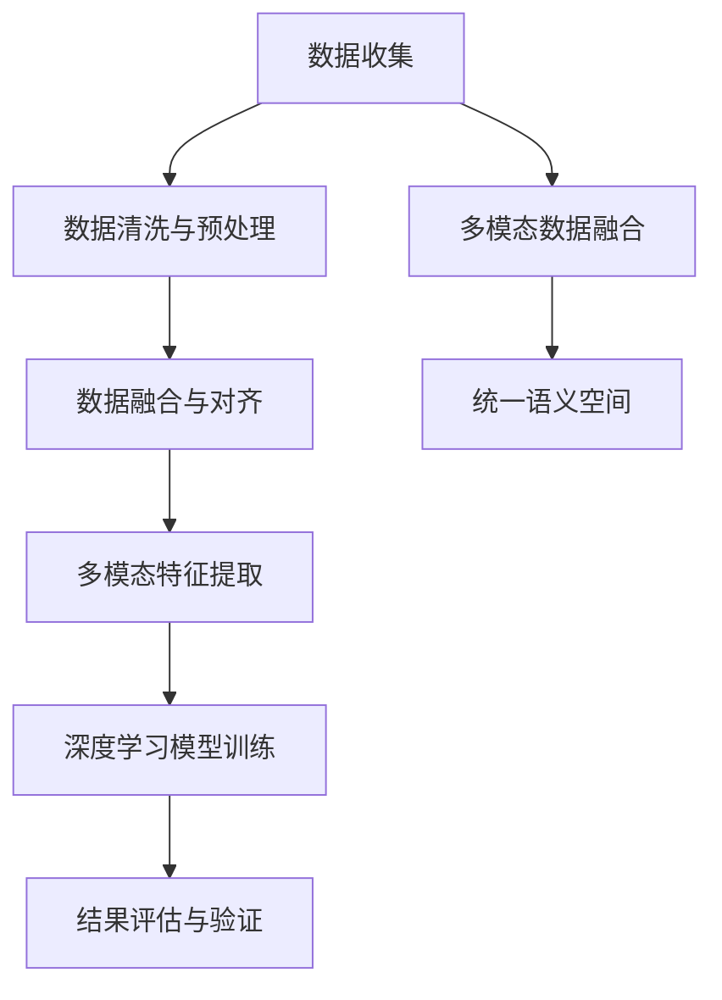

                 

# 知识发现引擎的多模态学习技术应用

> 关键词：知识发现引擎,多模态学习,深度学习,大数据,复杂网络分析

## 1. 背景介绍

在当今数字化时代，数据已成为关键资产，驱动各行各业的发展。然而，大量分散的、异构的数据源和复杂的数据类型使得数据发现和利用变得困难。知识发现引擎（Knowledge Discovery Engine, KDE）是用于处理和分析大规模数据集，从中提取有用知识和模式的工具。随着多模态数据的增多，传统的单模态分析方法已经无法满足需求，多模态学习技术应运而生，成为知识发现领域的一大突破。

### 1.1 问题由来

知识发现和数据挖掘一直是信息领域的重要研究方向，在金融、医疗、零售、社交网络等领域有广泛应用。然而，数据类型的多样性、数据规模的庞大和数据来源的复杂性使得传统单模态分析方法难以应对。

1. **数据多样性**：文本、图像、音频、视频等不同类型的数据具有不同的特征表示，需要综合考虑才能获得全面信息。
2. **数据规模**：海量数据带来了处理和存储的巨大挑战，需要高效、低成本的计算方法和工具。
3. **数据来源复杂性**：数据来自多种渠道和平台，具有不同的格式和语义，需要统一处理。

多模态学习技术通过将多源异构数据进行融合，构建统一的语义空间，利用深度学习等先进技术，实现高效的知识发现和数据挖掘。

### 1.2 问题核心关键点

多模态学习技术的关键点包括：

1. **数据融合与对齐**：将不同模态的数据转换为统一的表示形式，构建语义空间。
2. **深度学习模型选择**：选择适合多模态数据的深度学习模型，如卷积神经网络（CNN）、循环神经网络（RNN）、图神经网络（GNN）等。
3. **数据标注与标签处理**：对多模态数据进行标注，并对标签进行处理和优化。
4. **多模态特征提取**：从多模态数据中提取特征，包括文本、图像、声音等多种形式的特征。
5. **模型训练与优化**：通过训练优化深度学习模型，提高准确率和鲁棒性。
6. **结果评估与验证**：通过评估指标对知识发现结果进行验证和改进。

以下我们将对上述关键点进行深入探讨。

## 2. 核心概念与联系

### 2.1 核心概念概述

多模态学习（Multi-modal Learning）是指同时处理多种类型的数据（如文本、图像、音频等），从中提取更全面的知识和模式。知识发现引擎（KDE）是一种用于挖掘、分析和展示数据中隐含的知识和模式的高级软件系统。

多模态学习与知识发现引擎的联系主要体现在：

1. **数据源统一**：多模态学习技术可以将不同类型的数据统一处理，构建统一的语义空间，为知识发现提供基础。
2. **语义理解**：通过深度学习模型，多模态学习可以更深入地理解数据中的语义信息，提高知识发现的准确性。
3. **模式识别**：多模态学习可以识别更复杂、更抽象的模式，如图像中的纹理、形状，文本中的语义关联等，从而提供更深层次的知识发现。

### 2.2 核心概念原理和架构的 Mermaid 流程图



此流程图展示了多模态学习在知识发现中的应用流程。首先，通过数据收集和预处理，将不同模态的数据统一；然后，通过特征提取和多模态融合，构建统一的语义空间；最后，通过深度学习模型训练，提取知识和模式，并进行评估验证。

## 3. 核心算法原理 & 具体操作步骤

### 3.1 算法原理概述

多模态学习技术通常包括以下步骤：

1. **数据收集与预处理**：收集不同类型的数据，并进行清洗和预处理。
2. **多模态数据融合**：将不同类型的数据转换为统一的表示形式，构建统一的语义空间。
3. **多模态特征提取**：从不同模态的数据中提取特征。
4. **深度学习模型训练**：利用深度学习模型对多模态数据进行训练，提取知识和模式。
5. **结果评估与验证**：通过评估指标对知识发现结果进行验证和改进。

### 3.2 算法步骤详解

#### 3.2.1 数据收集与预处理

数据收集与预处理是知识发现的基础。数据预处理包括数据清洗、格式转换和归一化等步骤。

**数据清洗**：去除噪声和异常值，确保数据的准确性和完整性。

**格式转换**：将不同格式的数据转换为统一格式，如将文本数据转换为数字形式。

**归一化**：将数据缩放到同一范围内，以便更好地处理。

#### 3.2.2 多模态数据融合

多模态数据融合是构建统一语义空间的关键步骤。常用的融合方法包括特征映射、线性变换和特征融合等。

**特征映射**：将不同模态的数据映射到同一特征空间，如将文本数据映射为向量形式。

**线性变换**：对不同模态的数据进行线性变换，使其在空间中更加接近。

**特征融合**：将不同模态的数据特征进行融合，形成综合特征。

#### 3.2.3 多模态特征提取

多模态特征提取是从不同类型的数据中提取特征，以便进行后续的深度学习处理。常用的特征提取方法包括：

**文本特征提取**：通过自然语言处理技术，如分词、词向量等，提取文本特征。

**图像特征提取**：通过卷积神经网络（CNN）等方法，提取图像特征。

**声音特征提取**：通过声学模型，提取声音特征。

#### 3.2.4 深度学习模型训练

深度学习模型训练是知识发现的核心步骤。常用的深度学习模型包括卷积神经网络（CNN）、循环神经网络（RNN）、图神经网络（GNN）等。

**卷积神经网络（CNN）**：用于处理图像和文本数据，提取局部特征。

**循环神经网络（RNN）**：用于处理序列数据，如时间序列数据。

**图神经网络（GNN）**：用于处理图数据，提取全局和局部特征。

#### 3.2.5 结果评估与验证

结果评估与验证是知识发现的重要环节，用于评估模型的准确性和鲁棒性。常用的评估指标包括准确率、召回率、F1值等。

**准确率（Accuracy）**：预测正确的样本数占总样本数的比例。

**召回率（Recall）**：预测正确的正样本数占实际正样本数的比例。

**F1值（F1-Score）**：准确率和召回率的调和平均数。

### 3.3 算法优缺点

#### 3.3.1 优点

1. **数据融合能力**：多模态学习可以处理不同类型的数据，构建统一的语义空间。
2. **深度学习模型强大**：深度学习模型可以处理复杂的数据结构和模式。
3. **鲁棒性高**：多模态学习通过多源数据融合，具有更高的鲁棒性和抗干扰能力。
4. **适用范围广**：适用于各种类型的数据，如图像、文本、声音等。
5. **应用场景多样**：广泛应用于金融、医疗、零售、社交网络等领域。

#### 3.3.2 缺点

1. **计算复杂度高**：多模态数据和深度学习模型需要大量的计算资源。
2. **标注数据需求大**：多模态学习需要大量标注数据，增加了数据获取的难度。
3. **模型复杂度高**：深度学习模型复杂度高，训练和推理速度较慢。
4. **数据对齐难度大**：不同类型的数据特征表示差异大，对齐难度大。
5. **结果解释性差**：深度学习模型通常具有黑盒特性，难以解释其内部工作机制。

### 3.4 算法应用领域

多模态学习技术广泛应用于多个领域，包括：

1. **金融领域**：通过多模态数据（如股票价格、新闻、社交媒体等）进行风险评估和投资决策。

2. **医疗领域**：通过多模态数据（如患者影像、电子病历、基因数据等）进行疾病诊断和治疗方案优化。

3. **零售领域**：通过多模态数据（如消费者行为数据、商品评论、社交媒体等）进行市场分析和个性化推荐。

4. **社交网络**：通过多模态数据（如用户行为数据、社交关系、文本数据等）进行用户画像和情感分析。

5. **智能家居**：通过多模态数据（如声音、图像、传感器数据等）进行智能控制和环境监测。

6. **智慧城市**：通过多模态数据（如交通数据、环境数据、物联网数据等）进行城市管理和规划。

## 4. 数学模型和公式 & 详细讲解 & 举例说明

### 4.1 数学模型构建

假设有多模态数据集 $D=\{(x_i, y_i)\}_{i=1}^N$，其中 $x_i$ 为多模态数据，包括文本、图像、声音等，$y_i$ 为标签。多模态学习模型的目标是找到最优的模型参数 $\theta$，使得损失函数最小化：

$$
\min_{\theta} \sum_{i=1}^N \ell(x_i, y_i, \theta)
$$

其中 $\ell$ 为多模态数据的损失函数，可以是交叉熵损失、均方误差损失等。

### 4.2 公式推导过程

以文本-图像多模态数据为例，假设文本特征为 $x_{text}$，图像特征为 $x_{image}$，标签为 $y$。

**交叉熵损失**：

$$
\ell(x_i, y_i, \theta) = -\log P(y_i | x_{text}, x_{image}, \theta)
$$

其中 $P$ 为预测概率分布，可以通过深度学习模型计算。

**均方误差损失**：

$$
\ell(x_i, y_i, \theta) = \frac{1}{2} \left\| y_i - P(y_i | x_{text}, x_{image}, \theta) \right\|^2
$$

其中 $\left\| \cdot \right\|$ 表示欧式范数。

### 4.3 案例分析与讲解

假设有一个多模态数据集，包含文本和图像。文本数据为情感评论，图像数据为对应的商品图片。任务是预测商品销量。

**数据预处理**：
1. 文本数据：去除停用词，进行词向量化。
2. 图像数据：进行归一化和降维。

**多模态数据融合**：
1. 文本特征：使用卷积神经网络（CNN）提取特征。
2. 图像特征：使用卷积神经网络（CNN）提取特征。
3. 融合方法：使用特征拼接或加权融合。

**深度学习模型训练**：
1. 模型选择：使用多层感知器（MLP）或卷积神经网络（CNN）。
2. 训练流程：前向传播计算损失函数，反向传播更新模型参数。
3. 优化器：使用Adam或SGD等优化器。

**结果评估与验证**：
1. 评估指标：准确率、召回率、F1值。
2. 验证方法：交叉验证和留一验证。

## 5. 项目实践：代码实例和详细解释说明

### 5.1 开发环境搭建

1. **Python环境**：使用Anaconda创建虚拟环境，安装Python 3.8。
2. **深度学习框架**：安装TensorFlow和PyTorch。
3. **数据处理库**：安装Pandas和NumPy。
4. **可视化库**：安装Matplotlib和Seaborn。

### 5.2 源代码详细实现

以文本-图像多模态数据为例，实现基于卷积神经网络的多模态学习模型。

```python
import tensorflow as tf
from tensorflow.keras.layers import Input, Conv2D, Flatten, Dense, concatenate
from tensorflow.keras.models import Model

# 定义文本特征提取器
text_input = Input(shape=(None,), name='text_input')
text_embeddings = Embedding(max_words, embed_dim)(text_input)
text_features = Conv1D(64, 3)(text_embeddings)

# 定义图像特征提取器
image_input = Input(shape=(img_height, img_width, 3), name='image_input')
image_features = Conv2D(64, (3, 3), activation='relu')(image_input)
image_features = MaxPooling2D(pool_size=(2, 2))(image_features)

# 融合多模态特征
concat_layer = concatenate([text_features, image_features])

# 定义深度学习模型
x = Dense(128, activation='relu')(concat_layer)
output = Dense(1, activation='sigmoid')(x)

# 构建模型
model = Model(inputs=[text_input, image_input], outputs=output)

# 编译模型
model.compile(optimizer='adam', loss='binary_crossentropy', metrics=['accuracy'])
```

### 5.3 代码解读与分析

**文本特征提取**：
1. 使用Embedding层将文本转换为词向量。
2. 使用Conv1D层提取文本特征。

**图像特征提取**：
1. 使用Conv2D层提取图像特征。
2. 使用MaxPooling层降维。

**多模态特征融合**：
1. 使用concatenate层将文本和图像特征拼接在一起。

**深度学习模型构建**：
1. 使用Dense层进行特征融合。
2. 使用Dense层输出预测结果。

**模型训练与评估**：
1. 使用adam优化器进行模型训练。
2. 使用binary_crossentropy损失函数进行二分类任务。

### 5.4 运行结果展示

```python
# 训练模型
history = model.fit([train_texts, train_images], train_labels, epochs=10, batch_size=32, validation_data=(val_texts, val_images, val_labels))

# 评估模型
test_loss, test_acc = model.evaluate([test_texts, test_images], test_labels)
print('Test loss:', test_loss)
print('Test accuracy:', test_acc)
```

## 6. 实际应用场景

### 6.1 金融领域

金融领域中，通过多模态数据（如新闻、股票价格、社交媒体等）进行风险评估和投资决策。多模态学习可以处理不同类型的数据，构建统一的语义空间，提高决策的准确性和鲁棒性。

**应用场景**：
1. 股票价格预测：结合新闻和社交媒体数据，预测股票价格变化。
2. 信用评分：通过分析客户的行为数据和社交网络，进行信用评分。
3. 市场分析：通过多模态数据，分析市场趋势和情感变化。

### 6.2 医疗领域

医疗领域中，通过多模态数据（如患者影像、电子病历、基因数据等）进行疾病诊断和治疗方案优化。多模态学习可以处理不同类型的数据，构建统一的语义空间，提高诊断和治疗的准确性和可靠性。

**应用场景**：
1. 影像诊断：结合影像数据和临床数据，进行疾病诊断。
2. 基因分析：通过基因数据和临床数据，预测疾病风险。
3. 治疗方案优化：结合影像数据和临床数据，制定治疗方案。

### 6.3 零售领域

零售领域中，通过多模态数据（如消费者行为数据、商品评论、社交媒体等）进行市场分析和个性化推荐。多模态学习可以处理不同类型的数据，构建统一的语义空间，提高推荐的精准性和用户满意度。

**应用场景**：
1. 市场分析：通过消费者行为数据和社交媒体数据，分析市场趋势。
2. 个性化推荐：通过商品评论和社交媒体数据，进行个性化推荐。
3. 客户画像：通过多模态数据，建立客户画像。

### 6.4 未来应用展望

未来，多模态学习技术将在更多领域得到应用，为各个行业带来变革性影响。

1. **智能家居**：通过多模态数据（如声音、图像、传感器数据等）进行智能控制和环境监测。
2. **智慧城市**：通过多模态数据（如交通数据、环境数据、物联网数据等）进行城市管理和规划。
3. **智能制造**：通过多模态数据（如传感器数据、图像数据、声音数据等）进行智能制造和质量控制。
4. **智能交通**：通过多模态数据（如车辆数据、道路数据、天气数据等）进行交通管理和优化。

## 7. 工具和资源推荐

### 7.1 学习资源推荐

1. **《深度学习》课程**：斯坦福大学深度学习课程，涵盖深度学习的基础理论和实践。
2. **《TensorFlow实战》书籍**：TensorFlow官方书籍，详细介绍了TensorFlow的搭建和应用。
3. **《PyTorch深度学习》书籍**：PyTorch官方书籍，介绍了PyTorch的搭建和应用。
4. **Kaggle竞赛平台**：Kaggle提供大量数据集和竞赛项目，帮助学习多模态数据处理和深度学习。
5. **HuggingFace官方文档**：HuggingFace提供的深度学习模型和工具，涵盖多模态数据处理。

### 7.2 开发工具推荐

1. **TensorFlow**：用于深度学习和模型训练的强大框架。
2. **PyTorch**：深度学习领域的主流框架，支持动态计算图。
3. **Keras**：基于TensorFlow和PyTorch的高层API，简化模型搭建。
4. **Jupyter Notebook**：交互式编程和数据分析平台。
5. **Google Colab**：基于Jupyter Notebook的在线开发环境，支持GPU和TPU计算。

### 7.3 相关论文推荐

1. **《深度学习中的多模态学习》**：介绍深度学习中多模态学习的基本方法和应用。
2. **《图神经网络在多模态学习中的应用》**：介绍图神经网络在多模态学习中的应用。
3. **《多模态学习中的数据融合技术》**：介绍多模态数据融合的常用方法和技术。

## 8. 总结：未来发展趋势与挑战

### 8.1 研究成果总结

多模态学习技术在知识发现领域取得了重要进展，其应用范围涵盖金融、医疗、零售等多个行业。通过融合不同类型的数据，构建统一的语义空间，显著提高了知识发现的准确性和鲁棒性。

### 8.2 未来发展趋势

未来，多模态学习技术将呈现以下几个发展趋势：

1. **多模态融合技术的提升**：改进数据融合方法，提高融合效果和效率。
2. **深度学习模型的优化**：提升深度学习模型的准确性和鲁棒性。
3. **模型解释性增强**：提高模型的可解释性，增加用户信任和接受度。
4. **边缘计算的应用**：将多模态学习技术应用于边缘计算设备，实现实时分析和决策。
5. **跨模态迁移学习**：将多模态学习技术应用于不同模态的数据迁移，提高模型泛化能力。

### 8.3 面临的挑战

尽管多模态学习技术取得了显著进展，但仍面临以下挑战：

1. **数据获取难度大**：多模态数据收集和预处理复杂，需要大量资源和时间。
2. **数据对齐困难**：不同模态的数据特征表示差异大，对齐难度大。
3. **计算资源需求高**：深度学习模型计算资源需求高，需要高性能计算设备。
4. **模型复杂度高**：深度学习模型复杂度高，训练和推理速度较慢。
5. **结果解释性差**：深度学习模型通常具有黑盒特性，难以解释其内部工作机制。

### 8.4 研究展望

未来，多模态学习技术需要在以下几个方面进行探索和改进：

1. **改进数据预处理技术**：提高数据预处理效率和效果。
2. **优化模型训练方法**：提高模型训练速度和准确性。
3. **增强模型解释性**：提高模型的可解释性和透明度。
4. **探索跨模态迁移学习**：提高模型的泛化能力和迁移性能。
5. **结合知识图谱技术**：利用知识图谱技术增强多模态学习的效果。

## 9. 附录：常见问题与解答

### 9.1 问题1：多模态数据融合的常用方法有哪些？

**回答**：多模态数据融合的常用方法包括特征映射、线性变换和特征融合等。特征映射将不同模态的数据映射到同一特征空间，如将文本数据映射为向量形式。线性变换对不同模态的数据进行线性变换，使其在空间中更加接近。特征融合将不同模态的数据特征进行融合，形成综合特征。

### 9.2 问题2：多模态学习模型的评估指标有哪些？

**回答**：多模态学习模型的评估指标包括准确率、召回率、F1值等。准确率是预测正确的样本数占总样本数的比例。召回率是预测正确的正样本数占实际正样本数的比例。F1值是准确率和召回率的调和平均数。

### 9.3 问题3：如何提高多模态学习模型的鲁棒性？

**回答**：提高多模态学习模型的鲁棒性可以通过以下方法：
1. 数据增强：通过回译、近义替换等方式扩充训练集。
2. 正则化：使用L2正则、Dropout、Early Stopping等防止过拟合。
3. 对抗训练：加入对抗样本，提高模型鲁棒性。
4. 参数高效微调：只调整少量参数，固定大部分预训练权重不变。

### 9.4 问题4：多模态学习在哪些领域有应用？

**回答**：多模态学习在金融、医疗、零售、社交网络等领域有广泛应用。在金融领域，通过多模态数据进行风险评估和投资决策。在医疗领域，通过多模态数据进行疾病诊断和治疗方案优化。在零售领域，通过多模态数据进行市场分析和个性化推荐。在社交网络领域，通过多模态数据进行用户画像和情感分析。

---

作者：禅与计算机程序设计艺术 / Zen and the Art of Computer Programming

