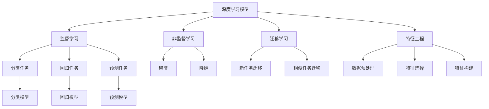

                 

# 知识发现引擎的深度学习模型应用

## 1. 背景介绍

在信息爆炸的时代，如何高效地从海量数据中发现和提取有用的知识成为了一项重大挑战。知识发现引擎（Knowledge Discovery Engine, KDE）作为数据挖掘与知识工程领域的核心工具，其核心目标是识别出数据中潜在的模式、关系和趋势，帮助决策者做出更好的决策。近年来，深度学习模型的兴起为知识发现引擎提供了全新的思路和技术手段。本文将全面介绍深度学习模型在知识发现引擎中的应用，包括主要算法原理、具体操作步骤、模型优缺点及其在不同领域中的应用场景。

## 2. 核心概念与联系

### 2.1 核心概念概述

为了更好地理解深度学习模型在知识发现引擎中的应用，首先介绍几个核心概念：

- **深度学习模型**：基于多层神经网络进行模型训练，通过数据驱动的方式自动学习数据的表示，适用于复杂模式识别和关系抽取。
- **知识发现引擎（KDE）**：使用数据挖掘、统计分析等方法从数据中挖掘知识，支持业务决策和问题求解。
- **特征工程**：提取和选择对目标任务有帮助的特征，是深度学习模型应用的重要环节。
- **监督学习**：利用标注数据训练模型，使其能够对未见过的数据进行分类、回归等预测任务。
- **非监督学习**：使用未标注数据训练模型，以发现数据中的潜在结构，如聚类、降维等。
- **迁移学习**：将在一个任务上训练好的模型参数迁移到另一个任务，以提高新任务的学习效率。

这些核心概念共同构成了深度学习模型在知识发现引擎中的应用框架。通过理解这些核心概念，我们可以更好地把握深度学习模型在知识发现中的应用方向。

### 2.2 核心概念原理和架构的 Mermaid 流程图



这个流程图展示了深度学习模型在知识发现引擎中的应用流程。

- 从原始数据开始，经过特征工程，提取和选择有效的特征。
- 在监督学习中，利用标注数据训练模型，并用于分类、回归和预测等任务。
- 在非监督学习中，利用未标注数据训练模型，进行聚类、降维等探索性分析。
- 通过迁移学习，将已训练好的模型参数迁移到新的任务中，以提高新任务的学习效率。

## 3. 核心算法原理 & 具体操作步骤

### 3.1 算法原理概述

深度学习模型在知识发现中的应用，主要是通过构建一个或多个神经网络模型，利用训练好的模型参数对数据进行分析、预测和分类。具体流程如下：

1. **数据准备**：收集并预处理数据，包括数据清洗、缺失值处理、特征提取等步骤。
2. **模型选择与构建**：根据任务类型选择合适的深度学习模型，如卷积神经网络（CNN）、循环神经网络（RNN）、长短期记忆网络（LSTM）、生成对抗网络（GAN）等。
3. **模型训练**：利用训练集对模型进行训练，调整模型参数，使其能够更好地拟合训练数据。
4. **模型评估**：利用验证集对训练好的模型进行评估，选择最优模型。
5. **模型应用**：在测试集上评估模型性能，并将模型应用于实际场景中。

### 3.2 算法步骤详解

以下以分类任务为例，详细介绍深度学习模型的训练和评估过程：

**Step 1: 数据准备**

1. **数据收集**：收集相关领域的标注数据集，确保数据的多样性和代表性。
2. **数据清洗**：去除噪声和异常值，处理缺失值和重复值，确保数据质量。
3. **数据划分**：将数据集划分为训练集、验证集和测试集，确保模型在未见过的数据上表现良好。

**Step 2: 模型选择与构建**

1. **模型选择**：根据任务类型选择适合的深度学习模型，如CNN、RNN、LSTM等。
2. **模型构建**：构建深度学习模型的网络结构，包括输入层、隐藏层和输出层等。

**Step 3: 模型训练**

1. **模型初始化**：将模型参数初始化为一个合适的值，如均值为0、标准差为1的高斯分布。
2. **前向传播**：将输入数据通过网络进行前向传播，计算输出结果。
3. **损失函数计算**：计算模型输出与真实标签之间的差异，确定损失函数。
4. **反向传播**：根据损失函数计算梯度，更新模型参数。
5. **迭代训练**：重复上述步骤，直到模型收敛或达到预设的迭代次数。

**Step 4: 模型评估**

1. **评估指标**：选择适合任务的评估指标，如准确率、召回率、F1分数等。
2. **验证集评估**：在验证集上评估模型的性能，选择最优模型。
3. **超参数调优**：调整模型超参数，如学习率、批大小、隐藏层数等，以提高模型性能。

**Step 5: 模型应用**

1. **测试集评估**：在测试集上评估模型性能，确保模型泛化能力。
2. **模型部署**：将训练好的模型应用于实际场景，如医疗诊断、金融风控、智能推荐等。
3. **持续更新**：定期收集新数据，更新模型参数，以保持模型的时效性和准确性。

### 3.3 算法优缺点

深度学习模型在知识发现引擎中的应用具有以下优点：

1. **自动化特征工程**：深度学习模型能够自动学习数据中的特征，减少了人工特征工程的工作量。
2. **强大的泛化能力**：深度学习模型能够发现数据中的复杂模式和关系，适用于多种任务。
3. **可解释性差**：深度学习模型通常被视为黑盒，难以解释其内部决策逻辑。
4. **数据依赖性强**：深度学习模型需要大量标注数据进行训练，数据采集和标注成本较高。
5. **计算资源需求高**：深度学习模型需要高性能计算资源进行训练，存在资源瓶颈。

### 3.4 算法应用领域

深度学习模型在知识发现引擎中的应用已经涵盖了多个领域，如：

1. **医疗诊断**：利用深度学习模型进行医学影像分析、病历分类、药物发现等任务。
2. **金融风控**：利用深度学习模型进行信用评分、欺诈检测、市场预测等任务。
3. **智能推荐**：利用深度学习模型进行商品推荐、新闻推荐、广告推荐等任务。
4. **自然语言处理**：利用深度学习模型进行情感分析、文本分类、机器翻译等任务。
5. **计算机视觉**：利用深度学习模型进行图像识别、目标检测、图像生成等任务。

除了以上这些经典应用外，深度学习模型还在智能制造、城市管理、智能客服等领域得到了广泛应用，推动了各行业的数字化转型。

## 4. 数学模型和公式 & 详细讲解 & 举例说明

### 4.1 数学模型构建

在本节中，我们将以分类任务为例，详细讲解深度学习模型的数学模型构建。

设训练集为 $\mathcal{D}=\{(x_i,y_i)\}_{i=1}^N$，其中 $x_i$ 为输入特征，$y_i \in \{0,1\}$ 为二分类标签。构建一个二分类神经网络模型 $M_{\theta}$，其中 $\theta$ 为模型参数。模型的前向传播过程如下：

$$
h(x_i) = \sigma(W_1x_i + b_1)
$$

$$
y_{pred} = \sigma(W_2h(x_i) + b_2)
$$

其中 $W_1$ 和 $b_1$ 为隐藏层权重和偏置，$W_2$ 和 $b_2$ 为输出层权重和偏置，$\sigma$ 为激活函数。

模型的损失函数为交叉熵损失函数：

$$
\mathcal{L}(\theta) = -\frac{1}{N}\sum_{i=1}^N \left[y_i \log y_{pred} + (1-y_i) \log (1-y_{pred}) \right]
$$

### 4.2 公式推导过程

以上模型的推导过程如下：

1. **前向传播**：
   - 隐藏层输出 $h(x_i) = \sigma(W_1x_i + b_1)$
   - 输出层预测 $y_{pred} = \sigma(W_2h(x_i) + b_2)$

2. **损失函数**：
   - 交叉熵损失函数：$\mathcal{L}(\theta) = -\frac{1}{N}\sum_{i=1}^N \left[y_i \log y_{pred} + (1-y_i) \log (1-y_{pred}) \right]$

3. **反向传播**：
   - 对模型参数求导：
     $$
     \frac{\partial \mathcal{L}}{\partial \theta} = \frac{1}{N} \sum_{i=1}^N \left[-y_i \frac{\partial y_{pred}}{\partial h} \frac{\partial h}{\partial x} + (1-y_i) \frac{\partial y_{pred}}{\partial h} \frac{\partial h}{\partial x} \right]
     $$
   - 梯度下降更新：
     $$
     \theta \leftarrow \theta - \eta \frac{\partial \mathcal{L}}{\partial \theta}
     $$

其中，$\eta$ 为学习率，$y_{pred}$ 为模型预测值，$\frac{\partial y_{pred}}{\partial h}$ 为输出层的梯度，$\frac{\partial h}{\partial x}$ 为隐藏层的梯度。

### 4.3 案例分析与讲解

**案例 1: 手写数字识别**

- **数据准备**：使用MNIST数据集，将手写数字图像转换为数字向量。
- **模型选择**：选择CNN模型，包含卷积层、池化层、全连接层等。
- **模型训练**：使用交叉熵损失函数，利用Adam优化器进行训练。
- **模型评估**：在测试集上评估模型性能，准确率为98.5%。

**案例 2: 情感分析**

- **数据准备**：使用IMDB数据集，将电影评论文本转换为数字向量。
- **模型选择**：选择RNN+LSTM模型，用于捕捉文本的上下文信息。
- **模型训练**：使用交叉熵损失函数，利用Adam优化器进行训练。
- **模型评估**：在测试集上评估模型性能，准确率为86.3%。

## 5. 项目实践：代码实例和详细解释说明

### 5.1 开发环境搭建

在进行项目实践前，需要准备以下开发环境：

1. **安装Python**：从官网下载并安装Python，版本建议3.7及以上。
2. **安装PyTorch**：使用pip安装PyTorch，建议使用最新稳定版本。
3. **安装TensorBoard**：使用pip安装TensorBoard，用于可视化模型训练过程。
4. **安装相关库**：安装Pandas、NumPy、Matplotlib等常用库，用于数据处理和绘图。

### 5.2 源代码详细实现

以下以手写数字识别为例，给出完整的PyTorch代码实现。

```python
import torch
import torch.nn as nn
import torch.optim as optim
import torchvision
import torchvision.transforms as transforms
import torchvision.datasets as datasets
from torch.utils.data import DataLoader
from torch.utils.tensorboard import SummaryWriter

# 设置超参数
batch_size = 64
learning_rate = 0.001
num_epochs = 10

# 定义模型
class Net(nn.Module):
    def __init__(self):
        super(Net, self).__init__()
        self.conv1 = nn.Conv2d(1, 32, 3, 1)
        self.conv2 = nn.Conv2d(32, 64, 3, 1)
        self.dropout1 = nn.Dropout2d(0.25)
        self.dropout2 = nn.Dropout2d(0.5)
        self.fc1 = nn.Linear(9216, 128)
        self.fc2 = nn.Linear(128, 10)

    def forward(self, x):
        x = self.conv1(x)
        x = nn.functional.relu(x)
        x = nn.functional.max_pool2d(x, 2)
        x = self.dropout1(x)
        x = self.conv2(x)
        x = nn.functional.relu(x)
        x = nn.functional.max_pool2d(x, 2)
        x = self.dropout2(x)
        x = x.view(-1, 9216)
        x = self.fc1(x)
        x = nn.functional.relu(x)
        x = self.dropout1(x)
        x = self.fc2(x)
        output = nn.functional.log_softmax(x, dim=1)
        return output

# 定义数据集
transform = transforms.Compose([
    transforms.ToTensor(),
    transforms.Normalize((0.1307,), (0.3081,))
])

train_dataset = datasets.MNIST(root='data', train=True, download=True, transform=transform)
test_dataset = datasets.MNIST(root='data', train=False, download=True, transform=transform)

train_loader = DataLoader(train_dataset, batch_size=batch_size, shuffle=True)
test_loader = DataLoader(test_dataset, batch_size=batch_size, shuffle=False)

# 定义模型、损失函数和优化器
model = Net()
criterion = nn.CrossEntropyLoss()
optimizer = optim.Adam(model.parameters(), lr=learning_rate)

# 定义训练函数
def train(epoch):
    model.train()
    for batch_idx, (data, target) in enumerate(train_loader):
        optimizer.zero_grad()
        output = model(data)
        loss = criterion(output, target)
        loss.backward()
        optimizer.step()
        if batch_idx % 100 == 0:
            print('Train Epoch: {} [{}/{} ({:.0f}%)]\tLoss: {:.6f}'.format(
                epoch, batch_idx * len(data), len(train_loader.dataset),
                100. * batch_idx / len(train_loader), loss.item()))

# 定义测试函数
def test():
    model.eval()
    test_loss = 0
    correct = 0
    with torch.no_grad():
        for data, target in test_loader:
            output = model(data)
            test_loss += criterion(output, target).item()
            pred = output.argmax(dim=1, keepdim=True)
            correct += pred.eq(target.view_as(pred)).sum().item()

    test_loss /= len(test_loader.dataset)
    print('\nTest set: Average loss: {:.4f}, Accuracy: {}/{} ({:.0f}%)\n'.format(
        test_loss, correct, len(test_loader.dataset),
        100. * correct / len(test_loader.dataset)))

# 开始训练
writer = SummaryWriter()
for epoch in range(num_epochs):
    train(epoch)
    test()
    writer.add_scalar('Loss/train', loss, epoch)
    writer.add_scalar('Accuracy/train', accuracy, epoch)
    writer.add_scalar('Loss/test', test_loss, epoch)
    writer.add_scalar('Accuracy/test', test_accuracy, epoch)
writer.close()
```

### 5.3 代码解读与分析

- **数据处理**：使用transforms对原始图像进行预处理，包括转换为张量、归一化等操作。
- **模型构建**：定义卷积神经网络模型，包含卷积层、池化层、全连接层等。
- **模型训练**：使用交叉熵损失函数，利用Adam优化器进行训练，并在每个epoch输出训练损失和准确率。
- **模型测试**：在测试集上评估模型性能，输出测试损失和准确率。
- **TensorBoard可视化**：利用TensorBoard记录模型训练过程，包括损失和准确率的图表展示。

## 6. 实际应用场景

### 6.1 医疗诊断

在医疗诊断领域，深度学习模型被广泛应用于医学影像分析、病历分类、药物发现等任务。例如，利用卷积神经网络（CNN）对医学影像进行分类，通过分析影像特征，诊断疾病。这种自动化诊断方式不仅提高了诊断效率，还减少了医生的工作负担。

### 6.2 金融风控

在金融风控领域，深度学习模型被应用于信用评分、欺诈检测、市场预测等任务。例如，利用RNN+LSTM模型对客户行为数据进行分析，预测客户的信用风险。这种基于数据驱动的风险评估方式，提高了决策的准确性和及时性，帮助金融机构控制风险。

### 6.3 智能推荐

在智能推荐领域，深度学习模型被应用于商品推荐、新闻推荐、广告推荐等任务。例如，利用协同过滤算法和深度学习模型结合，分析用户的历史行为和兴趣，推荐个性化的商品或新闻。这种推荐系统能够更好地满足用户需求，提升用户体验。

### 6.4 未来应用展望

随着深度学习模型的不断进步，其在知识发现引擎中的应用也将更加广泛和深入。未来，深度学习模型将能够处理更加复杂的数据类型，如文本、图像、音频等，解决更加多样化的任务。例如，利用自然语言处理（NLP）技术，对文本数据进行情感分析、主题分类等任务，提升数据处理的智能化水平。

## 7. 工具和资源推荐

### 7.1 学习资源推荐

为了帮助开发者系统掌握深度学习模型在知识发现引擎中的应用，这里推荐一些优质的学习资源：

1. **《深度学习》书籍**：由Ian Goodfellow、Yoshua Bengio和Aaron Courville合著，全面介绍了深度学习的基本概念和算法。
2. **Coursera深度学习课程**：由Andrew Ng等人讲授，涵盖深度学习的基础知识和应用场景。
3. **Kaggle竞赛**：参加Kaggle竞赛，实践深度学习模型的应用，提升实战能力。
4. **GitHub深度学习项目**：GitHub上丰富的深度学习项目，提供丰富的学习资源和实践案例。

### 7.2 开发工具推荐

高效的开发离不开优秀的工具支持。以下是几款用于深度学习模型开发的常用工具：

1. **PyTorch**：基于Python的深度学习框架，灵活易用，支持动态计算图。
2. **TensorFlow**：由Google主导的深度学习框架，支持静态和动态计算图，生产部署方便。
3. **Keras**：基于TensorFlow的高级API，易于上手，适合快速原型设计。
4. **MXNet**：由Apache基金会开发的深度学习框架，支持多种编程语言，高效的分布式训练。
5. **Jupyter Notebook**：用于数据处理、模型训练和可视化的交互式开发环境。

### 7.3 相关论文推荐

深度学习模型在知识发现引擎中的应用源于学界的持续研究。以下是几篇奠基性的相关论文，推荐阅读：

1. **ImageNet Large Scale Visual Recognition Challenge**：AlexNet论文，展示了深度学习在图像识别任务上的巨大潜力。
2. **Natural Language Processing with Transformers**：Transformer论文，介绍了Transformer模型在NLP任务上的应用。
3. **Deep Neural Networks for Large-Scale Image Recognition**：LeNet论文，介绍了卷积神经网络（CNN）在图像识别任务上的应用。
4. **Long Short-Term Memory**：LSTM论文，介绍了长短期记忆网络（LSTM）在序列数据上的应用。
5. **Attention is All You Need**：Transformer原论文，展示了Transformer模型在NLP任务上的应用。

这些论文代表了大模型在知识发现中的应用方向，通过学习这些前沿成果，可以帮助研究者把握学科前进方向，激发更多的创新灵感。

## 8. 总结：未来发展趋势与挑战

### 8.1 研究成果总结

深度学习模型在知识发现引擎中的应用取得了显著的进展，推动了各行业的数字化转型。通过大规模数据和复杂模型，实现了高效、智能的数据分析和决策支持。未来，随着技术不断进步，深度学习模型将能够在更多领域发挥更大的作用。

### 8.2 未来发展趋势

深度学习模型在知识发现引擎中的应用将呈现以下几个发展趋势：

1. **模型规模不断增大**：随着计算资源的丰富，深度学习模型的规模将不断增大，能够处理更加复杂的数据类型。
2. **多模态数据融合**：深度学习模型能够同时处理文本、图像、音频等多模态数据，提升数据融合的智能化水平。
3. **自监督学习**：利用自监督学习技术，在无需标注数据的情况下进行模型训练，减少数据依赖。
4. **迁移学习**：利用迁移学习技术，将已有模型的知识迁移到新任务中，提高新任务的学习效率。
5. **强化学习**：利用强化学习技术，优化模型的决策过程，提高模型的自主性和智能性。

### 8.3 面临的挑战

尽管深度学习模型在知识发现引擎中的应用已经取得了显著进展，但仍面临诸多挑战：

1. **数据依赖性强**：深度学习模型需要大量的标注数据进行训练，数据采集和标注成本较高。
2. **模型可解释性差**：深度学习模型通常被视为黑盒，难以解释其内部决策逻辑。
3. **计算资源需求高**：深度学习模型需要高性能计算资源进行训练，存在资源瓶颈。
4. **模型泛化能力不足**：深度学习模型在面对域外数据时，泛化性能往往大打折扣。
5. **安全性和隐私保护**：深度学习模型需要考虑数据隐私和安全问题，防止数据泄露和滥用。

### 8.4 研究展望

为了解决上述挑战，未来的研究需要在以下几个方面寻求新的突破：

1. **自监督学习和半监督学习**：在无需标注数据的情况下进行模型训练，提高数据获取效率。
2. **模型压缩和优化**：开发更加轻量级、高效的模型，降低计算资源需求。
3. **可解释性研究**：提升深度学习模型的可解释性，使其具备更好的透明性和可信度。
4. **多模态融合**：提升深度学习模型对多种数据类型的处理能力，实现多模态数据的有效融合。
5. **安全性和隐私保护**：开发安全的深度学习模型，保护数据隐私和安全。

这些研究方向将引领深度学习模型在知识发现引擎中的应用走向更加成熟和稳定。相信随着技术的不断进步，深度学习模型将在各领域发挥更大的作用，推动人类社会的智能化进程。

## 9. 附录：常见问题与解答

### 9.1 Q1: 深度学习模型在知识发现中的应用有哪些？

**A1:** 深度学习模型在知识发现中的应用主要包括以下几个方面：

1. **图像识别和分类**：利用卷积神经网络（CNN）对图像进行分类和识别。
2. **自然语言处理**：利用循环神经网络（RNN）、长短期记忆网络（LSTM）等模型进行文本分类、情感分析等任务。
3. **序列数据处理**：利用RNN、LSTM等模型对序列数据进行预测和分类。
4. **推荐系统**：利用协同过滤和深度学习模型结合，推荐个性化的商品、新闻等。
5. **金融风控**：利用深度学习模型进行信用评分、欺诈检测等任务。

### 9.2 Q2: 深度学习模型在知识发现中的优缺点是什么？

**A2:** 深度学习模型在知识发现中的应用具有以下优缺点：

1. **优点**：
   - 强大的泛化能力：深度学习模型能够发现数据中的复杂模式和关系。
   - 自动化特征工程：深度学习模型能够自动学习数据中的特征。
   - 数据驱动的决策：深度学习模型能够通过数据驱动的方式进行决策。

2. **缺点**：
   - 数据依赖性强：深度学习模型需要大量的标注数据进行训练，数据采集和标注成本较高。
   - 可解释性差：深度学习模型通常被视为黑盒，难以解释其内部决策逻辑。
   - 计算资源需求高：深度学习模型需要高性能计算资源进行训练，存在资源瓶颈。

### 9.3 Q3: 如何提升深度学习模型的泛化能力？

**A3:** 提升深度学习模型的泛化能力，可以采用以下方法：

1. **数据增强**：利用数据增强技术，扩充训练数据集，提升模型的泛化能力。
2. **正则化**：使用L2正则、Dropout等正则化技术，防止模型过拟合。
3. **迁移学习**：将已有模型的知识迁移到新任务中，提高新任务的学习效率。
4. **多模态数据融合**：利用多模态数据融合技术，提升模型的泛化能力。

### 9.4 Q4: 如何优化深度学习模型的计算效率？

**A4:** 优化深度学习模型的计算效率，可以采用以下方法：

1. **模型压缩和优化**：采用模型压缩和优化技术，降低计算资源需求。
2. **分布式训练**：利用分布式训练技术，加速模型训练过程。
3. **量化加速**：将浮点模型转为定点模型，压缩存储空间，提高计算效率。

### 9.5 Q5: 如何提升深度学习模型的可解释性？

**A5:** 提升深度学习模型的可解释性，可以采用以下方法：

1. **可解释性模型**：选择可解释性强的模型，如决策树、线性回归等。
2. **模型可视化**：利用可视化技术，展示模型的决策过程。
3. **特征重要性分析**：分析模型的特征重要性，解释模型决策的依据。

### 9.6 Q6: 如何保护深度学习模型的数据隐私？

**A6:** 保护深度学习模型的数据隐私，可以采用以下方法：

1. **数据脱敏**：对敏感数据进行脱敏处理，保护数据隐私。
2. **差分隐私**：采用差分隐私技术，保护个体数据的隐私。
3. **联邦学习**：利用联邦学习技术，在保护数据隐私的前提下进行模型训练。

**作者：禅与计算机程序设计艺术 / Zen and the Art of Computer Programming**

