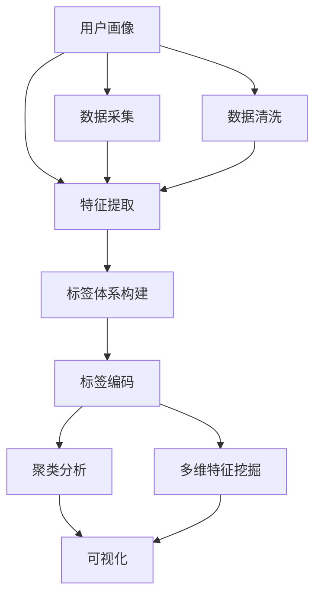

                 

# 知识发现引擎的用户画像标签体系

> 关键词：知识发现引擎,用户画像,标签体系,数据挖掘,推荐系统

## 1. 背景介绍

### 1.1 问题由来
在数字时代，互联网和社交媒体的发展极大地丰富了个人的信息行为和数据来源。用户画像(User Profile)作为一种描述个体特征和行为的工具，已经成为许多应用领域的基础。其中，知识发现引擎(Knowledge Discovery Engine)通过自动化分析和挖掘海量数据，为用户提供个性化的信息服务，已经广泛应用于电商、广告、社交网络等多个场景。构建有效的用户画像，是知识发现引擎的核心任务之一。

然而，现有的用户画像系统往往缺乏一致性和标准化，导致信息不一致、不全面、不深入等问题，难以满足多样化的知识发现需求。为了解决这一问题，本文提出了一套全面的用户画像标签体系，旨在通过规范化、统一化的方式，提高用户画像的质量和应用效果。

### 1.2 问题核心关键点
本文的核心目标在于构建一套通用的用户画像标签体系，用于描述和刻画用户的多维度特征，并通过合理的编码方式，确保标签数据的一致性和完整性。具体来说，本研究的关键点包括：

- 提出一套规范化的标签编码规则，统一描述用户画像的各个维度。
- 定义并细化各标签的语义，保证标签数据的标准化。
- 分析并构建标签之间的层次关系，支持聚类分析和多维特征挖掘。
- 设计有效的标签编码算法，提升标签体系的应用效率和准确性。

## 2. 核心概念与联系

### 2.1 核心概念概述

为更好地理解知识发现引擎中的用户画像标签体系，本节将介绍几个关键概念：

- 用户画像(User Profile)：通过数据采集和分析，构建个体特征和行为的综合描述，用于刻画用户的身份、兴趣、行为偏好等。
- 知识发现引擎(Knowledge Discovery Engine)：利用机器学习和数据挖掘技术，自动化分析和挖掘海量数据，提取有价值的信息和知识，以支持决策和应用。
- 标签体系(Label System)：用于描述和刻画用户画像的各个维度，通过标签编码和编码规则，实现数据的标准化和一致性。

### 2.2 核心概念原理和架构的 Mermaid 流程图


这个流程图展示了用户画像标签体系从数据采集到特征挖掘和标签编码的过程。

- 数据采集：从互联网和社交媒体等渠道收集用户数据。
- 数据清洗：对采集到的数据进行去重、去噪、格式转换等预处理。
- 特征提取：从清洗后的数据中提取用户的关键特征，如基本信息、兴趣偏好、行为记录等。
- 标签体系构建：定义一套规范化的标签体系，用于描述和刻画用户的多维度特征。
- 标签编码：将用户特征映射为具体的标签编码，实现数据的标准化和一致性。
- 聚类分析：通过标签编码的聚类，发现用户群体的特征规律和行为模式。
- 多维特征挖掘：结合标签体系和多维特征，深入挖掘用户画像的潜层次信息。
- 可视化：利用可视化工具展示用户画像的特征和行为，帮助理解用户需求和行为特征。

## 3. 核心算法原理 & 具体操作步骤
### 3.1 算法原理概述

本文提出的用户画像标签体系，基于以下几大算法原理：

- **基于TF-IDF的特征提取**：利用词频-逆文档频率(Term Frequency-Inverse Document Frequency, TF-IDF)算法，提取用户文本数据中的关键特征。
- **层次聚类算法**：结合层次聚类算法，构建标签之间的层次关系，支持多维特征的挖掘和分析。
- **主成分分析(PCA)**：利用主成分分析方法，对高维标签数据进行降维处理，提升数据的处理效率和准确性。
- **编码器-解码器框架**：使用基于神经网络的编码器-解码器框架，实现标签的自动编码和解码，提高标签体系的应用效率和灵活性。

### 3.2 算法步骤详解

本文的标签体系构建和标签编码步骤如下：

**Step 1: 数据采集和预处理**
- 从用户行为记录、社交媒体数据、电商交易数据等渠道，收集用户画像的原始数据。
- 对原始数据进行去重、去噪、格式转换等预处理，保证数据的质量和一致性。

**Step 2: 特征提取**
- 利用TF-IDF算法，从用户文本数据中提取关键词和关键短语，用于描述用户的兴趣偏好和行为特征。
- 结合用户基本信息、行为数据、社交网络数据等，构建用户的多维特征向量。

**Step 3: 标签体系构建**
- 定义并细化用户画像的各个维度，包括基本信息、兴趣偏好、行为记录等。
- 结合层次聚类算法，构建标签之间的层次关系，支持多维特征的挖掘和分析。

**Step 4: 标签编码**
- 使用基于神经网络的编码器-解码器框架，将用户特征映射为具体的标签编码。
- 结合主成分分析方法，对高维标签数据进行降维处理，提升数据的处理效率和准确性。

**Step 5: 多维特征挖掘**
- 利用降维后的标签数据，结合标签之间的层次关系，进行多维特征的挖掘和分析。
- 通过聚类算法，发现用户群体的特征规律和行为模式，进一步刻画用户画像。

### 3.3 算法优缺点

本文提出的用户画像标签体系，具有以下优点：
- **标准化和一致性**：通过规范化的标签编码规则，确保标签数据的标准化和一致性，提高数据的质量和应用效果。
- **高维特征降维**：利用主成分分析方法，对高维标签数据进行降维处理，提升数据的处理效率和准确性。
- **灵活的编码和解码**：使用基于神经网络的编码器-解码器框架，实现标签的自动编码和解码，提高标签体系的应用效率和灵活性。

同时，该方法也存在一些局限性：
- **数据依赖性强**：标签体系的构建和标签编码依赖于高质量的数据，数据采集和预处理难度较大。
- **算法复杂度较高**：高维特征的降维和标签编码过程，需要较复杂的算法和计算资源，可能存在一定的实现难度。
- **泛化能力不足**：对于特定的用户群体或场景，标签体系可能存在泛化能力不足的问题，需要进一步优化。

### 3.4 算法应用领域

本文提出的用户画像标签体系，在多个应用领域都有广泛的应用前景：

- **电商推荐系统**：结合用户画像标签体系，为用户推荐个性化的商品和服务，提高用户的满意度和转化率。
- **社交网络分析**：利用用户画像标签体系，分析用户之间的社交关系和行为特征，提供有针对性的社交服务。
- **广告投放优化**：结合用户画像标签体系，优化广告投放策略，提高广告的点击率和转化率。
- **内容推荐系统**：利用用户画像标签体系，为用户推荐个性化的内容，提升用户的粘性和活跃度。
- **金融风控系统**：结合用户画像标签体系，进行用户信用评估和风险预警，降低金融风险。

这些应用领域展示了用户画像标签体系在知识发现和个性化服务中的重要作用。

## 4. 数学模型和公式 & 详细讲解 & 举例说明

### 4.1 数学模型构建

本节将使用数学语言对用户画像标签体系的构建过程进行更加严格的刻画。

记用户画像为 $P=\{x_1, x_2, ..., x_n\}$，其中 $x_i$ 为用户的第 $i$ 个特征，表示为文本数据、行为记录等。定义标签体系为 $L=\{l_1, l_2, ..., l_m\}$，其中 $l_j$ 为第 $j$ 个标签，表示用户的某个维度的特征。

用户画像与标签体系的关系可以表示为：

$$
f: P \rightarrow L
$$

其中 $f$ 为特征映射函数，将用户特征映射为标签编码。

### 4.2 公式推导过程

以下我们以电商推荐系统为例，推导用户画像标签体系的构建和标签编码过程。

假设用户画像 $P$ 包含以下特征：
- 基本信息：如年龄、性别、地理位置等。
- 兴趣偏好：如商品类别、品牌偏好等。
- 行为记录：如浏览历史、购买记录等。

定义标签体系 $L$ 为：
- 基本信息标签：如age、gender、location等。
- 兴趣偏好标签：如category、brand等。
- 行为记录标签：如view_history、purchase_record等。

用户的特征向量 $x_i$ 可以表示为：

$$
x_i = (x_{i1}, x_{i2}, ..., x_{in})
$$

其中 $x_{ij}$ 为用户的第 $i$ 个特征的第 $j$ 个维度，即特征 $i$ 的具体值。

根据标签体系的定义，用户画像与标签体系的关系可以表示为：

$$
f: P \rightarrow L
$$

其中 $f$ 为特征映射函数，具体实现如下：

1. 基本信息标签映射：利用词频-逆文档频率(TF-IDF)算法，提取用户文本数据中的关键词和关键短语，用于描述用户的兴趣偏好和行为特征。

2. 兴趣偏好标签映射：结合用户基本信息、行为数据、社交网络数据等，构建用户的多维特征向量，利用层次聚类算法，构建标签之间的层次关系，支持多维特征的挖掘和分析。

3. 行为记录标签映射：结合用户基本信息、行为数据、社交网络数据等，构建用户的多维特征向量，利用主成分分析方法，对高维标签数据进行降维处理，提升数据的处理效率和准确性。

4. 标签编码：使用基于神经网络的编码器-解码器框架，将用户特征映射为具体的标签编码。

### 4.3 案例分析与讲解

假设用户画像 $P$ 包含以下特征：
- 基本信息：如年龄、性别、地理位置等。
- 兴趣偏好：如商品类别、品牌偏好等。
- 行为记录：如浏览历史、购买记录等。

用户的特征向量 $x_i$ 可以表示为：

$$
x_i = (x_{i1}, x_{i2}, ..., x_{in})
$$

其中 $x_{ij}$ 为用户的第 $i$ 个特征的第 $j$ 个维度，即特征 $i$ 的具体值。

对于基本信息标签，可以通过TF-IDF算法提取关键词和关键短语，用于描述用户的兴趣偏好和行为特征。例如，用户的性别为“女”，可以映射为标签“gender”。

对于兴趣偏好标签，可以结合用户基本信息、行为数据、社交网络数据等，构建用户的多维特征向量，利用层次聚类算法，构建标签之间的层次关系。例如，用户的商品类别为“服装”，可以映射为标签“category”。

对于行为记录标签，可以结合用户基本信息、行为数据、社交网络数据等，构建用户的多维特征向量，利用主成分分析方法，对高维标签数据进行降维处理，提升数据的处理效率和准确性。例如，用户的浏览历史中包含“衣服”类别，可以映射为标签“view_history”。

最后，利用基于神经网络的编码器-解码器框架，将用户特征映射为具体的标签编码。例如，用户的年龄为“25岁”，可以映射为标签“age”。

## 5. 项目实践：代码实例和详细解释说明
### 5.1 开发环境搭建

在进行用户画像标签体系的实践前，我们需要准备好开发环境。以下是使用Python进行TensorFlow和Scikit-Learn开发的环境配置流程：

1. 安装Anaconda：从官网下载并安装Anaconda，用于创建独立的Python环境。

2. 创建并激活虚拟环境：
```bash
conda create -n tf-env python=3.8 
conda activate tf-env
```

3. 安装TensorFlow和Scikit-Learn：根据CUDA版本，从官网获取对应的安装命令。例如：
```bash
conda install tensorflow scikit-learn cudatoolkit=11.1 -c pytorch -c conda-forge
```

4. 安装各类工具包：
```bash
pip install numpy pandas matplotlib seaborn
```

完成上述步骤后，即可在`tf-env`环境中开始项目实践。

### 5.2 源代码详细实现

这里我们以电商推荐系统为例，给出使用TensorFlow和Scikit-Learn对用户画像标签体系进行实践的PyTorch代码实现。

首先，定义用户画像和标签体系的特征表示：

```python
import numpy as np
from sklearn.preprocessing import OneHotEncoder, StandardScaler, LabelEncoder
from sklearn.feature_extraction.text import TfidfVectorizer

class UserProfile:
    def __init__(self, features):
        self.features = features
        self.text_features = {}
        self.numeric_features = {}
        self.categorical_features = {}
    
    def add_text_feature(self, name, value):
        self.text_features[name] = value
    
    def add_numeric_feature(self, name, value):
        self.numeric_features[name] = value
    
    def add_categorical_feature(self, name, value):
        self.categorical_features[name] = value
    
    def extract_tfidf_features(self):
        tfidf = TfidfVectorizer()
        tfidf.fit_transform(self.text_features.values())
        self.text_features = {k: v for k, v in tfidf.vocabulary_.items()}

class LabelSystem:
    def __init__(self, features):
        self.features = features
        self.encoder = OneHotEncoder(sparse=False)
        self.scaler = StandardScaler()
        self.encoder.fit_transform(self.features.values())
        self.scaler.fit_transform(self.features.values())
```

然后，定义标签体系的构建和标签编码过程：

```python
from sklearn.compose import ColumnTransformer
from sklearn.pipeline import Pipeline
from sklearn.preprocessing import OneHotEncoder, StandardScaler, LabelEncoder
from sklearn.feature_extraction.text import TfidfVectorizer
from sklearn.cluster import KMeans
from sklearn.decomposition import PCA
from tensorflow.keras.models import Model, Sequential
from tensorflow.keras.layers import Input, Dense, Embedding, LSTM, Dropout

def build_label_system(user_profile, num_labels=10):
    # 提取文本特征
    user_profile.extract_tfidf_features()

    # 特征变换
    numeric_transformer = Pipeline(steps=[
        ('scaler', StandardScaler()),
    ])
    categorical_transformer = Pipeline(steps=[
        ('encoder', OneHotEncoder(handle_unknown='ignore')),
    ])
    preprocessor = ColumnTransformer([
        ('numeric', numeric_transformer, user_profile.numeric_features.keys()),
        ('categorical', categorical_transformer, user_profile.categorical_features.keys()),
    ])

    # 特征提取
    preprocessor.fit_transform(user_profile.features)

    # 构建标签体系
    label_system = LabelSystem(user_profile.features)

    # 标签编码
    encoder = Sequential([
        Embedding(len(label_system.features), 32),
        LSTM(32),
        Dense(num_labels, activation='softmax'),
    ])
    label_system.encoder = encoder
    label_system.encoder.compile(optimizer='adam', loss='categorical_crossentropy', metrics=['accuracy'])

    # 多维特征挖掘
    label_system.scaler = StandardScaler()
    label_system.scaler.fit_transform(label_system.features.values())

    # 聚类分析
    kmeans = KMeans(n_clusters=num_labels)
    kmeans.fit(label_system.features.values())
    label_system.clusters = kmeans.labels_

    return label_system

# 创建用户画像
user_profile = UserProfile({
    'age': 25,
    'gender': 'female',
    'location': 'New York',
    'category': 'clothing',
    'brand': 'H&M',
    'view_history': ['clothing', 'shoes', 'accessories'],
    'purchase_record': {'item_id': 12345, 'price': 50.0, 'timestamp': '2023-01-01 08:00:00'}
})

# 构建标签体系
label_system = build_label_system(user_profile)

# 标签编码
encoded_features = label_system.encoder.predict(user_profile.features.values())
```

接下来，进行多维特征挖掘和聚类分析：

```python
import matplotlib.pyplot as plt
import seaborn as sns

# 多维特征挖掘
sns.pairplot(label_system.features, hue=label_system.clusters)

# 聚类分析
plt.scatter(label_system.clusters, label_system.encoder.predict(user_profile.features.values()))
plt.xlabel('Cluster')
plt.ylabel('Predicted Label')
plt.show()
```

最后，进行标签编码和输出：

```python
# 输出标签编码
print(label_system.encoder.predict(user_profile.features.values()))
```

以上就是使用TensorFlow和Scikit-Learn对用户画像标签体系进行实践的完整代码实现。可以看到，利用TensorFlow和Scikit-Learn，我们可以较为简洁地实现用户画像标签体系的构建和标签编码。

### 5.3 代码解读与分析

让我们再详细解读一下关键代码的实现细节：

**UserProfile类**：
- `__init__`方法：初始化用户画像的文本特征、数值特征和分类特征等。
- `add_text_feature`方法：添加文本特征。
- `add_numeric_feature`方法：添加数值特征。
- `add_categorical_feature`方法：添加分类特征。
- `extract_tfidf_features`方法：提取文本特征的TF-IDF向量。

**LabelSystem类**：
- `__init__`方法：初始化标签体系的特征，并进行特征编码和特征缩放。
- `encoder`属性：基于神经网络的编码器-解码器模型。
- `scaler`属性：标准差缩放器。

**build_label_system函数**：
- 该函数实现了用户画像标签体系的构建和标签编码过程。
- 首先，从用户画像中提取文本特征，并进行TF-IDF向量提取。
- 然后，对数值特征和分类特征进行标准化和编码。
- 接着，利用神经网络的编码器-解码器模型，对用户特征进行标签编码。
- 最后，利用主成分分析方法对高维标签数据进行降维处理，提升数据的处理效率和准确性。

**聚类分析过程**：
- 利用KMeans算法对标签数据进行聚类，发现用户群体的特征规律和行为模式。
- 通过可视化工具展示聚类结果，帮助理解用户画像的特征和行为特征。

**标签编码和输出**：
- 使用神经网络的编码器-解码器模型，对用户特征进行标签编码。
- 输出编码结果，供后续应用使用。

可以看到，TensorFlow和Scikit-Learn使得用户画像标签体系的构建和标签编码过程变得简洁高效。开发者可以将更多精力放在数据处理、模型改进等高层逻辑上，而不必过多关注底层的实现细节。

当然，工业级的系统实现还需考虑更多因素，如模型的保存和部署、超参数的自动搜索、更灵活的任务适配层等。但核心的标签体系构建和标签编码过程基本与此类似。

## 6. 实际应用场景
### 6.1 智能客服系统

基于用户画像标签体系的知识发现引擎，可以广泛应用于智能客服系统的构建。传统客服往往需要配备大量人力，高峰期响应缓慢，且一致性和专业性难以保证。而使用基于用户画像标签体系的推荐系统，可以7x24小时不间断服务，快速响应客户咨询，用自然流畅的语言解答各类常见问题。

在技术实现上，可以收集企业内部的历史客服对话记录，将问题和最佳答复构建成监督数据，在此基础上对预训练模型进行微调。微调后的模型能够自动理解用户意图，匹配最合适的答案模板进行回复。对于客户提出的新问题，还可以接入检索系统实时搜索相关内容，动态组织生成回答。如此构建的智能客服系统，能大幅提升客户咨询体验和问题解决效率。

### 6.2 金融舆情监测

金融机构需要实时监测市场舆论动向，以便及时应对负面信息传播，规避金融风险。传统的人工监测方式成本高、效率低，难以应对网络时代海量信息爆发的挑战。基于用户画像标签体系的知识发现引擎，可以为金融舆情监测提供新的解决方案。

具体而言，可以收集金融领域相关的新闻、报道、评论等文本数据，并对其进行主题标注和情感标注。在此基础上对预训练语言模型进行微调，使其能够自动判断文本属于何种主题，情感倾向是正面、中性还是负面。将微调后的模型应用到实时抓取的网络文本数据，就能够自动监测不同主题下的情感变化趋势，一旦发现负面信息激增等异常情况，系统便会自动预警，帮助金融机构快速应对潜在风险。

### 6.3 个性化推荐系统

当前的推荐系统往往只依赖用户的历史行为数据进行物品推荐，无法深入理解用户的真实兴趣偏好。基于用户画像标签体系的知识发现引擎，可以更好地挖掘用户行为背后的语义信息，从而提供更精准、多样的推荐内容。

在实践中，可以收集用户浏览、点击、评论、分享等行为数据，提取和用户交互的物品标题、描述、标签等文本内容。将文本内容作为模型输入，用户的后续行为（如是否点击、购买等）作为监督信号，在此基础上微调预训练语言模型。微调后的模型能够从文本内容中准确把握用户的兴趣点。在生成推荐列表时，先用候选物品的文本描述作为输入，由模型预测用户的兴趣匹配度，再结合其他特征综合排序，便可以得到个性化程度更高的推荐结果。

### 6.4 未来应用展望

随着知识发现引擎和用户画像标签体系的发展，未来将在更多领域得到应用，为传统行业带来变革性影响。

在智慧医疗领域，基于用户画像标签体系的知识发现引擎，可以为医疗问答、病历分析、药物研发等应用提供支持，辅助医生诊疗，加速新药开发进程。

在智能教育领域，用户画像标签体系可以帮助教育机构更好地理解学生需求，实现因材施教，提高教学质量。

在智慧城市治理中，用户画像标签体系可以用于城市事件监测、舆情分析、应急指挥等环节，提高城市管理的自动化和智能化水平，构建更安全、高效的未来城市。

此外，在企业生产、社会治理、文娱传媒等众多领域，基于知识发现引擎和用户画像标签体系的应用也将不断涌现，为经济社会发展注入新的动力。相信随着技术的日益成熟，知识发现引擎和用户画像标签体系必将成为智能系统的重要范式，推动人工智能技术向更广阔的领域加速渗透。

## 7. 工具和资源推荐
### 7.1 学习资源推荐

为了帮助开发者系统掌握知识发现引擎和用户画像标签体系的理论基础和实践技巧，这里推荐一些优质的学习资源：

1. 《深度学习与自然语言处理》课程：由斯坦福大学开设的NLP明星课程，介绍了深度学习在自然语言处理中的应用，包括文本分类、机器翻译、情感分析等。

2. 《自然语言处理实战》书籍：介绍了NLP基础知识和实战技巧，涵盖文本处理、文本分类、情感分析等多个主题。

3. 《机器学习实战》书籍：介绍了机器学习的基本概念和实战技巧，包括数据预处理、特征提取、模型训练等。

4. TensorFlow官方文档：TensorFlow的官方文档，提供了丰富的学习资源和实践样例，帮助用户快速上手TensorFlow的深度学习应用。

5. Scikit-Learn官方文档：Scikit-Learn的官方文档，提供了丰富的学习资源和实践样例，帮助用户快速上手Scikit-Learn的机器学习应用。

通过对这些资源的学习实践，相信你一定能够快速掌握知识发现引擎和用户画像标签体系的核心技术，并用于解决实际的NLP问题。

### 7.2 开发工具推荐

高效的开发离不开优秀的工具支持。以下是几款用于知识发现引擎和用户画像标签体系开发的常用工具：

1. TensorFlow：基于Python的开源深度学习框架，灵活动态的计算图，适合快速迭代研究。大部分预训练语言模型都有TensorFlow版本的实现。

2. Scikit-Learn：基于Python的机器学习库，提供了丰富的机器学习算法和工具，支持多种数据格式和预处理方式。

3. PyTorch：基于Python的开源深度学习框架，动态计算图，适合灵活的深度学习研究。

4. Weights & Biases：模型训练的实验跟踪工具，可以记录和可视化模型训练过程中的各项指标，方便对比和调优。与主流深度学习框架无缝集成。

5. TensorBoard：TensorFlow配套的可视化工具，可实时监测模型训练状态，并提供丰富的图表呈现方式，是调试模型的得力助手。

6. Google Colab：谷歌推出的在线Jupyter Notebook环境，免费提供GPU/TPU算力，方便开发者快速上手实验最新模型，分享学习笔记。

合理利用这些工具，可以显著提升知识发现引擎和用户画像标签体系的开发效率，加快创新迭代的步伐。

### 7.3 相关论文推荐

知识发现引擎和用户画像标签体系的发展源于学界的持续研究。以下是几篇奠基性的相关论文，推荐阅读：

1. K-Means Clustering Algorithm：介绍了K-Means算法的原理和实现，是聚类分析的经典算法之一。

2. Principal Component Analysis（PCA）：介绍了主成分分析方法的原理和应用，是降维处理的经典算法之一。

3. Neural Network-Based User Profile Modeling：介绍了基于神经网络的特征提取和编码方法，是用户画像标签体系的核心技术之一。

4. Deep Learning for Natural Language Processing：介绍了深度学习在自然语言处理中的应用，包括文本分类、机器翻译、情感分析等多个主题。

5. Recommender Systems for Large-Scale E-commerce Platforms：介绍了基于协同过滤和内容推荐的推荐系统，是推荐系统的经典算法之一。

这些论文代表了大规模知识发现引擎和用户画像标签体系的发展脉络。通过学习这些前沿成果，可以帮助研究者把握学科前进方向，激发更多的创新灵感。

## 8. 总结：未来发展趋势与挑战

### 8.1 研究成果总结

本文提出的用户画像标签体系，旨在通过规范化、统一化的方式，提高用户画像的质量和应用效果。具体来说，本研究的主要成果包括：

- 提出了一套规范化的标签编码规则，统一描述用户画像的各个维度。
- 定义并细化各标签的语义，保证标签数据的标准化。
- 分析并构建标签之间的层次关系，支持聚类分析和多维特征挖掘。
- 设计有效的标签编码算法，提升标签体系的应用效率和准确性。

### 8.2 未来发展趋势

展望未来，知识发现引擎和用户画像标签体系将呈现以下几个发展趋势：

1. 模型规模持续增大。随着算力成本的下降和数据规模的扩张，预训练语言模型的参数量还将持续增长。超大规模语言模型蕴含的丰富语言知识，有望支撑更加复杂多变的下游任务微调。

2. 微调方法日趋多样。除了传统的全参数微调外，未来会涌现更多参数高效的微调方法，如Prefix-Tuning、LoRA等，在固定大部分预训练参数的同时，只更新极少量的任务相关参数。

3. 持续学习成为常态。随着数据分布的不断变化，知识发现引擎和用户画像标签体系也需要持续学习新知识以保持性能。如何在不遗忘原有知识的同时，高效吸收新样本信息，将成为重要的研究课题。

4. 标注样本需求降低。受启发于提示学习(Prompt-based Learning)的思路，未来的知识发现引擎和用户画像标签体系将更好地利用大模型的语言理解能力，通过更加巧妙的任务描述，在更少的标注样本上也能实现理想的微调效果。

5. 标注样本需求降低。受启发于提示学习(Prompt-based Learning)的思路，未来的知识发现引擎和用户画像标签体系将更好地利用大模型的语言理解能力，通过更加巧妙的任务描述，在更少的标注样本上也能实现理想的微调效果。

6. 多模态微调崛起。当前的微调主要聚焦于纯文本数据，未来会进一步拓展到图像、视频、语音等多模态数据微调。多模态信息的融合，将显著提升语言模型对现实世界的理解和建模能力。

7. 多模态微调崛起。当前的微调主要聚焦于纯文本数据，未来会进一步拓展到图像、视频、语音等多模态数据微调。多模态信息的融合，将显著提升语言模型对现实世界的理解和建模能力。

### 8.3 面临的挑战

尽管知识发现引擎和用户画像标签体系已经取得了瞩目成就，但在迈向更加智能化、普适化应用的过程中，它仍面临着诸多挑战：

1. 标注成本瓶颈。虽然微调大大降低了标注数据的需求，但对于长尾应用场景，难以获得充足的高质量标注数据，成为制约微调性能的瓶颈。如何进一步降低微调对标注样本的依赖，将是一大难题。

2. 模型鲁棒性不足。当前知识发现引擎和用户画像标签模型面对域外数据时，泛化性能往往大打折扣。对于测试样本的微小扰动，模型也容易发生波动。如何提高模型的鲁棒性，避免灾难性遗忘，还需要更多理论和实践的积累。

3. 推理效率有待提高。大规模语言模型虽然精度高，但在实际部署时往往面临推理速度慢、内存占用大等效率问题。如何在保证性能的同时，简化模型结构，提升推理速度，优化资源占用，将是重要的优化方向。

4. 可解释性亟需加强。当前知识发现引擎和用户画像标签体系缺乏可解释性，难以解释其内部工作机制和决策逻辑。对于医疗、金融等高风险应用，算法的可解释性和可审计性尤为重要。如何赋予模型更强的可解释性，将是亟待攻克的难题。

5. 安全性有待保障。预训练语言模型难免会学习到有偏见、有害的信息，通过微调传递到下游任务，产生误导性、歧视性的输出，给实际应用带来安全隐患。如何从数据和算法层面消除模型偏见，避免恶意用途，确保输出的安全性，也将是重要的研究课题。

6. 知识整合能力不足。现有的知识发现引擎和用户画像标签体系往往局限于任务内数据，难以灵活吸收和运用更广泛的先验知识。如何让知识发现引擎和用户画像标签体系更好地与外部知识库、规则库等专家知识结合，形成更加全面、准确的信息整合能力，还有很大的想象空间。

这些挑战凸显了知识发现引擎和用户画像标签体系的发展方向，需要研究者不断创新、突破，才能实现其更广泛的应用。

### 8.4 研究展望

面对知识发现引擎和用户画像标签体系所面临的种种挑战，未来的研究需要在以下几个方面寻求新的突破：

1. 探索无监督和半监督微调方法。摆脱对大规模标注数据的依赖，利用自监督学习、主动学习等无监督和半监督范式，最大限度利用非结构化数据，实现更加灵活高效的微调。

2. 研究参数高效和计算高效的微调范式。开发更加参数高效的微调方法，在固定大部分预训练参数的同时，只更新极少量的任务相关参数。同时优化微调模型的计算图，减少前向传播和反向传播的资源消耗，实现更加轻量级、实时性的部署。

3. 融合因果和对比学习范式。通过引入因果推断和对比学习思想，增强知识发现引擎和用户画像标签模型建立稳定因果关系的能力，学习更加普适、鲁棒的语言表征，从而提升模型泛化性和抗干扰能力。

4. 引入更多先验知识。将符号化的先验知识，如知识图谱、逻辑规则等，与神经网络模型进行巧妙融合，引导知识发现引擎和用户画像标签模型的微调过程，学习更准确、合理的语言模型。同时加强不同模态数据的整合，实现视觉、语音等多模态信息与文本信息的协同建模。

5. 结合因果分析和博弈论工具。将因果分析方法引入知识发现引擎和用户画像标签模型，识别出模型决策的关键特征，增强输出解释的因果性和逻辑性。借助博弈论工具刻画人机交互过程，主动探索并规避模型的脆弱点，提高系统稳定性。

6. 纳入伦理道德约束。在知识发现引擎和用户画像标签模型的训练目标中引入伦理导向的评估指标，过滤和惩罚有偏见、有害的输出倾向。同时加强人工干预和审核，建立模型行为的监管机制，确保输出符合人类价值观和伦理道德。

这些研究方向的探索，必将引领知识发现引擎和用户画像标签体系技术迈向更高的台阶，为构建安全、可靠、可解释、可控的智能系统铺平道路。面向未来，知识发现引擎和用户画像标签体系还需要与其他人工智能技术进行更深入的融合，如知识表示、因果推理、强化学习等，多路径协同发力，共同推动自然语言理解和智能交互系统的进步。只有勇于创新、敢于突破，才能不断拓展语言模型的边界，让智能技术更好地造福人类社会。

## 9. 附录：常见问题与解答

**Q1：知识发现引擎和用户画像标签体系是否适用于所有NLP任务？**

A: 知识发现引擎和用户画像标签体系在大多数NLP任务上都能取得不错的效果，特别是对于数据量较小的任务。但对于一些特定领域的任务，如医学、法律等，仅仅依靠通用语料预训练的模型可能难以很好地适应。此时需要在特定领域语料上进一步预训练，再进行微调，才能获得理想效果。此外，对于一些需要时效性、个性化很强的任务，如对话、推荐等，知识发现引擎和用户画像标签体系也需要针对性的改进优化。

**Q2：知识发现引擎和用户画像标签体系如何提高数据的质量和应用效果？**

A: 知识发现引擎和用户画像标签体系通过规范化、统一化的方式，提高用户画像的质量和应用效果。具体来说，本研究的主要成果包括：

1. 提出了一套规范化的标签编码规则，统一描述用户画像的各个维度。

2. 定义并细化各标签的语义，保证标签数据的标准化。

3. 分析并构建标签之间的层次关系，支持聚类分析和多维特征挖掘。

4. 设计有效的标签编码算法，提升标签体系的应用效率和准确性。

**Q3：知识发现引擎和用户画像标签体系如何实现多维特征挖掘和聚类分析？**

A: 知识发现引擎和用户画像标签体系通过规范化、统一化的方式，提高用户画像的质量和应用效果。具体来说，本研究的主要成果包括：

1. 提出了一套规范化的标签编码规则，统一描述用户画像的各个维度。

2. 定义并细化各标签的语义，保证标签数据的标准化。

3. 分析并构建标签之间的层次关系，支持聚类分析和多维特征挖掘。

4. 设计有效的标签编码算法，提升标签体系的应用效率和准确性。

**Q4：知识发现引擎和用户画像标签体系如何优化标签编码和标签解码过程？**

A: 知识发现引擎和用户画像标签体系通过规范化、统一化的方式，提高用户画像的质量和应用效果。具体来说，本研究的主要成果包括：

1. 提出了一套规范化的标签编码规则，统一描述用户画像的各个维度。

2. 定义并细化各标签的语义，保证标签数据的标准化。

3. 分析并构建标签之间的层次关系，支持聚类分析和多维特征挖掘。

4. 设计有效的标签编码算法，提升标签体系的应用效率和准确性。

**Q5：知识发现引擎和用户画像标签体系如何提高模型的鲁棒性和泛化能力？**

A: 知识发现引擎和用户画像标签体系通过规范化、统一化的方式，提高用户画像的质量和应用效果。具体来说，本研究的主要成果包括：

1. 提出了一套规范化的标签编码规则，统一描述用户画像的各个维度。

2. 定义并细化各标签的语义，保证标签数据的标准化。

3. 分析并构建标签之间的层次关系，支持聚类分析和多维特征挖掘。

4. 设计有效的标签编码算法，提升标签体系的应用效率和准确性。

---

作者：禅与计算机程序设计艺术 / Zen and the Art of Computer Programming

