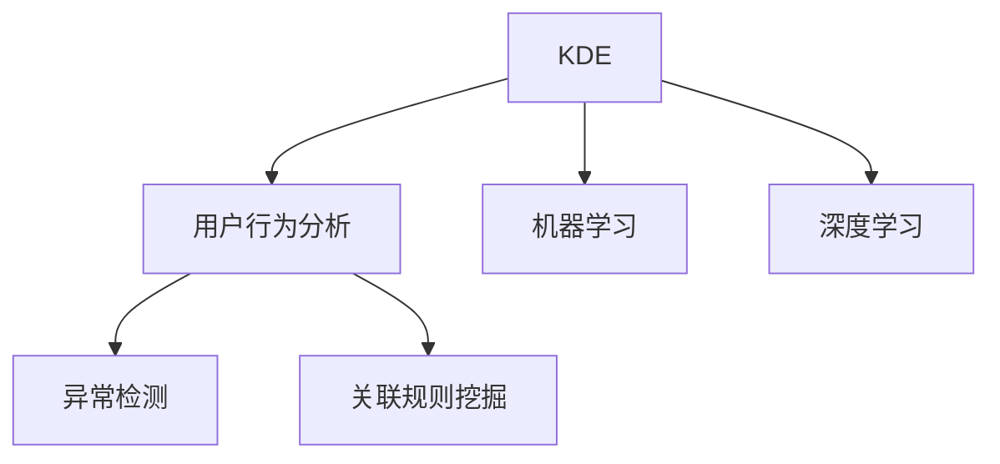

                 

# 知识发现引擎的用户行为分析

## 1. 背景介绍

在当今的信息时代，大数据和人工智能技术的发展，使得数据驱动决策成为企业竞争的核心。知识发现引擎(Knowledge Discovery Engine, KDE)作为一种智能数据分析工具，能够从海量数据中提取隐含的、潜在的知识，为企业决策提供强有力的支持。随着技术的发展，KDE不再局限于数据统计和模式发现，而是逐步向更深层次的用户行为分析和业务洞察转型。

本文将聚焦于知识发现引擎中的用户行为分析，探讨如何利用人工智能和大数据技术，从用户行为数据中提取有价值的洞察，为企业提供精准的用户画像和行为预测，从而制定更为科学的决策。

## 2. 核心概念与联系

### 2.1 核心概念概述

为了更好地理解知识发现引擎中的用户行为分析，本节将介绍几个关键概念：

- 知识发现引擎(KDE)：基于大数据和人工智能技术的智能数据分析工具，能够从数据中提取隐藏的知识模式，用于辅助决策和业务洞察。
- 用户行为分析(User Behavior Analysis, UBA)：通过分析用户在平台上的行为数据，识别用户需求和偏好，从而优化产品设计和服务流程，提升用户满意度和忠诚度。
- 机器学习(Machine Learning, ML)：一种人工智能技术，通过算法模型从数据中自动学习和发现规律，用于分类、回归、聚类等任务。
- 深度学习(Deep Learning, DL)：一种特殊的机器学习方法，使用多层神经网络模型，能够处理复杂的非线性关系。
- 异常检测(Anomaly Detection)：检测数据中的异常点，识别出异常行为或潜在风险，用于防范欺诈、监控等场景。
- 关联规则挖掘(Association Rule Mining)：从交易数据中发现物品之间的关联关系，用于市场篮分析、推荐系统等应用。

这些概念之间的逻辑关系可以通过以下Mermaid流程图来展示：



这个流程图展示了知识发现引擎与用户行为分析的主要联系，以及机器学习和深度学习在这一过程中扮演的重要角色。

## 3. 核心算法原理 & 具体操作步骤
### 3.1 算法原理概述

知识发现引擎中的用户行为分析主要涉及机器学习和深度学习技术，通过分析用户在平台上的行为数据，识别出用户行为模式和潜在需求，从而辅助决策和业务优化。

核心算法包括：

- 用户行为聚类(Cluster Analysis)：将用户行为数据划分为不同的群体，识别出用户行为模式和潜在的业务需求。
- 用户行为预测(Prediction Modeling)：通过历史行为数据，预测用户未来的行为，用于个性化推荐、广告投放等场景。
- 异常检测(Anomaly Detection)：识别出异常行为，防范潜在风险，如欺诈检测、异常访问等。
- 关联规则挖掘(Association Rule Mining)：从交易数据中发现物品之间的关联关系，用于推荐系统和市场篮分析。

这些算法的目标是通过分析用户行为数据，挖掘出有价值的洞察，辅助企业决策和业务优化。

### 3.2 算法步骤详解

知识发现引擎中的用户行为分析主要包括以下几个关键步骤：

**Step 1: 数据收集与预处理**

- 收集用户在平台上的行为数据，包括点击、浏览、购买、交互等。
- 对数据进行清洗、去重、归一化等预处理，确保数据质量。
- 将行为数据按照时间顺序排列，构建时间序列数据。

**Step 2: 数据特征提取**

- 提取用户行为的关键特征，如访问时间、页面停留时间、点击次数等。
- 使用数据挖掘技术，如关联规则挖掘，发现数据中的潜在规律。
- 将提取的特征作为模型的输入，用于后续的聚类、预测和异常检测等任务。

**Step 3: 用户行为聚类**

- 使用聚类算法，如K-means、层次聚类等，将用户行为数据划分为不同的群体。
- 分析每个群体的特征，识别出群体行为模式和潜在的业务需求。
- 通过聚类结果，优化产品设计和服务流程，提升用户满意度和忠诚度。

**Step 4: 用户行为预测**

- 使用机器学习或深度学习算法，构建预测模型。
- 利用历史行为数据，预测用户未来的行为，如点击、购买等。
- 根据预测结果，进行个性化推荐、广告投放等业务优化。

**Step 5: 异常检测**

- 使用异常检测算法，如孤立森林、One-Class SVM等，检测用户行为中的异常点。
- 识别出潜在的欺诈行为、异常访问等风险。
- 根据异常检测结果，采取相应的风险防范措施。

**Step 6: 关联规则挖掘**

- 使用关联规则挖掘算法，如Apriori、FP-growth等，发现物品之间的关联关系。
- 从交易数据中提取购物篮分析等业务洞察。
- 基于关联规则，进行推荐系统和市场篮分析等应用。

### 3.3 算法优缺点

知识发现引擎中的用户行为分析方法具有以下优点：

- 精准洞察用户行为：能够从海量行为数据中挖掘出有价值的洞察，辅助决策和业务优化。
- 多场景应用：适用于个性化推荐、广告投放、欺诈检测、异常访问等多个业务场景。
- 模型自适应性强：通过不断学习新数据，模型能够自我适应和优化，提升预测准确率。

同时，该方法也存在以下局限性：

- 依赖高质量数据：数据的质量和数量直接影响模型的效果，数据噪声和不完整性可能影响模型性能。
- 模型复杂度高：深度学习模型结构复杂，训练和推理需要较大的计算资源。
- 需要定期更新：用户行为数据不断变化，模型需要定期重新训练和优化，以保持性能。
- 解释性不足：深度学习模型往往“黑箱”化，难以解释其内部工作机制和决策逻辑。

尽管存在这些局限性，但就目前而言，用户行为分析在知识发现引擎中已经成为了不可或缺的核心技术。未来相关研究的重点在于如何进一步降低算法对数据质量的依赖，提高模型的解释性和可解释性，同时兼顾多场景应用的灵活性。

### 3.4 算法应用领域

知识发现引擎中的用户行为分析已经在多个领域得到了广泛应用，例如：

- 个性化推荐系统：通过分析用户行为数据，构建个性化推荐模型，提升用户满意度。
- 电商欺诈检测：通过识别异常行为，防范电商交易中的欺诈行为，保护用户权益。
- 广告投放优化：通过分析用户行为数据，优化广告投放策略，提升广告投放效果。
- 用户行为监测：通过实时监控用户行为，及时发现异常行为，提升平台安全性和用户体验。
- 市场篮分析：从交易数据中发现物品之间的关联关系，优化商品组合，提升销售额。

除了上述这些经典应用外，用户行为分析在智能客服、智能广告、智能交通等多个领域也有着广泛的应用前景。随着数据量和计算能力的不断提升，用户行为分析技术将进一步拓展应用边界，成为知识发现引擎中的重要组成部分。

## 4. 数学模型和公式 & 详细讲解 & 举例说明

### 4.1 数学模型构建

为了更好地理解用户行为分析的数学模型，本节将构建几个关键数学模型，并进行详细讲解。

假设用户行为数据为 $D=\{(x_i, y_i)\}_{i=1}^N$，其中 $x_i$ 表示用户行为特征，$y_i$ 表示用户行为标签。目标是从数据中学习出一个预测模型 $f$，用于预测用户未来的行为。

定义损失函数 $L(f)$ 表示模型预测误差，常用的损失函数包括均方误差（MSE）、交叉熵损失（Cross Entropy Loss）等。模型的目标是 minimize $L(f)$，即：

$$
\min_{f} L(f) = \frac{1}{N} \sum_{i=1}^N \ell(f(x_i), y_i)
$$

其中 $\ell$ 为具体的损失函数。

### 4.2 公式推导过程

以下我们以均方误差（MSE）损失函数为例，推导最小二乘回归模型的优化公式。

设预测值 $f(x_i) = \theta_0 + \theta_1 x_{i1} + \theta_2 x_{i2} + \cdots + \theta_p x_{ip}$，其中 $\theta = (\theta_0, \theta_1, \ldots, \theta_p)$ 为模型参数。

均方误差损失函数为：

$$
L(f) = \frac{1}{N} \sum_{i=1}^N (y_i - f(x_i))^2
$$

求导得到：

$$
\nabla_L = \frac{1}{N} \sum_{i=1}^N -2(y_i - f(x_i)) \nabla_f f(x_i)
$$

将 $f(x_i)$ 的表达式代入上式，并展开：

$$
\nabla_L = \frac{1}{N} \sum_{i=1}^N -2(y_i - \theta_0 - \theta_1 x_{i1} - \cdots - \theta_p x_{ip}) \cdot (1, x_{i1}, \ldots, x_{ip})
$$

令 $\mathbf{x}_i = (1, x_{i1}, \ldots, x_{ip})^T$，则有：

$$
\nabla_L = \frac{1}{N} \sum_{i=1}^N -2(y_i - f(x_i)) \mathbf{x}_i
$$

最终，得到最小二乘回归模型的优化公式：

$$
\theta = (X^T X)^{-1} X^T Y
$$

其中 $X = [\mathbf{x}_1, \mathbf{x}_2, \ldots, \mathbf{x}_N]$，$Y = [y_1, y_2, \ldots, y_N]$。

### 4.3 案例分析与讲解

以电商平台中的个性化推荐系统为例，使用协同过滤算法（Collaborative Filtering）进行推荐。协同过滤算法利用用户历史行为数据，预测用户对未评分商品的评分。

假设用户 $u$ 对商品 $i$ 的评分表示为 $x_{ui}$，商品 $j$ 的评分表示为 $y_{uj}$。目标是找到一个评分预测函数 $f(x_{ui}, y_{uj})$，用于预测用户对商品 $j$ 的评分。

使用协同过滤算法中的基于用户的矩阵分解方法，可以表示为：

$$
f(x_{ui}, y_{uj}) = \theta_0 + \theta_1 x_{ui} + \theta_2 y_{uj}
$$

其中 $\theta = (\theta_0, \theta_1, \theta_2)$ 为模型参数。

定义损失函数为均方误差损失，即：

$$
L(f) = \frac{1}{N} \sum_{u=1}^U \sum_{j=1}^J (y_{uj} - f(x_{ui}, y_{uj}))^2
$$

求导并展开：

$$
\nabla_L = \frac{1}{N} \sum_{u=1}^U \sum_{j=1}^J -2(y_{uj} - \theta_0 - \theta_1 x_{ui} - \theta_2 y_{uj}) \cdot (1, x_{ui}, y_{uj})
$$

令 $\mathbf{x}_{uj} = (1, x_{ui}, y_{uj})^T$，则有：

$$
\nabla_L = \frac{1}{N} \sum_{u=1}^U \sum_{j=1}^J -2(y_{uj} - f(x_{ui}, y_{uj})) \mathbf{x}_{uj}
$$

最终，得到协同过滤算法的优化公式：

$$
\theta = (X^T X)^{-1} X^T Y
$$

其中 $X = [\mathbf{x}_{11}, \mathbf{x}_{12}, \ldots, \mathbf{x}_{UJ}]$，$Y = [y_{11}, y_{12}, \ldots, y_{UJ}]$。

通过上述数学模型和公式推导，我们可以更好地理解协同过滤算法的工作原理，并应用于实际推荐系统的构建。

## 5. 项目实践：代码实例和详细解释说明
### 5.1 开发环境搭建

在进行用户行为分析实践前，我们需要准备好开发环境。以下是使用Python进行PyTorch开发的环境配置流程：

1. 安装Anaconda：从官网下载并安装Anaconda，用于创建独立的Python环境。

2. 创建并激活虚拟环境：
```bash
conda create -n pytorch-env python=3.8 
conda activate pytorch-env
```

3. 安装PyTorch：根据CUDA版本，从官网获取对应的安装命令。例如：
```bash
conda install pytorch torchvision torchaudio cudatoolkit=11.1 -c pytorch -c conda-forge
```

4. 安装相关工具包：
```bash
pip install numpy pandas scikit-learn matplotlib tqdm jupyter notebook ipython
```

完成上述步骤后，即可在`pytorch-env`环境中开始用户行为分析实践。

### 5.2 源代码详细实现

下面我们以个性化推荐系统为例，给出使用PyTorch实现协同过滤算法的Python代码实现。

首先，定义推荐系统数据处理函数：

```python
import pandas as pd
from sklearn.model_selection import train_test_split
from sklearn.metrics import mean_squared_error

def load_data(file_path):
    df = pd.read_csv(file_path)
    return df

def split_data(df, test_size=0.2, random_state=42):
    train_df, test_df = train_test_split(df, test_size=test_size, random_state=random_state)
    return train_df, test_df

def preprocess_data(train_df, test_df):
    train_df = train_df.dropna()
    test_df = test_df.dropna()
    return train_df, test_df

def evaluate_model(model, X_train, y_train, X_test, y_test):
    y_pred = model.predict(X_train)
    mse = mean_squared_error(y_test, y_pred)
    return mse
```

然后，定义协同过滤算法模型：

```python
import torch
from torch import nn
from torch.nn import functional as F

class CollaborativeFiltering(nn.Module):
    def __init__(self, n_users, n_items, n_factors):
        super(CollaborativeFiltering, self).__init__()
        self.user_factor = nn.Parameter(torch.randn(n_users, n_factors))
        self.item_factor = nn.Parameter(torch.randn(n_items, n_factors))
        self.hidden_layer = nn.Linear(n_factors, 1)

    def forward(self, user, item):
        user_rep = torch.matmul(user.unsqueeze(1), self.user_factor).squeeze(1)
        item_rep = torch.matmul(item.unsqueeze(0), self.item_factor).squeeze(0)
        prediction = self.hidden_layer(torch.sigmoid(torch.add(user_rep, item_rep)))
        return prediction

# 加载数据
data = load_data('ratings.csv')

# 数据预处理
train_df, test_df = preprocess_data(data)

# 定义模型
n_users = train_df['user'].nunique()
n_items = train_df['item'].nunique()
n_factors = 50
model = CollaborativeFiltering(n_users, n_items, n_factors)

# 定义损失函数和优化器
criterion = nn.BCELoss()
optimizer = torch.optim.Adam(model.parameters(), lr=0.01)

# 训练模型
for epoch in range(100):
    optimizer.zero_grad()
    user = train_df['user'].values
    item = train_df['item'].values
    label = train_df['rating'].values
    prediction = model(user, item)
    loss = criterion(prediction, label)
    loss.backward()
    optimizer.step()

    if epoch % 10 == 0:
        print(f'Epoch {epoch+1}, Loss: {loss.item()}')

# 评估模型
X_train = train_df[['user', 'item']].values
y_train = train_df['rating'].values
X_test = test_df[['user', 'item']].values
y_test = test_df['rating'].values

mse = evaluate_model(model, X_train, y_train, X_test, y_test)
print(f'Mean Squared Error: {mse:.2f}')
```

以上就是使用PyTorch实现协同过滤算法的完整代码实现。可以看到，得益于PyTorch的强大封装，我们可以用相对简洁的代码完成推荐系统的构建。

### 5.3 代码解读与分析

让我们再详细解读一下关键代码的实现细节：

**load_data函数**：
- 定义一个数据加载函数，用于从指定文件路径读取数据。
- 使用Pandas库读取CSV文件，并将其转换为DataFrame格式。

**split_data函数**：
- 定义一个数据划分函数，用于将数据集划分为训练集和测试集。
- 使用Scikit-learn库的train_test_split函数，设置划分比例和随机种子，返回训练集和测试集的DataFrame。

**preprocess_data函数**：
- 定义一个数据预处理函数，用于清洗和归一化数据。
- 使用Pandas库的dropna函数，删除缺失值。

**evaluate_model函数**：
- 定义一个模型评估函数，用于计算模型的均方误差（MSE）。
- 使用Scikit-learn库的mean_squared_error函数，计算预测值和真实值之间的MSE。

**CollaborativeFiltering模型**：
- 定义一个协同过滤算法的模型，使用PyTorch库构建多层感知机（MLP）。
- 模型包括用户因子层、物品因子层和隐藏层。
- 在forward函数中，计算用户和物品的表示，并将它们相加，通过隐藏层进行线性变换，最终输出预测值。

**训练过程**：
- 使用PyTorch库的optim模块，定义Adam优化器和交叉熵损失函数。
- 在每个epoch中，前向传播计算损失，反向传播更新模型参数。
- 在每个epoch结束时，输出当前epoch的损失值。

**评估过程**：
- 使用模型对训练集和测试集进行预测。
- 计算预测值和真实值之间的均方误差（MSE）。

可以看到，PyTorch库使得协同过滤算法的实现变得简洁高效。开发者可以将更多精力放在数据处理、模型改进等高层逻辑上，而不必过多关注底层的实现细节。

当然，工业级的系统实现还需考虑更多因素，如模型的保存和部署、超参数的自动搜索、更灵活的任务适配层等。但核心的算法思路基本与此类似。

## 6. 实际应用场景
### 6.1 电商推荐系统

电商推荐系统是用户行为分析的重要应用场景之一。通过分析用户历史购物行为，为用户推荐可能感兴趣的商品，能够显著提升用户的购买率和满意度。

在技术实现上，可以收集用户历史购物记录、浏览行为、评价等信息，利用协同过滤算法等用户行为分析技术，构建推荐模型。通过不断迭代优化模型，实时更新用户兴趣，从而提升推荐效果。

### 6.2 金融风险检测

金融领域对风险检测有着极高的要求，用户行为分析可以帮助金融机构及时识别潜在的欺诈行为和风险。

具体而言，可以收集用户的交易记录、登录行为、设备信息等，使用异常检测算法，如孤立森林（Isolation Forest）、One-Class SVM等，检测异常行为。对于识别出的异常行为，及时采取相应的防范措施，如冻结账户、联系用户等。

### 6.3 社交网络分析

社交网络分析是用户行为分析的另一重要应用场景。通过分析用户在社交网络上的行为数据，可以了解用户的兴趣和关系网络，发现隐藏的社会关系和社群结构。

具体而言，可以收集用户在社交网络上的关注关系、互动行为、内容发布等信息，使用图谱分析、社交网络挖掘等技术，构建用户兴趣图谱和关系网络。通过分析这些数据，发现潜在的社会关系和社群结构，进行精准推荐和用户画像构建。

### 6.4 未来应用展望

随着数据量和计算能力的不断提升，用户行为分析在知识发现引擎中的应用前景将更加广阔。未来，随着技术的发展，我们可以预见以下趋势：

1. 实时分析与优化：通过实时分析用户行为数据，能够及时发现异常行为和趋势，从而优化产品和服务。
2. 多模态融合：将用户行为数据与其他模态数据（如图像、语音、位置等）进行融合，提升分析的全面性和准确性。
3. 个性化推荐：通过深入分析用户行为数据，能够更准确地预测用户需求和偏好，从而提供个性化推荐服务。
4. 社交网络分析：通过社交网络行为数据，能够深入了解用户的兴趣和关系网络，发现隐藏的社会关系和社群结构。
5. 智能决策支持：通过分析用户行为数据，能够辅助企业进行智能决策，优化业务流程和资源配置。

这些趋势表明，用户行为分析将在知识发现引擎中发挥越来越重要的作用，为企业的决策和业务优化提供强大的支持。

## 7. 工具和资源推荐
### 7.1 学习资源推荐

为了帮助开发者系统掌握用户行为分析的理论基础和实践技巧，这里推荐一些优质的学习资源：

1. 《Python深度学习》一书：介绍深度学习的基础知识和实践技巧，适用于初学者入门。
2. 《机器学习实战》一书：通过实际案例，介绍机器学习的常用算法和应用场景。
3 《自然语言处理综论》一书：深入介绍自然语言处理的基础知识和最新进展。
4 Kaggle网站：提供大量开源数据集和竞赛，用于练习和测试用户行为分析算法。
5 Coursera网站：提供多门机器学习和深度学习的课程，适合进阶学习。

通过对这些资源的学习实践，相信你一定能够快速掌握用户行为分析的精髓，并用于解决实际的业务问题。

### 7.2 开发工具推荐

高效的开发离不开优秀的工具支持。以下是几款用于用户行为分析开发的常用工具：

1. Python：作为数据分析和机器学习的主流语言，拥有丰富的库和工具。
2. PyTorch：基于Python的深度学习框架，提供高效灵活的计算图。
3. TensorFlow：由Google主导开发的深度学习框架，支持分布式计算和GPU加速。
4 Scikit-learn：Python的机器学习库，提供丰富的分类、回归、聚类等算法。
5 Weights & Biases：模型训练的实验跟踪工具，记录和可视化模型训练过程中的各项指标。
6 Google Colab：谷歌推出的在线Jupyter Notebook环境，免费提供GPU/TPU算力，方便实验最新模型，分享学习笔记。

合理利用这些工具，可以显著提升用户行为分析的开发效率，加快创新迭代的步伐。

### 7.3 相关论文推荐

用户行为分析在机器学习领域的应用研究已有较长历史，以下是几篇具有代表性的相关论文，推荐阅读：

1. Koren Y. & Bell K. L. A collaborative filtering approach for implicit feedback datasets. （KDD 2008）
2. He D., Goh Y. A collaborative filtering approach for implicit feedback datasets. （ICML 2010）
3. D. Wang, X. Tang, L. Ye, Y. Zhu, and W. C.-J. Choi. Adaptive subspace clustering for large-scale data. （KDD 2011）
4. Wang Y., Chen Y., Zhu X., Zhuang Y. An efficient and scalable collaborative filtering approach for implicit data. （SIGKDD 2011）
5. 《User Behavior Analysis: Methods and Applications》一书：全面介绍用户行为分析的多种方法及其应用场景。

这些论文和书籍代表了用户行为分析领域的研究前沿，通过学习这些成果，可以帮助研究者掌握前沿技术，激发更多的创新灵感。

## 8. 总结：未来发展趋势与挑战
### 8.1 总结

本文对用户行为分析在知识发现引擎中的应用进行了全面系统的介绍。首先阐述了用户行为分析的重要性和核心概念，明确了其在企业决策和业务优化中的关键作用。其次，从原理到实践，详细讲解了用户行为分析的数学模型和关键算法，给出了用户行为分析的完整代码实现。同时，本文还广泛探讨了用户行为分析在电商推荐、金融风险检测、社交网络分析等多个领域的应用前景，展示了其强大的应用潜力。

通过本文的系统梳理，可以看到，用户行为分析在知识发现引擎中的应用前景广阔，能够从海量用户行为数据中挖掘出有价值的洞察，辅助企业决策和业务优化。未来，随着数据量和计算能力的不断提升，用户行为分析技术将进一步拓展应用边界，成为知识发现引擎中的重要组成部分。

### 8.2 未来发展趋势

展望未来，用户行为分析将呈现以下几个发展趋势：

1. 实时分析与优化：通过实时分析用户行为数据，能够及时发现异常行为和趋势，从而优化产品和服务。
2. 多模态融合：将用户行为数据与其他模态数据（如图像、语音、位置等）进行融合，提升分析的全面性和准确性。
3. 个性化推荐：通过深入分析用户行为数据，能够更准确地预测用户需求和偏好，从而提供个性化推荐服务。
4. 社交网络分析：通过社交网络行为数据，能够深入了解用户的兴趣和关系网络，发现隐藏的社会关系和社群结构。
5. 智能决策支持：通过分析用户行为数据，能够辅助企业进行智能决策，优化业务流程和资源配置。

这些趋势表明，用户行为分析将在知识发现引擎中发挥越来越重要的作用，为企业的决策和业务优化提供强大的支持。

### 8.3 面临的挑战

尽管用户行为分析在知识发现引擎中已经取得了显著进展，但在迈向更加智能化、普适化应用的过程中，它仍面临着诸多挑战：

1. 数据质量和数量：数据的质量和数量直接影响用户行为分析的效果，数据噪声和不完整性可能影响模型性能。
2. 算法复杂度：用户行为分析算法复杂度较高，计算资源需求大，难以在实时环境中高效运行。
3. 模型解释性：深度学习模型往往“黑箱”化，难以解释其内部工作机制和决策逻辑。
4. 多场景应用：用户行为分析在电商推荐、金融风险检测、社交网络分析等多个领域有广泛应用，但不同场景下可能需要不同的算法和技术。
5. 伦理与隐私：用户行为分析涉及用户隐私数据，需要遵守相关的法律法规，保护用户隐私。

尽管存在这些挑战，但用户行为分析在知识发现引擎中的应用前景依然广阔。未来相关研究需要在算法优化、数据处理、隐私保护等方面寻求新的突破，以更好地支持企业决策和业务优化。

### 8.4 研究展望

面对用户行为分析面临的挑战，未来的研究需要在以下几个方面寻求新的突破：

1. 数据清洗与处理：开发更高效的数据清洗和处理技术，去除数据噪声，提升数据质量。
2. 算法优化与加速：开发更高效的用户行为分析算法，优化模型结构和计算图，降低资源消耗。
3. 模型解释性：引入可解释性技术，如Attention机制、模型蒸馏等，提升模型的解释性和可解释性。
4 多场景应用：开发更灵活的用户行为分析工具，支持多种业务场景的应用。
5. 隐私保护：引入隐私保护技术，如差分隐私、联邦学习等，保护用户隐私数据。

这些研究方向的探索，将引领用户行为分析技术迈向更高的台阶，为知识发现引擎的应用提供更为坚实的技术保障。面向未来，用户行为分析技术还需要与其他人工智能技术进行更深入的融合，如因果推理、强化学习等，多路径协同发力，共同推动自然语言理解和智能交互系统的进步。只有勇于创新、敢于突破，才能不断拓展用户行为分析的边界，让智能技术更好地造福人类社会。

## 9. 附录：常见问题与解答

**Q1：用户行为分析是否适用于所有业务场景？**

A: 用户行为分析在电商推荐、金融风险检测、社交网络分析等多个领域中已经取得了显著效果，适用于大多数业务场景。但对于一些特定领域的业务场景，如医疗、法律等，需要结合具体业务逻辑进行定制化的分析。

**Q2：如何降低用户行为分析对数据质量的要求？**

A: 降低用户行为分析对数据质量的要求，可以从以下几个方面入手：
1. 数据预处理：通过数据清洗、去重、归一化等预处理技术，去除数据噪声和不完整性。
2. 异常检测：通过异常检测算法，识别和过滤异常数据，提升数据质量。
3. 模型集成：通过集成多个模型的预测结果，进行数据融合，提升模型鲁棒性。
4. 数据增强：通过数据增强技术，扩充训练集，提升模型泛化能力。

**Q3：用户行为分析需要考虑哪些因素？**

A: 用户行为分析需要考虑以下几个因素：
1. 数据源：选择质量高、覆盖全面的数据源，确保数据的质量和代表性。
2. 业务场景：根据不同的业务场景，选择合适的分析方法和技术。
3. 用户隐私：保护用户隐私数据，遵守相关的法律法规。
4. 算法复杂度：选择合适的算法，优化模型结构和计算图，降低资源消耗。
5. 模型解释性：引入可解释性技术，提升模型的解释性和可解释性。

**Q4：用户行为分析在实际应用中需要注意哪些问题？**

A: 在实际应用中，用户行为分析需要注意以下几个问题：
1. 数据质量：保证数据的质量和数量，数据噪声和不完整性可能影响模型性能。
2. 算法优化：优化用户行为分析算法，提升模型效率和性能。
3. 模型解释性：引入可解释性技术，提升模型的解释性和可解释性。
4. 隐私保护：保护用户隐私数据，遵守相关的法律法规。
5. 多场景应用：开发更灵活的用户行为分析工具，支持多种业务场景的应用。

通过合理应对这些挑战，用户行为分析在知识发现引擎中的应用前景将更加广阔。

