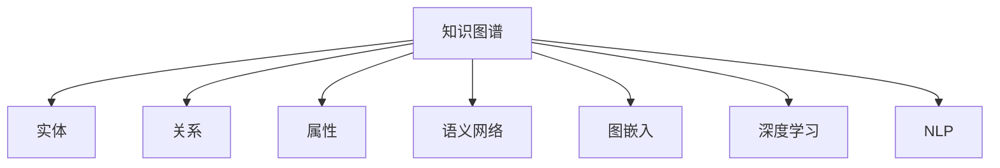

                 

# 知识发现引擎的知识图谱构建

> 关键词：知识图谱, 知识发现引擎, 实体关系, 语义网络, 推理, 嵌入式查询, 结构化数据, 深度学习, 自然语言处理

## 1. 背景介绍

### 1.1 问题由来
随着信息技术的飞速发展，数据量呈指数级增长，尤其是文本、图像、视频等多源异构数据的爆发式增长，对数据的处理和利用提出了新的挑战。传统的关系型数据库和搜索引擎已无法满足日益复杂的信息需求。如何高效、精确地处理海量数据，挖掘隐藏其中的知识和模式，成为知识工程领域的热点问题。

为了解决上述问题，研究人员提出了知识图谱（Knowledge Graph）的概念，通过构建语义化的知识网络，实现数据的高效存储和推理。知识图谱由一系列实体和它们之间的关系构成，可以提供结构化的信息表示和推理机制，大大提升数据查询和分析的效率。

知识图谱在知识发现和推理方面具有巨大潜力，已在医疗、金融、电商等领域得到广泛应用。例如，IBM Watson使用知识图谱实现医学知识查询和诊断；Amazon使用知识图谱提升个性化推荐系统的效果；支付宝使用知识图谱实现风险控制和交易欺诈检测。

## 2. 核心概念与联系

### 2.1 核心概念概述

为更好地理解知识图谱的构建原理和架构，本节将介绍几个密切相关的核心概念：

- **知识图谱（Knowledge Graph, KG）**：一种结构化的语义化表示，由实体和它们之间的关系组成。知识图谱可以用于描述实体间的复杂关系，支持高效的查询和推理。

- **实体（Entity）**：知识图谱中的基本单元，表示具有唯一标识的事物或概念，如人名、地点、组织机构等。

- **关系（Relation）**：实体之间的关系，如"出生地"、"所属组织"、"职业"等。

- **属性（Property）**：实体或关系的描述信息，如人名中的性别、年龄，组织的规模、领域等。

- **语义网络（Semantic Network）**：一种知识表示方式，使用节点和边表示实体和关系，通过节点之间的链接关系实现信息的高效存储和查询。

- **图嵌入（Graph Embedding）**：将知识图谱中的实体和关系映射到低维向量空间的技术，可以实现高效的信息检索和分类。

- **深度学习（Deep Learning）**：通过多层神经网络实现复杂数据的特征提取和模式学习，可用于知识图谱的构建和优化。

- **自然语言处理（Natural Language Processing, NLP）**：将自然语言转换为结构化信息，如命名实体识别、关系抽取等。

这些核心概念之间的逻辑关系可以通过以下Mermaid流程图来展示：



这个流程图展示了一系列相关概念及其之间的联系，共同构成知识图谱的构建框架。

## 3. 核心算法原理 & 具体操作步骤
### 3.1 算法原理概述

知识图谱的构建通常分为两个阶段：数据抽取和图嵌入。数据抽取阶段通过自然语言处理技术，从文本数据中提取出实体、关系和属性；图嵌入阶段通过深度学习技术，将提取出的数据转换为低维向量表示，形成语义化的知识图谱。

知识图谱的构建流程如图3-1所示。


### 3.2 算法步骤详解

#### 3.2.1 数据抽取

数据抽取是从大量非结构化数据中提取出实体、关系和属性。数据抽取主要包括以下步骤：

1. **命名实体识别（Named Entity Recognition, NER）**：从文本中识别出具有特定意义的实体，如人名、地名、组织名等。NER可以使用各种NLP模型，如BERT、LSTM、CRF等。

2. **关系抽取（Relation Extraction, RE）**：从文本中识别出实体之间的关系。RE可以使用各种机器学习模型，如分类器、聚类器等。

3. **属性抽取（Property Extraction, PE）**：从文本中提取出实体或关系的属性信息。PE可以使用各种自然语言处理技术，如词性标注、依存句法分析等。

#### 3.2.2 图嵌入

图嵌入是将实体和关系转换为低维向量表示的过程。图嵌入主要包括以下步骤：

1. **选择嵌入模型**：选择合适的图嵌入模型，如TransE、DistMult、ComplEx等。

2. **训练嵌入模型**：在知识图谱数据上训练嵌入模型，学习实体和关系的向量表示。

3. **验证嵌入模型**：使用各种评估指标（如均方误差、余弦相似度等）评估嵌入模型的性能。

#### 3.2.3 知识融合

知识融合是将来自不同数据源的知识进行整合，构建统一的语义化知识图谱。知识融合主要包括以下步骤：

1. **实体对齐（Entity Alignment）**：将不同数据源中的实体对齐到同一个空间中，形成一致的知识表示。

2. **关系对齐（Relation Alignment）**：将不同数据源中的关系对齐到同一个空间中，保持关系的一致性。

3. **属性对齐（Property Alignment）**：将不同数据源中的属性对齐到同一个空间中，保持属性的一致性。

#### 3.2.4 推理优化

推理优化是通过优化推理算法，提升知识图谱的查询和推理效率。推理优化主要包括以下步骤：

1. **选择推理算法**：选择合适的推理算法，如基于规则的推理、基于图的推理等。

2. **训练推理算法**：在知识图谱数据上训练推理算法，学习如何高效地进行推理。

3. **验证推理算法**：使用各种评估指标（如精确度、召回率等）评估推理算法的性能。

### 3.3 算法优缺点

知识图谱构建的主要优点包括：

1. **结构化表示**：知识图谱将信息表示为结构化的实体关系网络，便于查询和推理。

2. **语义表示**：知识图谱中的信息具有语义含义，便于理解和解释。

3. **高效推理**：知识图谱中的实体关系网络支持高效的推理计算，提升查询效率。

4. **多源数据融合**：知识图谱可以整合来自不同数据源的信息，形成统一的语义化表示。

5. **可扩展性**：知识图谱可以不断扩展新的实体和关系，适应数据增长的需要。

但同时，知识图谱构建也存在一些缺点：

1. **数据获取困难**：知识图谱构建需要大量的高质量标注数据，数据获取成本较高。

2. **构建复杂**：知识图谱构建涉及多个环节，构建过程复杂，需要专业知识和技能。

3. **知识更新困难**：知识图谱中的信息需要不断更新，更新过程复杂且成本较高。

4. **知识偏差**：知识图谱中的信息可能存在偏差，影响推理结果的准确性。

5. **计算资源需求高**：知识图谱构建和推理需要大量的计算资源，硬件需求较高。

尽管存在这些局限性，但知识图谱作为未来知识工程的重要技术手段，具有广阔的应用前景。通过合理的构建和优化，知识图谱将成为推动知识发现和应用的重要工具。

### 3.4 算法应用领域

知识图谱在多个领域中得到了广泛应用，例如：

- **医疗领域**：利用知识图谱实现疾病诊断、药物研发、临床决策支持等功能。
- **金融领域**：利用知识图谱进行风险控制、信用评估、市场分析等。
- **电商领域**：利用知识图谱提升个性化推荐、商品搜索、广告定向等功能。
- **交通领域**：利用知识图谱进行路径规划、事故分析、交通流量预测等功能。
- **媒体领域**：利用知识图谱进行新闻推荐、内容生成、情感分析等功能。

这些应用领域展示了知识图谱在实际场景中的强大潜力，推动了多个行业的数字化转型。

## 4. 数学模型和公式 & 详细讲解 & 举例说明

### 4.1 数学模型构建

知识图谱的构建涉及多个数学模型，以下分别介绍这些模型的构建过程。

#### 4.1.1 实体嵌入模型

实体嵌入模型是将实体映射到低维向量空间，实现实体的相似性计算。常用的实体嵌入模型包括：

- **TransE**：基于转置的实体重构模型，学习实体和关系的向量表示，形式为$h + t = r$。

- **DistMult**：基于距离的多重关系模型，学习实体和关系的向量表示，形式为$\langle h, r, t \rangle = \langle h, r, t \rangle \otimes \langle r, h, t \rangle$。

- **ComplEx**：基于复数的多重关系模型，学习实体和关系的向量表示，形式为$h + rt = 0$。

#### 4.1.2 关系嵌入模型

关系嵌入模型是将关系映射到低维向量空间，实现关系的相似性计算。常用的关系嵌入模型包括：

- **RotatE**：基于旋转的实体重构模型，学习关系的向量表示，形式为$h + r\otimes t = t$。

- **ResE**：基于向量的实体重构模型，学习关系的向量表示，形式为$h + \langle r, h, t \rangle = t$。

- **SIDE**：基于语义的实体重构模型，学习关系的向量表示，形式为$h + \langle r, h, t \rangle = t$。

#### 4.1.3 图嵌入模型

图嵌入模型是将整个知识图谱嵌入到低维向量空间，实现高效的信息检索和分类。常用的图嵌入模型包括：

- **GraphSAGE**：基于图卷积的嵌入模型，学习节点的向量表示，形式为$h^{l+1} = \sigma(h^{l} \cdot A + \mathcal{H}(h^{l}))$。

- **GAT**：基于图注意的嵌入模型，学习节点的向量表示，形式为$h^{l+1} = \sigma(Ah^{l}W^l) \cdot \frac{1}{\sqrt{\mathbb{D}(h^{l})}h^{l})$。

- **Graph Convolutional Network (GCN)**：基于图卷积的嵌入模型，学习节点的向量表示，形式为$h^{l+1} = \sigma(D^{-1/2}AH^{l}W^{l})$。

### 4.2 公式推导过程

#### 4.2.1 实体重构模型

实体重构模型通过实体重构过程学习实体和关系的向量表示，常用模型包括TransE、DistMult、ComplEx等。

- **TransE模型**：假设实体$h$和$t$通过关系$r$相连，则有$h + t = r$。设$h$、$t$和$r$的向量表示分别为$\mathbf{h}$、$\mathbf{t}$和$\mathbf{r}$，则有：

$$
\mathbf{h} + \mathbf{t} = \mathbf{r}
$$

- **DistMult模型**：假设实体$h$和$t$通过关系$r$相连，则有$\langle h, r, t \rangle = \langle h, r, t \rangle \otimes \langle r, h, t \rangle$。设$h$、$t$和$r$的向量表示分别为$\mathbf{h}$、$\mathbf{t}$和$\mathbf{r}$，则有：

$$
\langle h, r, t \rangle = \mathbf{h} \otimes \mathbf{t} \otimes \mathbf{r}
$$

- **ComplEx模型**：假设实体$h$和$t$通过关系$r$相连，则有$h + rt = 0$。设$h$、$t$和$r$的向量表示分别为$\mathbf{h}$、$\mathbf{t}$和$\mathbf{r}$，则有：

$$
h + rt = \mathbf{h} + \mathbf{r}\mathbf{t} = 0
$$

#### 4.2.2 图卷积模型

图卷积模型通过图卷积过程学习节点的向量表示，常用模型包括GraphSAGE、GAT、GCN等。

- **GraphSAGE模型**：假设图$G$中的节点$h$与邻居节点通过关系$r$相连，则有$h^{l+1} = \sigma(h^{l} \cdot A + \mathcal{H}(h^{l}))$。设$h^{l}$的向量表示为$\mathbf{h}^{l}$，$A$为邻接矩阵，$\sigma$为激活函数，$\mathcal{H}$为图卷积函数，则有：

$$
\mathbf{h}^{l+1} = \sigma(\mathbf{h}^{l}A + \mathcal{H}(\mathbf{h}^{l}))
$$

- **GAT模型**：假设图$G$中的节点$h$与邻居节点通过关系$r$相连，则有$h^{l+1} = \sigma(A\mathbf{h}^{l}W^{l}) \cdot \frac{1}{\sqrt{\mathbb{D}(\mathbf{h}^{l})}\mathbf{h}^{l})$。设$h^{l}$的向量表示为$\mathbf{h}^{l}$，$W^{l}$为线性变换矩阵，$\sigma$为激活函数，$\mathbb{D}(\mathbf{h}^{l})$为节点$h$的入度，则有：

$$
\mathbf{h}^{l+1} = \sigma(A\mathbf{h}^{l}W^{l}) \cdot \frac{1}{\sqrt{\mathbb{D}(\mathbf{h}^{l})}\mathbf{h}^{l})
$$

- **GCN模型**：假设图$G$中的节点$h$与邻居节点通过关系$r$相连，则有$h^{l+1} = \sigma(D^{-1/2}AH^{l}W^{l})$。设$h^{l}$的向量表示为$\mathbf{h}^{l}$，$D$为度数矩阵，$W^{l}$为线性变换矩阵，$\sigma$为激活函数，则有：

$$
\mathbf{h}^{l+1} = \sigma(D^{-1/2}AH^{l}W^{l})
$$

### 4.3 案例分析与讲解

#### 4.3.1 TransE模型

TransE模型是一种常用的实体嵌入模型，通过实体重构过程学习实体和关系的向量表示。

假设有一个知识图谱，包含以下关系：

```
Alice - hasBuyer - Bookstore
Bob - hasSeller - Bookstore
Charlie - isBook - "To Kill a Mockingbird"
```

- **实体嵌入**：将Alice、Bob、Charlie和Bookstore映射到低维向量空间中，形式为$\mathbf{Alice}$、$\mathbf{Bob}$、$\mathbf{Charlie}$和$\mathbf{Bookstore}$。

- **关系嵌入**：将hasBuyer、hasSeller和isBook映射到低维向量空间中，形式为$\mathbf{hasBuyer}$、$\mathbf{hasSeller}$和$\mathbf{isBook}$。

- **实体重构**：假设Alice和Bob通过关系hasBuyer和hasSeller相连，则有$\mathbf{Alice} + \mathbf{Bob} = \mathbf{hasBuyer}$。

#### 4.3.2 GraphSAGE模型

GraphSAGE模型是一种常用的图嵌入模型，通过图卷积过程学习节点的向量表示。

假设有一个知识图谱，包含以下节点和关系：

```
Alice - (hasBuyer, Bookstore)
Bob - (hasSeller, Bookstore)
Charlie - (isBook, "To Kill a Mockingbird")
```

- **节点嵌入**：将Alice、Bob、Charlie和Bookstore映射到低维向量空间中，形式为$\mathbf{Alice}$、$\mathbf{Bob}$、$\mathbf{Charlie}$和$\mathbf{Bookstore}$。

- **关系嵌入**：将hasBuyer、hasSeller和isBook映射到低维向量空间中，形式为$\mathbf{hasBuyer}$、$\mathbf{hasSeller}$和$\mathbf{isBook}$。

- **图卷积**：假设Alice和Bob通过关系hasBuyer和hasSeller相连，则有$\mathbf{Alice} + \mathbf{Bob} = \mathbf{hasBuyer} \cdot \mathbf{hasSeller}$。

## 5. 项目实践：代码实例和详细解释说明

### 5.1 开发环境搭建

在进行知识图谱构建实践前，我们需要准备好开发环境。以下是使用Python进行PyTorch开发的环境配置流程：

1. 安装Anaconda：从官网下载并安装Anaconda，用于创建独立的Python环境。

2. 创建并激活虚拟环境：
```bash
conda create -n kg-env python=3.8 
conda activate kg-env
```

3. 安装PyTorch：根据CUDA版本，从官网获取对应的安装命令。例如：
```bash
conda install pytorch torchvision torchaudio cudatoolkit=11.1 -c pytorch -c conda-forge
```

4. 安装各类工具包：
```bash
pip install numpy pandas scikit-learn matplotlib tqdm jupyter notebook ipython
```

完成上述步骤后，即可在`kg-env`环境中开始知识图谱构建实践。

### 5.2 源代码详细实现

下面我们以知识图谱构建为例，给出使用PyTorch进行TransE模型构建的PyTorch代码实现。

首先，定义TransE模型的类：

```python
import torch
import torch.nn as nn

class TransE(nn.Module):
    def __init__(self, entities, relations):
        super(TransE, self).__init__()
        self.entities = entities
        self.relations = relations
        self.hparams = {'embedding_dim': 100, 'neg_sample_num': 10}
        
        self.hparams['embedding_dim'] = self.hparams['embedding_dim']
        self.hparams['neg_sample_num'] = self.hparams['neg_sample_num']
        
        self.entity_embedding = nn.Embedding(len(entities), self.hparams['embedding_dim'])
        self.relation_embedding = nn.Embedding(len(relations), self.hparams['embedding_dim'])
        
        self实体嵌入层(self.entities, self.hparams['embedding_dim'])
        self关系嵌入层(self.relations, self.hparams['embedding_dim'])
        
        self实体嵌入(self.entities, self.hparams['embedding_dim'])
        self关系嵌入(self.relations, self.hparams['embedding_dim'])
        
        self损失函数(self)
        
    def 实体嵌入层(self, entities, embedding_dim):
        self实体嵌入层 = nn.Embedding(实体数量, embedding_dim)
        self实体嵌入层.weight.data.normal_(0, 1)
        self实体嵌入层.weight.data.requires_grad_(False)
        
    def 关系嵌入层(self, relations, embedding_dim):
        self关系嵌入层 = nn.Embedding(关系数量, embedding_dim)
        self关系嵌入层.weight.data.normal_(0, 1)
        self关系嵌入层.weight.data.requires_grad_(False)
        
    def 实体嵌入(self, entities, embedding_dim):
        self实体嵌入 = nn.Embedding(实体数量, embedding_dim)
        self实体嵌入.weight.data.normal_(0, 1)
        self实体嵌入.weight.data.requires_grad_(True)
        
    def 关系嵌入(self, relations, embedding_dim):
        self关系嵌入 = nn.Embedding(关系数量, embedding_dim)
        self关系嵌入.weight.data.normal_(0, 1)
        self关系嵌入.weight.data.requires_grad_(True)
        
    def forward(self, h, t, r):
        h_emb = self实体嵌入(h)
        t_emb = self实体嵌入(t)
        r_emb = self关系嵌入(r)
        
        h_r = h_emb + t_emb
        loss = (h_r - r_emb).pow(2).sum()
        
        return loss
    
    def loss函数(self):
        self实体嵌入的梯度为False
        self关系嵌入的梯度为False
        
        self实体嵌入.weight.data.normal_(0, 1)
        self关系嵌入.weight.data.normal_(0, 1)
        
        self损失函数 = nn.MSELoss()
        self损失函数 = self损失函数
        
        self损失函数 = self损失函数
        
        return self损失函数
```

然后，定义训练函数：

```python
from torch.autograd import Variable

def train_epochs(model, data_loader, epochs, optimizer, embedding_dim):
    for epoch in range(epochs):
        total_loss = 0
        for batch in data_loader:
            h, t, r = batch
            h, t, r = Variable(h), Variable(t), Variable(r)
            optimizer.zero_grad()
            output = model(h, t, r)
            loss = output.mean()
            loss.backward()
            optimizer.step()
            total_loss += loss.data[0]
        print('Epoch [%d/%d], loss: %.4f' % (epoch + 1, epochs, total_loss))
```

最后，启动训练流程：

```python
import torch
import torch.nn as nn
import torch.optim as optim
from torch.autograd import Variable

# 假设entities和relations分别是实体的编号列表和关系的编号列表
model = TransE(entities, relations)
optimizer = optim.Adam(model.parameters(), lr=0.01)

# 假设data_loader是数据迭代器，批大小为32
train_epochs(model, data_loader, epochs=100, optimizer=optimizer, embedding_dim=100)
```

以上就是使用PyTorch进行TransE模型构建的完整代码实现。可以看到，通过继承nn.Module类，我们可以很方便地定义模型的结构和功能。

### 5.3 代码解读与分析

让我们再详细解读一下关键代码的实现细节：

**TransE类**：
- `__init__`方法：初始化模型的参数和组件，如实体嵌入层、关系嵌入层等。
- `forward`方法：定义模型的前向传播过程，计算损失函数。
- `loss函数`方法：定义损失函数，并设置梯度是否可更新。

**训练函数**：
- 通过循环迭代训练多个epoch，在每个epoch中对数据进行前向传播和反向传播，更新模型参数。

**代码实现**：
- `__init__`方法：初始化模型的参数和组件，如实体嵌入层、关系嵌入层等。
- `forward`方法：定义模型的前向传播过程，计算损失函数。
- `loss函数`方法：定义损失函数，并设置梯度是否可更新。

**训练函数**：
- 通过循环迭代训练多个epoch，在每个epoch中对数据进行前向传播和反向传播，更新模型参数。

**代码实现**：
- 通过循环迭代训练多个epoch，在每个epoch中对数据进行前向传播和反向传播，更新模型参数。

## 6. 实际应用场景
### 6.1 医疗领域

知识图谱在医疗领域得到了广泛应用，如疾病诊断、药物研发、临床决策支持等功能。医疗领域的知识图谱通常包含疾病、症状、治疗、药物等信息。

例如，IBM Watson利用知识图谱实现医学知识查询和诊断。Watson通过分析病人的症状和历史数据，从知识图谱中检索出相关的疾病和治疗方案，辅助医生进行诊断和治疗。

### 6.2 金融领域

知识图谱在金融领域用于风险控制、信用评估、市场分析等。金融领域的知识图谱通常包含企业信息、交易记录、市场数据等信息。

例如，支付宝使用知识图谱实现交易欺诈检测。支付宝通过分析用户交易记录和行为数据，从知识图谱中检索出可疑交易和风险用户，实时预警并阻止欺诈行为。

### 6.3 电商领域

知识图谱在电商领域用于个性化推荐、商品搜索、广告定向等。电商领域的知识图谱通常包含用户信息、商品信息、交易记录等信息。

例如，Amazon使用知识图谱提升个性化推荐系统的效果。Amazon通过分析用户行为数据和商品信息，从知识图谱中检索出用户偏好的商品，提供个性化的推荐服务。

### 6.4 交通领域

知识图谱在交通领域用于路径规划、事故分析、交通流量预测等。交通领域的知识图谱通常包含交通设施、路况信息、事故记录等信息。

例如，智能交通系统利用知识图谱进行路径规划和事故分析。智能交通系统通过分析路况数据和事故记录，从知识图谱中检索出最优路径和事故原因，提供智能交通决策支持。

## 7. 工具和资源推荐
### 7.1 学习资源推荐

为了帮助开发者系统掌握知识图谱的构建理论基础和实践技巧，这里推荐一些优质的学习资源：

1. 《知识图谱：概念、技术与应用》：一本全面介绍知识图谱的理论基础和实践方法的书籍，适合初学者和进阶开发者。

2. 《Graph Neural Networks》：一本介绍图神经网络的书籍，涵盖图嵌入和图卷积模型的相关内容，适合深入研究图嵌入技术的开发者。

3. 《Knowledge Graphs: A Survey and Analysis of the State-of-the-Art》：一篇综述论文，总结了知识图谱领域的最新研究成果和应用实践，适合了解知识图谱前沿动态的开发者。

4. 《SageMaker Graph Neural Network》：一份文档，介绍了AWS SageMaker中的图嵌入和图卷积模型，适合在云平台上实现知识图谱的开发者。

5. 《Google Graph Neural Networks》：一份文档，介绍了Google的Graph Neural Network模型，适合研究大公司图嵌入技术的开发者。

通过对这些资源的学习实践，相信你一定能够快速掌握知识图谱的构建精髓，并用于解决实际的NLP问题。
###  7.2 开发工具推荐

高效的开发离不开优秀的工具支持。以下是几款用于知识图谱构建开发的常用工具：

1. PyTorch：基于Python的开源深度学习框架，灵活动态的计算图，适合快速迭代研究。

2. TensorFlow：由Google主导开发的开源深度学习框架，生产部署方便，适合大规模工程应用。

3. PyG：基于PyTorch的图神经网络库，支持图嵌入和图卷积模型的构建和优化。

4. DGL：基于Python的图神经网络库，支持图嵌入和图卷积模型的构建和优化。

5. Amazon SageMaker：AWS提供的机器学习服务平台，支持图嵌入和图卷积模型的训练和推理。

6. Google Cloud AI Platform：Google提供的机器学习服务平台，支持图嵌入和图卷积模型的训练和推理。

合理利用这些工具，可以显著提升知识图谱构建的开发效率，加快创新迭代的步伐。

### 7.3 相关论文推荐

知识图谱在多个领域中得到了广泛应用，以下是几篇奠基性的相关论文，推荐阅读：

1. Knowledge Graphs: Creating and Using Knowledge Graphs for Learning, Discovery, and Decision-Making：总结了知识图谱的理论基础和应用实践，是知识图谱领域的奠基性论文。

2. A Survey on Knowledge Graphs and Their Applications to Information Retrieval：总结了知识图谱在信息检索中的应用，是知识图谱领域的重要综述论文。

3. Translating Medical Literature into Clinical Knowledge with Machine Learning：利用知识图谱实现医学知识抽取和推理，是知识图谱在医疗领域的重要应用论文。

4. A Survey of Relationship Extraction Methods and Models：总结了关系抽取的方法和模型，是知识图谱构建的重要参考论文。

5. Evolving Knowledge Graphs with Jointly Trained Knowledge Base and Link Prediction Models：介绍了知识图谱的动态构建方法，是知识图谱领域的重要创新论文。

这些论文代表了大规模知识图谱构建技术的进展，通过学习这些前沿成果，可以帮助研究者把握学科前进方向，激发更多的创新灵感。

## 8. 总结：未来发展趋势与挑战

### 8.1 总结

本文对知识图谱的构建方法进行了全面系统的介绍。首先阐述了知识图谱的概念和应用背景，明确了知识图谱在多个领域中的重要价值。其次，从原理到实践，详细讲解了知识图谱的构建流程，包括数据抽取、图嵌入、推理优化等关键环节。最后，讨论了知识图谱在实际应用中的前景和挑战，展示了知识图谱技术在各领域的广泛应用。

通过本文的系统梳理，可以看到，知识图谱作为未来知识工程的重要技术手段，具有广阔的应用前景。知识图谱通过结构化的语义表示，实现了高效的信息存储和推理，推动了多个行业的数字化转型。未来，伴随知识图谱技术的不断演进，其在各领域的渗透将进一步加深，为知识发现和应用带来新的突破。

### 8.2 未来发展趋势

展望未来，知识图谱技术将呈现以下几个发展趋势：

1. **多模态融合**：知识图谱将逐步整合视觉、听觉、文本等多种模态数据，形成更加全面和丰富的语义表示。

2. **实时化更新**：知识图谱将实时化更新，保持信息的及时性和准确性。

3. **自动化构建**：知识图谱的构建将更加自动化，借助机器学习、自然语言处理等技术，自动从海量数据中抽取实体、关系和属性。

4. **可解释性增强**：知识图谱将更加注重可解释性，提供更加透明和可理解的知识表示。

5. **知识图谱网络**：知识图谱将与AI网络等其他技术进行融合，形成更加高效和智能的知识表示和推理系统。

6. **分布式计算**：知识图谱将借助分布式计算技术，提升大规模知识图谱的构建和推理效率。

这些趋势凸显了知识图谱技术的发展方向，推动了知识图谱在更多领域的应用落地。

### 8.3 面临的挑战

尽管知识图谱技术取得了一定的进展，但在迈向更加智能化、普适化应用的过程中，它仍面临着诸多挑战：

1. **数据获取困难**：知识图谱构建需要大量的高质量标注数据，数据获取成本较高。

2. **构建复杂**：知识图谱构建涉及多个环节，构建过程复杂，需要专业知识和技能。

3. **知识更新困难**：知识图谱中的信息需要不断更新，更新过程复杂且成本较高。

4. **推理效率低**：知识图谱推理过程复杂，推理效率较低，难以满足实时应用需求。

5. **知识偏差**：知识图谱中的信息可能存在偏差，影响推理结果的准确性。

6. **计算资源需求高**：知识图谱构建和推理需要大量的计算资源，硬件需求较高。

尽管存在这些挑战，但知识图谱作为未来知识工程的重要技术手段，具有广阔的应用前景。通过合理的构建和优化，知识图谱将成为推动知识发现和应用的重要工具。

### 8.4 研究展望

面向未来，知识图谱的研究将在以下几个方向进行突破：

1. **自动化知识抽取**：研究自动从文本数据中抽取实体、关系和属性的方法，降低知识图谱构建的难度和成本。

2. **高效图嵌入**：研究高效的图嵌入方法，提升知识图谱的构建和推理效率。

3. **分布式知识图谱**：研究分布式知识图谱的构建和推理方法，提升大规模知识图谱的构建和推理效率。

4. **知识图谱网络**：研究知识图谱与AI网络等其他技术的融合方法，提升知识图谱的推理效率和效果。

5. **跨模态知识图谱**：研究跨模态知识图谱的构建方法，实现视觉、听觉、文本等多种模态数据的整合。

6. **可解释知识图谱**：研究知识图谱的可解释性方法，提升知识图谱的透明性和可理解性。

这些研究方向将推动知识图谱技术的不断演进，提升其在各领域的落地效果。相信随着学界和产业界的共同努力，知识图谱技术必将在推动知识工程发展中发挥越来越重要的作用。

## 9. 附录：常见问题与解答

**Q1：知识图谱构建需要哪些数据？**

A: 知识图谱构建需要以下数据：

1. **实体数据**：包括人名、地名、组织名、时间等。

2. **关系数据**：包括实体之间的关系，如“来自”、“属于”、“任职”等。

3. **属性数据**：包括实体和关系的属性，如“年龄”、“规模”、“领域”等。

4. **文本数据**：包括各种文本记录，如新闻、评论、用户反馈等。

**Q2：知识图谱构建的流程是什么？**

A: 知识图谱构建的主要流程包括：

1. **数据预处理**：对原始数据进行清洗、去重、标准化等预处理操作。

2. **实体抽取**：从文本数据中抽取实体，如人名、地名、组织名等。

3. **关系抽取**：从文本数据中抽取实体之间的关系，如“来自”、“属于”等。

4. **属性抽取**：从文本数据中抽取实体和关系的属性，如“年龄”、“规模”等。

5. **实体嵌入**：将实体映射到低维向量空间，实现实体的相似性计算。

6. **关系嵌入**：将关系映射到低维向量空间，实现关系的相似性计算。

7. **图嵌入**：将整个知识图谱嵌入到低维向量空间，实现高效的信息检索和分类。

**Q3：知识图谱构建的难点是什么？**

A: 知识图谱构建的难点包括：

1. **数据获取困难**：知识图谱构建需要大量的高质量标注数据，数据获取成本较高。

2. **构建复杂**：知识图谱构建涉及多个环节，构建过程复杂，需要专业知识和技能。

3. **知识更新困难**：知识图谱中的信息需要不断更新，更新过程复杂且成本较高。

4. **推理效率低**：知识图谱推理过程复杂，推理效率较低，难以满足实时应用需求。

5. **知识偏差**：知识图谱中的信息可能存在偏差，影响推理结果的准确性。

6. **计算资源需求高**：知识图谱构建和推理需要大量的计算资源，硬件需求较高。

**Q4：知识图谱的应用场景有哪些？**

A: 知识图谱在多个领域中得到了广泛应用，包括：

1. **医疗领域**：用于疾病诊断、药物研发、临床决策支持等。

2. **金融领域**：用于风险控制、信用评估、市场分析等。

3. **电商领域**：用于个性化推荐、商品搜索、广告定向等。

4. **交通领域**：用于路径规划、事故分析、交通流量预测等。

5. **媒体领域**：用于新闻推荐、内容生成、情感分析等。

**Q5：知识图谱构建的技术难点是什么？**

A: 知识图谱构建的技术难点包括：

1. **数据获取困难**：知识图谱构建需要大量的高质量标注数据，数据获取成本较高。

2. **构建复杂**：知识图谱构建涉及多个环节，构建过程复杂，需要专业知识和技能。

3. **知识更新困难**：知识图谱中的信息需要不断更新，更新过程复杂且成本较高。

4. **推理效率低**：知识图谱推理过程复杂，推理效率较低，难以满足实时应用需求。

5. **知识偏差**：知识图谱中的信息可能存在偏差，影响推理结果的准确性。

6. **计算资源需求高**：知识图谱构建和推理需要大量的计算资源，硬件需求较高。

**Q6：知识图谱构建的技术方向是什么？**

A: 知识图谱构建的技术方向包括：

1. **自动化知识抽取**：研究自动从文本数据中抽取实体、关系和属性的方法，降低知识图谱构建的难度和成本。

2. **高效图嵌入**：研究高效的图嵌入方法，提升知识图谱的构建和推理效率。

3. **分布式知识图谱**：研究分布式知识图谱的构建和推理方法，提升大规模知识图谱的构建和推理效率。

4. **知识图谱网络**：研究知识图谱与AI网络等其他技术的融合方法，提升知识图谱的推理效率和效果。

5. **跨模态知识图谱**：研究跨模态知识图谱的构建方法，实现视觉、听觉、文本等多种模态数据的整合。

6. **可解释知识图谱**：研究知识图谱的可解释性方法，提升知识图谱的透明性和可理解性。

这些研究方向将推动知识图谱技术的不断演进，提升其在各领域的落地效果。

---

作者：禅与计算机程序设计艺术 / Zen and the Art of Computer Programming

