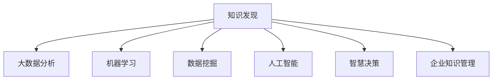

                 

# 知识发现引擎：开启知识创新新纪元

> 关键词：知识发现, 大数据分析, 机器学习, 人工智能, 数据挖掘, 企业知识管理, 智慧决策

## 1. 背景介绍

### 1.1 问题由来
在数字化时代，数据的量级和多样性呈现出爆炸式增长，企业和组织每天生成数以亿计的结构化与非结构化数据。如何从中提取有价值的信息，挖掘潜在的知识，成为当下企业知识管理与决策支持的关键课题。传统的知识管理方式依赖人工归纳和经验总结，效率低下，效果欠佳。随着人工智能和大数据技术的发展，知识发现引擎逐渐成为知识获取与智能决策的新途径。

### 1.2 问题核心关键点
知识发现引擎（Knowledge Discovery Engine, KDE）通过机器学习和数据挖掘技术，自动化地从海量数据中发现隐含的知识模式、关联规则和趋势，辅助企业进行数据驱动的智慧决策。它是一种基于大数据分析和人工智能技术的数据驱动型应用，旨在提升知识获取的效率和质量。

关键在于：
- **数据驱动**：依赖数据而非经验驱动，自动化地发现知识模式。
- **智能推理**：利用机器学习算法进行模式识别和关联规则推断。
- **持续优化**：通过不断学习新数据，知识发现引擎的准确性和完备性持续提升。

### 1.3 问题研究意义
研究知识发现引擎，对于推动数据驱动型智能决策、提升企业知识管理水平、加速知识创新进程具有重要意义：

1. **提升决策效率**：通过自动化数据处理和知识发现，辅助管理者快速做出明智的决策。
2. **优化资源配置**：基于深入的数据分析，优化资源配置，提高生产效率和盈利能力。
3. **增强竞争优势**：快速响应用户需求，把握市场趋势，赢得竞争先机。
4. **促进创新**：从数据中挖掘新的知识，驱动产品和服务的持续创新。
5. **支持智能自动化**：与智能系统集成，提升企业自动化水平，减少人工操作。

## 2. 核心概念与联系

### 2.1 核心概念概述

为更好地理解知识发现引擎，本节将介绍几个密切相关的核心概念：

- **知识发现（Knowledge Discovery）**：从大规模数据集中自动地发现有意义的模式和结构，是数据挖掘的重要分支。
- **大数据分析（Big Data Analysis）**：利用先进的数据处理和分析工具，从大数据集中提取有价值的信息。
- **机器学习（Machine Learning）**：通过算法和模型，使计算机能够从数据中学习和发现规律。
- **数据挖掘（Data Mining）**：从数据集中自动地发现潜在的模式、关联和趋势。
- **人工智能（Artificial Intelligence）**：赋予计算机智能行为，使机器能够进行自我学习、推理和决策。
- **智慧决策（Wisdom-based Decision-making）**：基于深入数据分析和知识推理，进行高效、科学的决策。
- **企业知识管理（Enterprise Knowledge Management）**：通过技术手段收集、整理、存储和利用企业知识，提升组织能力。

这些核心概念之间的逻辑关系可以通过以下Mermaid流程图来展示：



这个流程图展示出知识发现引擎的核心概念及其之间的关系：

1. 知识发现是数据挖掘的高级阶段，通过大数据分析和技术工具，挖掘数据中的知识模式。
2. 机器学习和人工智能为知识发现提供了必要的技术手段，增强了发现和推理能力。
3. 智慧决策利用知识发现的结果，进行高效、科学的决策支持。
4. 企业知识管理将知识发现作为支撑工具，提升企业的整体知识水平和竞争力。

## 3. 核心算法原理 & 具体操作步骤
### 3.1 算法原理概述

知识发现引擎的算法原理主要基于机器学习和数据挖掘技术，通过自动化地从大规模数据集中发现知识模式和关联规则，辅助企业进行决策。其核心思想是通过算法学习和分析数据特征，发现潜在的知识，并将其转化为可操作的见解和行动方案。

### 3.2 算法步骤详解

知识发现引擎的基本步骤如下：

**Step 1: 数据预处理**
- 收集和整理相关数据，包括结构化数据（如数据库、电子表格）和非结构化数据（如文本、图片、视频）。
- 进行数据清洗，处理缺失值、异常值和重复记录。
- 进行特征工程，提取和选择对知识发现有用的特征。

**Step 2: 数据探索与可视化**
- 使用数据探索工具，如统计描述、可视化图表等，发现数据的基本特征和分布情况。
- 通过可视化工具，如散点图、直方图、热力图等，直观展示数据中可能存在的模式和趋势。

**Step 3: 特征选择与提取**
- 基于领域知识和数据特征，选择和提取最相关的特征，以提高知识发现的效果。
- 使用特征工程技术，如主成分分析（PCA）、独立成分分析（ICA）等，对数据进行降维和特征提取。

**Step 4: 模型训练与知识发现**
- 根据选择的模型，对数据进行训练。常用的模型包括决策树、随机森林、支持向量机（SVM）、神经网络等。
- 训练模型后，使用模型进行预测和推理，发现数据中的模式和关联规则。

**Step 5: 结果解释与验证**
- 对知识发现的结果进行解释和验证，确保其符合业务逻辑和实际情况。
- 通过A/B测试、实验对比等方法，验证知识发现的效果和可信度。

### 3.3 算法优缺点

知识发现引擎具有以下优点：
1. **自动化处理**：通过机器学习算法自动化处理大量数据，提高效率。
2. **发现未知模式**：利用大数据分析技术，发现数据中未知的模式和趋势。
3. **增强决策支持**：通过知识发现，辅助企业进行数据驱动的决策，提高决策质量。
4. **提高企业竞争力**：通过深入挖掘数据中的知识，优化资源配置，提升生产效率。

同时，知识发现引擎也存在一定的局限性：
1. **数据质量依赖**：知识发现的准确性高度依赖于数据的质量和完整性。
2. **算法复杂度高**：复杂的机器学习算法计算量大，对硬件资源要求高。
3. **可解释性不足**：部分算法如深度学习模型的解释性较差，难以理解其内部决策机制。
4. **领域知识缺乏**：对领域知识的依赖较高，难以在无领域知识的情况下进行有效发现。
5. **模型过拟合风险**：过度复杂的模型易发生过拟合，降低泛化能力。

尽管存在这些局限性，但知识发现引擎在数据驱动型智能决策和知识管理中发挥着重要作用。未来相关研究的重点在于如何进一步降低算法的计算复杂度，提升模型的可解释性和泛化能力，同时结合更多领域知识，提高知识发现的准确性和实用性。

### 3.4 算法应用领域

知识发现引擎在多个领域得到了广泛应用，包括但不限于：

- **金融风控**：通过分析交易数据，发现潜在的风险和异常行为，进行风险预警和控制。
- **医疗健康**：从电子病历中提取患者特征和医疗数据，辅助诊断和治疗决策。
- **市场营销**：分析消费者行为和市场数据，发现潜在的市场机会和趋势，进行精准营销。
- **供应链管理**：通过分析供应链数据，优化资源配置，提高供应链效率和灵活性。
- **零售电商**：分析用户行为和销售数据，发现用户偏好和市场趋势，进行个性化推荐和库存管理。
- **智能客服**：分析客户反馈和对话数据，进行情感分析和舆情监测，提升客户满意度。

除了上述这些经典应用外，知识发现引擎还被创新性地应用到更多场景中，如金融欺诈检测、公共安全监控、智能推荐系统等，为各行各业带来了新的突破。随着技术进步和数据量的不断增长，知识发现引擎的应用场景将进一步拓展。

## 4. 数学模型和公式 & 详细讲解  
### 4.1 数学模型构建

在知识发现引擎中，常用的数学模型包括决策树、随机森林、支持向量机（SVM）和神经网络等。以下以决策树模型为例，详细讲解其构建和应用。

决策树是一种基于树形结构的分类算法，通过递归地将数据集分割成更小的子集，直至每个子集属于同一类别，从而进行分类或回归预测。决策树的构建过程包含特征选择、树剪枝等步骤。

### 4.2 公式推导过程

决策树模型的构建步骤如下：

1. **特征选择**：选择对分类有重要影响的特征。
2. **树构建**：通过递归分割数据集，构建决策树。
3. **树剪枝**：通过交叉验证等方法，对决策树进行剪枝，避免过拟合。

具体推导过程如下：

**特征选择**：
- 计算特征对分类的重要性：$Importance(f_i) = \sum_{j=1}^{N}(w_j * \mathbb{I}(f_j = f_i))$
- 选择重要性最高的特征进行分割。

**树构建**：
- 对数据集进行递归分割，直到每个子集属于同一类别。

**树剪枝**：
- 通过交叉验证等方法，对决策树进行剪枝，避免过拟合。

### 4.3 案例分析与讲解

以下通过一个简单的案例，解释决策树模型在知识发现中的应用：

**案例背景**：某电商公司需要分析用户行为数据，发现购买行为的模式和趋势，进行个性化推荐。

**数据预处理**：
- 收集用户浏览、购买历史数据，进行数据清洗和特征工程。

**特征选择**：
- 选择用户浏览时间、购买次数、类别偏好等特征，进行特征重要性计算。

**模型训练**：
- 使用决策树模型，对数据进行训练，生成决策树。

**结果解释与验证**：
- 对决策树进行解释，分析用户行为模式。
- 通过A/B测试，验证模型的准确性和效果。

## 5. 项目实践：代码实例和详细解释说明
### 5.1 开发环境搭建

在进行知识发现引擎的开发实践前，我们需要准备好开发环境。以下是使用Python进行Scikit-learn开发的环境配置流程：

1. 安装Anaconda：从官网下载并安装Anaconda，用于创建独立的Python环境。

2. 创建并激活虚拟环境：
```bash
conda create -n sklearn-env python=3.8 
conda activate sklearn-env
```

3. 安装Scikit-learn：
```bash
pip install scikit-learn
```

4. 安装各类工具包：
```bash
pip install numpy pandas scikit-learn matplotlib tqdm jupyter notebook ipython
```

完成上述步骤后，即可在`sklearn-env`环境中开始知识发现引擎的开发实践。

### 5.2 源代码详细实现

这里我们以构建一个简单的决策树模型为例，给出Scikit-learn库下的知识发现引擎开发代码实现。

```python
import pandas as pd
from sklearn.model_selection import train_test_split
from sklearn.tree import DecisionTreeClassifier
from sklearn.metrics import accuracy_score
from sklearn.preprocessing import LabelEncoder
from sklearn.feature_selection import SelectKBest, chi2

# 加载数据
data = pd.read_csv('user_behavior_data.csv')

# 数据预处理
label_encoder = LabelEncoder()
data['category'] = label_encoder.fit_transform(data['category'])

# 特征选择
selector = SelectKBest(chi2, k=5)
selected_features = selector.fit_transform(data.drop('category', axis=1), data['category'])

# 数据划分
X_train, X_test, y_train, y_test = train_test_split(selected_features, data['category'], test_size=0.2, random_state=42)

# 模型训练
model = DecisionTreeClassifier(max_depth=3)
model.fit(X_train, y_train)

# 结果评估
y_pred = model.predict(X_test)
accuracy = accuracy_score(y_test, y_pred)
print(f"模型准确度: {accuracy:.2f}")
```

### 5.3 代码解读与分析

让我们再详细解读一下关键代码的实现细节：

**特征选择**：
- 使用`SelectKBest`和`chi2`方法选择重要性最高的5个特征，用于分割数据集。

**模型训练**：
- 使用`DecisionTreeClassifier`构建决策树模型，并进行训练。

**结果评估**：
- 使用`accuracy_score`方法评估模型的准确度。

## 6. 实际应用场景
### 6.1 智慧医疗

知识发现引擎在智慧医疗中的应用，可以帮助医疗机构从大量医疗数据中发现潜在的模式和趋势，辅助医生进行诊断和治疗决策。

具体而言，可以收集患者的电子病历、影像数据、实验室检查结果等数据，使用知识发现引擎自动分析这些数据，发现疾病的发展趋势、病情变化等规律。例如，通过分析大量患者的病历数据，可以发现某些疾病的早期症状和潜在风险因素，辅助医生进行早期诊断和干预。

### 6.2 智能制造

知识发现引擎在智能制造中的应用，可以优化生产过程，提高生产效率和产品质量。

通过分析生产线的历史数据，知识发现引擎可以发现生产过程中的瓶颈和异常，进行工艺优化和资源配置。例如，通过分析机器设备的使用数据，可以发现设备的故障频率和维护周期，优化设备维护计划，减少停机时间，提高生产效率。

### 6.3 智能交通

知识发现引擎在智能交通中的应用，可以提高交通系统的安全性和效率，改善城市交通环境。

通过分析交通流量、事故记录、天气数据等，知识发现引擎可以发现交通流量高峰时段、常见事故类型等规律。例如，通过分析交通流量数据，可以发现高峰时段的拥堵点，优化交通信号灯的设置，缓解交通拥堵。

### 6.4 未来应用展望

随着知识发现引擎技术的不断进步，其应用前景将更加广阔。未来，知识发现引擎将进一步融合更多领域知识，提升知识发现的准确性和实用性，为各行各业带来新的变革：

1. **跨领域融合**：知识发现引擎将更多地融合跨领域知识，如金融知识、医学知识、工程知识等，提升综合分析能力。
2. **实时分析**：知识发现引擎将具备实时分析能力，实时监控数据变化，及时发现新的知识模式和趋势。
3. **自适应学习**：知识发现引擎将具备自适应学习能力，根据新数据不断优化模型，提升知识发现的准确性和泛化能力。
4. **智能推荐**：知识发现引擎将更多地应用于智能推荐系统，如个性化推荐、内容推荐等，提升用户体验。
5. **智慧决策支持**：知识发现引擎将成为企业智慧决策的重要支撑，辅助企业进行多维度分析，提高决策质量。

## 7. 工具和资源推荐
### 7.1 学习资源推荐

为了帮助开发者系统掌握知识发现引擎的理论基础和实践技巧，这里推荐一些优质的学习资源：

1. 《数据挖掘导论》（Introduction to Data Mining）：提供了数据挖掘的基本概念、技术和应用，是数据挖掘学习的入门级教材。
2. 《Python数据科学手册》（Python Data Science Handbook）：介绍了Python在数据科学中的应用，包括数据清洗、特征工程、机器学习等。
3. 《机器学习实战》（Machine Learning in Action）：提供了机器学习的实际案例和代码实现，适合初学者入门。
4. 《数据挖掘与统计学习》（Data Mining and Statistical Learning）：详细讲解了数据挖掘和统计学习的各种算法和技术，适合进阶学习。
5. Kaggle数据科学社区：提供了大量的数据集和竞赛，适合实践和应用。

通过对这些资源的学习实践，相信你一定能够快速掌握知识发现引擎的精髓，并用于解决实际的业务问题。
###  7.2 开发工具推荐

高效的开发离不开优秀的工具支持。以下是几款用于知识发现引擎开发的常用工具：

1. Python：广泛使用的编程语言，拥有丰富的数据科学和机器学习库，适合快速迭代和实验。
2. Scikit-learn：基于Python的数据挖掘和机器学习库，提供了多种模型和算法实现，适合知识发现和数据分析。
3. TensorFlow：由Google主导开发的开源深度学习框架，支持分布式计算，适合大规模数据处理和模型训练。
4. RapidMiner：提供直观的界面和丰富的算法库，适合初学者和中级开发者进行数据探索和分析。
5. Orange：提供图形化界面，支持数据可视化、特征选择、模型训练等，适合快速原型设计和实验。

合理利用这些工具，可以显著提升知识发现引擎的开发效率，加快创新迭代的步伐。

### 7.3 相关论文推荐

知识发现引擎的发展源于学界的持续研究。以下是几篇奠基性的相关论文，推荐阅读：

1. ID3: A Program for Inductive Learning：提出了ID3算法，基于信息熵进行决策树构建，是决策树算法的奠基之作。
2. C4.5: Programs for Machine Learning：在ID3的基础上，提出了C4.5算法，提高了决策树的准确性和泛化能力。
3. Random Forests: Consistency of Classification and Regression Trees: Algorithms for Multinomial Data: A Multiclass Analog of the Random Subspace Method: A General Method for Improvement of the Prediction of Random Forests: A Comparison of the Random Subspace Method with Random Features：介绍了随机森林算法，通过集成多个决策树，提高了模型的泛化能力和鲁棒性。
4. Support Vector Machines for Classification, Regression and Outliers: Dealing with Very Small Data Sets: The Design of Machine Learning Software: The Architecture of Learning Algorithms：介绍了支持向量机算法，通过最大化间隔，提高了模型的分类和回归能力。

这些论文代表了大规模数据挖掘和机器学习技术的发展脉络。通过学习这些前沿成果，可以帮助研究者把握学科前进方向，激发更多的创新灵感。

## 8. 总结：未来发展趋势与挑战
### 8.1 总结

本文对知识发现引擎进行了全面系统的介绍。首先阐述了知识发现引擎的研究背景和意义，明确了知识发现引擎在数据驱动型智能决策和知识管理中的重要作用。其次，从原理到实践，详细讲解了知识发现引擎的数学模型和操作步骤，给出了知识发现引擎的代码实现。同时，本文还广泛探讨了知识发现引擎在智慧医疗、智能制造、智能交通等多个行业领域的应用前景，展示了知识发现引擎的巨大潜力。此外，本文精选了知识发现引擎的学习资源，力求为读者提供全方位的技术指引。

通过本文的系统梳理，可以看到，知识发现引擎作为数据驱动型智能决策的重要工具，正在成为企业知识管理与智慧决策的关键支撑。随着技术的不断进步，知识发现引擎的应用场景将进一步拓展，为各行各业带来新的变革。

### 8.2 未来发展趋势

展望未来，知识发现引擎将呈现以下几个发展趋势：

1. **多模态数据融合**：知识发现引擎将更多地融合跨领域数据，如文本、图像、视频等，提升综合分析能力。
2. **实时分析**：知识发现引擎将具备实时分析能力，实时监控数据变化，及时发现新的知识模式和趋势。
3. **自适应学习**：知识发现引擎将具备自适应学习能力，根据新数据不断优化模型，提升知识发现的准确性和泛化能力。
4. **智慧决策支持**：知识发现引擎将成为企业智慧决策的重要支撑，辅助企业进行多维度分析，提高决策质量。
5. **智能推荐**：知识发现引擎将更多地应用于智能推荐系统，如个性化推荐、内容推荐等，提升用户体验。
6. **跨领域融合**：知识发现引擎将更多地融合跨领域知识，如金融知识、医学知识、工程知识等，提升综合分析能力。

以上趋势凸显了知识发现引擎的广阔前景。这些方向的探索发展，必将进一步提升知识发现引擎的性能和应用范围，为各行各业带来新的变革。

### 8.3 面临的挑战

尽管知识发现引擎已经取得了瞩目成就，但在迈向更加智能化、普适化应用的过程中，它仍面临着诸多挑战：

1. **数据质量依赖**：知识发现的准确性高度依赖于数据的质量和完整性。
2. **算法复杂度高**：复杂的机器学习算法计算量大，对硬件资源要求高。
3. **可解释性不足**：部分算法如深度学习模型的解释性较差，难以理解其内部决策机制。
4. **领域知识缺乏**：对领域知识的依赖较高，难以在无领域知识的情况下进行有效发现。
5. **模型过拟合风险**：过度复杂的模型易发生过拟合，降低泛化能力。
6. **隐私和安全问题**：在处理敏感数据时，需特别注意数据隐私和安全性问题。

尽管存在这些挑战，但知识发现引擎在数据驱动型智能决策和知识管理中发挥着重要作用。未来相关研究的重点在于如何进一步降低算法的计算复杂度，提升模型的可解释性和泛化能力，同时结合更多领域知识，提高知识发现的准确性和实用性。

### 8.4 研究展望

面对知识发现引擎所面临的种种挑战，未来的研究需要在以下几个方面寻求新的突破：

1. **无监督和半监督学习**：摆脱对大规模标注数据的依赖，利用自监督学习、主动学习等无监督和半监督范式，最大限度利用非结构化数据，实现更加灵活高效的发现。
2. **参数高效和计算高效的算法**：开发更加参数高效的算法，在固定大部分预训练参数的情况下，只更新极少量的任务相关参数。同时优化算法的计算图，减少前向传播和反向传播的资源消耗，实现更加轻量级、实时性的部署。
3. **融合因果和对比学习范式**：通过引入因果推断和对比学习思想，增强知识发现引擎建立稳定因果关系的能力，学习更加普适、鲁棒的语言表征，从而提升模型泛化性和抗干扰能力。
4. **跨领域融合和跨模态分析**：将符号化的先验知识，如知识图谱、逻辑规则等，与神经网络模型进行巧妙融合，引导知识发现过程学习更准确、合理的知识表示。同时加强不同模态数据的整合，实现视觉、语音等多模态信息与文本信息的协同建模。
5. **因果分析和博弈论工具**：将因果分析方法引入知识发现引擎，识别出模型决策的关键特征，增强输出解释的因果性和逻辑性。借助博弈论工具刻画人机交互过程，主动探索并规避模型的脆弱点，提高系统稳定性。
6. **结合伦理道德约束**：在模型训练目标中引入伦理导向的评估指标，过滤和惩罚有偏见、有害的输出倾向。同时加强人工干预和审核，建立模型行为的监管机制，确保输出符合人类价值观和伦理道德。

这些研究方向的探索，必将引领知识发现引擎技术迈向更高的台阶，为构建安全、可靠、可解释、可控的智能系统铺平道路。面向未来，知识发现引擎技术还需要与其他人工智能技术进行更深入的融合，如知识表示、因果推理、强化学习等，多路径协同发力，共同推动知识获取和智能决策系统的进步。只有勇于创新、敢于突破，才能不断拓展知识发现引擎的边界，让智能技术更好地造福人类社会。

## 9. 附录：常见问题与解答

**Q1：知识发现引擎是否适用于所有业务场景？**

A: 知识发现引擎在大多数业务场景中都能发挥重要作用，但需结合具体业务需求进行适配。对于某些特定的业务场景，如复杂的工程设计、金融交易分析等，可能需要结合领域专家的经验进行模型优化。

**Q2：知识发现引擎的计算复杂度如何？**

A: 知识发现引擎的计算复杂度取决于具体算法和数据规模。复杂的机器学习算法如深度学习模型计算量大，对硬件资源要求较高。但随着硬件技术的不断进步，计算复杂度问题已得到一定缓解。

**Q3：知识发现引擎的解释性如何？**

A: 部分算法如深度学习模型的解释性较差，难以理解其内部决策机制。但通过特征工程和模型解释工具，如SHAP、LIME等，可以提升模型的可解释性。未来研究还需进一步提升模型的透明性和可理解性。

**Q4：知识发现引擎如何处理数据隐私和安全问题？**

A: 在处理敏感数据时，知识发现引擎需特别注意数据隐私和安全性问题。可以使用数据匿名化、差分隐私等技术，保护用户隐私。同时，加强模型的安全性检查，防止模型被恶意攻击或篡改。

**Q5：知识发现引擎如何在无领域知识的情况下进行有效发现？**

A: 在无领域知识的情况下，知识发现引擎可通过自监督学习、主动学习等无监督学习方法，利用数据特征进行模式发现。同时，引入先验知识图谱和规则库，引导模型进行更加合理的学习。

---

作者：禅与计算机程序设计艺术 / Zen and the Art of Computer Programming

