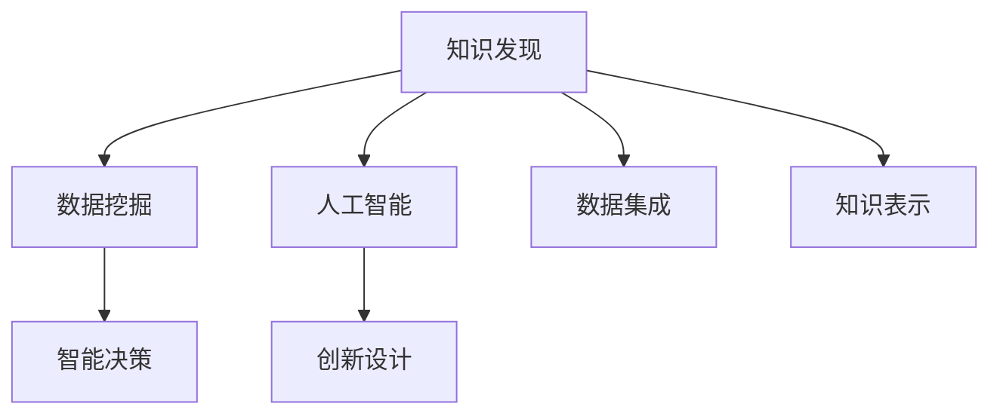

                 

# 知识发现引擎：推动创意产业的创新引擎

> 关键词：知识发现,创意产业,大数据,人工智能,数据挖掘,机器学习,算法优化,智能设计

## 1. 背景介绍

### 1.1 问题由来
在数字化浪潮的推动下，全球创意产业进入了快速发展阶段。然而，创意产业面临的最大挑战之一是如何高效地从海量数据中挖掘出有价值的信息，并将这些信息转化为创意内容。传统的知识管理、信息检索等技术手段已经无法满足日益增长的需求。

为此，知识发现(Knowledge Discovery)技术应运而生。知识发现是通过挖掘大数据中的隐含模式和知识，以支持决策制定和创新设计的新兴领域。它综合了数据挖掘、机器学习、人工智能等多学科技术，为创意产业提供了强大的知识引擎，推动了行业的创新发展。

### 1.2 问题核心关键点
知识发现引擎的核心在于其能够高效、准确地从数据中提取有用信息，并将其应用于创意设计、营销策划、产品研发等环节。其关键点包括：

- 数据集成：将来自不同来源的数据进行整合和清洗，构建统一的数据基础。
- 数据挖掘：应用数据挖掘算法发现数据中的模式和知识。
- 知识表示：将挖掘出的知识结构化，便于存储和应用。
- 智能决策：基于挖掘结果进行智能分析和决策支持。
- 创新设计：结合人工智能算法生成新颖的创意内容。

## 2. 核心概念与联系

### 2.1 核心概念概述

为更好地理解知识发现引擎的工作原理和优化方向，本节将介绍几个关键概念及其间的联系：

- 知识发现(Knowledge Discovery, KD)：通过数据挖掘技术从海量数据中提取有用知识的过程，为决策制定和创新设计提供支持。
- 数据挖掘(Data Mining, DM)：应用算法和工具从数据集中提取有价值模式和知识的过程。
- 人工智能(Artificial Intelligence, AI)：通过模拟人类智能，实现智能决策和创意设计。
- 创意产业(Creative Industries)：涵盖广告、媒体、娱乐、设计等多个领域，需要大量创新和创意驱动。
- 数据集成(Data Integration)：将多个异构数据源合并为一个统一的数据集，为知识发现提供基础。
- 知识表示(Knowledge Representation)：将挖掘出的知识结构化，便于存储和应用。

这些核心概念之间的逻辑关系可以通过以下Mermaid流程图来展示：



这个流程图展示了知识发现引擎的核心组成和运行流程：

1. 数据集成：将异构数据源整合成统一的数据集。
2. 数据挖掘：在数据集上应用算法，提取模式和知识。
3. 知识表示：将挖掘出的知识结构化，便于应用。
4. 智能决策：基于知识进行决策支持。
5. 创新设计：生成新的创意内容。

这些概念共同构成了知识发现引擎的完整体系，使其能够在创意产业中发挥强大的知识引擎作用。

## 3. 核心算法原理 & 具体操作步骤
### 3.1 算法原理概述

知识发现引擎的工作原理可以概括为：从数据集D中提取有用知识K，并应用于创意产业中的具体任务。这一过程涉及多个步骤，包括数据集成、数据挖掘、知识表示、智能决策和创新设计。

### 3.2 算法步骤详解

基于知识发现引擎的工作原理，其核心算法步骤可以分为以下几个环节：

1. **数据集成**：收集和整合来自不同来源的数据，构建统一的数据基础。这一步骤需要处理数据清洗、转换、归一化等任务，确保数据的完整性和一致性。

2. **数据挖掘**：应用数据挖掘算法从数据集中提取模式和知识。这一过程可以通过聚类、分类、关联规则等多种算法实现。

3. **知识表示**：将挖掘出的知识结构化，便于存储和应用。这一步骤需要设计合适的数据模型和表示方法，如关系模型、面向对象模型等。

4. **智能决策**：基于挖掘结果进行智能分析和决策支持。这一步骤需要应用决策树、支持向量机、神经网络等算法进行模型训练和预测。

5. **创新设计**：结合人工智能算法生成新颖的创意内容。这一步骤可以通过生成对抗网络(GAN)、协同过滤、协同进化等算法实现。

### 3.3 算法优缺点

知识发现引擎具有以下优点：

- 高效性：能够高效地从海量数据中提取有用知识，支撑决策制定和创新设计。
- 普适性：适用于多个领域，包括广告、媒体、设计、制造等，具有良好的应用前景。
- 灵活性：可以灵活应用于不同的创意任务，如品牌策划、营销推广、产品设计等。

同时，该方法也存在一些局限性：

- 数据依赖：知识发现的有效性高度依赖于数据的质量和完备性。
- 算法复杂：涉及多种复杂算法，如聚类、分类、关联规则等，实施难度较大。
- 数据隐私：涉及用户隐私数据，需要合理处理和保护。
- 可解释性：部分算法的决策过程不透明，难以解释。

尽管存在这些局限性，但知识发现引擎在创意产业中的应用前景广阔，未来仍需进一步研究和优化。

### 3.4 算法应用领域

知识发现引擎在创意产业中具有广泛的应用前景，包括但不限于以下几个领域：

- 广告创意：通过分析用户行为数据和市场趋势，生成具有创意的广告方案。
- 媒体策划：应用数据挖掘技术，发现用户兴趣点，生成符合用户期望的媒体内容。
- 产品设计：结合设计图纸、市场反馈和用户需求，生成具有创新性的产品设计。
- 创意营销：通过挖掘消费者行为数据，制定个性化营销策略，提高营销效果。
- 品牌管理：分析品牌相关数据，发现品牌影响力和用户偏好，制定品牌策略。

## 4. 数学模型和公式 & 详细讲解 & 举例说明

### 4.1 数学模型构建

知识发现引擎的数学模型构建主要涉及以下几个方面：

1. **数据预处理**：数据清洗、转换、归一化等操作。
2. **数据挖掘算法**：如K-Means聚类、决策树、支持向量机、神经网络等。
3. **知识表示**：如关系模型、面向对象模型等。
4. **智能决策**：如线性回归、逻辑回归、随机森林等。
5. **创新设计**：如GAN、协同过滤、协同进化等。

### 4.2 公式推导过程

以聚类算法K-Means为例，其基本步骤如下：

1. **初始化**：随机选择K个样本作为初始聚类中心。
2. **分配**：计算每个样本到最近的聚类中心的距离，将样本分配到最近的聚类中心所在的簇中。
3. **更新**：计算每个簇的新聚类中心，重新分配样本。
4. **收敛**：重复第2、3步，直到聚类中心不再变化。

K-Means的公式推导如下：

$$
\text{minimize} \sum_{i=1}^n \sum_{k=1}^K d_i^k
$$

其中，$d_i^k$表示第$i$个样本到第$k$个聚类中心的距离，$n$为样本数，$K$为聚类数。

### 4.3 案例分析与讲解

假设我们要对一家广告公司的历史广告数据进行知识发现，以生成新的广告方案。具体步骤如下：

1. **数据集成**：收集广告公司所有历史广告数据，包括广告标题、投放渠道、点击率等，进行清洗和转换，构建统一的数据集。

2. **数据挖掘**：应用K-Means算法对广告数据进行聚类，发现不同广告类型的点击率分布。

3. **知识表示**：将聚类结果表示为关系图，标注出不同广告类型的特征和关联关系。

4. **智能决策**：基于聚类结果和历史点击率数据，构建线性回归模型，预测新广告的点击率。

5. **创新设计**：结合GAN算法，生成新颖的广告标题和设计方案。

最终生成的广告方案可以应用于实际投放，评估效果，并不断迭代优化。

## 5. 项目实践：代码实例和详细解释说明
### 5.1 开发环境搭建

要进行知识发现引擎的实践开发，首先需要准备好开发环境。以下是使用Python进行知识发现引擎开发的流程：

1. 安装Python：从官网下载并安装Python。
2. 安装Pandas：用于数据处理和分析。
3. 安装NumPy：用于科学计算。
4. 安装Scikit-learn：包含多种机器学习算法。
5. 安装Matplotlib：用于数据可视化。
6. 安装TensorFlow或PyTorch：用于深度学习和创新设计。

完成上述步骤后，即可在Python环境中进行知识发现引擎的开发。

### 5.2 源代码详细实现

下面以聚类算法K-Means为例，展示其代码实现。

```python
import pandas as pd
from sklearn.cluster import KMeans
import matplotlib.pyplot as plt

# 加载数据
data = pd.read_csv('ad_data.csv')

# 数据预处理
data = data.dropna()
data = data.drop_duplicates()

# 聚类分析
kmeans = KMeans(n_clusters=3, random_state=0)
kmeans.fit(data)

# 输出聚类结果
labels = kmeans.labels_
centers = kmeans.cluster_centers_

# 数据可视化
plt.scatter(data['click_rate'], data['cost'], c=labels)
plt.scatter(centers[:, 0], centers[:, 1], c='red')
plt.xlabel('click_rate')
plt.ylabel('cost')
plt.show()
```

### 5.3 代码解读与分析

上述代码实现了K-Means算法对广告数据的聚类分析。具体步骤如下：

1. 加载数据：使用Pandas库加载广告数据，并进行清洗和去重。
2. 数据预处理：使用Pandas库进行数据清洗和去重，去除无效和重复数据。
3. 聚类分析：使用Scikit-learn库中的KMeans算法进行聚类，设置聚类数为3，随机种子为0。
4. 输出聚类结果：获取每个样本的聚类标签和聚类中心。
5. 数据可视化：使用Matplotlib库将聚类结果可视化，展示了不同广告类型的特征和关联关系。

## 6. 实际应用场景
### 6.1 广告创意

在广告创意中，知识发现引擎可以通过分析用户行为数据和市场趋势，生成具有创意的广告方案。具体步骤如下：

1. **数据收集**：收集用户行为数据、市场趋势数据、广告点击率数据等。
2. **数据预处理**：对数据进行清洗、转换和归一化。
3. **数据挖掘**：应用聚类算法发现用户兴趣点，生成不同的用户群体。
4. **知识表示**：将用户群体特征表示为关系图，标注出不同群体的特征和关联关系。
5. **智能决策**：基于用户群体特征和历史点击率数据，生成新的广告创意。
6. **创新设计**：结合GAN算法，生成新颖的广告标题和设计方案。

### 6.2 媒体策划

在媒体策划中，知识发现引擎可以通过挖掘消费者行为数据，生成符合用户期望的媒体内容。具体步骤如下：

1. **数据收集**：收集用户行为数据、媒体播放数据、点击率数据等。
2. **数据预处理**：对数据进行清洗、转换和归一化。
3. **数据挖掘**：应用分类算法识别用户兴趣点，生成不同的用户群体。
4. **知识表示**：将用户群体特征表示为关系图，标注出不同群体的特征和关联关系。
5. **智能决策**：基于用户群体特征和历史点击率数据，生成媒体内容。
6. **创新设计**：结合协同过滤算法，生成个性化媒体推荐。

### 6.3 产品设计

在产品设计中，知识发现引擎可以通过分析设计图纸、市场反馈和用户需求，生成具有创新性的产品设计。具体步骤如下：

1. **数据收集**：收集设计图纸数据、市场反馈数据、用户需求数据等。
2. **数据预处理**：对数据进行清洗、转换和归一化。
3. **数据挖掘**：应用关联规则算法发现产品设计特征，生成不同的产品类别。
4. **知识表示**：将产品类别特征表示为关系图，标注出不同类别的特征和关联关系。
5. **智能决策**：基于产品类别特征和市场反馈数据，生成产品设计方案。
6. **创新设计**：结合协同进化算法，生成创新产品设计。

### 6.4 创意营销

在创意营销中，知识发现引擎可以通过挖掘消费者行为数据，制定个性化营销策略，提高营销效果。具体步骤如下：

1. **数据收集**：收集用户行为数据、市场趋势数据、点击率数据等。
2. **数据预处理**：对数据进行清洗、转换和归一化。
3. **数据挖掘**：应用聚类算法发现用户兴趣点，生成不同的用户群体。
4. **知识表示**：将用户群体特征表示为关系图，标注出不同群体的特征和关联关系。
5. **智能决策**：基于用户群体特征和历史点击率数据，制定个性化营销策略。
6. **创新设计**：结合协同过滤算法，生成个性化营销方案。

## 7. 工具和资源推荐
### 7.1 学习资源推荐

为了帮助开发者系统掌握知识发现引擎的理论基础和实践技巧，这里推荐一些优质的学习资源：

1. 《数据科学入门》系列课程：由Coursera开设，涵盖数据清洗、数据挖掘、机器学习等基础内容，适合初学者入门。
2. 《Python数据科学手册》书籍：详细介绍Python在数据科学中的应用，涵盖数据处理、机器学习、可视化等技术。
3. 《深度学习》系列课程：由Udacity开设，涵盖深度学习的基本概念和前沿技术，适合进阶学习。
4. 《数据挖掘与统计学习》书籍：由李航著作，详细介绍了数据挖掘和统计学习的基本方法和应用实例。
5. Kaggle数据竞赛：Kaggle是全球最大的数据科学竞赛平台，通过参与竞赛可以积累实践经验和提高技术水平。

通过对这些资源的学习实践，相信你一定能够快速掌握知识发现引擎的精髓，并用于解决实际的创意产业问题。
###  7.2 开发工具推荐

高效的开发离不开优秀的工具支持。以下是几款用于知识发现引擎开发的常用工具：

1. Python：基于Python的开源深度学习框架，灵活动态的计算图，适合快速迭代研究。
2. R：数据处理和统计分析的流行语言，适合数据挖掘和分析。
3. SQL：结构化查询语言，适合数据集成和数据清洗。
4. Tableau：数据可视化的流行工具，适合数据探索和可视化。
5. Jupyter Notebook：交互式编程环境，适合数据处理和算法实现。
6. Hadoop：大规模数据处理框架，适合处理海量数据。

合理利用这些工具，可以显著提升知识发现引擎的开发效率，加快创新迭代的步伐。

### 7.3 相关论文推荐

知识发现引擎的研究源于学界的持续研究。以下是几篇奠基性的相关论文，推荐阅读：

1. 《K-Means: Algorithms for Vector Quantization》：提出了K-Means聚类算法，为数据挖掘奠定了基础。
2. 《A Survey of Clustering Algorithms》：综述了多种聚类算法，为聚类技术提供了丰富的参考。
3. 《Deep Learning》：深度学习领域的经典教材，详细介绍了深度学习的基本概念和应用实例。
4. 《The Elements of Statistical Learning》：统计学习领域的经典教材，介绍了多种机器学习算法和应用。
5. 《Data Mining: Concepts and Techniques》：数据挖掘领域的经典教材，详细介绍了数据挖掘的基本方法和应用实例。

这些论文代表了大数据和人工智能技术的发展脉络。通过学习这些前沿成果，可以帮助研究者把握学科前进方向，激发更多的创新灵感。

## 8. 总结：未来发展趋势与挑战
### 8.1 总结

本文对知识发现引擎的理论基础和实践技巧进行了全面系统的介绍。首先阐述了知识发现引擎在创意产业中的重要作用和应用前景，明确了知识发现引擎的工作原理和主要步骤。其次，从原理到实践，详细讲解了知识发现引擎的数学模型和核心算法，给出了完整的代码实例和解释分析。同时，本文还探讨了知识发现引擎在多个创意产业中的应用场景，展示了其广阔的应用前景。最后，本文推荐了一些学习资源、开发工具和相关论文，力求为读者提供全方位的技术指引。

通过本文的系统梳理，可以看到，知识发现引擎为创意产业提供了强大的知识引擎，推动了行业的创新发展。未来，伴随大数据和人工智能技术的持续演进，知识发现引擎必将在更多领域得到应用，为创意产业带来新的突破。

### 8.2 未来发展趋势

展望未来，知识发现引擎将呈现以下几个发展趋势：

1. **深度学习和大数据技术的结合**：深度学习在知识发现中的应用将越来越广泛，结合大数据技术，可以实现更加高效、精准的知识发现。
2. **自适应知识发现**：引入自适应算法，根据数据变化实时调整算法参数，实现更加灵活、高效的智能决策。
3. **跨领域知识融合**：知识发现引擎将融合多领域知识，如心理学、社会学等，提升知识发现的深度和广度。
4. **隐私保护与数据安全**：知识发现过程中涉及大量敏感数据，如何保障数据隐私和安全性将是一个重要研究方向。
5. **人机协同创新**：知识发现引擎将与人类设计师、创意人员协同工作，共同创新，推动创意产业的变革。

这些趋势凸显了知识发现引擎的广阔前景。这些方向的探索发展，必将进一步提升知识发现引擎的性能和应用范围，为创意产业带来新的突破。

### 8.3 面临的挑战

尽管知识发现引擎已经取得了一定的成就，但在迈向更加智能化、普适化应用的过程中，它仍面临诸多挑战：

1. **数据质量瓶颈**：知识发现的效果高度依赖于数据的质量和完备性。如何在复杂、多源的数据中提取有用信息，是一个重要的挑战。
2. **算法复杂性**：知识发现涉及多种复杂算法，如聚类、分类、关联规则等，实施难度较大。
3. **隐私和伦理问题**：知识发现过程中涉及大量敏感数据，如何保障数据隐私和伦理合规是一个重要问题。
4. **可解释性不足**：部分算法的决策过程不透明，难以解释。如何提高知识发现过程的透明性和可解释性，将是重要的研究方向。
5. **跨领域应用难度**：知识发现引擎在不同领域的应用中存在差异，如何设计通用、灵活的解决方案，是一个重要挑战。

尽管存在这些挑战，但知识发现引擎在创意产业中的应用前景广阔，未来仍需进一步研究和优化。

### 8.4 研究展望

面对知识发现引擎面临的诸多挑战，未来的研究需要在以下几个方面寻求新的突破：

1. **改进数据预处理技术**：提高数据清洗、转换和归一化的效率和准确性，减少数据质量对知识发现的影响。
2. **开发高效算法**：引入自适应算法、分布式算法等，提高知识发现过程的效率和精度。
3. **提升隐私保护能力**：研究数据匿名化、差分隐私等技术，保障数据隐私和伦理合规。
4. **增强可解释性**：引入可解释性技术，如LIME、SHAP等，提高知识发现过程的透明性和可解释性。
5. **推动跨领域应用**：研究跨领域知识融合技术，设计通用、灵活的知识发现引擎。

这些研究方向的探索，必将引领知识发现引擎技术迈向更高的台阶，为创意产业带来新的突破。

## 9. 附录：常见问题与解答

**Q1：知识发现引擎适用于所有创意产业吗？**

A: 知识发现引擎在创意产业中具有广泛的应用前景，但对于一些特定领域，如心理学、社会学等，需要结合领域知识进行优化，才能取得最佳效果。

**Q2：如何选择适合的知识发现算法？**

A: 选择适合的知识发现算法需要考虑数据类型、任务需求和计算资源等因素。聚类、分类、关联规则等算法各有优势，需要根据具体场景进行合理选择。

**Q3：知识发现引擎的数据来源有哪些？**

A: 知识发现引擎的数据来源包括用户行为数据、市场趋势数据、产品销售数据等。不同数据源的数据类型和格式不同，需要进行清洗和转换。

**Q4：知识发现引擎与传统知识管理系统的区别是什么？**

A: 知识发现引擎通过数据挖掘技术从大数据中提取有用知识，具有高效性、普适性和灵活性。而传统知识管理系统通常依赖专家人工标注，适用于知识积累和管理。

**Q5：知识发现引擎如何处理多模态数据？**

A: 知识发现引擎可以通过融合文本、图像、语音等多模态数据，进行跨模态学习，提升知识发现的效果和广度。

总之，知识发现引擎为创意产业提供了强大的知识引擎，推动了行业的创新发展。未来，伴随大数据和人工智能技术的持续演进，知识发现引擎必将在更多领域得到应用，为创意产业带来新的突破。

