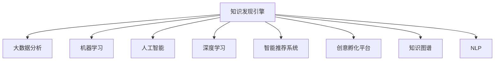

                 

# 知识发现引擎：推动创意产业的转型升级

> 关键词：知识发现引擎, 创意产业, 大数据分析, 机器学习, 人工智能, 深度学习, 智能推荐系统, 创意孵化平台, 知识图谱, 自然语言处理(NLP)

## 1. 背景介绍

### 1.1 问题由来

在数字经济时代，创意产业正经历着前所未有的变革。传统的内容生产、营销推广、消费模式都在受到数字化、智能化转型的影响。随着消费者需求的日益多样化，以及技术手段的日益丰富，如何高效、精准地捕捉和利用海量数据，洞察市场趋势和用户偏好，成为创意产业亟需解决的问题。

知识发现引擎（Knowledge Discovery Engine, KDE）的概念由此而生。它是一种高级的数据分析技术，通过挖掘和整合海量数据中的隐含知识和模式，帮助创意产业更好地理解市场和消费者，加速产品创新和内容创作，提升营销效果。

### 1.2 问题核心关键点

知识发现引擎的核心在于通过智能算法和大数据分析技术，从海量数据中提取、加工、展示有用的知识。其关键点包括：

- 高效的数据挖掘与处理能力。能够处理大数据集，并从中提取有价值的信息。
- 强大的知识建模与推理能力。通过构建知识图谱、语义网络等模型，进行智能推理和预测。
- 精准的用户画像与推荐能力。通过分析用户行为数据，形成个性化推荐和精准营销策略。
- 实时的决策支持与预警能力。能够快速响应市场变化，提供实时决策支持，预警潜在风险。
- 多模态数据的融合与协同能力。能够整合图像、语音、文本等多种模态的数据，提升知识发现的全面性和准确性。

这些核心能力共同构成了知识发现引擎的工作原理和优化方向。通过深入探索和应用这些技术，知识发现引擎正逐步成为创意产业中不可或缺的工具，推动其转型升级。

## 2. 核心概念与联系

### 2.1 核心概念概述

为更好地理解知识发现引擎的原理和架构，本节将介绍几个密切相关的核心概念：

- 知识发现（Knowledge Discovery）：通过挖掘数据中的隐含知识，帮助人们理解数据背后的规律和模式。
- 大数据分析（Big Data Analysis）：对大规模数据集进行存储、处理、分析和可视化的过程，是知识发现的重要手段。
- 机器学习（Machine Learning）：通过算法和模型，让机器具备学习数据特征和模式的能力，是知识发现和智能推荐的重要技术。
- 人工智能（Artificial Intelligence）：使机器具备人类智能水平，能够自主学习、推理、决策，是知识发现引擎的实现基础。
- 深度学习（Deep Learning）：一种基于神经网络的高级机器学习技术，能够处理复杂的多层次非线性数据，是知识发现中的核心算法之一。
- 智能推荐系统（Recommendation System）：通过分析用户行为数据，为用户推荐符合其兴趣和需求的内容，是知识发现的重要应用场景。
- 创意孵化平台（Creative Incubator Platform）：为创意项目提供资源、平台和市场支持，加速创意产品的研发和推广，是知识发现引擎的重要应用方向。
- 知识图谱（Knowledge Graph）：以图的形式表示实体、属性和关系，构建知识网络，是知识发现和智能推理的重要工具。
- 自然语言处理（Natural Language Processing, NLP）：使机器具备理解和生成人类语言的能力，是知识发现引擎处理文本数据的重要手段。

这些核心概念之间的逻辑关系可以通过以下Mermaid流程图来展示：



这个流程图展示了大数据、机器学习、人工智能等技术如何共同构建知识发现引擎，并通过智能推荐系统、创意孵化平台等应用场景，实现其在创意产业中的价值。

## 3. 核心算法原理 & 具体操作步骤

### 3.1 算法原理概述

知识发现引擎的核心算法原理可以归纳为以下几个方面：

1. 数据预处理：对原始数据进行清洗、去重、归一化等处理，以消除数据中的噪音和偏差。
2. 特征提取：通过统计分析、降维、聚类等技术，从数据中提取关键特征，构建特征向量。
3. 模型训练：选择合适的机器学习模型，如分类、回归、聚类、关联规则等，训练模型参数，以识别数据中的模式和规律。
4. 知识推理：通过构建知识图谱、语义网络等，进行逻辑推理和预测，以发现数据中的隐含知识和关系。
5. 推荐系统：基于用户画像和物品特征，构建推荐模型，实现个性化推荐。
6. 平台集成：将知识发现引擎与其他系统（如电商平台、社交网络、内容管理系统等）集成，提供决策支持和预警服务。

这些步骤相互配合，共同完成数据挖掘、知识发现、智能推荐等任务，推动创意产业的转型升级。

### 3.2 算法步骤详解

以下是知识发现引擎的具体操作步骤：

**Step 1: 数据收集与清洗**
- 从不同的数据源（如电商平台、社交网络、新闻媒体等）收集数据。
- 对数据进行清洗，去除无关数据和噪音。
- 对文本数据进行分词、去停用词等预处理。

**Step 2: 特征提取与选择**
- 使用TF-IDF、词嵌入（Word Embedding）等技术提取特征。
- 应用PCA、LDA等降维算法，减少特征维度。
- 使用聚类算法（如K-Means、层次聚类等）对特征进行分组。

**Step 3: 模型训练与优化**
- 选择适合的知识发现算法（如协同过滤、矩阵分解、决策树等）。
- 使用交叉验证等技术对模型进行调参和优化。
- 对模型进行评估，选择最优模型。

**Step 4: 知识推理与可视化**
- 构建知识图谱，描述实体、属性和关系。
- 使用知识图谱进行推理，发现实体间的潜在关系。
- 通过可视化工具（如Gephi、Tableau等）展示知识网络。

**Step 5: 智能推荐与决策支持**
- 基于用户行为数据，构建推荐模型。
- 使用实时数据流技术，实现动态推荐。
- 提供决策支持服务，预测市场趋势和用户需求。

**Step 6: 平台集成与部署**
- 将知识发现引擎集成到创意孵化平台、电商平台等应用中。
- 部署到云平台或本地服务器，提供稳定、高效的服务。

### 3.3 算法优缺点

知识发现引擎具有以下优点：
1. 高效的数据处理能力。能够处理大规模数据集，快速挖掘有价值的信息。
2. 精准的知识发现与推荐。通过智能算法和知识图谱，实现精准的知识发现和智能推荐。
3. 实时的决策支持。能够实时响应市场变化，提供决策支持。
4. 多元的数据融合能力。能够整合多种模态的数据，提升知识发现的全面性。
5. 可扩展性强。可以轻松集成到各种应用场景中，适应不同需求。

同时，知识发现引擎也存在一些缺点：
1. 数据隐私和安全问题。需要处理大量的个人数据，可能存在隐私泄露和安全风险。
2. 数据质量依赖度高。数据的质量和完整性直接影响知识发现的准确性。
3. 模型复杂度较高。需要设计复杂的算法和模型，实现高效的知识发现和推荐。
4. 计算资源需求大。处理大规模数据需要强大的计算资源和硬件支持。
5. 模型解释性差。部分深度学习模型缺乏解释性，难以理解其内部逻辑和决策过程。

尽管存在这些局限性，但知识发现引擎在创意产业中的应用前景广阔，已经成为推动创意产业转型升级的重要工具。

### 3.4 算法应用领域

知识发现引擎在创意产业中的应用领域非常广泛，涵盖以下几个方面：

**1. 内容推荐**
知识发现引擎可以分析用户的浏览、点赞、评论等行为数据，为用户推荐符合其兴趣和需求的内容，如文章、视频、商品等。通过智能推荐系统，可以提升用户体验，增加用户粘性，推动销售增长。

**2. 市场趋势分析**
通过对大量市场数据进行分析和建模，知识发现引擎可以预测市场趋势和消费者需求，帮助企业做出更加科学的决策。例如，通过分析社交媒体上的用户反馈，可以发现新产品的市场潜力和消费者偏好。

**3. 产品设计与创新**
知识发现引擎可以从海量的设计和创新数据中，提取创意灵感和设计灵感，辅助设计师进行创新。例如，通过分析历史产品的成功案例，可以发现设计趋势和用户需求，提升产品设计的质量和效率。

**4. 用户画像与个性化服务**
通过对用户行为数据进行分析和建模，知识发现引擎可以形成详细的用户画像，实现个性化的推荐和服务。例如，为不同用户推荐定制化的产品、内容和服务，提升用户满意度和忠诚度。

**5. 智能客服与虚拟助手**
通过构建智能客服系统和虚拟助手，知识发现引擎可以提升客户服务体验，提供24/7的实时支持。例如，通过分析用户对话数据，实现智能问答和问题解答，提升客服效率和用户满意度。

**6. 版权保护与盗版检测**
通过对海量版权数据进行分析，知识发现引擎可以发现盗版行为，保护知识产权。例如，通过分析文字、图像、音频等数据，检测和追踪盗版内容，保护创作者的合法权益。

## 4. 数学模型和公式 & 详细讲解 & 举例说明

### 4.1 数学模型构建

知识发现引擎的数学模型可以归纳为以下几个方面：

- 数据预处理模型：用于清洗和归一化原始数据。
- 特征提取模型：用于提取和选择关键特征。
- 知识发现模型：用于训练和优化知识发现算法。
- 知识推理模型：用于构建和推理知识图谱。
- 推荐系统模型：用于实现个性化推荐。
- 决策支持模型：用于提供决策支持服务。

### 4.2 公式推导过程

以下是对知识发现引擎中部分关键模型的推导过程。

**数据预处理模型**
假设原始数据集为 $D=\{(x_i,y_i)\}_{i=1}^N$，其中 $x_i \in \mathcal{X}, y_i \in \mathcal{Y}$。预处理模型可以表示为：

$$
\tilde{D} = \{(\tilde{x}_i,\tilde{y}_i)\}_{i=1}^N
$$

其中，$\tilde{x}_i$ 为清洗后的特征向量，$\tilde{y}_i$ 为标签。预处理模型可以表示为：

$$
\tilde{x}_i = f(x_i)
$$

其中 $f$ 为预处理函数。

**特征提取模型**
假设特征提取模型为 $F$，将原始数据集 $D$ 转化为特征集 $X$：

$$
X = F(D)
$$

常用的特征提取方法包括TF-IDF、词嵌入（Word Embedding）、PCA等。

**知识发现模型**
假设知识发现模型为 $M$，将特征集 $X$ 训练为知识图谱 $\mathcal{G}$：

$$
\mathcal{G} = M(X)
$$

常用的知识发现算法包括协同过滤、矩阵分解、决策树等。

**知识推理模型**
假设知识推理模型为 $R$，将知识图谱 $\mathcal{G}$ 进行推理，得到推理结果 $R_{out}$：

$$
R_{out} = R(\mathcal{G})
$$

常用的知识推理方法包括关系抽取、实体关联、路径查询等。

**推荐系统模型**
假设推荐系统模型为 $R$，将用户特征 $U$ 和物品特征 $I$ 训练为推荐结果 $R_{rec}$：

$$
R_{rec} = R(U,I)
$$

常用的推荐算法包括基于协同过滤的推荐、基于矩阵分解的推荐、基于深度学习的推荐等。

**决策支持模型**
假设决策支持模型为 $D$，将知识图谱 $\mathcal{G}$ 和推荐结果 $R_{rec}$ 转化为决策支持信息 $D_{out}$：

$$
D_{out} = D(\mathcal{G},R_{rec})
$$

常用的决策支持方法包括趋势预测、风险预警、市场分析等。

### 4.3 案例分析与讲解

**案例1：电商平台内容推荐**
假设电商平台的原始数据集为 $D$，包含用户的浏览、购买、评价等行为数据。通过预处理模型、特征提取模型、知识发现模型、推荐系统模型和决策支持模型，可以为用户提供个性化的推荐服务。

1. **预处理模型**
   - 清洗原始数据，去除无关数据和噪音。
   - 对文本数据进行分词、去停用词等预处理。

2. **特征提取模型**
   - 提取用户的浏览记录、购买记录、评价记录等特征。
   - 使用词嵌入（Word Embedding）方法提取物品特征。

3. **知识发现模型**
   - 使用协同过滤算法训练模型，提取用户和物品的相似度。
   - 构建知识图谱，描述用户、物品和关系。

4. **推荐系统模型**
   - 使用矩阵分解算法训练模型，计算用户对物品的评分。
   - 使用深度学习模型，提升推荐精度。

5. **决策支持模型**
   - 预测市场趋势，调整推荐策略。
   - 检测异常行为，预警潜在风险。

**案例2：创意孵化平台知识图谱构建**
假设创意孵化平台的原始数据集为 $D$，包含各类创意项目的信息、用户评价、专家评论等。通过预处理模型、特征提取模型、知识发现模型、推荐系统模型和决策支持模型，可以构建知识图谱，推动创意项目的孵化和推广。

1. **预处理模型**
   - 清洗原始数据，去除无关数据和噪音。
   - 对文本数据进行分词、去停用词等预处理。

2. **特征提取模型**
   - 提取创意项目的描述、技术、应用场景等特征。
   - 使用词嵌入（Word Embedding）方法提取用户评价、专家评论等特征。

3. **知识发现模型**
   - 使用关联规则算法，挖掘创意项目之间的关联关系。
   - 构建知识图谱，描述创意项目、用户、专家等实体和关系。

4. **推荐系统模型**
   - 使用协同过滤算法，推荐创意项目给潜在用户。
   - 使用深度学习模型，提升推荐精度。

5. **决策支持模型**
   - 预测创意项目的市场潜力。
   - 检测创意项目的风险，提供预警服务。

## 5. 项目实践：代码实例和详细解释说明

### 5.1 开发环境搭建

在进行知识发现引擎的开发实践前，我们需要准备好开发环境。以下是使用Python进行Scikit-Learn、TensorFlow、Pandas、Numpy等库的开发环境配置流程：

1. 安装Anaconda：从官网下载并安装Anaconda，用于创建独立的Python环境。

2. 创建并激活虚拟环境：
```bash
conda create -n kde-env python=3.8 
conda activate kde-env
```

3. 安装必要的库：
```bash
conda install scikit-learn tensorflow pandas numpy jupyter notebook ipython
```

4. 安装相关的预训练模型库：
```bash
pip install transformers
```

完成上述步骤后，即可在`kde-env`环境中开始开发实践。

### 5.2 源代码详细实现

这里以知识图谱构建和推荐系统为例，给出使用Scikit-Learn和TensorFlow进行知识发现引擎的PyTorch代码实现。

**构建知识图谱**

首先，定义知识图谱的数据结构：

```python
import networkx as nx
import matplotlib.pyplot as plt

class KnowledgeGraph:
    def __init__(self):
        self.graph = nx.Graph()
        
    def add_node(self, node):
        self.graph.add_node(node)
        
    def add_edge(self, node1, node2):
        self.graph.add_edge(node1, node2)
        
    def draw(self):
        nx.draw(self.graph, with_labels=True)
        plt.show()
```

然后，构建知识图谱：

```python
kg = KnowledgeGraph()

# 添加实体和关系
kg.add_node('A')
kg.add_node('B')
kg.add_edge('A', 'B')
kg.add_node('C')
kg.add_edge('B', 'C')

# 绘制知识图谱
kg.draw()
```

**实现推荐系统**

接着，定义推荐系统的算法：

```python
import numpy as np
from sklearn.decomposition import TruncatedSVD

class RecommendationSystem:
    def __init__(self, n_features, n_users, n_items):
        self.n_features = n_features
        self.n_users = n_users
        self.n_items = n_items
        self.model = TruncatedSVD(n_components=100, random_state=42)
        
    def train(self, user_data, item_data):
        user_features = user_data[:,:n_features]
        item_features = item_data[:,:n_items]
        self.model.fit(user_features, item_features)
        
    def predict(self, user_data, item_data):
        user_features = user_data[:,:n_features]
        item_features = item_features[:,:n_items]
        return self.model.transform(user_features), self.model.transform(item_features)
```

然后，实现推荐系统的训练和预测：

```python
rs = RecommendationSystem(n_features=50, n_users=1000, n_items=1000)

# 训练模型
rs.train(user_data, item_data)

# 预测推荐结果
user_recs, item_recs = rs.predict(user_data, item_data)
```

**代码解读与分析**

让我们再详细解读一下关键代码的实现细节：

**KnowledgeGraph类**

- `__init__`方法：初始化知识图谱的Graph对象。
- `add_node`方法：添加节点到知识图谱中。
- `add_edge`方法：添加边（关系）到知识图谱中。
- `draw`方法：使用Matplotlib绘制知识图谱。

**RecommendationSystem类**

- `__init__`方法：初始化推荐系统模型和参数。
- `train`方法：训练协同过滤模型。
- `predict`方法：预测推荐结果。

**训练流程**

- 首先创建知识图谱和推荐系统对象。
- 对用户和物品数据进行训练，学习用户和物品的相似度。
- 使用训练好的模型进行推荐，预测用户对物品的评分。

**推荐系统评估**

- 使用评估指标（如准确率、召回率、F1分数等），评估推荐系统的性能。
- 根据评估结果，调整模型参数，优化推荐结果。

## 6. 实际应用场景

### 6.1 智能推荐系统

智能推荐系统是知识发现引擎的重要应用场景。通过分析用户行为数据，智能推荐系统能够为用户提供个性化的推荐内容，提升用户体验和满意度。

**案例1：电商平台的推荐系统**
电商平台可以通过分析用户的浏览、购买、评价等行为数据，为用户推荐符合其兴趣和需求的商品。例如，在用户浏览商品时，根据其历史浏览记录和点击行为，推荐相似或相关商品。

**案例2：视频平台的推荐系统**
视频平台可以通过分析用户的观看历史、评分记录和搜索行为，为用户推荐相关视频内容。例如，根据用户的观看记录，推荐相似的视频，或根据搜索关键词，推荐相关内容。

### 6.2 市场趋势分析

市场趋势分析是知识发现引擎的另一重要应用场景。通过分析海量市场数据，预测市场趋势和消费者需求，帮助企业制定更加科学的决策。

**案例1：金融市场的趋势预测**
金融市场可以通过分析历史股价、交易量等数据，预测未来市场的走势。例如，通过时间序列分析和机器学习算法，预测股票价格的变化趋势，提供投资建议。

**案例2：消费市场的趋势分析**
消费市场可以通过分析消费者的购买行为、评论记录等数据，预测未来的市场趋势。例如，通过文本分析和情感分析，识别消费者对产品的态度和反馈，预测未来的市场需求。

### 6.3 创意孵化平台

创意孵化平台是知识发现引擎的重要应用方向。通过分析创意项目的数据，知识发现引擎可以加速创意项目的研发和推广，推动创意产业的发展。

**案例1：创意项目的孵化**
创意孵化平台可以通过分析创意项目的数据，预测项目的成功潜力。例如，通过分析创意项目的描述、技术、应用场景等特征，预测项目的市场潜力和用户需求。

**案例2：创意项目的推广**
创意孵化平台可以通过分析创意项目的评价、反馈等数据，调整推广策略。例如，通过分析用户对创意项目的评价，优化推广方案，提升项目的曝光度和影响力。

## 7. 工具和资源推荐

### 7.1 学习资源推荐

为了帮助开发者系统掌握知识发现引擎的理论基础和实践技巧，这里推荐一些优质的学习资源：

1. 《Python数据科学手册》：Python数据科学领域的经典之作，涵盖数据清洗、特征提取、模型训练等基础技能。

2. 《深度学习入门》：深度学习领域的入门级读物，涵盖深度学习的基本概念和实现技巧。

3. 《大数据分析实战》：实战类大数据分析教程，涵盖Hadoop、Spark、SQL等技术。

4. 《知识图谱理论与应用》：知识图谱领域的权威教材，涵盖知识图谱的构建、推理和应用。

5. 《NLP实战指南》：自然语言处理领域的实战指南，涵盖文本分析、情感分析、语义理解等技术。

6. 《机器学习实战》：机器学习领域的实战教程，涵盖分类、回归、聚类等算法。

通过对这些资源的学习实践，相信你一定能够快速掌握知识发现引擎的技术要点，并应用于实际场景中。

### 7.2 开发工具推荐

高效的开发离不开优秀的工具支持。以下是几款用于知识发现引擎开发的常用工具：

1. Scikit-Learn：Python开源机器学习库，提供简单易用的机器学习算法和工具。

2. TensorFlow：Google开发的开源深度学习框架，支持大规模分布式训练。

3. PyTorch：Facebook开源的深度学习框架，提供动态计算图和灵活的模型构建方式。

4. NetworkX：Python网络分析库，用于构建和分析图数据结构。

5. Matplotlib：Python绘图库，用于绘制知识图谱和可视化数据。

6. Jupyter Notebook：开源的交互式编程环境，支持多种编程语言和数据格式。

合理利用这些工具，可以显著提升知识发现引擎的开发效率，加速创新迭代的步伐。

### 7.3 相关论文推荐

知识发现引擎的研究源于学界的持续研究。以下是几篇奠基性的相关论文，推荐阅读：

1. A Survey of Knowledge Discovery Techniques：对知识发现技术的全面综述，涵盖数据预处理、特征提取、模型训练等关键技术。

2. Knowledge Discovery in Databases：知识发现领域的经典教材，涵盖知识发现的理论基础和实现方法。

3. Mining of Massive Datasets：大数据领域的经典教材，涵盖大数据分析的技术和工具。

4. Deep Learning for Recommendation Systems：深度学习在推荐系统中的应用综述，涵盖协同过滤、矩阵分解、深度学习等算法。

5. Graph Neural Networks for Recommendation Systems：图神经网络在推荐系统中的应用，涵盖图神经网络的构建和优化。

6. Natural Language Processing with Transformers：Transformer在自然语言处理中的应用综述，涵盖语言模型的构建和优化。

这些论文代表了大数据、机器学习、深度学习等领域的研究进展，通过学习这些前沿成果，可以帮助研究者把握学科前进方向，激发更多的创新灵感。

## 8. 总结：未来发展趋势与挑战

### 8.1 总结

本文对知识发现引擎的原理和应用进行了全面系统的介绍。首先阐述了知识发现引擎的背景和核心能力，明确了其在创意产业中的重要价值。其次，从原理到实践，详细讲解了知识发现引擎的核心步骤和关键技术，给出了代码实例和详细解释说明。同时，本文还探讨了知识发现引擎在智能推荐、市场趋势分析、创意孵化平台等实际应用场景中的具体应用。此外，本文精选了知识发现引擎的学习资源、开发工具和相关论文，力求为读者提供全方位的技术指引。

通过本文的系统梳理，可以看到，知识发现引擎正逐步成为创意产业中不可或缺的工具，推动其转型升级。通过深入探索和应用这些技术，知识发现引擎必将在创意产业中发挥更大的作用，推动其发展进步。

### 8.2 未来发展趋势

展望未来，知识发现引擎的发展趋势可以归纳为以下几个方面：

1. 实时性：知识发现引擎需要具备实时处理和分析数据的能力，能够快速响应市场变化和用户需求。

2. 多模态融合：知识发现引擎需要整合图像、语音、文本等多种模态的数据，提升知识发现的全面性和准确性。

3. 个性化推荐：知识发现引擎需要深入理解用户需求，提供个性化推荐，提升用户体验和满意度。

4. 知识图谱的拓展：知识图谱需要涵盖更广泛的知识领域，如医疗、法律、金融等，提升知识的通用性和泛化能力。

5. 数据隐私保护：知识发现引擎需要关注数据隐私和安全问题，确保用户数据的保护和隐私。

6. 模型可解释性：知识发现引擎需要提升模型的可解释性，让用户理解其内部逻辑和决策过程。

这些趋势凸显了知识发现引擎在创意产业中的应用前景和未来发展方向。随着技术的不断进步，知识发现引擎必将在创意产业中发挥更大的作用，推动其发展进步。

### 8.3 面临的挑战

尽管知识发现引擎已经取得了显著成就，但在迈向更加智能化、普适化应用的过程中，它仍面临诸多挑战：

1. 数据隐私和安全问题：知识发现引擎需要处理大量的个人数据，可能存在隐私泄露和安全风险。

2. 数据质量依赖度高：数据的质量和完整性直接影响知识发现的准确性，需要投入大量时间和精力进行数据清洗和预处理。

3. 模型复杂度较高：知识发现引擎需要设计复杂的算法和模型，实现高效的知识发现和推荐。

4. 计算资源需求大：处理大规模数据需要强大的计算资源和硬件支持，可能面临计算资源的瓶颈。

5. 模型解释性差：部分深度学习模型缺乏解释性，难以理解其内部逻辑和决策过程。

6. 用户需求多样性：用户需求和市场趋势不断变化，知识发现引擎需要不断调整和优化，以适应不同的需求。

尽管存在这些挑战，但知识发现引擎在创意产业中的应用前景广阔，已经成为推动创意产业转型升级的重要工具。相信随着学界和产业界的共同努力，这些挑战终将一一被克服，知识发现引擎必将在创意产业中发挥更大的作用，推动其发展进步。

### 8.4 研究展望

面向未来，知识发现引擎的研究需要在以下几个方面寻求新的突破：

1. 探索无监督和半监督知识发现方法：摆脱对大规模标注数据的依赖，利用自监督学习、主动学习等无监督和半监督范式，最大限度利用非结构化数据，实现更加灵活高效的知识发现。

2. 研究参数高效和计算高效的推荐算法：开发更加参数高效的推荐方法，在固定大部分预训练参数的同时，只更新极少量的任务相关参数。同时优化推荐系统的计算图，减少前向传播和反向传播的资源消耗，实现更加轻量级、实时性的部署。

3. 融合因果和对比学习范式：通过引入因果推断和对比学习思想，增强知识发现模型的稳定因果关系能力，学习更加普适、鲁棒的语言表征，从而提升模型泛化性和抗干扰能力。

4. 引入更多先验知识：将符号化的先验知识，如知识图谱、逻辑规则等，与神经网络模型进行巧妙融合，引导知识发现过程学习更准确、合理的语言模型。同时加强不同模态数据的整合，实现视觉、语音等多模态信息与文本信息的协同建模。

5. 结合因果分析和博弈论工具：将因果分析方法引入知识发现模型，识别出模型决策的关键特征，增强输出解释的因果性和逻辑性。借助博弈论工具刻画人机交互过程，主动探索并规避模型的脆弱点，提高系统稳定性。

6. 纳入伦理道德约束：在模型训练目标中引入伦理导向的评估指标，过滤和惩罚有偏见、有害的输出倾向。同时加强人工干预和审核，建立模型行为的监管机制，确保输出符合人类价值观和伦理道德。

这些研究方向的探索，必将引领知识发现引擎技术迈向更高的台阶，为构建安全、可靠、可解释、可控的智能系统铺平道路。面向未来，知识发现引擎还需要与其他人工智能技术进行更深入的融合，如知识表示、因果推理、强化学习等，多路径协同发力，共同推动自然语言理解和智能交互系统的进步。只有勇于创新、敢于突破，才能不断拓展语言模型的边界，让智能技术更好地造福人类社会。

## 9. 附录：常见问题与解答

**Q1：知识发现引擎适用于所有创意产业吗？**

A: 知识发现引擎在大多数创意产业中都具有广泛的适用性。例如，在影视、音乐、游戏、文学等领域，通过分析用户数据和市场趋势，可以提供更加精准的推荐和决策支持。然而，对于一些特殊领域的创意产业，如艺术创作、手工艺等，其创意过程具有高度主观性和复杂性，知识发现引擎的适用性可能相对有限。

**Q2：知识发现引擎如何保证数据隐私和安全？**

A: 知识发现引擎在处理数据时，需要采取严格的数据隐私和安全措施。例如，可以使用数据匿名化、加密、访问控制等技术，保护用户数据的隐私。同时，建立完善的数据隐私政策和安全保障机制，确保数据在传输和存储过程中的安全性。

**Q3：知识发现引擎的训练和优化需要哪些步骤？**

A: 知识发现引擎的训练和优化一般包括以下步骤：

1. 数据预处理：对原始数据进行清洗、去重、归一化等处理，以消除数据中的噪音和偏差。

2. 特征提取：通过统计分析、降维、聚类等技术，从数据中提取关键特征，构建特征向量。

3. 模型训练：选择合适的机器学习模型，如分类、回归、聚类、关联规则等，训练模型参数，以识别数据中的模式和规律。

4. 模型评估：使用评估指标（如准确率、召回率、F1分数等），评估模型的性能。

5. 模型优化：根据评估结果，调整模型参数，优化模型性能。

6. 模型部署：将优化后的模型集成到实际应用中，提供知识发现和推荐服务。

这些步骤相互配合，共同完成知识发现引擎的训练和优化。

**Q4：知识发现引擎在落地部署时需要注意哪些问题？**

A: 知识发现引擎的落地部署需要考虑以下问题：

1. 系统架构：设计合理的系统架构，确保数据流通顺畅、系统可靠稳定。

2. 数据安全：采用数据加密、访问控制等技术，保护用户数据隐私。

3. 计算资源：合理配置计算资源，确保系统能够高效处理大规模数据。

4. 实时性：采用分布式计算、缓存等技术，实现系统的实时响应。

5. 用户体验：设计友好的用户界面和交互方式，提升用户使用体验。

6. 持续优化：根据用户反馈和市场变化，持续优化系统性能，保持系统竞争力。

通过综合考虑这些因素，可以构建高效、可靠、安全的知识发现引擎，推动创意产业的转型升级。

---

作者：禅与计算机程序设计艺术 / Zen and the Art of Computer Programming

