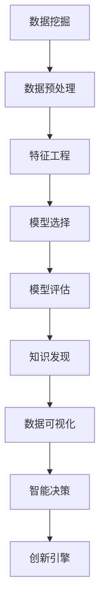

                 

# 知识发现引擎：推动创新引擎的全速运转

> 关键词：知识发现引擎, 数据挖掘, 数据科学, 机器学习, 大数据, 数据可视化, 智能决策, 创新引擎

## 1. 背景介绍

### 1.1 问题由来
在当前快速变化的时代，企业面临着前所未有的竞争压力，只有通过不断创新才能保持竞争力。数据科学和人工智能(AI)技术的迅猛发展为企业的创新提供了强大的支持，其中，知识发现引擎(Knowledge Discovery Engine, KDE)作为数据驱动的关键技术，正在成为推动创新引擎全速运转的驱动力。

知识发现引擎是一种基于数据挖掘和机器学习的技术，旨在从大规模数据中挖掘出隐含的知识和模式，为企业的战略决策、产品研发、市场营销等领域提供科学依据。近年来，随着大数据和AI技术的成熟，知识发现引擎的应用领域不断扩展，覆盖了金融、零售、医疗、教育等多个行业。

### 1.2 问题核心关键点
知识发现引擎的核心在于通过数据挖掘和机器学习技术，从海量数据中提取出有价值的知识，帮助企业洞察市场趋势、优化产品设计、提升用户体验、增加收入和利润。其中，数据挖掘是知识发现引擎的核心，涉及到了数据预处理、特征工程、模型选择和评估等多个环节。机器学习则在此基础上，使用算法模型进行预测和分类，从而实现知识的自动化发现。

知识发现引擎具有以下关键特点：
- **数据驱动**：知识发现引擎依赖于大规模数据，通过数据驱动的方式发现知识。
- **自动化**：利用机器学习算法实现知识的自动化发现，减少了人工干预的复杂性。
- **实时性**：能够实时处理和分析数据，快速响应市场变化。
- **可解释性**：能够解释模型的发现过程和结果，帮助企业理解背后原因。
- **预测性**：利用历史数据进行预测和分类，为未来的决策提供参考。

### 1.3 问题研究意义
研究知识发现引擎对于企业创新具有重要意义：
- **提升决策质量**：基于数据驱动的决策方式，能够提供更为客观、科学的依据，提升决策质量。
- **优化产品设计**：通过挖掘用户反馈和行为数据，优化产品功能和用户体验，增加用户满意度。
- **市场洞察**：快速分析市场趋势和用户需求，及时调整市场策略，抢占市场先机。
- **降低成本**：利用知识发现引擎优化运营和供应链管理，降低运营成本，提高效率。
- **创新驱动**：提供数据分析和挖掘服务，驱动企业的技术创新和产品迭代。

## 2. 核心概念与联系

### 2.1 核心概念概述

为更好地理解知识发现引擎，本节将介绍几个密切相关的核心概念：

- **数据挖掘(Data Mining)**：通过自动化和半自动化的方式，从大规模数据中挖掘出有价值的信息和知识的过程。
- **知识发现(Knowledge Discovery)**：基于数据挖掘结果，进一步提炼出可操作的、具有商业价值的知识的过程。
- **机器学习(Machine Learning)**：通过训练数据，使算法模型能够对新数据进行预测和分类，是知识发现引擎的核心技术之一。
- **数据可视化(Data Visualization)**：将数据转换为图形、图表等可视化的形式，帮助企业更好地理解和解读数据。
- **智能决策(Intelligent Decision Making)**：结合业务规则和机器学习模型，进行自动化决策。
- **创新引擎(Innovation Engine)**：利用数据科学和人工智能技术，驱动企业创新过程，提升企业竞争力。

这些核心概念之间的逻辑关系可以通过以下Mermaid流程图来展示：



这个流程图展示了一个典型的知识发现流程：

1. 从原始数据开始，经过数据预处理，提取出有意义的特征。
2. 选择合适的模型进行训练和评估。
3. 基于模型发现的知识，进一步提炼成可操作的商业知识。
4. 将知识可视化，帮助业务人员理解和应用。
5. 利用知识指导智能决策，推动企业创新。

## 3. 核心算法原理 & 具体操作步骤
### 3.1 算法原理概述

知识发现引擎的核心算法基于数据挖掘和机器学习，旨在从大规模数据中发现隐含的知识和模式。其中，常用的数据挖掘算法包括关联规则挖掘、聚类分析、分类算法等。机器学习算法则包括回归、分类、聚类、神经网络等。

知识发现引擎的一般流程包括：
1. **数据预处理**：清洗、转换、归一化原始数据，准备后续分析和挖掘。
2. **特征提取**：从原始数据中提取出有意义的特征，供机器学习模型使用。
3. **模型训练**：选择适当的机器学习模型，并使用训练数据进行训练。
4. **模型评估**：评估模型的性能，选择最优模型。
5. **知识发现**：利用训练好的模型，从测试数据中挖掘出知识。
6. **知识可视化**：将发现的知识可视化，供业务人员理解和应用。

### 3.2 算法步骤详解

下面以分类算法为例，详细讲解知识发现引擎的实现步骤：

**Step 1: 数据预处理**

1. 数据清洗：去除噪声、缺失值和异常值，确保数据质量。
2. 数据归一化：将不同尺度的特征归一化到相同范围，提高模型性能。
3. 特征选择：选择有意义的特征，减少数据维度。

**Step 2: 特征提取**

1. 特征工程：对数据进行特征提取和构造，生成新的特征。
2. 特征降维：使用PCA等方法对高维特征进行降维，减少计算量。
3. 特征编码：将特征转换为数值型数据，供机器学习模型使用。

**Step 3: 模型训练**

1. 选择算法：选择合适的分类算法，如决策树、随机森林、支持向量机等。
2. 数据划分：将数据划分为训练集和测试集，供模型训练和评估使用。
3. 训练模型：使用训练数据训练分类模型。
4. 模型调优：调整模型参数，提升模型性能。

**Step 4: 模型评估**

1. 选择指标：选择适当的评估指标，如准确率、召回率、F1-score等。
2. 交叉验证：使用交叉验证方法评估模型性能，防止过拟合。
3. 模型选择：选择最优模型，准备进一步应用。

**Step 5: 知识发现**

1. 测试数据：使用测试数据对模型进行测试。
2. 预测结果：利用模型对新数据进行预测。
3. 知识提炼：将预测结果提炼成可操作的商业知识。

**Step 6: 知识可视化**

1. 数据可视化：使用可视化工具将知识转换为图形、图表等形式。
2. 数据解读：解读可视化结果，提供业务洞察。

### 3.3 算法优缺点

知识发现引擎具有以下优点：
1. **自动化程度高**：利用机器学习算法实现知识的自动化发现，减少了人工干预的复杂性。
2. **泛化能力强**：能够从大规模数据中挖掘出普遍适用的知识，具有广泛的适用性。
3. **可解释性强**：通过可视化工具，能够清晰地展示模型发现的知识，便于理解和应用。
4. **实时性**：能够实时处理和分析数据，快速响应市场变化。
5. **预测能力强**：利用历史数据进行预测和分类，为未来的决策提供参考。

同时，知识发现引擎也存在以下缺点：
1. **数据质量要求高**：原始数据的准确性和完整性对结果有直接影响，数据清洗和预处理是关键。
2. **计算资源消耗大**：知识发现涉及到大规模数据的处理和分析，计算资源消耗较大。
3. **模型选择复杂**：需要根据具体问题和数据类型选择合适的算法，选择不当会导致模型性能下降。
4. **结果解读难度大**：模型发现的知识往往复杂多样，需要专业知识进行解读。
5. **业务理解要求高**：业务人员需要对知识发现的结果有深入理解，才能有效地应用于实际业务。

### 3.4 算法应用领域

知识发现引擎的应用领域非常广泛，涵盖了多个行业：

- **金融**：利用知识发现引擎进行风险评估、信用评分、股票预测等，提升金融决策的科学性和准确性。
- **零售**：通过挖掘消费者行为数据，优化产品推荐、库存管理、定价策略，提升销售效率和客户满意度。
- **医疗**：利用医疗数据进行疾病预测、药物发现、治疗方案优化，提升医疗服务质量和效率。
- **教育**：通过分析学生学习数据，优化教学内容和方式，提升教学效果和学习体验。
- **制造业**：利用生产数据进行质量控制、设备维护、供应链管理，提升生产效率和产品质量。
- **交通**：通过分析交通数据，优化交通流、降低拥堵，提升出行体验。
- **能源**：利用能源数据进行需求预测、优化调度，提升能源利用效率和安全性。

## 4. 数学模型和公式 & 详细讲解  
### 4.1 数学模型构建

知识发现引擎的数学模型构建主要涉及分类、回归、聚类等多个领域。这里以分类算法为例，介绍基本的数学模型构建过程。

假设我们有一组训练数据 $\{(x_i,y_i)\}_{i=1}^n$，其中 $x_i \in \mathcal{X}$ 为特征向量，$y_i \in \{0,1\}$ 为标签。我们的目标是找到一个分类器 $f(x)$，使得 $f(x)$ 能够准确地预测新数据点的标签。

假设分类器 $f(x)$ 为线性分类器，形式为 $f(x) = \mathbf{w} \cdot x + b$，其中 $\mathbf{w} \in \mathbb{R}^d$ 为权重向量，$b \in \mathbb{R}$ 为偏置项。我们的目标是最小化分类误差，即：

$$
\min_{\mathbf{w}, b} \frac{1}{n} \sum_{i=1}^n \mathbb{I}(y_i \neq f(x_i))
$$

其中 $\mathbb{I}$ 为示性函数。

使用逻辑回归模型，我们可将上述问题转化为求解线性回归问题，使用梯度下降等优化算法求解：

$$
\mathbf{w}^* = \arg\min_{\mathbf{w}} \frac{1}{n} \sum_{i=1}^n \log(1 + e^{- y_i \cdot (\mathbf{w} \cdot x_i + b)})
$$

通过求解上述优化问题，我们可以得到最优的权重向量 $\mathbf{w}^*$，从而构建分类器 $f(x) = \mathbf{w}^* \cdot x + b^*$。

### 4.2 公式推导过程

以下是逻辑回归模型的详细推导过程：

首先，我们定义损失函数 $L(\mathbf{w}, b)$：

$$
L(\mathbf{w}, b) = -\frac{1}{n} \sum_{i=1}^n [y_i \log \sigma(\mathbf{w} \cdot x_i + b) + (1-y_i) \log (1 - \sigma(\mathbf{w} \cdot x_i + b))]
$$

其中 $\sigma(z) = \frac{1}{1 + e^{-z}}$ 为sigmoid函数，将线性组合 $z = \mathbf{w} \cdot x_i + b$ 映射到 $(0,1)$ 区间，表示概率。

接下来，我们通过梯度下降法求解最优的 $\mathbf{w}$ 和 $b$：

$$
\mathbf{w} \leftarrow \mathbf{w} - \eta \frac{1}{n} \sum_{i=1}^n (y_i - \sigma(\mathbf{w} \cdot x_i + b)) x_i
$$

$$
b \leftarrow b - \eta \frac{1}{n} \sum_{i=1}^n (y_i - \sigma(\mathbf{w} \cdot x_i + b))
$$

其中 $\eta$ 为学习率，控制每次更新的步长。

通过上述推导，我们得到了逻辑回归模型的参数更新公式。使用这个公式，我们可以通过梯度下降等优化算法，逐步逼近最优参数，构建分类器。

### 4.3 案例分析与讲解

以医疗数据中的疾病预测为例，我们演示如何使用知识发现引擎进行分类。

假设我们有一组医疗数据 $\{(x_i, y_i)\}_{i=1}^n$，其中 $x_i$ 为病人的各种检查结果（如血压、血糖、胆固醇等），$y_i \in \{0,1\}$ 为是否患有某种疾病。我们的目标是根据病人的检查结果，预测其是否患有该疾病。

我们使用逻辑回归模型进行训练，具体步骤如下：

1. **数据预处理**：清洗和归一化数据，去除异常值和缺失值。
2. **特征提取**：从原始数据中提取出有意义的特征，如血压、血糖、胆固醇等。
3. **模型训练**：使用逻辑回归模型对训练数据进行训练，得到最优的权重向量 $\mathbf{w}^*$ 和偏置项 $b^*$。
4. **模型评估**：使用测试数据对模型进行评估，计算准确率、召回率、F1-score等指标。
5. **知识发现**：将训练好的模型应用于新数据，预测病人是否患有该疾病。
6. **知识可视化**：使用可视化工具展示模型发现的知识，如ROC曲线、混淆矩阵等。

通过上述步骤，我们利用知识发现引擎，从医疗数据中挖掘出疾病预测的模型，并提供了可视化的结果，帮助医生进行疾病诊断和治疗。

## 5. 项目实践：代码实例和详细解释说明
### 5.1 开发环境搭建

在进行知识发现引擎实践前，我们需要准备好开发环境。以下是使用Python进行Scikit-learn开发的环境配置流程：

1. 安装Anaconda：从官网下载并安装Anaconda，用于创建独立的Python环境。

2. 创建并激活虚拟环境：
```bash
conda create -n sklearn-env python=3.8 
conda activate sklearn-env
```

3. 安装Scikit-learn：从官网获取对应的安装命令。例如：
```bash
pip install -U scikit-learn
```

4. 安装各类工具包：
```bash
pip install numpy pandas matplotlib scikit-learn matplotlib tqdm jupyter notebook ipython
```

完成上述步骤后，即可在`sklearn-env`环境中开始知识发现引擎的实践。

### 5.2 源代码详细实现

下面以信用评分为例，给出使用Scikit-learn进行逻辑回归模型训练的代码实现。

首先，导入必要的库：

```python
from sklearn.datasets import fetch_california_housing
from sklearn.model_selection import train_test_split
from sklearn.linear_model import LogisticRegression
from sklearn.metrics import accuracy_score, confusion_matrix
import matplotlib.pyplot as plt
```

然后，加载数据集并划分训练集和测试集：

```python
housing = fetch_california_housing()
X = housing.data
y = housing.target
X_train, X_test, y_train, y_test = train_test_split(X, y, test_size=0.3, random_state=42)
```

接着，定义并训练逻辑回归模型：

```python
model = LogisticRegression(max_iter=1000)
model.fit(X_train, y_train)
```

最后，在测试集上评估模型性能：

```python
y_pred = model.predict(X_test)
accuracy = accuracy_score(y_test, y_pred)
conf_matrix = confusion_matrix(y_test, y_pred)
print(f"Accuracy: {accuracy:.2f}")
print(f"Confusion Matrix:\n{conf_matrix}")
```

完整代码如下：

```python
from sklearn.datasets import fetch_california_housing
from sklearn.model_selection import train_test_split
from sklearn.linear_model import LogisticRegression
from sklearn.metrics import accuracy_score, confusion_matrix
import matplotlib.pyplot as plt

housing = fetch_california_housing()
X = housing.data
y = housing.target
X_train, X_test, y_train, y_test = train_test_split(X, y, test_size=0.3, random_state=42)

model = LogisticRegression(max_iter=1000)
model.fit(X_train, y_train)

y_pred = model.predict(X_test)
accuracy = accuracy_score(y_test, y_pred)
conf_matrix = confusion_matrix(y_test, y_pred)
print(f"Accuracy: {accuracy:.2f}")
print(f"Confusion Matrix:\n{conf_matrix}")
```

### 5.3 代码解读与分析

让我们再详细解读一下关键代码的实现细节：

**fetch_california_housing函数**：
- 从Scikit-learn库中加载加州房价数据集，该数据集包含20个特征，目标变量为房价是否大于平均房价。

**train_test_split函数**：
- 将数据集划分为训练集和测试集，比例为70%训练，30%测试。

**LogisticRegression模型**：
- 使用Scikit-learn库中的LogisticRegression模型，设置最大迭代次数为1000，防止过拟合。

**fit函数**：
- 使用训练集数据训练逻辑回归模型。

**predict函数**：
- 在测试集上使用训练好的模型进行预测。

**accuracy_score和confusion_matrix函数**：
- 计算模型在测试集上的准确率和混淆矩阵。

**代码输出**：
- 打印模型的准确率和混淆矩阵，展示了模型的性能。

## 6. 实际应用场景
### 6.1 金融风险评估

金融领域中，信用评分和风险评估是重要的决策依据。通过知识发现引擎，银行和金融机构能够从客户的交易记录、信用历史等数据中，挖掘出客户的信用风险特征，预测客户的违约概率，帮助银行制定贷款审批策略。

具体而言，银行可以收集客户的各种历史数据，如收入、还款记录、消费记录等，并使用知识发现引擎进行分类和预测。例如，可以使用逻辑回归模型预测客户的违约概率，结合信用评分，制定更加精细的贷款审批策略。

### 6.2 零售个性化推荐

在零售领域，个性化推荐是提升客户满意度和销售转化率的重要手段。通过知识发现引擎，电商平台能够从用户的浏览、购买、评分等行为数据中，挖掘出用户的兴趣偏好，为用户推荐个性化的商品。

具体而言，电商平台可以收集用户的各种行为数据，如浏览历史、购买记录、评分等，并使用知识发现引擎进行分类和聚类。例如，可以使用协同过滤算法或矩阵分解算法，为用户推荐类似商品或相关商品，提升用户的购物体验。

### 6.3 医疗疾病预测

医疗领域中，疾病预测和诊断是关键任务。通过知识发现引擎，医疗机构能够从患者的各种检查结果、病历记录等数据中，挖掘出疾病的早期特征，预测患者的疾病风险，提供个性化的治疗方案。

具体而言，医疗机构可以收集患者的各种检查结果，如血压、血糖、胆固醇等，并使用知识发现引擎进行分类和预测。例如，可以使用支持向量机或随机森林模型，预测患者是否患有某种疾病，并根据预测结果提供个性化的治疗方案。

### 6.4 未来应用展望

随着知识发现引擎的不断发展，其应用领域将不断扩展，推动各行各业的智能化转型。

在智慧城市领域，知识发现引擎能够从城市中的各种数据中，挖掘出交通流量、能源消耗等关键信息，优化城市管理，提升居民生活质量。例如，可以使用聚类分析算法，分析城市中的交通流量数据，优化交通信号灯设置，减少交通拥堵。

在工业制造领域，知识发现引擎能够从生产数据中，挖掘出设备故障、生产效率等关键信息，优化生产流程，提升生产效率。例如，可以使用异常检测算法，分析生产数据，识别设备故障，预测生产效率。

在农业领域，知识发现引擎能够从气象数据、土壤数据等中，挖掘出种植方案、施肥方案等关键信息，优化农业生产，提升农产品质量和产量。例如，可以使用回归分析算法，分析气象数据，预测作物产量，制定科学的种植方案。

## 7. 工具和资源推荐
### 7.1 学习资源推荐

为了帮助开发者系统掌握知识发现引擎的理论基础和实践技巧，这里推荐一些优质的学习资源：

1. 《数据挖掘导论》（《Introduction to Data Mining》）：由J. Han等人所著，系统介绍了数据挖掘的基本概念、技术和应用。
2. 《机器学习》（《Pattern Recognition and Machine Learning》）：由Christopher M. Bishop所著，介绍了机器学习的基本概念、算法和应用。
3. 《Python数据科学手册》（《Python Data Science Handbook》）：由Jake VanderPlas所著，介绍了Python在数据科学中的各种工具和库。
4. Kaggle：全球最大的数据科学竞赛平台，提供了丰富的数据集和竞赛，帮助开发者实践和提升技能。
5. Coursera和edX：提供了多个与数据科学和机器学习相关的在线课程，包括课程视频、讲义和作业。

通过对这些资源的学习实践，相信你一定能够快速掌握知识发现引擎的理论基础和实践技巧，并用于解决实际的商业问题。

### 7.2 开发工具推荐

高效的开发离不开优秀的工具支持。以下是几款用于知识发现引擎开发的常用工具：

1. Python：作为数据科学和机器学习的主要编程语言，Python拥有丰富的科学计算库和数据处理工具，如NumPy、Pandas、Scikit-learn等。
2. Scikit-learn：基于Python的开源机器学习库，提供了多种分类、回归、聚类等算法，易于使用和部署。
3. R语言：作为数据科学和统计分析的主要工具，R语言拥有丰富的统计分析和数据处理库，如ggplot2、dplyr等。
4. Weights & Biases：模型训练的实验跟踪工具，可以记录和可视化模型训练过程中的各项指标，方便对比和调优。
5. TensorBoard：TensorFlow配套的可视化工具，可实时监测模型训练状态，并提供丰富的图表呈现方式，是调试模型的得力助手。

合理利用这些工具，可以显著提升知识发现引擎的开发效率，加快创新迭代的步伐。

### 7.3 相关论文推荐

知识发现引擎的发展源于学界的持续研究。以下是几篇奠基性的相关论文，推荐阅读：

1. J. Han和M. Kamber所著的《数据挖掘：概念与技术》（《Data Mining: Concepts and Techniques》）：介绍了数据挖掘的基本概念、技术和应用，是数据科学领域的经典教材。
2. Tom Mitchell所著的《机器学习》（《Machine Learning》）：介绍了机器学习的基本概念、算法和应用，是机器学习领域的经典教材。
3. Yann LeCun等人所著的《深度学习》（《Deep Learning》）：介绍了深度学习的基本概念、算法和应用，是深度学习领域的经典教材。
4. J. R. Quinlan所著的《C4.5: Programs for Machine Learning》：介绍了决策树算法及其应用，是机器学习领域的经典教材。
5. R. A. R. Ferraz和F. H. C. Crivellaro所著的《数据挖掘与统计学习》（《Data Mining and Statistical Learning》）：介绍了数据挖掘和统计学习的各种技术和应用，是数据科学领域的经典教材。

这些论文代表了大数据和机器学习技术的发展脉络。通过学习这些前沿成果，可以帮助研究者把握学科前进方向，激发更多的创新灵感。

## 8. 总结：未来发展趋势与挑战

### 8.1 总结

本文对知识发现引擎进行了全面系统的介绍。首先阐述了知识发现引擎的背景和意义，明确了其在企业创新中的重要价值。其次，从原理到实践，详细讲解了知识发现引擎的实现过程，包括数据预处理、特征工程、模型训练、模型评估、知识发现和知识可视化等多个环节。同时，本文还探讨了知识发现引擎在金融、零售、医疗等多个行业的应用，展示了其在推动企业创新中的重要作用。

通过本文的系统梳理，可以看到，知识发现引擎是数据科学和机器学习技术的集大成者，能够从大规模数据中挖掘出有价值的知识，为企业的创新决策提供科学依据。未来，随着技术的发展，知识发现引擎的应用将更加广泛，对企业创新的推动作用将更加显著。

### 8.2 未来发展趋势

展望未来，知识发现引擎的发展趋势如下：

1. **自动化程度更高**：利用自动化机器学习(AutoML)技术，实现数据预处理、特征选择、模型训练等自动化，减少人工干预的复杂性。
2. **模型更加复杂**：随着深度学习技术的发展，知识发现引擎将更多地使用神经网络等复杂模型，提升预测和分类能力。
3. **数据来源更加多样**：未来的知识发现引擎将不仅局限于结构化数据，还将涵盖半结构化数据、非结构化数据等多种数据类型。
4. **算法更加多样化**：除了传统的分类、回归、聚类等算法，未来将涌现更多先进的算法，如深度学习、强化学习、因果推理等。
5. **可解释性更强**：未来的知识发现引擎将更多地引入可解释性技术，帮助业务人员理解和应用知识发现结果。
6. **实时性更强**：未来的知识发现引擎将更多地利用流数据技术，实现实时数据处理和分析，提升决策响应速度。
7. **跨领域应用更加广泛**：未来的知识发现引擎将更多地应用于跨领域应用，如医疗与金融、工业与农业等。

### 8.3 面临的挑战

尽管知识发现引擎已经取得了瞩目成就，但在迈向更加智能化、普适化应用的过程中，它仍面临着诸多挑战：

1. **数据质量要求高**：原始数据的准确性和完整性对结果有直接影响，数据清洗和预处理是关键。
2. **计算资源消耗大**：知识发现涉及到大规模数据的处理和分析，计算资源消耗较大。
3. **模型选择复杂**：需要根据具体问题和数据类型选择合适的算法，选择不当会导致模型性能下降。
4. **结果解读难度大**：模型发现的知识往往复杂多样，需要专业知识进行解读。
5. **业务理解要求高**：业务人员需要对知识发现的结果有深入理解，才能有效地应用于实际业务。
6. **隐私和安全问题**：数据隐私和安全问题日益突出，需要采取多种措施保障数据安全和隐私保护。

### 8.4 研究展望

面向未来，知识发现引擎的研究展望如下：

1. **自动化机器学习技术**：结合自动化机器学习(AutoML)和强化学习技术，实现知识发现的自动化和智能化。
2. **跨领域知识发现**：利用多模态数据融合技术，实现跨领域知识发现和应用。
3. **深度学习和神经网络**：利用深度学习技术，提升知识发现引擎的预测和分类能力。
4. **可解释性技术**：引入可解释性技术，如LIME、SHAP等，提升知识发现结果的可解释性和可信度。
5. **实时数据处理**：利用流数据处理技术，实现实时数据挖掘和分析。
6. **隐私保护技术**：利用隐私保护技术，如差分隐私、联邦学习等，保障数据隐私和安全。

这些研究方向的探索，必将引领知识发现引擎技术迈向更高的台阶，为构建智能决策系统和推动企业创新提供更为坚实的技术基础。面向未来，知识发现引擎需要与其他人工智能技术进行更深入的融合，如自然语言处理、计算机视觉等，多路径协同发力，共同推动人工智能技术的发展。只有勇于创新、敢于突破，才能不断拓展知识发现引擎的边界，让智能技术更好地造福人类社会。

## 9. 附录：常见问题与解答

**Q1：知识发现引擎是否适用于所有行业？**

A: 知识发现引擎在大多数行业中都能取得较好的效果，特别是在数据量大、业务复杂度高的领域。但对于一些特殊行业，如医疗、法律等，知识发现引擎需要进一步针对具体领域进行调整和优化，才能获得最佳效果。

**Q2：知识发现引擎的核心技术是什么？**

A: 知识发现引擎的核心技术主要包括以下几个方面：
1. **数据预处理**：清洗、转换、归一化原始数据。
2. **特征提取**：从原始数据中提取出有意义的特征。
3. **模型训练**：选择合适的机器学习模型，并使用训练数据进行训练。
4. **模型评估**：评估模型的性能，选择最优模型。
5. **知识发现**：利用训练好的模型，从测试数据中挖掘出知识。
6. **知识可视化**：将发现的知识可视化，供业务人员理解和应用。

**Q3：知识发现引擎在实际应用中面临的主要挑战是什么？**

A: 知识发现引擎在实际应用中面临的主要挑战包括：
1. **数据质量要求高**：原始数据的准确性和完整性对结果有直接影响，数据清洗和预处理是关键。
2. **计算资源消耗大**：知识发现涉及到大规模数据的处理和分析，计算资源消耗较大。
3. **模型选择复杂**：需要根据具体问题和数据类型选择合适的算法，选择不当会导致模型性能下降。
4. **结果解读难度大**：模型发现的知识往往复杂多样，需要专业知识进行解读。
5. **业务理解要求高**：业务人员需要对知识发现的结果有深入理解，才能有效地应用于实际业务。
6. **隐私和安全问题**：数据隐私和安全问题日益突出，需要采取多种措施保障数据安全和隐私保护。

**Q4：如何提升知识发现引擎的自动化程度？**

A: 提升知识发现引擎的自动化程度，可以采取以下几种方式：
1. **自动化特征工程**：利用特征选择、降维等技术，自动选择最优特征。
2. **自动化模型训练**：利用AutoML技术，自动选择合适的模型和参数。
3. **自动化模型评估**：利用自动化评估工具，自动评估模型性能和选择最优模型。
4. **自动化结果解读**：利用可解释性技术，自动解读知识发现的结果，帮助业务人员理解。

**Q5：知识发现引擎的未来发展方向是什么？**

A: 知识发现引擎的未来发展方向包括：
1. **自动化机器学习**：结合自动化机器学习(AutoML)和强化学习技术，实现知识发现的自动化和智能化。
2. **跨领域知识发现**：利用多模态数据融合技术，实现跨领域知识发现和应用。
3. **深度学习和神经网络**：利用深度学习技术，提升知识发现引擎的预测和分类能力。
4. **可解释性技术**：引入可解释性技术，如LIME、SHAP等，提升知识发现结果的可解释性和可信度。
5. **实时数据处理**：利用流数据处理技术，实现实时数据挖掘和分析。
6. **隐私保护技术**：利用隐私保护技术，如差分隐私、联邦学习等，保障数据隐私和安全。

这些研究方向的探索，必将引领知识发现引擎技术迈向更高的台阶，为构建智能决策系统和推动企业创新提供更为坚实的技术基础。面向未来，知识发现引擎需要与其他人工智能技术进行更深入的融合，如自然语言处理、计算机视觉等，多路径协同发力，共同推动人工智能技术的发展。只有勇于创新、敢于突破，才能不断拓展知识发现引擎的边界，让智能技术更好地造福人类社会。

---

作者：禅与计算机程序设计艺术 / Zen and the Art of Computer Programming

