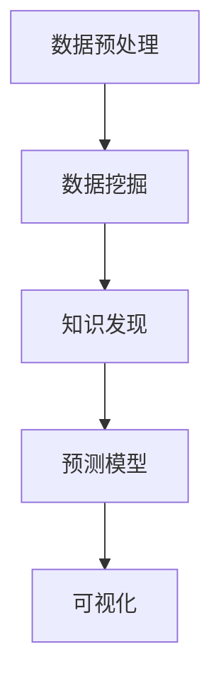

                 

# 知识发现引擎：知识创新的强大引擎

> 关键词：知识发现, 数据挖掘, 数据驱动决策, 人工智能, 机器学习, 预测模型

## 1. 背景介绍

### 1.1 问题由来

在当今这个信息爆炸的时代，数据已经成为驱动经济和社会发展的重要资源。如何从海量数据中发现有价值的信息和知识，成为各个领域亟待解决的问题。大数据技术的发展为数据处理带来了新的机遇，而知识发现引擎（Knowledge Discovery Engine, KDE）则成为了连接数据和知识的关键工具。

知识发现引擎利用机器学习和数据挖掘技术，通过对数据的分析和挖掘，自动发现数据中的知识模式和规律，帮助企业做出更明智的决策，提升业务运营效率和创新能力。从科学研究到商业应用，知识发现引擎在各个领域都有着广泛的应用。

### 1.2 问题核心关键点

知识发现引擎的核心目标是从数据中提取有价值的信息和知识，具体实现包括以下几个关键点：

- **数据预处理**：清洗、归一化、特征工程等，为后续分析做准备。
- **数据探索与可视化**：利用统计学方法和可视化工具，发现数据中的异常、趋势和模式。
- **模型训练与评估**：构建预测模型并进行训练和评估，通过优化模型参数，提高预测准确性。
- **知识表示与应用**：将提取的知识转化为结构化的知识表示，供决策使用。

知识发现引擎的核心原理是数据驱动的决策支持，通过对数据的分析和建模，自动发现数据中的知识模式，为企业和决策者提供支持。

### 1.3 问题研究意义

研究知识发现引擎的意义重大，主要体现在以下几个方面：

1. **提升决策质量**：通过从数据中提取的知识，决策者能够更加客观、全面地分析问题，做出更科学的决策。
2. **增强企业竞争力**：知识发现引擎能够帮助企业快速获取市场信息，洞察竞争动态，提升业务运营效率和创新能力。
3. **驱动科学研究**：在科学研究中，知识发现引擎可以自动挖掘数据中的新知识和新模式，推动科学发现和理论创新。
4. **促进社会进步**：知识发现引擎能够应用于公共政策、健康医疗等领域，为社会进步提供数据支持。

## 2. 核心概念与联系

### 2.1 核心概念概述

为了更好地理解知识发现引擎的原理和应用，本节将介绍几个关键概念及其联系：

- **数据预处理（Data Preprocessing）**：清洗、归一化、特征工程等，为后续分析做准备。
- **数据挖掘（Data Mining）**：利用机器学习算法和统计方法，从数据中挖掘出有意义的模式和规律。
- **知识发现（Knowledge Discovery）**：通过数据挖掘得到的结果，提取有价值的信息和知识，供决策使用。
- **预测模型（Predictive Model）**：用于预测未来事件或结果的模型，常用的包括线性回归、决策树、随机森林等。
- **可视化（Visualization）**：将数据和分析结果以图形化的形式展现出来，帮助决策者更好地理解数据和结果。

这些核心概念之间的逻辑关系可以通过以下Mermaid流程图来展示：



这个流程图展示了下知识发现引擎的核心流程：

1. 数据预处理：对原始数据进行清洗和准备，为后续分析奠定基础。
2. 数据挖掘：利用机器学习算法从数据中提取知识模式。
3. 知识发现：从数据挖掘的结果中提取有价值的信息和知识。
4. 预测模型：构建预测模型，用于未来事件的预测。
5. 可视化：将数据和分析结果可视化，帮助决策者理解。

## 3. 核心算法原理 & 具体操作步骤
### 3.1 算法原理概述

知识发现引擎的算法原理主要基于数据挖掘和机器学习技术。其核心思想是：通过对数据的分析和建模，自动发现数据中的知识模式和规律，为决策提供支持。

形式化地，假设我们有数据集 $D=\{(x_i, y_i)\}_{i=1}^N$，其中 $x_i$ 为输入特征，$y_i$ 为输出标签。知识发现引擎的目标是找到一个模型 $f$，使得 $f(x_i)$ 能够尽可能地逼近 $y_i$。

常见的知识发现方法包括回归分析、分类、聚类、关联规则挖掘等。具体步骤如下：

1. **数据预处理**：对原始数据进行清洗、归一化、特征选择等处理，为后续分析做准备。
2. **数据探索**：利用统计学方法和可视化工具，发现数据中的异常、趋势和模式。
3. **模型训练**：构建预测模型并进行训练，通过优化模型参数，提高预测准确性。
4. **模型评估**：使用交叉验证等方法评估模型性能，判断模型是否过拟合或欠拟合。
5. **知识表示**：将提取的知识转化为结构化的知识表示，供决策使用。

### 3.2 算法步骤详解

知识发现引擎的算法步骤主要包括：

1. **数据预处理**：清洗、归一化、特征工程等，为后续分析做准备。
2. **数据探索**：利用统计学方法和可视化工具，发现数据中的异常、趋势和模式。
3. **模型训练**：构建预测模型并进行训练，通过优化模型参数，提高预测准确性。
4. **模型评估**：使用交叉验证等方法评估模型性能，判断模型是否过拟合或欠拟合。
5. **知识表示**：将提取的知识转化为结构化的知识表示，供决策使用。

### 3.3 算法优缺点

知识发现引擎的主要优点包括：

- **自动化**：自动化地从数据中发现知识和模式，减少人工干预。
- **客观性**：利用机器学习算法，结果更加客观、可靠。
- **高效性**：在处理大规模数据时，效率较高。

同时，该方法也存在一些局限性：

- **数据质量要求高**：数据预处理和特征工程要求较高，需要高质量的数据输入。
- **模型解释性不足**：机器学习模型的解释性较差，难以理解其内部工作机制。
- **领域依赖性强**：知识发现引擎需要针对特定领域进行优化，效果因领域不同而异。

### 3.4 算法应用领域

知识发现引擎在多个领域有着广泛的应用，例如：

- **商业智能（Business Intelligence, BI）**：利用知识发现引擎分析销售数据、客户行为等，帮助企业制定策略。
- **金融风控**：通过分析历史交易数据，构建预测模型，防范金融风险。
- **医疗诊断**：利用知识发现引擎分析医疗数据，辅助诊断和治疗决策。
- **科研发现**：在科学研究中，知识发现引擎可以自动挖掘数据中的新知识和新模式，推动科学发现和理论创新。
- **公共政策**：利用知识发现引擎分析公共数据，辅助政策制定和优化。

这些领域的应用展示了知识发现引擎在数据驱动决策中的重要作用。

## 4. 数学模型和公式 & 详细讲解  
### 4.1 数学模型构建

本节将使用数学语言对知识发现引擎的原理进行更加严格的刻画。

假设我们有数据集 $D=\{(x_i, y_i)\}_{i=1}^N$，其中 $x_i \in \mathbb{R}^d$，$y_i \in \{0,1\}$。知识发现引擎的目标是找到一个模型 $f(x)$，使得 $f(x)$ 能够尽可能地逼近 $y_i$。

常用的知识发现方法包括线性回归、逻辑回归、决策树、随机森林等。以线性回归为例，模型可以表示为：

$$
f(x) = \theta^Tx
$$

其中 $\theta$ 为模型参数。模型的损失函数为均方误差：

$$
\ell(f(x),y) = \frac{1}{N}\sum_{i=1}^N (f(x_i) - y_i)^2
$$

模型的目标是最小化损失函数：

$$
\theta^* = \mathop{\arg\min}_{\theta} \ell(f(x),y)
$$

### 4.2 公式推导过程

以下我们以线性回归为例，推导损失函数及其梯度的计算公式。

假设模型 $f(x) = \theta^Tx$，则对于单个样本 $(x_i, y_i)$，模型的预测值为 $f(x_i) = \theta^Tx_i$，预测误差为 $\epsilon_i = f(x_i) - y_i$。

则损失函数为：

$$
\ell(f(x),y) = \frac{1}{N}\sum_{i=1}^N (\theta^Tx_i - y_i)^2
$$

模型的梯度为：

$$
\frac{\partial \ell(f(x),y)}{\partial \theta} = \frac{1}{N}\sum_{i=1}^N -2x_i(y_i - f(x_i))
$$

通过梯度下降等优化算法，微调模型参数 $\theta$，最小化损失函数。重复上述过程直至收敛，最终得到最优模型参数 $\theta^*$。

## 5. 项目实践：代码实例和详细解释说明
### 5.1 开发环境搭建

在进行知识发现引擎的实践前，我们需要准备好开发环境。以下是使用Python进行Scikit-Learn开发的环境配置流程：

1. 安装Anaconda：从官网下载并安装Anaconda，用于创建独立的Python环境。

2. 创建并激活虚拟环境：
```bash
conda create -n sklearn-env python=3.8 
conda activate sklearn-env
```

3. 安装Scikit-Learn：
```bash
conda install scikit-learn
```

4. 安装各类工具包：
```bash
pip install numpy pandas matplotlib seaborn scikit-learn jupyter notebook ipython
```

完成上述步骤后，即可在`sklearn-env`环境中开始知识发现引擎的开发实践。

### 5.2 源代码详细实现

这里我们以线性回归为例，使用Scikit-Learn库对数据进行知识发现实践。

首先，导入所需的库和数据集：

```python
import numpy as np
from sklearn.linear_model import LinearRegression
from sklearn.metrics import mean_squared_error
from sklearn.model_selection import train_test_split
import matplotlib.pyplot as plt

# 加载数据集
data = np.loadtxt('data.csv', delimiter=',')
X = data[:, :-1]
y = data[:, -1]
```

然后，对数据集进行训练和测试集划分：

```python
X_train, X_test, y_train, y_test = train_test_split(X, y, test_size=0.2, random_state=42)
```

接着，训练线性回归模型并进行预测：

```python
model = LinearRegression()
model.fit(X_train, y_train)
y_pred = model.predict(X_test)
```

最后，计算模型的均方误差并可视化预测结果：

```python
mse = mean_squared_error(y_test, y_pred)
plt.scatter(X_test, y_test, color='blue')
plt.plot(X_test, y_pred, color='red')
plt.title('Mean Squared Error: {:.2f}'.format(mse))
plt.show()
```

以上就是使用Scikit-Learn进行线性回归的完整代码实现。可以看到，通过Scikit-Learn库，知识发现引擎的实现变得非常简单高效。

### 5.3 代码解读与分析

让我们再详细解读一下关键代码的实现细节：

**数据加载和处理**：
- `np.loadtxt`函数用于加载文本数据，`delimiter`参数指定数据分隔符。
- `X`和`y`分别代表特征和标签，根据实际数据集进行调整。

**数据划分**：
- `train_test_split`函数用于将数据集划分为训练集和测试集。`test_size`参数指定测试集占总数据集的比例，`random_state`参数确保结果的可重复性。

**模型训练和预测**：
- `LinearRegression`类用于构建线性回归模型。
- `fit`方法用于训练模型，`X_train`和`y_train`为训练集数据。
- `predict`方法用于对测试集数据进行预测，`X_test`为测试集数据。

**结果评估和可视化**：
- `mean_squared_error`函数用于计算均方误差。
- `plt.scatter`和`plt.plot`函数用于绘制预测结果和原始数据的散点图和拟合曲线。

可以看到，Scikit-Learn库使得知识发现引擎的实现变得非常简单，开发者可以将更多精力放在数据处理、模型改进等高层逻辑上，而不必过多关注底层的实现细节。

当然，工业级的系统实现还需考虑更多因素，如模型的保存和部署、超参数的自动搜索、更灵活的任务适配层等。但核心的知识发现原理基本与此类似。

## 6. 实际应用场景
### 6.1 智能推荐系统

基于知识发现引擎的推荐系统，可以广泛应用于电商、视频、音乐等多个领域。通过分析用户的浏览、购买、评分等行为数据，推荐系统能够自动发现用户的兴趣偏好，生成个性化的推荐内容。

在技术实现上，可以收集用户的历史行为数据，将其作为训练样本，构建线性回归、逻辑回归等模型。模型训练完成后，对新用户输入的特征数据进行预测，生成推荐结果。推荐系统还可以实时监控用户行为，动态调整推荐策略，提高推荐效果。

### 6.2 风险控制系统

在金融领域，风险控制系统利用知识发现引擎分析交易数据，识别潜在的欺诈行为和异常交易，防范金融风险。

具体而言，可以收集交易历史数据，构建预测模型。模型训练完成后，对新交易数据进行预测，判断是否存在异常行为。一旦发现异常，系统立即采取措施，如冻结账户、追加审核等，以降低风险损失。

### 6.3 医疗诊断系统

在医疗领域，知识发现引擎可以用于辅助诊断和治疗决策。通过分析病人的病历、体检数据等，发现病情发展的趋势和规律，辅助医生制定治疗方案。

具体而言，可以收集病人的历史数据，构建预测模型。模型训练完成后，对新病人的数据进行预测，判断其病情发展的趋势和风险。医生可以根据预测结果，制定相应的治疗方案，提升诊疗效率和效果。

### 6.4 未来应用展望

随着知识发现引擎的不断发展，其在更多领域的应用前景广阔：

1. **智能制造**：利用知识发现引擎分析生产数据，优化生产流程，提高生产效率和质量。
2. **智能交通**：通过分析交通数据，优化交通信号控制，减少交通拥堵。
3. **智能家居**：利用知识发现引擎分析用户行为数据，优化家居设备控制，提升用户体验。
4. **智能教育**：通过分析学生的学习数据，发现学习规律，优化教学方法，提升教学效果。
5. **智能城市**：利用知识发现引擎分析城市数据，优化城市管理，提高城市治理水平。

这些领域的应用展示了知识发现引擎在数据驱动决策中的广泛潜力。

## 7. 工具和资源推荐
### 7.1 学习资源推荐

为了帮助开发者系统掌握知识发现引擎的理论基础和实践技巧，这里推荐一些优质的学习资源：

1. 《数据挖掘导论》系列教材：由数据挖掘领域的知名专家撰写，系统讲解了数据挖掘的基本概念、方法和应用。
2. CS229《机器学习》课程：斯坦福大学开设的机器学习明星课程，涵盖数据预处理、模型训练、评估等基本概念。
3. 《Python数据科学手册》书籍：介绍了Python在数据科学中的应用，包括数据处理、模型训练、结果可视化等。
4. Kaggle数据科学竞赛：通过参加Kaggle竞赛，可以在实践中提升数据挖掘和知识发现技能。
5. Scikit-Learn官方文档：Scikit-Learn库的官方文档，提供了丰富的学习资源和样例代码，是学习知识发现引擎的必备资料。

通过对这些资源的学习实践，相信你一定能够快速掌握知识发现引擎的精髓，并用于解决实际的NLP问题。

### 7.2 开发工具推荐

高效的开发离不开优秀的工具支持。以下是几款用于知识发现引擎开发的常用工具：

1. Python：开源的编程语言，功能强大，社区支持广泛，适合数据处理和机器学习任务。
2. Scikit-Learn：Python机器学习库，提供了丰富的模型训练和评估工具，简单易用。
3. R语言：适合统计分析和数据可视化任务，有丰富的数据挖掘库和可视化工具。
4. TensorFlow：Google主导的深度学习框架，适合大规模模型训练和部署。
5. Weights & Biases：模型训练的实验跟踪工具，可以记录和可视化模型训练过程中的各项指标，方便对比和调优。
6. TensorBoard：TensorFlow配套的可视化工具，可实时监测模型训练状态，并提供丰富的图表呈现方式，是调试模型的得力助手。

合理利用这些工具，可以显著提升知识发现引擎的开发效率，加快创新迭代的步伐。

### 7.3 相关论文推荐

知识发现引擎的研究源于学界的持续研究。以下是几篇奠基性的相关论文，推荐阅读：

1. "The Elements of Statistical Learning" by Hastie, Tibshirani and Friedman：介绍了统计学习的基本概念和方法，是数据挖掘领域的经典教材。
2. "Introduction to Statistical Learning with Applications in R" by Gareth James, Daniela Witten, Trevor Hastie and Robert Tibshirani：介绍了统计学习的基本概念和方法，适合实际应用中的学习。
3. "Pattern Recognition and Machine Learning" by Christopher Bishop：介绍了模式识别和机器学习的基本概念和方法，适合数据挖掘和知识发现的应用。

这些论文代表了大语言模型微调技术的发展脉络。通过学习这些前沿成果，可以帮助研究者把握学科前进方向，激发更多的创新灵感。

## 8. 总结：未来发展趋势与挑战
### 8.1 总结

本文对知识发现引擎进行了全面系统的介绍。首先阐述了知识发现引擎的背景和意义，明确了其在数据驱动决策中的重要作用。其次，从原理到实践，详细讲解了知识发现引擎的数学原理和关键步骤，给出了知识发现任务开发的完整代码实例。同时，本文还广泛探讨了知识发现引擎在各个领域的应用前景，展示了其广泛的应用潜力。此外，本文精选了知识发现引擎的相关学习资源，力求为读者提供全方位的技术指引。

通过本文的系统梳理，可以看到，知识发现引擎作为连接数据和知识的关键工具，在多个领域都有着广泛的应用。利用知识发现引擎，企业能够从数据中提取有价值的信息和知识，提升决策质量和运营效率，从而在激烈的市场竞争中占据优势。

### 8.2 未来发展趋势

展望未来，知识发现引擎将呈现以下几个发展趋势：

1. **自动化程度提高**：随着算法和工具的进步，知识发现引擎的自动化程度将不断提高，减少人工干预。
2. **多模态融合**：未来的知识发现引擎将能够处理更多模态的数据，如文本、图像、视频等，实现全面的数据分析。
3. **在线化部署**：知识发现引擎将越来越多地采用在线化部署方式，支持实时数据处理和分析。
4. **智能化决策支持**：未来的知识发现引擎将能够更好地理解用户需求，提供更加智能的决策支持。
5. **跨领域应用**：知识发现引擎将在更多领域得到应用，如智能制造、智能交通等，为各行各业带来变革性影响。

以上趋势凸显了知识发现引擎在数据驱动决策中的广阔前景。这些方向的探索发展，必将进一步提升数据驱动决策的能力，为各行各业带来更深层次的变革。

### 8.3 面临的挑战

尽管知识发现引擎已经取得了瞩目成就，但在迈向更加智能化、普适化应用的过程中，它仍面临着诸多挑战：

1. **数据质量要求高**：高质量的数据是知识发现引擎的基石，数据预处理和特征工程要求较高。
2. **模型解释性不足**：机器学习模型的解释性较差，难以理解其内部工作机制，难以满足某些领域的应用需求。
3. **领域依赖性强**：知识发现引擎需要针对特定领域进行优化，效果因领域不同而异。
4. **计算资源需求高**：大规模数据处理和模型训练需要高性能的计算资源，难以满足实际需求。
5. **伦理和隐私问题**：知识发现引擎涉及大量敏感数据，如何保护用户隐私和数据安全，成为重要挑战。

这些挑战需要学界和产业界的共同努力，通过技术进步和制度创新，克服知识发现引擎的局限性，推动其向更加智能化、普适化的方向发展。

### 8.4 研究展望

面向未来，知识发现引擎的研究需要在以下几个方面寻求新的突破：

1. **多模态数据处理**：探索多模态数据的处理方法，提高知识发现引擎的处理能力和应用范围。
2. **可解释性增强**：开发可解释性强的模型和算法，提高知识发现引擎的透明性和可信度。
3. **自动化程度提升**：研究自动化数据预处理和模型训练方法，减少人工干预，提升知识发现引擎的效率和准确性。
4. **实时化处理**：研究实时数据处理和分析方法，支持在线化部署和实时决策。
5. **跨领域应用**：推动知识发现引擎在更多领域的应用，解决不同领域的数据分析和知识发现问题。

这些研究方向的探索，必将引领知识发现引擎技术迈向更高的台阶，为各行各业带来更深层次的变革。

## 9. 附录：常见问题与解答
----------------------------------------------------------------

**Q1：知识发现引擎如何处理缺失值和异常值？**

A: 知识发现引擎通常使用数据预处理的方法来处理缺失值和异常值。对于缺失值，可以使用插值法、均值填充、回归预测等方法进行填补。对于异常值，可以使用删除法、替换法、离群点检测等方法进行处理。例如，可以使用z-score标准化方法将数据进行标准化处理，将异常值替换为均值或中位数。

**Q2：知识发现引擎在处理大规模数据时有哪些效率提升方法？**

A: 知识发现引擎在处理大规模数据时，可以采用以下效率提升方法：

1. 数据分块：将大规模数据划分为多个小规模数据块，并行处理，提高处理速度。
2. 分布式计算：利用多台计算机进行分布式计算，提高计算效率。
3. 内存优化：采用内存优化技术，如稀疏矩阵、向量压缩等，减少内存占用。
4. 算法优化：采用高效的算法和数据结构，提高算法效率。

**Q3：知识发现引擎在实际应用中需要注意哪些问题？**

A: 知识发现引擎在实际应用中需要注意以下问题：

1. 数据质量：确保数据的高质量和完整性，避免数据错误和噪声影响结果。
2. 模型选择：根据实际任务选择合适的模型，避免模型过拟合或欠拟合。
3. 结果解释：确保结果的可解释性和透明度，避免结果的误解和误用。
4. 隐私保护：保护用户隐私和数据安全，避免数据泄露和滥用。

**Q4：知识发现引擎在应用中如何提升用户交互体验？**

A: 知识发现引擎可以通过以下方法提升用户交互体验：

1. 交互式界面：设计友好的交互式界面，让用户轻松输入数据和参数。
2. 可视化输出：将分析结果以图表和报表的形式可视化，帮助用户理解结果。
3. 自动化流程：自动化处理数据和分析，减少用户操作负担。
4. 个性化推荐：根据用户的历史数据和偏好，推荐个性化的分析和应用方案。

**Q5：知识发现引擎在应用中如何保障数据安全？**

A: 知识发现引擎在应用中需要注意数据安全问题，可以采取以下措施：

1. 数据加密：采用数据加密技术，保护数据的机密性。
2. 权限控制：设置数据访问权限，限制数据访问和操作。
3. 审计日志：记录数据操作和分析结果，建立审计日志，跟踪数据使用情况。
4. 定期备份：定期备份数据，防止数据丢失和损坏。

以上是知识发现引擎在实际应用中需要注意的常见问题和解决方法。通过合理应用知识发现引擎，企业能够从数据中提取有价值的信息和知识，提升决策质量和运营效率，从而在激烈的市场竞争中占据优势。

