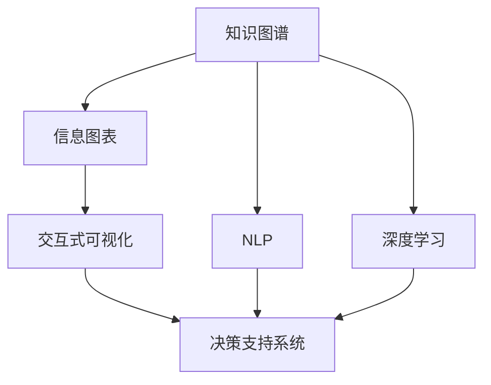

                 

# 知识可视化：直观理解复杂信息

> 关键词：知识图谱, 信息图表, 自然语言处理(NLP), 深度学习, 交互式可视化, 决策支持

## 1. 背景介绍

### 1.1 问题由来

随着信息时代的到来，数据和知识正以前所未有的速度和规模膨胀。无论是科学研究、商业决策、还是日常生活，决策者们都面临着庞大的信息流和复杂的知识网络。传统的信息呈现方式，如文本报告、散点图等，已无法满足复杂信息处理的需求，难以直接洞察知识背后的深层逻辑和关联。因此，如何高效、直观地理解和表达复杂信息，成为当前信息时代的重要挑战。

### 1.2 问题核心关键点

知识可视化，通过直观的形式展现复杂知识结构和关系，帮助人们更快速、更深入地理解和利用知识。关键在于：

- 如何用图表、图形等视觉化手段，将抽象的知识转化为直观的形式，便于理解和分析。
- 如何设计有效的交互方式，让用户能够灵活互动，深入挖掘知识。
- 如何结合自然语言处理(NLP)、深度学习等技术，提高可视化系统的智能化水平，增强决策支持能力。

## 2. 核心概念与联系

### 2.1 核心概念概述

为更好地理解知识可视化方法，本节将介绍几个核心概念：

- **知识图谱(Knowledge Graph)**：通过节点和边结构化表示实体和关系，形成复杂知识网络的图形数据库。广泛应用于搜索引擎、推荐系统、问答系统等领域。
- **信息图表(Information Graphics)**：利用图表、图形等视觉手段，直观展示复杂数据和知识。常用于数据报告、新闻网站、社交媒体等场景。
- **自然语言处理(NLP)**：专注于如何让计算机理解、处理和生成自然语言。常见的应用包括文本分类、情感分析、机器翻译等。
- **深度学习(Deep Learning)**：一类基于神经网络的机器学习技术，擅长处理大规模复杂数据，如图像、文本等，已广泛应用于知识可视化领域。
- **交互式可视化(Interactive Visualization)**：允许用户通过点击、拖动等交互方式，实时改变图表内容，提高可视化系统的灵活性和用户参与度。
- **决策支持系统(Decision Support System, DSS)**：通过可视化的数据分析和智能推理，辅助决策者快速、准确地做出决策。常用于企业风险管理、医疗诊断等场景。

这些概念之间的逻辑关系可以通过以下Mermaid流程图来展示：



这个流程图展示出知识可视化的核心概念及其之间的关系：

1. 知识图谱通过结构化表示实体和关系，为信息可视化提供数据基础。
2. NLP技术用于知识图谱的构建和处理，抽取知识实体和关系。
3. 深度学习技术用于增强可视化系统的智能化水平，提升数据处理的精度。
4. 交互式可视化提供灵活的交互方式，增强用户体验。
5. 决策支持系统结合可视化结果，辅助决策者进行决策。

## 3. 核心算法原理 & 具体操作步骤
### 3.1 算法原理概述

知识可视化方法通常基于以下算法原理：

- **数据预处理**：将原始数据转换为图形数据结构，如节点和边。这可以通过自然语言处理技术从文本数据中抽取实体和关系，或从知识图谱中直接获取。
- **图形表示**：利用图表、图形等视觉手段，直观展示数据结构和关系。常见的图形表示方法包括节点-边图、树形图、网络图等。
- **交互设计**：设计灵活的交互方式，让用户能够通过点击、拖动等操作，实时改变图表内容，增强用户体验。
- **智能推理**：结合深度学习技术，对知识图谱进行深度学习，提取知识实体和关系，或对可视化结果进行智能分析，提升决策支持系统的智能化水平。

### 3.2 算法步骤详解

知识可视化的主要步骤包括：

1. **数据收集与预处理**：
   - 收集结构化或非结构化的数据，如文本、图像、音频等。
   - 利用自然语言处理技术，如命名实体识别、关系抽取等，将非结构化数据转换为知识图谱。
   - 对知识图谱进行格式化和优化，去除噪声和冗余，生成可视化的数据结构。

2. **图形表示设计**：
   - 根据数据特征和可视化需求，选择合适的图形表示方法，如节点-边图、树形图、网络图等。
   - 设计直观、易理解的图形元素，如节点颜色、大小、形状等。
   - 利用交互技术，增强图形的动态性和灵活性，如放大缩小、移动旋转等。

3. **交互设计**：
   - 设计灵活的交互方式，如拖拽、点击、缩放等，让用户能够实时改变图表内容。
   - 提供数据筛选、排序、搜索等功能，让用户能够快速定位和查看关键信息。
   - 设计可视化效果展示方式，如动态效果、动画等，增强用户体验。

4. **智能推理与决策支持**：
   - 结合深度学习技术，对知识图谱进行智能推理，发现知识之间的关系和规律。
   - 利用决策支持系统，辅助用户进行决策分析，提供智能建议和预警。

5. **测试与优化**：
   - 在实际应用中，收集用户反馈，不断调整和优化可视化界面和功能。
   - 利用A/B测试等方法，比较不同可视化方案的效果，选择最优方案。

### 3.3 算法优缺点

知识可视化方法具有以下优点：

- **直观性**：将复杂知识结构转换为直观的图形，便于用户理解和分析。
- **灵活性**：结合交互技术，用户能够灵活操作，深入挖掘知识。
- **智能化**：结合深度学习等技术，系统能够自动分析知识，提供智能决策支持。
- **可扩展性**：能够处理大规模、多类型的数据，适应复杂信息需求。

同时，该方法也存在以下局限性：

- **数据质量依赖**：可视化效果受数据质量和完整性的影响较大。
- **交互设计复杂**：设计高效的交互方式需要大量时间和经验。
- **技术门槛较高**：需要掌握自然语言处理、深度学习等技术，对技术要求较高。
- **易用性问题**：复杂的图形可能让用户感到困惑，影响使用体验。

尽管存在这些局限性，但知识可视化方法在处理复杂信息方面具有无可替代的优势，是大数据时代重要的信息表达方式。

### 3.4 算法应用领域

知识可视化方法广泛应用于以下领域：

- **科研管理**：通过知识图谱和可视化，帮助科研人员快速找到相关文献和数据，进行科学发现和创新。
- **企业决策**：利用决策支持系统，结合可视化结果，辅助企业进行市场分析、风险管理等决策。
- **教育培训**：通过知识可视化工具，帮助学生更好地理解和掌握复杂知识，提升学习效果。
- **医疗诊断**：结合医学知识图谱和可视化，辅助医生进行疾病诊断和治疗方案选择。
- **金融分析**：利用可视化技术，分析市场数据和金融风险，提供投资建议。
- **政府治理**：通过可视化系统，监测社会舆情，辅助政府进行公共管理和社会治理。

这些应用领域展示了知识可视化方法的广泛价值，推动了各行业的信息化进程。

## 4. 数学模型和公式 & 详细讲解 & 举例说明

### 4.1 数学模型构建

知识可视化方法通常基于图模型进行建模，如图网络、知识图谱等。以下是一个简单的知识图谱模型，由节点和边组成：

```
G(V,E)
```

其中 $V$ 表示节点集合，$E$ 表示边集合，每条边表示两个节点之间的关系。

### 4.2 公式推导过程

以知识图谱的构建为例，介绍核心公式的推导过程。

知识图谱的构建通常包括两个步骤：

1. **实体抽取**：从文本数据中抽取实体，如人名、地名、机构名等。
2. **关系抽取**：抽取实体之间的关系，如“某人出生于某地”、“某公司由某人创办”等。

常用的实体抽取方法包括命名实体识别(NER)、关键词提取等。关系抽取方法包括基于规则的抽取、基于统计的抽取等。

### 4.3 案例分析与讲解

以医疗知识图谱为例，展示知识可视化的应用过程。

假设我们有如下医疗数据：

| 疾病名     | 症状描述          | 治疗方法                |
|------------|------------------|-------------------------|
| 流感        | 发热、咳嗽、乏力   | 药物、休息、多饮水       |
| 糖尿病      | 口渴、多尿、疲劳   | 饮食控制、药物治疗       |
| 高血压      | 头痛、头晕、耳鸣   | 药物治疗、生活方式调整   |
| 癌症        | 疼痛、消瘦、乏力   | 手术治疗、化疗、放疗     |

我们可以通过如下步骤构建医疗知识图谱：

1. **实体抽取**：
   - 抽取疾病名、症状描述、治疗方法等实体。
   - 实体关系：“症状”与“疾病”之间的关系，“治疗方法”与“疾病”之间的关系。

2. **关系抽取**：
   - 抽取每个疾病的症状和治疗方法。
   - 关系抽取：“症状”与“疾病”之间的关系，“治疗方法”与“疾病”之间的关系。

3. **图形表示**：
   - 将疾病名、症状、治疗方法表示为节点。
   - 将症状与疾病、治疗方法与疾病之间的关系表示为边。

4. **可视化展示**：
   - 设计直观的图形元素，如节点颜色、大小、形状等。
   - 利用交互技术，允许用户查看和修改疾病症状和治疗方法，增强用户体验。

5. **智能推理**：
   - 结合深度学习技术，对知识图谱进行智能推理，发现疾病之间的关联和规律。
   - 利用决策支持系统，辅助医生进行诊断和治疗方案选择，提供智能建议和预警。

## 5. 项目实践：代码实例和详细解释说明

### 5.1 开发环境搭建

在进行知识可视化项目开发前，需要准备好开发环境。以下是使用Python进行PyTorch开发的环境配置流程：

1. 安装Anaconda：从官网下载并安装Anaconda，用于创建独立的Python环境。

2. 创建并激活虚拟环境：
```bash
conda create -n pytorch-env python=3.8 
conda activate pytorch-env
```

3. 安装PyTorch：根据CUDA版本，从官网获取对应的安装命令。例如：
```bash
conda install pytorch torchvision torchaudio cudatoolkit=11.1 -c pytorch -c conda-forge
```

4. 安装TensorFlow：由Google主导开发的开源深度学习框架，生产部署方便，适合大规模工程应用。同样有丰富的预训练语言模型资源。

5. 安装Gephi等可视化工具：
```bash
pip install gephi
```

完成上述步骤后，即可在`pytorch-env`环境中开始知识可视化项目的开发。

### 5.2 源代码详细实现

下面以构建医疗知识图谱为例，展示知识可视化的代码实现。

```python
from transformers import BertTokenizer, BertForTokenClassification
from gephi import Gephi
import torch
import pandas as pd

# 数据预处理
def preprocess_data(data):
    # 实体抽取
    tokenizer = BertTokenizer.from_pretrained('bert-base-cased')
    inputs = tokenizer(data['text'], return_tensors='pt')
    entities = inputs['input_ids'].tolist()

    # 关系抽取
    labels = data['label'].tolist()

    return entities, labels

# 知识图谱构建
def build_knowledge_graph(entities, labels):
    graph = Graph()
    for i in range(len(entities)):
        node_id = graph.add_node(entities[i], color='blue')
        for j in range(len(entities[i])):
            neighbor_id = graph.add_node(entities[i][j], color='red')
            graph.add_edge(node_id, neighbor_id, label=labels[i][j])

    return graph

# 可视化展示
def visualize_graph(graph):
    gephi = Gephi()
    gephi.import_graph(graph)
    gephi.show()

# 测试数据
data = pd.read_csv('data.csv')

# 数据预处理
entities, labels = preprocess_data(data)

# 知识图谱构建
graph = build_knowledge_graph(entities, labels)

# 可视化展示
visualize_graph(graph)
```

### 5.3 代码解读与分析

让我们再详细解读一下关键代码的实现细节：

**preprocess_data函数**：
- 使用BERT模型进行实体抽取，将文本转换为实体列表。
- 抽取实体之间的关系，生成标签列表。

**build_knowledge_graph函数**：
- 构建知识图谱的节点和边。
- 设计直观的图形元素，如节点颜色、大小、形状等。

**visualize_graph函数**：
- 导入Gephi工具，展示知识图谱。

通过上述代码，我们展示了知识可视化的基本流程和实现细节。可以看到，知识可视化结合了自然语言处理和深度学习技术，能够高效地构建和展示复杂知识图谱。

## 6. 实际应用场景

### 6.1 医疗诊断

医疗知识图谱可以用于辅助医生的诊断和治疗决策。通过将医疗数据可视化，医生可以直观地看到疾病之间的关联和治疗方法，快速做出诊断和治疗方案。

在实践中，可以将医院的医疗数据构建为知识图谱，结合深度学习技术，对知识图谱进行智能推理，发现疾病之间的关系和规律。利用可视化系统，医生可以实时查看和修改疾病症状和治疗方法，增强诊断和治疗的准确性和效率。

### 6.2 金融分析

金融知识图谱可以用于分析市场数据和金融风险，提供投资建议。通过将金融数据可视化，投资者可以直观地看到不同资产之间的关联和市场趋势，做出更准确的投资决策。

在实践中，可以将金融市场数据构建为知识图谱，结合深度学习技术，对知识图谱进行智能推理，发现不同资产之间的关联和市场趋势。利用可视化系统，投资者可以实时查看和修改投资组合，优化投资策略。

### 6.3 教育培训

教育知识图谱可以用于辅助学生的学习，提升学习效果。通过将学习数据可视化，学生可以直观地看到知识之间的关联和逻辑，更好地理解和掌握复杂知识。

在实践中，可以将教育资源和学习数据构建为知识图谱，结合深度学习技术，对知识图谱进行智能推理，发现知识之间的关系和规律。利用可视化系统，学生可以实时查看和修改学习内容，提升学习效果。

## 7. 工具和资源推荐

### 7.1 学习资源推荐

为了帮助开发者系统掌握知识可视化理论基础和实践技巧，这里推荐一些优质的学习资源：

1. **《可视化思维：如何用图表讲述故事》**：介绍了如何将复杂数据和知识通过图表形式进行可视化，帮助读者提升图表设计能力。

2. **Coursera《数据可视化课程》**：由数据科学专家开设，详细讲解数据可视化的原理和实践技巧，涵盖多种可视化工具和应用。

3. **D3.js官方文档**：D3.js是一个流行的JavaScript可视化库，提供了丰富的可视化组件和示例，适合开发交互式可视化系统。

4. **Tableau官方文档**：Tableau是一个流行的数据可视化工具，提供了直观的可视化界面和丰富的图表类型，适合快速生成报表和仪表盘。

5. **Gephi官方文档**：Gephi是一个流行的图形分析工具，支持多种可视化算法和算法优化，适合构建和分析大型知识图谱。

通过对这些资源的学习实践，相信你一定能够快速掌握知识可视化的精髓，并用于解决实际的复杂信息表达问题。

### 7.2 开发工具推荐

高效的开发离不开优秀的工具支持。以下是几款用于知识可视化开发的常用工具：

1. **Python**：Python是数据科学和机器学习领域的主流编程语言，拥有丰富的可视化库和组件，如Matplotlib、Seaborn、Plotly等。

2. **R语言**：R语言是统计分析和数据科学的重要工具，拥有丰富的可视化库和组件，如ggplot2、Shiny等。

3. **Tableau**：Tableau是一个流行的数据可视化工具，提供了直观的可视化界面和丰富的图表类型，适合快速生成报表和仪表盘。

4. **D3.js**：D3.js是一个流行的JavaScript可视化库，提供了丰富的可视化组件和示例，适合开发交互式可视化系统。

5. **Gephi**：Gephi是一个流行的图形分析工具，支持多种可视化算法和算法优化，适合构建和分析大型知识图谱。

合理利用这些工具，可以显著提升知识可视化任务的开发效率，加快创新迭代的步伐。

### 7.3 相关论文推荐

知识可视化领域的研究始于学界的持续探索。以下是几篇奠基性的相关论文，推荐阅读：

1. **《可视化：一种用图形表示数据的新方式》**：提出了可视化技术的概念和基本原理，奠定了知识可视化研究的基础。

2. **《交互式可视化系统设计》**：介绍了交互式可视化系统设计的关键技术和方法，提供了丰富的案例和应用示例。

3. **《知识图谱构建和应用》**：详细讲解了知识图谱的构建方法和应用场景，展示了知识图谱在信息检索、问答系统等领域的广泛应用。

4. **《深度学习在知识图谱中的应用》**：介绍了深度学习技术在知识图谱中的应用，展示了深度学习在实体关系抽取、知识推理等任务中的潜力。

5. **《知识可视化中的视觉化元素设计》**：探讨了知识可视化中的视觉化元素设计原则和方法，展示了不同视觉化元素对用户理解的影响。

这些论文代表了大数据时代知识可视化技术的发展脉络，通过学习这些前沿成果，可以帮助研究者把握学科前进方向，激发更多的创新灵感。

## 8. 总结：未来发展趋势与挑战

### 8.1 总结

本文对知识可视化方法进行了全面系统的介绍。首先阐述了知识可视化在复杂信息处理中的重要作用，明确了可视化的直观性和灵活性。其次，从原理到实践，详细讲解了知识可视化的数学模型和操作步骤，给出了知识可视化任务开发的完整代码实例。同时，本文还广泛探讨了知识可视化方法在医疗、金融、教育等诸多领域的应用前景，展示了知识可视化的广阔价值。此外，本文精选了知识可视化技术的各类学习资源，力求为读者提供全方位的技术指引。

通过本文的系统梳理，可以看到，知识可视化技术在大数据时代具有无可替代的价值，是大数据应用的重要方向。未来，伴随大数据、人工智能技术的持续演进，知识可视化技术必将迎来更广阔的发展空间。

### 8.2 未来发展趋势

展望未来，知识可视化技术将呈现以下几个发展趋势：

1. **技术融合**：知识可视化技术将与其他前沿技术，如深度学习、自然语言处理等进行深度融合，提升系统的智能化水平。

2. **自适应性**：知识可视化系统将具备自适应性，根据用户需求和环境变化，自动调整可视化界面和内容。

3. **动态性**：知识可视化系统将具备动态性，实时更新和调整可视化内容，满足用户的实时需求。

4. **可扩展性**：知识可视化系统将具备可扩展性，能够处理大规模、多类型的数据，适应复杂信息需求。

5. **交互性**：知识可视化系统将具备强大的交互性，用户可以通过拖拽、点击等操作，实时改变可视化内容，增强用户体验。

6. **安全性**：知识可视化系统将具备安全性，通过数据脱敏、访问控制等措施，保障数据和系统安全。

这些趋势展示了知识可视化技术的未来发展方向，推动了各行业的信息化进程。

### 8.3 面临的挑战

尽管知识可视化技术已经取得了瞩目成就，但在迈向更加智能化、普适化应用的过程中，它仍面临着诸多挑战：

1. **数据质量问题**：知识可视化效果受数据质量和完整性的影响较大，如何提高数据质量是一个重要挑战。

2. **技术门槛较高**：知识可视化技术需要掌握多种技术，如自然语言处理、深度学习等，对技术要求较高。

3. **交互设计复杂**：设计高效的交互方式需要大量时间和经验，如何降低交互设计的复杂性是一个重要课题。

4. **易用性问题**：复杂的图形可能让用户感到困惑，影响使用体验，如何提高知识可视化的易用性是一个重要问题。

5. **安全性问题**：知识可视化系统可能存在数据泄露、隐私侵犯等安全风险，如何保障数据和系统安全是一个重要课题。

6. **可扩展性问题**：知识可视化系统需要处理大规模、多类型的数据，如何提高系统的可扩展性是一个重要挑战。

这些挑战需要研究者不断探索和改进，才能推动知识可视化技术的持续发展和应用。

### 8.4 研究展望

未来，知识可视化技术需要从以下几个方面寻求新的突破：

1. **自适应可视化技术**：结合机器学习技术，实现知识图谱的自动调整和优化，适应不同用户的需求和环境。

2. **交互式可视化界面**：设计高效、易用的交互界面，让用户能够灵活操作，深入挖掘知识。

3. **可视化算法优化**：优化可视化算法，提高可视化效果的质量和效率，减少计算资源消耗。

4. **知识图谱构建方法**：研究新的知识图谱构建方法，提高知识图谱的质量和完整性。

5. **多模态知识可视化**：结合视觉、听觉、触觉等多种模态信息，实现更加全面、多样化的知识可视化。

6. **知识图谱自动生成**：研究知识图谱自动生成方法，减少人工干预，提高知识图谱的生成效率和质量。

这些研究方向将进一步推动知识可视化技术的进步，为复杂信息表达和应用提供更加强大的支持。

## 9. 附录：常见问题与解答

**Q1：如何选择合适的知识图谱可视化方法？**

A: 选择合适的可视化方法需要考虑数据特征、用户需求和可视化场景。常见的可视化方法包括节点-边图、树形图、网络图等。对于关系密集的数据，可以选择节点-边图，展示实体和关系。对于层次关系明显的数据，可以选择树形图，展示层次关系。对于复杂网络数据，可以选择网络图，展示网络结构和关系。

**Q2：知识可视化系统的交互方式有哪些？**

A: 知识可视化系统的交互方式包括拖拽、点击、放大缩小、移动旋转等。拖拽操作可以改变实体和关系的展示顺序，点击操作可以跳转到详细信息页面，放大缩小操作可以改变图形的展示比例，移动旋转操作可以改变图形的展示角度。

**Q3：知识可视化系统如何处理大规模数据？**

A: 知识可视化系统通常采用分布式存储和处理方式，将大规模数据分成多个部分，分别处理后再合并展示。同时采用高效的可视化算法和数据压缩技术，减少计算资源消耗，提高可视化效果的质量和效率。

**Q4：知识可视化系统如何提高安全性？**

A: 知识可视化系统需要采用数据脱敏、访问控制等措施，保障数据和系统安全。数据脱敏可以隐藏敏感信息，访问控制可以限制用户的访问权限，确保数据和系统的安全性。

**Q5：知识可视化系统如何提高易用性？**

A: 知识可视化系统需要设计直观、易用的可视化界面和交互方式，增强用户体验。可以通过用户调研、原型测试等方式，了解用户需求和反馈，不断优化可视化界面和交互方式，提升系统的易用性。

通过以上问题的解答，展示了知识可视化技术的实际应用和优化方向，为开发和应用知识可视化系统提供了实用的参考。

