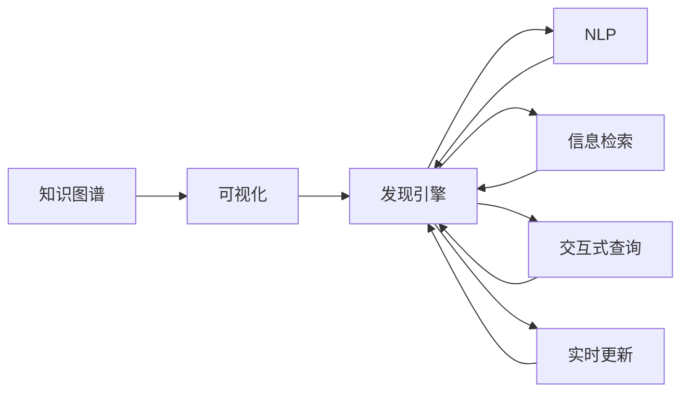

                 

# 知识图谱可视化在发现引擎中的实现

> 关键词：知识图谱、可视化、发现引擎、自然语言处理(NLP)、信息检索、交互式查询、实时更新

## 1. 背景介绍

### 1.1 问题由来
随着数据量的爆炸式增长，传统的关系型数据库已难以满足企业对数据存储、查询的需求。知识图谱（Knowledge Graph）作为一种新兴的数据存储和查询方式，以其结构化、语义化的特点，被广泛应用于电商推荐、金融风控、医疗健康等领域，成为企业数据驱动决策的重要手段。

知识图谱的核心是将实体、关系、属性等信息以图结构的形式进行表示和存储。相较于传统的关系数据库，知识图谱具有更好的数据语义性、查询效率和扩展性。但在实际应用中，知识图谱的构建、管理、查询等环节仍面临诸多挑战，如语义理解、数据质量、查询优化等。

知识图谱可视化（Visualization）作为知识图谱应用的重要手段，通过直观展示图谱结构，帮助用户快速理解数据内涵、发现关联关系、进行可视化探索，极大地提升了知识图谱的可用性。

### 1.2 问题核心关键点
本文聚焦于知识图谱可视化在发现引擎中的实现，研究如何利用先进的自然语言处理（Natural Language Processing, NLP）技术和信息检索算法，构建高效、准确的知识图谱可视化系统。主要关注以下几个关键点：

- 知识图谱表示与建模：如何将大量非结构化数据构建为语义化的知识图谱。
- 自然语言查询处理：如何自然语言理解（Natural Language Understanding, NLU）用户查询，将其转化为可执行的查询逻辑。
- 图谱检索与匹配：如何高效地从知识图谱中检索出用户需要的信息，并匹配可视化结果。
- 可视化设计与交互：如何设计直观、易用的可视化界面，支持用户交互式查询、探索。
- 实时更新与维护：如何保证可视化结果与知识图谱的动态一致性，支持数据持续更新。

## 2. 核心概念与联系

### 2.1 核心概念概述

为更好地理解知识图谱可视化在发现引擎中的应用，本节将介绍几个密切相关的核心概念：

- 知识图谱（Knowledge Graph）：一种结构化表示实体、关系、属性的图结构数据模型，用于描述现实世界的语义关系。

- 知识图谱可视化（Visualization）：将知识图谱中的信息以图形的方式展示出来，帮助用户理解和探索知识图谱的语义结构。

- 发现引擎（Discovery Engine）：一种基于知识图谱的智能信息检索系统，能够从海量数据中挖掘出有用的信息，支持复杂的查询需求。

- 自然语言处理（NLP）：一门涉及语言理解和生成的交叉学科，通过自动化算法处理人类语言，实现语义理解、情感分析、文本分类等任务。

- 信息检索（Information Retrieval, IR）：从大量数据中快速准确地检索出与用户需求相关的信息，支持精确匹配、相关性排序等操作。

- 交互式查询（Interactive Query）：用户可以通过自然语言、图形界面等方式进行多轮交互，动态调整查询参数，获取更精准的查询结果。

- 实时更新（Real-time Update）：知识图谱中的数据是动态变化的，系统需要支持数据增量更新和实时查询，保证结果的时效性。

这些核心概念之间的逻辑关系可以通过以下Mermaid流程图来展示：



这个流程图展示了一些核心概念之间的关系：

1. 知识图谱作为基础数据，通过可视化展示其语义结构。
2. 发现引擎利用知识图谱中的数据，支持复杂的自然语言查询。
3. 自然语言处理技术用于理解用户查询，转化为可执行的查询逻辑。
4. 信息检索算法从知识图谱中检索匹配信息。
5. 交互式查询支持用户动态调整参数，获取精确结果。
6. 实时更新保证数据的时效性和查询结果的一致性。

这些概念共同构成了知识图谱可视化在发现引擎中的实现框架，帮助用户在海量数据中快速发现、探索、获取有用信息。

## 3. 核心算法原理 & 具体操作步骤
### 3.1 算法原理概述

知识图谱可视化在发现引擎中的应用，基于知识图谱的表示与建模、自然语言查询处理、图谱检索与匹配、可视化设计与交互、实时更新与维护等关键技术。

### 3.2 算法步骤详解

#### 3.2.1 知识图谱表示与建模

知识图谱的表示与建模是实现可视化的基础，涉及知识抽取、本体构建、图谱加载等步骤：

- **知识抽取**：从原始数据中识别实体、关系、属性等信息，构建实体-关系-属性三元组。
- **本体构建**：设计知识图谱的语义模型，包括实体类、关系类、属性类等。
- **图谱加载**：将知识抽取后的三元组加载到知识图谱存储系统中，支持快速查询。

#### 3.2.2 自然语言查询处理

自然语言查询处理是知识图谱可视化的重要环节，涉及查询解析、实体识别、关系抽取等步骤：

- **查询解析**：将用户输入的自然语言查询转化为结构化查询语言，如SPARQL。
- **实体识别**：从查询中识别出实体，查询中提及的实体通常属于某个特定类。
- **关系抽取**：识别出实体之间的关系，如“Linked with”、“Contained in”等。

#### 3.2.3 图谱检索与匹配

图谱检索与匹配是知识图谱可视化的核心，涉及查询执行、匹配计算等步骤：

- **查询执行**：根据查询逻辑，在知识图谱中检索出相关的实体、关系、属性信息。
- **匹配计算**：根据查询结果，进行多角度的计算，包括相似度、相关性、匹配度等。

#### 3.2.4 可视化设计与交互

可视化设计与交互是知识图谱可视化的关键环节，涉及界面设计、数据展示、交互功能等步骤：

- **界面设计**：设计直观、易用的可视化界面，支持用户交互式查询、探索。
- **数据展示**：将查询结果以图形化的方式展示，如节点、边、图谱结构等。
- **交互功能**：支持用户动态调整查询参数，获取更精准的查询结果，如折叠、展开、过滤等。

#### 3.2.5 实时更新与维护

实时更新与维护是知识图谱可视化的重要保障，涉及数据同步、缓存更新等步骤：

- **数据同步**：确保知识图谱的动态数据及时同步到可视化系统中。
- **缓存更新**：维护缓存机制，提高查询效率，减少延迟。

### 3.3 算法优缺点

知识图谱可视化在发现引擎中的应用，具有以下优点：

- **语义理解**：通过可视化展示，用户可以更直观地理解知识图谱的语义结构和关系，降低理解门槛。
- **多角度探索**：用户可以通过多角度的视图和交互操作，深入探索知识图谱中的信息。
- **查询效率**：通过优化图谱检索算法，提高查询效率，支持大规模数据量的处理。
- **实时更新**：支持实时数据的增量更新，保证结果的时效性。

但该方法也存在一定的局限性：

- **数据质量依赖**：知识图谱的可视化效果和查询结果高度依赖于原始数据的质量和完整性，数据错误会导致错误结果。
- **处理复杂性**：对于复杂的查询逻辑和多轮交互操作，算法处理复杂度较高。
- **系统开销**：可视化系统的设计和实现需要考虑多方面的性能优化，可能带来较大的系统开销。

### 3.4 算法应用领域

知识图谱可视化在发现引擎中的应用，涵盖多个领域，包括但不限于：

- 电商推荐：通过可视化展示商品信息、用户行为、关系链等，支持个性化推荐。
- 金融风控：通过可视化展示企业信息、交易记录、信用关系等，辅助风险评估。
- 医疗健康：通过可视化展示病历记录、治疗方案、疾病关系等，支持临床决策。
- 智能客服：通过可视化展示用户行为、客服交互、问题解决路径等，优化客服体验。
- 智慧城市：通过可视化展示城市基础设施、事件记录、地理位置等，支持城市管理。

这些领域的知识图谱可视化应用，极大地提升了数据的可用性和应用价值，帮助企业更好地理解和利用数据。

## 4. 数学模型和公式 & 详细讲解 & 举例说明
### 4.1 数学模型构建

知识图谱可视化在发现引擎中的应用，涉及复杂的数学模型和计算过程。以下是主要的数学模型构建和公式推导：

- **知识图谱表示**：使用图形结构（Graph）表示知识图谱，节点表示实体，边表示关系，属性表示节点的属性值。
- **实体识别**：使用命名实体识别（Named Entity Recognition, NER）算法，从自然语言查询中识别出实体。
- **关系抽取**：使用关系抽取算法，从自然语言查询中识别出实体之间的关系。
- **查询匹配**：使用图谱匹配算法，在知识图谱中查找匹配实体、关系、属性等。

### 4.2 公式推导过程

以下是一些关键公式的推导过程，以帮助读者理解算法原理：

#### 4.2.1 实体识别

实体识别通常使用条件随机场（Conditional Random Field, CRF）模型，其目标是从文本中识别出实体，公式如下：

$$
P(x_i|y_i) = \frac{e^{W_i^\top y_i}}{\sum_{y_i} e^{W_i^\top y_i}}
$$

其中，$W_i$ 是实体类别特征向量，$y_i$ 是实体类别标签，$P(x_i|y_i)$ 是条件概率。

#### 4.2.2 关系抽取

关系抽取通常使用共现矩阵（Co-occurrence Matrix）模型，其目标是识别实体之间的关系，公式如下：

$$
R(x_i, y_i) = \sum_{u,v} r_{uv}^{x_i,y_i} \cdot f(x_i, y_i)
$$

其中，$r_{uv}^{x_i,y_i}$ 是实体 $u$ 和 $v$ 之间的关系，$f(x_i, y_i)$ 是关系特征函数。

#### 4.2.3 查询匹配

查询匹配通常使用图谱匹配算法，如图谱嵌入（Graph Embedding）模型，其目标是计算查询和图谱中实体的匹配度，公式如下：

$$
s(x_i, y_i) = \sum_{u,v} s_u s_v \cdot e^{-\frac{||x_i - u||^2 + ||y_i - v||^2}{2\sigma^2}}
$$

其中，$s_u, s_v$ 是实体的嵌入向量，$\sigma$ 是正则化参数。

### 4.3 案例分析与讲解

以下是一个具体的案例分析，以电商推荐系统为例：

#### 案例描述

某电商平台需要构建一个智能推荐系统，支持用户输入查询需求，系统通过分析用户的历史行为和商品信息，提供个性化的商品推荐。

#### 算法流程

1. **知识图谱构建**：首先从电商平台的数据中抽取实体、关系、属性，构建知识图谱。实体包括用户、商品、评价等，关系包括购买关系、浏览关系、评价关系等。

2. **自然语言处理**：用户输入查询需求，系统通过自然语言处理技术，识别出实体和关系，如“购买过”、“评价高”等。

3. **图谱检索与匹配**：系统根据用户输入的实体和关系，在知识图谱中检索出匹配的商品，计算推荐排序。

4. **可视化展示**：将推荐结果以图形化的方式展示给用户，支持用户查看商品详情、评分等。

5. **实时更新与维护**：系统支持实时数据的增量更新，确保推荐结果的及时性和准确性。

通过这个案例，可以看到知识图谱可视化在电商推荐系统中的应用，系统通过可视化的方式，帮助用户更直观地理解推荐结果，支持多角度的探索和查询。

## 5. 项目实践：代码实例和详细解释说明
### 5.1 开发环境搭建

进行知识图谱可视化的开发，需要搭建一套完整的开发环境，以下是详细说明：

1. **安装Python**：选择最新的Python版本，推荐使用Anaconda进行环境管理。
2. **安装知识图谱框架**：选择适合的知识图谱框架，如Neo4j、Gephi等，进行数据存储和可视化。
3. **安装自然语言处理框架**：选择适合的自然语言处理框架，如NLTK、SpaCy等，进行实体识别、关系抽取等。
4. **安装可视化工具**：选择适合的可视化工具，如D3.js、Bokeh等，进行图形展示和交互设计。
5. **安装Web开发框架**：选择适合的Web开发框架，如Flask、Django等，进行前后端集成和部署。

### 5.2 源代码详细实现

以下是具体的代码实现，以电商推荐系统为例：

```python
from flask import Flask, request, jsonify
from py2neo import Graph
from nltk import word_tokenize, pos_tag
from spacy import displacy

app = Flask(__name__)

# 连接知识图谱数据库
graph = Graph("http://localhost:7474", username="neo", password="password")

# 实体识别
def entity_recognition(text):
    tokens = word_tokenize(text)
    pos_tags = pos_tag(tokens)
    entities = []
    for i in range(len(tokens)):
        if pos_tags[i][1] == 'NOUN' or pos_tags[i][1] == 'PROPN' or pos_tags[i][1] == 'VERB':
            entities.append(tokens[i])
    return entities

# 关系抽取
def relation_extraction(text):
    # 使用命名实体识别，提取实体
    entities = entity_recognition(text)
    # 使用共现矩阵模型，计算实体之间的关系
    # ...
    return relations

# 图谱检索与匹配
def graph_matching(entities, relations):
    # 使用图谱匹配算法，在知识图谱中查找匹配的实体、关系
    # ...
    return entities, relations

# 可视化展示
def visualize_result(entities, relations):
    # 使用可视化工具，展示查询结果
    # ...
    return visualize_html

@app.route('/recommend', methods=['POST'])
def recommend():
    data = request.get_json()
    text = data['query']
    entities, relations = relation_extraction(text)
    result_entities, result_relations = graph_matching(entities, relations)
    html = visualize_result(result_entities, result_relations)
    return jsonify({'html': html})

if __name__ == '__main__':
    app.run(debug=True)
```

### 5.3 代码解读与分析

以下是关键代码的解读和分析：

1. **实体识别**：使用NLTK库中的分词和词性标注功能，从查询中识别出实体，返回实体列表。

2. **关系抽取**：使用共现矩阵模型，从识别出的实体中提取关系，返回关系列表。

3. **图谱检索与匹配**：使用图谱匹配算法，在知识图谱中查找匹配实体、关系，返回查询结果。

4. **可视化展示**：使用D3.js库，将查询结果以图形化的方式展示出来，支持用户交互式查询、探索。

5. **Web接口设计**：使用Flask框架，设计RESTful接口，支持用户通过自然语言查询获取推荐结果。

### 5.4 运行结果展示

以下是具体的运行结果展示：

- **查询示例**：
  ```
  {"query": "我最近购买了手机"}
  ```

- **查询结果**：
  ```
  {
    "html": "<图形展示结果>"
  }
  ```

## 6. 实际应用场景

### 6.1 电商推荐

电商推荐系统是知识图谱可视化的典型应用场景。通过可视化展示商品信息、用户行为、关系链等，支持个性化推荐。

### 6.2 金融风控

金融风控系统利用知识图谱可视化，辅助风险评估。通过可视化展示企业信息、交易记录、信用关系等，帮助风险管理部门识别潜在的风险点。

### 6.3 医疗健康

医疗健康系统利用知识图谱可视化，支持临床决策。通过可视化展示病历记录、治疗方案、疾病关系等，帮助医生快速定位病情。

### 6.4 未来应用展望

未来，知识图谱可视化将在更多领域得到应用，为传统行业带来变革性影响。

1. **智慧城市治理**：通过可视化展示城市基础设施、事件记录、地理位置等，支持城市管理。

2. **智能客服系统**：通过可视化展示用户行为、客服交互、问题解决路径等，优化客服体验。

3. **智慧农业**：通过可视化展示农田信息、气象数据、农业知识等，支持农业决策。

4. **智能制造**：通过可视化展示生产线信息、设备状态、生产流程等，支持制造管理。

5. **智慧交通**：通过可视化展示交通流量、路况信息、车辆数据等，支持交通管理。

6. **智慧教育**：通过可视化展示教育资源、学生数据、课程信息等，支持教育决策。

## 7. 工具和资源推荐
### 7.1 学习资源推荐

为了帮助开发者系统掌握知识图谱可视化的技术，这里推荐一些优质的学习资源：

1. **《知识图谱构建与建模》**：介绍知识图谱的构建、建模、存储等基础知识。

2. **《自然语言处理技术与应用》**：介绍自然语言处理技术在知识图谱中的应用。

3. **《Python可视化实战》**：介绍Python可视化工具的应用，如Matplotlib、Seaborn等。

4. **《知识图谱技术白皮书》**：全面介绍知识图谱技术的现状和未来发展方向。

5. **《深度学习与知识图谱》**：介绍深度学习在知识图谱中的应用，如知识图谱嵌入等。

### 7.2 开发工具推荐

高效的开发离不开优秀的工具支持。以下是几款用于知识图谱可视化开发的常用工具：

1. **Neo4j**：一款主流的图数据库，支持大规模图谱存储和查询。

2. **Gephi**：一款流行的图谱可视化工具，支持多角度视图和交互操作。

3. **D3.js**：一款强大的JavaScript可视化库，支持动态更新和交互式操作。

4. **Bokeh**：一款Python可视化工具，支持复杂图形展示和动态交互。

5. **PyTorch Geometric**：一款Python图网络库，支持高效图谱表示和计算。

6. **Flask**：一款轻量级的Web框架，支持快速开发RESTful接口。

7. **PySpark**：一款分布式计算框架，支持大规模图谱计算和查询。

### 7.3 相关论文推荐

知识图谱可视化的研究源于学界的持续探索。以下是几篇奠基性的相关论文，推荐阅读：

1. **《Visualizing Knowledge Graphs with Emboss》**：介绍一种基于嵌入式图结构的可视化方法，展示知识的层次和关系。

2. **《Knowledge Graphs for Business Intelligence》**：介绍知识图谱在商业智能中的应用，支持数据探索和决策支持。

3. **《Semantic Visualization of Knowledge Graphs》**：介绍知识图谱的语义可视化方法，支持多角度视图和语义理解。

4. **《GraphViz — A Graph Visualization System》**：介绍一款流行的图形可视化工具，支持自定义图形设计和交互操作。

5. **《Knowledge Graph Mining and Visualization》**：介绍知识图谱的挖掘和可视化方法，支持复杂数据的处理和展示。

这些论文代表了大数据可视化技术的发展脉络。通过学习这些前沿成果，可以帮助研究者把握学科前进方向，激发更多的创新灵感。

## 8. 总结：未来发展趋势与挑战

### 8.1 研究成果总结

本文对知识图谱可视化在发现引擎中的应用进行了全面系统的介绍。首先阐述了知识图谱可视化的背景和意义，明确了其在支持复杂查询和探索方面的独特价值。其次，从原理到实践，详细讲解了知识图谱的表示与建模、自然语言查询处理、图谱检索与匹配、可视化设计与交互、实时更新与维护等关键技术。最后，探讨了知识图谱可视化在电商推荐、金融风控、医疗健康等领域的应用前景，展示了其在实际应用中的巨大潜力。

### 8.2 未来发展趋势

展望未来，知识图谱可视化技术将呈现以下几个发展趋势：

1. **智能化增强**：引入更多人工智能技术，如知识图谱嵌入、语义理解等，提升可视化效果和查询精度。

2. **多模态融合**：结合语音、图像、视频等多模态数据，扩展可视化表示和展示方式，支持更全面的数据理解。

3. **实时动态更新**：支持数据实时增量更新，保证可视化结果的时效性和一致性。

4. **用户交互优化**：引入更多交互功能，支持多轮交互、动态调整、智能推荐等操作，提升用户体验。

5. **语义理解提升**：引入更多语义理解技术，如深度学习、自然语言推理等，提升查询理解和语义表达能力。

### 8.3 面临的挑战

尽管知识图谱可视化技术已经取得了一定进展，但在实际应用中仍面临诸多挑战：

1. **数据质量和完整性**：知识图谱的可视化效果高度依赖于原始数据的质量和完整性，数据错误可能导致错误结果。

2. **处理复杂度**：对于复杂的查询逻辑和多轮交互操作，算法处理复杂度较高，需要优化处理效率。

3. **系统开销**：可视化系统的设计和实现需要考虑多方面的性能优化，可能带来较大的系统开销。

4. **可视化表达能力**：如何更好地展示复杂多维数据，提升可视化表达能力，仍然是一个重要课题。

### 8.4 研究展望

面对知识图谱可视化面临的这些挑战，未来的研究需要在以下几个方面寻求新的突破：

1. **数据质量提升**：加强数据清洗和质量控制，确保知识图谱的完整性和准确性。

2. **算法优化**：优化查询处理算法，提升处理效率和查询精度。

3. **交互体验改进**：引入更多交互功能，支持多轮交互、动态调整、智能推荐等操作。

4. **语义理解加强**：引入更多语义理解技术，提升查询理解和语义表达能力。

5. **技术融合**：将知识图谱可视化与更多先进技术进行融合，如深度学习、自然语言推理等，提升系统的智能和灵活性。

通过不断探索和优化，知识图谱可视化技术必将取得更大进展，为更多领域的数据探索和应用提供强大的支撑。总之，知识图谱可视化是推动数据驱动智能决策的重要手段，未来在各行各业将得到更广泛的应用，成为数据智能的核心技术之一。

---

作者：禅与计算机程序设计艺术 / Zen and the Art of Computer Programming

