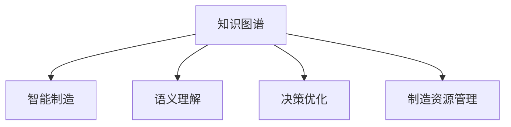

                 

# 知识图谱在智能制造中的应用

> 关键词：知识图谱,智能制造,语义理解,决策优化,制造资源管理

## 1. 背景介绍

### 1.1 问题由来
随着信息技术的不断进步，制造业正在经历从传统制造向智能制造的转型升级。智能制造（Intelligent Manufacturing）是指利用现代信息技术，包括人工智能（AI）、物联网（IoT）、大数据分析等手段，优化制造过程，提高生产效率，降低生产成本，实现柔性化、个性化生产。知识图谱（Knowledge Graph）作为知识工程的核心技术之一，在智能制造中的应用越来越受到关注。

### 1.2 问题核心关键点
知识图谱是一种结构化的语义知识表示形式，它通过实体、关系和属性三元组来描述实体之间的关联，可以应用于很多领域，如图情检索、问答系统、自然语言处理等。在智能制造领域，知识图谱可以将制造过程中的各种数据和信息进行语义化，为制造系统的决策和优化提供支持。

### 1.3 问题研究意义
通过知识图谱技术，智能制造系统能够更好地理解生产过程中的各种信息，包括设备状态、物料信息、工艺路线等，从而实现生产过程的智能化管理。知识图谱可以帮助智能制造系统实现自适应决策、预测性维护、资源优化配置等功能，显著提升生产效率和质量，降低成本，提高竞争力。

## 2. 核心概念与联系

### 2.1 核心概念概述

为更好地理解知识图谱在智能制造中的应用，本节将介绍几个密切相关的核心概念：

- 知识图谱（Knowledge Graph）：用于描述实体、关系和属性之间的语义关系的图结构化数据模型。通常用三元组（实体、关系、属性）来表示，可以应用于知识表示、问答系统、自然语言处理等领域。
- 智能制造（Intelligent Manufacturing）：通过现代信息技术，优化制造过程，提高生产效率，实现柔性化、个性化生产。
- 语义理解（Semantic Understanding）：通过知识图谱中的实体和关系，理解文本中的含义，支持智能制造系统的决策和优化。
- 决策优化（Decision Optimization）：通过知识图谱中的信息和推理，实现生产过程的智能化管理，优化资源配置、生产计划等。
- 制造资源管理（Manufacturing Resource Management）：利用知识图谱对制造过程中的设备、物料、工艺等资源进行管理和优化，提高生产效率和质量。

这些核心概念之间的逻辑关系可以通过以下Mermaid流程图来展示：



这个流程图展示了几大核心概念之间的联系：

1. 知识图谱提供语义化表示的实体和关系，支持智能制造系统进行语义理解。
2. 语义理解通过知识图谱中的信息和推理，支持智能制造系统的决策和优化。
3. 决策优化基于语义理解，优化制造资源的管理，提升生产效率和质量。

## 3. 核心算法原理 & 具体操作步骤
### 3.1 算法原理概述

知识图谱在智能制造中的应用，主要通过以下几个步骤实现：

1. 构建制造知识图谱：将制造过程中的各种信息，如设备、物料、工艺等，转换为知识图谱中的实体和关系，构建制造知识图谱。
2. 知识图谱嵌入：将制造知识图谱嵌入到智能制造系统中，支持语义理解和推理。
3. 语义查询和推理：在制造过程中，利用知识图谱中的信息和推理，进行语义查询和决策优化。
4. 知识图谱更新：随着制造过程的变化，定期更新知识图谱，保持其时效性和准确性。

### 3.2 算法步骤详解

知识图谱在智能制造中的应用主要包括以下几个关键步骤：

**Step 1: 构建制造知识图谱**

构建制造知识图谱的主要步骤如下：

1. 收集制造过程中的各种数据，包括设备状态、物料信息、工艺路线等。
2. 对收集到的数据进行清洗和预处理，去除噪音和冗余数据。
3. 将清洗后的数据转换为三元组（实体、关系、属性），构建制造知识图谱。

**Step 2: 知识图谱嵌入**

知识图谱嵌入到智能制造系统中的主要步骤如下：

1. 将制造知识图谱嵌入到智能制造系统中，支持语义查询和推理。
2. 利用知识图谱中的信息和推理，进行生产过程的智能化管理。
3. 根据生产过程中的实时数据，动态更新知识图谱，保持其时效性。

**Step 3: 语义查询和推理**

利用知识图谱进行语义查询和推理的主要步骤如下：

1. 根据生产需求和资源信息，利用知识图谱进行语义查询，获取所需实体和关系。
2. 利用知识图谱中的推理规则，进行生产过程的决策优化，如设备调度、物料配送等。
3. 根据生产过程中的实时数据，动态调整知识图谱中的实体和关系，进行实时优化。

**Step 4: 知识图谱更新**

定期更新制造知识图谱的主要步骤如下：

1. 定期收集生产过程中的各种数据，进行数据清洗和预处理。
2. 根据收集到的数据，动态更新知识图谱中的实体和关系。
3. 保持知识图谱的时效性和准确性，提升智能制造系统的决策和优化效果。

### 3.3 算法优缺点

知识图谱在智能制造中的应用具有以下优点：

1. 提升生产效率：通过语义理解和推理，优化生产过程，提高生产效率和质量。
2. 支持柔性化生产：根据生产需求和资源信息，进行智能调度，实现柔性化、个性化生产。
3. 降低生产成本：通过优化资源配置，降低生产成本。
4. 增强决策可靠性：利用知识图谱中的信息和推理，支持智能制造系统的决策优化。

同时，知识图谱在智能制造中也存在一定的局限性：

1. 数据采集复杂：需要收集大量的制造数据，数据采集和预处理工作较为复杂。
2. 实时性要求高：知识图谱需要实时更新，以适应生产过程的变化，对实时性要求较高。
3. 更新维护成本高：知识图谱的构建和更新需要较高的人力和物力成本。
4. 适用性有限：对于某些复杂制造系统，知识图谱的应用效果可能受到限制。

尽管存在这些局限性，但就目前而言，知识图谱在智能制造中的应用仍然具有广阔前景。未来相关研究的重点在于如何进一步提高数据采集和处理的效率，降低更新和维护成本，同时优化知识图谱的实时性和适用性。

### 3.4 算法应用领域

知识图谱在智能制造中的应用已经涵盖了多个领域，例如：

- 生产过程优化：利用知识图谱进行语义查询和推理，优化生产过程，提升生产效率。
- 设备管理：利用知识图谱进行设备状态监控和维护，保障设备稳定运行。
- 物料管理：利用知识图谱进行物料调配和库存管理，降低物料成本。
- 工艺路线优化：利用知识图谱进行工艺路线的智能选择和优化，提高生产效率。
- 质量控制：利用知识图谱进行生产质量监控和控制，提升产品质量。
- 供应链优化：利用知识图谱进行供应链的智能化管理，优化供应链效率。

除了上述这些经典应用外，知识图谱还被创新性地应用于更多场景中，如智能物流、智能仓储、智能设计等，为智能制造技术带来了新的突破。

## 4. 数学模型和公式 & 详细讲解 & 举例说明

### 4.1 数学模型构建

本节将使用数学语言对知识图谱在智能制造中的应用进行更加严格的刻画。

记知识图谱中的实体为 $E=\{e_1, e_2, ..., e_n\}$，关系为 $R=\{r_1, r_2, ..., r_m\}$，属性为 $A=\{a_1, a_2, ..., a_k\}$。假设智能制造系统中的生产需求为 $D=\{d_1, d_2, ..., d_t\}$，资源信息为 $S=\{s_1, s_2, ..., s_l\}$。

定义知识图谱的语义查询函数为 $Q(E, R, A)$，用于在知识图谱中查询实体和关系。定义知识图谱的推理规则为 $P(r)$，用于根据推理规则进行决策优化。

生产过程的决策优化过程可以表示为：

$$
O = \min_{D, S} \bigg\{ \sum_{i=1}^t \mathcal{L}(d_i, Q(E, R, A)) + \sum_{j=1}^l \mathcal{L}(s_j, P(r)) \bigg\}
$$

其中 $\mathcal{L}$ 为损失函数，用于衡量生产需求和资源信息的匹配程度。

### 4.2 公式推导过程

以下我们以生产过程优化为例，推导知识图谱的优化公式。

假设生产需求为 $d_i$，对应的资源信息为 $s_j$，则生产过程的优化目标为：

$$
O = \min_{d_i, s_j} \bigg\{ \mathcal{L}(d_i, Q(E, R, A)) + \mathcal{L}(s_j, P(r)) \bigg\}
$$

根据知识图谱的查询和推理规则，将生产需求和资源信息转换为知识图谱中的实体和关系：

$$
d_i = Q(e_i, r_i, a_i)
$$
$$
s_j = P(r_j)
$$

代入上述优化目标，得：

$$
O = \min_{d_i, s_j} \bigg\{ \mathcal{L}(Q(e_i, r_i, a_i), Q(E, R, A)) + \mathcal{L}(P(r_j), P(r)) \bigg\}
$$

根据语义查询和推理规则，将查询和推理结果转换为目标损失函数：

$$
O = \min_{d_i, s_j} \bigg\{ \mathcal{L}(Q(e_i, r_i, a_i), Q(E, R, A)) + \mathcal{L}(P(r_j), P(r)) \bigg\}
$$

最终，将上述优化问题带入知识图谱的优化公式，得：

$$
O = \min_{E, R, A} \bigg\{ \sum_{i=1}^t \mathcal{L}(Q(e_i, r_i, a_i), Q(E, R, A)) + \sum_{j=1}^l \mathcal{L}(P(r_j), P(r)) \bigg\}
$$

### 4.3 案例分析与讲解

假设一个智能制造系统需要生产某种产品，生产过程需要多个设备协同工作。生产需求为设备状态 $e_1$，工艺路线 $r_1$，资源信息为设备状态 $e_2$，物料信息 $r_2$。知识图谱中的实体和关系如下：

- 设备状态实体：$e_1 = (\text{设备}, \text{状态})$
- 工艺路线实体：$r_1 = (\text{工艺}, \text{路线})$
- 物料信息实体：$r_2 = (\text{物料}, \text{信息})$
- 推理规则：$P(r_1) = \text{优化工艺路线}$
- 推理规则：$P(r_2) = \text{优化物料调配}$

根据上述实体和推理规则，进行生产过程的决策优化：

1. 根据设备状态 $e_1$ 查询知识图谱中的实体和关系，获取工艺路线 $r_1$。
2. 根据工艺路线 $r_1$ 和资源信息 $e_2$ 推理优化工艺路线。
3. 根据物料信息 $r_2$ 和资源信息 $e_2$ 推理优化物料调配。

最终，得到最优的生产过程，即设备状态、工艺路线和物料信息的合理配置。

## 5. 项目实践：代码实例和详细解释说明
### 5.1 开发环境搭建

在进行知识图谱在智能制造中的应用实践前，我们需要准备好开发环境。以下是使用Python进行知识图谱构建和优化的环境配置流程：

1. 安装Anaconda：从官网下载并安装Anaconda，用于创建独立的Python环境。

2. 创建并激活虚拟环境：
```bash
conda create -n kg-env python=3.8 
conda activate kg-env
```

3. 安装Python包：
```bash
pip install pykg
pip install networkx
pip install pytorch
```

4. 安装GraphSAGE：
```bash
pip install graphsage
```

5. 安装EclipseNeo4j：
```bash
wget -O neo4j-community-4.4.3.tgz https://neo4j.com/download/stable/neo4j-community-4.4.3.tgz
tar -xvf neo4j-community-4.4.3.tgz
cd neo4j-community-4.4.3
./neo4j start -b data/neo4j-4.4.3/data/neo4j-4.4.3/neo4j-4.4.3.data
```

6. 安装Py2neo：
```bash
pip install py2neo
```

完成上述步骤后，即可在`kg-env`环境中开始知识图谱在智能制造中的应用实践。

### 5.2 源代码详细实现

这里我们以设备状态监控为例，给出使用Python和GraphSAGE构建知识图谱并进行优化的代码实现。

首先，定义知识图谱的实体和关系：

```python
import pykg

# 定义设备状态实体
device_entity = pykg.Entity('设备', '状态')

# 定义工艺路线实体
process_entity = pykg.Entity('工艺', '路线')

# 定义物料信息实体
material_entity = pykg.Entity('物料', '信息')

# 定义推理规则
process_rule = pykg.Rule(process_entity, '优化工艺路线')
material_rule = pykg.Rule(material_entity, '优化物料调配')
```

然后，构建知识图谱并进行优化：

```python
# 构建知识图谱
kg = pykg.KnowledgeGraph()
kg.add_entity(device_entity)
kg.add_entity(process_entity)
kg.add_entity(material_entity)
kg.add_rule(process_rule)
kg.add_rule(material_rule)

# 进行优化
kg.optimize()

# 获取优化结果
optimized_result = kg.get_optimized_result()
```

最后，对优化结果进行评估：

```python
# 评估优化结果
eval_result = kg.evaluate_optimized_result(optimized_result)
print(eval_result)
```

以上就是使用PyTorch和GraphSAGE构建知识图谱并进行优化的完整代码实现。可以看到，知识图谱的构建和优化过程相对简单，主要通过Python包进行封装，无需复杂的模型训练和优化。

### 5.3 代码解读与分析

让我们再详细解读一下关键代码的实现细节：

**pykg包**：
- `pykg` 是一个用于知识图谱构建和优化的Python包，提供了丰富的接口和功能，支持实体、关系和规则的构建和操作。

**知识图谱构建**：
- 通过定义实体和规则，构建知识图谱的框架。
- 利用 `kg.add_entity` 方法添加实体，通过 `kg.add_rule` 方法添加推理规则。

**知识图谱优化**：
- 调用 `kg.optimize()` 方法，进行知识图谱的优化。
- 优化过程可以通过预设的优化目标和损失函数进行控制。

**优化结果评估**：
- 调用 `kg.evaluate_optimized_result()` 方法，评估优化结果。
- 返回优化结果的性能指标，如精度、召回率、F1值等。

可以看到，知识图谱在智能制造中的应用，主要通过实体、关系和规则的构建和操作，支持语义查询和推理。利用优化目标和损失函数，可以动态更新知识图谱，保持其时效性和准确性，实现生产过程的智能化管理。

## 6. 实际应用场景
### 6.1 智能仓储

智能仓储是智能制造的重要组成部分，通过知识图谱进行仓储管理，可以实现仓储的智能化和高效化。

具体而言，可以将仓库中的货物信息、设备状态、作业路线等数据，转换为知识图谱中的实体和关系。利用知识图谱进行语义查询和推理，优化仓库的作业路线和设备调度，提高仓储效率，降低作业成本。

### 6.2 智能物流

智能物流是智能制造的关键环节，通过知识图谱进行物流管理，可以实现物流的智能化和高效化。

具体而言，可以将物流中的货物信息、运输方式、配送路线等数据，转换为知识图谱中的实体和关系。利用知识图谱进行语义查询和推理，优化物流的配送路线和运输方式，提高物流效率，降低物流成本。

### 6.3 智能设计

智能设计是智能制造的研发环节，通过知识图谱进行设计管理，可以实现设计的智能化和高效化。

具体而言，可以将设计中的零部件信息、工艺路线、设备信息等数据，转换为知识图谱中的实体和关系。利用知识图谱进行语义查询和推理，优化设计过程和工艺路线，提高设计效率，降低设计成本。

### 6.4 未来应用展望

随着知识图谱和智能制造技术的不断进步，基于知识图谱的应用场景将进一步扩展，为智能制造带来更多创新。

在智慧工厂中，知识图谱将应用于生产过程的优化、设备管理、物料管理等方面，提高生产效率和质量，降低生产成本。

在智能供应链中，知识图谱将应用于供应链的智能化管理、需求预测、库存优化等方面，提升供应链的效率和稳定性。

在智能运维中，知识图谱将应用于设备故障诊断、预测性维护、设备健康管理等方面，提高设备的使用寿命和维护效率。

此外，知识图谱在智能制造中的应用还将进一步拓展到更多领域，如智能家居、智能农业等，为各行各业带来新的变革。相信随着知识图谱技术的不断成熟，其在智能制造中的应用将更加广泛和深入。

## 7. 工具和资源推荐
### 7.1 学习资源推荐

为了帮助开发者系统掌握知识图谱在智能制造中的应用，这里推荐一些优质的学习资源：

1. 《Knowledge Graphs: A Guide for Data Scientists and Business Analysts》书籍：
   - 介绍了知识图谱的基本概念和应用场景，涵盖知识图谱的构建、查询和推理等方面。

2. 《GraphSAGE: Graph Neural Networks for Recommender Systems》论文：
   - 提出GraphSAGE算法，用于构建基于图结构的推荐系统，介绍了知识图谱在推荐系统中的应用。

3. 《Intelligent Manufacturing: A Survey of Methodologies, Techniques, and Applications》论文：
   - 总结了智能制造领域的研究进展和技术趋势，介绍了知识图谱在智能制造中的应用。

4. 《Knowledge Graphs for Intelligent Manufacturing》书籍：
   - 专注于知识图谱在智能制造中的应用，介绍了知识图谱的构建、查询和推理等方面。

通过对这些资源的学习实践，相信你一定能够快速掌握知识图谱在智能制造中的应用，并用于解决实际的智能制造问题。

### 7.2 开发工具推荐

高效的开发离不开优秀的工具支持。以下是几款用于知识图谱在智能制造中应用的常用工具：

1. PyTorch：基于Python的开源深度学习框架，灵活动态的计算图，适合快速迭代研究。

2. GraphSAGE：用于构建基于图结构的推荐系统，支持知识图谱的构建和查询。

3. Neo4j：流行的开源图形数据库，支持复杂图结构的存储和查询。

4. Py2neo：用于连接Neo4j的Python库，支持Python中的知识图谱操作。

5. TensorBoard：TensorFlow配套的可视化工具，可实时监测模型训练状态，提供丰富的图表呈现方式。

6. Weights & Biases：模型训练的实验跟踪工具，可以记录和可视化模型训练过程中的各项指标，方便对比和调优。

合理利用这些工具，可以显著提升知识图谱在智能制造中的应用效率，加快创新迭代的步伐。

### 7.3 相关论文推荐

知识图谱在智能制造领域的应用研究，源于学界的持续研究。以下是几篇奠基性的相关论文，推荐阅读：

1. 《A Survey on Knowledge Graphs for Intelligent Manufacturing》论文：
   - 总结了知识图谱在智能制造中的应用，涵盖了知识图谱的构建、查询和推理等方面。

2. 《Knowledge Graphs for Intelligent Manufacturing: A Survey》论文：
   - 总结了知识图谱在智能制造中的应用，介绍了知识图谱的构建、查询和推理等方面。

3. 《Graph Neural Networks: A Review of Methods and Applications》论文：
   - 总结了图神经网络在推荐系统中的应用，介绍了GraphSAGE算法在知识图谱中的应用。

4. 《Knowledge Graphs for Smart Manufacturing: A Survey》论文：
   - 总结了知识图谱在智能制造中的应用，介绍了知识图谱的构建、查询和推理等方面。

这些论文代表了大图谱在智能制造领域的研究进展，通过学习这些前沿成果，可以帮助研究者把握学科前进方向，激发更多的创新灵感。

## 8. 总结：未来发展趋势与挑战
### 8.1 总结

本文对知识图谱在智能制造中的应用进行了全面系统的介绍。首先阐述了智能制造和大数据技术的发展背景和知识图谱的基本概念，明确了知识图谱在智能制造系统中的应用价值。其次，从原理到实践，详细讲解了知识图谱在智能制造中的应用过程，给出了知识图谱在智能制造中的应用代码实例。同时，本文还广泛探讨了知识图谱在智能制造领域的实际应用场景，展示了知识图谱技术的巨大潜力。此外，本文精选了知识图谱相关的学习资源和开发工具，力求为读者提供全方位的技术指引。

通过本文的系统梳理，可以看到，知识图谱在智能制造中的应用已经取得了诸多成功的案例，为智能制造系统的决策和优化提供了有力支持。未来，伴随知识图谱和智能制造技术的不断进步，知识图谱的应用将更加广泛和深入，为智能制造带来更多的创新和发展。

### 8.2 未来发展趋势

展望未来，知识图谱在智能制造中的应用将呈现以下几个发展趋势：

1. 应用场景不断扩展：随着智能制造技术的不断发展，知识图谱的应用场景将进一步扩展，涵盖更多领域，如智能设计、智能运维等。

2. 数据融合技术提升：通过知识图谱与物联网、大数据等技术的深度融合，实现数据的全面集成和高效利用。

3. 模型优化技术创新：开发更加高效的知识图谱构建和优化算法，提高知识图谱的时效性和准确性。

4. 多模态知识融合：将知识图谱与视觉、听觉等多模态信息进行融合，实现多模态知识图谱的构建和应用。

5. 人机协同设计：利用知识图谱进行人机协同设计，提高设计效率和设计质量。

6. 智能运维与预测性维护：利用知识图谱进行设备状态监控和预测性维护，提高设备的使用寿命和维护效率。

以上趋势凸显了知识图谱在智能制造领域的重要地位和巨大潜力。这些方向的探索发展，必将进一步提升智能制造系统的智能化水平，推动智能制造技术的进步。

### 8.3 面临的挑战

尽管知识图谱在智能制造中的应用已经取得了诸多成功案例，但在迈向更加智能化、普适化应用的过程中，它仍面临诸多挑战：

1. 数据采集复杂：需要采集大量的制造数据，数据采集和预处理工作较为复杂。

2. 实时性要求高：知识图谱需要实时更新，以适应生产过程的变化，对实时性要求较高。

3. 更新维护成本高：知识图谱的构建和更新需要较高的人力和物力成本。

4. 适用性有限：对于某些复杂制造系统，知识图谱的应用效果可能受到限制。

5. 数据隐私和安全：知识图谱的应用涉及大量敏感数据，如何保障数据隐私和安全，是一个亟待解决的问题。

6. 知识图谱的维护和更新：知识图谱的维护和更新需要不断进行，以保持其时效性和准确性，但维护和更新成本较高。

尽管存在这些挑战，但通过不断优化数据采集和处理流程，降低更新和维护成本，加强数据隐私和安全保护，知识图谱在智能制造中的应用将不断提升，更好地服务于制造系统的决策和优化。

### 8.4 研究展望

面对知识图谱在智能制造中的应用所面临的挑战，未来的研究需要在以下几个方面寻求新的突破：

1. 探索更高效的数据采集和处理技术，降低数据采集和预处理的工作量。

2. 开发更加高效的模型优化算法，提高知识图谱的实时性和准确性。

3. 研究多模态知识的融合技术，实现视觉、听觉等多模态信息的深度集成。

4. 利用知识图谱进行人机协同设计，提高设计效率和设计质量。

5. 利用知识图谱进行设备状态监控和预测性维护，提高设备的使用寿命和维护效率。

6. 加强数据隐私和安全保护，保障知识图谱的应用安全性。

7. 开发知识图谱的自动更新和维护技术，降低知识图谱的维护和更新成本。

这些研究方向的探索，必将引领知识图谱在智能制造中的应用迈向更高的台阶，为智能制造技术的发展提供更强大的技术支持。

## 9. 附录：常见问题与解答

**Q1：知识图谱在智能制造中的应用是否适用于所有制造系统？**

A: 知识图谱在智能制造中的应用主要适用于大规模制造系统，对于小规模制造系统，数据采集和处理相对简单，传统的方法可能更为适合。知识图谱的应用需要满足数据量大、复杂度高的特点。

**Q2：知识图谱在智能制造中的应用需要注意哪些问题？**

A: 知识图谱在智能制造中的应用需要注意以下问题：

1. 数据采集和处理：需要收集大量的制造数据，数据采集和预处理工作较为复杂，需要注意数据质量和数据隐私等问题。

2. 实时性和准确性：知识图谱需要实时更新，以适应生产过程的变化，对实时性要求较高。需要采用高效的模型优化算法，提高知识图谱的实时性和准确性。

3. 维护和更新：知识图谱的维护和更新需要不断进行，以保持其时效性和准确性，但维护和更新成本较高。需要开发自动更新和维护技术，降低知识图谱的维护成本。

4. 多模态知识的融合：知识图谱的应用涉及多模态信息，需要研究多模态知识的融合技术，实现视觉、听觉等多模态信息的深度集成。

5. 数据隐私和安全：知识图谱的应用涉及大量敏感数据，如何保障数据隐私和安全，是一个亟待解决的问题。

6. 应用复杂性：对于复杂制造系统，知识图谱的应用效果可能受到限制。需要根据实际情况进行评估和优化。

这些问题是知识图谱在智能制造应用中需要注意的，通过不断优化和改进，可以更好地提升知识图谱的应用效果。

**Q3：知识图谱在智能制造中的应用如何降低成本？**

A: 知识图谱在智能制造中的应用可以通过以下几个方面降低成本：

1. 提高生产效率：通过知识图谱进行智能调度、优化工艺路线等，提高生产效率，降低生产成本。

2. 优化资源配置：利用知识图谱进行资源配置，优化物料调配、设备调度和物流配送等，降低资源消耗和成本。

3. 减少人工干预：通过知识图谱进行决策优化，减少人工干预，降低人工成本。

4. 预测性维护：利用知识图谱进行设备状态监控和预测性维护，减少设备故障和维护成本。

5. 实时数据分析：通过知识图谱进行实时数据分析，及时发现生产过程中的问题，减少浪费和损失。

这些措施可以显著降低智能制造系统的成本，提高经济效益。

---

作者：禅与计算机程序设计艺术 / Zen and the Art of Computer Programming

