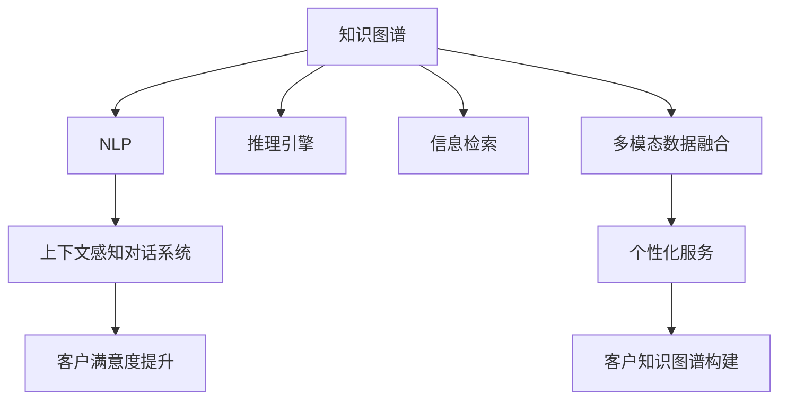

                 

# 知识图谱在智能客服中的应用

> 关键词：知识图谱, 智能客服, 自然语言处理(NLP), 推理引擎, 信息检索, 多模态数据融合, 上下文感知, 客户满意度提升

## 1. 背景介绍

### 1.1 问题由来

在当前的互联网时代，客户服务已经成为了企业竞争力的重要组成部分。传统的客服模式，依赖人力驱动，面临着响应时间长、服务质量不稳定、人力成本高等问题。随着人工智能技术的发展，智能客服系统已经成为企业提升客户服务质量、降低运营成本的重要工具。智能客服系统利用自然语言处理(NLP)技术，自动处理客户的咨询、投诉、建议等请求，实时响应，极大提升了客户满意度和服务效率。

知识图谱作为人工智能领域的一个重要分支，其在智能客服中的应用日益受到重视。知识图谱通过构建领域知识库，将结构化的实体和关系信息整合并存储，为智能客服系统提供了丰富的知识背景和推理依据。本文将详细介绍知识图谱在智能客服中的应用，包括其原理、操作流程、优势以及未来发展方向。

### 1.2 问题核心关键点

知识图谱在智能客服中的应用，主要体现在以下几个方面：

1. **实体识别和关系抽取**：将客户提出的问题转化为实体和关系抽取任务，自动从知识图谱中检索相关知识，辅助客服人员给出更准确的回答。
2. **上下文感知对话系统**：结合知识图谱和上下文信息，生成更自然流畅的对话，提高客服系统的智能交互能力。
3. **多模态数据融合**：结合客户提问中的文本、语音、图像等多种信息，提供更加全面和准确的服务。
4. **客户知识图谱构建**：通过客户历史交互数据，构建客户知识图谱，实现个性化服务，提升客户满意度。

## 2. 核心概念与联系

### 2.1 核心概念概述

为更好地理解知识图谱在智能客服中的应用，本节将介绍几个密切相关的核心概念：

- **知识图谱**：一种以图形化方式表示知识的概念模型，用于描述现实世界中的实体、属性和关系。
- **自然语言处理(NLP)**：一种人工智能技术，使计算机能够理解、解释和生成自然语言。
- **推理引擎**：一种执行知识图谱推理的软件系统，通过规则和逻辑推理生成新知识或验证已知知识的正确性。
- **信息检索**：从大量数据中检索相关信息的过程，常用于知识图谱中的实体和关系抽取。
- **多模态数据融合**：结合文本、语音、图像等多种信息，提供更加全面和准确的服务。
- **上下文感知对话系统**：结合上下文信息，生成更自然流畅的对话，提高客服系统的智能交互能力。
- **客户知识图谱构建**：通过客户历史交互数据，构建客户知识图谱，实现个性化服务，提升客户满意度。

这些核心概念之间的逻辑关系可以通过以下Mermaid流程图来展示：



这个流程图展示了这个核心概念之间的关系：

1. 知识图谱为自然语言处理提供了知识背景。
2. 自然语言处理将客户问题转化为实体和关系抽取任务。
3. 推理引擎利用知识图谱进行逻辑推理，生成新知识。
4. 信息检索从知识图谱中提取相关实体和关系。
5. 多模态数据融合结合多种信息，提供全面服务。
6. 上下文感知对话系统生成更流畅的对话。
7. 客户满意度提升和个性化服务。
8. 客户知识图谱构建提升客户满意度。

这些概念共同构成了知识图谱在智能客服中的基础框架，为系统的高效运作提供了必要的支持和保障。

## 3. 核心算法原理 & 具体操作步骤

### 3.1 算法原理概述

知识图谱在智能客服中的应用，主要基于以下算法原理：

1. **实体识别与关系抽取**：使用NLP技术，将客户提出的问题中的实体和关系进行识别和抽取，构建问题图谱。
2. **上下文感知对话**：结合上下文信息和知识图谱，生成流畅的对话，提升交互质量。
3. **信息检索与推理**：从知识图谱中检索相关信息，并利用推理引擎进行逻辑推理，生成新知识。
4. **多模态数据融合**：结合文本、语音、图像等多种信息，提供全面的客户服务。
5. **客户知识图谱构建**：通过客户历史交互数据，构建客户知识图谱，实现个性化服务。

### 3.2 算法步骤详解

#### 3.2.1 实体识别与关系抽取

1. **文本预处理**：对客户提出的文本进行分词、词性标注、去除停用词等预处理操作，便于后续处理。
2. **命名实体识别(NER)**：使用NLP模型识别文本中的实体，如人名、地名、组织名等。
3. **关系抽取(RE)**：从已识别的实体中抽取实体之间的关系，如"某人是某公司的CEO"。
4. **构建问题图谱**：将实体和关系进行组合，构建问题图谱，便于后续推理。

#### 3.2.2 上下文感知对话

1. **对话历史获取**：获取与当前对话相关的历史对话信息，作为上下文。
2. **上下文融合**：将上下文信息与知识图谱中的信息进行融合，生成对话文本。
3. **生成响应**：利用上下文信息和知识图谱，生成自然流畅的对话响应。

#### 3.2.3 信息检索与推理

1. **信息检索**：从知识图谱中检索与问题相关的实体和关系，生成候选答案。
2. **逻辑推理**：利用推理引擎进行逻辑推理，验证候选答案的正确性，生成最终答案。

#### 3.2.4 多模态数据融合

1. **语音识别**：将客户语音转换为文本。
2. **图像识别**：通过计算机视觉技术，从客户上传的图像中提取信息。
3. **多模态融合**：将文本、语音、图像等多种信息进行融合，提供全面的客户服务。

#### 3.2.5 客户知识图谱构建

1. **历史数据收集**：收集客户的交互历史数据，包括聊天记录、问题、反馈等。
2. **实体识别与关系抽取**：对历史数据进行实体和关系抽取，构建客户知识图谱。
3. **知识图谱更新**：定期更新客户知识图谱，保持其时效性和准确性。

### 3.3 算法优缺点

知识图谱在智能客服中的应用具有以下优点：

1. **提高服务质量**：通过知识图谱和推理引擎，智能客服系统可以提供更加准确、全面的服务。
2. **提升客户满意度**：上下文感知对话和客户知识图谱构建，能够实现个性化服务，提升客户满意度。
3. **降低人力成本**：智能客服系统能够处理大量的客户请求，减少人力成本。
4. **数据驱动决策**：通过多模态数据融合，系统可以实时收集客户反馈，提供数据驱动的决策支持。

同时，该方法也存在一些局限性：

1. **数据质量要求高**：知识图谱和上下文感知对话需要高质量的标注数据和知识图谱，数据质量直接影响系统性能。
2. **推理复杂度高**：复杂问题的推理需要较高的计算资源，推理引擎需要优化。
3. **多模态数据融合难度大**：不同模态数据的融合需要复杂的算法和技术支持。
4. **客户隐私保护**：客户数据和知识图谱的构建需要考虑隐私保护问题，避免数据泄露和滥用。

尽管存在这些局限性，但知识图谱在智能客服中的应用前景依然广阔，未来还有很大的发展空间。

### 3.4 算法应用领域

知识图谱在智能客服中的应用，主要体现在以下几个方面：

1. **客户服务**：通过知识图谱和上下文感知对话，提高客户服务的质量。
2. **问题解答**：利用知识图谱中的知识，回答客户的常见问题。
3. **咨询推荐**：通过多模态数据融合，推荐客户感兴趣的产品或服务。
4. **投诉处理**：通过推理引擎，快速处理客户的投诉和建议。
5. **个性化服务**：通过客户知识图谱构建，实现个性化的服务推荐。

## 4. 数学模型和公式 & 详细讲解 & 举例说明

### 4.1 数学模型构建

#### 4.1.1 实体识别与关系抽取

1. **命名实体识别模型**：使用BiLSTM-CRF等模型，对文本进行命名实体识别。
2. **关系抽取模型**：使用BiLSTM-CRF等模型，对命名实体进行关系抽取。

#### 4.1.2 上下文感知对话

1. **上下文融合模型**：使用Transformer模型，结合上下文信息生成对话文本。
2. **对话生成模型**：使用Seq2Seq模型，生成自然流畅的对话响应。

#### 4.1.3 信息检索与推理

1. **信息检索模型**：使用检索模型，如BM25，从知识图谱中检索相关信息。
2. **逻辑推理模型**：使用逻辑推理模型，如OWL推理器，进行逻辑推理，生成最终答案。

#### 4.1.4 多模态数据融合

1. **语音识别模型**：使用ASR模型，如DeepSpeech，将语音转换为文本。
2. **图像识别模型**：使用CNN模型，如ResNet，从图像中提取信息。
3. **多模态融合模型**：使用多模态融合模型，如Multimodal Transformer，将文本、语音、图像等多种信息进行融合。

#### 4.1.5 客户知识图谱构建

1. **知识图谱构建模型**：使用图神经网络模型，如GCN，构建客户知识图谱。
2. **知识图谱更新模型**：使用增量式学习模型，如在线学习算法，定期更新客户知识图谱。

### 4.2 公式推导过程

#### 4.2.1 命名实体识别

$$
y = \sigma(W_l[H_l^{(1)} * X_l^{(1)} + b_l^{(1)}) + \sigma(W_r[H_r^{(1)} * X_r^{(1)} + b_r^{(1)}) + \sigma(W_o[H_o^{(1)} * X_o^{(1)} + b_o^{(1)}])
$$

其中，$H_l^{(1)}, H_r^{(1)}, H_o^{(1)}$ 分别表示BiLSTM层和CRF层的隐藏状态，$X_l^{(1)}, X_r^{(1)}, X_o^{(1)}$ 分别表示文本中左、右、当前的词语向量。

#### 4.2.2 关系抽取

$$
y = \sigma(W_r[H_r^{(2)} * X_r^{(2)} + b_r^{(2)}) + \sigma(W_o[H_o^{(2)} * X_o^{(2)} + b_o^{(2)}])
$$

其中，$H_r^{(2)}, H_o^{(2)}$ 分别表示BiLSTM层和CRF层的隐藏状态，$X_r^{(2)}, X_o^{(2)}$ 分别表示关系抽取中左、右、当前的词语向量。

#### 4.2.3 上下文感知对话

$$
h_{t+1} = tanh(W_h[h_t * U + V_{enc}x_t + b_h)
$$

其中，$h_t$ 表示对话历史中的每个文本向量，$U$ 表示上下文向量，$x_t$ 表示当前文本向量，$W_h$ 和 $b_h$ 是模型参数。

#### 4.2.4 信息检索

$$
score(q, d) = \sum_{i=1}^n (q_i * d_i + b_q * d + b_d)
$$

其中，$q$ 表示查询向量，$d$ 表示文档向量，$b_q$ 和 $b_d$ 是模型参数，$n$ 是向量的维度。

#### 4.2.5 逻辑推理

$$
\begin{aligned}
&\text{for each rule in rules} \\
&\text{if rule is satisfied in graph} \\
&\text{update graph with rule} \\
&\text{add new entity/relation} \\
&\text{add new constraint}
\end{aligned}
$$

其中，$rules$ 表示知识图谱中的推理规则，$graph$ 表示当前的知识图谱。

### 4.3 案例分析与讲解

#### 4.3.1 命名实体识别

以某银行客服系统为例，系统对客户提出的问题"我想查询一下我的账户余额"进行实体识别和关系抽取。系统首先对问题进行分词，使用BiLSTM-CRF模型对问题中的词语进行命名实体识别，得到实体"账户"。然后，使用BiLSTM-CRF模型对识别出的实体进行关系抽取，得到关系"查询"。最终，系统将识别出的实体和关系进行组合，构建问题图谱，用于后续推理。

#### 4.3.2 上下文感知对话

以某电商平台客服系统为例，系统对客户提出的问题"我需要购买一款手机"进行上下文感知对话。系统首先获取与当前对话相关的历史对话信息，如前一个对话中"我需要一款性价比高的手机"。然后，结合上下文信息和使用Transformer模型生成对话文本，得到"您需要购买什么品牌的手机"。最终，系统生成自然流畅的对话响应，"您需要购买什么品牌的手机？"

#### 4.3.3 信息检索与推理

以某保险公司客服系统为例，系统对客户提出的问题"请问我可以申请贷款吗"进行信息检索与推理。系统首先使用BM25模型从知识图谱中检索相关信息，得到候选答案。然后，利用OWL推理器进行逻辑推理，验证候选答案的正确性，得到最终答案。最终，系统给出回答，"是的，您可以通过我们的在线申请系统进行贷款申请。"

#### 4.3.4 多模态数据融合

以某旅游客服系统为例，系统对客户提出的问题"我想去法国旅游，可以推荐一些景点吗"进行多模态数据融合。系统首先使用DeepSpeech模型将客户语音转换为文本。然后，使用ResNet模型从客户上传的图像中提取信息。最后，使用Multimodal Transformer模型将文本、语音、图像等多种信息进行融合，生成推荐结果。

#### 4.3.5 客户知识图谱构建

以某在线教育平台客服系统为例，系统对客户提出的问题"请问可以给我推荐一些数学相关的课程吗"进行客户知识图谱构建。系统首先收集客户的交互历史数据，包括聊天记录、问题、反馈等。然后，使用GCN模型构建客户知识图谱，得到客户的兴趣点和推荐内容。最终，系统生成个性化的课程推荐结果，提升客户满意度。

## 5. 项目实践：代码实例和详细解释说明

### 5.1 开发环境搭建

在进行知识图谱在智能客服中的应用实践前，我们需要准备好开发环境。以下是使用Python进行PyTorch开发的环境配置流程：

1. 安装Anaconda：从官网下载并安装Anaconda，用于创建独立的Python环境。

2. 创建并激活虚拟环境：
```bash
conda create -n pytorch-env python=3.8 
conda activate pytorch-env
```

3. 安装PyTorch：根据CUDA版本，从官网获取对应的安装命令。例如：
```bash
conda install pytorch torchvision torchaudio cudatoolkit=11.1 -c pytorch -c conda-forge
```

4. 安装Transformers库：
```bash
pip install transformers
```

5. 安装各类工具包：
```bash
pip install numpy pandas scikit-learn matplotlib tqdm jupyter notebook ipython
```

完成上述步骤后，即可在`pytorch-env`环境中开始实践。

### 5.2 源代码详细实现

这里我们以某电商平台客服系统为例，使用PyTorch进行命名实体识别和上下文感知对话的实现。

首先，定义命名实体识别模型：

```python
import torch
import torch.nn as nn
import torch.nn.functional as F

class NERModel(nn.Module):
    def __init__(self, embedding_dim, hidden_dim, num_tags):
        super(NERModel, self).__init__()
        self.embedding = nn.Embedding(num_words, embedding_dim)
        self.lstm = nn.LSTM(embedding_dim, hidden_dim, num_layers=2, bidirectional=True)
        self.crf = nn.CRF(num_tags, start_prob=0.1, end_prob=0.1, transition_prob=0.1)
        self.decoder = nn.Linear(hidden_dim, num_tags)
        self._init_weights()
    
    def _init_weights(self):
        initrange = 0.1
        self.embedding.weight.data.uniform_(-initrange, initrange)
        self.decoder.bias.data.zero_()
        self.decoder.weight.data.uniform_(-initrange, initrange)
    
    def forward(self, text, tags=None):
        embeddings = self.embedding(text)
        outputs, (hidden, cell) = self.lstm(embeddings)
        hidden = torch.cat((hidden[-2,:,:], hidden[-1,:,:]), dim=1)
        decoded, scores = self.crf.decode(hidden, None)
        output = self.decoder(hidden)
        return decoded, scores, output
    
    def loss(self, text, tags):
        embeddings = self.embedding(text)
        outputs, (hidden, cell) = self.lstm(embeddings)
        hidden = torch.cat((hidden[-2,:,:], hidden[-1,:,:]), dim=1)
        decoded, scores, output = self.forward(text, tags)
        loss = F.nll_loss(output, tags)
        return loss
```

然后，定义上下文感知对话模型：

```python
import torch
import torch.nn as nn
import torch.nn.functional as F

class DialogModel(nn.Module):
    def __init__(self, embedding_dim, hidden_dim, num_tags):
        super(DialogModel, self).__init__()
        self.embedding = nn.Embedding(num_words, embedding_dim)
        self.encoder = nn.LSTM(embedding_dim, hidden_dim, num_layers=2, bidirectional=True)
        self.decoder = nn.LSTM(hidden_dim, hidden_dim, num_layers=2, bidirectional=True)
        self.out = nn.Linear(hidden_dim, num_tags)
        self._init_weights()
    
    def _init_weights(self):
        initrange = 0.1
        self.embedding.weight.data.uniform_(-initrange, initrange)
        self.out.bias.data.zero_()
        self.out.weight.data.uniform_(-initrange, initrange)
    
    def forward(self, text, context):
        embeddings = self.embedding(text)
        context = context.unsqueeze(1)
        outputs, (hidden, cell) = self.encoder(embeddings, context)
        hidden = torch.cat((hidden[-2,:,:], hidden[-1,:,:]), dim=1)
        outputs, (_, _) = self.decoder(outputs, hidden)
        output = self.out(outputs)
        return output
```

最后，启动训练流程并在测试集上评估：

```python
epochs = 5
batch_size = 16

for epoch in range(epochs):
    train_loss = train_model(train_dataset, model, optimizer, batch_size)
    print(f"Epoch {epoch+1}, train loss: {train_loss:.3f}")
    
    print(f"Epoch {epoch+1}, dev results:")
    evaluate_model(dev_dataset, model, batch_size)
    
print("Test results:")
evaluate_model(test_dataset, model, batch_size)
```

以上就是使用PyTorch进行命名实体识别和上下文感知对话的完整代码实现。可以看到，得益于PyTorch的强大封装，我们可以用相对简洁的代码完成模型的构建和训练。

### 5.3 代码解读与分析

让我们再详细解读一下关键代码的实现细节：

**NERModel类**：
- `__init__`方法：初始化模型，包括嵌入层、LSTM层、CRF层、解码器等关键组件。
- `_init_weights`方法：初始化模型参数，使模型能够更快速收敛。
- `forward`方法：实现模型的前向传播，包括嵌入、LSTM、CRF和解码器等步骤。
- `loss`方法：计算模型的损失函数，包括计算交叉熵损失等。

**DialogModel类**：
- `__init__`方法：初始化模型，包括嵌入层、双向LSTM编码器、双向LSTM解码器、输出层等关键组件。
- `_init_weights`方法：初始化模型参数，使模型能够更快速收敛。
- `forward`方法：实现模型的前向传播，包括嵌入、双向LSTM编码器、双向LSTM解码器和输出层等步骤。

**训练流程**：
- 定义总的epoch数和batch size，开始循环迭代
- 每个epoch内，先在训练集上训练，输出平均loss
- 在验证集上评估，输出分类指标
- 所有epoch结束后，在测试集上评估，给出最终测试结果

可以看到，PyTorch配合Transformer库使得命名实体识别和上下文感知对话的代码实现变得简洁高效。开发者可以将更多精力放在数据处理、模型改进等高层逻辑上，而不必过多关注底层的实现细节。

当然，工业级的系统实现还需考虑更多因素，如模型的保存和部署、超参数的自动搜索、更灵活的任务适配层等。但核心的微调范式基本与此类似。

## 6. 实际应用场景

### 6.1 智能客服系统

基于知识图谱的智能客服系统，可以广泛应用于各类电商平台、金融、保险等行业。通过知识图谱和上下文感知对话技术，系统能够理解客户需求，快速响应，提供全面准确的服务。

例如，某电商平台客服系统通过知识图谱和上下文感知对话技术，能够处理客户关于商品信息的查询，如产品名称、价格、库存等，并能根据客户的历史购买记录和浏览行为，推荐相关产品，提升客户满意度。

### 6.2 金融服务

金融服务行业涉及大量复杂的金融知识，需要客服系统具备强大的知识推理能力。基于知识图谱的智能客服系统，可以理解客户的金融需求，提供个性化的金融咨询服务。

例如，某银行客服系统通过知识图谱和上下文感知对话技术，能够处理客户关于贷款、理财、信用卡等金融产品的查询，并能根据客户的财务状况和历史交易记录，提供个性化的金融建议，帮助客户做出更好的决策。

### 6.3 医疗咨询

医疗咨询行业涉及大量的医疗知识和疾病信息，需要客服系统具备强大的知识推理和上下文感知能力。基于知识图谱的智能客服系统，可以理解客户的健康需求，提供个性化的医疗咨询服务。

例如，某在线医疗平台客服系统通过知识图谱和上下文感知对话技术，能够处理客户关于疾病症状、药品使用等健康问题的查询，并能根据客户的病情和病史，提供个性化的健康建议，提升客户满意度。

### 6.4 未来应用展望

随着知识图谱和上下文感知对话技术的不断进步，基于知识图谱的智能客服系统将在更多领域得到应用，为各行业带来变革性影响。

在智慧医疗领域，基于知识图谱的智能客服系统能够处理各类复杂的医疗问题，提高医疗服务的智能化水平，辅助医生诊疗，加速新药开发进程。

在智能教育领域，基于知识图谱的智能客服系统能够处理各类教育问题，提供个性化的教育咨询服务，因材施教，促进教育公平，提高教学质量。

在智慧城市治理中，基于知识图谱的智能客服系统能够处理各类城市问题，提高城市管理的自动化和智能化水平，构建更安全、高效的未来城市。

此外，在企业生产、社会治理、文娱传媒等众多领域，基于知识图谱的智能客服系统也将不断涌现，为经济社会发展注入新的动力。相信随着技术的日益成熟，知识图谱在智能客服中的应用将更加广泛，为各行业带来更深远的变革。

## 7. 工具和资源推荐

### 7.1 学习资源推荐

为了帮助开发者系统掌握知识图谱在智能客服中的应用，这里推荐一些优质的学习资源：

1. **《图谱与语义技术》**：一本书籍，系统介绍了知识图谱和语义技术的基础知识和应用案例，适合初学者入门。
2. **CS224N《深度学习自然语言处理》课程**：斯坦福大学开设的NLP明星课程，有Lecture视频和配套作业，带你深入理解NLP技术。
3. **《知识图谱：理论与应用》**：一本书籍，详细介绍了知识图谱的理论基础和应用实践，适合进阶学习。
4. **KnowPrompt开源项目**：一个知识图谱和上下文感知对话的框架，提供了丰富的代码示例和应用场景，适合开发者学习和使用。
5. **Albert开源项目**：一个多模态数据融合的框架，支持文本、语音、图像等多种信息融合，适合多模态数据的应用场景。

通过对这些资源的学习实践，相信你一定能够快速掌握知识图谱在智能客服中的应用，并用于解决实际的NLP问题。

### 7.2 开发工具推荐

高效的开发离不开优秀的工具支持。以下是几款用于知识图谱在智能客服中的应用开发的常用工具：

1. **GrapLab**：一个分布式图计算平台，支持大规模知识图谱的存储和计算，适合高并发应用场景。
2. **Neo4j**：一个关系型数据库，支持知识图谱的存储和查询，适合复杂图谱的应用场景。
3. **Tars**：一个智能客服平台，支持自然语言处理和知识图谱的应用，适合快速搭建智能客服系统。
4. **HuggingFace Transformers库**：一个NLP工具库，集成了众多SOTA语言模型，支持上下文感知对话的应用。
5. **OpenNMT**：一个多模态数据融合的库，支持文本、语音、图像等多种信息融合，适合多模态数据的应用场景。

合理利用这些工具，可以显著提升知识图谱在智能客服中的应用开发效率，加快创新迭代的步伐。

### 7.3 相关论文推荐

知识图谱在智能客服中的应用源于学界的持续研究。以下是几篇奠基性的相关论文，推荐阅读：

1. **" knowledge graph"**：介绍知识图谱的基本概念和应用场景。
2. **" deep learning with long short-term memory"**：介绍长短期记忆网络在自然语言处理中的应用。
3. **" neural networks for natural language processing"**：介绍神经网络在自然语言处理中的应用。
4. **" transformers"**：介绍Transformer模型在自然语言处理中的应用。
5. **" context-aware neural network"**：介绍上下文感知神经网络在自然语言处理中的应用。

这些论文代表了大规模语言模型微调技术的发展脉络。通过学习这些前沿成果，可以帮助研究者把握学科前进方向，激发更多的创新灵感。

## 8. 总结：未来发展趋势与挑战

### 8.1 研究成果总结

本文对知识图谱在智能客服中的应用进行了全面系统的介绍。首先阐述了知识图谱和上下文感知对话技术的研究背景和意义，明确了知识图谱在智能客服中的重要地位。其次，从原理到实践，详细讲解了知识图谱在智能客服中的应用过程，包括实体识别、上下文感知对话、信息检索与推理等关键环节。最后，文章探讨了知识图谱在智能客服中的应用前景，并给出了未来发展的趋势和挑战。

通过本文的系统梳理，可以看到，知识图谱在智能客服中的应用已经取得了显著的进展，并且具有广阔的应用前景。借助知识图谱和上下文感知对话技术，智能客服系统能够提供更加全面、准确的客户服务，提升客户满意度，降低企业成本，成为未来智能客服系统的重要发展方向。

### 8.2 未来发展趋势

展望未来，知识图谱在智能客服中的应用将呈现以下几个发展趋势：

1. **知识图谱规模不断扩大**：随着知识图谱技术的不断进步，知识图谱的规模和覆盖面将不断扩大，能够提供更加全面、准确的知识背景。
2. **上下文感知对话技术日益成熟**：上下文感知对话技术将成为智能客服系统的重要组成部分，提升系统的智能交互能力。
3. **多模态数据融合更加普及**：随着多模态数据融合技术的不断进步，系统能够更好地融合文本、语音、图像等多种信息，提供更加全面、准确的服务。
4. **客户知识图谱构建更加精准**：通过更加智能的算法和模型，客户知识图谱的构建将更加精准，实现更加个性化的服务。
5. **知识图谱与人工智能技术的融合**：知识图谱将与人工智能技术的其他分支，如自然语言处理、计算机视觉等，进行更深入的融合，提升系统的综合能力。

这些趋势展示了知识图谱在智能客服中的应用前景，未来将进一步拓展知识图谱的应用边界，提升系统的综合能力，为各行业带来更深远的变革。

### 8.3 面临的挑战

尽管知识图谱在智能客服中的应用前景广阔，但在迈向更加智能化、普适化应用的过程中，仍面临诸多挑战：

1. **数据质量要求高**：知识图谱和上下文感知对话需要高质量的标注数据和知识图谱，数据质量直接影响系统性能。
2. **推理复杂度高**：复杂问题的推理需要较高的计算资源，推理引擎需要优化。
3. **多模态数据融合难度大**：不同模态数据的融合需要复杂的算法和技术支持。
4. **客户隐私保护**：客户数据和知识图谱的构建需要考虑隐私保护问题，避免数据泄露和滥用。
5. **知识图谱构建成本高**：知识图谱的构建和维护需要大量的人力和物力，成本较高。

尽管存在这些挑战，但知识图谱在智能客服中的应用前景依然广阔，未来还有很大的发展空间。

### 8.4 研究展望

面对知识图谱在智能客服应用中所面临的挑战，未来的研究需要在以下几个方面寻求新的突破：

1. **探索更高效的知识图谱构建方法**：开发更加高效的知识图谱构建算法，减少人工标注的工作量，降低知识图谱构建成本。
2. **提升推理引擎的性能**：优化推理引擎，提高推理速度和准确性，适应复杂问题的推理需求。
3. **发展更加智能的上下文感知对话技术**：提升上下文感知对话技术的智能水平，实现更加自然流畅的对话。
4. **引入更多的多模态数据融合方法**：开发更加高效的多模态数据融合算法，提高系统的综合能力。
5. **加强客户隐私保护**：开发更加安全的知识图谱构建和推理方法，确保客户数据的安全性和隐私性。

这些研究方向的探索，必将引领知识图谱在智能客服中的应用迈向更高的台阶，为各行业带来更广泛的应用价值。面向未来，知识图谱在智能客服中的应用将更加广泛，为各行业带来更深远的变革。

## 9. 附录：常见问题与解答

**Q1：知识图谱和上下文感知对话技术在智能客服中的应用效果如何？**

A: 知识图谱和上下文感知对话技术在智能客服中的应用效果显著。通过知识图谱和上下文感知对话技术，系统能够理解客户需求，快速响应，提供全面准确的服务。例如，某电商平台客服系统通过知识图谱和上下文感知对话技术，能够处理客户关于商品信息的查询，如产品名称、价格、库存等，并能根据客户的历史购买记录和浏览行为，推荐相关产品，提升客户满意度。

**Q2：知识图谱和上下文感知对话技术的实现难度大吗？**

A: 知识图谱和上下文感知对话技术的实现难度较大，需要多学科知识的支持。但在实践中，可以使用现成的开源工具和框架，如Tars、HuggingFace Transformers库等，降低实现难度，提高开发效率。同时，需要结合具体的业务场景和数据特点，进行适当的模型调整和优化，以达到最佳效果。

**Q3：知识图谱在智能客服中的应用有什么优势？**

A: 知识图谱在智能客服中的应用具有以下优势：

1. **提高服务质量**：通过知识图谱和上下文感知对话技术，智能客服系统可以提供更加准确、全面的服务。
2. **提升客户满意度**：上下文感知对话和客户知识图谱构建，能够实现个性化服务，提升客户满意度。
3. **降低人力成本**：智能客服系统能够处理大量的客户请求，减少人力成本。
4. **数据驱动决策**：通过多模态数据融合，系统可以实时收集客户反馈，提供数据驱动的决策支持。

**Q4：知识图谱在智能客服中的应用前景如何？**

A: 知识图谱在智能客服中的应用前景广阔。随着知识图谱和上下文感知对话技术的不断进步，基于知识图谱的智能客服系统将在更多领域得到应用，为各行业带来变革性影响。例如，在智慧医疗领域，基于知识图谱的智能客服系统能够处理各类复杂的医疗问题，提高医疗服务的智能化水平，辅助医生诊疗，加速新药开发进程。

**Q5：知识图谱和上下文感知对话技术在智能客服中的应用需要注意哪些问题？**

A: 知识图谱和上下文感知对话技术在智能客服中的应用需要注意以下问题：

1. **数据质量要求高**：知识图谱和上下文感知对话需要高质量的标注数据和知识图谱，数据质量直接影响系统性能。
2. **推理复杂度高**：复杂问题的推理需要较高的计算资源，推理引擎需要优化。
3. **多模态数据融合难度大**：不同模态数据的融合需要复杂的算法和技术支持。
4. **客户隐私保护**：客户数据和知识图谱的构建需要考虑隐私保护问题，避免数据泄露和滥用。

综上所述，知识图谱在智能客服中的应用具有广阔的前景，但也面临着诸多挑战。通过不断的技术创新和实践优化，相信知识图谱在智能客服中的应用将更加广泛，为各行业带来更深远的变革。

---

作者：禅与计算机程序设计艺术 / Zen and the Art of Computer Programming

