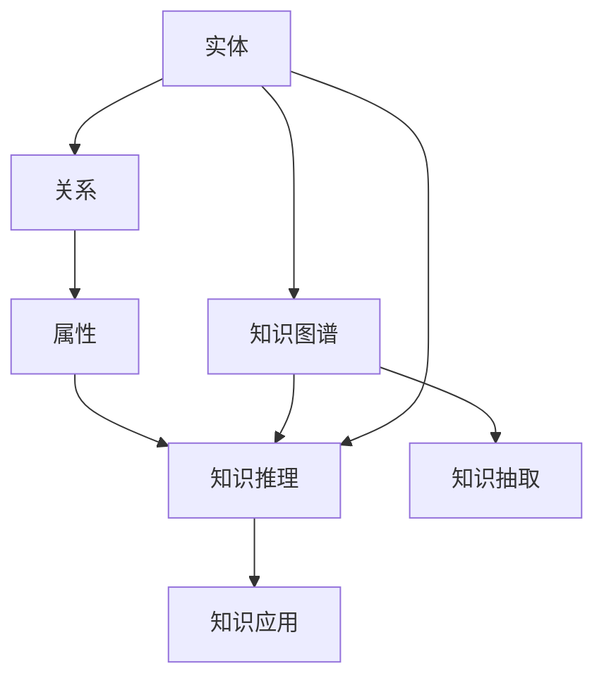

                 

# 知识图谱：知识发现引擎的蓝图

## 1. 背景介绍

### 1.1 问题由来

随着大数据时代的到来，互联网信息量的爆炸式增长使得传统的信息检索技术难以应对。搜索引擎、推荐系统等传统信息检索技术依赖于关键词匹配，无法理解信息的语义和内在联系。因此，迫切需要一种新的技术，能够实现从海量数据中发现和组织知识，从而提升信息检索和知识发现的能力。

知识图谱（Knowledge Graph）应运而生，它通过语义化的方式将信息表示为三元组（实体、关系、实体）的形式，构建出结构化的知识体系，从而能够理解信息的内在联系，并支持复杂的知识查询和推理。

### 1.2 问题核心关键点

知识图谱的核心关键点包括以下几个方面：

- 知识表示：如何将实体、关系、属性等信息表示成结构化的形式。
- 知识获取：如何自动获取知识图谱中的实体和关系。
- 知识推理：如何利用知识图谱进行知识推理和逻辑判断。
- 知识应用：如何将知识图谱应用于实际问题，如信息检索、推荐系统等。

## 2. 核心概念与联系

### 2.1 核心概念概述

为更好地理解知识图谱，本节将介绍几个密切相关的核心概念：

- 实体（Entity）：知识图谱中的基本单元，代表具体的对象或概念。
- 关系（Relation）：实体之间的连接方式，描述实体之间的语义关系。
- 属性（Attribute）：实体或关系的具体属性，如年龄、性别等。
- 知识图谱（Knowledge Graph）：由实体、关系和属性构成，描述知识库中的概念及其关系的结构化形式。
- 知识抽取（Knowledge Extraction）：从非结构化数据中自动提取实体和关系，构建知识图谱的过程。
- 知识推理（Knowledge Reasoning）：利用知识图谱中的信息进行推理和逻辑判断，获取新的知识或验证现有知识的过程。

这些核心概念之间的逻辑关系可以通过以下Mermaid流程图来展示：



这个流程图展示了一系列核心概念之间的联系：

1. 实体通过关系连接，形成知识图谱。
2. 属性可以增加实体的细节信息。
3. 知识推理利用知识图谱中的信息，获取新的知识或验证现有知识。
4. 知识抽取从非结构化数据中提取实体和关系，构建知识图谱。
5. 知识应用将知识图谱应用于实际问题，如信息检索、推荐系统等。

这些概念共同构成了知识图谱的知识发现引擎，使得其能够从海量数据中自动发现和组织知识，提升信息检索和知识发现的能力。

## 3. 核心算法原理 & 具体操作步骤
### 3.1 算法原理概述

知识图谱的构建和应用主要基于以下算法：

- 知识抽取算法：从非结构化数据中自动提取实体和关系，构建知识图谱。
- 知识推理算法：利用知识图谱中的信息进行推理和逻辑判断，获取新的知识或验证现有知识。

### 3.2 算法步骤详解

#### 3.2.1 知识抽取算法

知识抽取算法主要分为两类：基于规则的抽取和基于机器学习的抽取。

1. 基于规则的抽取：
   - 定义规则模板，如“某公司成立年份为XXX年”。
   - 根据规则模板从文本中匹配实体和关系。
   - 自动填充到知识图谱中。

2. 基于机器学习的抽取：
   - 使用序列标注、命名实体识别等技术，自动标记文本中的实体和关系。
   - 使用分类器或聚类算法，将标记结果转化为知识图谱中的实体和关系。

#### 3.2.2 知识推理算法

知识推理算法主要包括以下几种：

1. 基于逻辑的推理：
   - 定义逻辑规则，如“如果A和B有R关系，且C和B有S关系，则A和C有R和S关系的组合”。
   - 利用规则引擎或逻辑推理器，根据知识图谱中的信息进行推理。

2. 基于深度学习的推理：
   - 使用神经网络结构，如基于图神经网络的GNN，对知识图谱进行建模。
   - 利用模型学习知识图谱中的关系，进行推理和预测。

### 3.3 算法优缺点

知识图谱在提升信息检索和知识发现能力方面具有以下优点：

- 结构化表示：知识图谱通过结构化的方式表示实体和关系，便于理解和应用。
- 语义推理：知识图谱能够理解语义关系，进行更精确的信息检索和知识推理。
- 自动化获取：知识图谱能够自动从非结构化数据中抽取实体和关系，降低人工成本。

同时，知识图谱也存在一些局限性：

- 数据获取困难：知识图谱需要大量的高质量数据，数据获取成本较高。
- 构建复杂：知识图谱的构建过程需要定义规则模板或训练模型，具有一定的复杂性。
- 更新难度大：知识图谱更新需要重新抽取和推理，成本较高。
- 解释性不足：知识图谱的逻辑和推理过程较为复杂，难以解释其内部工作机制。

### 3.4 算法应用领域

知识图谱在多个领域得到了广泛应用，包括：

- 信息检索：通过知识图谱进行实体识别和关系匹配，提升检索结果的相关性和准确性。
- 推荐系统：利用知识图谱中的实体和关系进行推荐，如商品推荐、内容推荐等。
- 自然语言处理：利用知识图谱进行语义分析和实体识别，提升语言处理的准确性。
- 医疗信息：通过知识图谱进行疾病推理和药物推荐，辅助医疗决策。
- 金融分析：利用知识图谱进行市场分析和风险预测，提升金融决策的准确性。

## 4. 数学模型和公式 & 详细讲解 & 举例说明

### 4.1 数学模型构建

知识图谱的数学模型主要由三元组和图结构构成，记为：

$$ G = (E, R, T) $$

其中：

- $E$：实体集合。
- $R$：关系集合。
- $T$：三元组集合。

每个三元组可以表示为 $(E, R, E)$，即（实体1，关系，实体2）的形式。

### 4.2 公式推导过程

以信息检索为例，假设有知识图谱 $G$，查询 $q$ 需要检索的实体 $e_q$ 和关系 $r_q$，则查询的数学模型可以表示为：

$$ \text{Relevance} = f(e_q, r_q, G) $$

其中 $f$ 表示查询相关性函数，可以是一个基于图结构的函数，也可以是一个基于深度学习的函数。

### 4.3 案例分析与讲解

以谷歌知识图谱为例，谷歌知识图谱通过自动化的知识抽取和推理，实现了从海量数据中自动发现和组织知识。谷歌使用基于神经网络的深度学习算法，对大规模文本数据进行实体识别和关系抽取，构建出结构化的知识图谱。

在信息检索方面，谷歌知识图谱将实体和关系转换为向量，通过向量相似度匹配进行实体识别和关系匹配。谷歌的知识图谱还支持多种查询方式，如自然语言查询、图像查询等，进一步提升了信息检索的能力。

## 5. 项目实践：代码实例和详细解释说明

### 5.1 开发环境搭建

在进行知识图谱开发前，我们需要准备好开发环境。以下是使用Python进行PyTorch开发的环境配置流程：

1. 安装Anaconda：从官网下载并安装Anaconda，用于创建独立的Python环境。

2. 创建并激活虚拟环境：
```bash
conda create -n knowledge-env python=3.8 
conda activate knowledge-env
```

3. 安装PyTorch：根据CUDA版本，从官网获取对应的安装命令。例如：
```bash
conda install pytorch torchvision torchaudio cudatoolkit=11.1 -c pytorch -c conda-forge
```

4. 安装TensorBoard：
```bash
pip install tensorboard
```

完成上述步骤后，即可在`knowledge-env`环境中开始知识图谱开发。

### 5.2 源代码详细实现

下面我们以实体识别和关系抽取为例，给出使用PyTorch进行知识图谱开发的PyTorch代码实现。

首先，定义实体识别任务的数据处理函数：

```python
import torch
import torch.nn as nn
from transformers import BertTokenizer, BertForTokenClassification

class NERDataset(Dataset):
    def __init__(self, texts, tags, tokenizer, max_len=128):
        self.texts = texts
        self.tags = tags
        self.tokenizer = tokenizer
        self.max_len = max_len
        
    def __len__(self):
        return len(self.texts)
    
    def __getitem__(self, item):
        text = self.texts[item]
        tags = self.tags[item]
        
        encoding = self.tokenizer(text, return_tensors='pt', max_length=self.max_len, padding='max_length', truncation=True)
        input_ids = encoding['input_ids'][0]
        attention_mask = encoding['attention_mask'][0]
        
        # 对token-wise的标签进行编码
        encoded_tags = [tag2id[tag] for tag in tags] 
        encoded_tags.extend([tag2id['O']] * (self.max_len - len(encoded_tags)))
        labels = torch.tensor(encoded_tags, dtype=torch.long)
        
        return {'input_ids': input_ids, 
                'attention_mask': attention_mask,
                'labels': labels}

# 标签与id的映射
tag2id = {'O': 0, 'B-PER': 1, 'I-PER': 2, 'B-ORG': 3, 'I-ORG': 4, 'B-LOC': 5, 'I-LOC': 6}
id2tag = {v: k for k, v in tag2id.items()}

# 创建dataset
tokenizer = BertTokenizer.from_pretrained('bert-base-cased')

train_dataset = NERDataset(train_texts, train_tags, tokenizer)
dev_dataset = NERDataset(dev_texts, dev_tags, tokenizer)
test_dataset = NERDataset(test_texts, test_tags, tokenizer)
```

然后，定义模型和优化器：

```python
from transformers import BertForTokenClassification, AdamW

model = BertForTokenClassification.from_pretrained('bert-base-cased', num_labels=len(tag2id))

optimizer = AdamW(model.parameters(), lr=2e-5)
```

接着，定义训练和评估函数：

```python
from torch.utils.data import DataLoader
from tqdm import tqdm
from sklearn.metrics import classification_report

device = torch.device('cuda') if torch.cuda.is_available() else torch.device('cpu')
model.to(device)

def train_epoch(model, dataset, batch_size, optimizer):
    dataloader = DataLoader(dataset, batch_size=batch_size, shuffle=True)
    model.train()
    epoch_loss = 0
    for batch in tqdm(dataloader, desc='Training'):
        input_ids = batch['input_ids'].to(device)
        attention_mask = batch['attention_mask'].to(device)
        labels = batch['labels'].to(device)
        model.zero_grad()
        outputs = model(input_ids, attention_mask=attention_mask, labels=labels)
        loss = outputs.loss
        epoch_loss += loss.item()
        loss.backward()
        optimizer.step()
    return epoch_loss / len(dataloader)

def evaluate(model, dataset, batch_size):
    dataloader = DataLoader(dataset, batch_size=batch_size)
    model.eval()
    preds, labels = [], []
    with torch.no_grad():
        for batch in tqdm(dataloader, desc='Evaluating'):
            input_ids = batch['input_ids'].to(device)
            attention_mask = batch['attention_mask'].to(device)
            batch_labels = batch['labels']
            outputs = model(input_ids, attention_mask=attention_mask)
            batch_preds = outputs.logits.argmax(dim=2).to('cpu').tolist()
            batch_labels = batch_labels.to('cpu').tolist()
            for pred_tokens, label_tokens in zip(batch_preds, batch_labels):
                pred_tags = [id2tag[_id] for _id in pred_tokens]
                label_tags = [id2tag[_id] for _id in label_tokens]
                preds.append(pred_tags[:len(label_tags)])
                labels.append(label_tags)
                
    print(classification_report(labels, preds))
```

最后，启动训练流程并在测试集上评估：

```python
epochs = 5
batch_size = 16

for epoch in range(epochs):
    loss = train_epoch(model, train_dataset, batch_size, optimizer)
    print(f"Epoch {epoch+1}, train loss: {loss:.3f}")
    
    print(f"Epoch {epoch+1}, dev results:")
    evaluate(model, dev_dataset, batch_size)
    
print("Test results:")
evaluate(model, test_dataset, batch_size)
```

以上就是使用PyTorch对BERT进行实体识别任务微调的完整代码实现。可以看到，得益于Transformers库的强大封装，我们可以用相对简洁的代码完成BERT模型的加载和微调。

### 5.3 代码解读与分析

让我们再详细解读一下关键代码的实现细节：

**NERDataset类**：
- `__init__`方法：初始化文本、标签、分词器等关键组件。
- `__len__`方法：返回数据集的样本数量。
- `__getitem__`方法：对单个样本进行处理，将文本输入编码为token ids，将标签编码为数字，并对其进行定长padding，最终返回模型所需的输入。

**tag2id和id2tag字典**：
- 定义了标签与数字id之间的映射关系，用于将token-wise的预测结果解码回真实的标签。

**训练和评估函数**：
- 使用PyTorch的DataLoader对数据集进行批次化加载，供模型训练和推理使用。
- 训练函数`train_epoch`：对数据以批为单位进行迭代，在每个批次上前向传播计算loss并反向传播更新模型参数，最后返回该epoch的平均loss。
- 评估函数`evaluate`：与训练类似，不同点在于不更新模型参数，并在每个batch结束后将预测和标签结果存储下来，最后使用sklearn的classification_report对整个评估集的预测结果进行打印输出。

**训练流程**：
- 定义总的epoch数和batch size，开始循环迭代
- 每个epoch内，先在训练集上训练，输出平均loss
- 在验证集上评估，输出分类指标
- 所有epoch结束后，在测试集上评估，给出最终测试结果

可以看到，PyTorch配合Transformers库使得BERT微调的代码实现变得简洁高效。开发者可以将更多精力放在数据处理、模型改进等高层逻辑上，而不必过多关注底层的实现细节。

当然，工业级的系统实现还需考虑更多因素，如模型的保存和部署、超参数的自动搜索、更灵活的任务适配层等。但核心的微调范式基本与此类似。

## 6. 实际应用场景
### 6.1 智能客服系统

知识图谱在智能客服系统的构建中有着广泛的应用。传统的客服系统依赖于规则引擎和知识库，难以处理复杂多变的问题。知识图谱通过自动抽取和推理，能够理解客户的需求，提供个性化的服务，提升客服的效率和满意度。

在技术实现上，可以构建客户知识图谱，包含客户基本信息、历史交易记录、常见问题等信息。在客户咨询时，通过文本分析技术将客户问题转化为实体和关系，利用知识图谱进行匹配和推理，自动生成最佳答案，并推送给客户。系统还可以记录客户的反馈和问题类型，不断更新和优化知识图谱，提升服务的质量和效率。

### 6.2 金融舆情监测

在金融领域，舆情监测是风险控制和投资决策的重要环节。传统的人工监测方式耗时耗力，难以实时处理海量数据。知识图谱能够自动抽取和分析金融领域的实体和关系，构建出结构化的知识体系，从而支持实时的舆情监测和风险预警。

具体而言，可以构建金融知识图谱，包含股票、债券、商品、事件等信息。利用知识图谱进行舆情分析，可以实时监测市场动向，识别潜在的风险点，提前采取应对措施，降低投资风险。知识图谱还可以支持投资者教育，提供实时的市场分析和投资建议，提升投资决策的准确性。

### 6.3 个性化推荐系统

个性化推荐系统依赖于用户行为数据的分析和建模。传统的推荐系统往往难以理解用户的真实需求，导致推荐结果的相关性和多样性不足。知识图谱能够自动抽取和推理用户的兴趣和偏好，构建出个性化的推荐模型，提升推荐结果的质量和多样性。

在技术实现上，可以构建用户知识图谱，包含用户的浏览记录、购买记录、评分记录等信息。利用知识图谱进行推荐，可以综合考虑用户的兴趣、行为和属性，生成个性化的推荐列表。同时，知识图谱还可以支持商品知识图谱的构建，包含商品的属性、分类、关系等信息，进一步提升推荐结果的准确性和多样性。

### 6.4 未来应用展望

随着知识图谱技术的不断进步，其在更多领域的应用前景将更加广阔。

在智慧医疗领域，知识图谱可以用于病历分析、医学知识查询、药物研发等环节，辅助医生诊疗，加速新药开发进程。知识图谱还能够构建疾病知识图谱，包含疾病症状、治疗方案、药物相互作用等信息，提升疾病诊断和治疗的准确性和效率。

在智能教育领域，知识图谱可以用于智能教学、作业批改、知识推荐等方面，因材施教，促进教育公平，提高教学质量。知识图谱还可以构建课程知识图谱，包含课程内容、教师信息、学生信息等信息，提升教学管理的效率和效果。

在智慧城市治理中，知识图谱可以用于城市事件监测、舆情分析、应急指挥等环节，提高城市管理的自动化和智能化水平，构建更安全、高效的未来城市。知识图谱还可以构建城市基础设施知识图谱，包含道路、桥梁、公共设施等信息，提升城市规划和管理的效率和效果。

此外，在企业生产、社会治理、文娱传媒等众多领域，知识图谱的应用也将不断涌现，为各行各业带来变革性影响。相信随着知识图谱技术的日益成熟，其在更多领域的应用前景将更加广阔。

## 7. 工具和资源推荐
### 7.1 学习资源推荐

为了帮助开发者系统掌握知识图谱的理论基础和实践技巧，这里推荐一些优质的学习资源：

1. 《知识图谱：从理论到实践》系列博文：由知识图谱专家撰写，深入浅出地介绍了知识图谱的基本概念、构建方法、应用场景等。

2. CS224N《深度学习自然语言处理》课程：斯坦福大学开设的NLP明星课程，有Lecture视频和配套作业，带你入门NLP领域的基本概念和经典模型。

3. 《Knowledge Graphs: Creating, Populating, Querying, and Evolving Graph Databases》书籍：全面介绍了知识图谱的构建、查询、演化等核心技术，是学习知识图谱的经典教材。

4. 《Knowledge Graphs: A survey》论文：综述了知识图谱的研究进展和技术突破，提供了知识图谱领域的全面视角。

5. LDBC知识图谱竞赛：提供丰富的知识图谱数据集和挑战题目，可以锻炼知识图谱的构建、查询和推理能力。

通过对这些资源的学习实践，相信你一定能够快速掌握知识图谱的精髓，并用于解决实际的NLP问题。

### 7.2 开发工具推荐

高效的开发离不开优秀的工具支持。以下是几款用于知识图谱开发的工具：

1. Neo4j：领先的图形数据库，支持大规模知识图谱的构建、查询和推理。

2. Amazon Neptune：AWS提供的知识图谱服务，支持大规模知识图谱的构建、查询和推理，具有高度的可伸缩性和低成本优势。

3. Google Cloud Knowledge Graph：Google提供的知识图谱服务，支持大规模知识图谱的构建、查询和推理，具有强大的搜索和分析能力。

4. Stanford GraphBase：经典的知识图谱数据库，支持大规模知识图谱的构建、查询和推理，具有高效的数据存储和查询能力。

5. HuggingFace Transformers库：包含多种预训练语言模型，可以用于实体识别、关系抽取等任务，是知识图谱构建的基础。

合理利用这些工具，可以显著提升知识图谱构建和应用的速度和效率，加快创新迭代的步伐。

### 7.3 相关论文推荐

知识图谱和推理技术的发展源于学界的持续研究。以下是几篇奠基性的相关论文，推荐阅读：

1. Knowledge Graph Creation by Webminers: Concepts, Sources, Patterns, and Genres（Facebook论文）：提出了基于web数据自动构建知识图谱的方法。

2. Simple Knowledge Graph Embedding（SKG论文）：提出了一种简单的知识图谱嵌入方法，能够在一定程度上处理知识图谱的推理和推理。

3. Neural B-Spline for Scalable Knowledge Graph Embedding（OpenAI论文）：提出了一种基于B-Spline的神经网络知识图谱嵌入方法，具有较好的可扩展性和泛化能力。

4. Convolutional 2D and 3D Neural Networks for Graphs（StructNet论文）：提出了一种基于卷积神经网络的图结构学习方法，能够处理复杂的图结构数据。

这些论文代表了大规模知识图谱和推理技术的发展脉络。通过学习这些前沿成果，可以帮助研究者把握学科前进方向，激发更多的创新灵感。

## 8. 总结：未来发展趋势与挑战

### 8.1 总结

本文对知识图谱的构建和应用进行了全面系统的介绍。首先阐述了知识图谱的构建和应用背景，明确了知识图谱在信息检索和知识发现中的独特价值。其次，从原理到实践，详细讲解了知识图谱的数学模型和核心算法，给出了知识图谱构建的完整代码实例。同时，本文还广泛探讨了知识图谱在智能客服、金融舆情、个性化推荐等多个领域的应用前景，展示了知识图谱技术的巨大潜力。此外，本文精选了知识图谱的相关学习资源，力求为读者提供全方位的技术指引。

通过本文的系统梳理，可以看到，知识图谱作为知识发现引擎，正在成为信息检索和知识发现的重要工具，极大地提升了大规模数据处理的效率和效果。未来，伴随知识图谱技术的不断演进，其应用范围将更加广泛，为各行各业带来变革性影响。

### 8.2 未来发展趋势

展望未来，知识图谱技术将呈现以下几个发展趋势：

1. 知识图谱规模增大：随着知识图谱应用领域的不断扩展，知识图谱的规模将不断增大。更大规模的知识图谱能够涵盖更多的实体和关系，提供更全面的知识查询和推理服务。

2. 实时知识图谱：知识图谱的构建和更新需要耗费大量时间和计算资源。实时知识图谱能够实时更新和获取知识，支持动态查询和推理，提升知识图谱的时效性和实用性。

3. 多模态知识图谱：知识图谱的传统应用场景主要集中在文本数据上。多模态知识图谱将融合视觉、语音、图像等多种数据源，提供更全面的信息检索和知识发现能力。

4. 智能问答系统：知识图谱能够支持智能问答系统，提供基于知识图谱的问答服务。智能问答系统能够理解自然语言问题，自动获取知识图谱中的信息，提供精确的回答。

5. 知识图谱推理引擎：知识图谱的推理引擎将进一步提升，支持更复杂的推理和逻辑判断，提升知识图谱的可靠性和鲁棒性。

6. 知识图谱自动化构建：知识图谱的构建过程需要大量的人工干预和标注。自动化构建的知识图谱能够自动从非结构化数据中抽取实体和关系，提升知识图谱构建的效率和质量。

以上趋势凸显了知识图谱技术的广阔前景。这些方向的探索发展，必将进一步提升知识图谱的性能和应用范围，为各行各业带来变革性影响。

### 8.3 面临的挑战

尽管知识图谱在信息检索和知识发现方面表现优异，但在迈向更加智能化、普适化应用的过程中，仍然面临诸多挑战：

1. 数据获取难度高：知识图谱需要大量高质量的数据，数据获取成本较高，难以覆盖所有领域和场景。

2. 构建和维护成本高：知识图谱的构建和维护需要大量人工干预，成本较高，难以快速适应变化的数据环境。

3. 推理复杂度大：知识图谱的推理过程较为复杂，难以解释其内部工作机制，难以进行自动化推理和验证。

4. 应用场景有限：知识图谱的传统应用场景主要集中在信息检索和知识发现，对于特定领域的应用，需要针对性的优化和改进。

5. 数据隐私问题：知识图谱中可能包含敏感信息，如何保护数据隐私，防止信息泄露，也是亟待解决的问题。

6. 知识图谱的融合问题：知识图谱的构建和应用需要与其他技术进行融合，如深度学习、自然语言处理、语音识别等，多技术协同发力才能实现最佳效果。

这些挑战需要学界和产业界共同努力，进一步优化知识图谱的构建和应用方法，提升知识图谱的效率和可靠性。

### 8.4 未来突破

面对知识图谱面临的挑战，未来的研究需要在以下几个方面寻求新的突破：

1. 知识图谱自动构建：开发自动化的知识图谱构建方法，从非结构化数据中自动抽取实体和关系，构建出更加全面的知识图谱。

2. 知识图谱智能推理：开发智能推理引擎，支持更复杂的推理和逻辑判断，提升知识图谱的可靠性和鲁棒性。

3. 知识图谱多模态融合：开发多模态知识图谱构建方法，融合视觉、语音、图像等多种数据源，提升知识图谱的全面性和准确性。

4. 知识图谱隐私保护：开发隐私保护技术，保护知识图谱中的敏感信息，防止信息泄露。

5. 知识图谱自动化应用：开发知识图谱自动化应用系统，支持基于知识图谱的智能问答、推荐、搜索等功能，提升知识图谱的应用效果。

这些研究方向的探索，必将引领知识图谱技术迈向更高的台阶，为构建更加智能、普适、可靠的知识图谱系统铺平道路。面向未来，知识图谱技术还需要与其他人工智能技术进行更深入的融合，如深度学习、自然语言处理、语音识别等，多路径协同发力，共同推动知识图谱技术的进步。只有勇于创新、敢于突破，才能不断拓展知识图谱的边界，让知识图谱技术更好地服务于社会。

## 9. 附录：常见问题与解答

**Q1：知识图谱与传统数据库的区别是什么？**

A: 知识图谱与传统数据库的区别主要体现在以下几个方面：

1. 数据表示：知识图谱通过结构化的三元组表示实体和关系，而传统数据库主要通过表结构表示数据。

2. 查询方式：知识图谱使用基于图结构的查询语言，如SPARQL，而传统数据库使用SQL等结构化查询语言。

3. 数据关系：知识图谱支持复杂的多重关系和属性，而传统数据库只能处理简单的单关系。

4. 推理能力：知识图谱支持基于语义的推理和推理，能够理解实体之间的复杂关系，而传统数据库仅能进行基于规则的查询。

5. 数据更新：知识图谱能够自动更新和获取新数据，而传统数据库需要手动更新数据。

总之，知识图谱通过结构化的表示方式和推理能力，能够处理更加复杂和多样的数据关系，支持实时的信息检索和知识发现。

**Q2：知识图谱在实际应用中存在哪些挑战？**

A: 知识图谱在实际应用中存在以下几个挑战：

1. 数据获取难度高：知识图谱需要大量高质量的数据，数据获取成本较高，难以覆盖所有领域和场景。

2. 构建和维护成本高：知识图谱的构建和维护需要大量人工干预，成本较高，难以快速适应变化的数据环境。

3. 推理复杂度大：知识图谱的推理过程较为复杂，难以解释其内部工作机制，难以进行自动化推理和验证。

4. 应用场景有限：知识图谱的传统应用场景主要集中在信息检索和知识发现，对于特定领域的应用，需要针对性的优化和改进。

5. 数据隐私问题：知识图谱中可能包含敏感信息，如何保护数据隐私，防止信息泄露，也是亟待解决的问题。

6. 知识图谱的融合问题：知识图谱的构建和应用需要与其他技术进行融合，如深度学习、自然语言处理、语音识别等，多技术协同发力才能实现最佳效果。

这些挑战需要学界和产业界共同努力，进一步优化知识图谱的构建和应用方法，提升知识图谱的效率和可靠性。

**Q3：知识图谱在医疗领域的应用前景是什么？**

A: 知识图谱在医疗领域的应用前景非常广阔，主要体现在以下几个方面：

1. 疾病诊断和治疗：知识图谱可以用于构建疾病知识图谱，包含疾病症状、治疗方案、药物相互作用等信息，提升疾病诊断和治疗的准确性和效率。

2. 临床决策支持：知识图谱可以用于构建临床决策支持系统，提供基于知识图谱的诊断和治疗建议，提升医生的诊疗水平。

3. 药品研发：知识图谱可以用于构建药物知识图谱，包含药物的属性、分类、关系等信息，加速新药的研发和上市。

4. 医疗数据共享：知识图谱可以用于构建医疗数据共享平台，实现医疗数据的互联互通，提升医疗服务的质量和效率。

总之，知识图谱通过结构化的表示方式和推理能力，能够处理医疗领域的复杂数据关系，提升医疗服务的智能化水平。

**Q4：知识图谱与深度学习的关系是什么？**

A: 知识图谱与深度学习之间存在紧密的联系和互补关系：

1. 数据来源：知识图谱可以从深度学习模型中提取和转换实体和关系，支持深度学习模型的推理和应用。

2. 特征提取：知识图谱可以提供结构化的语义信息，提升深度学习模型的特征提取能力和泛化性能。

3. 推理能力：知识图谱支持复杂的推理和逻辑判断，而深度学习模型只能进行基于规则的推理，两者可以互补发挥优势。

4. 协同优化：知识图谱和深度学习模型可以协同优化，提升模型的准确性和鲁棒性。

总之，知识图谱与深度学习之间的关系是互补和协同的，可以共同提升信息检索和知识发现的性能。

---

作者：禅与计算机程序设计艺术 / Zen and the Art of Computer Programming

