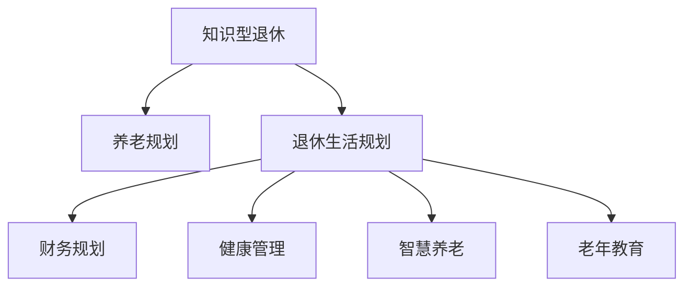

                 

# 知识型退休生活的规划与实现

> 关键词：
- 知识型退休
- 养老规划
- 退休生活规划
- 财务规划
- 健康管理
- 智慧养老
- 老年教育

## 1. 背景介绍

### 1.1 问题由来
随着人口老龄化的加剧，社会对老年人的关怀与照顾需求日益增加。如何实现老年人的高质量养老，成为了一个亟待解决的社会问题。传统的养老模式往往依赖于子女照顾，但由于工作压力和社会环境的变迁，这种模式越来越难以维系。

与此同时，知识经济时代的到来为老年人提供了新的可能。通过积累的知识与技能，老年人能够继续贡献社会，实现自我价值，同时也能享受到更加丰富和健康的生活。因此，知识型退休生活规划的概念应运而生，旨在帮助老年人通过自我增值与智能化工具，实现健康、充实、快乐且有尊严的退休生活。

### 1.2 问题核心关键点
知识型退休生活规划的核心在于：
- **养老模式转变**：从依赖子女照顾的传统模式，转变为依靠老年人自我增值与智能化工具的多样化养老模式。
- **生活质量提升**：通过自我增值与智能化应用，老年人能够享受到更健康、更丰富的退休生活。
- **养老资源配置**：通过合理的养老规划，配置并优化养老资源，实现高效养老。
- **长期财务规划**：通过科学合理的财务规划，确保养老资金的安全与增值。
- **医疗与健康管理**：通过智能化医疗与健康管理工具，提升老年人的健康水平，延长寿命。

### 1.3 问题研究意义
知识型退休生活规划的实现，对提升老年人的生活质量、优化养老资源配置、推动养老产业的转型升级具有重要意义：

1. **提升生活质量**：通过自我增值与智能化养老工具，老年人能够继续参与社会活动，实现自我价值，丰富生活内容。
2. **优化资源配置**：通过科学的规划，实现养老资源的有效配置与利用，提升养老服务的效率与质量。
3. **推动产业升级**：促进养老产业向知识型、智能化方向发展，带动相关技术与服务升级。
4. **实现自我价值**：老年人通过自我增值与智能工具，继续贡献社会，实现个人价值的最大化。
5. **营造健康环境**：通过智能化医疗与健康管理，提升老年人的健康水平，营造健康积极的养老环境。

## 2. 核心概念与联系

### 2.1 核心概念概述

为更好地理解知识型退休生活规划，本节将介绍几个密切相关的核心概念：

- **知识型退休**：指老年人通过知识增值与技能提升，继续参与社会生活，实现自我价值的养老模式。
- **养老规划**：指老年人根据自身的健康状况、经济状况、生活需求等，制定科学合理的退休生活规划。
- **退休生活规划**：指老年人对退休后的生活进行全面规划，包括经济、健康、社交等方面，确保退休生活的质量与满足感。
- **财务规划**：指老年人对退休后的财务状况进行规划与管理，确保资金的安全与增值。
- **健康管理**：指老年人通过智能医疗与健康管理工具，监测与改善自身的健康状况，延长寿命。
- **智慧养老**：指老年人通过智能化养老工具，提升生活便捷性与质量，享受科技带来的便利。
- **老年教育**：指老年人通过继续教育，学习新知识与技能，提升自我价值与生活质量。

这些核心概念之间的逻辑关系可以通过以下Mermaid流程图来展示：



这个流程图展示了几大核心概念之间的联系：

1. 知识型退休是整个规划的出发点，通过知识增值与技能提升，老年人实现自我价值与生活质量的提升。
2. 养老规划与退休生活规划是核心步骤，通过科学的规划，配置并优化养老资源，确保生活的高质量与满足感。
3. 财务规划、健康管理、智慧养老和老年教育是具体执行的措施，通过合理配置与智能化工具，提升老年人的生活质量与健康水平。

## 3. 核心算法原理 & 具体操作步骤
### 3.1 算法原理概述

知识型退休生活规划的核心在于通过科学合理的规划与智能化工具，提升老年人的生活质量与健康水平。其核心算法原理主要包括以下几个方面：

1. **需求评估**：通过对老年人的健康状况、经济状况、生活需求等进行评估，明确规划目标与方向。
2. **资源配置**：根据评估结果，配置并优化养老资源，包括经济、健康、社交等方面。
3. **智能工具应用**：通过智能化工具与平台，提升老年人的生活质量与健康管理效率。
4. **财务规划**：通过科学的财务规划，确保资金的安全与增值，避免经济风险。
5. **健康管理**：通过智能化医疗与健康管理工具，监测与改善老年人的健康状况。

### 3.2 算法步骤详解

知识型退休生活规划主要包括以下几个关键步骤：

**Step 1: 需求评估**
- 收集老年人的健康状况、经济状况、生活需求等数据。
- 使用问卷调查、访谈等方式，全面了解老年人的生活状况与期望。
- 基于收集的数据，进行健康评估、财务评估与需求分析。

**Step 2: 规划制定**
- 根据评估结果，制定科学合理的退休生活规划。
- 设定短期与长期目标，包括生活质量提升、经济保障、健康管理等方面。
- 确定资源配置方案，包括养老机构选择、医疗资源安排、社交活动规划等。

**Step 3: 财务规划**
- 确定养老资金的来源与用途，包括储蓄、保险、投资等方面。
- 制定财务预算，确保资金的合理使用与增值。
- 选择适合老年人的投资产品，确保资产的安全与保值。

**Step 4: 健康管理**
- 选择合适的智能化健康管理工具，监测老年人的健康状况。
- 通过健康监测数据，制定科学的健康管理方案。
- 定期进行健康检查，及时发现与治疗潜在疾病。

**Step 5: 智能工具应用**
- 选择合适的智能化养老工具与平台，提升老年人的生活质量。
- 利用智能家居、远程医疗、在线教育等工具，增强老年人的生活便捷性与社交参与度。
- 定期更新与维护智能工具，确保其高效运行。

**Step 6: 持续优化**
- 定期评估退休生活规划的执行情况，及时调整与优化。
- 根据老年人反馈与环境变化，灵活调整规划内容。
- 持续提升智能化工具的功能与体验，满足老年人的新需求。

### 3.3 算法优缺点

知识型退休生活规划的优势在于：
1. 提升生活质量：通过自我增值与智能化工具，老年人能够享受更丰富、更有意义的生活。
2. 资源优化配置：通过科学规划，确保养老资源的有效配置与利用，提升养老服务效率。
3. 避免经济风险：通过科学的财务规划，确保资金的安全与增值，避免经济风险。
4. 健康管理精准：通过智能化健康管理工具，实时监测与改善健康状况，延长寿命。

然而，该方法也存在一定的局限性：
1. 需求评估复杂：老年人的需求评估需要全面且深入的了解，操作复杂且耗时。
2. 资源配置难度大：养老资源的配置与优化需要跨区域、跨部门的协调与合作，难度较大。
3. 智能化工具依赖高：对智能化工具的依赖度较高，需要持续的维护与更新。
4. 财务规划风险：财务规划需要考虑多种不确定因素，存在一定的风险。
5. 健康管理挑战：老年人的健康管理需要专业的医疗知识与技术支持，存在一定的挑战。

### 3.4 算法应用领域

知识型退休生活规划的应用领域非常广泛，涵盖以下多个方面：

- **智能养老**：通过智能化工具与平台，提升老年人的生活质量与健康管理效率。
- **财务规划**：通过科学的财务规划，确保资金的安全与增值，避免经济风险。
- **老年教育**：通过继续教育，学习新知识与技能，提升自我价值与生活质量。
- **健康管理**：通过智能化医疗与健康管理工具，监测与改善老年人的健康状况。
- **生活服务**：利用智能家居、远程医疗、在线购物等服务，提升老年人的生活便捷性与独立性。
- **社交活动**：通过在线社交、社区活动等，增强老年人的社交参与度与幸福感。

这些应用领域相互交织，共同构成了知识型退休生活规划的完整图景，为老年人提供全面且高效的生活支持。

## 4. 数学模型和公式 & 详细讲解 & 举例说明

### 4.1 数学模型构建

本节将使用数学语言对知识型退休生活规划的规划与评估过程进行更加严格的刻画。

记老年人的健康状况为 $H$，经济状况为 $E$，生活质量为 $Q$，生活质量提升的目标为 $Q_{target}$，财务规划的年增长率为 $r$，健康管理的目标为 $H_{target}$。则知识型退休生活规划的数学模型可以表示为：

$$
\max \, Q_{target} = f(H, E, r, H_{target})
$$

其中 $f$ 为规划目标函数，考虑老年人的健康状况 $H$、经济状况 $E$、生活质量提升的目标 $Q_{target}$ 和财务规划的年增长率 $r$。

### 4.2 公式推导过程

以下我们以财务规划为例，推导年增长率 $r$ 的计算公式。

假设老年人每年从储蓄账户中取出 $C$ 元用于生活开销，储蓄账户的初始金额为 $S_0$，年增长率为 $r$，则 $n$ 年后的账户余额 $S_n$ 可表示为：

$$
S_n = S_0(1+r)^n - C\sum_{i=1}^{n}(1+r)^{n-i}
$$

通过公式推导，我们可以得出年增长率 $r$ 的计算公式为：

$$
r = \frac{S_n - S_0(1+r)^n}{S_0}
$$

其中 $S_n$ 为账户余额，$S_0$ 为初始金额，$n$ 为规划年限。

### 4.3 案例分析与讲解

假设一位65岁的老年人，每年生活开销为 $C=50000$ 元，初始储蓄金额为 $S_0=100000$ 元，希望在20年内将账户余额增长至 $S_{target}=300000$ 元。使用上述公式计算年增长率 $r$：

$$
S_n = 100000(1+r)^{20} - 50000\sum_{i=1}^{20}(1+r)^{20-i}
$$

解方程可得 $r$ 的值为 $0.0568$。

即该老年人每年需要将储蓄账户的年增长率控制在5.68%左右，才能在20年内实现账户余额增长至300000元的目标。

## 5. 项目实践：代码实例和详细解释说明
### 5.1 开发环境搭建

在进行知识型退休生活规划的实践前，我们需要准备好开发环境。以下是使用Python进行数据处理的环境配置流程：

1. 安装Anaconda：从官网下载并安装Anaconda，用于创建独立的Python环境。

2. 创建并激活虚拟环境：
```bash
conda create -n retirement-env python=3.8 
conda activate retirement-env
```

3. 安装PyTorch：根据CUDA版本，从官网获取对应的安装命令。例如：
```bash
conda install pytorch torchvision torchaudio cudatoolkit=11.1 -c pytorch -c conda-forge
```

4. 安装TensorFlow：由Google主导开发的开源深度学习框架，生产部署方便，适合大规模工程应用。同样有丰富的预训练语言模型资源。

5. 安装NumPy、Pandas、scikit-learn、matplotlib等科学计算与数据处理库。
```bash
pip install numpy pandas scikit-learn matplotlib
```

完成上述步骤后，即可在`retirement-env`环境中开始规划实践。

### 5.2 源代码详细实现

下面我们以财务规划为例，给出使用Python实现年增长率计算的代码示例。

```python
import numpy as np

def calculate_growth_rate(C, S0, target_S, years):
    """
    计算年增长率，以实现储蓄账户余额在指定年限内增长到目标金额
    """
    S = S0 * (1 + r)**years - C * np.sum((1 + r)**(years - i) for i in range(1, years+1))
    r = (target_S - S0 * (1 + r)**years) / S0
    return r

# 假设条件
C = 50000  # 年开销
S0 = 100000  # 初始金额
target_S = 300000  # 目标金额
years = 20  # 规划年限

# 计算年增长率
r = calculate_growth_rate(C, S0, target_S, years)
print(f"年增长率应控制在 {r:.4f}，才能在 {years} 年内实现账户余额增长至 {target_S}")
```

### 5.3 代码解读与分析

让我们再详细解读一下关键代码的实现细节：

**calculate_growth_rate函数**：
- 定义了计算年增长率的函数，输入为年开销 $C$、初始金额 $S0$、目标金额 $target_S$ 和规划年限 $years$。
- 使用公式推导出的等式计算年增长率 $r$。
- 返回计算出的年增长率 $r$。

**假设条件**：
- 定义了具体的年开销 $C$、初始金额 $S0$、目标金额 $target_S$ 和规划年限 $years$。
- 调用函数计算年增长率，并输出结果。

通过以上代码示例，可以看出Python的简洁与高效，可以快速实现复杂的数学计算。

## 6. 实际应用场景
### 6.1 智能养老系统

智能养老系统是基于知识型退休生活规划理念，利用智能化工具提升老年人生活质量与健康管理的系统。其主要功能包括：

- **智能家居管理**：通过智能家居设备，控制家中的各种设施，如照明、温控、安全监控等，提升老年人的生活便捷性。
- **远程医疗服务**：利用互联网和智能设备，提供远程医疗咨询、健康监测、药物配送等服务，降低老年人的医疗风险。
- **在线社交与教育**：通过在线社交平台与教育资源，丰富老年人的社交活动与知识学习，提升生活质量。
- **个性化服务推荐**：根据老年人的健康状况、兴趣爱好等信息，推荐适合的养老服务与活动，提升满意度。

智能养老系统的应用场景非常广泛，涵盖了老年人的生活方方面面，为老年人提供全面且高效的生活支持。

### 6.2 智慧医疗平台

智慧医疗平台是通过知识型退休生活规划理念，提升老年人健康管理水平与生活质量的平台。其主要功能包括：

- **健康监测**：利用可穿戴设备和智能传感器，实时监测老年人的生理指标，如心率、血压、血糖等。
- **健康分析**：通过大数据分析，评估老年人的健康状况，提供个性化的健康建议与干预措施。
- **医疗咨询**：提供远程医疗咨询与在线医生服务，方便老年人随时获取医疗支持。
- **药物管理**：利用智能药盒与提醒系统，帮助老年人按时服药，管理药物库存。

智慧医疗平台的应用场景主要在老年人的健康管理与医疗服务上，通过智能化手段提升老年人的健康水平，延长寿命。

### 6.3 老年教育平台

老年教育平台是通过知识型退休生活规划理念，提供丰富教育资源与学习机会的平台。其主要功能包括：

- **在线课程**：提供各类在线课程与学习资源，涵盖语言学习、科技应用、文化娱乐等。
- **社交互动**：通过在线社交平台，老年人与同学、朋友互动交流，分享学习成果。
- **技能培训**：提供职业技能培训与认证，帮助老年人提升自我价值与就业能力。
- **兴趣小组**：组织各类兴趣小组与社团活动，丰富老年人的社交生活。

老年教育平台的应用场景主要在老年人的知识增值与技能提升上，通过继续教育与兴趣活动，提升老年人的生活质量与自我价值。

### 6.4 未来应用展望

伴随技术的进步与社会的发展，知识型退休生活规划将在更多领域得到应用，为老年人提供更全面、更高效的生活支持：

1. **社区智慧养老**：利用智能化工具与社区资源，提升老年人的生活质量与健康管理水平。
2. **远程工作支持**：为有能力的老年人提供远程工作机会，继续贡献社会，提升自我价值。
3. **老年旅游**：通过智能化平台，规划老年人的旅游活动，丰富生活体验。
4. **虚拟现实体验**：利用虚拟现实技术，为老年人提供沉浸式的学习与娱乐体验。
5. **个性化智能家居**：开发更智能、更个性化的智能家居设备，提升老年人的生活便捷性。

未来，随着技术的不断进步与社会观念的转变，知识型退休生活规划必将在更广泛的领域得到应用，为老年人带来更丰富、更健康、更有意义的生活。

## 7. 工具和资源推荐
### 7.1 学习资源推荐

为了帮助老年人及家庭规划知识型退休生活，这里推荐一些优质的学习资源：

1. **老年大学**：各地区设有老年大学，提供各类课程与活动，丰富老年人的生活。
2. **在线学习平台**：如Coursera、edX等，提供各类在线课程与资源，老年人可以随时学习。
3. **健康管理应用**：如Fitbit、Apple Health等，提供健康监测与数据分析功能，提升老年人的健康水平。
4. **智能家居设备**：如Amazon Echo、Google Home等，提供语音控制与智能家居服务，提升老年人的生活便捷性。
5. **远程医疗平台**：如Teladoc、Doctor on Demand等，提供远程医疗咨询与健康管理服务，方便老年人随时获取医疗支持。

通过对这些资源的学习实践，相信老年人能够更好地规划与实现知识型退休生活，享受科技带来的便利与乐趣。

### 7.2 开发工具推荐

高效的开发离不开优秀的工具支持。以下是几款用于知识型退休生活规划开发的常用工具：

1. **Python**：基于Python的开源深度学习框架，灵活动态的计算图，适合快速迭代研究。
2. **TensorFlow**：由Google主导开发的开源深度学习框架，生产部署方便，适合大规模工程应用。
3. **NumPy、Pandas、scikit-learn、matplotlib**：科学计算与数据处理库，用于数据处理与模型训练。
4. **PyTorch**：基于Python的开源深度学习框架，支持动态图与静态图计算，灵活度较高。
5. **Jupyter Notebook**：交互式计算平台，方便开发者进行数据处理与模型调试。

合理利用这些工具，可以显著提升知识型退休生活规划的开发效率，加快创新迭代的步伐。

### 7.3 相关论文推荐

知识型退休生活规划的研究源于学界的持续研究。以下是几篇奠基性的相关论文，推荐阅读：

1. **《智慧养老：面向老年人的数字化生活》**：介绍智慧养老系统的设计与实现，提出老年人生活质量提升的新思路。
2. **《老年人的智能化健康管理：理论与实践》**：探讨老年人的健康监测与智能化管理方法，提出有效的健康管理策略。
3. **《知识型退休生活规划：理论与应用》**：分析知识型退休生活的概念与实践，提出科学合理的规划与评估方法。
4. **《老年人远程医疗服务的研究与实践》**：探讨远程医疗在老年人中的应用，提出提升老年人医疗支持的新方法。
5. **《老年人继续教育与终身学习》**：研究老年人的继续教育与终身学习，提出提升老年人自我价值的新途径。

这些论文代表了大语言模型微调技术的发展脉络。通过学习这些前沿成果，可以帮助老年人更好地理解与规划知识型退休生活，实现高质量、有意义的退休生活。

## 8. 总结：未来发展趋势与挑战
### 8.1 总结

本文对知识型退休生活规划的理念与实现进行了全面系统的介绍。首先阐述了知识型退休生活的背景与意义，明确了其对提升老年人生活质量、优化养老资源配置、推动养老产业转型升级的重要性。其次，从需求评估、规划制定、财务规划、健康管理、智能工具应用等各个环节，详细讲解了知识型退休生活规划的实现步骤。

通过本文的系统梳理，可以看到，知识型退休生活规划是实现老年人高质量、有意义退休生活的重要途径。通过科学合理的规划与智能化工具的应用，老年人能够享受更加丰富、健康、快乐且有尊严的退休生活。未来，随着技术的进步与社会的发展，知识型退休生活规划将在更多领域得到应用，为老年人带来更全面、更高效的生活支持。

### 8.2 未来发展趋势

展望未来，知识型退休生活规划将呈现以下几个发展趋势：

1. **技术融合**：与智能家居、远程医疗、在线教育等多领域技术的深度融合，提升老年人的生活质量与健康管理水平。
2. **社会支持**：政府、企业、社区等多方协同，共同推进知识型退休生活规划的实现，构建更加完善的社会支持体系。
3. **个性化服务**：通过大数据与人工智能技术，提供个性化、精准的养老服务与支持，提升老年人的幸福感和满意度。
4. **政策引导**：政府出台相关政策，推动知识型退休生活规划的普及与推广，营造良好的社会环境。
5. **技术创新**：不断引入新的技术手段与方法，提升老年人的生活质量与健康管理水平。

以上趋势凸显了知识型退休生活规划的广阔前景。这些方向的探索发展，必将进一步提升老年人的生活质量与健康水平，实现高质量、有意义的退休生活。

### 8.3 面临的挑战

尽管知识型退休生活规划已经取得了显著成效，但在迈向更加智能化、普适化应用的过程中，它仍面临着诸多挑战：

1. **技术壁垒**：技术实现需要跨领域的协作与配合，存在一定的技术壁垒。
2. **数据隐私**：老年人的数据隐私问题需要严格保护，防止信息泄露。
3. **资金投入**：智能化工具的引入需要较高的初始资金投入，对经济状况有一定的要求。
4. **健康管理**：老年人的健康管理需要专业的医疗知识与技术支持，存在一定的挑战。
5. **社会观念**：老年人的社会观念需要逐步转变，接受知识型退休生活规划。
6. **持续更新**：智能化工具需要定期更新与维护，确保其高效运行。

正视这些挑战，积极应对并寻求突破，将是大规模应用知识型退休生活规划的关键。相信随着学界和产业界的共同努力，这些挑战终将一一被克服，知识型退休生活规划必将在构建美好养老生活方面发挥更大的作用。

### 8.4 研究展望

面对知识型退休生活规划所面临的挑战，未来的研究需要在以下几个方面寻求新的突破：

1. **技术协同**：通过跨领域的协作，实现技术与资源的有效整合，提升知识型退休生活规划的实施效果。
2. **数据安全**：建立严格的数据隐私保护机制，确保老年人的数据安全与隐私保护。
3. **经济可行性**：探索低成本、高效率的智能化工具，降低老年人的经济负担。
4. **健康服务**：引入专业的医疗团队与知识库，提升老年人的健康管理水平。
5. **社会教育**：加强老年人的社会教育与培训，提升其接受知识型退休生活规划的能力。
6. **持续优化**：通过数据反馈与迭代优化，不断提升知识型退休生活规划的效果与质量。

这些研究方向的探索，必将引领知识型退休生活规划技术迈向更高的台阶，为老年人提供更加全面、高效的生活支持。面向未来，知识型退休生活规划需要从技术、社会、经济等多个维度协同发力，共同推动养老产业的转型升级，为老年人创造更加美好、有意义的生活。

## 9. 附录：常见问题与解答
**Q1：老年人如何规划知识型退休生活？**

A: 老年人可以通过以下步骤规划知识型退休生活：

1. 进行需求评估，了解自己的健康状况、经济状况、生活需求等。
2. 制定科学合理的退休生活规划，设定短期与长期目标。
3. 进行财务规划，确保资金的安全与增值。
4. 利用智能化工具与平台，提升生活质量与健康管理水平。
5. 持续优化规划内容，根据实际情况进行调整与改进。

**Q2：知识型退休生活规划的资金如何管理？**

A: 老年人可以通过以下方式管理退休资金：

1. 制定财务预算，确保资金的合理使用与增值。
2. 选择合适的投资产品，如储蓄账户、国债、债券等，确保资产的安全与保值。
3. 定期评估财务状况，根据需要进行调整与优化。
4. 利用财务规划工具，如理财软件、财务顾问等，进行科学的资金管理。

**Q3：老年人如何利用智能化工具提升生活质量？**

A: 老年人可以通过以下方式利用智能化工具提升生活质量：

1. 安装智能家居设备，控制家中的各种设施，提升生活便捷性。
2. 利用远程医疗平台，进行健康监测与医疗咨询，降低医疗风险。
3. 通过在线社交平台与教育资源，丰富社交活动与知识学习，提升生活质量。
4. 使用健康管理应用，实时监测生理指标，提升健康水平。

通过合理利用智能化工具，老年人能够享受到科技带来的便利与乐趣，提升生活质量与健康水平。

**Q4：知识型退休生活规划的实施难点在哪里？**

A: 知识型退休生活规划的实施难点主要在于：

1. 需求评估复杂：老年人的需求评估需要全面且深入的了解，操作复杂且耗时。
2. 资源配置难度大：养老资源的配置与优化需要跨区域、跨部门的协调与合作，难度较大。
3. 智能化工具依赖高：对智能化工具的依赖度较高，需要持续的维护与更新。
4. 财务规划风险：财务规划需要考虑多种不确定因素，存在一定的风险。
5. 健康管理挑战：老年人的健康管理需要专业的医疗知识与技术支持，存在一定的挑战。

这些难点需要通过多方面的努力与创新，逐步克服，以实现知识型退休生活规划的目标。

**Q5：知识型退休生活规划的未来发展方向是什么？**

A: 知识型退休生活规划的未来发展方向主要在于：

1. 技术融合：与智能家居、远程医疗、在线教育等多领域技术的深度融合，提升老年人的生活质量与健康管理水平。
2. 社会支持：政府、企业、社区等多方协同，共同推进知识型退休生活规划的实现，构建更加完善的社会支持体系。
3. 个性化服务：通过大数据与人工智能技术，提供个性化、精准的养老服务与支持，提升老年人的幸福感和满意度。
4. 政策引导：政府出台相关政策，推动知识型退休生活规划的普及与推广，营造良好的社会环境。
5. 技术创新：不断引入新的技术手段与方法，提升老年人的生活质量与健康管理水平。

未来，随着技术的进步与社会的发展，知识型退休生活规划必将在更广泛的领域得到应用，为老年人带来更全面、更高效的生活支持。

---

作者：禅与计算机程序设计艺术 / Zen and the Art of Computer Programming

