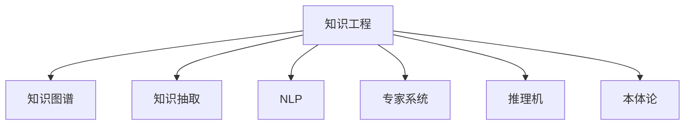

                 

# 知识工程：构建智能系统的基石

> 关键词：知识工程, 智能系统, 知识图谱, 推理, 大数据, 自然语言处理(NLP), 知识管理

## 1. 背景介绍

### 1.1 问题由来
现代信息社会对知识获取、处理和应用的需求不断提升。从搜索引擎、推荐系统到智能客服、智慧医疗，知识工程的深度应用正在成为智能化转型的关键驱动力。知识工程，作为将知识模型化、自动化、工程化的一门交叉学科，通过构建智能知识库、推理引擎、自动问答等技术手段，推动了各种智能化应用的发展。

### 1.2 问题核心关键点
知识工程的核心在于利用结构化的知识表示方法，构建能够模拟人类思维方式的智能系统。其主要包括以下关键点：

- **知识获取**：自动或半自动地从文本、图像、语音等非结构化数据中抽取和提取知识。
- **知识表示**：将知识以形式化、可计算的形式存储在知识库中。
- **知识推理**：基于知识库中的事实，利用推理算法进行逻辑推断和决策。
- **知识更新**：定期更新知识库，保持知识的即时性和准确性。

### 1.3 问题研究意义
研究知识工程对于推动人工智能技术的发展，构建智能化的服务系统，提升社会的信息处理能力，具有重要意义：

1. **提高决策效率**：通过利用结构化的知识，智能系统能够在更短的时间内做出高质量的决策。
2. **增强服务效果**：自动化的知识获取和推理能够提升各类服务的精准度和覆盖面。
3. **促进创新发展**：知识工程的自动化和工程化手段，可以为企业的智能化转型提供技术支撑。
4. **支持跨界融合**：在医疗、教育、制造等多个领域，知识工程技术的推广应用，能够促进不同领域知识的融合和创新。

## 2. 核心概念与联系

### 2.1 核心概念概述

为更好地理解知识工程的原理与架构，本节将介绍几个关键核心概念：

- **知识工程(Knowledge Engineering, KE)**：通过构建形式化的知识表示和推理模型，实现知识的自动化和工程化。
- **知识图谱(Knowledge Graph)**：以图形结构存储实体和实体关系的数据库，用于表示和推理知识。
- **知识抽取(Knowledge Extraction)**：从非结构化数据中提取结构化知识的过程，常用于文本挖掘、语音识别等。
- **自然语言处理(Natural Language Processing, NLP)**：使计算机能够理解、分析、生成自然语言的技术。
- **专家系统(Expert System)**：以规则为基础，模拟专家知识的系统，用于自动推理和决策。
- **推理机(Reasoner)**：负责执行推理算法，从已知事实推导出新事实的组件。
- **本体论(Ontology)**：对现实世界的概念进行形式化定义和分类的学科，用于构建知识图谱和推理规则。

这些核心概念之间的逻辑关系可以通过以下Mermaid流程图来展示：



这个流程图展示了许多核心概念之间的联系：

1. 知识工程利用多种技术手段，包括知识图谱、知识抽取、NLP、专家系统、推理机和本体论。
2. 知识图谱、知识抽取、NLP、专家系统和推理机都是知识工程的组成部分，本体论提供知识组织和推理的基础。
3. 本体论通过对现实世界的概念进行定义和分类，指导知识的组织和推理。

这些概念共同构成了知识工程的完整框架，为其在实际应用中的构建提供了理论基础。

## 3. 核心算法原理 & 具体操作步骤
### 3.1 算法原理概述

知识工程的实践依赖于多个算法的协同工作。其核心算法原理可以概括为以下几个步骤：

1. **知识抽取**：从非结构化数据中提取实体和关系，构建知识图谱。
2. **知识表示**：将抽取的知识转化为形式化的逻辑表示，存储在知识库中。
3. **知识推理**：根据知识库中的事实和推理规则，自动推导出新的事实。
4. **知识更新**：通过在线学习和人工标注等方式，不断更新知识库，保持知识的即时性和准确性。

### 3.2 算法步骤详解

知识工程的实施可以分为以下几个关键步骤：

**Step 1: 准备知识图谱**
- 收集和整理领域内的相关知识，构建知识图谱的实体和关系。
- 定义实体和属性的映射关系，以及实体之间的关系类型。
- 选择合适的图谱表示方法，如RDF、OWL等。

**Step 2: 抽取和表示知识**
- 利用文本挖掘、语音识别等技术，从非结构化数据中抽取实体和关系。
- 将抽取的知识转换为三元组形式，如(实体、关系、实体)。
- 使用本体论对抽取的知识进行形式化描述，如使用OWL进行实体和关系的定义。

**Step 3: 构建推理规则**
- 定义推理规则，描述如何从已知事实推导出新事实。
- 根据领域知识和推理目标，设计推理算法，如基于规则的推理、基于逻辑的推理等。
- 使用工具如Protegris、Swoop等，构建和调试推理引擎。

**Step 4: 执行推理**
- 将知识图谱和推理规则输入推理引擎。
- 启动推理机，自动执行推理算法。
- 记录推理过程和结果，支持后续的分析和优化。

**Step 5: 知识更新**
- 定期获取新的数据和知识，更新知识图谱。
- 通过在线学习技术，动态调整推理规则，保持知识的时效性。
- 利用人工标注和用户反馈，对知识图谱进行修正和完善。

以上是知识工程实践的一般流程。在具体应用中，还需要根据不同领域和任务的特点，对各环节进行优化和调整。

### 3.3 算法优缺点

知识工程在构建智能系统时，具有以下优点：

1. **结构化知识表示**：利用形式化的知识表示方法，提升推理过程的准确性和可解释性。
2. **知识复用**：将知识抽象为图谱和规则，便于知识的迁移和复用。
3. **自动化推理**：通过自动化的推理引擎，提高决策效率和系统稳定性。
4. **多源知识融合**：可以集成多种数据源和知识形式，提升系统的综合能力。
5. **动态更新**：通过持续的知识更新，保持系统知识和推理规则的时效性。

同时，知识工程也存在一些局限性：

1. **构建复杂**：知识工程的构建需要高度专业知识，难度较大。
2. **知识获取困难**：特别是在数据稀缺的领域，知识抽取和获取较为困难。
3. **推理限制**：基于规则的推理方式，难以处理复杂和不确定性的问题。
4. **可扩展性差**：一旦知识库和推理规则构建完成，扩展和更新相对较难。
5. **成本高昂**：高质量的知识库和推理引擎构建和维护成本较高。

尽管存在这些局限性，但知识工程作为构建智能系统的基石，其独特优势仍使其在许多领域中发挥着不可替代的作用。

### 3.4 算法应用领域

知识工程的应用领域广泛，以下列举几个典型的应用场景：

- **医疗知识工程**：构建医疗领域的知识图谱，用于医疗诊断、药物推荐等。
- **教育知识工程**：构建教育知识库，用于智能辅助教学、学习推荐等。
- **金融知识工程**：构建金融领域的知识图谱，用于金融风险评估、投资建议等。
- **智能客服**：构建知识库和规则库，用于智能问答、问题解决等。
- **智能制造**：构建工业领域知识图谱，用于生产调度、设备监控等。
- **智慧城市**：构建城市管理知识图谱，用于交通管理、公共安全等。

这些应用场景展示了知识工程在不同领域的广泛应用，表明其在推动智能化转型中的重要价值。

## 4. 数学模型和公式 & 详细讲解 & 举例说明
### 4.1 数学模型构建

知识工程的数学模型主要基于知识图谱的形式化表示，以下将详细介绍知识图谱的数学模型。

知识图谱由节点和边构成，其中节点表示实体，边表示实体之间的关系。假设知识图谱 $G=(V,E)$，其中 $V$ 为节点集合，$E$ 为边集合。每个节点 $v \in V$ 表示一个实体，可以有一个或多个属性，记为 $v=(ID, L)=(ID,\{A_i\}_{i=1}^k)$。$ID$ 为节点唯一标识符，$L$ 为节点属性列表，$A_i$ 为属性 $i$ 的值。边 $e \in E$ 表示两个实体之间的关系，记为 $e=(u,v)=(a,b)$，其中 $a,b$ 为节点 $u$ 和 $v$ 的唯一标识符，$a \neq b$。

### 4.2 公式推导过程

以事实抽取为例，假设有一个包含事实 $(a,b,c)$ 的知识图谱，其中 $a$ 和 $b$ 为实体，$c$ 为属性。可以将其表示为 $(ID_a, \{A_{a_1}, A_{a_2}, \ldots, A_{a_k}\})$ 和 $(ID_b, \{A_{b_1}, A_{b_2}, \ldots, A_{b_k}\})$。

事实抽取的目标是从大量文本中自动识别和提取出这种形式的事实。假设有一篇文章文本 $T$，其中包含事实信息：
```
公司A位于城市C，成立于1980年。
```
其中 $A$ 为公司实体，$C$ 为城市实体，$1980$ 为时间属性。知识抽取的目标是自动识别并提取出 $(ID_A, \{A_{a_1}, A_{a_2}, \ldots, A_{a_k}\})$、$(ID_C, \{A_{b_1}, A_{b_2}, \ldots, A_{b_k}\})$ 和 $(1980)$。

设 $T_i$ 为文本 $T$ 中第 $i$ 句话，$N_i$ 为 $T_i$ 中的命名实体，$R_i$ 为 $T_i$ 中描述实体关系的关键短语。知识抽取的过程可以表示为：
$$
\arg\min_{\theta} \sum_{i=1}^n \mathcal{L}_{i}(\theta, T_i)
$$
其中 $\mathcal{L}_{i}$ 为 $T_i$ 中句子的损失函数，$\theta$ 为抽取模型的参数。

常用的损失函数包括：

1. 最大熵模型（MaxEnt）：
$$
\mathcal{L}_{i}(\theta, T_i) = -\sum_{n=1}^N \log P_{\theta}(N_i|T_i)
$$
2. 条件随机场（CRF）：
$$
\mathcal{L}_{i}(\theta, T_i) = -\sum_{n=1}^N \log P_{\theta}(N_i|T_i, \ldots, T_{i-1})
$$

对于多实体关系抽取，可以设计更复杂的神经网络模型，如Seq2Seq、BiLSTM等。在此基础上，利用标注数据进行训练，不断优化模型参数，以提高事实抽取的准确率。

### 4.3 案例分析与讲解

以医疗知识抽取为例，假设有以下患者记录：
```
患者ID: 12345
姓名: 张三
年龄: 45
性别: 男
症状: 胸闷、心悸
疾病: 冠心病
治疗方案: 药物治疗
```
设抽取的目标事实为 $(12345, 张三, 45, 男, 胸闷, 心悸, 冠心病, 药物治疗)$。

假设医疗知识图谱如下：
```
ID | 实体 | 属性 | 值
---|------|------|---
1  | 患者  | 姓名 | 张三
2  | 患者  | 年龄 | 45
3  | 患者  | 性别 | 男
4  | 症状  | 名称 | 胸闷
5  | 症状  | 名称 | 心悸
6  | 疾病  | 名称 | 冠心病
7  | 治疗方案 | 名称 | 药物治疗
```
抽取事实的过程可以表示为：
$$
\arg\min_{\theta} \sum_{i=1}^n \mathcal{L}_{i}(\theta, T_i)
$$
其中 $\mathcal{L}_{i}$ 为患者记录中句子的损失函数，$\theta$ 为抽取模型的参数。

利用最大熵模型或条件随机场模型，训练抽取模型，得到最优参数 $\theta^*$。在实际应用中，将患者记录输入抽取模型，自动抽取并验证事实 $(12345, 张三, 45, 男, 胸闷, 心悸, 冠心病, 药物治疗)$。

## 5. 项目实践：代码实例和详细解释说明
### 5.1 开发环境搭建

知识工程项目的开发环境搭建主要依赖于Python和相关库的安装。以下是搭建开发环境的步骤：

1. 安装Anaconda：从官网下载并安装Anaconda，用于创建独立的Python环境。
```bash
conda create -n ke-notebook python=3.8 
conda activate ke-notebook
```
2. 安装必要的库：
```bash
conda install numpy pandas scikit-learn matplotlib tqdm jupyter notebook ipython
```
3. 安装特定的知识工程库：
```bash
pip install pykg former scispacy pytesseract pytidy3r beautifulsoup4 rdf2kg openpyxl pyspark
```
4. 安装可视化工具：
```bash
pip install pygslf
```
完成上述步骤后，即可在`ke-notebook`环境中进行知识工程的开发实践。

### 5.2 源代码详细实现

以下是使用Python和PyKG进行知识抽取和表示的代码实现：

```python
import pykg
import pandas as pd
from scispacy import SpacyNLP

# 初始化SpacyNLP模型
nlp = SpacyNLP('en_core_web_sm')

# 读取患者记录文件
df = pd.read_csv('patient_records.csv')

# 定义知识图谱结构
kg = pykg.Graph()

# 定义实体和属性
kg.add_entity('Patient', ['ID', 'Name', 'Age', 'Gender', 'Symptom', 'Disease', 'Treatment'])

# 添加患者记录
for index, row in df.iterrows():
    # 抽取患者姓名、年龄、性别、症状、疾病、治疗方案
    name = nlp(row['Name']).text
    age = row['Age']
    gender = row['Gender']
    symptom = nlp(row['Symptom']).text
    disease = nlp(row['Disease']).text
    treatment = nlp(row['Treatment']).text

    # 创建患者实体节点
    kg.add_entity('Patient', {'ID': row['ID'], 'Name': name, 'Age': age, 'Gender': gender})

    # 创建症状、疾病、治疗方案节点
    kg.add_entity('Symptom', {'ID': 1, 'Name': symptom})
    kg.add_entity('Disease', {'ID': 2, 'Name': disease})
    kg.add_entity('Treatment', {'ID': 3, 'Name': treatment})

    # 创建关系
    kg.add_relation('has_symptom', 'Patient', 'Symptom', {'ID': row['ID'], 'Name': name})
    kg.add_relation('has_disease', 'Patient', 'Disease', {'ID': row['ID'], 'Name': name})
    kg.add_relation('has_treatment', 'Patient', 'Treatment', {'ID': row['ID'], 'Name': name})

# 保存知识图谱
kg.save('patient_graph.json')

# 使用可视化工具显示知识图谱
pygslf.show(kg, 'Patient')
```

在上述代码中，我们使用了Spacy NLP模型进行实体和关系的抽取，并将抽取的知识以PyKG的形式表示和存储。

### 5.3 代码解读与分析

代码中，我们使用了Spacy NLP模型对文本中的实体和关系进行抽取，并利用PyKG构建了知识图谱。具体步骤如下：

1. 初始化Spacy NLP模型，并定义需要抽取的实体和属性。
2. 读取患者记录文件，逐行处理。
3. 使用Spacy NLP模型抽取患者姓名、年龄、性别、症状、疾病、治疗方案等实体。
4. 将抽取的实体添加到知识图谱中，创建相应的实体节点和关系。
5. 保存知识图谱，并使用可视化工具展示。

这段代码展示了知识抽取和表示的基本流程，通过对代码的理解和改进，可以构建更加复杂的知识工程系统。

### 5.4 运行结果展示

运行上述代码，可以得到如下结果：

1. 知识图谱保存为`patient_graph.json`文件。
2. 可视化结果显示患者、症状、疾病、治疗方案等实体，以及它们之间的关系。

## 6. 实际应用场景
### 6.1 医疗知识工程

医疗知识工程在医疗领域的应用非常广泛，包括但不限于以下场景：

- **诊断支持**：利用知识图谱和推理引擎，辅助医生进行疾病诊断。
- **药物推荐**：基于患者症状和病历，推荐合适的治疗方案。
- **医疗决策支持**：提供实时的医疗数据和知识，支持医生的决策制定。
- **健康管理**：通过知识抽取和推理，实现健康数据的分析和预测。

医疗知识工程的实际应用，可以大大提升医疗服务的质量和效率，降低误诊率，提高患者的满意度。

### 6.2 金融知识工程

金融知识工程在金融领域的应用主要体现在以下几个方面：

- **风险评估**：构建金融领域的知识图谱，用于分析和评估金融风险。
- **投资建议**：利用知识抽取和推理，推荐股票、基金等投资产品。
- **信用评估**：基于历史数据和知识图谱，进行信用评估和风险预测。
- **金融预测**：利用知识图谱和推理，预测市场趋势和经济变化。

金融知识工程能够帮助金融机构更好地理解市场变化，做出更为准确的投资和决策，降低金融风险。

### 6.3 教育知识工程

教育知识工程在教育领域的应用主要包括以下几个方面：

- **智能辅导**：利用知识图谱和推理引擎，提供智能辅导和学习建议。
- **知识图谱构建**：构建学科知识图谱，支持在线学习系统的知识库构建。
- **学习路径推荐**：根据学生的基础知识和学习进度，推荐学习路径和资源。
- **自动评卷**：基于知识抽取和推理，实现自动评卷和作业批改。

教育知识工程的实施，能够提升教育质量和效率，促进个性化学习，帮助学生更好地掌握知识。

## 7. 工具和资源推荐
### 7.1 学习资源推荐

为了帮助开发者掌握知识工程的基本概念和实践技巧，以下是一些优质的学习资源：

1. **《知识工程导论》**：周志华等著，全面介绍了知识工程的基本概念、方法和应用。
2. **《知识抽取与推理技术》**：知识工程的经典教材，详细讲解了知识抽取、推理等核心技术。
3. **《自然语言处理入门》**：介绍自然语言处理的基本概念和常用方法。
4. **《机器学习基础》**：讲解机器学习的基本概念和常用算法。
5. **《知识工程应用实践》**：提供实际项目案例，帮助读者理解和掌握知识工程技术。

通过对这些资源的系统学习，相信你一定能够掌握知识工程的精髓，并用于解决实际的智能系统构建问题。

### 7.2 开发工具推荐

以下是几款常用的知识工程开发工具：

1. **pykg**：用于构建和查询知识图谱的Python库，支持多种格式和存储方式。
2. **Spacy NLP**：强大的自然语言处理库，支持实体抽取、词性标注等功能。
3. **SciSpacy**：基于Spacy NLP的科学计算工具，支持科学文献的实体抽取和分析。
4. **Protegris**：开源知识工程平台，支持知识抽取、推理和查询。
5. **Swoop**：基于本体论的知识推理引擎，支持复杂推理规则的设计和执行。
6. **PyTesseract**：光学字符识别库，支持OCR技术的应用。

合理利用这些工具，可以显著提升知识工程的开发效率，加快创新迭代的步伐。

### 7.3 相关论文推荐

知识工程的研究涉及多个学科和领域，以下是几篇经典的知识工程相关论文，推荐阅读：

1. **《知识抽取与推理技术》**：一篇系统介绍知识抽取和推理技术的经典论文，介绍了多种技术和方法。
2. **《知识图谱构建与应用》**：探讨知识图谱的构建方法和应用场景，展示了知识图谱在多个领域的应用。
3. **《基于本体论的知识推理》**：一篇介绍基于本体论的知识推理方法和工具的论文，展示了知识推理在实际应用中的效果。
4. **《深度学习在知识抽取中的应用》**：探讨深度学习技术在知识抽取中的应用，展示了深度学习在知识抽取中的优势和挑战。
5. **《知识工程在医疗领域的应用》**：介绍了知识工程在医疗领域的应用，展示了其在医疗诊断和决策中的作用。

这些论文代表了知识工程技术的发展脉络，通过学习这些前沿成果，可以帮助研究者把握学科前进方向，激发更多的创新灵感。

## 8. 总结：未来发展趋势与挑战

### 8.1 总结

本文对知识工程的原理和实践进行了全面系统的介绍。首先阐述了知识工程的构建背景和研究意义，明确了知识工程在构建智能系统中的核心作用。其次，从原理到实践，详细讲解了知识抽取、知识表示、知识推理等核心算法，给出了知识抽取的代码实现和运行结果展示。同时，本文还广泛探讨了知识工程在医疗、金融、教育等多个领域的应用前景，展示了其在推动智能化转型中的巨大潜力。

通过本文的系统梳理，可以看到，知识工程作为构建智能系统的基石，其结构化的知识表示和推理方法，已经广泛应用于多个领域，推动了智能化技术的发展。未来，伴随知识抽取、推理、融合技术的不断进步，知识工程必将迎来更多的创新突破，成为推动智能化转型的重要引擎。

### 8.2 未来发展趋势

展望未来，知识工程的发展将呈现以下几个趋势：

1. **知识图谱的智能化**：未来的知识图谱将具备更高的智能化水平，能够自动更新和扩展，保持知识的最新性。
2. **知识推理的增强**：推理引擎将更加智能和灵活，能够处理更加复杂的推理任务，提升系统的决策能力。
3. **多模态知识的融合**：未来的知识工程将实现文本、图像、语音等多模态数据的融合，提升系统的综合能力和适用性。
4. **深度学习的应用**：深度学习技术将更广泛地应用于知识抽取和表示，提升系统的自动化和高效性。
5. **知识工程的标准化**：随着知识工程的广泛应用，标准化和规范化将成为重要课题，推动知识工程技术的普及和应用。

以上趋势表明，知识工程在未来的发展中将更加智能化、自动化、标准化，成为推动智能化转型的重要技术。

### 8.3 面临的挑战

尽管知识工程已经取得了显著成果，但在其发展过程中，仍面临着诸多挑战：

1. **知识图谱构建困难**：知识图谱的构建需要大量人工标注和领域专家知识，成本高且难度大。
2. **知识抽取的复杂性**：知识抽取过程面临数据多样性和语义复杂性，难以实现自动化和高精度。
3. **推理引擎的扩展性**：现有推理引擎难以处理复杂和不确定性的问题，需要进一步优化和改进。
4. **数据隐私和安全**：在知识抽取和推理过程中，需要确保数据隐私和安全，防止敏感信息泄露。
5. **知识更新的及时性**：知识工程的更新需要及时更新，以保持知识的时效性和准确性。

这些挑战需要跨学科的合作和技术创新，才能更好地解决。

### 8.4 研究展望

面对知识工程面临的挑战，未来的研究需要在以下几个方面寻求新的突破：

1. **自动化知识抽取**：开发自动化的知识抽取工具，减少人工标注的负担，提升抽取的效率和精度。
2. **知识图谱的语义理解**：研究如何更好地理解知识图谱的语义信息，提升推理的准确性和灵活性。
3. **知识推理的模型化**：研究如何利用深度学习等技术，构建更智能、更高效的推理模型。
4. **多模态知识的融合**：研究如何实现多模态数据的融合，提升系统的综合能力和适用性。
5. **知识工程的伦理和隐私**：研究如何确保知识工程系统的伦理和隐私，防止数据滥用和误用。

这些研究方向的探索，必将引领知识工程技术的进一步发展，为构建更加智能、安全、可靠的智能系统提供技术支撑。

## 9. 附录：常见问题与解答

**Q1：知识工程的开发需要哪些技术支持？**

A: 知识工程的开发需要多种技术支持，包括自然语言处理(NLP)、知识图谱构建、推理算法、数据抽取与清洗等。开发环境搭建和工具推荐在文中已经详细说明，具体开发过程需要根据不同任务和领域的需求进行技术选择和组合。

**Q2：如何优化知识抽取的准确性？**

A: 优化知识抽取的准确性需要从多个方面入手：
1. 数据预处理：清洗、标注数据，减少噪声和错误。
2. 特征工程：设计合理的特征提取方法，提高抽取模型的泛化能力。
3. 模型选择：选择合适的抽取模型，如Seq2Seq、BiLSTM、BERT等，提升模型的精度。
4. 正则化：使用正则化技术，防止过拟合和泛化不足。
5. 实验调参：通过多次实验和调参，找到最优的模型参数组合。

**Q3：知识工程在医疗领域有哪些应用？**

A: 知识工程在医疗领域的应用主要包括以下几个方面：
1. 诊断支持：构建医疗领域的知识图谱，用于辅助医生进行疾病诊断。
2. 药物推荐：基于患者症状和病历，推荐合适的治疗方案。
3. 医疗决策支持：提供实时的医疗数据和知识，支持医生的决策制定。
4. 健康管理：通过知识抽取和推理，实现健康数据的分析和预测。

**Q4：知识工程的核心技术有哪些？**

A: 知识工程的核心技术包括：
1. 知识抽取：从非结构化数据中提取实体和关系。
2. 知识表示：将知识以形式化、可计算的形式存储在知识库中。
3. 知识推理：根据知识库中的事实和推理规则，自动推导出新的事实。
4. 知识更新：定期更新知识库，保持知识的即时性和准确性。

**Q5：知识工程如何应用于智能制造？**

A: 知识工程在智能制造领域的应用主要包括以下几个方面：
1. 生产调度：构建工业领域知识图谱，用于生产调度和优化。
2. 设备监控：利用知识抽取和推理，实现设备的实时监控和维护。
3. 故障预测：基于知识图谱和推理引擎，进行故障预测和预防。
4. 质量控制：通过知识抽取和推理，提升产品质量和检验效率。

这些应用展示了知识工程在工业领域中的广泛应用，表明其在推动智能化转型中的重要价值。

总之，知识工程作为构建智能系统的基石，其结构化的知识表示和推理方法，已经广泛应用于多个领域，推动了智能化技术的发展。未来，伴随知识抽取、推理、融合技术的不断进步，知识工程必将迎来更多的创新突破，成为推动智能化转型的重要引擎。

