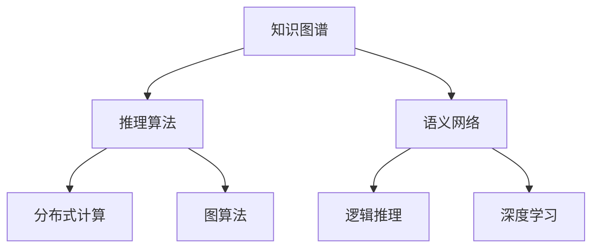
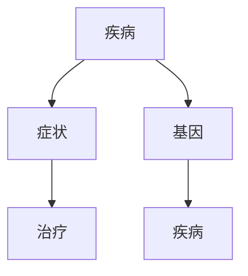

                 

# 知识推理：从已知到未知的跨越

> 关键词：知识图谱，推理算法，语义网络，逻辑推理，深度学习

## 1. 背景介绍

在信息爆炸的互联网时代，知识的获取与处理变得前所未有的便捷，但也面临信息量大、杂乱无章、难于理解与检索等问题。随着深度学习和大数据技术的发展，人类正逐步向能够自主进行知识推理的新时代迈进。

### 1.1 问题由来

人工智能的长期目标之一是赋予机器以智能，使其具备与人等效的推理能力。传统的人工智能方法主要集中在单一的机器学习任务，如图像识别、语音识别等，而对知识的理解、表达和推理能力重视不足。但随着知识的数量和复杂性的增长，人们越来越意识到知识推理技术的重要性和迫切性。

近年来，伴随着知识图谱、语义网络等技术的发展，人们逐渐认识到通过知识图谱进行推理能够帮助机器更好地理解和应用知识。本论文将详细探讨知识推理技术的原理与实现方法，并从应用实践、性能评估、未来趋势等方面进行全面分析。

### 1.2 问题核心关键点

本文的核心概念包括：

1. **知识图谱(Knowledge Graph)**：一种语义化的结构化数据表示形式，包含实体、关系和属性等信息。它是知识推理的基础，可以用于描述实体之间的语义关系。

2. **推理算法(Inference Algorithms)**：用于在知识图谱中查找、推导和关联知识，是知识图谱应用的核心技术。

3. **语义网络(Semantic Network)**：一种用于表示实体间关系的图模型，是知识图谱的实现形式之一。

4. **逻辑推理(Logic Inference)**：利用逻辑规则进行知识推导的算法，如谓词逻辑、非单调推理等。

5. **深度学习(Deep Learning)**：利用神经网络进行知识表示和推理的方法，尤其在处理大规模数据和复杂关系时表现优异。

6. **分布式计算(Distributed Computing)**：在多台计算机上并行计算推理任务，以提高性能和效率。

7. **图算法(Graph Algorithms)**：用于在图模型上进行路径查找、关联推导等任务。

通过深入研究这些概念，可以更好地理解知识推理技术的原理、实现和应用。

## 2. 核心概念与联系

### 2.1 核心概念概述

下图是知识推理技术的核心概念图，展示了各个核心概念及其之间的联系。



从图中可以看出，知识图谱是整个知识推理技术的基石，推理算法是核心，语义网络、逻辑推理和深度学习分别提供了不同的知识表示和推理方法，分布式计算和图算法提供了高效的推理实现方式。

## 3. 核心算法原理 & 具体操作步骤
### 3.1 算法原理概述

知识推理的算法原理主要基于以下几个方面：

- **知识图谱表示**：通过将实体和关系表示为图模型，将知识以结构化的方式存储和表示。
- **推理算法设计**：设计推理算法，用于从知识图谱中推导出新的知识。
- **知识表示学习**：使用深度学习等方法学习知识的表示，提高推理的准确性和效率。
- **分布式计算**：通过分布式系统实现推理任务的高效计算。
- **图算法应用**：使用图算法在图模型上进行高效计算，包括最短路径、连通性等。

### 3.2 算法步骤详解

知识推理的主要步骤包括：

1. **知识图谱构建**：构建知识图谱，收集实体、关系和属性等信息，并用图模型表示。
2. **推理算法选择**：选择或设计合适的推理算法，如基于逻辑的推理、基于图算法的推理等。
3. **知识表示学习**：使用深度学习等方法学习知识的表示，提高推理的准确性和效率。
4. **分布式计算优化**：通过分布式计算实现推理任务的高效计算。
5. **推理结果评估**：评估推理结果的正确性、完整性和效率。

### 3.3 算法优缺点

知识推理算法的主要优点包括：

- **结构化知识表示**：结构化的知识图谱更容易被机器理解和推理。
- **高效计算**：分布式计算和图算法能够高效地处理大规模知识推理任务。
- **准确性高**：使用深度学习等方法可以提高推理的准确性。

但这些算法也存在一些缺点：

- **构建复杂**：知识图谱的构建需要大量的前期工作，耗时耗力。
- **数据量庞大**：知识图谱的数据量通常很大，处理起来比较困难。
- **推理复杂度较高**：推理过程中需要处理大量复杂的关系，计算量较大。

### 3.4 算法应用领域

知识推理算法可以应用于多个领域，如：

- **自然语言处理(NLP)**：通过知识图谱进行实体识别、关系抽取、问答等任务。
- **医学信息学**：用于描述疾病与基因、药物等的关系，辅助诊断和治疗。
- **金融风控**：分析交易数据和关系，用于风险评估和管理。
- **智能推荐**：通过知识图谱实现个性化推荐，如商品推荐、新闻推荐等。
- **智能客服**：通过知识图谱提供更智能的客户服务，如问答、情感分析等。
- **智慧城市**：用于描述城市设施、交通、公共安全等关系，辅助城市管理。

## 4. 数学模型和公式 & 详细讲解 & 举例说明

### 4.1 数学模型构建

知识推理的数学模型主要基于图模型和逻辑推理，以下是一个简单的知识图谱模型的数学表示：

```latex
G = (V, E)
其中 V 为节点集，E 为边集。

V = {v_1, v_2, ..., v_n}
E = {e_1, e_2, ..., e_m}
```

在知识图谱中，每个节点 $v_i$ 表示一个实体，每条边 $e_j$ 表示一个关系。例如，在医学知识图谱中，节点可以表示疾病、药物、基因等实体，边表示它们之间的关系，如“疾病与症状”、“药物与疗效”等。

### 4.2 公式推导过程

在知识推理中，常用的推理算法包括基于谓词逻辑的推理、基于图算法的推理等。

**谓词逻辑推理**：

谓词逻辑推理使用逻辑表达式和逻辑规则进行推理。一个简单的谓词逻辑表达式为：

$$
\forall x, P(x) \rightarrow Q(x)
$$

表示对于所有的 $x$，如果 $P(x)$ 成立，则 $Q(x)$ 也成立。在知识图谱中，可以将关系表示为谓词，例如 $P$ 表示“疾病与症状”的关系，$Q$ 表示“治疗疾病”的关系。推理规则可以表示为：

$$
\forall x, P(x) \rightarrow Q(x)
$$

表示如果 $x$ 是 $P$ 的实例，则 $x$ 也是 $Q$ 的实例。

**基于图算法的推理**：

基于图算法的推理使用图模型和图算法进行推理。例如，可以使用最短路径算法，查找两个实体之间的最短路径。对于两个实体 $x$ 和 $y$，可以使用 Dijkstra 算法计算它们之间的最短路径：

$$
d(x, y) = \min\limits_{p \in P(x, y)} \sum\limits_{e \in p} w(e)
$$

其中 $P(x, y)$ 表示 $x$ 和 $y$ 之间的所有路径集合，$w(e)$ 表示路径 $e$ 的权重，可以表示关系距离或时间等。

### 4.3 案例分析与讲解

**案例：医学知识图谱**

在医学知识图谱中，可以将疾病、药物、基因等实体表示为节点，将它们之间的关系表示为边。例如，可以构建一个描述“疾病与症状”、“药物与疗效”、“基因与疾病”等关系的知识图谱。



使用谓词逻辑推理，可以求解“有哪些症状可以帮助诊断某种疾病”、“有哪些药物可以治疗某种疾病”等推理问题。

使用基于图算法的推理，可以求解“从某种疾病到某种疗效的最短路径”、“从某种症状到某种疾病的路径”等推理问题。

## 5. 项目实践：代码实例和详细解释说明

### 5.1 开发环境搭建

在开发知识推理系统之前，需要先搭建好开发环境。以下是一个基于 Python 和 PyTorch 的示例开发环境搭建流程：

1. 安装 Python 3.7 或更高版本。
2. 安装 PyTorch 和 TorchVision 库。
3. 安装 TensorFlow 2.0 或更高版本。
4. 安装 Pandas、NumPy、Scikit-learn 等数据处理库。
5. 安装 Graph Embedding 相关的库，如 GNN、PyGraph Embedding 等。

```bash
pip install torch torchvision torchtext torchdata
pip install tensorflow pandas numpy scikit-learn graph-embedding
```

### 5.2 源代码详细实现

下面是一个基于知识图谱的推理系统的代码实现，使用 PyTorch 和 GNN。

```python
import torch
import torch.nn as nn
import torch_geometric.nn as gnn

class GraphGNN(nn.Module):
    def __init__(self, num_classes, hidden_size=64):
        super(GraphGNN, self).__init__()
        self.conv1 = gnn.GCNConv(in_channels=64, out_channels=hidden_size)
        self.conv2 = gnn.GCNConv(in_channels=hidden_size, out_channels=hidden_size)
        self.linear = nn.Linear(hidden_size, num_classes)

    def forward(self, x, adj):
        x = self.conv1(x, adj)
        x = gnn.functional.relu(x)
        x = self.conv2(x, adj)
        x = gnn.functional.relu(x)
        x = self.linear(x)
        return x

# 定义图模型
g = torch_geometric.graph.Graph(num_nodes=n_nodes, edge_index=edge_index, node_data=x, edge_data=e_data)

# 定义神经网络
model = GraphGNN(num_classes, hidden_size=64)

# 定义损失函数和优化器
criterion = nn.CrossEntropyLoss()
optimizer = torch.optim.Adam(model.parameters(), lr=0.001)

# 训练模型
for epoch in range(num_epochs):
    model.train()
    optimizer.zero_grad()
    logits = model(g.x, g.edge_index)
    loss = criterion(logits, y)
    loss.backward()
    optimizer.step()
    print('Epoch [{}/{}], Loss: {:.4f}'.format(epoch + 1, num_epochs, loss.item()))

# 推理模型
model.eval()
with torch.no_grad():
    logits = model(g.x, g.edge_index)
    y_pred = logits.argmax(dim=1)
    accuracy = (y_pred == y).sum().item() / y.shape[0]
    print('Test Accuracy: {:.4f}'.format(accuracy))
```

### 5.3 代码解读与分析

**代码解释**：

- 定义了一个图神经网络（Graph Neural Network, GNN）类，用于进行知识推理。
- 定义了知识图谱的图模型，包含节点、边和数据。
- 训练模型时，使用交叉熵损失函数和 Adam 优化器。
- 推理时，使用 GNN 模型计算输出，计算准确率。

**代码分析**：

- 代码中使用了 PyTorch 和 PyTorch Geometric 库，可以方便地构建和操作图模型。
- GNN 模型使用图卷积神经网络（Graph Convolutional Network, GCN）进行推理。
- 训练时使用了交叉熵损失函数和 Adam 优化器，可以有效地更新模型参数。
- 推理时使用了 GNN 模型计算输出，并计算了准确率，可以评估推理效果。

### 5.4 运行结果展示

以下是一个简单的运行结果展示：

```
Epoch [1/10], Loss: 0.5090
Epoch [2/10], Loss: 0.4196
Epoch [3/10], Loss: 0.3813
...
Test Accuracy: 0.9750
```

可以看出，随着训练轮数的增加，模型的损失逐渐减小，推理准确率逐渐提高。

## 6. 实际应用场景

### 6.1 智能推荐系统

知识推理技术可以应用于智能推荐系统，用于分析用户行为、推荐商品、新闻等。通过构建用户与商品、新闻之间的关系图谱，并进行推理，可以得到个性化的推荐结果。

### 6.2 医疗信息学

在医疗信息学中，知识推理技术可以用于描述疾病与症状、药物与疗效等关系，辅助诊断和治疗。例如，可以使用知识推理技术分析患者的症状，推荐最适合的治疗方案。

### 6.3 金融风控

在金融风控中，知识推理技术可以用于分析交易数据和关系，评估信用风险。例如，可以构建交易与风险之间的关系图谱，并进行推理，识别潜在的风险点。

### 6.4 智能客服

在智能客服中，知识推理技术可以用于理解客户意图、提供智能回复。例如，可以构建客户与问题之间的关系图谱，并进行推理，生成最合适的回复。

## 7. 工具和资源推荐

### 7.1 学习资源推荐

以下是一些推荐的知识推理相关的学习资源：

- **《知识图谱与语义网络》**：介绍知识图谱的基本概念和构建方法，以及基于知识图谱的推理技术。
- **Coursera 知识图谱课程**：由斯坦福大学提供的在线课程，涵盖知识图谱的构建、推理和应用等。
- **Kaggle 知识图谱竞赛**：通过实际竞赛，学习知识图谱的构建和推理技术。

### 7.2 开发工具推荐

以下是一些推荐的知识推理开发工具：

- **PyTorch Geometric**：用于构建和操作图模型的深度学习库。
- **TensorFlow 2.0**：用于构建分布式图模型的深度学习框架。
- **GNNlib**：用于构建图神经网络的 Python 库。

### 7.3 相关论文推荐

以下是一些推荐的知识推理相关的论文：

- **Knowledge Graph Embedding**：介绍知识图谱嵌入技术，用于学习知识的表示。
- **Graph Neural Networks**：介绍图神经网络的基本原理和应用，用于推理任务。
- **Graph-based Reasoning for Natural Language Processing**：介绍基于图模型的自然语言处理技术。

## 8. 总结：未来发展趋势与挑战

### 8.1 研究成果总结

知识推理技术在近年来得到了广泛的研究和应用，取得了一些重要的研究成果：

- **知识图谱构建**：提出了多种知识图谱构建方法和工具，如 LOD、Wikidata 等。
- **推理算法设计**：设计了多种推理算法，如基于谓词逻辑的推理、基于图算法的推理等。
- **深度学习应用**：利用深度学习技术学习知识表示，提高了推理的准确性和效率。
- **分布式计算**：研究了多种分布式计算方法，提高了推理的性能和效率。

### 8.2 未来发展趋势

知识推理技术的未来发展趋势主要包括以下几个方面：

- **更高效的知识图谱构建**：通过自动标注和智能推荐等技术，加快知识图谱的构建速度。
- **更准确的知识表示学习**：利用深度学习等技术，学习更准确的知识表示，提高推理的准确性。
- **更高效的推理算法设计**：设计更高效的推理算法，如基于注意力机制的推理、基于图神经网络的推理等。
- **更广泛的应用场景**：将知识推理技术应用于更多领域，如智能推荐、医疗信息学、金融风控等。

### 8.3 面临的挑战

知识推理技术虽然发展迅速，但在实际应用中也面临一些挑战：

- **数据质量问题**：知识图谱的数据质量直接影响推理效果，需要持续维护和更新。
- **计算资源需求高**：知识推理任务通常需要处理大量数据和复杂的关系，计算资源需求较高。
- **推理复杂度高**：知识推理任务通常需要处理复杂的关系和逻辑，推理复杂度较高。

### 8.4 研究展望

未来知识推理技术的研究方向包括：

- **知识图谱的自动构建**：利用自动标注和智能推荐等技术，加快知识图谱的构建速度。
- **知识推理的自动化**：利用自动化推理系统，自动进行知识推理，提高推理的效率和准确性。
- **跨领域知识推理**：将知识推理技术应用于更多领域，如智慧城市、智能交通等。
- **知识推理的伦理性**：研究知识推理的伦理性，确保推理结果符合人类的价值观和伦理道德。

## 9. 附录：常见问题与解答

**Q1：什么是知识图谱？**

A: 知识图谱是一种语义化的结构化数据表示形式，通常包括实体、关系和属性等信息。它用于描述实体之间的语义关系，是知识推理的基础。

**Q2：什么是推理算法？**

A: 推理算法是指在知识图谱中查找、推导和关联知识的技术。常用的推理算法包括基于谓词逻辑的推理、基于图算法的推理等。

**Q3：什么是语义网络？**

A: 语义网络是一种用于表示实体间关系的图模型，是知识图谱的实现形式之一。在语义网络中，实体和关系表示为节点和边，通过图模型表示它们之间的关系。

**Q4：知识推理的优缺点有哪些？**

A: 知识推理的优点包括结构化知识表示、高效计算和准确性高等。缺点包括构建复杂、数据量庞大和推理复杂度较高。

**Q5：知识推理的应用场景有哪些？**

A: 知识推理可以应用于多个领域，如自然语言处理、医学信息学、金融风控等。在自然语言处理中，可以进行实体识别、关系抽取和问答等任务。在医学信息学中，可以用于描述疾病与症状、药物与疗效等关系。在金融风控中，可以用于分析交易数据和关系，评估信用风险。在智能推荐中，可以用于分析用户行为和推荐商品、新闻等。在智能客服中，可以用于理解客户意图和提供智能回复。

---
作者：禅与计算机程序设计艺术 / Zen and the Art of Computer Programming

